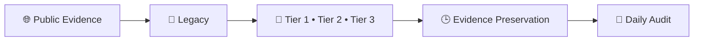

# 👑RIAH Pathway.

**Contributor/Founder/CEO/Chairman: Mariah Dominique Rucker**

There is currently no team. I am building everything myself until I have hired the beta team. I am starting the hiring process this month, **October 2026**, for the CTO, CISO, experiential professionals, PhD-qualified faculty, and adjunct faculty for each school and major, with hiring continuing across the entire ecosystem as it scales.

Beta team members will be hired with **equity participation and compensation during the beta cohort**, which launches in **Spring 2027**.

The website will launch in **October 2026** as I continue to build, develop, revise, and finalize aspects of the RIAH Pathway ecosystem.

Learn more about me on GitHub and LinkedIn, or connect with me through social media and Linktree.

- **GitHub:** https://github.com/mariahdominiquerucker
- **LinkedIn:** https://linkedin.com/in/mariahrucker
- **Facebook:** https://facebook.com/heymariahrucker
- **Instagram:** https://instagram.com/heymariahrucker
- **Linktree:** https://linktr.ee/mariahrucker

---

> **Accreditation Disclosure:** RIAH Pathway is currently pre accredited. Accreditation, approval, designation, endorsement, recognition, and state authorization are being pursued and should not be interpreted as already granted unless formally granted by the applicable organization or regulatory authority.

The repository is structured so contributors can work on individual deliverables without needing to build an entire website page or ecosystem component.

RIAH Pathway remains a **private company ecosystem with applicable proprietary intellectual property**.

Public GitHub development does not make private curriculum, internal systems, confidential information, business methods, security sensitive infrastructure, proprietary materials, or other restricted information unrestricted public property.

---

# 🤖 Legacy — RIAH Pathway Replica Bot

**Legacy** is the RIAH Pathway public-source replica monitoring and evidence-preservation bot. Legacy performs recurring **hourly scans** and **daily evidence audits** against the fixed Tier 1, Tier 2, and Tier 3 RIAH fingerprint, suppresses ordinary prior art, preserves qualifying public evidence and timestamps, verifies accreditation or authorization only from supporting sources, and organizes evidence for human review and the Same-Day Filing workflow.

| Resource | Purpose |
|---|---|
| 🤖 [Legacy — RIAH Pathway Replica Bot](./RIAH-Pathway-Replica-Bot-Legacy.md) | Monitoring purpose, Tier definitions, hourly workflow, daily audit, evidence surfaces, review key, and Replica Bot log. |

> **Review rule:** A Replica Bot flag is an investigative lead, not a legal conclusion. Similarity alone does not establish copying, access, infringement, misconduct, accreditation, or liability.

---

## RIAH INDEPENDENT-BUILD AND ENFORCEMENT NOTICE

RIAH welcomes lawful inspiration, independent development, competition, commentary, and the use of ideas, methods, standards, and other material that the law leaves free for everyone to use. **Inspiration is not authorization to copy, appropriate, or commercially exploit protected RIAH expression, source materials, confidential information, trademarks, code, designs, or other legally protected rights.**

The message is straightforward: **the concept may be familiar; the protected RIAH implementation is not yours to take.** Building one component does not authorize a person or entity to extract protected material from the broader RIAH ecosystem, reproduce protected RIAH components across another system, use protected RIAH materials to construct a competing component, or commercially enrich itself through unauthorized use of protected RIAH assets.

RIAH expects competitors and builders to create their own work. Review RIAH for lawful inspiration if appropriate, but independently design, write, build, price, document, and operate your own products and systems rather than copying protected RIAH materials, including protected implementations of calculators, content, product structures, code, designs, and other proprietary assets.

Legacy detections are investigative leads, not automatic legal conclusions. When Legacy identifies a potentially material match, RIAH may promptly preserve evidence and conduct human and legal review. If that review supports actionable claims, RIAH may pursue available remedies and may seek to prepare or file an appropriate complaint as soon as the same day or next day when legally and procedurally appropriate. The number and type of claims or counts will depend on the evidence, applicable law, ownership, jurisdiction, venue, procedural requirements, and attorney review.

RIAH does not assume that similarity proves copying or liability. Independent creation, prior art, licensed use, public-domain material, unprotectable ideas or methods, and other lawful explanations must be evaluated before any allegation is made. This notice is a statement of rights-preservation and enforcement posture, not an allegation against any particular person or entity.

---

# 👥 At-Scale Positions

The Join Us Downloads structure contains the current RIAH Pathway at-scale position, governance, affiliate, partnership, equity, vesting, staffing, and assignment resources. The table below routes directly to each Markdown file so individual roles and the combined at-scale structures can be accessed from the main repository README.

| Position Category | Position / Resource | Markdown |
|---|---|---|
| Academic Faculty Positions | Adjunct Academic Faculty | [Adjunct Academic Faculty](./RIAH-PATHWAY-WEBSITE-WIREFRAMES-STRUCTURE/16-JOIN-US-WIREFRAME/DOWNLOADS/ACADEMIC-FACULTY-POSITIONS/ADJUNCT-ACADEMIC-FACULTY.md) |
| Academic Faculty Positions | PhD Academic Faculty | [PhD Academic Faculty](./RIAH-PATHWAY-WEBSITE-WIREFRAMES-STRUCTURE/16-JOIN-US-WIREFRAME/DOWNLOADS/ACADEMIC-FACULTY-POSITIONS/PHD-ACADEMIC-FACULTY.md) |
| Affiliates | Affiliates | [Affiliates](./RIAH-PATHWAY-WEBSITE-WIREFRAMES-STRUCTURE/16-JOIN-US-WIREFRAME/DOWNLOADS/AFFILIATES/AFFILIATES.md) |
| At-Scale Resources | All Positions Combined | [All Positions Combined](./RIAH-PATHWAY-WEBSITE-WIREFRAMES-STRUCTURE/16-JOIN-US-WIREFRAME/DOWNLOADS/ALL-POSITIONS-COMBINED.md) |
| Backend Technology Positions | Backend Technology Architect | [Backend Technology Architect](./RIAH-PATHWAY-WEBSITE-WIREFRAMES-STRUCTURE/16-JOIN-US-WIREFRAME/DOWNLOADS/BACKEND-TECHNOLOGY-POSITIONS/BACKEND-TECHNOLOGY-ARCHITECT.md) |
| Backend Technology Positions | Backend Technology Systems Builder | [Backend Technology Systems Builder](./RIAH-PATHWAY-WEBSITE-WIREFRAMES-STRUCTURE/16-JOIN-US-WIREFRAME/DOWNLOADS/BACKEND-TECHNOLOGY-POSITIONS/BACKEND-TECHNOLOGY-SYSTEMS-BUILDER.md) |
| Backend Technology Positions | Frontend Technology Systems Builder | [Frontend Technology Systems Builder](./RIAH-PATHWAY-WEBSITE-WIREFRAMES-STRUCTURE/16-JOIN-US-WIREFRAME/DOWNLOADS/BACKEND-TECHNOLOGY-POSITIONS/FRONTEND-TECHNOLOGY-SYSTEMS-BUILDER.md) |
| Backend Technology Positions | Full-Stack Technology Systems Builder | [Full-Stack Technology Systems Builder](./RIAH-PATHWAY-WEBSITE-WIREFRAMES-STRUCTURE/16-JOIN-US-WIREFRAME/DOWNLOADS/BACKEND-TECHNOLOGY-POSITIONS/FULL-STACK-TECHNOLOGY-SYSTEMS-BUILDER.md) |
| Board of Governance Positions | Board President | [Board President](./RIAH-PATHWAY-WEBSITE-WIREFRAMES-STRUCTURE/16-JOIN-US-WIREFRAME/DOWNLOADS/BOARD-OF-GOVERNANCE-POSITIONS/BOARD-PRESIDENT.md) |
| Board of Governance Positions | Board Secretary | [Board Secretary](./RIAH-PATHWAY-WEBSITE-WIREFRAMES-STRUCTURE/16-JOIN-US-WIREFRAME/DOWNLOADS/BOARD-OF-GOVERNANCE-POSITIONS/BOARD-SECRETARY.md) |
| Board of Governance Positions | Board Treasurer | [Board Treasurer](./RIAH-PATHWAY-WEBSITE-WIREFRAMES-STRUCTURE/16-JOIN-US-WIREFRAME/DOWNLOADS/BOARD-OF-GOVERNANCE-POSITIONS/BOARD-TREASURER.md) |
| Board of Governance Positions | Board Trustee | [Board Trustee](./RIAH-PATHWAY-WEBSITE-WIREFRAMES-STRUCTURE/16-JOIN-US-WIREFRAME/DOWNLOADS/BOARD-OF-GOVERNANCE-POSITIONS/BOARD-TRUSTEE.md) |
| Board of Governance Positions | Board Vice President | [Board Vice President](./RIAH-PATHWAY-WEBSITE-WIREFRAMES-STRUCTURE/16-JOIN-US-WIREFRAME/DOWNLOADS/BOARD-OF-GOVERNANCE-POSITIONS/BOARD-VICE-PRESIDENT.md) |
| Cybersecurity Specialist Positions | Blue Team Specialist | [Blue Team Specialist](./RIAH-PATHWAY-WEBSITE-WIREFRAMES-STRUCTURE/16-JOIN-US-WIREFRAME/DOWNLOADS/CYBERSECURITY-SPECIALIST-POSITIONS/BLUE-TEAM-SPECIALIST.md) |
| Cybersecurity Specialist Positions | Purple Team Specialist | [Purple Team Specialist](./RIAH-PATHWAY-WEBSITE-WIREFRAMES-STRUCTURE/16-JOIN-US-WIREFRAME/DOWNLOADS/CYBERSECURITY-SPECIALIST-POSITIONS/PURPLE-TEAM-SPECIALIST.md) |
| Cybersecurity Specialist Positions | Red Team Specialist | [Red Team Specialist](./RIAH-PATHWAY-WEBSITE-WIREFRAMES-STRUCTURE/16-JOIN-US-WIREFRAME/DOWNLOADS/CYBERSECURITY-SPECIALIST-POSITIONS/RED-TEAM-SPECIALIST.md) |
| At-Scale Resources | Equity and Four-Year Vesting Table | [Equity and Four-Year Vesting Table](./RIAH-PATHWAY-WEBSITE-WIREFRAMES-STRUCTURE/16-JOIN-US-WIREFRAME/DOWNLOADS/EQUITY-AND-FOUR-YEAR-VESTING-TABLE.md) |
| Executive Leadership Positions | Chief Financial Officer | [Chief Financial Officer](./RIAH-PATHWAY-WEBSITE-WIREFRAMES-STRUCTURE/16-JOIN-US-WIREFRAME/DOWNLOADS/EXECUTIVE-LEADERSHIP-POSITIONS/CHIEF-FINANCIAL-OFFICER.md) |
| Executive Leadership Positions | Chief Information Security Officer | [Chief Information Security Officer](./RIAH-PATHWAY-WEBSITE-WIREFRAMES-STRUCTURE/16-JOIN-US-WIREFRAME/DOWNLOADS/EXECUTIVE-LEADERSHIP-POSITIONS/CHIEF-INFORMATION-SECURITY-OFFICER.md) |
| Executive Leadership Positions | Chief Learning Officer | [Chief Learning Officer](./RIAH-PATHWAY-WEBSITE-WIREFRAMES-STRUCTURE/16-JOIN-US-WIREFRAME/DOWNLOADS/EXECUTIVE-LEADERSHIP-POSITIONS/CHIEF-LEARNING-OFFICER.md) |
| Executive Leadership Positions | Chief Operating Officer | [Chief Operating Officer](./RIAH-PATHWAY-WEBSITE-WIREFRAMES-STRUCTURE/16-JOIN-US-WIREFRAME/DOWNLOADS/EXECUTIVE-LEADERSHIP-POSITIONS/CHIEF-OPERATING-OFFICER.md) |
| Executive Leadership Positions | Chief Technology Officer | [Chief Technology Officer](./RIAH-PATHWAY-WEBSITE-WIREFRAMES-STRUCTURE/16-JOIN-US-WIREFRAME/DOWNLOADS/EXECUTIVE-LEADERSHIP-POSITIONS/CHIEF-TECHNOLOGY-OFFICER.md) |
| Experiential Positions | School of Business Experiential Professional | [School of Business Experiential Professional](./RIAH-PATHWAY-WEBSITE-WIREFRAMES-STRUCTURE/16-JOIN-US-WIREFRAME/DOWNLOADS/EXPERIENTIAL-POSITIONS/SCHOOL-OF-BUSINESS-EXPERIENTIAL-PROFESSIONAL.md) |
| Experiential Positions | School of Homeland Security Experiential Professional | [School of Homeland Security Experiential Professional](./RIAH-PATHWAY-WEBSITE-WIREFRAMES-STRUCTURE/16-JOIN-US-WIREFRAME/DOWNLOADS/EXPERIENTIAL-POSITIONS/SCHOOL-OF-HOMELAND-SECURITY-EXPERIENTIAL-PROFESSIONAL.md) |
| Experiential Positions | School of Law Experiential Professional — Remote Bar Review | [School of Law Experiential Professional — Remote Bar Review](./RIAH-PATHWAY-WEBSITE-WIREFRAMES-STRUCTURE/16-JOIN-US-WIREFRAME/DOWNLOADS/EXPERIENTIAL-POSITIONS/SCHOOL-OF-LAW-EXPERIENTIAL-PROFESSIONAL-REMOTE-BAR-REVIEW.md) |
| Experiential Positions | School of Technology Experiential Professional | [School of Technology Experiential Professional](./RIAH-PATHWAY-WEBSITE-WIREFRAMES-STRUCTURE/16-JOIN-US-WIREFRAME/DOWNLOADS/EXPERIENTIAL-POSITIONS/SCHOOL-OF-TECHNOLOGY-EXPERIENTIAL-PROFESSIONAL.md) |
| JD / Non-JD Positions | JD / Non-JD Attorney / Judge Supervisor | [JD / Non-JD Attorney / Judge Supervisor](./RIAH-PATHWAY-WEBSITE-WIREFRAMES-STRUCTURE/16-JOIN-US-WIREFRAME/DOWNLOADS/JD-NON-JD-POSITIONS/JD-NON-JD-ATTORNEY-JUDGE-SUPERVISOR.md) |
| Partnerships | Partnerships Process | [Partnerships Process](./RIAH-PATHWAY-WEBSITE-WIREFRAMES-STRUCTURE/16-JOIN-US-WIREFRAME/DOWNLOADS/PARTNERSHIPS/PARTNERSHIPS-PROCESS.md) |
| Product / Service Positions | Product / Service Professional Contractor | [Product / Service Professional Contractor](./RIAH-PATHWAY-WEBSITE-WIREFRAMES-STRUCTURE/16-JOIN-US-WIREFRAME/DOWNLOADS/PRODUCT-SERVICE-POSITIONS/PRODUCT-SERVICE-PROFESSIONAL-CONTRACTOR.md) |
| Program Director Positions | Program Director — School of Business | [Program Director — School of Business](./RIAH-PATHWAY-WEBSITE-WIREFRAMES-STRUCTURE/16-JOIN-US-WIREFRAME/DOWNLOADS/PROGRAM-DIRECTOR-POSITIONS/PROGRAM-DIRECTOR-SCHOOL-OF-BUSINESS.md) |
| Program Director Positions | Program Director — School of Homeland Security | [Program Director — School of Homeland Security](./RIAH-PATHWAY-WEBSITE-WIREFRAMES-STRUCTURE/16-JOIN-US-WIREFRAME/DOWNLOADS/PROGRAM-DIRECTOR-POSITIONS/PROGRAM-DIRECTOR-SCHOOL-OF-HOMELAND-SECURITY.md) |
| Program Director Positions | Program Director — School of Law | [Program Director — School of Law](./RIAH-PATHWAY-WEBSITE-WIREFRAMES-STRUCTURE/16-JOIN-US-WIREFRAME/DOWNLOADS/PROGRAM-DIRECTOR-POSITIONS/PROGRAM-DIRECTOR-SCHOOL-OF-LAW.md) |
| Program Director Positions | Program Director — School of Technology | [Program Director — School of Technology](./RIAH-PATHWAY-WEBSITE-WIREFRAMES-STRUCTURE/16-JOIN-US-WIREFRAME/DOWNLOADS/PROGRAM-DIRECTOR-POSITIONS/PROGRAM-DIRECTOR-SCHOOL-OF-TECHNOLOGY.md) |
| Project Director Positions | Project Director — School of Business | [Project Director — School of Business](./RIAH-PATHWAY-WEBSITE-WIREFRAMES-STRUCTURE/16-JOIN-US-WIREFRAME/DOWNLOADS/PROJECT-DIRECTOR-POSITIONS/PROJECT-DIRECTOR-SCHOOL-OF-BUSINESS.md) |
| Project Director Positions | Project Director — School of Homeland Security | [Project Director — School of Homeland Security](./RIAH-PATHWAY-WEBSITE-WIREFRAMES-STRUCTURE/16-JOIN-US-WIREFRAME/DOWNLOADS/PROJECT-DIRECTOR-POSITIONS/PROJECT-DIRECTOR-SCHOOL-OF-HOMELAND-SECURITY.md) |
| Project Director Positions | Project Director — School of Law | [Project Director — School of Law](./RIAH-PATHWAY-WEBSITE-WIREFRAMES-STRUCTURE/16-JOIN-US-WIREFRAME/DOWNLOADS/PROJECT-DIRECTOR-POSITIONS/PROJECT-DIRECTOR-SCHOOL-OF-LAW.md) |
| Project Director Positions | Project Director — School of Technology | [Project Director — School of Technology](./RIAH-PATHWAY-WEBSITE-WIREFRAMES-STRUCTURE/16-JOIN-US-WIREFRAME/DOWNLOADS/PROJECT-DIRECTOR-POSITIONS/PROJECT-DIRECTOR-SCHOOL-OF-TECHNOLOGY.md) |
| At-Scale Resources | RIAH Pathway At-Scale Staffing, Assignment & Equity Structure | [RIAH Pathway At-Scale Staffing, Assignment & Equity Structure](./RIAH-PATHWAY-WEBSITE-WIREFRAMES-STRUCTURE/16-JOIN-US-WIREFRAME/DOWNLOADS/RIAH-PATHWAY-AT-SCALE-STAFFING-ASSIGNMENT-EQUITY-STRUCTURE.md) |

---

# 📚 Tuition, Faculty, Experiential & Curriculum Routing

RIAH Pathway's tuition and pricing reference, human-led faculty curriculum framework, experiential structure, and academic curriculum structures are maintained in dedicated repository sections. The routing table below provides direct access to the core pricing, faculty, experiential, GED, high school, general education, school-core, and major curriculum Markdown files.

| Repository Area | Structure / Resource | Markdown |
|---|---|---|
| Tuition, Pricing & Fees | RIAH Pathway Tuition, Pricing & Fees | [RIAH Pathway Tuition, Pricing & Fees](./RIAH-PATHWAY-TUITION-PRICING-FEES/RIAH-PATHWAY-TUITION-PRICING-FEES.md) |
| Faculty Curriculum | RIAH Pathway Faculty Curriculum | [RIAH Pathway Faculty Curriculum](./RIAH-PATHWAY-FACULTY-CURRICULUM/RIAH-PATHWAY-FACULTY-CURRICULUM.md) |
| Experiential Structure | RIAH Pathway Experiential Structure | [RIAH Pathway Experiential Structure](./RIAH-PATHWAY-EXPERIENTIAL-STRUCTURE/EXPERIENTIAL-STRUCTURE.md) |
| GED Curriculum | GED Structure | [GED Structure](./RIAH-PATHWAY-CURRICULUM-STRUCTURE/RIAH-PATHWAY-GED-STRUCTURE/GED-STRUCTURE.md) |
| General Curriculum | All Schools Combined General Structure | [All Schools Combined General Structure](./RIAH-PATHWAY-CURRICULUM-STRUCTURE/RIAH-PATHWAY-GENERAL-STRUCTURE/ALL-SCHOOLS-COMBINED-GENERAL-STRUCTURE.md) |
| High School Curriculum | High School Structure | [High School Structure](./RIAH-PATHWAY-CURRICULUM-STRUCTURE/RIAH-PATHWAY-HIGH-SCHOOL-STRUCTURE/HIGH-SCHOOL-STRUCTURE.md) |
| School of Business | Accounting Structure | [Accounting Structure](./RIAH-PATHWAY-CURRICULUM-STRUCTURE/RIAH-PATHWAY-SCHOOL-OF-BUSINESS-STRUCTURE/ACCOUNTING-STRUCTURE.md) |
| School of Business | Business Management Structure | [Business Management Structure](./RIAH-PATHWAY-CURRICULUM-STRUCTURE/RIAH-PATHWAY-SCHOOL-OF-BUSINESS-STRUCTURE/BUSINESS-MANAGEMENT-STRUCTURE.md) |
| School of Business | Entrepreneurship Structure | [Entrepreneurship Structure](./RIAH-PATHWAY-CURRICULUM-STRUCTURE/RIAH-PATHWAY-SCHOOL-OF-BUSINESS-STRUCTURE/ENTREPRENEURSHIP-STRUCTURE.md) |
| School of Business | Finance Structure | [Finance Structure](./RIAH-PATHWAY-CURRICULUM-STRUCTURE/RIAH-PATHWAY-SCHOOL-OF-BUSINESS-STRUCTURE/FINANCE-STRUCTURE.md) |
| School of Business | School of Business Core | [School of Business Core](./RIAH-PATHWAY-CURRICULUM-STRUCTURE/RIAH-PATHWAY-SCHOOL-OF-BUSINESS-STRUCTURE/SCHOOL-OF-BUSINESS-CORE.md) |
| School of Homeland Security | Governance, Risk & Compliance Structure | [Governance, Risk & Compliance Structure](./RIAH-PATHWAY-CURRICULUM-STRUCTURE/RIAH-PATHWAY-SCHOOL-OF-HOMELAND-SECURITY/GOVERNANCE-RISK-COMPLIANCE-STRUCTURE.md) |
| School of Homeland Security | Intelligence Structure | [Intelligence Structure](./RIAH-PATHWAY-CURRICULUM-STRUCTURE/RIAH-PATHWAY-SCHOOL-OF-HOMELAND-SECURITY/INTELLIGENCE-STRUCTURE.md) |
| School of Homeland Security | Physical Security Structure | [Physical Security Structure](./RIAH-PATHWAY-CURRICULUM-STRUCTURE/RIAH-PATHWAY-SCHOOL-OF-HOMELAND-SECURITY/PHYSICAL-SECURITY-STRUCTURE.md) |
| School of Homeland Security | Private Investigations Structure | [Private Investigations Structure](./RIAH-PATHWAY-CURRICULUM-STRUCTURE/RIAH-PATHWAY-SCHOOL-OF-HOMELAND-SECURITY/PRIVATE-INVESTIGATIONS-STRUCTURE.md) |
| School of Homeland Security | School of Homeland Security Core Structure | [School of Homeland Security Core Structure](./RIAH-PATHWAY-CURRICULUM-STRUCTURE/RIAH-PATHWAY-SCHOOL-OF-HOMELAND-SECURITY/SCHOOL-OF-HOMELAND-CORE-STRUCTURE.md) |
| School of Law | Criminal Justice Structure | [Criminal Justice Structure](./RIAH-PATHWAY-CURRICULUM-STRUCTURE/RIAH-PATHWAY-SCHOOL-OF-LAW-STRUCTURE/CRIMINAL-JUSTICE-STRUCTURE.md) |
| School of Law | JD Structure | [JD Structure](./RIAH-PATHWAY-CURRICULUM-STRUCTURE/RIAH-PATHWAY-SCHOOL-OF-LAW-STRUCTURE/JD-STRUCTURE.md) |
| School of Law | Non-JD Structure | [Non-JD Structure](./RIAH-PATHWAY-CURRICULUM-STRUCTURE/RIAH-PATHWAY-SCHOOL-OF-LAW-STRUCTURE/NON-JD-STRUCTURE.md) |
| School of Law | School of Law Core Structure | [School of Law Core Structure](./RIAH-PATHWAY-CURRICULUM-STRUCTURE/RIAH-PATHWAY-SCHOOL-OF-LAW-STRUCTURE/SCHOOL-OF-LAW-CORE-STRUCTURE.md) |
| School of Technology | Computer Science Structure | [Computer Science Structure](./RIAH-PATHWAY-CURRICULUM-STRUCTURE/RIAH-PATHWAY-SCHOOL-OF-TECHNOLOGY-STRUCTURE/COMPUTER-SCIENCE-STRUCTURE.md) |
| School of Technology | Cybersecurity Structure | [Cybersecurity Structure](./RIAH-PATHWAY-CURRICULUM-STRUCTURE/RIAH-PATHWAY-SCHOOL-OF-TECHNOLOGY-STRUCTURE/CYBERSECURITY-STRUCTURE.md) |
| School of Technology | Data Analytics Structure | [Data Analytics Structure](./RIAH-PATHWAY-CURRICULUM-STRUCTURE/RIAH-PATHWAY-SCHOOL-OF-TECHNOLOGY-STRUCTURE/DATA-ANALYTICS-STRUCTURE.md) |
| School of Technology | Data Science Structure | [Data Science Structure](./RIAH-PATHWAY-CURRICULUM-STRUCTURE/RIAH-PATHWAY-SCHOOL-OF-TECHNOLOGY-STRUCTURE/DATA-SCIENCE-STRUCTURE.md) |
| School of Technology | Program Management Structure | [Program Management Structure](./RIAH-PATHWAY-CURRICULUM-STRUCTURE/RIAH-PATHWAY-SCHOOL-OF-TECHNOLOGY-STRUCTURE/PROGRAM-MANAGEMENT-STRUCTURE.md) |
| School of Technology | Project Management Structure | [Project Management Structure](./RIAH-PATHWAY-CURRICULUM-STRUCTURE/RIAH-PATHWAY-SCHOOL-OF-TECHNOLOGY-STRUCTURE/PROJECT-MANAGEMENT-STRUCTURE.md) |
| School of Technology | School of Technology Core Structure | [School of Technology Core Structure](./RIAH-PATHWAY-CURRICULUM-STRUCTURE/RIAH-PATHWAY-SCHOOL-OF-TECHNOLOGY-STRUCTURE/SCHOOL-OF-TECHNOLOGY-CORE-STRUCTURE.md) |
| School of Technology | Software Development Structure | [Software Development Structure](./RIAH-PATHWAY-CURRICULUM-STRUCTURE/RIAH-PATHWAY-SCHOOL-OF-TECHNOLOGY-STRUCTURE/SOFTWARE-DEVELOPMENT-STRUCTURE.md) |
| School of Technology | Software Engineering Structure | [Software Engineering Structure](./RIAH-PATHWAY-CURRICULUM-STRUCTURE/RIAH-PATHWAY-SCHOOL-OF-TECHNOLOGY-STRUCTURE/SOFTWARE-ENGINEERING-STRUCTURE.md) |

---

# 👥 Contributor Benefit Routing

The contributor-benefit structure is maintained in the repository's Contributor Benefits folder. Rideshare + Delivery are combined, Partners + Partner Employees are combined, Partner Affiliates remain a distinct partner category, and Team Members use the separate Team Member performance / equity structure.

| Category | Description | Markdown |
|---|---|---|
| 👑 Contributor Benefits README | Master benefit rules, shared logic and routing | [Contributor Benefits README](./RIAH-PATHWAY-CONTRIBUTOR-BENEFITS-STRUCTURE/README.md) |
| 👥 Ambassador Master | Roman-numeral consolidated Ambassador master | [Ambassador Master](./RIAH-PATHWAY-CONTRIBUTOR-BENEFITS-STRUCTURE/AMBASSADORS.md) |
| 🤝 Partner & Partner Employee Ambassadors | Combined partner relationship, Partner Employee and partnership-term rules | [Partner & Partner Employee Ambassadors](./RIAH-PATHWAY-CONTRIBUTOR-BENEFITS-STRUCTURE/PARTNER-EMPLOYEES.md) |
| 🎓 Student Ambassadors & Graduates | Completion, graduate and Ambassador milestones | [Student Ambassadors & Graduates](./RIAH-PATHWAY-CONTRIBUTOR-BENEFITS-STRUCTURE/STUDENTS.md) |
| 🔗 Partner Affiliates | Partner-affiliate referral and conversion rules | [Partner Affiliates](./RIAH-PATHWAY-CONTRIBUTOR-BENEFITS-STRUCTURE/AFFILIATES.md) |
| 🎥 Content Creator Ambassadors | Content activity, referral and conversion milestones | [Content Creator Ambassadors](./RIAH-PATHWAY-CONTRIBUTOR-BENEFITS-STRUCTURE/CONTENT-CREATORS.md) |
| 💻 GitHub Contributor Ambassadors | GitHub-specific contribution milestones | [GitHub Contributor Ambassadors](./RIAH-PATHWAY-CONTRIBUTOR-BENEFITS-STRUCTURE/GITHUB-CONTRIBUTORS.md) |
| 🌎 Community Ambassadors | Events, booths, tables, outreach and referral activity | [Community Ambassadors](./RIAH-PATHWAY-CONTRIBUTOR-BENEFITS-STRUCTURE/COMMUNITY-AMBASSADORS.md) |
| 🚗📦 Rideshare & Delivery Ambassadors | Combined rideshare / delivery milestones and shared activities | [Rideshare & Delivery Ambassadors](./RIAH-PATHWAY-CONTRIBUTOR-BENEFITS-STRUCTURE/RIDESHARE-DELIVERY.md) |
| 🍎 Substitute Teacher Ambassadors | Education / community outreach, booths, tables and referrals | [Substitute Teacher Ambassadors](./RIAH-PATHWAY-CONTRIBUTOR-BENEFITS-STRUCTURE/SUBSTITUTE-TEACHERS.md) |
| 👥 Team Members | $0 tuition + 50% eligible-product benefit maintained through daily / weekly / monthly performance, contribution and applicable equity terms | [Team Members](./RIAH-PATHWAY-CONTRIBUTOR-BENEFITS-STRUCTURE/TEAM-MEMBERS.md) |

---

# 👑RIAH Pathway.
