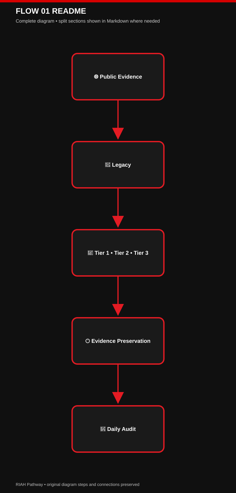
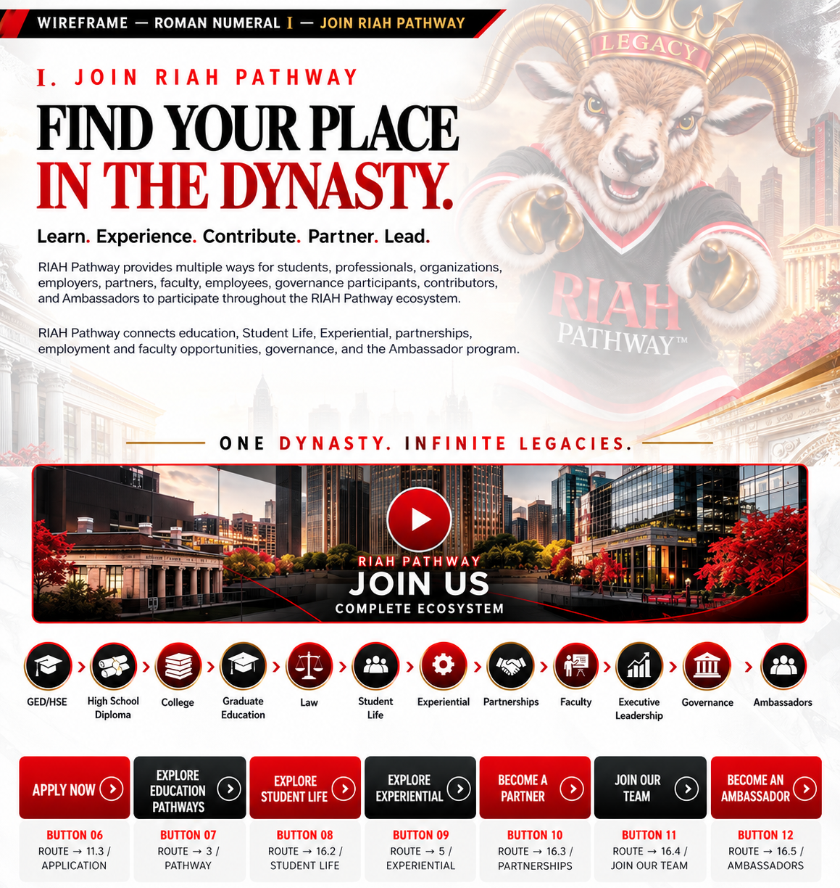
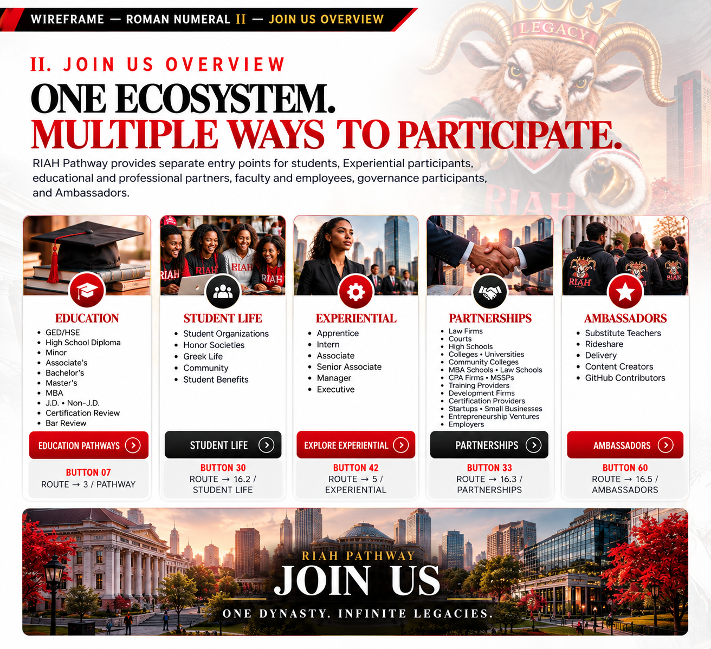
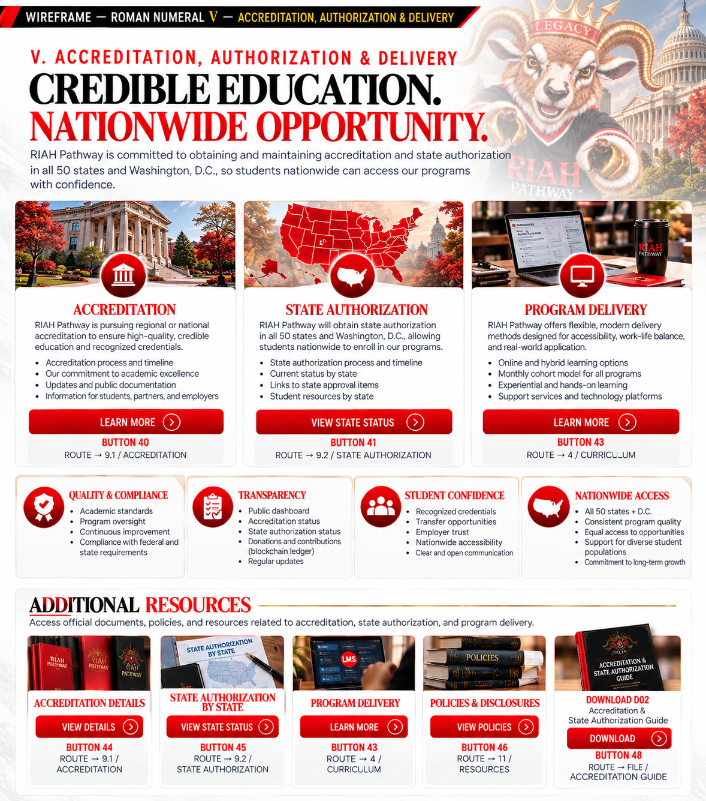
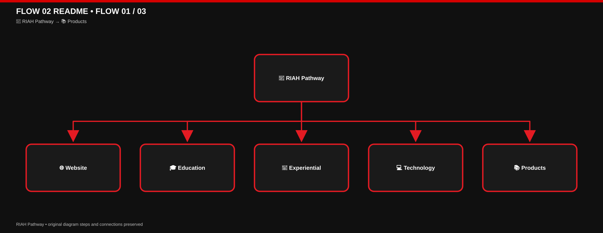
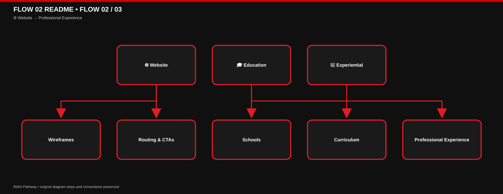
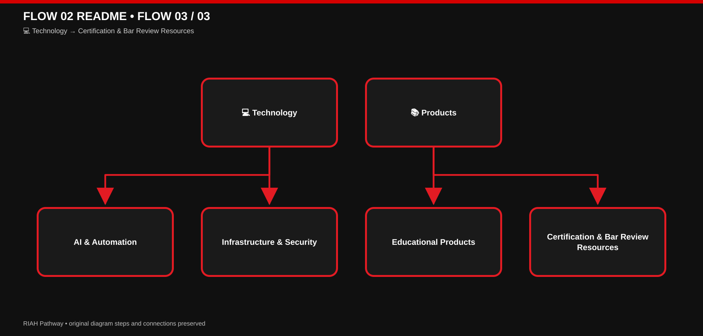

# 👑 RIAH Pathway.

**RIAH Pathway** is an education and workforce development ecosystem connecting academics, experiential development, professional preparation, technology, and career pathways.

**👤 Contributor/Founder/CEO/Chairman: Mariah Dominique Rucker**

  

There is currently no team. I am building everything myself until I have hired the beta team. I am starting the hiring process this month, **October 2026**, for the CTO, CISO, experiential professionals, PhD-qualified faculty, and adjunct faculty for each school and major, with hiring continuing across the entire ecosystem as it scales.

Beta team members will be hired with **equity participation and compensation during the beta cohort**, which launches in **Spring 2027**.

The website will launch in **October 2026** as I continue to build, develop, revise, and finalize aspects of the RIAH Pathway ecosystem.

### 🔗 GitHub, LinkedIn, Social Media & Linktree

Learn more about me on GitHub and LinkedIn, or connect with me through social media and Linktree.

- **GitHub:** https://github.com/mariahdominiquerucker
- **LinkedIn:** https://linkedin.com/in/mariahrucker
- **Facebook:** https://facebook.com/heymariahrucker
- **Instagram:** https://instagram.com/heymariahrucker
- **Linktree:** https://linktr.ee/mariahrucker

## 🎓 Education

### 🔄 In Progress

| Credential | Field | Pathway | Target |
|---|---|---|---|
| 🔄 Bachelor's | Finance | RIAH Pathway | **2029** |
| 🔄 Bachelor's | Cybersecurity | RIAH Pathway | **2029** |
| 🔄 Bachelor's | Intelligence | RIAH Pathway | **2029** |
| 🔄 JD | Law | RIAH Pathway | **2030** |

### ✅ Earned

| Credential | Field | Institution | Year | Verification |
|---|---|---|---|---|
| ✅ MBA | Organizational Management | Eastern University | **2022** | Education verified by the Nevada Board of Education for substitute teaching licensure, July 2026 |
| ✅ B.S. | Computer Science | Central Methodist University | **2019** | [Merit Pages](https://meritpages.com/RuckerMariah) • Nevada Board of Education verification, July 2026 |
| ✅ B.B.A. | Accounting | Kent State University | **2016** | [Merit Pages](https://meritpages.com/MariahRucker) • Nevada Board of Education verification, July 2026 |
| ✅ Minor | International Business Spanish | Kent State University | **2016** | [Merit Pages](https://meritpages.com/MariahRucker) • Nevada Board of Education verification, July 2026 |

## 📚 Professional Certifications

| Certification | Status |
|---|---|
| Certified Fraud Examiner — **CFE** | ✅ Earned |
| (ISC)² Certified in Cybersecurity — **CC** | ✅ Earned |
| Certified Public Accountant — **CPA** | 🔄 In Progress |
| Certified Management Accountant — **CMA** | 🔄 In Progress |
| Certified Internal Auditor — **CIA** | 🔄 In Progress |
| Certified Information Systems Auditor — **CISA** | 🔄 In Progress |
| Certified Information Security Manager — **CISM** | 🔄 In Progress |
| Certified in Risk and Information Systems Control — **CRISC** | 🔄 In Progress |
| Certified Information Systems Security Professional — **CISSP** | 🔄 In Progress |

## 💼 Professional Experience

Professional experience began in **2013** across entrepreneurship, financial services, public accounting, corporate environments, and higher education.

| Sector | Employer |
|---|---|
| 💻 Entrepreneurship | **RIAH** |
| 💳 Financial Services | **JPMorgan Chase** |
| 💳 Financial Services | **PNC Bank** |
| 🧮 Public Accounting | **Ernst & Young** |
| 🧮 Public Accounting | **Grant Thornton** |
| 🏢 Global Corporation | **Nestlé** |
| 🎓 Higher Education | **Kent State University** |

## 🧠 Areas of Experience

| Business & Finance | Technology | Professional |
|---|---|---|
| 🧮 Accounting | 🔐 Cybersecurity | 💼 Consulting |
| 🔍 Audit | 💻 Technology | 👥 Management |
| 📈 Analytics | 🤖 Automation | 🎓 Higher Education |
| 💳 Financial Services | 💻 Development | 💻 Entrepreneurship |
| 🧮 Public Accounting | ⚙️ Implementation | 🏢 Business Operations |

---

# 🗂️ README INDEX & KEY

The README contains unnumbered personal/professional and RIAH Pathway overview sections plus the numbered repository sections. The Roman-numeral sequence begins with Legacy, followed by the Independent-Build & Enforcement Notice, before the At-Scale and remaining repository routing sections.

### Overview Routing

| SECTION | DESCRIPTION |
|---|---|
| [🎓 Education](#profile-education) | Current and earned education included in the organization overview profile. |
| [📚 Professional Certifications](#profile-certifications) | Earned and in-progress professional certifications. |
| [💼 Professional Experience](#profile-professional-experience) | Professional experience across entrepreneurship, financial services, public accounting, corporate environments, and higher education. |
| [🧠 Areas of Experience](#profile-areas-of-experience) | Business, finance, technology, consulting, management, development, and operational experience areas. |
| [🏛️ RIAH Pathway Overview](#overview-riah-pathway) | Ecosystem purpose and principal development areas. |
| [🎓 Education Pathways](#overview-education-pathways) | Current academic, professional, legal, experiential, certification, and continuing-education pathways. |
| [🏫 Schools](#overview-schools) | Current six-school institutional structure. |
| [💼 Experiential Pathway](#overview-experiential) | Progressive Apprentice through Executive experiential structure. |
| [💻 Technology & Development](#overview-technology) | Web, AI, automation, APIs, cybersecurity, infrastructure, data, EdTech, and internal systems. |
| [📂 GitHub & Development Resources](#overview-github) | Current repositories and direct development-resource routing. |
| [🧩 Development Structure](#overview-development-structure) | High-level relationship between website, education, experiential, technology, and products. |
| [📚 Curriculum & Resources](#overview-curriculum-resources) | Current curriculum repositories and public-development boundaries. |
| [🛍️ Products & Professional Resources](#overview-products) | Educational, certification, bar-review, print, and select digital product categories. |
| [🤝 Public Development & Contributors](#overview-contributors) | Current public-development contribution areas without superseding repository-specific terms. |

### Roman-Numeral Repository Index

| KEY | README SECTION | DESCRIPTION |
|---|---|---|
| **I 🤖** | [Legacy — RIAH Pathway Replica Bot](#readme-i-legacy) | Legacy Bot folder routing: monitoring framework, operating instructions, dated run log, public repository notice, and evidence-review workflow. |
| **II ⚖️** | [RIAH Independent-Build & Enforcement Notice](#readme-ii-enforcement) | Rights-preservation, lawful inspiration, independent-development expectations, evidence review, and enforcement posture. |
| **III 👥** | [At-Scale Positions](#readme-iii-positions) | Academic faculty, affiliates, leadership, governance, cybersecurity, technology, experiential, director, partnership, equity, vesting, and at-scale staffing resources. |
| **IV 📚** | [Tuition, Faculty, Experiential & Curriculum Routing](#readme-iv-curriculum) | Tuition and fees, faculty curriculum, experiential structure, GED, high school, general curriculum, school-core curriculum, and major curriculum routing. |
| **V 🧭** | [Website Wireframes](#readme-v-wireframes) | Direct routing to all 19 primary website wireframe folders defined by the website navigation sitemap. |
| **VI 🖼️** | [Example Wireframe — Join Us 17.1–17.5](#readme-vi-example-wireframe) | Visual example of the completed Join Us wireframe family with direct Markdown links, descriptions, and the five repository design images. |
| **VII 🤝** | [Contributor Benefit Routing](#readme-vii-contributor-benefits) | Current contributor-benefit routing for ambassadors, partners, affiliates, students, creators, GitHub contributors, community participants, rideshare and delivery, substitute teachers, and team members. |

### 🔑 KEY

**I–VII** = Numbered README repository sections in current README order.  
**✅** = Earned / complete.  
**🔄** = In progress.  
**🎓** = Education and academic pathways.  
**📚** = Certifications, curriculum, and learning resources.  
**💼** = Professional and experiential experience.  
**🧠** = Areas of experience and expertise.  
**🏛️** = RIAH Pathway ecosystem overview.  
**🏫** = Schools and institutional structure.  
**💻** = Technology and development.  
**📂** = GitHub repositories and development resources.  
**🧩** = Ecosystem development structure.  
**🛍️** = Products and professional resources.  
**🤖** = Legacy monitoring and evidence-preservation system.  
**⚖️** = Independent-build and enforcement notice.  
**👥** = At-scale positions, staffing, and role structures.  
**🧭** = Website sitemap and 1–19 wireframe folder routing.  
**🖼️** = Completed wireframe example with linked Markdown structure and repository design images.  
**🤝** = Contributors, contributor benefits, and participation routing.

---

# I 🤖 Legacy — RIAH Pathway Replica Bot

**Legacy** is the RIAH Pathway public-source replica monitoring and evidence-preservation bot. Legacy performs recurring **hourly scans** and **daily evidence audits** against the fixed Tier 1, Tier 2, and Tier 3 RIAH fingerprint, suppresses ordinary prior art, preserves qualifying public evidence and timestamps, verifies accreditation or authorization only from supporting sources, and organizes evidence for human review and the Same-Day Filing workflow.

| Resource | Purpose |
|---|---|
| 📁 [Legacy Bot folder](./RIAH-PATHWAY-LEGACY-BOT/) | Folder containing all four Legacy Bot Markdown resources, including the monitoring framework, instructions, run log, and public repository notice. |
| 🤖 [Legacy — RIAH Pathway Replica Bot](./RIAH-PATHWAY-LEGACY-BOT/RIAH-PATHWAY-LEGACY-BOT.md) | Main bot purpose, RIAH fingerprint and Tier 1–3 criteria, monitoring cadence, public evidence preservation, daily audit, and human-review escalation. |
| 🧭 [Legacy Bot Instructions](./RIAH-PATHWAY-LEGACY-BOT/RIAH-PATHWAY-LEGACY-BOT-INSTRUCTIONS.md) | Operational instructions for market comparisons, RIAH development status, public-footprint coverage, replication review, and daily bot run rules. |
| 🧾 [Legacy Bot Run Log](./RIAH-PATHWAY-LEGACY-BOT/RIAH-PATHWAY-LEGACY-BOT-RUN-LOG.md) | Dated bot runs with public-market comparisons, evidence coverage, Tier flags, observations, and audit results. |
| ⚠️ [Public Repository Notice](./RIAH-PATHWAY-LEGACY-BOT/RIAH-PATHWAY-PUBLIC-REPOSITORY-NOTICE.md) | Public-access scope, licensed material, intellectual-property protections, and the distinction between independent development and unauthorized reuse. |

[View editable Mermaid diagram](./IMAGES/FLOW-01-README.mmd)

> **Review rule:** A Replica Bot flag is an investigative lead, not a legal conclusion. Similarity alone does not establish copying, access, infringement, misconduct, accreditation, or liability.

---

## II ⚖️ RIAH INDEPENDENT-BUILD AND ENFORCEMENT NOTICE

RIAH welcomes lawful inspiration, independent development, competition, commentary, and the use of ideas, methods, standards, and other material that the law leaves free for everyone to use. **Inspiration is not authorization to copy, appropriate, or commercially exploit protected RIAH expression, source materials, confidential information, trademarks, code, designs, or other legally protected rights.**

The message is straightforward: **the concept may be familiar; the protected RIAH implementation is not yours to take.** Building one component does not authorize a person or entity to extract protected material from the broader RIAH ecosystem, reproduce protected RIAH components across another system, use protected RIAH materials to construct a competing component, or commercially enrich itself through unauthorized use of protected RIAH assets.

RIAH expects competitors and builders to create their own work. Review RIAH for lawful inspiration if appropriate, but independently design, write, build, price, document, and operate your own products and systems rather than copying protected RIAH materials, including protected implementations of calculators, content, product structures, code, designs, and other proprietary assets.

Legacy detections are investigative leads, not automatic legal conclusions. When Legacy identifies a potentially material match, RIAH may promptly preserve evidence and conduct human and legal review. If that review supports actionable claims, RIAH may pursue available remedies and may seek to prepare or file an appropriate complaint as soon as the same day or next day when legally and procedurally appropriate. The number and type of claims or counts will depend on the evidence, applicable law, ownership, jurisdiction, venue, procedural requirements, and attorney review.

RIAH does not assume that similarity proves copying or liability. Independent creation, prior art, licensed use, public-domain material, unprotectable ideas or methods, and other lawful explanations must be evaluated before any allegation is made. This notice is a statement of rights-preservation and enforcement posture, not an allegation against any particular person or entity.

---

# III 👥 At-Scale Positions

The Join Us Downloads structure contains the current RIAH Pathway at-scale position, governance, affiliate, partnership, equity, vesting, staffing, and assignment resources. The table below routes directly to each Markdown file so individual roles and the combined at-scale structures can be accessed from the main repository README.

**Full-scale equity contribution pool:** **2,168 equity-bearing participants** (168 fixed internal team members + 2,000 separately allocated JD/Non-JD attorney/judge supervisors) share a projected **$2,400,000 annual contribution pool** at full capacity. This equals **approximately $1,107.01 annually / $92.25 monthly per participant**, payable on the **15th of each month**, with actual stage contributions recalculated and reconciled against the approved budget and participation. The **168 fixed internal positions** remain unchanged; they are a subset of the 2,168 pool participants. The **48-person / $300,000 Pre-Beta** contribution stage remains distinct.

| Position Category | Position / Resource | Markdown |
|---|---|---|
| Academic Faculty Positions | Adjunct Academic Faculty | [Adjunct Academic Faculty](./RIAH-PATHWAY-WEBSITE-WIREFRAMES-STRUCTURE/17-JOIN-US/DOWNLOADS/ACADEMIC-FACULTY-POSITIONS/ADJUNCT-ACADEMIC-FACULTY.md) |
| Academic Faculty Positions | PhD Academic Faculty | [PhD Academic Faculty](./RIAH-PATHWAY-WEBSITE-WIREFRAMES-STRUCTURE/17-JOIN-US/DOWNLOADS/ACADEMIC-FACULTY-POSITIONS/PHD-ACADEMIC-FACULTY.md) |
| Affiliates | Affiliates | [Affiliates](./RIAH-PATHWAY-WEBSITE-WIREFRAMES-STRUCTURE/17-JOIN-US/DOWNLOADS/AFFILIATES/AFFILIATES.md) |
| At-Scale Resources | All Positions Combined | [All Positions Combined](./RIAH-PATHWAY-WEBSITE-WIREFRAMES-STRUCTURE/17-JOIN-US/DOWNLOADS/ALL-POSITIONS-COMBINED.md) |
| At-Scale Resources | Compensation, Equity, and Benefits | [Compensation, Equity, and Benefits](./RIAH-PATHWAY-WEBSITE-WIREFRAMES-STRUCTURE/17-JOIN-US/DOWNLOADS/COMPENSATION-EQUITY-BENEFITS.md) |
| Backend Technology Positions | Full Stack Technology Architect | [Full Stack Technology Architect](./RIAH-PATHWAY-WEBSITE-WIREFRAMES-STRUCTURE/17-JOIN-US/DOWNLOADS/BACKEND-TECHNOLOGY-POSITIONS/FULL-STACK-TECHNOLOGY-ARCHITECT.md) |
| Backend Technology Positions | Backend Technology Systems Builder | [Backend Technology Systems Builder](./RIAH-PATHWAY-WEBSITE-WIREFRAMES-STRUCTURE/17-JOIN-US/DOWNLOADS/BACKEND-TECHNOLOGY-POSITIONS/BACKEND-TECHNOLOGY-SYSTEMS-BUILDER.md) |
| Backend Technology Positions | Frontend Technology Systems Builder | [Frontend Technology Systems Builder](./RIAH-PATHWAY-WEBSITE-WIREFRAMES-STRUCTURE/17-JOIN-US/DOWNLOADS/BACKEND-TECHNOLOGY-POSITIONS/FRONTEND-TECHNOLOGY-SYSTEMS-BUILDER.md) |
| Backend Technology Positions | Full-Stack Technology Systems Builder | [Full-Stack Technology Systems Builder](./RIAH-PATHWAY-WEBSITE-WIREFRAMES-STRUCTURE/17-JOIN-US/DOWNLOADS/BACKEND-TECHNOLOGY-POSITIONS/FULL-STACK-TECHNOLOGY-SYSTEMS-BUILDER.md) |
| Board of Governance Positions | Board President | [Board President](./RIAH-PATHWAY-WEBSITE-WIREFRAMES-STRUCTURE/17-JOIN-US/DOWNLOADS/BOARD-OF-GOVERNANCE-POSITIONS/BOARD-PRESIDENT.md) |
| Board of Governance Positions | Board Secretary | [Board Secretary](./RIAH-PATHWAY-WEBSITE-WIREFRAMES-STRUCTURE/17-JOIN-US/DOWNLOADS/BOARD-OF-GOVERNANCE-POSITIONS/BOARD-SECRETARY.md) |
| Board of Governance Positions | Board Treasurer | [Board Treasurer](./RIAH-PATHWAY-WEBSITE-WIREFRAMES-STRUCTURE/17-JOIN-US/DOWNLOADS/BOARD-OF-GOVERNANCE-POSITIONS/BOARD-TREASURER.md) |
| Board of Governance Positions | Board Trustee | [Board Trustee](./RIAH-PATHWAY-WEBSITE-WIREFRAMES-STRUCTURE/17-JOIN-US/DOWNLOADS/BOARD-OF-GOVERNANCE-POSITIONS/BOARD-TRUSTEE.md) |
| Board of Governance Positions | Board Vice President | [Board Vice President](./RIAH-PATHWAY-WEBSITE-WIREFRAMES-STRUCTURE/17-JOIN-US/DOWNLOADS/BOARD-OF-GOVERNANCE-POSITIONS/BOARD-VICE-PRESIDENT.md) |
| Cybersecurity Specialist Positions | Blue Team Specialist | [Blue Team Specialist](./RIAH-PATHWAY-WEBSITE-WIREFRAMES-STRUCTURE/17-JOIN-US/DOWNLOADS/CYBERSECURITY-SPECIALIST-POSITIONS/BLUE-TEAM-SPECIALIST.md) |
| Cybersecurity Specialist Positions | Purple Team Specialist | [Purple Team Specialist](./RIAH-PATHWAY-WEBSITE-WIREFRAMES-STRUCTURE/17-JOIN-US/DOWNLOADS/CYBERSECURITY-SPECIALIST-POSITIONS/PURPLE-TEAM-SPECIALIST.md) |
| Cybersecurity Specialist Positions | Red Team Specialist | [Red Team Specialist](./RIAH-PATHWAY-WEBSITE-WIREFRAMES-STRUCTURE/17-JOIN-US/DOWNLOADS/CYBERSECURITY-SPECIALIST-POSITIONS/RED-TEAM-SPECIALIST.md) |
| At-Scale Resources | Equity and Four-Year Vesting Table | [Equity and Four-Year Vesting Table](./RIAH-PATHWAY-WEBSITE-WIREFRAMES-STRUCTURE/17-JOIN-US/DOWNLOADS/EQUITY-AND-FOUR-YEAR-VESTING-TABLE.md) |
| Executive Leadership Positions | Chief Financial Officer | [Chief Financial Officer](./RIAH-PATHWAY-WEBSITE-WIREFRAMES-STRUCTURE/17-JOIN-US/DOWNLOADS/EXECUTIVE-LEADERSHIP-POSITIONS/CHIEF-FINANCIAL-OFFICER.md) |
| Executive Leadership Positions | Chief Information Security Officer | [Chief Information Security Officer](./RIAH-PATHWAY-WEBSITE-WIREFRAMES-STRUCTURE/17-JOIN-US/DOWNLOADS/EXECUTIVE-LEADERSHIP-POSITIONS/CHIEF-INFORMATION-SECURITY-OFFICER.md) |
| Executive Leadership Positions | Chief Learning Officer | [Chief Learning Officer](./RIAH-PATHWAY-WEBSITE-WIREFRAMES-STRUCTURE/17-JOIN-US/DOWNLOADS/EXECUTIVE-LEADERSHIP-POSITIONS/CHIEF-LEARNING-OFFICER.md) |
| Executive Leadership Positions | Chief Operating Officer | [Chief Operating Officer](./RIAH-PATHWAY-WEBSITE-WIREFRAMES-STRUCTURE/17-JOIN-US/DOWNLOADS/EXECUTIVE-LEADERSHIP-POSITIONS/CHIEF-OPERATING-OFFICER.md) |
| Executive Leadership Positions | Chief Technology Officer | [Chief Technology Officer](./RIAH-PATHWAY-WEBSITE-WIREFRAMES-STRUCTURE/17-JOIN-US/DOWNLOADS/EXECUTIVE-LEADERSHIP-POSITIONS/CHIEF-TECHNOLOGY-OFFICER.md) |
| Experiential Positions | School of Business Experiential Professional | [School of Business Experiential Professional](./RIAH-PATHWAY-WEBSITE-WIREFRAMES-STRUCTURE/17-JOIN-US/DOWNLOADS/EXPERIENTIAL-POSITIONS/SCHOOL-OF-BUSINESS-EXPERIENTIAL-PROFESSIONAL.md) |
| Experiential Positions | School of Homeland Security Experiential Professional | [School of Homeland Security Experiential Professional](./RIAH-PATHWAY-WEBSITE-WIREFRAMES-STRUCTURE/17-JOIN-US/DOWNLOADS/EXPERIENTIAL-POSITIONS/SCHOOL-OF-HOMELAND-SECURITY-EXPERIENTIAL-PROFESSIONAL.md) |
| Experiential Positions | School of Law Experiential Professional — Remote Bar Review | [School of Law Experiential Professional — Remote Bar Review](./RIAH-PATHWAY-WEBSITE-WIREFRAMES-STRUCTURE/17-JOIN-US/DOWNLOADS/EXPERIENTIAL-POSITIONS/SCHOOL-OF-LAW-EXPERIENTIAL-PROFESSIONAL-REMOTE-BAR-REVIEW.md) |
| Experiential Positions | School of Technology Experiential Professional | [School of Technology Experiential Professional](./RIAH-PATHWAY-WEBSITE-WIREFRAMES-STRUCTURE/17-JOIN-US/DOWNLOADS/EXPERIENTIAL-POSITIONS/SCHOOL-OF-TECHNOLOGY-EXPERIENTIAL-PROFESSIONAL.md) |
| JD / Non-JD Positions | JD / Non-JD Attorney / Judge Supervisor | [JD / Non-JD Attorney / Judge Supervisor](./RIAH-PATHWAY-WEBSITE-WIREFRAMES-STRUCTURE/17-JOIN-US/DOWNLOADS/JD-NON-JD-POSITIONS/JD-NON-JD-ATTORNEY-JUDGE-SUPERVISOR.md) |
| Partnerships | Partnerships Process | [Partnerships Process](./RIAH-PATHWAY-WEBSITE-WIREFRAMES-STRUCTURE/17-JOIN-US/DOWNLOADS/PARTNERSHIPS/PARTNERSHIPS-PROCESS.md) |
| Product / Service Positions | Product / Service Professional Contractor | [Product / Service Professional Contractor](./RIAH-PATHWAY-WEBSITE-WIREFRAMES-STRUCTURE/17-JOIN-US/DOWNLOADS/PRODUCT-SERVICE-POSITIONS/PRODUCT-SERVICE-PROFESSIONAL-CONTRACTOR.md) |
| Program Director Positions | Program Director — School of Business | [Program Director — School of Business](./RIAH-PATHWAY-WEBSITE-WIREFRAMES-STRUCTURE/17-JOIN-US/DOWNLOADS/PROGRAM-DIRECTOR-POSITIONS/PROGRAM-DIRECTOR-SCHOOL-OF-BUSINESS.md) |
| Program Director Positions | Program Director — School of Homeland Security | [Program Director — School of Homeland Security](./RIAH-PATHWAY-WEBSITE-WIREFRAMES-STRUCTURE/17-JOIN-US/DOWNLOADS/PROGRAM-DIRECTOR-POSITIONS/PROGRAM-DIRECTOR-SCHOOL-OF-HOMELAND-SECURITY.md) |
| Program Director Positions | Program Director — School of Law | [Program Director — School of Law](./RIAH-PATHWAY-WEBSITE-WIREFRAMES-STRUCTURE/17-JOIN-US/DOWNLOADS/PROGRAM-DIRECTOR-POSITIONS/PROGRAM-DIRECTOR-SCHOOL-OF-LAW.md) |
| Program Director Positions | Program Director — School of Technology | [Program Director — School of Technology](./RIAH-PATHWAY-WEBSITE-WIREFRAMES-STRUCTURE/17-JOIN-US/DOWNLOADS/PROGRAM-DIRECTOR-POSITIONS/PROGRAM-DIRECTOR-SCHOOL-OF-TECHNOLOGY.md) |
| Project Director Positions | Project Director — School of Business | [Project Director — School of Business](./RIAH-PATHWAY-WEBSITE-WIREFRAMES-STRUCTURE/17-JOIN-US/DOWNLOADS/PROJECT-DIRECTOR-POSITIONS/PROJECT-DIRECTOR-SCHOOL-OF-BUSINESS.md) |
| Project Director Positions | Project Director — School of Homeland Security | [Project Director — School of Homeland Security](./RIAH-PATHWAY-WEBSITE-WIREFRAMES-STRUCTURE/17-JOIN-US/DOWNLOADS/PROJECT-DIRECTOR-POSITIONS/PROJECT-DIRECTOR-SCHOOL-OF-HOMELAND-SECURITY.md) |
| Project Director Positions | Project Director — School of Law | [Project Director — School of Law](./RIAH-PATHWAY-WEBSITE-WIREFRAMES-STRUCTURE/17-JOIN-US/DOWNLOADS/PROJECT-DIRECTOR-POSITIONS/PROJECT-DIRECTOR-SCHOOL-OF-LAW.md) |
| Project Director Positions | Project Director — School of Technology | [Project Director — School of Technology](./RIAH-PATHWAY-WEBSITE-WIREFRAMES-STRUCTURE/17-JOIN-US/DOWNLOADS/PROJECT-DIRECTOR-POSITIONS/PROJECT-DIRECTOR-SCHOOL-OF-TECHNOLOGY.md) |
| At-Scale Resources | RIAH Pathway At-Scale Staffing, Assignment & Equity Structure | [RIAH Pathway At-Scale Staffing, Assignment & Equity Structure](./RIAH-PATHWAY-WEBSITE-WIREFRAMES-STRUCTURE/17-JOIN-US/DOWNLOADS/RIAH-PATHWAY-AT-SCALE-STAFFING-ASSIGNMENT-EQUITY-STRUCTURE.md) |
| At-Scale Resources | Full-Scale Equity Contribution Pool — **2,168 participants; $2,400,000 annual** | [Full-Scale Contribution Pool Calculation](./RIAH-PATHWAY-WEBSITE-WIREFRAMES-STRUCTURE/17-JOIN-US/DOWNLOADS/RIAH-PATHWAY-AT-SCALE-STAFFING-ASSIGNMENT-EQUITY-STRUCTURE.md#at-scale-contribution-pool--2168-contributors) |

---

# IV 📚 Tuition, Faculty, Experiential & Curriculum Routing

RIAH Pathway's tuition and pricing reference, human-led faculty curriculum framework, experiential structure, and academic curriculum structures are maintained in dedicated repository sections. The routing table below provides direct access to the core pricing, faculty, experiential, GED, high school, general education, school-core, and major curriculum Markdown files.

| Repository Area | Structure / Resource | Markdown |
|---|---|---|
| Tuition, Pricing & Fees | RIAH Pathway Tuition, Pricing & Fees | [RIAH Pathway Tuition, Pricing & Fees](./RIAH-PATHWAY-TUITION-PRICING-FEES-STRUCTURE/RIAH-PATHWAY-TUITION-PRICING-FEES.md) |
| Faculty Curriculum | RIAH Pathway Faculty Curriculum | [RIAH Pathway Faculty Curriculum](./RIAH-PATHWAY-FACULTY-CURRICULUM-STRUCTURE/RIAH-PATHWAY-FACULTY-CURRICULUM.md) |
| Experiential Structure | RIAH Pathway Experiential Structure | [RIAH Pathway Experiential Structure](./RIAH-PATHWAY-EXPERIENTIAL-STRUCTURE/EXPERIENTIAL-STRUCTURE.md) |
| GED Curriculum | GED Structure | [GED Structure](./RIAH-PATHWAY-CURRICULUM-STRUCTURE/RIAH-PATHWAY-GED-STRUCTURE/GED-STRUCTURE.md) |
| General Curriculum | All Schools Combined General Structure | [All Schools Combined General Structure](./RIAH-PATHWAY-CURRICULUM-STRUCTURE/RIAH-PATHWAY-GENERAL-STRUCTURE/ALL-SCHOOLS-COMBINED-GENERAL-STRUCTURE.md) |
| High School Curriculum | High School Structure | [High School Structure](./RIAH-PATHWAY-CURRICULUM-STRUCTURE/RIAH-PATHWAY-HIGH-SCHOOL-STRUCTURE/HIGH-SCHOOL-STRUCTURE.md) |
| School of Business | Accounting Structure | [Accounting Structure](./RIAH-PATHWAY-CURRICULUM-STRUCTURE/RIAH-PATHWAY-SCHOOL-OF-BUSINESS-STRUCTURE/ACCOUNTING-STRUCTURE.md) |
| School of Business | Business Management Structure | [Business Management Structure](./RIAH-PATHWAY-CURRICULUM-STRUCTURE/RIAH-PATHWAY-SCHOOL-OF-BUSINESS-STRUCTURE/BUSINESS-MANAGEMENT-STRUCTURE.md) |
| School of Business | Entrepreneurship Structure | [Entrepreneurship Structure](./RIAH-PATHWAY-CURRICULUM-STRUCTURE/RIAH-PATHWAY-SCHOOL-OF-BUSINESS-STRUCTURE/ENTREPRENEURSHIP-STRUCTURE.md) |
| School of Business | Finance Structure | [Finance Structure](./RIAH-PATHWAY-CURRICULUM-STRUCTURE/RIAH-PATHWAY-SCHOOL-OF-BUSINESS-STRUCTURE/FINANCE-STRUCTURE.md) |
| School of Business | School of Business Core | [School of Business Core](./RIAH-PATHWAY-CURRICULUM-STRUCTURE/RIAH-PATHWAY-SCHOOL-OF-BUSINESS-STRUCTURE/SCHOOL-OF-BUSINESS-CORE.md) |
| School of Homeland Security | Governance, Risk & Compliance Structure | [Governance, Risk & Compliance Structure](./RIAH-PATHWAY-CURRICULUM-STRUCTURE/RIAH-PATHWAY-SCHOOL-OF-HOMELAND-SECURITY/GOVERNANCE-RISK-COMPLIANCE-STRUCTURE.md) |
| School of Homeland Security | Intelligence Structure | [Intelligence Structure](./RIAH-PATHWAY-CURRICULUM-STRUCTURE/RIAH-PATHWAY-SCHOOL-OF-HOMELAND-SECURITY/INTELLIGENCE-STRUCTURE.md) |
| School of Homeland Security | Physical Security Structure | [Physical Security Structure](./RIAH-PATHWAY-CURRICULUM-STRUCTURE/RIAH-PATHWAY-SCHOOL-OF-HOMELAND-SECURITY/PHYSICAL-SECURITY-STRUCTURE.md) |
| School of Homeland Security | Private Investigations Structure | [Private Investigations Structure](./RIAH-PATHWAY-CURRICULUM-STRUCTURE/RIAH-PATHWAY-SCHOOL-OF-HOMELAND-SECURITY/PRIVATE-INVESTIGATIONS-STRUCTURE.md) |
| School of Homeland Security | School of Homeland Security Core Structure | [School of Homeland Security Core Structure](./RIAH-PATHWAY-CURRICULUM-STRUCTURE/RIAH-PATHWAY-SCHOOL-OF-HOMELAND-SECURITY/SCHOOL-OF-HOMELAND-CORE-STRUCTURE.md) |
| School of Law | Criminal Justice Structure | [Criminal Justice Structure](./RIAH-PATHWAY-CURRICULUM-STRUCTURE/RIAH-PATHWAY-SCHOOL-OF-LAW-STRUCTURE/CRIMINAL-JUSTICE-STRUCTURE.md) |
| School of Law | JD Structure | [JD Structure](./RIAH-PATHWAY-CURRICULUM-STRUCTURE/RIAH-PATHWAY-SCHOOL-OF-LAW-STRUCTURE/JD-STRUCTURE.md) |
| School of Law | Non-JD Structure | [Non-JD Structure](./RIAH-PATHWAY-CURRICULUM-STRUCTURE/RIAH-PATHWAY-SCHOOL-OF-LAW-STRUCTURE/NON-JD-STRUCTURE.md) |
| School of Law | School of Law Core Structure | [School of Law Core Structure](./RIAH-PATHWAY-CURRICULUM-STRUCTURE/RIAH-PATHWAY-SCHOOL-OF-LAW-STRUCTURE/SCHOOL-OF-LAW-CORE-STRUCTURE.md) |
| School of Technology | Computer Science Structure | [Computer Science Structure](./RIAH-PATHWAY-CURRICULUM-STRUCTURE/RIAH-PATHWAY-SCHOOL-OF-TECHNOLOGY-STRUCTURE/COMPUTER-SCIENCE-STRUCTURE.md) |
| School of Technology | Cybersecurity Structure | [Cybersecurity Structure](./RIAH-PATHWAY-CURRICULUM-STRUCTURE/RIAH-PATHWAY-SCHOOL-OF-TECHNOLOGY-STRUCTURE/CYBERSECURITY-STRUCTURE.md) |
| School of Technology | Data Analytics Structure | [Data Analytics Structure](./RIAH-PATHWAY-CURRICULUM-STRUCTURE/RIAH-PATHWAY-SCHOOL-OF-TECHNOLOGY-STRUCTURE/DATA-ANALYTICS-STRUCTURE.md) |
| School of Technology | Data Science Structure | [Data Science Structure](./RIAH-PATHWAY-CURRICULUM-STRUCTURE/RIAH-PATHWAY-SCHOOL-OF-TECHNOLOGY-STRUCTURE/DATA-SCIENCE-STRUCTURE.md) |
| School of Technology | Program Management Structure | [Program Management Structure](./RIAH-PATHWAY-CURRICULUM-STRUCTURE/RIAH-PATHWAY-SCHOOL-OF-TECHNOLOGY-STRUCTURE/PROGRAM-MANAGEMENT-STRUCTURE.md) |
| School of Technology | Project Management Structure | [Project Management Structure](./RIAH-PATHWAY-CURRICULUM-STRUCTURE/RIAH-PATHWAY-SCHOOL-OF-TECHNOLOGY-STRUCTURE/PROJECT-MANAGEMENT-STRUCTURE.md) |
| School of Technology | School of Technology Core Structure | [School of Technology Core Structure](./RIAH-PATHWAY-CURRICULUM-STRUCTURE/RIAH-PATHWAY-SCHOOL-OF-TECHNOLOGY-STRUCTURE/SCHOOL-OF-TECHNOLOGY-CORE-STRUCTURE.md) |
| School of Technology | Software Development Structure | [Software Development Structure](./RIAH-PATHWAY-CURRICULUM-STRUCTURE/RIAH-PATHWAY-SCHOOL-OF-TECHNOLOGY-STRUCTURE/SOFTWARE-DEVELOPMENT-STRUCTURE.md) |
| School of Technology | Software Engineering Structure | [Software Engineering Structure](./RIAH-PATHWAY-CURRICULUM-STRUCTURE/RIAH-PATHWAY-SCHOOL-OF-TECHNOLOGY-STRUCTURE/SOFTWARE-ENGINEERING-STRUCTURE.md) |

---

# V 🧭 Website Wireframes

The RIAH Pathway Website Wireframe Structure follows the 20-page primary navigation defined in the repository sitemap. Each row below identifies the numbered main-page wireframe, briefly describes the page purpose, and links directly to its working folder. Placeholder folders contain a `.gitkeep` file so the structure remains available in Git while individual wireframes are developed; **17. JOIN US** routes to the existing completed Join Us wireframe folder.

| WIREFRAME | DESCRIPTION | WIREFRAME NAME |
|---|---|---|
| **1. HOME** | Main website landing page and ecosystem entry point, routing visitors across the full RIAH Pathway experience. | [1. HOME](./RIAH-PATHWAY-WEBSITE-WIREFRAMES-STRUCTURE/1.%20HOME/) |
| **2. ABOUT** | RIAH Pathway ecosystem, schools, leadership, governance, brand, mascot, and institutional identity. | [2. ABOUT](./RIAH-PATHWAY-WEBSITE-WIREFRAMES-STRUCTURE/2.%20ABOUT/) |
| **3. PATHWAY** | Combined pathway hub connecting degree programs, experiential, high school, GED/HSE, certification review, bar review, and schools. | [3. PATHWAY](./RIAH-PATHWAY-WEBSITE-WIREFRAMES-STRUCTURE/3.%20PATHWAY/) |
| **4. DEGREE PROGRAMS** | Degree pathways, schools, associate's, bachelor's, master's, MBA, minor, J.D., and non-J.D. options. | [4. DEGREE PROGRAMS](./RIAH-PATHWAY-WEBSITE-WIREFRAMES-STRUCTURE/4.%20DEGREE%20PROGRAMS/) |
| **5. EXPERIENTIAL** | Experiential levels, durations, schools, learning process, and internal and external placements. | [5. EXPERIENTIAL](./RIAH-PATHWAY-WEBSITE-WIREFRAMES-STRUCTURE/5.%20EXPERIENTIAL/) |
| **6. ENTREPRENEURSHIP** | Startup and small-business experiential programs, levels, durations, curriculum, professional collaboration, and business growth. | [6. ENTREPRENEURSHIP](./RIAH-PATHWAY-WEBSITE-WIREFRAMES-STRUCTURE/6.%20ENTREPRENEURSHIP/) |
| **7. HIGH SCHOOL** | High school diploma program, pathway, curriculum, admissions, authorization, and recognition. | [7. HIGH SCHOOL](./RIAH-PATHWAY-WEBSITE-WIREFRAMES-STRUCTURE/7.%20HIGH%20SCHOOL/) |
| **8. GED-HSE** | GED/HSE program, pathway, curriculum and preparation, and admissions. | [8. GED-HSE](./RIAH-PATHWAY-WEBSITE-WIREFRAMES-STRUCTURE/8.%20GED-HSE/) |
| **9. CERTIFICATION REVIEW** | Certification review, certification mapping, school-aligned reviews, and Basic, Standard, and Premium tiers. | [9. CERTIFICATION REVIEW](./RIAH-PATHWAY-WEBSITE-WIREFRAMES-STRUCTURE/9.%20CERTIFICATION%20REVIEW/) |
| **10. BAR REVIEW** | Bar review, 50-state coverage, state modules, California Baby Bar, and Basic, Standard, and Premium tiers. | [10. BAR REVIEW](./RIAH-PATHWAY-WEBSITE-WIREFRAMES-STRUCTURE/10.%20BAR%20REVIEW/) |
| **11. CURRICULUM** | Academic structures, school curriculum, majors, degree-level curriculum, experiential curriculum, review curriculum, and curriculum architecture. | [11. CURRICULUM](./RIAH-PATHWAY-WEBSITE-WIREFRAMES-STRUCTURE/11.%20CURRICULUM/) |
| **12. ADMISSIONS** | Pre-admissions, application, acceptance, enrollment, onboarding, student experience, graduation, alumni, and transfer routing. | [12. ADMISSIONS](./RIAH-PATHWAY-WEBSITE-WIREFRAMES-STRUCTURE/12.%20ADMISSIONS/) |
| **13. TUITION** | Tuition, fees, payment options, funding, reimbursement, costs, and the pricing calculator engine. | [13. TUITION](./RIAH-PATHWAY-WEBSITE-WIREFRAMES-STRUCTURE/13.%20TUITION/) |
| **14. DONATIONS** | Donations routing for the Foundation, accreditation support, and state authorization support. | [14. DONATIONS](./RIAH-PATHWAY-WEBSITE-WIREFRAMES-STRUCTURE/14.%20DONATIONS/) |
| **15. PRODUCTS & SERVICES** | Product catalog, certification and bar review products, collections, bundles, and pricing. | [15. PRODUCTS & SERVICES](./RIAH-PATHWAY-WEBSITE-WIREFRAMES-STRUCTURE/15.%20PRODUCTS-AND-SERVICES/) |
| **16. ACCREDITATION & AUTHORIZATION** | Accreditation and authorization status across experiential, academic, high school, GED/HSE, and state authorization pathways. | [16. ACCREDITATION & AUTHORIZATION](./RIAH-PATHWAY-WEBSITE-WIREFRAMES-STRUCTURE/16.%20ACCREDITATION%20%26%20AUTHORIZATION/) |
| **17. JOIN US** | Join Us positions, public benefits, individual and dual-role equity, monthly accrual, annual vesting checkpoints and stage-specific revenue percentages. | [17. JOIN US](./RIAH-PATHWAY-WEBSITE-WIREFRAMES-STRUCTURE/17-JOIN-US/) |
| **18. RESOURCES** | Events, blog, podcasts, conferences, workshops, webinars, policies, procedures, and guidelines. | [18. RESOURCES](./RIAH-PATHWAY-WEBSITE-WIREFRAMES-STRUCTURE/18.%20RESOURCES/) |
| **19. FAQ** | Frequently asked questions across pathways, curriculum, admissions, tuition, accreditation, student experience, products, and technical support. | [19. FAQ](./RIAH-PATHWAY-WEBSITE-WIREFRAMES-STRUCTURE/19.%20FAQ/) |
| **20. CONTACT** | Contact routing for admissions, human resources, technical support, student support, products, partnerships, and general inquiries. | [20. CONTACT](./RIAH-PATHWAY-WEBSITE-WIREFRAMES-STRUCTURE/20.%20CONTACT/) |

---

# VI 🖼️ Example Wireframe — Join Us 17.1–17.5

The completed **Join Us** wireframe family provides a visual example of how RIAH Pathway main-page and subpage wireframes are structured in the repository. Each example below links directly to its source Markdown file, summarizes the purpose of that wireframe, and displays the corresponding design image maintained in the Join Us `IMAGES` folder.

## 17.1 — Join Us Wireframe Main

**Wireframe:** [17.1 Join Us Wireframe Main](./RIAH-PATHWAY-WEBSITE-WIREFRAMES-STRUCTURE/17-JOIN-US/17.1-JOIN-US-WIREFRAME-MAIN.md)

The main Join Us wireframe introduces the complete participation ecosystem and routes students, professionals, organizations, employers, partners, faculty, employees, governance participants, contributors, and Ambassadors into the appropriate RIAH Pathway experience. It connects education pathways, Student Life, Experiential, partnerships, Join Our Team, and Ambassadors from one central page.

## 17.2 — Student Life Wireframe

**Wireframe:** [17.2 Student Life Wireframe](./RIAH-PATHWAY-WEBSITE-WIREFRAMES-STRUCTURE/17-JOIN-US/17.2-STUDENT-LIFE-WIREFRAME.md)

The Student Life wireframe organizes the student-facing community experience around institutional identity, organizations, honor societies, Greek Life, community, Ambassadors, events, benefits, student recognition, career services, opportunities, and connection across the RIAH Pathway schools.

## 17.3 — Partnerships Wireframe

**Wireframe:** [17.3 Partnerships Wireframe](./RIAH-PATHWAY-WEBSITE-WIREFRAMES-STRUCTURE/17-JOIN-US/17.3-PARTNERSHIPS-WIREFRAME.md)

The Partnerships wireframe routes educational and professional organizations into the RIAH Pathway partnership ecosystem, including law firms, courts, schools, colleges, universities, professional firms, training and certification providers, startups, small businesses, entrepreneurship ventures, and employers.

## 17.4 — Join Our Team Wireframe

**Wireframe:** [17.4 Join Our Team Wireframe](./RIAH-PATHWAY-WEBSITE-WIREFRAMES-STRUCTURE/17-JOIN-US/17.4-JOIN-OUR-TEAM-WIREFRAME.md)

The Join Our Team wireframe presents the phased team-building structure for executive leadership, governance, academic faculty, experiential professionals, technical professionals, credential professionals, legal professionals, career resources, and the Beta Core Team while routing candidates to the appropriate opportunities and application pathways.

## 17.5 — Ambassadors Wireframe

**Wireframe:** [17.5 Ambassadors Wireframe](./RIAH-PATHWAY-WEBSITE-WIREFRAMES-STRUCTURE/17-JOIN-US/17.5-AMBASSADORS-WIREFRAME.md)

The Ambassadors wireframe presents the RIAH Pathway Ambassador structure for Substitute Teachers, Rideshare participants, Delivery participants, Content Creators, and GitHub Contributors, with routing to each Ambassador type and its applicable participation and benefits resources.

---

# VII 🤝 Contributor Benefit Routing

The contributor-benefit structure is maintained in the repository's Contributor Benefits folder. Rideshare + Delivery are combined, Partners + Partner Employees are combined, Partner Affiliates remain a distinct partner category, and Team Members use the separate Team Member performance / equity structure.

| Category | Description | Markdown |
|---|---|---|
| 👑 Contributor Benefits README | Master benefit rules, shared logic and routing | [Contributor Benefits README](./RIAH-PATHWAY-CONTRIBUTOR-BENEFITS-STRUCTURE/README.md) |
| 👥 Ambassador Master | Roman-numeral consolidated Ambassador master | [Ambassador Master](./RIAH-PATHWAY-CONTRIBUTOR-BENEFITS-STRUCTURE/AMBASSADORS.md) |
| 🤝 Partner & Partner Employee Ambassadors | Combined partner relationship, Partner Employee and partnership-term rules | [Partner & Partner Employee Ambassadors](./RIAH-PATHWAY-CONTRIBUTOR-BENEFITS-STRUCTURE/PARTNER-EMPLOYEES.md) |
| 🎓 Student Ambassadors & Graduates | Completion, graduate and Ambassador milestones | [Student Ambassadors & Graduates](./RIAH-PATHWAY-CONTRIBUTOR-BENEFITS-STRUCTURE/STUDENTS.md) |
| 🔗 Partner Affiliates | Partner-affiliate referral and conversion rules | [Partner Affiliates](./RIAH-PATHWAY-CONTRIBUTOR-BENEFITS-STRUCTURE/AFFILIATES.md) |
| 🎥 Content Creator Ambassadors | Content activity, referral and conversion milestones | [Content Creator Ambassadors](./RIAH-PATHWAY-CONTRIBUTOR-BENEFITS-STRUCTURE/CONTENT-CREATORS.md) |
| 💻 GitHub Contributor Ambassadors | GitHub-specific contribution milestones | [GitHub Contributor Ambassadors](./RIAH-PATHWAY-CONTRIBUTOR-BENEFITS-STRUCTURE/GITHUB-CONTRIBUTORS.md) |
| 🌎 Community Ambassadors | Events, booths, tables, outreach and referral activity | [Community Ambassadors](./RIAH-PATHWAY-CONTRIBUTOR-BENEFITS-STRUCTURE/COMMUNITY-AMBASSADORS.md) |
| 🚗📦 Rideshare & Delivery Ambassadors | Combined rideshare / delivery milestones and shared activities | [Rideshare & Delivery Ambassadors](./RIAH-PATHWAY-CONTRIBUTOR-BENEFITS-STRUCTURE/RIDESHARE-DELIVERY.md) |
| 🍎 Substitute Teacher Ambassadors | Education / community outreach, booths, tables and referrals | [Substitute Teacher Ambassadors](./RIAH-PATHWAY-CONTRIBUTOR-BENEFITS-STRUCTURE/SUBSTITUTE-TEACHERS.md) |
| 👥 Team Members | $0 tuition + 50% eligible-product benefit maintained through daily / weekly / monthly performance, contribution and applicable equity terms | [Team Members](./RIAH-PATHWAY-CONTRIBUTOR-BENEFITS-STRUCTURE/TEAM-MEMBERS.md) |

---

## 🏛️ RIAH Pathway Overview

RIAH Pathway connects education, experiential development, professional preparation, technology, certification preparation, career development, and entrepreneurship within one developing ecosystem.

This GitHub repository supports development of RIAH Pathway's website, wireframes, curriculum structures, tuition and pricing resources, experiential structure, faculty curriculum, contributor resources, documentation, workflows, and supporting systems.

| Area | Focus |
|---|---|
| 🎓 **Education** | Academic and professional pathways |
| 💼 **Experience** | Progressive experiential development |
| 📚 **Certifications** | Professional and certification preparation |
| 💻 **Technology** | Websites, AI, automation, systems, and integrations |
| 🔐 **Cybersecurity** | Security-focused technology development |
| 🧠 **Curriculum** | Curriculum structures and educational resources |
| 🛍️ **Products** | Educational and professional products |
| 🤝 **Contributors** | Public development and collaborative participation |
| 🚀 **Career** | Professional development and career pathways |
| 👑 **Entrepreneurship** | Business development and independent pathways |

## 🎓 Education Pathways

**School of Foundations:** RIAH diploma = eligible grade 8→9 entrants only; existing grades 9–12 students stay at their current high school for diploma and may use RIAH college dual enrollment. GED/HSE = pre-launch high school dropouts without diploma or GED only; dropping out after launch does not establish eligibility. Eligible new ninth graders and eligible previous dropouts may select concurrent college credit.

| Pathway | Purpose |
|---|---|
| 🎓 **High School** | RIAH diploma starts only for eligible grade 8→9 entrants; existing high school students stay at their school and may take RIAH college dual enrollment |
| 📘 **GED / HSE** | Second chance only for pre-launch dropouts without diploma/GED; optional concurrent college credits; no GED admission for post-launch withdrawal |
| 📚 **Certificates** | Focused educational credentials |
| 🎓 **Associate's** | Undergraduate education |
| 🎓 **Bachelor's** | Undergraduate education |
| 📖 **Minor** | Supplemental academic specialization |
| 🎓 **Master's / MBA** | Graduate education |
| ⚖️ **J.D.** | Law degree pathway |
| ⚖️ **Non-J.D. Bar License** | Applicable non-J.D. legal pathway |
| 💼 **Experiential** | Progressive professional experience |
| 📚 **Certification Review** | Professional certification preparation |
| ⚖️ **Bar Review** | Bar and applicable Baby Bar preparation |
| 📖 **Continuing Education** | Ongoing professional development |

## 🏫 Schools

| School | Focus |
|---|---|
| 👑 **School of Business** | Business, accounting, finance, management, and entrepreneurship |
| 💻 **School of Technology** | Technology, cybersecurity, computing, data, software, project, and program disciplines |
| ⚖️ **School of Law** | Legal education, criminal justice, J.D., non-J.D., and bar preparation |
| 🛡️ **School of Homeland Security** | Homeland security, GRC, intelligence, physical security, and investigations |
| 📚 **School of Foundations** | High School and GED/HSE pathways |
| 💼 **Experiential School** | Applied progressive professional experience |

## 💼 Experiential Pathway

The experiential pathway connects education with progressive professional experience.

| Level | Duration |
|---|---:|
| 🌱 **Apprentice** | 1 Month |
| 💼 **Intern** | 3 Months |
| 📈 **Associate** | 1 Year |
| ⭐ **Senior Associate** | 1 Year |
| 👥 **Manager** | 1 Year |
| 👑 **Executive** | 1 Year |

## 💻 Technology & Development

| Technology Area | Development Focus |
|---|---|
| 🌐 **Web** | Websites and digital experiences |
| 🤖 **AI** | AI systems and agents |
| ⚙️ **Automation** | Automated workflows and operations |
| 🔗 **APIs** | Integrations and connected systems |
| 🔐 **Cybersecurity** | Security and access controls |
| ☁️ **Infrastructure** | Servers, cloud, and platform infrastructure |
| 📊 **Data** | Databases, analytics, and reporting |
| 🎓 **EdTech** | Education technology |
| 🛠️ **Internal Systems** | Operational applications and tools |

## 📂 GitHub & Development Resources

| Repository | Purpose |
|---|---|
| 🌐 **[Website-Draft](https://github.com/RIAHPathway/Website-Draft)** | Website development, wireframes, curriculum structures, pricing resources, contributor documentation, experiential resources, and ecosystem planning |
| 👑 **[.github](https://github.com/RIAHPathway/.github)** | GitHub organization profile and organization-level configuration |

| Development Resource | View |
|---|---|
| 🖥️ **Website Wireframes** | [Open Folder](./RIAH-PATHWAY-WEBSITE-WIREFRAMES-STRUCTURE/) |
| 🗺️ **Navigation & Sitemap** | [View Structure](./RIAH-PATHWAY-WEBSITE-WIREFRAMES-STRUCTURE/RIAH-PATHWAY-WEBSITE-NAVIGATION-SITEMAP.md) |
| 🔗 **Routing, Links & CTAs** | [View Routing](./RIAH-PATHWAY-WEBSITE-WIREFRAMES-STRUCTURE/RIAH-PATHWAY-COMBINED-ROUTING-LINKS-CTA-BUTTONS.md) |
| 📚 **Curriculum Structure** | [Open Curriculum](./RIAH-PATHWAY-CURRICULUM-STRUCTURE/) |
| 💰 **Tuition & Pricing** | [Open Tuition](./RIAH-PATHWAY-TUITION-PRICING-FEES-STRUCTURE/) |
| 💼 **Experiential Structure** | [Open Experiential](./RIAH-PATHWAY-EXPERIENTIAL-STRUCTURE/) |
| 🎓 **Faculty Curriculum** | [Open Faculty Curriculum](./RIAH-PATHWAY-FACULTY-CURRICULUM-STRUCTURE/) |
| 🤝 **Contributor Benefits** | [Open Contributor Structure](./RIAH-PATHWAY-CONTRIBUTOR-BENEFITS-STRUCTURE/) |

## 🧩 Development Structure

#### Mermaid Flow 01 — 🧩 Development Structure (Part 1 of 6)

[View editable Mermaid Flow 01](./IMAGES/FLOW-02-README-PART-01.mmd)

#### Mermaid Flow 02 — 🧩 Development Structure (Part 2 of 6)

[View editable Mermaid Flow 02](./IMAGES/FLOW-02-README-PART-01.mmd)

#### Mermaid Flow 03 — 🧩 Development Structure (Part 3 of 6)

[View editable Mermaid Flow 03](./IMAGES/FLOW-02-README-PART-02.mmd)

#### Mermaid Flow 04 — 🧩 Development Structure (Part 4 of 6)

[View editable Mermaid Flow 04](./IMAGES/FLOW-02-README-PART-02.mmd)

#### Mermaid Flow 05 — 🧩 Development Structure (Part 5 of 6)

[View editable Mermaid Flow 05](./IMAGES/FLOW-02-README-PART-03.mmd)

#### Mermaid Flow 06 — 🧩 Development Structure (Part 6 of 6)

[View editable Mermaid Flow 06](./IMAGES/FLOW-02-README-PART-03.mmd)

[View editable Mermaid diagram](./IMAGES/FLOW-02-README.mmd)

## 📚 Curriculum & Resources

Public GitHub resources may support eligible development of curriculum structures, documentation, course resources, technical exercises, labs, certification resources, study materials, policies, templates, and educational media.

| Curriculum Area | Repository |
|---|---|
| 📘 **GED** | [View Structure](./RIAH-PATHWAY-CURRICULUM-STRUCTURE/RIAH-PATHWAY-GED-STRUCTURE/) |
| 📚 **General Curriculum** | [View Structure](./RIAH-PATHWAY-CURRICULUM-STRUCTURE/RIAH-PATHWAY-GENERAL-STRUCTURE/) |
| 🎓 **High School** | [View Structure](./RIAH-PATHWAY-CURRICULUM-STRUCTURE/RIAH-PATHWAY-HIGH-SCHOOL-STRUCTURE/) |
| 💼 **Business** | [View Structure](./RIAH-PATHWAY-CURRICULUM-STRUCTURE/RIAH-PATHWAY-SCHOOL-OF-BUSINESS-STRUCTURE/) |
| 💻 **Technology** | [View Structure](./RIAH-PATHWAY-CURRICULUM-STRUCTURE/RIAH-PATHWAY-SCHOOL-OF-TECHNOLOGY-STRUCTURE/) |
| ⚖️ **Law** | [View Structure](./RIAH-PATHWAY-CURRICULUM-STRUCTURE/RIAH-PATHWAY-SCHOOL-OF-LAW-STRUCTURE/) |
| 🛡️ **Homeland Security** | [View Structure](./RIAH-PATHWAY-CURRICULUM-STRUCTURE/RIAH-PATHWAY-SCHOOL-OF-HOMELAND-SECURITY/) |

> 🔐 Public GitHub development does not mean all RIAH Pathway curriculum, internal systems, infrastructure, business information, or intellectual property is public or unrestricted.

## 🛍️ Products & Professional Resources

| Category | Examples |
|---|---|
| 📚 **Textbooks / Books** | Educational and professional learning |
| 📝 **Workbooks** | Applied learning activities |
| 📖 **Study Guides** | Academic and certification preparation |
| 🗂️ **Flashcards** | Study and review resources |
| 📓 **Journals & Planners** | Academic and professional organization |
| 📚 **Certification Review** | Professional certification preparation |
| ⚖️ **Bar Review** | Legal examination preparation |
| 🧰 **Toolkits & Student Resources** | Professional and academic support resources |
| 💻 **Digital Products** | Select digital resources |
| 📦 **Print Products** | Primary physical product format |

**Primary format:** Physical / printed  
**Digital format:** Select products and resources

## 🤝 Public Development & Contributors

RIAH Pathway public development may include eligible participation from developers, students, educators, designers, cybersecurity professionals, researchers, curriculum contributors, content creators, business professionals, and community contributors.

| Contribution Area | Examples |
|---|---|
| 💻 **Development** | Features, code, and technical improvements |
| 🌐 **Website** | UI, UX, accessibility, wireframes, routing, and content implementation |
| 🔐 **Security** | Eligible security improvements |
| 🤖 **Automation** | Workflows and integrations |
| 📚 **Education** | Eligible curriculum structures and documentation |
| 🎨 **Creative** | Graphics and digital assets |
| 🔬 **Research** | Research and testing |
| 🌎 **Community** | Resources and ecosystem improvements |

Repository-specific requirements, licenses, contribution terms, intellectual-property protections, and current contributor-benefit rules apply.

---

> **🛡️ Accreditation Disclosure:** RIAH Pathway is currently pre accredited. Accreditation, approval, designation, endorsement, recognition, and state authorization are being pursued and should not be interpreted as already granted unless formally granted by the applicable organization or regulatory authority.

The repository is structured so contributors can work on individual deliverables without needing to build an entire website page or ecosystem component.

RIAH Pathway remains a **private company ecosystem with applicable proprietary intellectual property**.

Public GitHub development does not make private curriculum, internal systems, confidential information, business methods, security sensitive infrastructure, proprietary materials, or other restricted information unrestricted public property.

---

# 👑RIAH Pathway.
