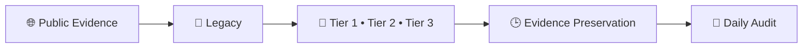

# 👑RIAH Pathway.

**Contributor; Mariah Dominique Rucker.**

There is currently no team. I am building everything myself until I have hired the beta team. I am starting the hiring process this month, **October 2026**, for the CTO, CISO, experiential professionals, PhD-qualified faculty, and adjunct faculty for each school and major, with hiring continuing across the entire ecosystem as it scales.

Beta team members will be hired with **equity participation and compensation during the beta cohort**, which launches in **Spring 2027**.

The website will launch in **October 2026** as I continue to build, develop, revise, and finalize aspects of the RIAH Pathway ecosystem.

Learn more about me on GitHub and LinkedIn, or connect with me through social media and Linktree.

- **GitHub:** https://github.com/mariahdominiquerucker
- **LinkedIn:** https://linkedin.com/in/mariahrucker
- **Facebook:** https://facebook.com/heymariahrucker
- **Instagram:** https://instagram.com/heymariahrucker
- **Linktree:** https://linktr.ee/mariahrucker

---

> **Accreditation Disclosure:** RIAH Pathway is currently pre accredited. Accreditation, approval, designation, endorsement, recognition, and state authorization are being pursued and should not be interpreted as already granted unless formally granted by the applicable organization or regulatory authority.

The repository is structured so contributors can work on individual deliverables without needing to build an entire website page or ecosystem component.

RIAH Pathway remains a **private company ecosystem with applicable proprietary intellectual property**.

Public GitHub development does not make private curriculum, internal systems, confidential information, business methods, security sensitive infrastructure, proprietary materials, or other restricted information unrestricted public property.

---

# 🤖 Legacy — RIAH Pathway Replica Bot

**Legacy** is the RIAH Pathway public-source replica-monitoring and evidence-preservation bot. Legacy performs recurring **hourly scans** and **daily evidence audits** against the fixed Tier 1, Tier 2, and Tier 3 RIAH fingerprint, suppresses ordinary prior art, preserves qualifying public evidence and timestamps, verifies accreditation or authorization only from supporting sources, and organizes evidence for human review and the Same-Day Filing workflow.

| Resource | Purpose |
|---|---|
| 🤖 [Legacy — RIAH Pathway Replica Bot](./RIAH-Pathway-Replica-Bot-Legacy.md) | Monitoring purpose, Tier definitions, hourly workflow, daily audit, evidence surfaces, review key, and Replica Bot log. |

> **Review rule:** A Replica Bot flag is an investigative lead, not a legal conclusion. Similarity alone does not establish copying, access, infringement, misconduct, accreditation, or liability.

---

## RIAH INDEPENDENT-BUILD AND ENFORCEMENT NOTICE

RIAH welcomes lawful inspiration, independent development, competition, commentary, and the use of ideas, methods, standards, and other material that the law leaves free for everyone to use. **Inspiration is not authorization to copy, appropriate, or commercially exploit protected RIAH expression, source materials, confidential information, trademarks, code, designs, or other legally protected rights.**

The message is straightforward: **the concept may be familiar; the protected RIAH implementation is not yours to take.** Building one component does not authorize a person or entity to extract protected material from the broader RIAH ecosystem, reproduce protected RIAH components across another system, use protected RIAH materials to construct a competing component, or commercially enrich itself through unauthorized use of protected RIAH assets.

RIAH expects competitors and builders to create their own work. Review RIAH for lawful inspiration if appropriate, but independently design, write, build, price, document, and operate your own products and systems rather than copying protected RIAH materials, including protected implementations of calculators, content, product structures, code, designs, and other proprietary assets.

Legacy detections are investigative leads, not automatic legal conclusions. When Legacy identifies a potentially material match, RIAH may promptly preserve evidence and conduct human and legal review. If that review supports actionable claims, RIAH may pursue available remedies and may seek to prepare or file an appropriate complaint as soon as the same day or next day when legally and procedurally appropriate. The number and type of claims or counts will depend on the evidence, applicable law, ownership, jurisdiction, venue, procedural requirements, and attorney review.

RIAH does not assume that similarity proves copying or liability. Independent creation, prior art, licensed use, public-domain material, unprotectable ideas or methods, and other lawful explanations must be evaluated before any allegation is made. This notice is a statement of rights-preservation and enforcement posture, not an allegation against any particular person or entity.

---

# 👥 Contributor Benefit Routing

The contributor-benefit structure is maintained in the repository's Contributor Benefits folder. Rideshare + Delivery are combined, Partners + Partner Employees are combined, Partner Affiliates remain a distinct partner category, and Team Members use the separate Team Member performance / equity structure.

| Category | Description | Markdown |
|---|---|---|
| 👑 Contributor Benefits README | Master benefit rules, shared logic and routing | [Contributor Benefits README](./RIAH-PATHWAY-CONTRIBUTOR-BENEFITS-STRUCTURE/README.md) |
| 👥 Ambassador Master | Roman-numeral consolidated Ambassador master | [Ambassador Master](./RIAH-PATHWAY-CONTRIBUTOR-BENEFITS-STRUCTURE/AMBASSADORS.md) |
| 🤝 Partner & Partner Employee Ambassadors | Combined partner relationship, Partner Employee and partnership-term rules | [Partner & Partner Employee Ambassadors](./RIAH-PATHWAY-CONTRIBUTOR-BENEFITS-STRUCTURE/PARTNER-EMPLOYEES.md) |
| 🎓 Student Ambassadors & Graduates | Completion, graduate and Ambassador milestones | [Student Ambassadors & Graduates](./RIAH-PATHWAY-CONTRIBUTOR-BENEFITS-STRUCTURE/STUDENTS.md) |
| 🔗 Partner Affiliates | Partner-affiliate referral and conversion rules | [Partner Affiliates](./RIAH-PATHWAY-CONTRIBUTOR-BENEFITS-STRUCTURE/AFFILIATES.md) |
| 🎥 Content Creator Ambassadors | Content activity, referral and conversion milestones | [Content Creator Ambassadors](./RIAH-PATHWAY-CONTRIBUTOR-BENEFITS-STRUCTURE/CONTENT-CREATORS.md) |
| 💻 GitHub Contributor Ambassadors | GitHub-specific contribution milestones | [GitHub Contributor Ambassadors](./RIAH-PATHWAY-CONTRIBUTOR-BENEFITS-STRUCTURE/GITHUB-CONTRIBUTORS.md) |
| 🌎 Community Ambassadors | Events, booths, tables, outreach and referral activity | [Community Ambassadors](./RIAH-PATHWAY-CONTRIBUTOR-BENEFITS-STRUCTURE/COMMUNITY-AMBASSADORS.md) |
| 🚗📦 Rideshare & Delivery Ambassadors | Combined rideshare / delivery milestones and shared activities | [Rideshare & Delivery Ambassadors](./RIAH-PATHWAY-CONTRIBUTOR-BENEFITS-STRUCTURE/RIDESHARE-DELIVERY.md) |
| 🍎 Substitute Teacher Ambassadors | Education / community outreach, booths, tables and referrals | [Substitute Teacher Ambassadors](./RIAH-PATHWAY-CONTRIBUTOR-BENEFITS-STRUCTURE/SUBSTITUTE-TEACHERS.md) |
| 👥 Team Members | $0 tuition + 50% eligible-product benefit maintained through daily / weekly / monthly performance, contribution and applicable equity terms | [Team Members](./RIAH-PATHWAY-CONTRIBUTOR-BENEFITS-STRUCTURE/TEAM-MEMBERS.md) |

---

# 👑RIAH Pathway.
