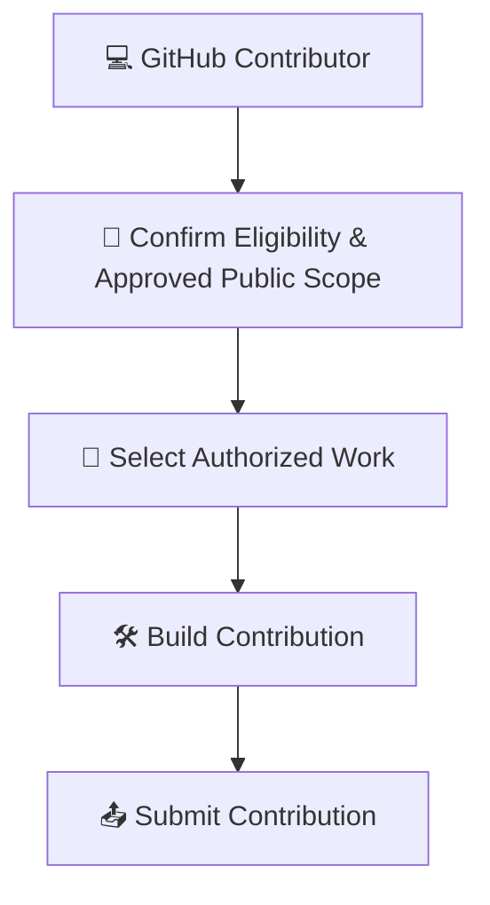
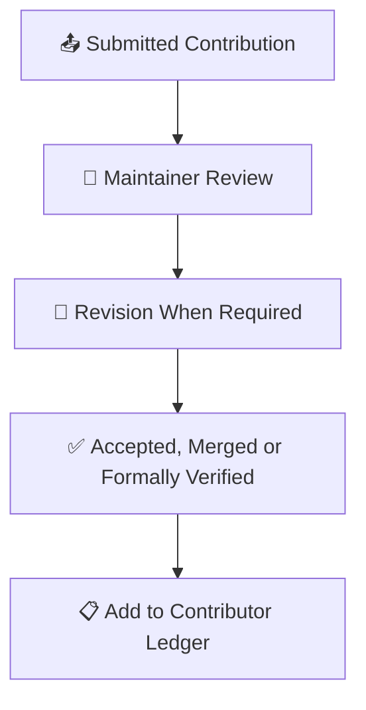
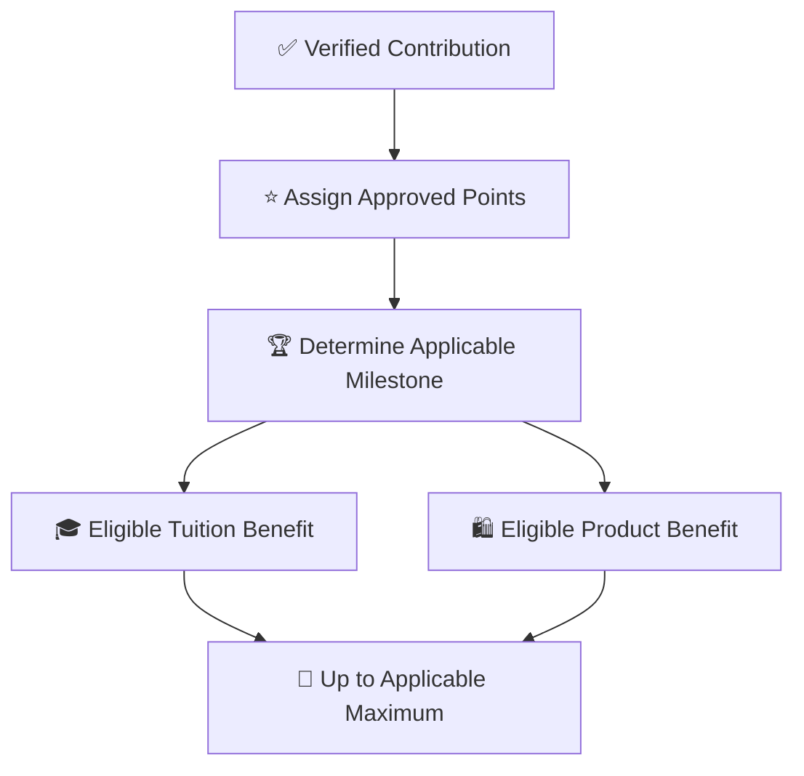
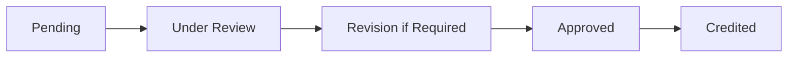
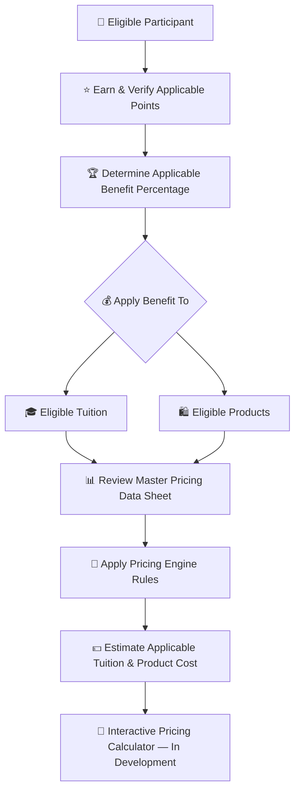

# 👑RIAH Pathway.

**Contributor; Mariah Dominique Rucker**

There is currently no team. I am building everything myself until I have hired the beta team. I am starting the hiring process this month, **October 2026**, for the CTO, CISO, experiential professionals, PhD-qualified faculty, and adjunct faculty for each school and major, with hiring continuing across the entire ecosystem as it scales.

Beta team members will be hired with **equity participation and compensation during the beta cohort**, which launches in **Spring 2027**.

The website will launch in **October 2026** as I continue to build, develop, revise, and finalize aspects of the RIAH Pathway ecosystem.

Learn more about me on GitHub and LinkedIn, or connect with me through social media and Linktree.

- **GitHub:** https://github.com/mariahdominiquerucker
- **LinkedIn:** https://linkedin.com/in/mariahrucker
- **Facebook:** https://facebook.com/heymariahrucker
- **Instagram:** https://instagram.com/heymariahrucker
- **Linktree:** https://linktr.ee/mariahrucker

---

# 💻 GitHub Contributors

## 💻 Category Key

| Emoji | Meaning |
|---|---|
| 💻 | GitHub Contributor |
| 👑 | Approved eligibility or contribution |
| ⭐ | Approved points |
| 🏆 | Completed milestone |
| 🎓 | Tuition benefit |
| 🛍️ | Product benefit |
| 🔗 | QR, referral, routing or attribution |
| 🎪 | Event, workshop or outreach |
| 🎥 | Webinar, presentation, video or media |
| 👀 | Under review |
| 🔄 | Revision or re-verification |
| ✅ | Approved or verified |
| ❌ | Rejected or ineligible |

## 💻 End-to-End Category Flow

### 💻 High-Level Flow — Contribution

### 👀 High-Level Flow — Review & Verification

### ⭐ High-Level Flow — Points & Benefits

## ⚙️ Flow Metadata

**Flow Configuration:** Track — GitHub Contributor; Profile Category — Contributor; Status — in-progress; Verification Required — true; Points Require Approval — true; Benefit Record Required — true.

## 💰 Tuition, Products & Pricing Resources

Contributor benefits in this documentation apply to **eligible tuition and eligible products** according to the rules for the applicable participant category.

| Pricing Resource | Purpose |
|---|---|
| 💰 [RIAH Pathway Master Pricing Data Sheet](../RIAH-Pathway-Master-Pricing-Data-Sheet.md) | Review current pathway tuition, program pricing, product pricing and other applicable pricing data. |
| 🧮 [RIAH Pathway Pricing Engine](../RIAH-Pathway-Pricing-Engine.md) | Review the pricing rules and calculation framework used to connect applicable pricing, eligibility, discounts and benefits. |

> **Pricing Calculator Development:** The interactive RIAH Pathway pricing calculator is still being developed. The intended calculator experience will allow eligible participants to apply their verified points and applicable benefit percentage to eligible tuition and product pricing so they can estimate what they may pay. Until that calculator is finalized, use the Master Pricing Data Sheet and Pricing Engine together with the applicable benefit rules in this documentation.

## 📑 Index

I. 🔑 Key  
II. 👑 Eligibility  
III. 🧮 Benefit Formula  
IV. 🏆 1%–25% Milestones  
V. 🛠️ Eligible Contribution Categories  
VI. ⭐ Point Schedule  
VII. 🎯 Scoring Standards  
VIII. 🎥 Video and Media Contributions  
IX. 🔄 Contributor Workflow  
X. 🛡️ Verification and Anti-Abuse  
XI. 👥 Contributor Levels  
XII. 📋 Contributor Ledger
XIII. 👑 Shared Ambassador Program

## I. 🔑 Key

| Emoji | Meaning |
|---|---|
| 👑 | approved contribution |
| ⭐ | approved point |
| 🏆 | milestone |
| 💻 | development |
| 🐛 | bug |
| 📄 | documentation |
| 🎨 | creative/design |
| 🧪 | testing/QA |
| ♿ | accessibility |
| 📚 | curriculum/education |
| 💰 | pricing |
| 📱 | mobile/responsive |
| 🎥 | video/media |
| 🔍 | research |
| 🔗 | links/routing/CTA |
| ✅ | accepted/verified |
| ❌ | rejected/ineligible |

## II. 👑 Eligibility

1. Use an identifiable GitHub contributor account.
2. Follow the README, contributor instructions, issues, templates and applicable standards.
3. Work in an approved public contribution area.
4. Reference an existing issue or receive approval when required.
5. Submit through the appropriate GitHub workflow.
6. Provide enough information and evidence for review.
7. Respond to reasonable requested revisions.
8. Submit original or properly licensed work.
9. Never submit confidential, proprietary, security-sensitive or restricted internal information.
10. Receive acceptance, merge, approval or formal verification before points become permanent.

## III. 🧮 Benefit Formula

**100 verified points = 1% in one selected eligible benefit ledger. Education, Experiential and Products are separate ledgers; each is capped at 2,500 points = 25%.**

## IV. 🏆 1%–25% Milestones

> Thresholds are measured within **one** selected ledger. Reaching a threshold in one ledger does not automatically change the other ledgers.

| Points | Tuition | Products |
|---:|---:|---:|
| 100 | 1% | 1% |
| 200 | 2% | 2% |
| 300 | 3% | 3% |
| 400 | 4% | 4% |
| 500 | 5% | 5% |
| 600 | 6% | 6% |
| 700 | 7% | 7% |
| 800 | 8% | 8% |
| 900 | 9% | 9% |
| 1000 | 10% | 10% |
| 1100 | 11% | 11% |
| 1200 | 12% | 12% |
| 1300 | 13% | 13% |
| 1400 | 14% | 14% |
| 1500 | 15% | 15% |
| 1600 | 16% | 16% |
| 1700 | 17% | 17% |
| 1800 | 18% | 18% |
| 1900 | 19% | 19% |
| 2000 | 20% | 20% |
| 2100 | 21% | 21% |
| 2200 | 22% | 22% |
| 2300 | 23% | 23% |
| 2400 | 24% | 24% |
| 2500 | 25% MAX | 25% MAX |

## V. 🛠️ Eligible Contribution Categories

| Code | Category | Examples |
|---|---|---|
| ACC | Accessibility | Reviews, improvements, content accessibility, navigation and testing |
| ACR | Accreditation Documentation | Public materials, research support, formatting and resources |
| ART | Articles and Written Content | Articles, educational/informational content, public resources and website copy |
| BRA | Branding and Creative Assets | Graphics, visual assets, templates, promotional materials and brand resources |
| BUG | Bug Fixes | Website fixes, broken links, formatting, components and technical corrections |
| COM | Components | Reusable interface elements, page components and interactive elements |
| CUR | Curriculum Documentation | Public curriculum, formatting, course information and pathway documentation |
| DOC | Documentation | READMEs, technical/public documentation, instructions and guides |
| EXP | Experiential Resources | Experiential materials, pathway/training resources and public documentation |
| FLY | Flyers and Promotional Materials | Digital/informational flyers, program/event materials and promotional graphics |
| FRM | Forms | Application, information, contributor and public-facing forms |
| IMG | Images | Website, program, pathway, branded and educational graphics |
| INT | Integrations | Approved application, API, database and platform connections |
| LNK | Links and Routing | Internal/external links, CTA and download routing |
| MKT | Marketing Content | Campaigns, program/pathway promotion and informational marketing |
| MOB | Mobile Development | Mobile optimization, interfaces and device testing |
| POL | Policies | Approved public policy drafting, research, formatting and updates |
| CAL | Pricing Calculators | Interfaces, testing, validation and UX |
| PEN | Pricing Engine | Development, configuration support, logic testing, documentation and implementation |
| PRD | Product Resources | Descriptions, documentation, graphics and public product resources |
| PRO | Proposals | Development, feature, documentation and improvement proposals |
| QA | Quality Assurance | Content/functionality review, consistency, usability and quality control |
| RES | Research | Approved public research supporting policies, curriculum, programs, technology and documentation |
| RSP | Responsive Design | Desktop, tablet and mobile layouts/components |
| SOC | Social Content | Graphics, educational/promotional posts, captions and campaigns |
| TEC | Technology Documentation | Software/system documentation, technical guides and public technology resources |
| TST | Testing | Website, calculator, component, responsive and functionality testing |
| UXI | UX and UI | Layouts, navigation, interfaces and user flows |
| VID | Video Content | Educational/promotional/pathway/product/Experiential videos, demonstrations and explainers |
| WEB | Website Development | Front-end development, functionality, pages and integrations |
| WIR | Website Wireframes | Page structures, layouts, navigation and interface planning |
| DLD | Documents and Downloads | PDFs, brochures, guides and downloadable resources |
| CTA | Buttons and Calls to Action | Application, inquiry, enrollment, donation and download actions |
| PRC | Procedures and Guidelines | Public standards, procedures and contributor instructions |
| AUT | Authorization Documentation | Public state authorization and regulatory documentation |

## VI. ⭐ Point Schedule

| Level | Points | Requirement |
|---|---:|---|
| 🟢 Micro | 5 | Valid minor correction or verified small improvement |
| 🟢 Small | 10 | Useful contained contribution |
| 🟢 Enhanced | 15 | Multiple associated corrections or meaningful small deliverable |
| 🔵 Standard | 25 | Complete standard contribution |
| 🔵 Substantial | 50 | Significant accepted deliverable |
| 🟣 Advanced | 75 | Complex substantial component |
| 🟣 Major | 100 | Complete major approved deliverable |
| 🔴 Large | 150 | Multi-component or high-complexity contribution |
| 🔴 Strategic | 200 | Major system, page, resource set or equivalent |
| 👑 Exceptional | 250 | Large approved body of work with substantial implementation value |

Examples: 5 points for typo/minor broken link; 10 for a useful issue with reproducible evidence; 25 for meaningful documentation, QA report, design correction or small accepted component; 50 for substantive documentation, media asset set, wireframe, feature, accessibility remediation or larger bug; 100 for major page implementation, substantial feature or major pricing/calculator contribution; 150–250 require review for major strategic work.

## VII. 🎯 Scoring Standards

Awards consider scope, complexity, meaningful effort, completion, accuracy, verification, implementation value, documentation, accessibility, responsiveness, integration and risk. Points measure accepted contribution value, not raw activity.

## VIII. 🎥 Video and Media Contributions

Eligible work includes approved educational videos, promotional videos, pathway videos, product videos, Experiential videos, demonstrations, explainers, scripts, storyboards, motion graphics, narration plans, captions, transcripts, draft videos, final proposed videos and page-specific videos. Contributors may work from approved RIAH scripts or specifications. RIAH retains final approval over materials presented as official RIAH content.

## IX. 🔄 Contributor Workflow

```mermaid
flowchart LR
    N1["Identify approved work"] --> N2["Claim or propose"]
    N2["Claim or propose"] --> N3["Build"]
    N3["Build"] --> N4["Submit"]
    N4["Submit"] --> N5["Review"]
    N5["Review"] --> N6["Revise if required"]
    N6["Revise if required"] --> N7["Accept or merge"]
    N7["Accept or merge"] --> N8["Credit points"]
    N8["Credit points"] --> N9["Check milestone"]
    N9["Check milestone"] --> N10["Update benefit record."]
```

Pull requests should identify what changed, why it changed, the applicable issue, testing performed, screenshots where relevant, responsive behavior, accessibility considerations and the affected page or ecosystem component.

## X. 🛡️ Verification and Anti-Abuse

Only accepted or verified deliverables count. Issues receive points only when substantive. Reviews receive points only when useful and materially improving the work. No points for duplicates, spam, plagiarism, unauthorized copyrighted materials, knowingly inaccurate work, fabricated testing/research, low-value autogenerated activity, abandoned/rejected/out-of-scope work, empty commits or gaming through artificial splitting of commits, PRs, issues, comments or files. One deliverable normally receives one primary point award.

## XI. 👥 Contributor Levels

| Level | Points | Benefit |
|---|---:|---:|
| 🟢 Level I | 100–400 | 1%–4% |
| 🔵 Level II | 500–900 | 5%–9% |
| 🟣 Level III | 1,000–1,400 | 10%–14% |
| 🔴 Level IV | 1,500–1,900 | 15%–19% |
| 👑 Level V | 2,000–2,400 | 20%–24% |
| 👑🏆 Maximum | 2,500+ | 25% |

## XII. 📋 Contributor Ledger

Record Contributor GitHub Username, Participant ID, Contribution ID, Category, GitHub Record such as issue/PR/commit/review/deliverable, Description, Level, Points, Approval Date, Approved By, Previous Total, Added Points, Running Total, Milestone, Tuition Benefit, Product Benefit, Next Milestone, Points Remaining and Status.

Benefits cannot be exchanged for cash or ordinarily transferred and remain subject to applicable RIAH Pathway tuition, product, eligibility and discount-stacking rules.

## XIII. 👑 SHARED AMBASSADOR PROGRAM

| Rule | Structure |
|---|---|
| Ambassador Benefit | **Up to 25%** |
| Product Benefit | **Up to 25%** through separate product milestones |
| Multiple Ambassador categories | **Do not stack beyond 25%** |
| Education / Experiential completion | **10% guaranteed** |
| Education / Experiential total reimbursement | **Up to 50%** |

| Conversion / Purchase Milestone | Point Treatment |
|---|---|
| Paying Education Pathway student conversion | Conversion recorded |
| Paying Experiential Pathway student conversion | Conversion recorded |
| Converted student reaches 50% program completion | **50 points** |
| Converted student completes / graduates | **+50 points** |

| Material | Physical | Digital |
|---|:---:|:---:|
| One apparel selection | ✅ | ❌ |
| Vehicle vinyl | ✅ | ❌ |
| Vehicle rooftop sign / billboard | ✅ | ❌ |
| Retractable banner | ✅ | ❌ |
| Tablecloth | ✅ | ❌ |
| Business card | ❌ | ✅ |
| Flyer | ❌ | ✅ |
| Brochure | ❌ | ✅ |
| Referral link | ❌ | ✅ |
| Products / Services / Pathways link | ❌ | ✅ |
| Individual QR code | ✅ | ✅ |

Products are non-refundable. For applicable course or product programs, completing **100%** and not passing provides **three additional months of access**.

### 🔗 Documentation

[README](./README.md) · [CONTENT-CREATORS](./CONTENT-CREATORS.md) · [AFFILIATES](./AFFILIATES.md) · [GITHUB-CONTRIBUTORS](./GITHUB-CONTRIBUTORS.md) · [COMMUNITY-AMBASSADORS](./COMMUNITY-AMBASSADORS.md) · [RIDESHARE](./RIDESHARE.md) · [DELIVERY](./DELIVERY.md) · [SUBSTITUTE-TEACHERS](./SUBSTITUTE-TEACHERS.md) · [ELIGIBLE-PARTNER-EMPLOYEES](./ELIGIBLE-PARTNER-EMPLOYEES.md) · [STUDENTS](./STUDENTS.md) · [TEAM-MEMBERS](./TEAM-MEMBERS.md)

## 🧮 Unified Three-Ledger Benefit Logic

For eligible non-team participants, Education, Experiential and Products remain separate benefit categories.

| Benefit Category | Base / Maximum |
|---|---:|
| 🎓 Education Completion | **10% guaranteed after eligible Education completion / graduation** |
| 🧭 Experiential Completion | **10% guaranteed after eligible Experiential completion** |
| ⭐ Education / Experiential Contributor Benefit | **0%–25% additional** |
| ➕ Additional Tuition Reimbursement Milestones | **0%–15% additional** |
| 🎓 Education / Experiential Maximum | **50% maximum: 10% + 25% + 15%** |
| 🛍️ Product Discount | **0%–25% per product-discount earning cycle** |

### 🛍️ Product Purchase Conversion — $0 to $2,500 Only

The Product Discount is based only on **verified eligible product purchases attributed to the participant's assigned link, QR code or approved referral attribution**.

**Product purchase dollars = Product points.**  
**Product Discount % = Product points ÷ 100.**  
**Minimum = $0 / 0 points / 0%. Maximum per earning cycle = $2,500 / 2,500 points / 25%.**

| Verified Attributable Product Purchases | Product Points | Earned Product Discount |
|---:|---:|---:|
| $0 | 0 | 0% |
| $100 | 100 | 1% |
| $525 | 525 | 5.25% |
| $1,000 | 1,000 | 10% |
| $1,500 | 1,500 | 15% |
| $2,500 | 2,500 | **25% MAX** |

The percentage may be a decimal because it follows the actual purchase amount. For example, **$525 = 525 points = 5.25%**.

**Products are non-refundable.** Only completed, verified and attributable product purchases count toward this Product Discount calculation.

### 🔄 Product Discount Earning / Redemption Cycle

1. The active Product Discount cycle begins at **0 points / 0%**.
2. Verified attributable product purchases build the discount from **0% up to 25%**.
3. The earned Product Discount **does not expire until it is used**.
4. A participant may use the currently earned percentage, such as **1%, 5.25%, 10% or 25%**, on an eligible product purchase.
5. When an earned Product Discount is redeemed, that redeemed discount is consumed.
6. When the participant reaches **$2,500 / 2,500 points / 25%**, the 25% earning cycle is complete and the earning counter refreshes to **0** so a new Product Discount cycle can be built.
7. An earned 25% Product Discount remains available until it is used.

The Product Discount earning range is **$0 through $2,500 only**. The cycle caps at **$2,500 = 2,500 points = 25%** and then refreshes under the rule above.

### 🎓 Education Tuition Reimbursement Structure

Eligible Education participants who complete / graduate receive **10% guaranteed**. Approved contributor / Ambassador activity may add **up to 25%**, bringing the Education reimbursement to **up to 35%**. Additional approved reimbursement milestones may add **up to 15% more**, for a **50% maximum**.

**Education maximum: 10% completion + 25% contributor benefit + 15% additional reimbursement = 50%.**

### 🧭 Experiential Tuition Reimbursement Structure

Eligible Experiential participants who complete the program receive **10% guaranteed**. Approved contributor / Ambassador activity may add **up to 25%**, bringing the Experiential reimbursement to **up to 35%**. Additional approved reimbursement milestones may add **up to 15% more**, for a **50% maximum**.

**Experiential maximum: 10% completion + 25% contributor benefit + 15% additional reimbursement = 50%.**

Existing approved role-specific point activities remain in effect unless expressly changed elsewhere.
## 🔗 Canonical Routing

[README](./README.md) · [AMBASSADOR MASTER](./AMBASSADORS.md) · [RIDESHARE + DELIVERY COMBINED](./RIDESHARE-DELIVERY.md) · [PARTNER EMPLOYEES COMBINED](./PARTNER-EMPLOYEES.md)

---

# 👑RIAH Pathway.
