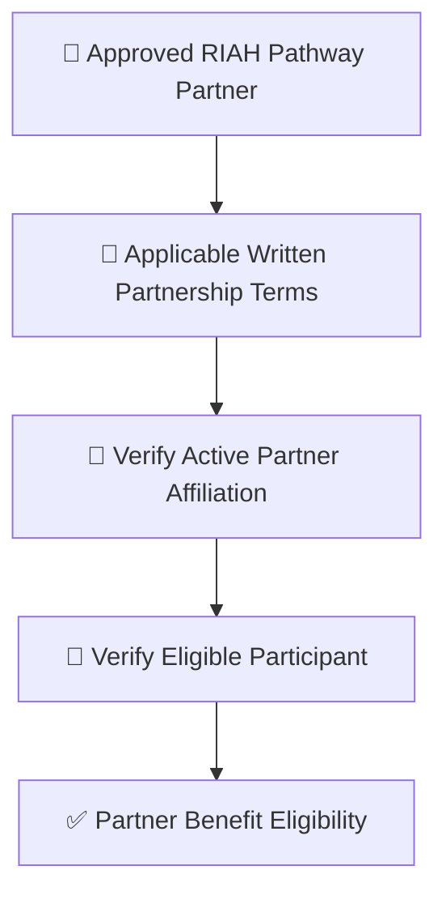
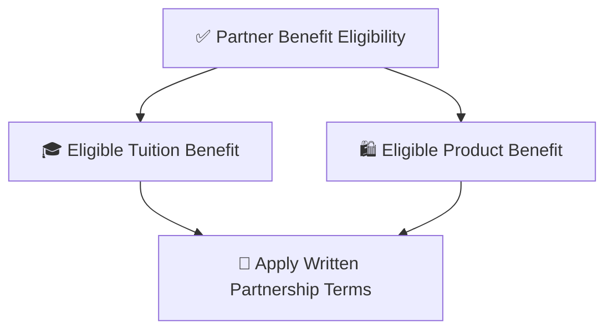
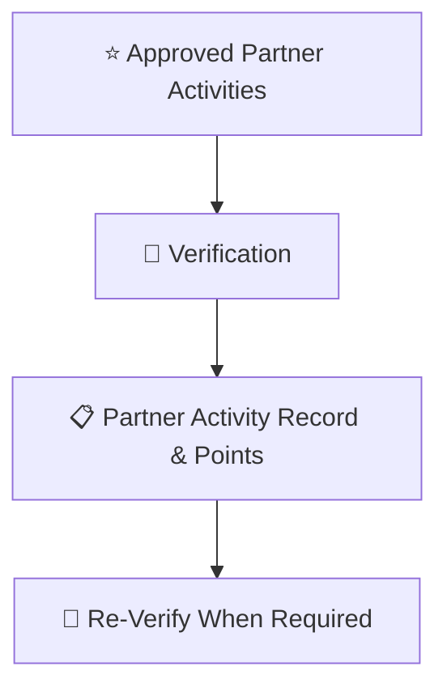
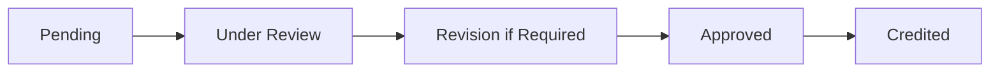
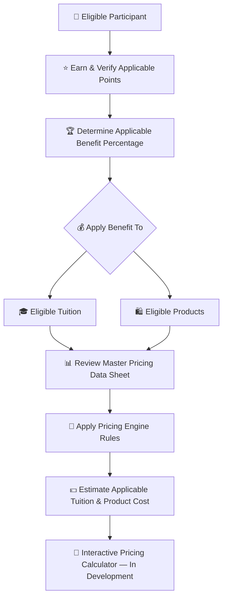

# 👑RIAH Pathway.

**Contributor; Mariah Dominique Rucker**

There is currently no team. I am building everything myself until I have hired the beta team. I am starting the hiring process this month, **October 2026**, for the CTO, CISO, experiential professionals, PhD-qualified faculty, and adjunct faculty for each school and major, with hiring continuing across the entire ecosystem as it scales.

Beta team members will be hired with **equity participation and compensation during the beta cohort**, which launches in **Spring 2027**.

The website will launch in **October 2026** as I continue to build, develop, revise, and finalize aspects of the RIAH Pathway ecosystem.

Learn more about me on GitHub and LinkedIn, or connect with me through social media and Linktree.

- **GitHub:** https://github.com/mariahdominiquerucker
- **LinkedIn:** https://linkedin.com/in/mariahrucker
- **Facebook:** https://facebook.com/heymariahrucker
- **Instagram:** https://instagram.com/heymariahrucker
- **Linktree:** https://linktr.ee/mariahrucker

---

# 🤝 Partner Employees — Partnership Terms

> **Canonical Combined File:** Partner and Partner Employee benefit rules are combined at [PARTNER-EMPLOYEES.md](./PARTNER-EMPLOYEES.md). Benefits in this contributor framework apply to eligible Partner Employees under applicable written partnership terms.

## 🤝 Category Key

| Emoji | Meaning |
|---|---|
| 🤝 | Partner |
| 👑 | Approved eligibility or contribution |
| ⭐ | Approved points |
| 🏆 | Completed milestone |
| 🎓 | Tuition benefit |
| 🛍️ | Product benefit |
| 🔗 | QR, referral, routing or attribution |
| 🎪 | Event, workshop or outreach |
| 🎥 | Webinar, presentation, video or media |
| 👀 | Under review |
| 🔄 | Revision or re-verification |
| ✅ | Approved or verified |
| ❌ | Rejected or ineligible |

## 🤝 End-to-End Category Flow

### 🤝 High-Level Flow — Partner Eligibility

### 💰 High-Level Flow — Partner Benefits

### ⭐ High-Level Flow — Partner Activities

## ⚙️ Flow Metadata

**Flow Configuration:** Track — Partner; Profile Category — Partner; Status — in-progress; Verification Required — true; Points Require Approval — true; Benefit Record Required — true.

## 💰 Tuition, Products & Pricing Resources

Contributor benefits in this documentation apply to **eligible tuition and eligible products** according to the rules for the applicable participant category.

| Pricing Resource | Purpose |
|---|---|
| 💰 [RIAH Pathway Master Pricing Data Sheet](../RIAH-Pathway-Master-Pricing-Data-Sheet.md) | Review current pathway tuition, program pricing, product pricing and other applicable pricing data. |
| 🧮 [RIAH Pathway Pricing Engine](../RIAH-Pathway-Pricing-Engine.md) | Review the pricing rules and calculation framework used to connect applicable pricing, eligibility, discounts and benefits. |

> **Pricing Calculator Development:** The interactive RIAH Pathway pricing calculator is still being developed. The intended calculator experience will allow eligible participants to apply their verified points and applicable benefit percentage to eligible tuition and product pricing so they can estimate what they may pay. Until that calculator is finalized, use the Master Pricing Data Sheet and Pricing Engine together with the applicable benefit rules in this documentation.

## 📑 Index

I. 🤝 Partner Benefit Program  
II. 👑 Eligibility  
III. ⭐ Partner Points  
IV. 🛡️ Verification  
V. 📋 Partner Record  
VI. 🏆 Benefit Rules
VII. 👑 Shared Ambassador Program

## I. 🤝 Partner Benefit Program

RIAH Pathway partners may qualify for tuition and product benefits through an approved partnership relationship.

Partner Employees may earn **up to 25% eligible tuition / program benefit and up to 25% eligible product benefit** through applicable Partner / Ambassador milestones. These percentages do not stack beyond 25%.

## II. 👑 Partner Eligibility

1. Be associated with an active approved RIAH Pathway partner.
2. Meet the applicable partnership agreement requirements.
3. Have partner affiliation verified.
4. Be an eligible employee, member, participant or approved beneficiary.
5. Maintain eligibility while using the benefit.
6. Complete required partner verification.
7. Follow applicable admissions and product requirements.
8. Follow applicable exclusions.
9. Do not transfer benefits to unauthorized individuals.
10. Do not combine benefits beyond applicable maximums.
11. Complete re-verification when the partnership relationship changes.
12. Use benefits during the applicable partnership eligibility period unless otherwise stated in writing.

## III. ⭐ Partner Points

| Partner Activity | Points |
|---|---:|
| Verified active partner affiliation | 100 |
| Complete partner orientation | 25 |
| Attend approved partner webinar | 10 |
| Participate in approved partner event | 25 |
| Staff approved partner booth | 50 |
| Participate as approved workshop presenter | 50 |
| Complete approved joint outreach | 25 |
| Develop approved partner resource | 25–50 |
| Complete approved joint initiative | 50–100 |
| Coordinate approved partner event | 75 |
| Complete major joint initiative | 100–250 |

Partner points document verified engagement. They support additional benefits only where applicable written partnership terms authorize those benefits and do not automatically increase every Partner Employee beyond the established Partner Employee benefit.

### 🤝 Partner Contribution Categories

| Category | Eligible Partner Contribution | Typical Points |
|---|---|---:|
| 🎓 Orientation | Complete approved partner orientation | 25 |
| 🎥 Webinar | Attend approved partner webinar | 10 |
| 🎪 Event Participation | Participate in approved RIAH partner event | 25 |
| 🪧 Booth | Staff approved partner booth or table | 50 |
| 🎤 Presentation | Serve as approved workshop or session presenter | 50 |
| 📣 Joint Outreach | Complete approved joint outreach assignment | 25 |
| 📚 Partner Resource | Develop approved partner resource | 25–50 |
| 🤝 Joint Initiative | Complete approved joint initiative | 50–100 |
| 🎪 Event Coordination | Coordinate approved partner event | 75 |
| 👑 Major Initiative | Complete major approved joint initiative | 100–250 |

### 🎯 Partner Point Scoring Standards

Partner activity points are based on verified scope, completion, meaningful participation, approved deliverables, event responsibility, documentation, implementation value and the applicable written partnership terms. A larger number of activities does not automatically create a larger benefit if the activities are duplicate, unverifiable, outside the partnership scope or already counted as one underlying initiative.

### 🔄 Partner Workflow

```mermaid
flowchart LR
    N1["🤝 Approved Partnership"] --> N2["📄 Written Terms"]
    N2["📄 Written Terms"] --> N3["👑 Verify Affiliation"]
    N3["👑 Verify Affiliation"] --> N4["👤 Verify Participant Eligibility"]
    N4["👤 Verify Participant Eligibility"] --> N5["🎓🛍️ Apply Established Benefit"]
    N5["🎓🛍️ Apply Established Benefit"] --> N6["⭐ Record Approved Partner Activity"]
    N6["⭐ Record Approved Partner Activity"] --> N7["👀 Verify Activity"]
    N7["👀 Verify Activity"] --> N8["📋 Update Partner Record"]
    N8["📋 Update Partner Record"] --> N9["🔄 Re-verify When Terms or Affiliation Change"]
```

### ❌ Ineligible Partner Claims

| Ineligible Activity | Result |
|---|---|
| ❌ Expired or inactive partner affiliation | No benefit |
| ❌ Unverified employee, member or participant claim | No benefit |
| ❌ Transferred benefit | No benefit |
| ❌ Duplicate activity claim | No additional points |
| ❌ Activity outside written partnership scope | No points unless separately approved |
| ❌ Fabricated event, resource or initiative | No points |
| ❌ Unauthorized use of RIAH branding | No points and subject to review |
| ❌ Attempt to exceed applicable benefit cap | Benefit remains at applicable cap |

### 🏆 Partner Examples

| Example | Result |
|---|---|
| 🤝 Verified eligible Partner Employee | up to 25% eligible tuition / program benefit + up to 25% eligible products under applicable terms |
| ⭐ Partner completes orientation + event + booth | 25 + 25 + 50 = 100 recorded Partner Activity Points |
| 👑 Partner coordinates event + major initiative | 75 + applicable 100–250 points after verification |
| 🔄 Affiliation changes | Benefit and activity record require re-verification |

Partner Activity Points document engagement and contribute toward the applicable milestone structure without exceeding the 25% maximum.

## IV. 🛡️ Verification

Verification may include active partner status, written partnership terms, employment/member/participant eligibility, event or initiative records, approved resources, RIAH review and re-verification when affiliation changes. Fraudulent, expired, transferred, duplicate, unauthorized or unverifiable claims are ineligible.

## V. 📋 Partner Record

Record Participant, Participant ID, Partner Organization, Partner Classification, Eligibility Basis, Verification Date, Activity ID, Activity, Points, Total Points, Applicable Tuition Benefit, Applicable Product Benefit, Written Agreement Reference, Approved By, Re-verification Date and Status.

## VI. 🏆 Benefit Rules

Partner benefits are tied to the applicable written partnership classification. Partner Employees receive **up to 25% tuition / program benefit and up to 25% products** under applicable terms. The eligible product benefit is capped at **25%**. Partner points do not independently override written partnership terms, eligibility periods, exclusions or benefit caps.

## VII. 👑 SHARED AMBASSADOR PROGRAM

| Rule | Structure |
|---|---|
| Ambassador Benefit | **Up to 25%** |
| Product Benefit | **Up to 25%** through separate product milestones |
| Multiple Ambassador categories | **Do not stack beyond 25%** |
| Education / Experiential completion | **10% guaranteed** |
| Education / Experiential total reimbursement | **Up to 50%** |

| Conversion / Purchase Milestone | Point Treatment |
|---|---|
| Paying Education Pathway student conversion | Conversion recorded |
| Paying Experiential Pathway student conversion | Conversion recorded |
| Converted student reaches 50% program completion | **50 points** |
| Converted student completes / graduates | **+50 points** |

| Material | Physical | Digital |
|---|:---:|:---:|
| One apparel selection | ✅ | ❌ |
| Vehicle vinyl | ✅ | ❌ |
| Vehicle rooftop sign / billboard | ✅ | ❌ |
| Retractable banner | ✅ | ❌ |
| Tablecloth | ✅ | ❌ |
| Business card | ❌ | ✅ |
| Flyer | ❌ | ✅ |
| Brochure | ❌ | ✅ |
| Referral link | ❌ | ✅ |
| Products / Services / Pathways link | ❌ | ✅ |
| Individual QR code | ✅ | ✅ |

Products are non-refundable. For applicable course or product programs, completing **100%** and not passing provides **three additional months of access**.

### 🔗 Documentation

[README](./README.md) · [CONTENT-CREATORS](./CONTENT-CREATORS.md) · [AFFILIATES](./AFFILIATES.md) · [GITHUB-CONTRIBUTORS](./GITHUB-CONTRIBUTORS.md) · [COMMUNITY-AMBASSADORS](./COMMUNITY-AMBASSADORS.md) · [RIDESHARE](./RIDESHARE.md) · [DELIVERY](./DELIVERY.md) · [SUBSTITUTE-TEACHERS](./SUBSTITUTE-TEACHERS.md) · [ELIGIBLE-PARTNER-EMPLOYEES](./ELIGIBLE-PARTNER-EMPLOYEES.md) · [STUDENTS](./STUDENTS.md) · [TEAM-MEMBERS](./TEAM-MEMBERS.md)

## 🧮 Unified Three-Ledger Benefit Logic

For eligible non-team participants, Education, Experiential and Products remain separate benefit categories.

| Benefit Category | Base / Maximum |
|---|---:|
| 🎓 Education Completion | **10% guaranteed after eligible Education completion / graduation** |
| 🧭 Experiential Completion | **10% guaranteed after eligible Experiential completion** |
| ⭐ Education / Experiential Contributor Benefit | **0%–25% additional** |
| ➕ Additional Tuition Reimbursement Milestones | **0%–15% additional** |
| 🎓 Education / Experiential Maximum | **50% maximum: 10% + 25% + 15%** |
| 🛍️ Product Discount | **0%–25% per product-discount earning cycle** |

### 🛍️ Product Purchase Conversion — $0 to $2,500 Only

The Product Discount is based only on **verified eligible product purchases attributed to the participant's assigned link, QR code or approved referral attribution**.

**Product purchase dollars = Product points.**  
**Product Discount % = Product points ÷ 100.**  
**Minimum = $0 / 0 points / 0%. Maximum per earning cycle = $2,500 / 2,500 points / 25%.**

| Verified Attributable Product Purchases | Product Points | Earned Product Discount |
|---:|---:|---:|
| $0 | 0 | 0% |
| $100 | 100 | 1% |
| $525 | 525 | 5.25% |
| $1,000 | 1,000 | 10% |
| $1,500 | 1,500 | 15% |
| $2,500 | 2,500 | **25% MAX** |

The percentage may be a decimal because it follows the actual purchase amount. For example, **$525 = 525 points = 5.25%**.

**Products are non-refundable.** Only completed, verified and attributable product purchases count toward this Product Discount calculation.

### 🔄 Product Discount Earning / Redemption Cycle

1. The active Product Discount cycle begins at **0 points / 0%**.
2. Verified attributable product purchases build the discount from **0% up to 25%**.
3. The earned Product Discount **does not expire until it is used**.
4. A participant may use the currently earned percentage, such as **1%, 5.25%, 10% or 25%**, on an eligible product purchase.
5. When an earned Product Discount is redeemed, that redeemed discount is consumed.
6. When the participant reaches **$2,500 / 2,500 points / 25%**, the 25% earning cycle is complete and the earning counter refreshes to **0** so a new Product Discount cycle can be built.
7. An earned 25% Product Discount remains available until it is used.

The Product Discount earning range is **$0 through $2,500 only**. The cycle caps at **$2,500 = 2,500 points = 25%** and then refreshes under the rule above.

### 🎓 Education Tuition Reimbursement Structure

Eligible Education participants who complete / graduate receive **10% guaranteed**. Approved contributor / Ambassador activity may add **up to 25%**, bringing the Education reimbursement to **up to 35%**. Additional approved reimbursement milestones may add **up to 15% more**, for a **50% maximum**.

**Education maximum: 10% completion + 25% contributor benefit + 15% additional reimbursement = 50%.**

### 🧭 Experiential Tuition Reimbursement Structure

Eligible Experiential participants who complete the program receive **10% guaranteed**. Approved contributor / Ambassador activity may add **up to 25%**, bringing the Experiential reimbursement to **up to 35%**. Additional approved reimbursement milestones may add **up to 15% more**, for a **50% maximum**.

**Experiential maximum: 10% completion + 25% contributor benefit + 15% additional reimbursement = 50%.**

Existing approved role-specific point activities remain in effect unless expressly changed elsewhere.
## 🔗 Canonical Routing

[README](./README.md) · [AMBASSADOR MASTER](./AMBASSADORS.md) · [RIDESHARE + DELIVERY COMBINED](./RIDESHARE-DELIVERY.md) · [PARTNER EMPLOYEES COMBINED](./PARTNER-EMPLOYEES.md)

---

# 👑RIAH Pathway.
