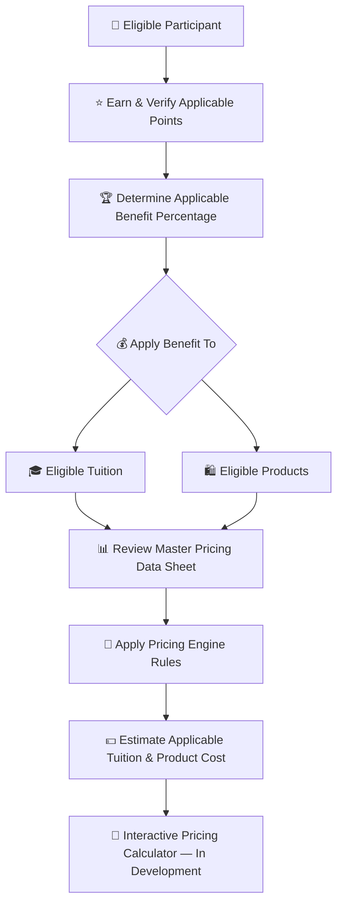
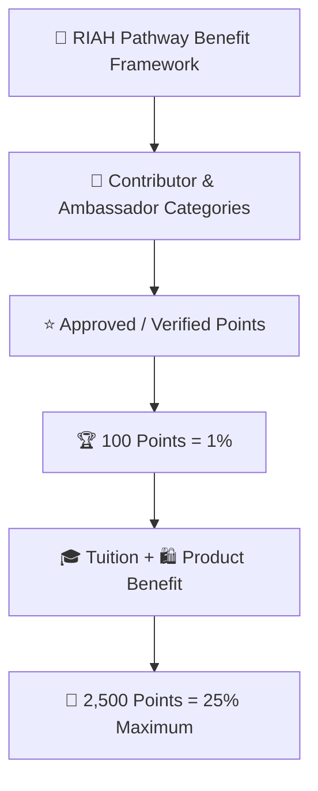
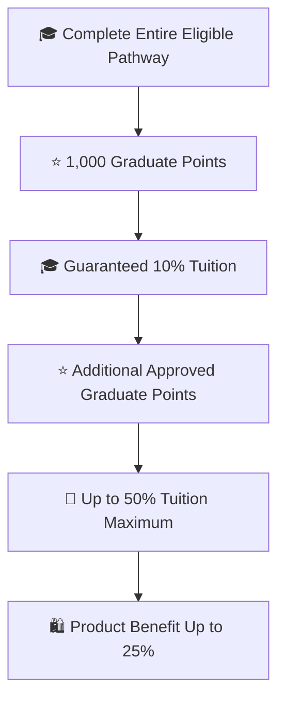
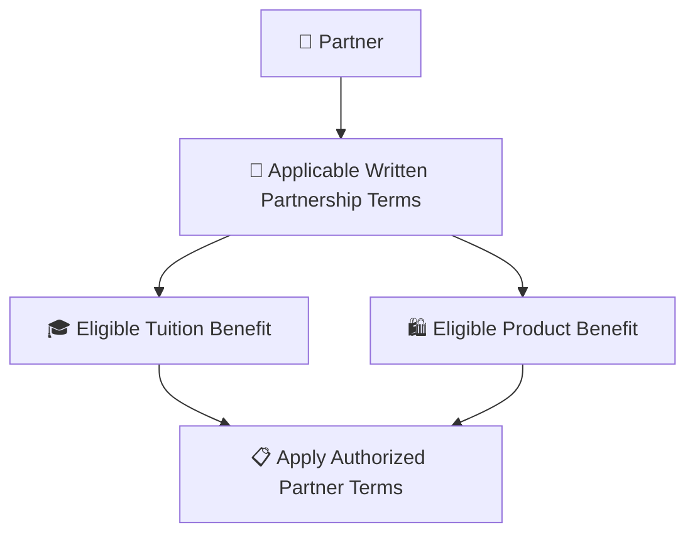

# 👑RIAH Pathway.

**Contributor; Mariah Dominique Rucker**

There is currently no team. I am building everything myself until I have hired the beta team. I am starting the hiring process this month, **October 2026**, for the CTO, CISO, experiential professionals, PhD-qualified faculty, and adjunct faculty for each school and major, with hiring continuing across the entire ecosystem as it scales.

Beta team members will be hired with **equity participation and compensation during the beta cohort**, which launches in **Spring 2027**.

The website will launch in **October 2026** as I continue to build, develop, revise, and finalize aspects of the RIAH Pathway ecosystem.

Learn more about me on GitHub and LinkedIn, or connect with me through social media and Linktree.

- **GitHub:** https://github.com/mariahdominiquerucker
- **LinkedIn:** https://linkedin.com/in/mariahrucker
- **Facebook:** https://facebook.com/heymariahrucker
- **Instagram:** https://instagram.com/heymariahrucker
- **Linktree:** https://linktr.ee/mariahrucker

---

# 👑 RIAH Pathway Contributor, Ambassador, Graduate & Partner Benefits

This README is the routing and master-summary page for the RIAH Pathway Contributor, Ambassador, Graduate and Partner Benefit framework. The complete eligibility rules, point systems, workflows, milestone tables, verification rules, examples, ledgers, YAML metadata and category diagrams are maintained in the individual category Markdown files.

## 💰 Tuition, Products & Pricing Resources

Contributor benefits in this documentation apply to **eligible tuition and eligible products** according to the rules for the applicable participant category.

| Pricing Resource | Purpose |
|---|---|
| 💰 [RIAH Pathway Master Pricing Data Sheet](../RIAH-Pathway-Master-Pricing-Data-Sheet.md) | Review current pathway tuition, program pricing, product pricing and other applicable pricing data. |
| 🧮 [RIAH Pathway Pricing Engine](../RIAH-Pathway-Pricing-Engine.md) | Review the pricing rules and calculation framework used to connect applicable pricing, eligibility, discounts and benefits. |

> **Pricing Calculator Development:** The interactive RIAH Pathway pricing calculator is still being developed. The intended calculator experience will allow eligible participants to apply their verified points and applicable benefit percentage to eligible tuition and product pricing so they can estimate what they may pay. Until that calculator is finalized, use the Master Pricing Data Sheet and Pricing Engine together with the applicable benefit rules in this documentation.

## 📑 Index

I. 🔑 Master Key  
II. 👥 Category Documentation  
III. 🧮 Master Benefit Structure  
IV. 🏆 Master Classification  
V. 🔄 Master Participation Flow  
VI. 👑 Shared Rules  
VII. 📋 Master Record Fields

## I. 🔑 Master Key

| Emoji | Meaning |
|---|---|
| 💻 | GitHub Contributor |
| 🌎 | Community Ambassador |
| 🍎 | Substitute Teacher Ambassador |
| 🚗 | Rideshare Ambassador |
| 📦 | Delivery Ambassador |
| 🎓 | Student or Graduate |
| 🤝 | Partner |
| ⭐ | Approved points |
| 🏆 | Milestone |
| 🎓 | Tuition benefit |
| 🛍️ | Product benefit |
| 🔗 | QR, referral or attribution |
| 🎪 | Event, workshop or outreach |
| 🎥 | Webinar, presentation, video or media |
| 👀 | Under review |
| 🔄 | Revision or re-verification |
| ✅ | Approved or verified |
| ❌ | Rejected or ineligible |

## II. 👥 Category Documentation

| Category | Primary Structure | Documentation |
|---|---|---|
| 💻 GitHub Contributors | Approved public contribution points | [View Documentation](./GITHUB-CONTRIBUTORS.md) |
| 🌎 Community Ambassadors | Outreach, events, referrals and conversions | [View Documentation](./AMBASSADORS.md) |
| 🍎 Substitute Teacher Ambassadors | School-community outreach, events and referrals | [View Documentation](./SUBSTITUTE-TEACHERS.md) |
| 🚗 Rideshare Ambassadors | Vehicle marketing, passenger engagement, referrals and conversions | [View Documentation](./RIDESHARE.md) |
| 📦 Delivery Ambassadors | Vehicle marketing, community outreach, referrals and conversions | [View Documentation](./DELIVERY.md) |
| 🎓 Students and Graduates | Guaranteed completion benefit plus Graduate Points | [View Documentation](./STUDENTS.md) |
| 🤝 Partners | Written partnership benefits plus verified Partner Activity Points | [View Documentation](./PARTNERS.md) |

## III. 🧮 Master Benefit Structure

| Category | Starting Benefit | Maximum | Tuition | Products |
|---|---:|---:|---|---|
| 💻 GitHub Contributor | 1% at 100 points | 25% | Yes | Yes |
| 🌎 Community Ambassador | 1% at 100 points | 25% | Yes | Yes |
| 🍎 Substitute Teacher Ambassador | 1% at 100 points | 25% | Yes | Yes |
| 🚗 Rideshare Ambassador | 1% at 100 points | 25% | Yes | Yes |
| 📦 Delivery Ambassador | 1% at 100 points | 25% | Yes | Yes |
| 🎓 Education Graduate | 10% guaranteed at completion | 50% tuition; 25% products | Yes | Yes |
| 💼 Experiential Graduate | 10% guaranteed at completion | 50% tuition; 25% products | Yes | Yes |
| 🤝 Eligible Partner Employee | 15% | Per applicable written terms | Yes | Yes |
| 🤝 Partner or Pillar Product Benefit | Per written agreement | Up to 25% products where authorized | Per agreement | Yes |

## IV. 🏆 Master Classification

**💻🌎🍎🚗📦 Contributors and Ambassadors:** 100 approved points = 1% eligible tuition + 1% eligible products; 2,500 points = 25% maximum.

**🎓 Education Graduates:** Complete the entire eligible Education Pathway = automatic 1,000 Graduate Points = guaranteed 10% eligible tuition; each additional 100 approved Graduate Points = +1% tuition until tuition reaches 50% at 5,000 points. Eligible product benefits are up to 25% under applicable product-benefit requirements and are not guaranteed at pathway completion.

**💼 Experiential Graduates:** Complete the entire eligible Experiential Pathway = automatic 1,000 Graduate Points = guaranteed 10% eligible tuition; each additional 100 approved Graduate Points = +1% tuition until tuition reaches 50% at 5,000 points. Eligible product benefits are up to 25% under applicable product-benefit requirements and are not guaranteed at pathway completion.

**🤝 Partners:** Eligible Partner Employees receive 15% eligible tuition + 15% eligible products under applicable written terms. A separate authorized Partner or Pillar Product Benefit may reach up to 25% eligible products where specifically authorized.

## V. 🔄 Master Participation Flow

### 👥 High-Level Flow — Contributor & Ambassador Categories

### 🎓 High-Level Flow — Education & Experiential Graduates

### 🤝 High-Level Flow — Partners

## VI. 👑 Shared Rules

👑 Qualifying activity must be approved or verified before permanent points are credited.

🔗 Applicable Ambassador referrals and conversions must be attributable to the assigned QR code, referral link or another approved verification method.

🛡️ Fraudulent, duplicate, fabricated, unauthorized, rejected or unverifiable activity receives no permanent points.

🏆 Contributor and Ambassador benefits remain capped at 25% tuition and 25% products through this framework.

🎓 Graduate benefits remain capped at 50% eligible tuition and up to 25% eligible products under the applicable Graduate Points progression.

🤝 Partner benefits remain governed by the applicable written partnership terms.

📋 Category-specific scoring, point schedules, eligibility, evidence, examples and workflows are maintained in the individual Markdown files rather than duplicated in this routing README.

## VII. 📋 Master Record Fields

| Field | Purpose |
|---|---|
| 👤 Participant | Verified participant |
| 🆔 Participant ID | Internal participant identifier |
| 👥 Classification | Contributor, Ambassador, Graduate or Partner |
| 🧩 Subcategory | GitHub, Community, Substitute Teacher, Rideshare, Delivery, Education, Experiential or Partner |
| 📝 Activity ID | Unique contribution or activity record |
| ⭐ Points | Approved points |
| 🏆 Milestone | Current milestone |
| 🎓 Tuition Benefit | Applicable tuition percentage |
| 🛍️ Product Benefit | Applicable product percentage or N/A |
| 👑 Approved By | Authorized reviewer |
| 🎯 Next Milestone | Next applicable threshold |
| ⏳ Points Remaining | Points required to next threshold |
| ✅ Status | Pending, review, revision, approved or credited |

RIAH Pathway

---

# 👑RIAH Pathway.
