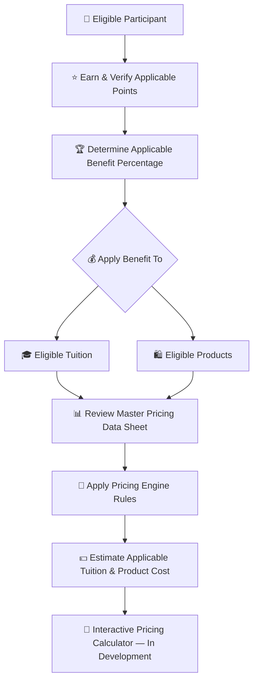
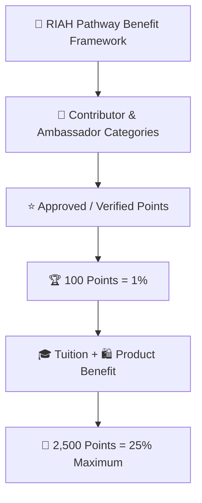
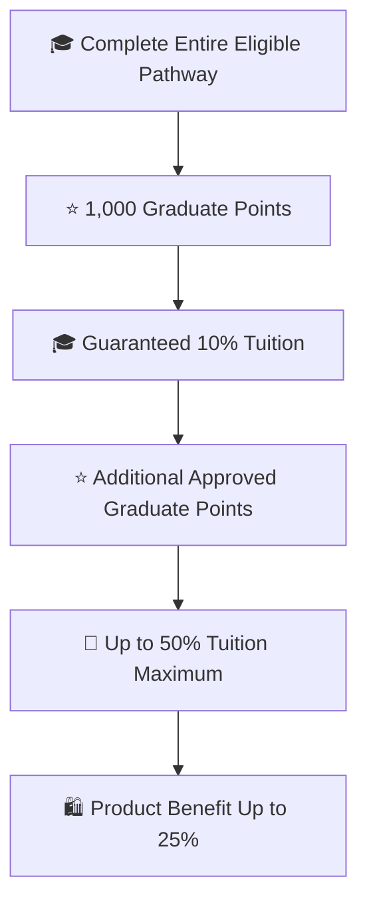
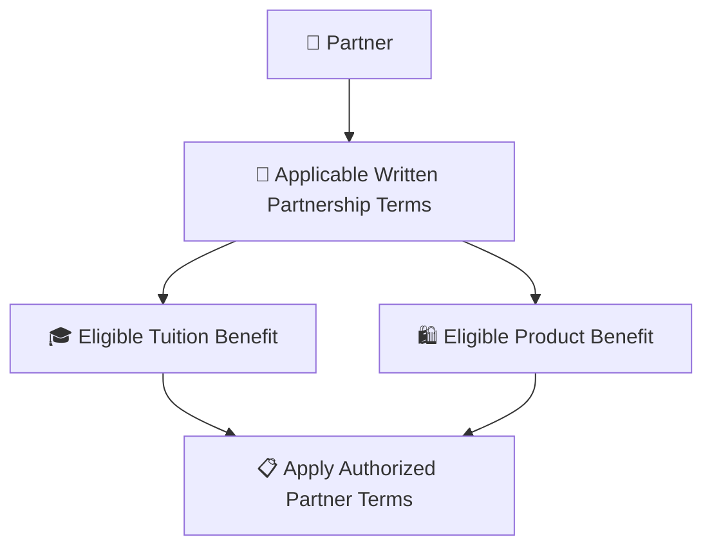

# 👑RIAH Pathway.

**Contributor/Founder/CEO/Chairman: Mariah Dominique Rucker**

There is currently no team. I am building everything myself until I have hired the beta team. I am starting the hiring process this month, **October 2026**, for the CTO, CISO, experiential professionals, PhD-qualified faculty, and adjunct faculty for each school and major, with hiring continuing across the entire ecosystem as it scales.

Beta team members will be hired with **equity participation and compensation during the beta cohort**, which launches in **Spring 2027**.

The website will launch in **October 2026** as I continue to build, develop, revise, and finalize aspects of the RIAH Pathway ecosystem.

Learn more about me on GitHub and LinkedIn, or connect with me through social media and Linktree.

- **GitHub:** https://github.com/mariahdominiquerucker
- **LinkedIn:** https://linkedin.com/in/mariahrucker
- **Facebook:** https://facebook.com/heymariahrucker
- **Instagram:** https://instagram.com/heymariahrucker
- **Linktree:** https://linktr.ee/mariahrucker

---

# 👑 RIAH Pathway Contributor, Ambassador, Graduate & Partner Benefits

This README is the routing and master-summary page for the RIAH Pathway Contributor, Ambassador, Graduate and Partner Benefit framework. The complete eligibility rules, point systems, workflows, milestone tables, verification rules, examples, ledgers, YAML metadata and category diagrams are maintained in the individual category Markdown files.

## 💰 Tuition, Products & Pricing Resources

Contributor benefits in this documentation apply to **eligible tuition and eligible products** according to the rules for the applicable participant category.

| Pricing Resource | Purpose |
|---|---|
| 💰 [RIAH Pathway Master Pricing Data Sheet](../RIAH-Pathway-Master-Pricing-Data-Sheet.md) | Review current pathway tuition, program pricing, product pricing and other applicable pricing data. |
| 🧮 [RIAH Pathway Pricing Engine](../RIAH-Pathway-Pricing-Engine.md) | Review the pricing rules and calculation framework used to connect applicable pricing, eligibility, discounts and benefits. |

> **Pricing Calculator Development:** The interactive RIAH Pathway pricing calculator is still being developed. The intended calculator experience will allow eligible participants to apply their verified points and applicable benefit percentage to eligible tuition and product pricing so they can estimate what they may pay. Until that calculator is finalized, use the Master Pricing Data Sheet and Pricing Engine together with the applicable benefit rules in this documentation.

## 📑 Index

I. 🔑 Master Key  
II. 👥 Category Documentation  
III. 🧮 Master Benefit Structure  
IV. 🏆 Master Classification  
V. 🔄 Master Participation Flow  
VI. 👑 Shared Rules  
VII. 🎓 Reimbursement & Non-Stacking Structure  
VIII. ⭐ Weighted Points & Eligible Conversions  
IX. 📦 Ambassador Kit  
X. 🔗 QR Code & Digital Link  
XI. 🛍️ Product Benefit Rules  
XII. 🔄 Program Flow  
XIII. 📋 Master Record Fields

## I. 🔑 Master Key

| Emoji | Meaning |
|---|---|
| 💻 | GitHub Contributor |
| 🌎 | Community Ambassador |
| 🍎 | Substitute Teacher Ambassador |
| 🚗 | Rideshare Ambassador |
| 📦 | Delivery Ambassador |
| 🎓 | Student or Graduate |
| 🤝 | Partner |
| ⭐ | Approved points |
| 🏆 | Milestone |
| 🎓 | Tuition benefit |
| 🛍️ | Product benefit |
| 🔗 | QR, referral or attribution |
| 🎪 | Event, workshop or outreach |
| 🎥 | Webinar, presentation, video or media |
| 👀 | Under review |
| 🔄 | Revision or re-verification |
| ✅ | Approved or verified |
| ❌ | Rejected or ineligible |

## II. 👥 Category Documentation

| Category | Documentation |
|---|---|
| 👥 Ambassador Master | [AMBASSADORS.md](./AMBASSADORS.md) |
| 🎥 Content Creators | [CONTENT-CREATORS.md](./CONTENT-CREATORS.md) |
| 🔗 Partner Affiliates | [AFFILIATES.md](./AFFILIATES.md) |
| 💻 GitHub Contributors | [GITHUB-CONTRIBUTORS.md](./GITHUB-CONTRIBUTORS.md) |
| 🌎 Community Ambassadors | [COMMUNITY-AMBASSADORS.md](./COMMUNITY-AMBASSADORS.md) |
| 🚗📦 Rideshare & Delivery Ambassadors | [RIDESHARE-DELIVERY.md](./RIDESHARE-DELIVERY.md) |
| 🍎 Substitute Teacher Ambassadors | [SUBSTITUTE-TEACHERS.md](./SUBSTITUTE-TEACHERS.md) |
| 🤝 Partner & Partner Employee Ambassadors | [PARTNER-EMPLOYEES.md](./PARTNER-EMPLOYEES.md) |
| 🎓 Education & Experiential Pathway Students | [STUDENTS.md](./STUDENTS.md) |
| 👥 Team Members | [TEAM-MEMBERS.md](./TEAM-MEMBERS.md) |

## III. 🧮 Master Benefit Structure

### 🎓 Core Reimbursement Rules

| Component | Maximum |
|---|---:|
| Education / Experiential Program Completion | **10% guaranteed** |
| Ambassador Milestones | **Up to 25%** |
| Additional Reimbursement Milestones | **Up to 15%** |
| Education / Experiential Total | **Up to 50%** |
| Product Benefit | **Up to 25%** |

| Category | Up to 25% Ambassador Benefit | Completion / Tuition Benefit | Up to 25% Product Benefit |
|---|:---:|---|:---:|
| 👥 Team Members | — | **$0 tuition** | **50% discount** |
| 🎓 Education Pathway Students | ✅ | **10% guaranteed at completion; up to 50% total reimbursement** | ✅ |
| 🎓 Experiential Pathway Students | ✅ | **10% guaranteed at completion; up to 50% total reimbursement** | ✅ |
| 🎥 Content Creators | ✅ | Ambassador milestones | ✅ |
| 🔗 Partner Affiliates | ✅ | Ambassador milestones | ✅ |
| 💻 GitHub Contributors | ✅ | Ambassador milestones | ✅ |
| 🌎 Community Ambassadors | ✅ | Ambassador milestones | ✅ |
| 🚗📦 Rideshare & Delivery Ambassadors | ✅ | Ambassador milestones | ✅ |
| 🍎 Substitute Teacher Ambassadors | ✅ | Ambassador milestones | ✅ |
| 🤝 Partner Employee Ambassadors | ✅ | Ambassador milestones | ✅ |

## IV. 🏆 Master Classification

**Three-Ledger Points:** Education, Experiential and Products are separate ledgers. In each ledger, 100 verified points = 1% and 2,500 verified points = 25% maximum.

**Education & Experiential:** 10% guaranteed at completion + up to 25% Ambassador milestones + up to 15% additional reimbursement milestones = up to 50% total reimbursement.

**Non-Stacking / Allocation:** Approved activities across Content Creator, Partner Affiliate, GitHub, Community, Rideshare & Delivery, Substitute Teacher and Partner Employee Ambassador categories may be combined, but each point award is credited once to one selected ledger. Education, Experiential and Product ledgers are each independently capped at 25%.

## V. 🔄 Master Participation Flow

### 👥 High-Level Flow — Contributor & Ambassador Categories

### 🎓 High-Level Flow — Education & Experiential Graduates

### 🤝 High-Level Flow — Partners

## VI. 👑 Shared Rules

Qualifying activity must be verified before permanent points are credited.

A paying Education or Experiential student conversion is recorded first. The assigned 100-point student-conversion milestone is credited as **50 points when the converted student completes at least 50% of the program and +50 points when the student completes / graduates**.

One converted student does **not** automatically equal a 25% benefit.

Approved activities may combine inside a selected ledger, but the same underlying activity, conversion or purchase dollar cannot be credited to more than one ledger.

Team Members use a separate structure: **$0 tuition** and **50% off eligible products** are part of eligible Team Member status and continue based on meeting applicable **daily, weekly and monthly responsibility, performance and contribution requirements**, including the applicable Team Member / equity agreement and assigned equity contribution-pool requirements. Team Members do not use the non-team Ambassador point or product-purchase thresholds to retain these Team Member benefits.

## VII. 🎓 Reimbursement & Non-Stacking Structure

| Component | Maximum |
|---|---:|
| Program / Degree Completion | **10% guaranteed** |
| Ambassador Milestones | **Up to 25%** |
| Additional Reimbursement Milestones | **Up to 15%** |
| Education / Experiential Total | **Up to 50%** |
| Product Benefit | **Up to 25%** |

**10% Completion + 25% Ambassador Benefit = 35%.** The remaining **15%** is earned through additional reimbursement milestones.

## VIII. ⭐ Weighted Points & Eligible Conversions

| Point Category | Included Activities |
|---|---|
| Student Conversion Milestones | Paying Education Pathway student; Paying Experiential Pathway student; 50% completion; completion / graduation |
| Purchase Conversions | Certification Review Program; Bar Review Program; Product purchase; Service purchase |
| Contributor Activities | Content creation; GitHub contribution; Partner Affiliate / Partner referral |
| Ambassador Activities | Community event; Hosting a booth; Vehicle marketing; Community outreach |

| Conversion / Purchase Milestone | Point Treatment |
|---|---|
| Paying Education Pathway student conversion | Conversion recorded |
| Paying Experiential Pathway student conversion | Conversion recorded |
| Converted student reaches 50% completion | **50 points** |
| Converted student completes / graduates | **+50 points** |

## IX. 📦 Ambassador Kit

| Material | Physical | Digital |
|---|:---:|:---:|
| One apparel selection — T-shirt, sweatshirt/hoodie, jacket, coat, or blazer | ✅ | ❌ |
| Vehicle vinyl | ✅ | ❌ |
| Vehicle rooftop sign / billboard | ✅ | ❌ |
| Retractable banner | ✅ | ❌ |
| Tablecloth | ✅ | ❌ |
| Business card | ❌ | ✅ |
| Flyer | ❌ | ✅ |
| Brochure | ❌ | ✅ |
| Referral link | ❌ | ✅ |
| Products / Services / Pathways link | ❌ | ✅ |
| Individual QR code | ✅ | ✅ |

The reusable physical kit may use a subsidized cost of approximately **$250** based on physical materials, production and shipping.

## X. 🔗 QR Code & Digital Link

| Placement | Physical | Digital |
|---|:---:|:---:|
| Vehicle vinyl | ✅ | ❌ |
| Vehicle rooftop sign | ✅ | ❌ |
| Apparel | ✅ | ❌ |
| Retractable banner | ✅ | ❌ |
| Event table display | ✅ | ❌ |
| Digital business card | ❌ | ✅ |
| Digital flyer | ❌ | ✅ |
| Digital brochure | ❌ | ✅ |
| Digital content | ❌ | ✅ |
| Individual referral link | ❌ | ✅ |
| Individual QR code | ✅ | ✅ |

The personalized link connects people to RIAH Pathway **Education Pathways, Experiential Pathways, Certification Review Programs, Bar Review Programs, Products and Services** and attributes the referral to the Ambassador.

## XI. 🛍️ Product Benefit Rules

Product Benefit milestones are separate from tuition / program Ambassador milestones and may reach **up to 25%**.

Products are non-refundable. For applicable course or product programs, completing **100%** and not passing provides **three additional months of access** under the applicable guarantee.

## XII. 🔄 Program Flow

| Step | Process |
|---:|---|
| 1 | Ambassador signs up |
| 2 | Ambassador category or categories are identified |
| 3 | Kit, QR code and referral link are assigned |
| 4 | Ambassador completes eligible activities |
| 5 | Paying student conversions, purchases, events and contributions generate milestone points |
| 6 | Converted student reaches 50% completion and 50 student-conversion points are credited |
| 7 | Converted student completes / graduates and the remaining 50 student-conversion points are credited |
| 8 | Approved points are allocated once to the applicable **Education, Experiential or Product** ledger |
| 9 | Each ledger accumulates separately toward **25% maximum** |
| 10 | Student's own Education / Experiential completion earns **10% guaranteed** |
| 11 | Additional milestones may bring total Education / Experiential reimbursement to **50%** |

## XIII. 📋 Master Record Fields

| Field | Purpose |
|---|---|
| 👤 Participant | Verified participant |
| 🆔 Participant ID | Internal participant identifier |
| 👥 Classification | Contributor, Ambassador, Graduate or Partner |
| 🧩 Subcategory | Content Creator, Partner Affiliate, GitHub, Community, Substitute Teacher, Rideshare & Delivery, Education, Experiential, Partner Employee Ambassador, Team Member or Partner |
| 📝 Activity ID | Unique contribution or activity record |
| ⭐ Points | Approved points |
| 🏆 Milestone | Current milestone |
| 🎓 Tuition Benefit | Applicable tuition percentage |
| 🛍️ Product Benefit | Applicable product percentage or N/A |
| 👑 Approved By | Authorized reviewer |
| 🎯 Next Milestone | Next applicable threshold |
| ⏳ Points Remaining | Points required to next threshold |
| ✅ Status | Pending, review, revision, approved or credited |

## 🧮 Unified Three-Ledger Benefit Logic

For eligible non-team participants, Education, Experiential and Products remain separate benefit categories.

| Benefit Category | Base / Maximum |
|---|---:|
| 🎓 Education Completion | **10% guaranteed after eligible Education completion / graduation** |
| 🧭 Experiential Completion | **10% guaranteed after eligible Experiential completion** |
| ⭐ Education / Experiential Contributor Benefit | **0%–25% additional** |
| ➕ Additional Tuition Reimbursement Milestones | **0%–15% additional** |
| 🎓 Education / Experiential Maximum | **50% maximum: 10% + 25% + 15%** |
| 🛍️ Product Discount | **0%–25% per product-discount earning cycle** |

### 🛍️ Product Purchase Conversion — $0 to $2,500 Only

The Product Discount is based only on **verified eligible product purchases attributed to the participant's assigned link, QR code or approved referral attribution**.

**Product purchase dollars = Product points.**  
**Product Discount % = Product points ÷ 100.**  
**Minimum = $0 / 0 points / 0%. Maximum per earning cycle = $2,500 / 2,500 points / 25%.**

| Verified Attributable Product Purchases | Product Points | Earned Product Discount |
|---:|---:|---:|
| $0 | 0 | 0% |
| $100 | 100 | 1% |
| $525 | 525 | 5.25% |
| $1,000 | 1,000 | 10% |
| $1,500 | 1,500 | 15% |
| $2,500 | 2,500 | **25% MAX** |

The percentage may be a decimal because it follows the actual purchase amount. For example, **$525 = 525 points = 5.25%**.

**Products are non-refundable.** Only completed, verified and attributable product purchases count toward this Product Discount calculation.

### 🔄 Product Discount Earning / Redemption Cycle

1. The active Product Discount cycle begins at **0 points / 0%**.
2. Verified attributable product purchases build the discount from **0% up to 25%**.
3. The earned Product Discount **does not expire until it is used**.
4. A participant may use the currently earned percentage, such as **1%, 5.25%, 10% or 25%**, on an eligible product purchase.
5. When an earned Product Discount is redeemed, that redeemed discount is consumed.
6. When the participant reaches **$2,500 / 2,500 points / 25%**, the 25% earning cycle is complete and the earning counter refreshes to **0** so a new Product Discount cycle can be built.
7. An earned 25% Product Discount remains available until it is used.

The Product Discount earning range is **$0 through $2,500 only**. The cycle caps at **$2,500 = 2,500 points = 25%** and then refreshes under the rule above.

### 🎓 Education Tuition Reimbursement Structure

Eligible Education participants who complete / graduate receive **10% guaranteed**. Approved contributor / Ambassador activity may add **up to 25%**, bringing the Education reimbursement to **up to 35%**. Additional approved reimbursement milestones may add **up to 15% more**, for a **50% maximum**.

**Education maximum: 10% completion + 25% contributor benefit + 15% additional reimbursement = 50%.**

### 🧭 Experiential Tuition Reimbursement Structure

Eligible Experiential participants who complete the program receive **10% guaranteed**. Approved contributor / Ambassador activity may add **up to 25%**, bringing the Experiential reimbursement to **up to 35%**. Additional approved reimbursement milestones may add **up to 15% more**, for a **50% maximum**.

**Experiential maximum: 10% completion + 25% contributor benefit + 15% additional reimbursement = 50%.**

Existing approved role-specific point activities remain in effect unless expressly changed elsewhere.

## 🔗 Canonical Contributor-Benefit Routing

| Category | Summary | Markdown |
|---|---|---|
| 👑 Contributor Benefits README | Master benefit rules, shared logic and category routing | [README.md](./README.md) |
| 👥 Ambassador Master | Roman-numeral master view of ambassador categories, role requirements and shared rules | [AMBASSADORS.md](./AMBASSADORS.md) |
| 🤝 Partner & Partner Employee Ambassadors | Approved partner relationships, Partner Employee eligibility, partner activity and written partnership terms | [PARTNER-EMPLOYEES.md](./PARTNER-EMPLOYEES.md) |
| 🎓 Student Ambassadors & Graduates | Education / Experiential completion, graduate milestones and eligible Ambassador participation | [STUDENTS.md](./STUDENTS.md) |
| 🔗 Partner Affiliates | Partner-affiliate referrals, attribution and conversion activity | [AFFILIATES.md](./AFFILIATES.md) |
| 🎥 Content Creator Ambassadors | Approved content activity, campaigns, referrals and conversions | [CONTENT-CREATORS.md](./CONTENT-CREATORS.md) |
| 💻 GitHub Contributor Ambassadors | Verified GitHub contributions and contribution-specific milestones | [GITHUB-CONTRIBUTORS.md](./GITHUB-CONTRIBUTORS.md) |
| 🌎 Community Ambassadors | Community outreach, booths, tables, workshops, events, referrals and conversions | [COMMUNITY-AMBASSADORS.md](./COMMUNITY-AMBASSADORS.md) |
| 🚗📦 Rideshare & Delivery Ambassadors | Combined vehicle / delivery marketing, booths, tables, events, referrals and conversions | [RIDESHARE-DELIVERY.md](./RIDESHARE-DELIVERY.md) |
| 🍎 Substitute Teacher Ambassadors | Approved education / community outreach, booths, tables, events, referrals and conversions | [SUBSTITUTE-TEACHERS.md](./SUBSTITUTE-TEACHERS.md) |
| 👥 Team Members | Team-only $0 tuition and 50% product benefit maintained through daily, weekly and monthly performance / contribution requirements and applicable equity terms | [TEAM-MEMBERS.md](./TEAM-MEMBERS.md) |

---

# 👑RIAH Pathway.
