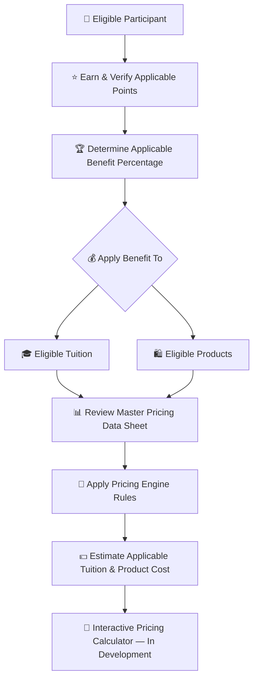
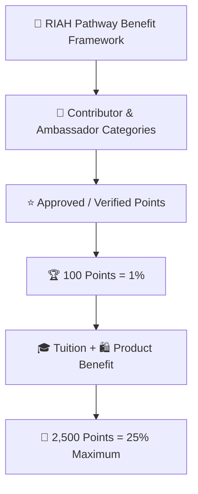
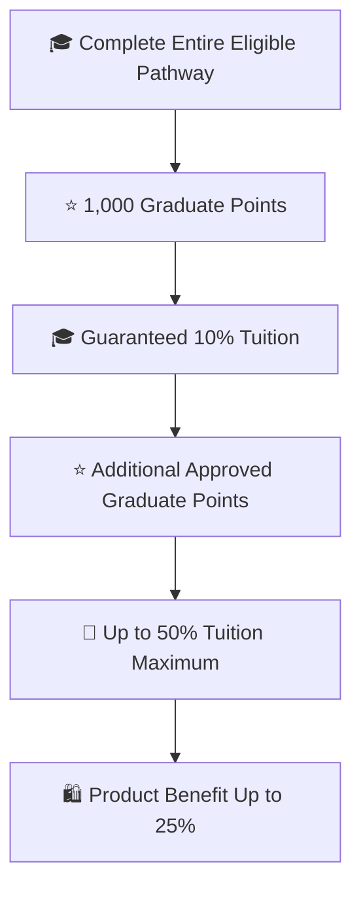
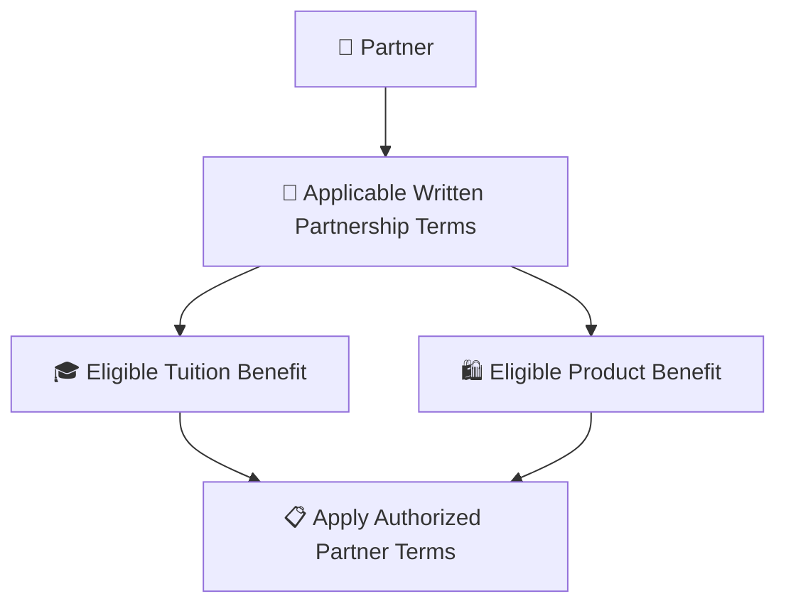

# 👑RIAH Pathway.

**Contributor; Mariah Dominique Rucker**

There is currently no team. I am building everything myself until I have hired the beta team. I am starting the hiring process this month, **October 2026**, for the CTO, CISO, experiential professionals, PhD-qualified faculty, and adjunct faculty for each school and major, with hiring continuing across the entire ecosystem as it scales.

Beta team members will be hired with **equity participation and compensation during the beta cohort**, which launches in **Spring 2027**.

The website will launch in **October 2026** as I continue to build, develop, revise, and finalize aspects of the RIAH Pathway ecosystem.

Learn more about me on GitHub and LinkedIn, or connect with me through social media and Linktree.

- **GitHub:** https://github.com/mariahdominiquerucker
- **LinkedIn:** https://linkedin.com/in/mariahrucker
- **Facebook:** https://facebook.com/heymariahrucker
- **Instagram:** https://instagram.com/heymariahrucker
- **Linktree:** https://linktr.ee/mariahrucker

---

# 👑 RIAH Pathway Contributor, Ambassador, Graduate & Partner Benefits

This README is the routing and master-summary page for the RIAH Pathway Contributor, Ambassador, Graduate and Partner Benefit framework. The complete eligibility rules, point systems, workflows, milestone tables, verification rules, examples, ledgers, YAML metadata and category diagrams are maintained in the individual category Markdown files.

## 💰 Tuition, Products & Pricing Resources

Contributor benefits in this documentation apply to **eligible tuition and eligible products** according to the rules for the applicable participant category.

| Pricing Resource | Purpose |
|---|---|
| 💰 [RIAH Pathway Master Pricing Data Sheet](../RIAH-Pathway-Master-Pricing-Data-Sheet.md) | Review current pathway tuition, program pricing, product pricing and other applicable pricing data. |
| 🧮 [RIAH Pathway Pricing Engine](../RIAH-Pathway-Pricing-Engine.md) | Review the pricing rules and calculation framework used to connect applicable pricing, eligibility, discounts and benefits. |

> **Pricing Calculator Development:** The interactive RIAH Pathway pricing calculator is still being developed. The intended calculator experience will allow eligible participants to apply their verified points and applicable benefit percentage to eligible tuition and product pricing so they can estimate what they may pay. Until that calculator is finalized, use the Master Pricing Data Sheet and Pricing Engine together with the applicable benefit rules in this documentation.

## 📑 Index

I. 🔑 Master Key  
II. 👥 Category Documentation  
III. 🧮 Master Benefit Structure  
IV. 🏆 Master Classification  
V. 🔄 Master Participation Flow  
VI. 👑 Shared Rules  
VII. 🎓 Reimbursement & Non-Stacking Structure  
VIII. ⭐ Weighted Points & Eligible Conversions  
IX. 📦 Ambassador Kit  
X. 🔗 QR Code & Digital Link  
XI. 🛍️ Product Benefit Rules  
XII. 🔄 Program Flow  
XIII. 📋 Master Record Fields

## I. 🔑 Master Key

| Emoji | Meaning |
|---|---|
| 💻 | GitHub Contributor |
| 🌎 | Community Ambassador |
| 🍎 | Substitute Teacher Ambassador |
| 🚗 | Rideshare Ambassador |
| 📦 | Delivery Ambassador |
| 🎓 | Student or Graduate |
| 🤝 | Partner |
| ⭐ | Approved points |
| 🏆 | Milestone |
| 🎓 | Tuition benefit |
| 🛍️ | Product benefit |
| 🔗 | QR, referral or attribution |
| 🎪 | Event, workshop or outreach |
| 🎥 | Webinar, presentation, video or media |
| 👀 | Under review |
| 🔄 | Revision or re-verification |
| ✅ | Approved or verified |
| ❌ | Rejected or ineligible |

## II. 👥 Category Documentation

| Category | Documentation |
|---|---|
| 👥 Ambassador Master | [AMBASSADORS.md](./AMBASSADORS.md) |
| 🎥 Content Creators | [CONTENT-CREATORS.md](./CONTENT-CREATORS.md) |
| 🔗 Affiliates | [AFFILIATES.md](./AFFILIATES.md) |
| 💻 GitHub Contributors | [GITHUB-CONTRIBUTORS.md](./GITHUB-CONTRIBUTORS.md) |
| 🌎 Community Ambassadors | [COMMUNITY-AMBASSADORS.md](./COMMUNITY-AMBASSADORS.md) |
| 🚗📦 Rideshare & Delivery Ambassadors — Combined | [RIDESHARE-DELIVERY.md](./RIDESHARE-DELIVERY.md) |
| 🚗 Rideshare Detail | [RIDESHARE.md](./RIDESHARE.md) |
| 📦 Delivery Detail | [DELIVERY.md](./DELIVERY.md) |
| 🍎 Substitute Teacher Ambassadors | [SUBSTITUTE-TEACHERS.md](./SUBSTITUTE-TEACHERS.md) |
| 🤝 Partner Employees — Combined | [PARTNER-EMPLOYEES.md](./PARTNER-EMPLOYEES.md) |
| 🤝 Partner Employee Detail | [ELIGIBLE-PARTNER-EMPLOYEES.md](./ELIGIBLE-PARTNER-EMPLOYEES.md) |
| 🎓 Education & Experiential Pathway Students | [STUDENTS.md](./STUDENTS.md) |
| 👥 Team Members | [TEAM-MEMBERS.md](./TEAM-MEMBERS.md) |
| 🤝 Partnership Terms Detail | [PARTNERS.md](./PARTNERS.md) |

## III. 🧮 Master Benefit Structure

### 🎓 Core Reimbursement Rules

| Component | Maximum |
|---|---:|
| Education / Experiential Program Completion | **10% guaranteed** |
| Ambassador Milestones | **Up to 25%** |
| Additional Reimbursement Milestones | **Up to 15%** |
| Education / Experiential Total | **Up to 50%** |
| Product Benefit | **Up to 25%** |

| Category | Up to 25% Ambassador Benefit | Completion / Tuition Benefit | Up to 25% Product Benefit |
|---|:---:|---|:---:|
| 👥 Team Members | — | **$0 tuition** | **50% discount** |
| 🎓 Education Pathway Students | ✅ | **10% guaranteed at completion; up to 50% total reimbursement** | ✅ |
| 🎓 Experiential Pathway Students | ✅ | **10% guaranteed at completion; up to 50% total reimbursement** | ✅ |
| 🎥 Content Creators | ✅ | Ambassador milestones | ✅ |
| 🔗 Affiliates | ✅ | Ambassador milestones | ✅ |
| 💻 GitHub Contributors | ✅ | Ambassador milestones | ✅ |
| 🌎 Community Ambassadors | ✅ | Ambassador milestones | ✅ |
| 🚗 Rideshare Ambassadors | ✅ | Ambassador milestones | ✅ |
| 📦 Delivery Ambassadors | ✅ | Ambassador milestones | ✅ |
| 🍎 Substitute Teacher Ambassadors | ✅ | Ambassador milestones | ✅ |
| 🤝 Partner Employees | ✅ | Ambassador milestones | ✅ |

## IV. 🏆 Master Classification

**Three-Ledger Points:** Education, Experiential and Products are separate ledgers. In each ledger, 100 verified points = 1% and 2,500 verified points = 25% maximum.

**Education & Experiential:** 10% guaranteed at completion + up to 25% Ambassador milestones + up to 15% additional reimbursement milestones = up to 50% total reimbursement.

**Non-Stacking / Allocation:** Approved activities across Content Creator, Affiliate, GitHub, Community, Rideshare, Delivery, Substitute Teacher and Partner Employee categories may be combined, but each point award is credited once to one selected ledger. Education, Experiential and Product ledgers are each independently capped at 25%.

## V. 🔄 Master Participation Flow

### 👥 High-Level Flow — Contributor & Ambassador Categories

### 🎓 High-Level Flow — Education & Experiential Graduates

### 🤝 High-Level Flow — Partners

## VI. 👑 Shared Rules

Qualifying activity must be verified before permanent points are credited.

A paying Education or Experiential student conversion is recorded first. The assigned 100-point student-conversion milestone is credited as **50 points when the converted student completes at least 50% of the program and +50 points when the student completes / graduates**.

One converted student does **not** automatically equal a 25% benefit.

Approved activities may combine inside a selected ledger, but the same underlying activity, conversion or purchase dollar cannot be credited to more than one ledger.

Team Members use a separate structure: **$0 tuition** and **50% off eligible products** continue based on meeting applicable monthly performance and contribution requirements under the Team Member agreement.

## VII. 🎓 Reimbursement & Non-Stacking Structure

| Component | Maximum |
|---|---:|
| Program / Degree Completion | **10% guaranteed** |
| Ambassador Milestones | **Up to 25%** |
| Additional Reimbursement Milestones | **Up to 15%** |
| Education / Experiential Total | **Up to 50%** |
| Product Benefit | **Up to 25%** |

**10% Completion + 25% Ambassador Benefit = 35%.** The remaining **15%** is earned through additional reimbursement milestones.

## VIII. ⭐ Weighted Points & Eligible Conversions

| Point Category | Included Activities |
|---|---|
| Student Conversion Milestones | Paying Education Pathway student; Paying Experiential Pathway student; 50% completion; completion / graduation |
| Purchase Conversions | Certification Review Program; Bar Review Program; Product purchase; Service purchase |
| Contributor Activities | Content creation; GitHub contribution; Affiliate / Partner referral |
| Ambassador Activities | Community event; Hosting a booth; Vehicle marketing; Community outreach |

| Conversion / Purchase Milestone | Point Treatment |
|---|---|
| Paying Education Pathway student conversion | Conversion recorded |
| Paying Experiential Pathway student conversion | Conversion recorded |
| Converted student reaches 50% completion | **50 points** |
| Converted student completes / graduates | **+50 points** |

## IX. 📦 Ambassador Kit

| Material | Physical | Digital |
|---|:---:|:---:|
| One apparel selection — T-shirt, sweatshirt/hoodie, jacket, coat, or blazer | ✅ | ❌ |
| Vehicle vinyl | ✅ | ❌ |
| Vehicle rooftop sign / billboard | ✅ | ❌ |
| Retractable banner | ✅ | ❌ |
| Tablecloth | ✅ | ❌ |
| Business card | ❌ | ✅ |
| Flyer | ❌ | ✅ |
| Brochure | ❌ | ✅ |
| Referral link | ❌ | ✅ |
| Products / Services / Pathways link | ❌ | ✅ |
| Individual QR code | ✅ | ✅ |

The reusable physical kit may use a subsidized cost of approximately **$250** based on physical materials, production and shipping.

## X. 🔗 QR Code & Digital Link

| Placement | Physical | Digital |
|---|:---:|:---:|
| Vehicle vinyl | ✅ | ❌ |
| Vehicle rooftop sign | ✅ | ❌ |
| Apparel | ✅ | ❌ |
| Retractable banner | ✅ | ❌ |
| Event table display | ✅ | ❌ |
| Digital business card | ❌ | ✅ |
| Digital flyer | ❌ | ✅ |
| Digital brochure | ❌ | ✅ |
| Digital content | ❌ | ✅ |
| Individual referral link | ❌ | ✅ |
| Individual QR code | ✅ | ✅ |

The personalized link connects people to RIAH Pathway **Education Pathways, Experiential Pathways, Certification Review Programs, Bar Review Programs, Products and Services** and attributes the referral to the Ambassador.

## XI. 🛍️ Product Benefit Rules

Product Benefit milestones are separate from tuition / program Ambassador milestones and may reach **up to 25%**.

Products are non-refundable except eligible damaged physical products. For applicable course or product programs, completing **100%** and not passing provides **three additional months of access** under the applicable guarantee.

## XII. 🔄 Program Flow

| Step | Process |
|---:|---|
| 1 | Ambassador signs up |
| 2 | Ambassador category or categories are identified |
| 3 | Kit, QR code and referral link are assigned |
| 4 | Ambassador completes eligible activities |
| 5 | Paying student conversions, purchases, events and contributions generate milestone points |
| 6 | Converted student reaches 50% completion and 50 student-conversion points are credited |
| 7 | Converted student completes / graduates and the remaining 50 student-conversion points are credited |
| 8 | Approved points are allocated once to the applicable **Education, Experiential or Product** ledger |
| 9 | Each ledger accumulates separately toward **25% maximum** |
| 10 | Student's own Education / Experiential completion earns **10% guaranteed** |
| 11 | Additional milestones may bring total Education / Experiential reimbursement to **50%** |

## XIII. 📋 Master Record Fields

| Field | Purpose |
|---|---|
| 👤 Participant | Verified participant |
| 🆔 Participant ID | Internal participant identifier |
| 👥 Classification | Contributor, Ambassador, Graduate or Partner |
| 🧩 Subcategory | Content Creator, Affiliate, GitHub, Community, Substitute Teacher, Rideshare, Delivery, Education, Experiential, Partner Employee, Team Member or Partner |
| 📝 Activity ID | Unique contribution or activity record |
| ⭐ Points | Approved points |
| 🏆 Milestone | Current milestone |
| 🎓 Tuition Benefit | Applicable tuition percentage |
| 🛍️ Product Benefit | Applicable product percentage or N/A |
| 👑 Approved By | Authorized reviewer |
| 🎯 Next Milestone | Next applicable threshold |
| ⏳ Points Remaining | Points required to next threshold |
| ✅ Status | Pending, review, revision, approved or credited |

## 🧮 Unified Three-Ledger Benefit Logic

Every eligible non-team participant may maintain **three separate benefit ledgers**:

| Ledger | Maximum | Point Scale |
|---|---:|---:|
| 🎓 Education Benefit | **25%** | **2,500 points** |
| 🧭 Experiential Benefit | **25%** | **2,500 points** |
| 🛍️ Product Benefit | **25%** | **2,500 points** |

**100 verified points = 1% in one selected eligible ledger. 2,500 verified points = 25% maximum in that ledger.** Education, Experiential and Product percentages are tracked separately. Eligible points may come from approved role activities, student-conversion milestones, attributable purchase revenue and other approved contributor / Ambassador activity. **Each point award, activity, conversion or purchase dollar is credited only once to one ledger.**

### 💵 Purchase Conversion
**$1 of verified eligible attributable net purchase value = 1 point.** Refunds, reversals, chargebacks, taxes, shipping, duplicate transactions and self-attributed purchases do not create benefit points.

| Purchase Value | Points | Benefit if credited to one ledger |
|---:|---:|---:|
| $100 | 100 | 1% |
| $500 | 500 | 5% |
| $1,500 | 1,500 | 15% |
| $2,500 | 2,500 | **25% MAX** |
| $10,000 | 10,000 generated points | **25% MAX per ledger; no double-counting** |

### 🎓 Education Conversion
A verified paying Education Pathway conversion earns **50 points at 50% completion + 50 points at completion / graduation = 100 Education points = 1%**.

### 🧭 Experiential Conversion
A verified paying Experiential Pathway conversion earns **50 points at 50% completion + 50 points at completion = 100 Experiential points = 1%**.

### 🏆 Exact 1%–25% Conversion Ladder
The purchase and student columns show the equivalent if that percentage were earned entirely from that one source. Different approved activities may be combined.

| Benefit | Points Required | Purchase Value Equivalent | Fully Completed Student Conversion Equivalent |
|---:|---:|---:|---:|
| 1% | 100 | $100 | 1 |
| 2% | 200 | $200 | 2 |
| 3% | 300 | $300 | 3 |
| 4% | 400 | $400 | 4 |
| 5% | 500 | $500 | 5 |
| 6% | 600 | $600 | 6 |
| 7% | 700 | $700 | 7 |
| 8% | 800 | $800 | 8 |
| 9% | 900 | $900 | 9 |
| 10% | 1,000 | $1,000 | 10 |
| 11% | 1,100 | $1,100 | 11 |
| 12% | 1,200 | $1,200 | 12 |
| 13% | 1,300 | $1,300 | 13 |
| 14% | 1,400 | $1,400 | 14 |
| 15% | 1,500 | $1,500 | 15 |
| 16% | 1,600 | $1,600 | 16 |
| 17% | 1,700 | $1,700 | 17 |
| 18% | 1,800 | $1,800 | 18 |
| 19% | 1,900 | $1,900 | 19 |
| 20% | 2,000 | $2,000 | 20 |
| 21% | 2,100 | $2,100 | 21 |
| 22% | 2,200 | $2,200 | 22 |
| 23% | 2,300 | $2,300 | 23 |
| 24% | 2,400 | $2,400 | 24 |
| 25% MAX | 2,500 | $2,500 | 25 |

### 📊 Tiers
| Tier | Points | Percentage |
|---|---:|---:|
| I | 100–400 | 1%–4% |
| II | 500–900 | 5%–9% |
| III | 1,000–1,400 | 10%–14% |
| IV | 1,500–1,900 | 15%–19% |
| V | 2,000–2,400 | 20%–24% |
| Maximum | 2,500+ | **25% MAX** |

Only complete 100-point thresholds increase the percentage. Points above 2,500 do not increase a single ledger beyond 25%. For Education or Experiential students / graduates, this contributor-benefit layer does not replace any separate completion or reimbursement benefit expressly provided under the applicable tuition policy.

## 🔗 Canonical Contributor-Benefit Routing

[README](./README.md) · [AMBASSADOR MASTER](./AMBASSADORS.md) · [CONTENT CREATORS](./CONTENT-CREATORS.md) · [AFFILIATES](./AFFILIATES.md) · [GITHUB CONTRIBUTORS](./GITHUB-CONTRIBUTORS.md) · [COMMUNITY AMBASSADORS](./COMMUNITY-AMBASSADORS.md) · [RIDESHARE + DELIVERY COMBINED](./RIDESHARE-DELIVERY.md) · [RIDESHARE DETAIL](./RIDESHARE.md) · [DELIVERY DETAIL](./DELIVERY.md) · [SUBSTITUTE TEACHERS](./SUBSTITUTE-TEACHERS.md) · [PARTNER EMPLOYEES COMBINED](./PARTNER-EMPLOYEES.md) · [PARTNER EMPLOYEE DETAIL](./ELIGIBLE-PARTNER-EMPLOYEES.md) · [PARTNERSHIP TERMS DETAIL](./PARTNERS.md) · [STUDENTS](./STUDENTS.md) · [TEAM MEMBERS](./TEAM-MEMBERS.md)

---

# 👑RIAH Pathway.
