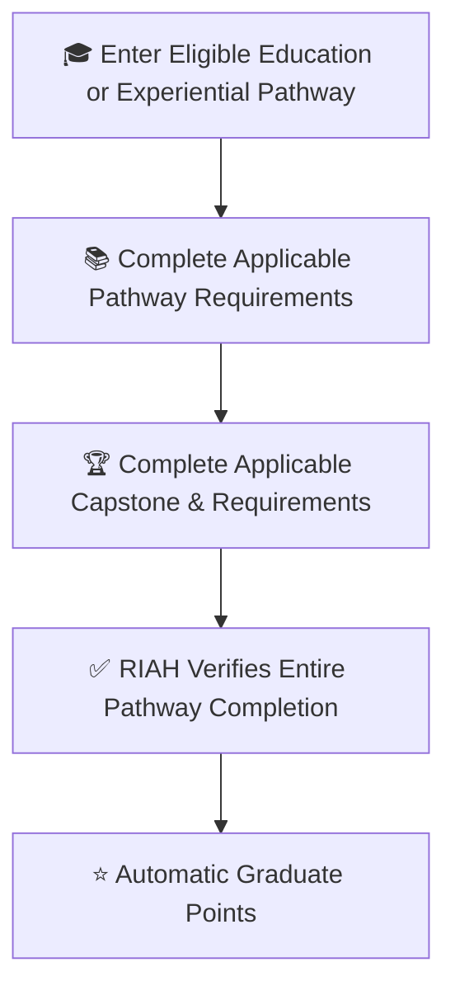
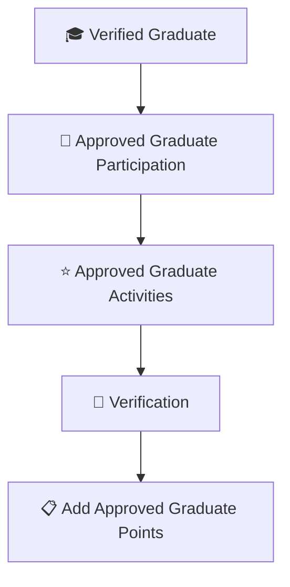
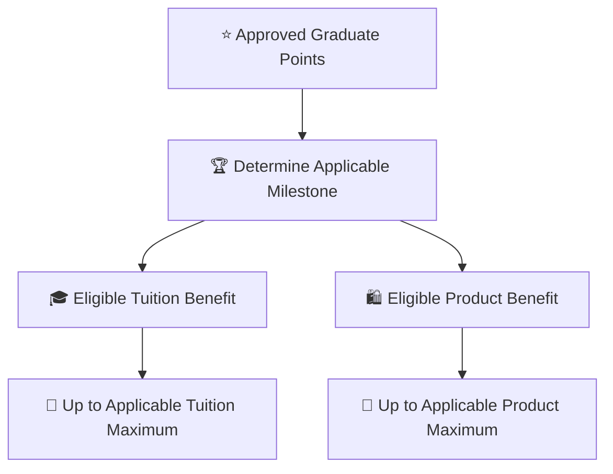
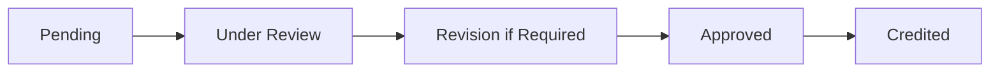
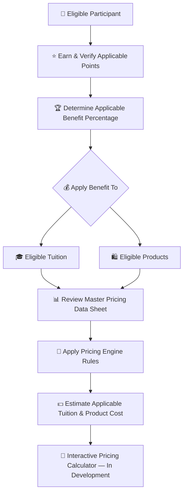
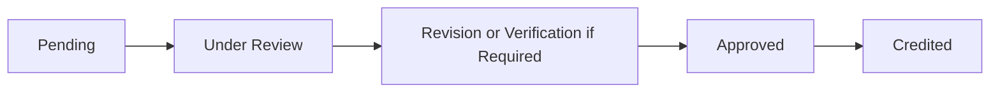

# 👑RIAH Pathway.

**Contributor; Mariah Dominique Rucker**

There is currently no team. I am building everything myself until I have hired the beta team. I am starting the hiring process this month, **October 2026**, for the CTO, CISO, experiential professionals, PhD-qualified faculty, and adjunct faculty for each school and major, with hiring continuing across the entire ecosystem as it scales.

Beta team members will be hired with **equity participation and compensation during the beta cohort**, which launches in **Spring 2027**.

The website will launch in **October 2026** as I continue to build, develop, revise, and finalize aspects of the RIAH Pathway ecosystem.

Learn more about me on GitHub and LinkedIn, or connect with me through social media and Linktree.

- **GitHub:** https://github.com/mariahdominiquerucker
- **LinkedIn:** https://linkedin.com/in/mariahrucker
- **Facebook:** https://facebook.com/heymariahrucker
- **Instagram:** https://instagram.com/heymariahrucker
- **Linktree:** https://linktr.ee/mariahrucker

---

# 🎓 Students — Education & Experiential Pathway Graduates

## 🎓 Category Key

| Emoji | Meaning |
|---|---|
| 🎓 | Education & Experiential Graduate |
| 👑 | Approved eligibility or contribution |
| ⭐ | Approved points |
| 🏆 | Completed milestone |
| 🎓 | Tuition benefit |
| 🛍️ | Product benefit |
| 🔗 | QR, referral, routing or attribution |
| 🎪 | Event, workshop or outreach |
| 🎥 | Webinar, presentation, video or media |
| 👀 | Under review |
| 🔄 | Revision or re-verification |
| ✅ | Approved or verified |
| ❌ | Rejected or ineligible |

## 🎓 End-to-End Category Flow

### 🎓 High-Level Flow — Pathway Completion

### 👑 High-Level Flow — Graduate Participation

### ⭐ High-Level Flow — Graduate Benefits

## ⚙️ Flow Metadata

**Flow Configuration:** Track — Education & Experiential Graduate; Profile Category — Student / Graduate; Status — in-progress; Verification Required — true; Points Require Approval — true; Benefit Record Required — true.

## 💰 Tuition, Products & Pricing Resources

Contributor benefits in this documentation apply to **eligible tuition and eligible products** according to the rules for the applicable participant category.

| Pricing Resource | Purpose |
|---|---|
| 💰 [RIAH Pathway Master Pricing Data Sheet](../RIAH-Pathway-Master-Pricing-Data-Sheet.md) | Review current pathway tuition, program pricing, product pricing and other applicable pricing data. |
| 🧮 [RIAH Pathway Pricing Engine](../RIAH-Pathway-Pricing-Engine.md) | Review the pricing rules and calculation framework used to connect applicable pricing, eligibility, discounts and benefits. |

> **Pricing Calculator Development:** The interactive RIAH Pathway pricing calculator is still being developed. The intended calculator experience will allow eligible participants to apply their verified points and applicable benefit percentage to eligible tuition and product pricing so they can estimate what they may pay. Until that calculator is finalized, use the Master Pricing Data Sheet and Pricing Engine together with the applicable benefit rules in this documentation.

## 📑 Index

I. 🎓 Graduate Benefit  
II. 👑 Eligibility  
III. 🏆 Guaranteed 10% Completion Milestone  
IV. 🧮 Graduate Point Formula  
V. 🏆 10%–50% Milestones  
VI. ⭐ Graduate Point Activities  
VII. 🎓 Graduate Benefit Levels  
VIII. 🛡️ Verification  
IX. 📋 Graduate Record  
X. 🏆 Examples
XI. 👑 Ambassador & Conversion Milestones

## I. 🎓 Graduate Benefit

Students who successfully complete an eligible RIAH Pathway Education Pathway or Experiential Pathway receive a separate Graduate Tuition Benefit.

**Complete the entire eligible Education or Experiential Pathway = guaranteed 10% eligible tuition reimbursement.**

The Education and Experiential reimbursement structure may reach **50% maximum eligible tuition / program reimbursement**: **10% guaranteed at completion + up to 25% Ambassador milestones + up to 15% additional reimbursement milestones**. Eligible product benefits are separate and may reach **up to 25%**.

## II. 👑 Eligibility

1. Successfully complete the entire applicable pathway.
2. Satisfy academic or Experiential completion requirements.
3. Complete required courses, modules, assessments, projects, placements or Experiential requirements.
4. Complete applicable capstone requirements.
5. Complete required documentation.
6. Satisfy applicable administrative requirements.
7. Receive RIAH Pathway verification.
8. Be in good standing at completion.
9. Connect the benefit to the verified graduate record.
10. Verify additional milestone activities above 10%.
11. Graduate points cannot be purchased.
12. Graduate points cannot be transferred.
13. Education Graduates and Experiential Graduates may qualify for up to 25% eligible products based on applicable approved Graduate Points and eligibility requirements. Product benefits are not guaranteed by pathway completion.
14. Maximum Graduate Tuition Benefit is 50%.

Qualifying pathways may include High School, GED, Associate's, Bachelor's, MBA, JD when applicable, Non-JD, designated approved Certification pathways, Experiential pathways and other designated qualifying RIAH educational pathways.

## III. 🏆 Guaranteed 10% Completion Milestone

| Achievement | Points | Tuition | Products |
|---|---:|---:|---:|
| Complete Entire Eligible Pathway | **1,000** | **10% GUARANTEED** | **Up to 25%** |

## IV. 🧮 Graduate Point Formula

| Component | Points / Maximum |
|---|---:|
| Complete eligible Education or Experiential Pathway | **1,000 points = 10% guaranteed** |
| Ambassador milestones | **Up to 2,500 points = 25%** |
| Additional reimbursement milestones | **Up to 1,500 points = 15%** |
| Total Education / Experiential reimbursement | **Up to 5,000 points = 50%** |
| Product Benefit | **Separate Product Benefit points; up to 2,500 points = 25%** |

Ambassador categories do not stack beyond the **25% Ambassador component**.

## V. 🏆 Graduate 10%–50% Milestones

| Points | Tuition | Products |
|---:|---:|---:|
| 1000 | 10% GUARANTEED| Up to 25% |
| 1100 | 11%| Up to 25% |
| 1200 | 12%| Up to 25% |
| 1300 | 13%| Up to 25% |
| 1400 | 14%| Up to 25% |
| 1500 | 15%| Up to 25% |
| 1600 | 16%| Up to 25% |
| 1700 | 17%| Up to 25% |
| 1800 | 18%| Up to 25% |
| 1900 | 19%| Up to 25% |
| 2000 | 20%| Up to 25% |
| 2100 | 21%| Up to 25% |
| 2200 | 22%| Up to 25% |
| 2300 | 23%| Up to 25% |
| 2400 | 24%| Up to 25% |
| 2500 | 25% | Up to 25% |
| 2600 | 26%| Up to 25% |
| 2700 | 27%| Up to 25% |
| 2800 | 28%| Up to 25% |
| 2900 | 29%| Up to 25% |
| 3000 | 30%| Up to 25% |
| 3100 | 31%| Up to 25% |
| 3200 | 32%| Up to 25% |
| 3300 | 33%| Up to 25% |
| 3400 | 34%| Up to 25% |
| 3500 | 35%| Up to 25% |
| 3600 | 36%| Up to 25% |
| 3700 | 37%| Up to 25% |
| 3800 | 38%| Up to 25% |
| 3900 | 39%| Up to 25% |
| 4000 | 40%| Up to 25% |
| 4100 | 41%| Up to 25% |
| 4200 | 42%| Up to 25% |
| 4300 | 43%| Up to 25% |
| 4400 | 44%| Up to 25% |
| 4500 | 45%| Up to 25% |
| 4600 | 46%| Up to 25% |
| 4700 | 47%| Up to 25% |
| 4800 | 48%| Up to 25% |
| 4900 | 49%| Up to 25% |
| 5000 | 50% MAX| Up to 25% |

## VI. ⭐ Graduate Point Activities

| Activity | Points |
|---|---:|
| Complete qualifying pathway | **1,000 guaranteed** |
| Attend approved alumni or RIAH event | 10 |
| Complete approved peer mentoring assignment | 25 |
| Support approved student orientation | 25 |
| Participate in approved educational webinar | 10 |
| Serve as approved webinar panelist | 25 |
| Serve as approved workshop presenter | 50 |
| Staff approved RIAH event | 25 |
| Staff approved education booth | 50 |
| Produce approved student resource | 25–50 |
| Support approved Experiential activity | 25–50 |
| Complete approved mentorship cycle | 50 |
| Complete approved cohort-support assignment | 25 |
| Support approved graduation activity | 25 |
| Complete approved research contribution | 25–75 |
| Complete approved documentation contribution | 25–75 |
| Complete approved educational content contribution | 25–75 |
| Complete substantial approved graduate contribution | 100 |
| Complete major approved graduate initiative | 150–250 |

All additional Graduate Points require verification.

## VII. 🎓 Graduate Benefit Levels

| Level | Points | Tuition |
|---|---:|---:|
| 🎓 Graduate | 1,000–1,900 | 10%–19% |
| 🎓🥉 Graduate Contributor | 2,000–2,900 | 20%–29% |
| 🎓🥈 Advanced Graduate Contributor | 3,000–3,900 | 30%–39% |
| 🎓🥇 Distinguished Graduate Contributor | 4,000–4,900 | 40%–49% |
| 👑🎓 Legacy Graduate Contributor | 5,000+ | 50% MAX |

## VIII. 🛡️ Verification

Completion and every additional point-bearing activity must be verified. Fabricated, duplicate, rejected, unauthorized or unverifiable activity receives no points. Pending activities do not change the benefit.

## IX. 📋 Graduate Record

Record Participant, Participant ID, Pathway, Completion Verification, Activity ID, Activity, Date, Base Completion Points, Added Points, Total Graduate Points, Milestone, Tuition Benefit, Product Benefit, Approved By, Next Milestone, Points Remaining and Status. Education Graduate and Experiential Graduate Product Benefits are up to 25% based on applicable approved Graduate Points and eligibility requirements.

## X. 🏆 Examples

Education Graduate: 1,000 completion + 50 peer mentoring + 25 orientation support + 50 workshop + 50 educational resource + 100 approved initiative = **1,275 points = 12% tuition; eligible product benefit may be up to 25% under applicable product-benefit requirements**.

Experiential Graduate: 1,000 completion + 50 Experiential support + 50 mentorship + 50 education booth + 50 research + 200 major initiative = **1,400 points = 14% tuition; eligible product benefit may be up to 25% under applicable product-benefit requirements**.

Maximum Education Graduate: **2,500 points = 25% eligible products maximum; tuition may continue through 5,000 points = 50% tuition maximum**.

Maximum Experiential Graduate: **2,500 points = 25% eligible products maximum; tuition may continue through 5,000 points = 50% tuition maximum**.

## XI. 👑 AMBASSADOR & CONVERSION MILESTONES

| Rule | Structure |
|---|---|
| Ambassador Benefit | **Up to 25%** |
| Product Benefit | **Up to 25%** through separate product milestones |
| Multiple Ambassador categories | **Do not stack beyond 25%** |
| Education / Experiential completion | **10% guaranteed** |
| Education / Experiential total reimbursement | **Up to 50%** |

| Conversion / Purchase Milestone | Point Treatment |
|---|---|
| Paying Education Pathway student conversion | Conversion recorded |
| Paying Experiential Pathway student conversion | Conversion recorded |
| Converted student reaches 50% program completion | **50 points** |
| Converted student completes / graduates | **+50 points** |
| Certification Review Program purchase | **25 points** |
| Bar Review Program purchase | **25 points** |
| Service purchase | **25 points** |
| Verified product purchases totaling $500 | **25 points** |
| Verified product purchases totaling $1,000 | **50 points** |
| Verified product purchases totaling $1,500 | **75 points** |

| Material | Physical | Digital |
|---|:---:|:---:|
| One apparel selection | ✅ | ❌ |
| Vehicle vinyl | ✅ | ❌ |
| Vehicle rooftop sign / billboard | ✅ | ❌ |
| Retractable banner | ✅ | ❌ |
| Tablecloth | ✅ | ❌ |
| Business card | ❌ | ✅ |
| Flyer | ❌ | ✅ |
| Brochure | ❌ | ✅ |
| Referral link | ❌ | ✅ |
| Products / Services / Pathways link | ❌ | ✅ |
| Individual QR code | ✅ | ✅ |

Products are non-refundable except eligible damaged physical products. For applicable course or product programs, completing **100%** and not passing provides **three additional months of access**.

### 🔗 Related Documentation

[README](./README.md) · [CONTENT-CREATORS](./CONTENT-CREATORS.md) · [AFFILIATES](./AFFILIATES.md) · [GITHUB-CONTRIBUTORS](./GITHUB-CONTRIBUTORS.md) · [COMMUNITY-AMBASSADORS](./COMMUNITY-AMBASSADORS.md) · [RIDESHARE](./RIDESHARE.md) · [DELIVERY](./DELIVERY.md) · [SUBSTITUTE-TEACHERS](./SUBSTITUTE-TEACHERS.md) · [ELIGIBLE-PARTNER-EMPLOYEES](./ELIGIBLE-PARTNER-EMPLOYEES.md) · [STUDENTS](./STUDENTS.md) · [TEAM-MEMBERS](./TEAM-MEMBERS.md)

RIAH Pathway

---

# 👑RIAH Pathway.
