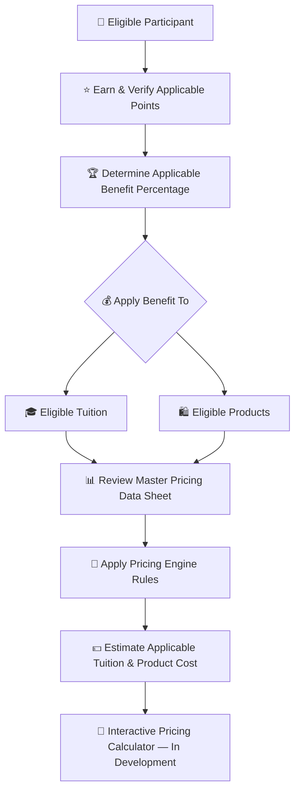
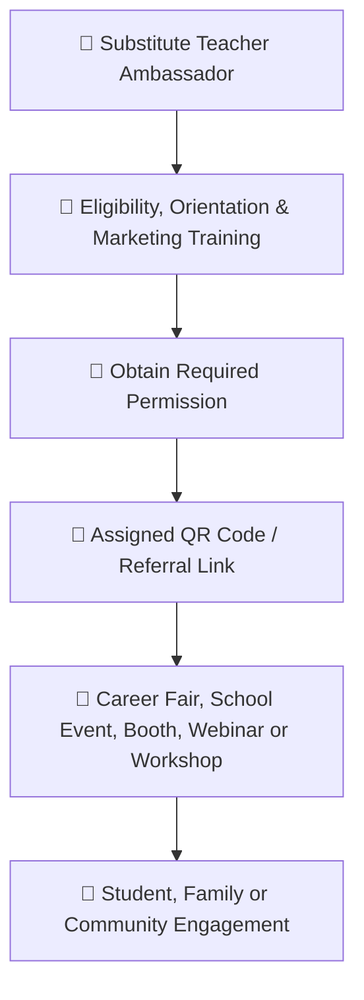
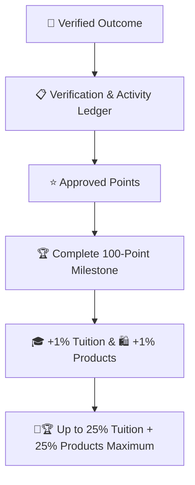
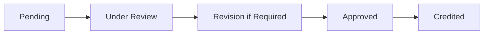
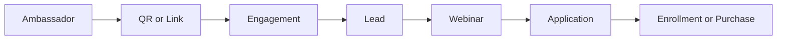
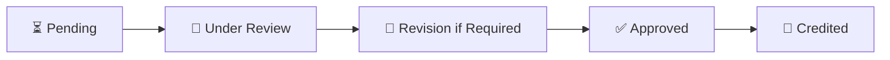

# 👑RIAH Pathway.

**Contributor; Mariah Dominique Rucker**

There is currently no team. I am building everything myself until I have hired the beta team. I am starting the hiring process this month, **October 2026**, for the CTO, CISO, experiential professionals, PhD-qualified faculty, and adjunct faculty for each school and major, with hiring continuing across the entire ecosystem as it scales.

Beta team members will be hired with **equity participation and compensation during the beta cohort**, which launches in **Spring 2027**.

The website will launch in **October 2026** as I continue to build, develop, revise, and finalize aspects of the RIAH Pathway ecosystem.

Learn more about me on GitHub and LinkedIn, or connect with me through social media and Linktree.

- **GitHub:** https://github.com/mariahdominiquerucker
- **LinkedIn:** https://linkedin.com/in/mariahrucker
- **Facebook:** https://facebook.com/heymariahrucker
- **Instagram:** https://instagram.com/heymariahrucker
- **Linktree:** https://linktr.ee/mariahrucker

---

# 🍎 Substitute Teacher Ambassadors

## 💰 Tuition, Products & Pricing Resources

Contributor benefits in this documentation apply to **eligible tuition and eligible products** according to the rules for the applicable participant category.

| Pricing Resource | Purpose |
|---|---|
| 💰 [RIAH Pathway Master Pricing Data Sheet](../RIAH-Pathway-Master-Pricing-Data-Sheet.md) | Review current pathway tuition, program pricing, product pricing and other applicable pricing data. |
| 🧮 [RIAH Pathway Pricing Engine](../RIAH-Pathway-Pricing-Engine.md) | Review the pricing rules and calculation framework used to connect applicable pricing, eligibility, discounts and benefits. |

> **Pricing Calculator Development:** The interactive RIAH Pathway pricing calculator is still being developed. The intended calculator experience will allow eligible participants to apply their verified points and applicable benefit percentage to eligible tuition and product pricing so they can estimate what they may pay. Until that calculator is finalized, use the Master Pricing Data Sheet and Pricing Engine together with the applicable benefit rules in this documentation.

## 📑 Index

I. 🍎 Category Key  
II. 🍎 End-to-End Category Flow  
III. ⚙️ Flow Metadata  
IV. 👑 General Eligibility  
V. 🧮 Benefit Formula  
VI. ⭐ Substitute Teacher Point System  
VII. 🎪 Events, Workshops and Outreach  
VIII. 🔗 QR Codes, Referral Links and Attribution  
IX. 🏆 1%–25% Milestones  
X. 👥 Benefit Levels  
XI. 🔗 Referral and Conversion Milestones  
XII. 🛡️ Verification and Anti-Abuse  
XIII. ⏳ Status Workflow  
XIV. 📋 Participant Ledger
XV. 👑 Shared Ambassador Program

## I. 🍎 Category Key
| Emoji | Meaning |
|---|---|
| 🍎 | Substitute Teacher Ambassador |
| 👑 | Approved eligibility or contribution |
| ⭐ | Approved points |
| 🏆 | Completed milestone |
| 🎓 | Tuition benefit |
| 🛍️ | Product benefit |
| 🔗 | QR, referral, routing or attribution |
| 🎪 | Event, workshop or outreach |
| 🎥 | Webinar, presentation, video or media |
| 👀 | Under review |
| 🔄 | Revision or re-verification |
| ✅ | Approved or verified |
| ❌ | Rejected or ineligible |

## II. 🍎 End-to-End Category Flow
### 🍎 High-Level Flow — Participation

### ⭐ High-Level Flow — Verification & Benefits

## III. ⚙️ Flow Metadata
**Flow Configuration:** Track — Substitute Teacher Ambassador; Profile Category — Substitute Teacher Ambassador; Status — in-progress; Verification Required — true; Points Require Approval — true; Benefit Record Required — true.

Substitute Teacher Ambassadors may contribute through school district events, career fairs, college fairs, education events, approved school-community events, informational booths, educational webinars, information sessions, workshops, approved brochures, flyers, information cards, QR codes, referral links, Education Pathway promotion, Experiential Pathway promotion, certification information, product information, family-information events, community events, approved social campaigns, organizational introductions, prospective-student referrals, student conversions and product conversions.

## IV. 👑 General Eligibility
Participants must maintain an identifiable profile; use assigned participant, Ambassador, referral or contributor identifiers when required; follow program instructions; use approved RIAH Pathway branding and current marketing materials; accurately represent programs, products, services and pathways; never make unauthorized promises regarding admission, accreditation, authorization, financial aid, employment, certification, licensure or educational outcomes; follow applicable school, employer, venue, platform and property requirements; obtain required permissions; submit evidence for point-bearing activity; use assigned QR codes and referral links where required; protect student, prospect, customer, employee and organizational information; never fabricate activity or conversions; complete required training; follow applicable RIAH policies; and receive verification before points become permanent.

Participation does not authorize marketing during instructional time or on school property without appropriate permission.

## V. 🧮 Benefit Formula
**100 verified points = 1% in one selected eligible benefit ledger. Education, Experiential and Products are separate ledgers; each is capped at 2,500 points = 25%.**

## VI. ⭐ Substitute Teacher Point System
| Activity | Points |
|---|---:|
| Complete Ambassador orientation | 25 |
| Complete marketing and program training | 25 |
| Attend approved school or district event | 25 |
| Staff approved information booth | 50 |
| Assist approved webinar | 25 |
| Host approved webinar or information session | 50 |
| Attend approved community education event | 25 |
| Complete approved local outreach assignment | 25 |
| Produce verified authorized event opportunity | 25 |
| Verified QR engagement package | 10 |
| Qualified prospective-student referral | 10 |
| Referral attends educational webinar | 15 |
| Referral completes application | 25 |
| Paying Education Pathway student conversion | Recorded |
| Paying Experiential Pathway student conversion | Recorded |
| Converted student reaches 50% program completion | 50 |
| Converted student completes / graduates | +50 |
| Coordinate approved career fair | 75 |
| Coordinate approved school-community event | 75 |
| Host approved multi-session workshop | 75 |
| Major approved Ambassador campaign | 100–200 |

## VII. 🎪 Events, Workshops and Outreach
Eligible activities may include college fairs, career fairs, community festivals, education fairs, school district events, parent information events, workforce events, career-development workshops, college-readiness events, professional-development events, community-center events, library events, approved school events, virtual information sessions, educational webinars, certification workshops, career workshops and Experiential pathway sessions.

| Event Contribution | Points |
|---|---:|
| Attend and support | 25 |
| Staff booth or table | 50 |
| Present approved session | 50 |
| Coordinate event participation | 75 |
| Organize approved RIAH workshop | 75 |
| Lead major approved event | 100 |
| Coordinate major multi-partner event | 150–200 |

Multiple event awards require genuinely separate responsibilities.
## VIII. 🔗 QR Codes, Referral Links and Attribution
Each applicable Ambassador uses an individually attributable QR code and referral link. Approved destinations may include the RIAH Pathway website, program pages, educational webinars, application pages, event registration, product pages, information-request forms and approved landing pages.

Conversions must be traceable to the assigned identifier or otherwise verified. Self-referrals do not qualify. Duplicate referrals do not create duplicate conversion awards.
## IX. 🏆 1%–25% Milestones
| Points | Tuition | Products |
|---:|---:|---:|
| 100 | 1% | 1% |
| 200 | 2% | 2% |
| 300 | 3% | 3% |
| 400 | 4% | 4% |
| 500 | 5% | 5% |
| 600 | 6% | 6% |
| 700 | 7% | 7% |
| 800 | 8% | 8% |
| 900 | 9% | 9% |
| 1000 | 10% | 10% |
| 1100 | 11% | 11% |
| 1200 | 12% | 12% |
| 1300 | 13% | 13% |
| 1400 | 14% | 14% |
| 1500 | 15% | 15% |
| 1600 | 16% | 16% |
| 1700 | 17% | 17% |
| 1800 | 18% | 18% |
| 1900 | 19% | 19% |
| 2000 | 20% | 20% |
| 2100 | 21% | 21% |
| 2200 | 22% | 22% |
| 2300 | 23% | 23% |
| 2400 | 24% | 24% |
| 2500 | 25% MAX | 25% MAX |

Only complete 100-point thresholds increase the benefit. Remaining points carry forward. Participation may continue after 2,500 points, but these benefits remain capped at 25%.

## X. 👥 Benefit Levels
| Level | Points | Benefit |
|---|---:|---:|
| 🟢 Level I | 100–400 | 1%–4% |
| 🔵 Level II | 500–900 | 5%–9% |
| 🟣 Level III | 1,000–1,400 | 10%–14% |
| 🔴 Level IV | 1,500–1,900 | 15%–19% |
| 👑 Level V | 2,000–2,400 | 20%–24% |
| 👑🏆 Maximum | 2,500+ | 25% |

## XI. 🔗 Referral and Conversion Milestones

| Stage | Point Treatment |
|---|---|
| Qualified Referral | 10 points |
| Webinar / Information Session Attendance | +15 points |
| Completed Application | +25 points |
| Paying Education Pathway student conversion | Conversion recorded |
| Paying Experiential Pathway student conversion | Conversion recorded |
| Converted student reaches 50% program completion | **50 points** |
| Converted student completes / graduates | **+50 points** |

One converted student does **not** automatically equal a 25% benefit.

## XII. 🛡️ Verification and Anti-Abuse
Verification may include activity records, event registration or check-in, appropriate event evidence, QR analytics, referral analytics, webinar registration, application attribution, enrollment attribution, product-order attribution, approved campaign records, GitHub records where applicable, and coordinator or maintainer approval.

No points are awarded for fake, duplicate or self-referrals; fake purchases; fraudulent transactions; fabricated events or attendance; QR manipulation; automated fake traffic; spam; plagiarism; duplicate submissions; unauthorized copyrighted material; fabricated testing or research; unauthorized school, vehicle or brand marketing; misleading program claims; pressure-based marketing; abandoned or rejected work; or restricted/confidential information.

One underlying activity normally receives one primary award unless separate point-bearing milestones or deliverables are independently verified.

## XIII. ⏳ Status Workflow

Pending work receives no permanent points. Rejected work receives zero points.

## XIV. 📋 Participant Ledger
Record Participant, Participant ID, Track, Activity or Contribution ID, Activity, Attribution, Submission Date, Verification Source, Points, Approved By, Previous Total, Added Points, New Total, Milestone, Tuition Benefit, Product Benefit, Next Milestone, Points Remaining and Status.

## XV. 👑 SHARED AMBASSADOR PROGRAM

| Rule | Structure |
|---|---|
| Ambassador Benefit | **Up to 25%** |
| Product Benefit | **Up to 25%** through separate product milestones |
| Multiple Ambassador categories | **Do not stack beyond 25%** |
| Education / Experiential completion | **10% guaranteed** |
| Education / Experiential total reimbursement | **Up to 50%** |

| Material | Physical | Digital |
|---|:---:|:---:|
| One apparel selection | ✅ | ❌ |
| Vehicle vinyl | ✅ | ❌ |
| Vehicle rooftop sign / billboard | ✅ | ❌ |
| Retractable banner | ✅ | ❌ |
| Tablecloth | ✅ | ❌ |
| Business card | ❌ | ✅ |
| Flyer | ❌ | ✅ |
| Brochure | ❌ | ✅ |
| Referral link | ❌ | ✅ |
| Products / Services / Pathways link | ❌ | ✅ |
| Individual QR code | ✅ | ✅ |

Products are non-refundable except eligible damaged physical products. For applicable course or product programs, completing **100%** and not passing provides **three additional months of access**.

### 🔗 Documentation

[README](./README.md) · [CONTENT-CREATORS](./CONTENT-CREATORS.md) · [AFFILIATES](./AFFILIATES.md) · [GITHUB-CONTRIBUTORS](./GITHUB-CONTRIBUTORS.md) · [COMMUNITY-AMBASSADORS](./COMMUNITY-AMBASSADORS.md) · [RIDESHARE](./RIDESHARE.md) · [DELIVERY](./DELIVERY.md) · [SUBSTITUTE-TEACHERS](./SUBSTITUTE-TEACHERS.md) · [ELIGIBLE-PARTNER-EMPLOYEES](./ELIGIBLE-PARTNER-EMPLOYEES.md) · [STUDENTS](./STUDENTS.md) · [TEAM-MEMBERS](./TEAM-MEMBERS.md)

## 🧮 Unified Three-Ledger Benefit Logic

Every eligible non-team participant may maintain **three separate benefit ledgers**: **Education**, **Experiential**, and **Products**. Each ledger is capped at **25% / 2,500 points**. **100 verified points = 1%** in the ledger to which the points are assigned.

Approved role activities, verified student conversions, attributable purchases and other approved activities may combine. The same activity, conversion, transaction or dollar cannot be counted in more than one ledger.

### 💵 Purchase Conversion
**$1 verified eligible attributable net purchase value = 1 point.** Refunds, reversals, chargebacks, taxes, shipping, duplicate transactions and self-attributed purchases do not count.

| Purchase Value | Points | Benefit if credited to one ledger |
|---:|---:|---:|
| $100 | 100 | 1% |
| $500 | 500 | 5% |
| $1,500 | 1,500 | 15% |
| $2,500 | 2,500 | **25% MAX** |
| $10,000 | 10,000 generated points | **25% MAX per ledger; no double-counting** |

### 🎓 Education Student Conversion
50 Education points at 50% completion + 50 Education points at completion / graduation = **100 points = 1%**.

### 🧭 Experiential Student Conversion
50 Experiential points at 50% completion + 50 Experiential points at completion = **100 points = 1%**.

### 🏆 Exact 1%–25% Conversion Ladder
| Benefit | Points | Purchase Value Equivalent | Fully Completed Student Conversion Equivalent |
|---:|---:|---:|---:|
| 1% | 100 | $100 | 1 |
| 2% | 200 | $200 | 2 |
| 3% | 300 | $300 | 3 |
| 4% | 400 | $400 | 4 |
| 5% | 500 | $500 | 5 |
| 6% | 600 | $600 | 6 |
| 7% | 700 | $700 | 7 |
| 8% | 800 | $800 | 8 |
| 9% | 900 | $900 | 9 |
| 10% | 1000 | $1,000 | 10 |
| 11% | 1100 | $1,100 | 11 |
| 12% | 1200 | $1,200 | 12 |
| 13% | 1300 | $1,300 | 13 |
| 14% | 1400 | $1,400 | 14 |
| 15% | 1500 | $1,500 | 15 |
| 16% | 1600 | $1,600 | 16 |
| 17% | 1700 | $1,700 | 17 |
| 18% | 1800 | $1,800 | 18 |
| 19% | 1900 | $1,900 | 19 |
| 20% | 2000 | $2,000 | 20 |
| 21% | 2100 | $2,100 | 21 |
| 22% | 2200 | $2,200 | 22 |
| 23% | 2300 | $2,300 | 23 |
| 24% | 2400 | $2,400 | 24 |
| 25% MAX | 2500 | $2,500 | 25 |

Multiple approved sources may add together to reach a threshold. Only complete 100-point thresholds increase the percentage. For students / graduates, this contributor-benefit layer does not replace any separate guaranteed completion or reimbursement benefit stated elsewhere in the tuition framework.

## 🔗 Canonical Routing

[README](./README.md) · [AMBASSADOR MASTER](./AMBASSADORS.md) · [RIDESHARE + DELIVERY COMBINED](./RIDESHARE-DELIVERY.md) · [PARTNER EMPLOYEES COMBINED](./PARTNER-EMPLOYEES.md)

---

# 👑RIAH Pathway.
