# 👑RIAH Pathway.

**Contributor/Founder/CEO/Chairman: Mariah Dominique Rucker**

There is currently no team. I am building everything myself until I have hired the beta team. I am starting the hiring process this month, **October 2026**, for the CTO, CISO, experiential professionals, PhD-qualified faculty, and adjunct faculty for each school and major, with hiring continuing across the entire ecosystem as it scales.

Beta team members will be hired with **equity participation and compensation during the beta cohort**, which launches in **Spring 2027**.

The website will launch in **October 2026** as I continue to build, develop, revise, and finalize aspects of the RIAH Pathway ecosystem.

Learn more about me on GitHub and LinkedIn, or connect with me through social media and Linktree.

- **GitHub:** https://github.com/mariahdominiquerucker
- **LinkedIn:** https://linkedin.com/in/mariahrucker
- **Facebook:** https://facebook.com/heymariahrucker
- **Instagram:** https://instagram.com/heymariahrucker
- **Linktree:** https://linktr.ee/mariahrucker

---

# 👑 RIAH PATHWAY SECONDARY SCHOOL
# GED / HSE CURRICULUM STRUCTURE

# 🎓 RIAH Pathway Course Assessments, Capstone Supervision, and Included Products

## 🏛️ Curriculum Architecture and Ongoing Development

The curriculum is structured and architected by the Founder and CEO. Once the Founder has hired PhD-qualified faculty and adjunct faculty within each applicable major, the curriculum will be continually developed, revised, and reviewed by those faculty members alongside experiential professionals.

Faculty hiring for the beta phase will include equity participation and compensation during the beta cohort and subsequent operations until operations are stable and accreditation is awarded.

Experiential programs are integrated throughout the education curriculum where applicable, together with the corresponding product collections.

| Curriculum Component | Responsibility or Integration |
|---|---|
| 🏛️ Structure and architecture | Established by the Founder and CEO |
| 👥 Faculty hiring | The Founder will hire PhD-qualified faculty and adjunct faculty within each applicable major |
| 🎓 Ongoing development, revision, and review | Will begin once the applicable faculty are hired and will involve those faculty members alongside experiential professionals |
| 💼 Beta faculty arrangements | Equity participation and compensation during the beta cohort and subsequent operations until operations are stable and accreditation is awarded |
| 🤝 Experiential programs | Integrated throughout the education curriculum where applicable |
| 📦 Product collections | Integrated with the applicable curriculum, courses, school, and major |

## 📝 Proctored Course Assessments

All courses are proctored through objective assessments, performance assessments, or both. This requirement applies to both the general track without certifications and applicable certification tracks.

| Assessment Requirement | Standard |
|---|---|
| 📋 Objective assessment | 25 questions per assessment |
| 🛠️ Performance assessment | One task-based performance assessment |
| ✅ Passing score | At least 80% on every required objective assessment and performance assessment |
| 🔄 Assessment attempts | Unlimited attempts to pass course assessments |
| 🔒 Course progression | Where applicable, remaining courses stay locked until required assessments are passed |

## 📈 Student Pacing, Acceleration, and Completion

RIAH Pathway education programs support acceleration based on each student’s academic readiness and pace. The earliest completion timeframe is **one month**, provided the student completes all required coursework, passes the required assessments, satisfies applicable prerequisites and supervision requirements, and makes the required payments. Any applicable mandatory program-duration or credentialing requirements remain controlling.

| Education Pathway | Typical Completion Timeframe |
|---|---|
| 🎓 Associate’s | Two years |
| 🎒 Bachelor’s | Four years |
| 🔬 Master’s | One year |
| 📊 MBA | One year |
| ⚖️ JD | Four years |
| 🌱 Minor | One semester to one year |
| 🏫 High School | Four years; academically gifted students may complete the required curriculum in one month when all completion requirements are satisfied |
| 📘 GED/HSE Preparation | Based on the student’s readiness and pace; accelerated curriculum completion may occur in one month |
| 📜 Other Education Pathways | Based on the applicable curriculum and student pace, with one month as the earliest completion timeframe where permitted |

Typical timeframes describe the standard pace. Students may advance more quickly as they complete the required courses and satisfy the applicable payment requirements.

All education pathways retain their required **proctored objective assessments, performance assessments, or both**, including during accelerated progression. Students must achieve at least **80% on every required assessment**. Applicable capstone projects retain their assigned industry-professional supervision.

Course progression requires completion of the applicable prior coursework and assessments, together with satisfaction of the required payment for the next course to unlock.

Payments follow the applicable **beta, pre-accreditation, or post-accreditation pricing stage** and payment rules established in the **RIAH Pathway Master Pricing Data Sheet** and **RIAH Pathway Pricing Engine** within the **Tuition-Pricing-and-Fees** folder. Acceleration changes progression and completion timing without automatically changing established total-program tuition.

GED/HSE curriculum completion remains separate from official examinations and credential issuance.

## School of Foundations — High School Diploma, GED/HSE, and Dual Enrollment Eligibility Requirements

### 1. Incoming Ninth-Grade Students — RIAH High School Diploma
The RIAH Pathway High School Diploma Program accepts eligible students transitioning **from eighth grade into ninth grade**. Applicants must have a **minimum 3.0 GPA in eighth grade**, verified through their academic records.

Eligible incoming ninth graders may choose:
- **High School Diploma:** Complete RIAH Pathway's diploma curriculum and graduation requirements.
- **High School Diploma with Dual Enrollment:** Complete the same RIAH diploma requirements while concurrently earning eligible college credits.

**Eighth graders entering ninth grade are not GED applicants.** Students admitted to RIAH Pathway's diploma program remain on the diploma pathway; they **cannot switch from the RIAH High School Diploma Program into RIAH's GED/HSE Program**. RIAH supports these students in completing their diploma.

### 2. Students Already Enrolled in High School — Dual Enrollment or Diploma Transfer
Students attending another high school when RIAH Pathway launches may remain there, complete that school's diploma, and take eligible RIAH college **Dual Enrollment** courses.

A student already attending high school elsewhere may also **be considered for transfer into RIAH's High School Diploma Program** only after:
- **Completing at least two full academic years of high school** (the equivalent of completed ninth- and tenth-grade academic years); and
- Having a **minimum cumulative high school GPA of 3.0**, verified by transcript.

Qualifying students entering **eleventh grade or later** may be considered for RIAH diploma transfer with concurrent college enrollment. Meeting the two-year and GPA thresholds establishes eligibility for **consideration**, not automatic acceptance. RIAH will review academic records and remaining diploma requirements.

**Ninth and tenth graders who have not completed two full high school years are not eligible for RIAH diploma transfer.** They may remain at their existing high school and participate in eligible RIAH college dual enrollment. Students who do not meet the **3.0 GPA** threshold may continue at their current high school and pursue eligible RIAH dual enrollment rather than enter RIAH's diploma program.

### 3. Previous High School Dropouts — GED/HSE Program
RIAH Pathway's GED/HSE Program is a **second-chance educational pathway**, intended for individuals who previously struggled in high school, made a documented effort to attend and complete high school, but did not earn a diploma.

A GED/HSE applicant must meet **all** of the following requirements:
1. **Previous withdrawal:** Discontinued high school **before RIAH Pathway officially launched**, rather than leaving after launch to take the GED route.
2. **No completed credential:** Has **not** earned a high school diploma or GED.
3. **Academic participation:** Has **completed at least two full academic years of high school**. Simply enrolling briefly or beginning a second year is insufficient.
4. **Documented attendance:** Has **at least 80% high school attendance in each of those two completed academic years**, verified through attendance records or equivalent school documentation.
5. **Prior academic difficulty/noncompletion:** Is seeking a second opportunity after difficulty completing the traditional high school pathway.

**GED/HSE enrollment is not for ninth or tenth graders who have not completed two full high school academic years.** No eighth grader entering ninth grade may use the GED/HSE pathway.

Eligible GED/HSE students may undertake RIAH GED/HSE preparation alongside **12 eligible concurrent college General Education credits**. The GED/HSE pathway has **no 3.0 GPA minimum**; its eligibility standard is documented prior high school effort, completion of two years, attendance of at least 80% in each year, and previous noncompletion.

### 4. Enrollment Protection and Pathway Restrictions
RIAH Pathway does not encourage currently enrolled high school students to withdraw in order to take four GED/HSE preparation courses.

Students who withdraw **after RIAH Pathway's official launch** cannot use that withdrawal to gain admission to its GED/HSE Program, even if they have completed two years or met the attendance threshold. Current students remain in the high school diploma pathway, may use RIAH dual enrollment, or may be considered for RIAH diploma transfer after meeting the **two-year and 3.0 GPA** requirements.

Once a student is enrolled in RIAH's High School Diploma Program, **the student cannot transfer internally to RIAH GED/HSE**. The institution supports the student through completion of the diploma pathway.

The high school diploma and GED/HSE are different secondary credentials; RIAH's GED/HSE option is reserved for eligible people who previously attempted high school and need a second opportunity.

### 5. Dual Enrollment Eligibility
RIAH Pathway's college Dual Enrollment Program may be paired with:
- **Current students at other high schools:** Stay at their current institution for their diploma and take eligible RIAH college courses.
- **RIAH incoming ninth-grade diploma students:** Earn approved college credits concurrently with RIAH diploma coursework.
- **Eligible eleventh-grade-or-later RIAH diploma transfer students:** Complete remaining RIAH diploma requirements and eligible concurrent college coursework after admission.
- **Eligible previous high school dropouts:** Complete GED/HSE preparation with an optional **12-credit** concurrent college General Education track.

### 6. Official Enrollment Parameters
1. RIAH's initial ninth-grade diploma applicants must be moving from eighth into ninth grade and have at least a **3.0 eighth-grade GPA**.
2. A current high school student at another institution may be **considered for RIAH diploma transfer** after at least **two completed high school academic years** and a **3.0 cumulative high school GPA**; this normally means eleventh-grade entry or later.
3. Students still in ninth or tenth grade who have not completed two years may take eligible RIAH college dual enrollment while remaining at their high school, but cannot transfer into RIAH's diploma program.
4. A previous dropout seeking RIAH GED/HSE must have left high school **before launch**, have **no diploma or GED**, completed **two full high school years**, and documented **at least 80% attendance in each of those years**.
5. GED/HSE is not an entry route for eighth graders entering ninth, ninth or tenth graders without two completed years, students withdrawing after launch, or students already admitted into RIAH's diploma program.
6. GED/HSE applicants are not required to have a 3.0 GPA; the program is a second-chance pathway based on documented prior academic participation and noncompletion.
7. RIAH diploma entrants and eligible diploma transfers remain in the **high school diploma program**, not RIAH GED/HSE.
8. Eligible students in all four defined categories may participate in their applicable RIAH college dual enrollment pathway, with their secondary and college requirements separately tracked.

**RIAH Pathway's School of Foundations provides a supported route to a high school diploma for eligible ninth-grade entrants and qualifying later high school transfers; it reserves GED/HSE preparation for prior, documented high school noncompleters who completed at least two years of school with 80% annual attendance.**

## 🎓 Admission and Prerequisite Requirements

Students are not automatically admitted into Year 3 of a bachelor’s program. They must have completed the required general education and school core coursework.

Master’s and MBA programs require completion of the applicable prerequisites, along with a bachelor’s degree in the corresponding major or an equivalent qualification.

| Program | Requirement |
|---|---|
| 📘 Bachelor’s Year 3 | Admission is not automatic; students must have completed the required general education and school core coursework |
| 🎓 Master’s | Applicable prerequisites and a bachelor’s degree in the corresponding major or equivalent |
| 💼 MBA | Applicable prerequisites and a bachelor’s degree in the corresponding major or equivalent |

## 🛤️ General and Certification Track Options

Students may select a general track without certifications for bachelor’s Year 4, master’s, and MBA programs. Applicable certification tracks are also available. All courses require an objective assessment, performance assessment, or both, regardless of the selected track.

| Track Option | Requirements |
|---|---|
| 📚 General track without certifications | Available for bachelor’s Year 4, master’s, and MBA programs; all courses retain their required proctored assessments |
| 🏅 Applicable certification track | Includes certification review for the selected track where the certification is applicable; all courses retain their required proctored assessments |

## 🏅 Certification Review Courses

Certification review courses include proctored objective assessments and performance assessments conducted through task-based simulations. These requirements apply when certification review is selected within the student’s track and the certification is applicable.

| Certification Review Requirement | Standard |
|---|---|
| 📋 Objective assessment | Proctored assessment consisting of 25 questions |
| 🛠️ Performance assessment | One proctored task-based simulation |
| ✅ Passing score | At least 80% on each required assessment |
| 🔄 Assessment attempts | Unlimited attempts to pass course assessments |
| 🔒 Course progression | Where applicable, remaining courses stay locked until required assessments are passed |

## 🎯 Capstone Assessments and Project Supervision

Capstones include proctored objective assessments and performance assessments based on concepts students should have learned through their course assessments. Cumulative project work is supervised by assigned industry professionals.

**Industry-professional supervision applies only to Year 4 capstones for bachelor’s, master’s, and MBA programs and to courses 300A and 300B for minor-degree capstones.**

| Capstone Component | Requirement |
|---|---|
| 📋 Objective assessment | Proctored assessment consisting of 25 questions |
| 🛠️ Performance assessment | One proctored task-based performance assessment |
| ✅ Passing score | At least 80% on each required assessment |
| 🔄 Assessment attempts | Unlimited attempts to pass course assessments |
| 📚 Assessment scope | Concepts students should have learned through the proctored objective and performance assessments |
| 🧩 Cumulative projects | Not proctored; supervised by assigned industry professionals within the specified capstone courses |
| 👔 Assigned supervision | Industry professionals assigned to supervise the applicable capstone projects |
| 🎓 Bachelor’s, master’s, and MBA supervision | Year 4 capstones only |
| 📘 Minor-degree supervision | Capstone courses 300A and 300B only |
| ⏱️ Supervision hours | 20 hours of supervision across the capstone courses, with two hours of supervision per course |
| 👥 Human review panel | Five people representing industry professionals, employers, community members, and peers |

## 📦 Included Education Products and Collections

Education programs include products aligned with the student’s school and major. Applicable collections support minor, associate’s, bachelor’s, master’s, and MBA programs.

Collections include textbooks, workbooks, journals, planners, review guides, and study guides for their applicable courses.

| Internal Collection | Alignment |
|---|---|
| 🌍 General Education | General education coursework |
| 🏫 School Core | Core coursework within the student’s school |
| 🎓 Major | Coursework within the student’s major |
| 🎯 Capstone | Applicable capstone coursework and projects |

## 🧾 Product Features and Access

| Product Category | Availability and Reference |
|---|---|
| 🎒 Internal collections | Available only to enrolled students |
| 🛍️ External collections | Products offered to external customers |
| ⚙️ Included products and features | Listed in the pricing engine and data sheet |
| 🏫 Program alignment | Based on the student’s school, major, and applicable program |

## 1. GED PROGRAM MODEL

**GED eligibility:** Only people who withdrew before RIAH launched and have no diploma/GED, **two completed academic years of high school**, and **at least 80% attendance in each completed year**. No GED for ninth/tenth graders lacking two years, students withdrawing after launch, incoming ninth graders, or students in RIAH's diploma program. Eligible GED students may pursue 12 concurrent college credits.

| GED PROGRAM MODEL Component | GED PROGRAM MODEL Requirement |
| --- | --- |
| Preparation | RIAH Pathway Secondary School offers the GED/HSE Preparation pathway as part of its secondary education structure. |
| GED/HSE students receive a complete RIAH Pathway learning environment consisting of | GED/HSE students receive a complete RIAH Pathway learning environment consisting of: |

| Learning Resource | Curriculum Inclusion |
| --- | --- |
| RIAH Textbook | - **RIAH Textbook** |
| RIAH Workbook | - **RIAH Workbook** |
| RIAH Journal / Module Notebook | - **RIAH Journal / Module Notebook** |
| RIAH Planner / Curriculum Planner | - **RIAH Planner / Curriculum Planner** |
| RIAH Study Guide | - **RIAH Study Guide** |
| RIAH Review Guide | - **RIAH Review Guide** |
| RIAH LMS | - **RIAH LMS** |
| RIAH Curriculum | - **RIAH Curriculum** |
| RIAH Assignments | - **RIAH Assignments** |
| RIAH Assessments | - **RIAH Assessments** |
| Edmentum GED/HSE Preparation Content | - **Edmentum GED/HSE Preparation Content** |
| Edmentum Courseware | - **Edmentum Courseware** |
| Edmentum Mathematics Content and Assessment Resources | - **Edmentum Mathematics Content and Assessment Resources** |
| Official HiSET Preparation Materials where applicable | - **Official HiSET Preparation Materials where applicable** |
| State Add-On Curriculum and Resources, if applicable | - **State Add-On Curriculum and Resources, if applicable** |

### GED + HiSET Structure

| GED + HiSET Structure Component | GED + HiSET Structure Requirement |
| --- | --- |
| GED / HiSET | GED and HiSET preparation are part of the **RIAH Pathway Secondary School**. |
| RIAH separates | RIAH separates: |
| Preparation | **Preparation → Official Credentialing** |
| Preparation | RIAH provides the preparation curriculum. |
| GED / HiSET | Official GED/HiSET examination and credentialing follow the applicable examination provider and state/jurisdiction requirements. |
| GED / HiSET | HiSET preparation is incorporated where the applicable jurisdiction uses or permits HiSET. |

### Edmentum Structure

| Instructional Component | Curriculum Mapping / Authority |
| --- | --- |
| Edmentum | **Edmentum is the primary instructional software and curriculum-content ecosystem.** |
| Edmentum | **Edmentum provides the primary mapped instructional content for GED/HSE preparation and applicable General Education coursework.** |
| Edmentum | **Edmentum → GED/HSE Preparation Content + General Education Courseware + Applicable Assessment and Learning Resources** |
| Edmentum serves two primary purposes | Edmentum serves two primary purposes: |

### GED/HSE Preparation — Edmentum Software Coverage

| RIAH Course | Course Name | Edmentum |
| --- | --- | --- |
| **GED 101** | Mathematical Reasoning Preparation | **✓** |
| **GED 102** | Reasoning Through Language Arts Preparation | **✓** |
| **GED 103** | Science Preparation | **✓** |
| **GED 104** | Social Studies Preparation | **✓** |

| Instructional Component | Curriculum Mapping / Authority |
| --- | --- |
| ✓ | **✓ = Edmentum provides applicable instructional content/courseware that RIAH maps into its curriculum. RIAH curriculum remains controlling.** |

### Purpose 1 — GED / HiSET Preparation

| Course Code | Course / Credit Alignment |
| --- | --- |
| GED 101 | - **GED 101 — Mathematical Reasoning Preparation** |
| GED 102 | - **GED 102 — Reasoning Through Language Arts Preparation** |
| GED 103 | - **GED 103 — Science Preparation** |
| GED 104 | - **GED 104 — Social Studies Preparation** |

| Purpose 1 — GED / HiSET Preparation Component | Purpose 1 — GED / HiSET Preparation Requirement |
| --- | --- |
| GED / HiSET | For students following a HiSET pathway, RIAH incorporates applicable HiSET preparation materials into the corresponding RIAH courses. |

### Purpose 2 — General Education Placement/Test-Out + Coursework

| Assessment Component | Assessment Requirement |
| --- | --- |
| Edmentum and applicable Edmentum resources support | Edmentum and applicable Edmentum resources support: |

| Course Code | Course / Credit Alignment |
| --- | --- |
| ENG 1010 | - **ENG 1010 — College English** |
| MAT 1010 | - **MAT 1010 — College Algebra** |
| COM 1010 | - **COM 1010 — Oral Communications** |
| LAN 1010 | - **LAN 1010 — Foreign Language** |
| HIS 1010 | - **HIS 1010 — History** |
| PHI 1010 | - **PHI 1010 — Philosophy** |
| PSY 1010 | - **PSY 1010 — Psychology** |
| SOC 1010 | - **SOC 1010 — Sociology** |
| ART 1010 | - **ART 1010 — Art** |
| SCI 1010 | - **SCI 1010 — Science** |

| Assessment Component | Assessment Requirement |
| --- | --- |
| Purpose 2 — General Education Placement/Test-Out + Coursework | The placement/test-out determination remains a **RIAH Pathway institutional determination**. |

### General Education — Edmentum Software Coverage

| RIAH Course | Course Name | Edmentum |
| --- | --- | --- |
| **ENG 1010** | College English | **✓** |
| **MAT 1010** | College Algebra | **✓** |
| **COM 1010** | Oral Communications | **✓** |
| **LAN 1010** | Foreign Language | **✓** |
| **HIS 1010** | History | **✓** |
| **PHI 1010** | Philosophy | **X — RIAH Additional Curriculum** |
| **PSY 1010** | Psychology | **✓** |
| **SOC 1010** | Sociology | **✓** |
| **ART 1010** | Art | **✓** |
| **SCI 1010** | Science | **✓** |

| Instructional Component | Curriculum Mapping / Authority |
| --- | --- |
| Edmentum | **Philosophy Note — PHI 1010 remains part of the RIAH General Education curriculum. RIAH will provide and/or integrate additional Philosophy curriculum because Edmentum does not provide the mapped Philosophy coverage used for this structure.** |

### RIAH Curriculum + Edmentum Integration

| Instructional Component | Curriculum Mapping / Authority |
| --- | --- |
| Edmentum | Edmentum does **not replace the RIAH curriculum**. |
| RIAH develops and controls its own | RIAH develops and controls its own: |

| Learning Resource | Curriculum Inclusion |
| --- | --- |
| Curriculum | - Curriculum |
| Textbooks | - Textbooks |
| Workbooks | - Workbooks |
| Journals / Module Notebooks | - Journals / Module Notebooks |
| Curriculum Planners | - Curriculum Planners |
| Study Guides | - Study Guides |
| Review Guides | - Review Guides |
| Assignments | - Assignments |
| Projects | - Projects |
| Assessments | - Assessments |
| Checkpoints | - Checkpoints |
| Final examinations | - Final examinations |
| Academic requirements | - Academic requirements |

| Instructional Component | Curriculum Mapping / Authority |
| --- | --- |
| Edmentum | Edmentum resources are integrated into the RIAH curriculum. |

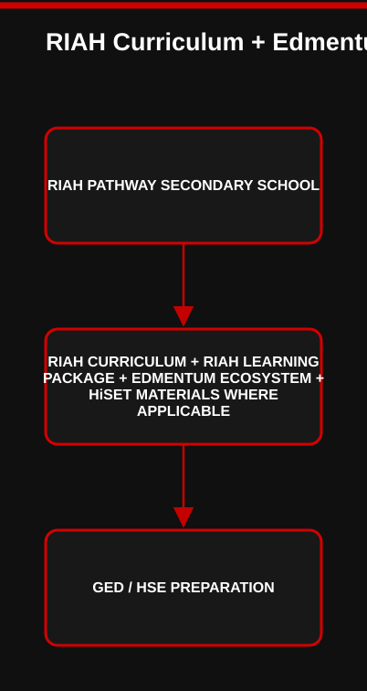

[View editable Mermaid diagram](./IMAGES/FLOW-01-GED-STRUCTURE.mmd)

---

# 2. GED / HiSET PREPARATION + GENERAL EDUCATION STRUCTURE

## Component 1 — GED / HiSET Preparation

| RIAH Course | Primary Structure | Credits |
| --- | --- | --- |
| **GED 101 — Mathematical Reasoning Preparation** | Edmentum Mathematical Reasoning content + applicable HiSET Mathematics materials | **3** |
| **GED 102 — Reasoning Through Language Arts Preparation** | Edmentum Reasoning Through Language Arts content + applicable HiSET Reading/Writing materials | **3** |
| **GED 103 — Science Preparation** | Edmentum Science content + applicable HiSET Science materials | **3** |
| **GED 104 — Social Studies Preparation** | Edmentum Social Studies content + applicable HiSET Social Studies materials | **3** |
| **TOTAL** |  | **12** |

## Component 2 — Concurrent General Education

| Component 2 — Concurrent General Education Component | Component 2 — Concurrent General Education Requirement |
| --- | --- |
| Eligible GED/HSE students may concurrently pursue the four directly corresponding RIAH Pathway General Education courses | Eligible GED/HSE students may concurrently pursue the four directly corresponding RIAH Pathway General Education courses: |

| Course Code | Course / Credit Alignment |
| --- | --- |
| GED 101 | - **GED 101 → MAT 1010 — College Algebra — 3 Credits** |
| GED 102 | - **GED 102 → ENG 1010 — College English — 3 Credits** |
| GED 103 | - **GED 103 → SCI 1010 — Science — 3 Credits** |
| GED 104 | - **GED 104 → HIS 1010 — History — 3 Credits** |

| Component 2 — Concurrent General Education Component | Component 2 — Concurrent General Education Requirement |
| --- | --- |
| Total Concurrent General Education Opportunity | **Total Concurrent General Education Opportunity: 12 Credits** |
| General Education | The GED Preparation credits and General Education credits remain academically separate. |

#### Mermaid Flow 01 — Component 2 — Concurrent General Education (Part 1 of 3)

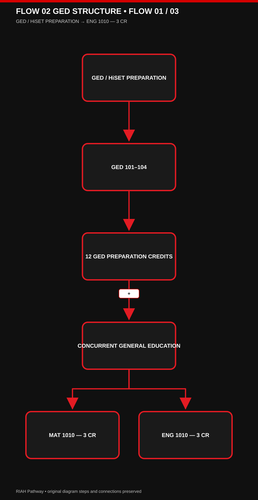

[View editable Mermaid Flow 01](./IMAGES/FLOW-02-GED-STRUCTURE-PART-01.mmd)

#### Mermaid Flow 02 — Component 2 — Concurrent General Education (Part 2 of 3)

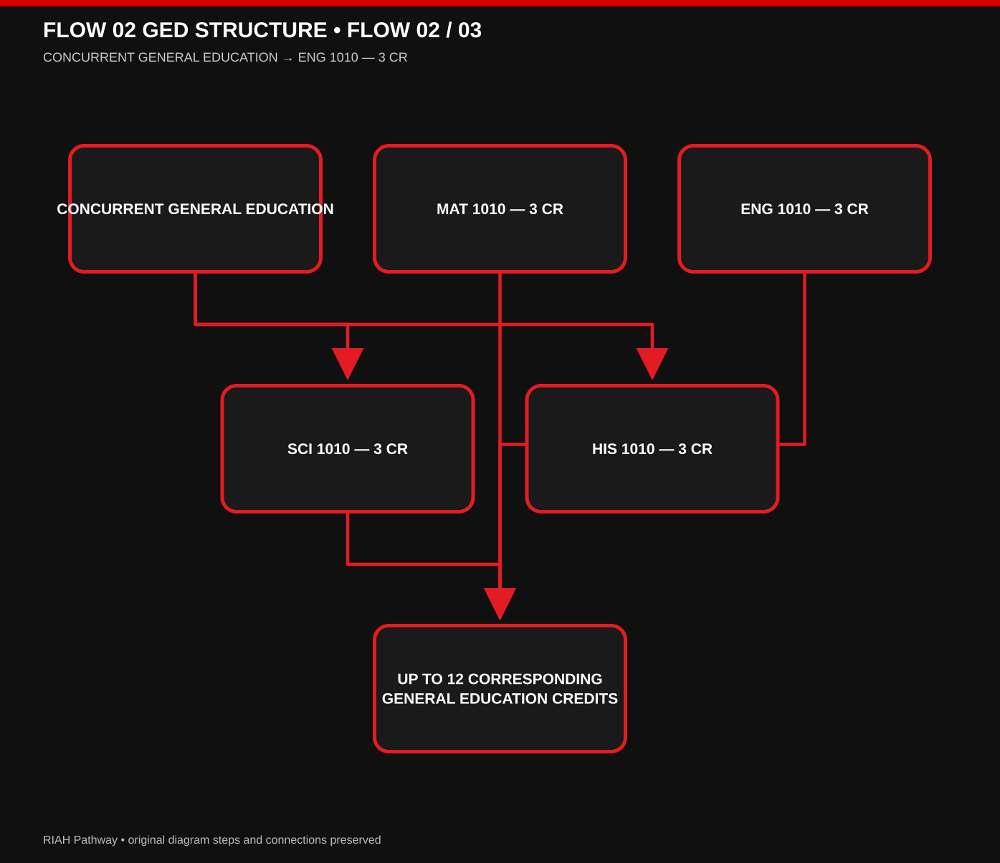

[View editable Mermaid Flow 02](./IMAGES/FLOW-02-GED-STRUCTURE-PART-02.mmd)

#### Mermaid Flow 03 — Component 2 — Concurrent General Education (Part 3 of 3)

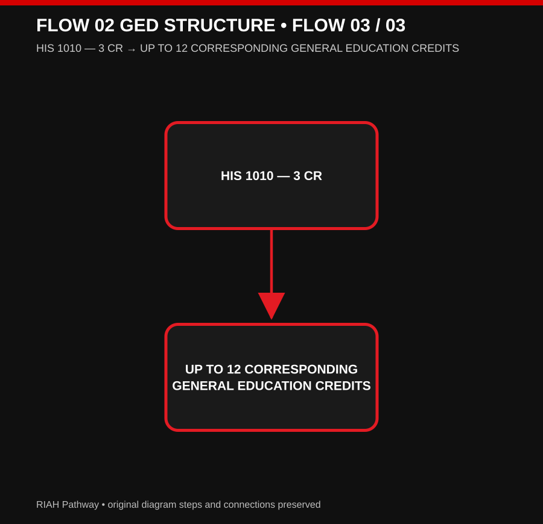

[View editable Mermaid Flow 03](./IMAGES/FLOW-02-GED-STRUCTURE-PART-03.mmd)

[View editable Mermaid diagram](./IMAGES/FLOW-02-GED-STRUCTURE.mmd)

---

# 3. GED/HSE STUDENT LEARNING PACKAGE

| Component | Structure |
| --- | --- |
| **RIAH Textbook** | In-depth instructional foundation |
| **RIAH Workbook** | Practice and application |
| **RIAH Journal / Module Notebook** | Problems, calculations, notes, written responses, and module work |
| **RIAH Planner / Curriculum Planner** | Complete academic roadmap |
| **RIAH Study Guide** | Concepts, objectives, terminology, formulas, and skills |
| **RIAH Review Guide** | Checkpoint, final, GED/HiSET, and test-out preparation |
| **Edmentum GED/HSE Preparation Content** | GED/HSE preparation instructional content |
| **Edmentum Mathematics Resources** | Mathematics preparation, practice, assessment, and learning support |
| **Edmentum English / Language Arts Resources** | English and language-arts preparation and support |
| **Official HiSET Preparation Materials** | Incorporated where applicable |
| **Edmentum Courseware** | General Education instructional content and courseware environment |
| **State Add-On Learning Package** | Applicable state-specific requirements |

#### Mermaid Flow 01 — 3. GED/HSE STUDENT LEARNING PACKAGE (Part 1 of 3)

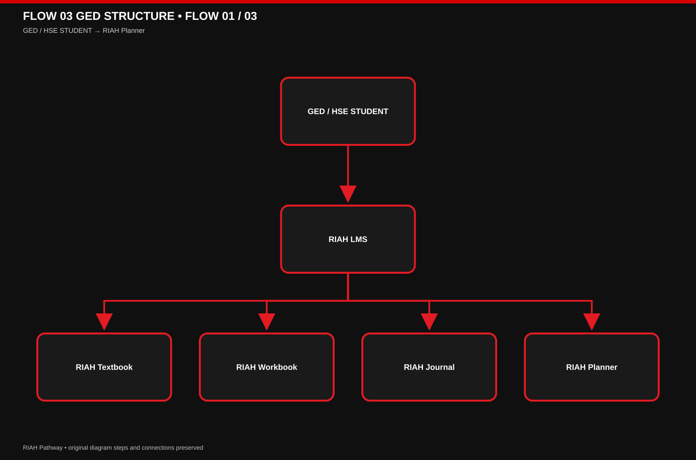

[View editable Mermaid Flow 01](./IMAGES/FLOW-03-GED-STRUCTURE-PART-01.mmd)

#### Mermaid Flow 02 — 3. GED/HSE STUDENT LEARNING PACKAGE (Part 2 of 3)

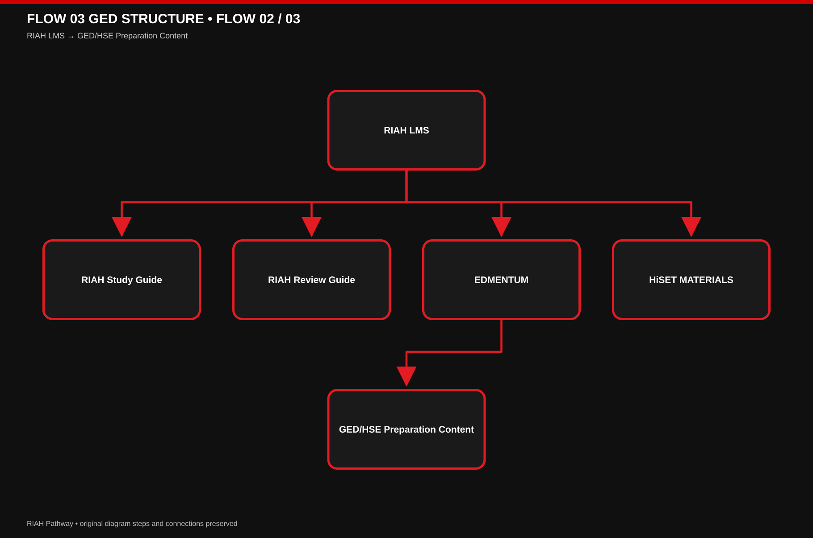

[View editable Mermaid Flow 02](./IMAGES/FLOW-03-GED-STRUCTURE-PART-02.mmd)

#### Mermaid Flow 03 — 3. GED/HSE STUDENT LEARNING PACKAGE (Part 3 of 3)

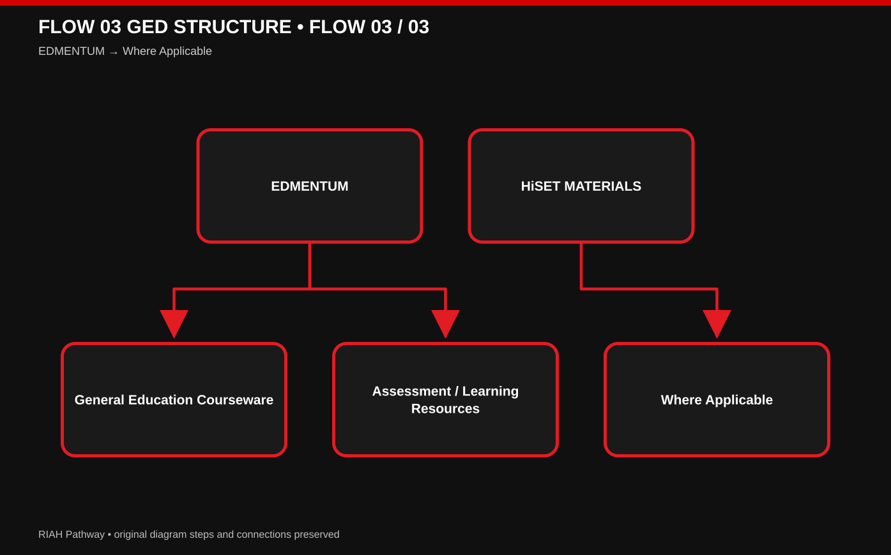

[View editable Mermaid Flow 03](./IMAGES/FLOW-03-GED-STRUCTURE-PART-03.mmd)

[View editable Mermaid diagram](./IMAGES/FLOW-03-GED-STRUCTURE.mmd)

---

# 4. GED / HiSET ACADEMIC FLOW HIERARCHY

#### Mermaid Flow 01 — 4. GED / HiSET ACADEMIC FLOW HIERARCHY (Part 1 of 5)

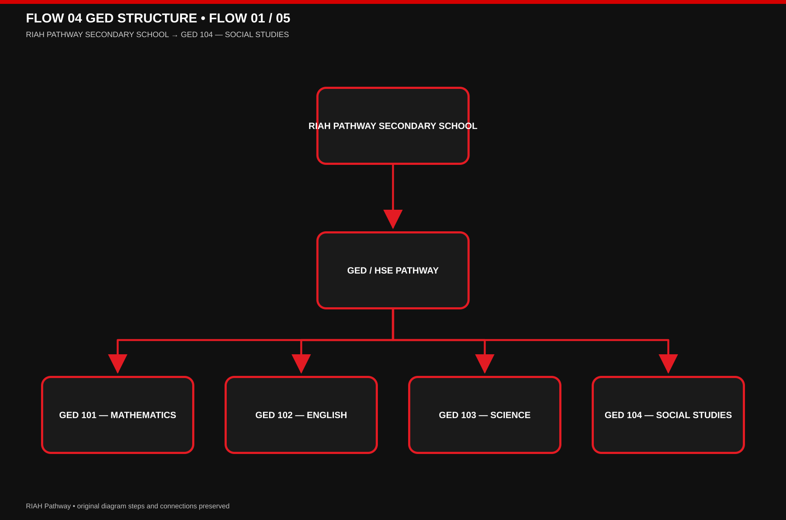

[View editable Mermaid Flow 01](./IMAGES/FLOW-04-GED-STRUCTURE-PART-01.mmd)

#### Mermaid Flow 02 — 4. GED / HiSET ACADEMIC FLOW HIERARCHY (Part 2 of 5)

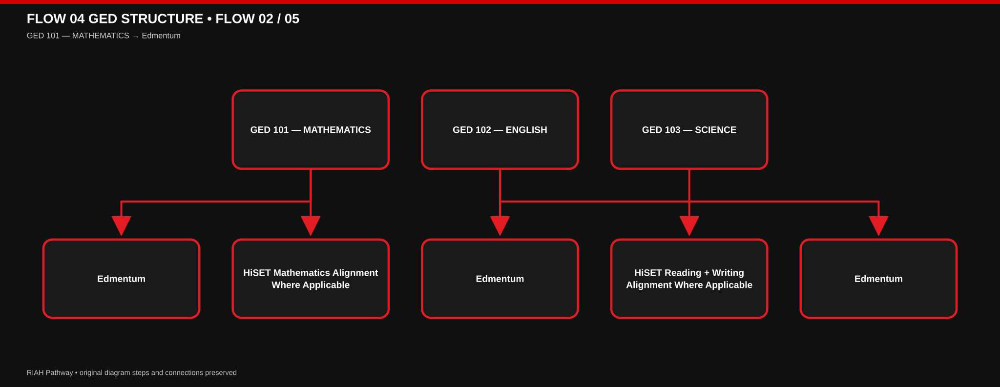

[View editable Mermaid Flow 02](./IMAGES/FLOW-04-GED-STRUCTURE-PART-02.mmd)

#### Mermaid Flow 03 — 4. GED / HiSET ACADEMIC FLOW HIERARCHY (Part 3 of 5)

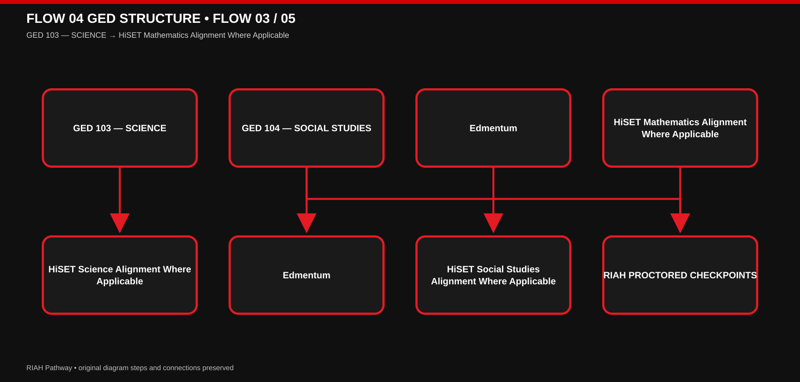

[View editable Mermaid Flow 03](./IMAGES/FLOW-04-GED-STRUCTURE-PART-03.mmd)

#### Mermaid Flow 04 — 4. GED / HiSET ACADEMIC FLOW HIERARCHY (Part 4 of 5)

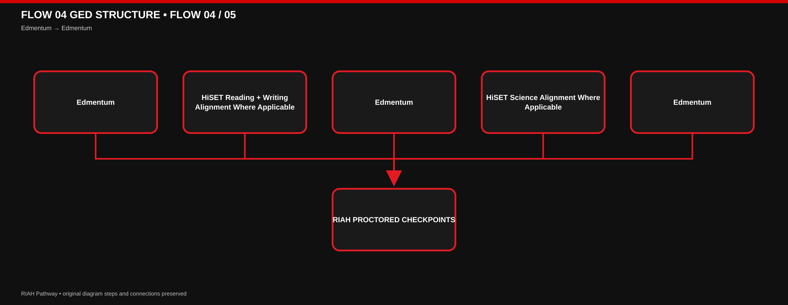

[View editable Mermaid Flow 04](./IMAGES/FLOW-04-GED-STRUCTURE-PART-04.mmd)

#### Mermaid Flow 05 — 4. GED / HiSET ACADEMIC FLOW HIERARCHY (Part 5 of 5)

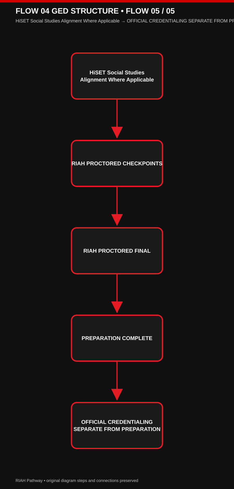

[View editable Mermaid Flow 05](./IMAGES/FLOW-04-GED-STRUCTURE-PART-05.mmd)

[View editable Mermaid diagram](./IMAGES/FLOW-04-GED-STRUCTURE.mmd)

---

# 5. GED / HiSET ACADEMIC PROGRESSION

## GED 101 — Mathematical Reasoning Preparation

| GED 101 — Mathematical Reasoning Preparation Component | GED 101 — Mathematical Reasoning Preparation Requirement |
| --- | --- |
| Edmentum | **Edmentum Diagnostic / Preparation Assessment → 80%+ Test-Out OR Developmental/Remedial Mathematics → RIAH Curriculum → Proctored Checkpoint → Proctored Final → GED 101 Complete** |

## GED 102 — Reasoning Through Language Arts Preparation

| GED 102 — Reasoning Through Language Arts Preparation Component | GED 102 — Reasoning Through Language Arts Preparation Requirement |
| --- | --- |
| Edmentum | **Edmentum Diagnostic / Preparation Assessment → 80%+ Test-Out OR Developmental English → RIAH Curriculum → Proctored Checkpoint → Proctored Final → GED 102 Complete** |

## GED 103 — Science Preparation

| GED 103 — Science Preparation Component | GED 103 — Science Preparation Requirement |
| --- | --- |
| Edmentum | **Edmentum Science Pre-Assessment → 80%+ Test-Out OR Science Preparation → RIAH Curriculum → Proctored Checkpoint → Proctored Final → GED 103 Complete** |

## GED 104 — Social Studies Preparation

| GED 104 — Social Studies Preparation Component | GED 104 — Social Studies Preparation Requirement |
| --- | --- |
| Edmentum | **Edmentum Social Studies Pre-Assessment → 80%+ Test-Out OR Social Studies Preparation → RIAH Curriculum → Proctored Checkpoint → Proctored Final → GED 104 Complete** |

#### Mermaid Flow 01 — GED 104 — Social Studies Preparation (Part 1 of 2)

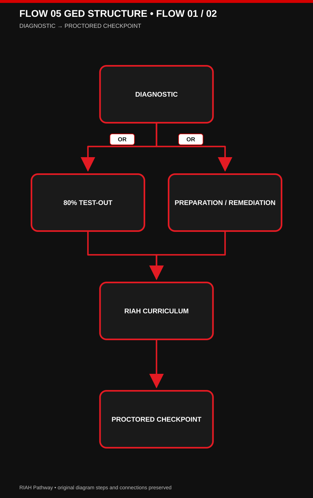

[View editable Mermaid Flow 01](./IMAGES/FLOW-05-GED-STRUCTURE-PART-01.mmd)

#### Mermaid Flow 02 — GED 104 — Social Studies Preparation (Part 2 of 2)

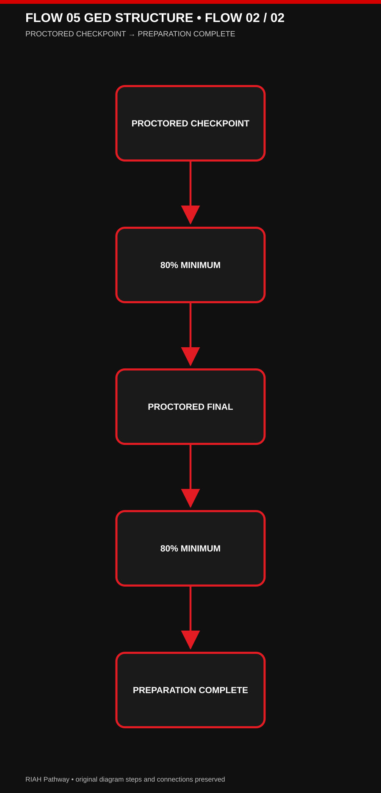

[View editable Mermaid Flow 02](./IMAGES/FLOW-05-GED-STRUCTURE-PART-02.mmd)

[View editable Mermaid diagram](./IMAGES/FLOW-05-GED-STRUCTURE.mmd)

---

# 6. GED / HiSET ASSESSMENT + PROCTORING MODEL

| Assessment | Standard | Attempts | Proctoring |
| --- | --- | --- | --- |
| **GED Preparation Diagnostic/Test-Out** | **80%** | Applicable preparation policy | **Proctored** |
| **GED Preparation Checkpoint / Midterm** | **80%** | **Unlimited within semester** | **Proctored** |
| **GED Preparation Final** | **80%** | **Unlimited within semester** | **Proctored** |
| **General Education Placement/Test-Out** | RIAH standard | **3 maximum** | **Proctored** |
| **Regular Course Checkpoint / Midterm** | **80%** | **Unlimited within semester** | **Proctored** |
| **Regular Course Final** | **80%** | **Unlimited within semester** | **Proctored** |
| **OA / Objective Assessment** | Applicable RIAH standard | Applicable course policy | **Proctored** |

#### Mermaid Flow 01 — 6. GED / HiSET ASSESSMENT + PROCTORING MODEL (Part 1 of 2)

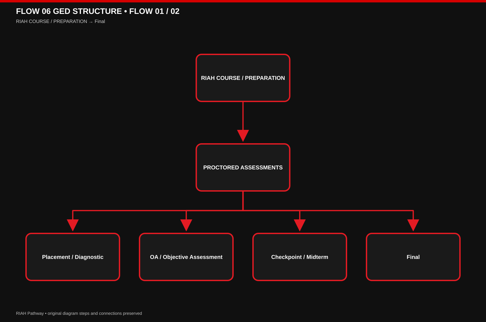

[View editable Mermaid Flow 01](./IMAGES/FLOW-06-GED-STRUCTURE-PART-01.mmd)

#### Mermaid Flow 02 — 6. GED / HiSET ASSESSMENT + PROCTORING MODEL (Part 2 of 2)

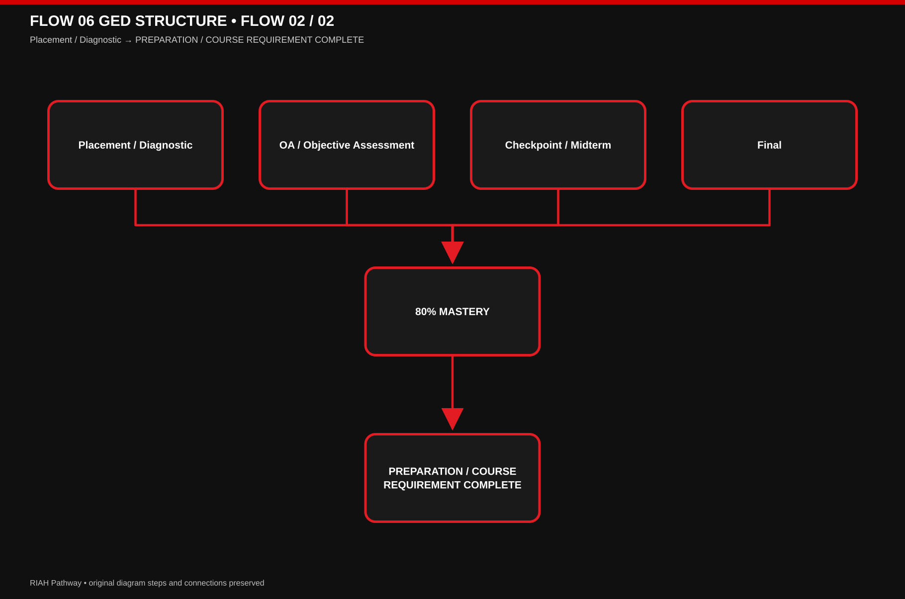

[View editable Mermaid Flow 02](./IMAGES/FLOW-06-GED-STRUCTURE-PART-02.mmd)

[View editable Mermaid diagram](./IMAGES/FLOW-06-GED-STRUCTURE.mmd)

---

# 7. GENERAL EDUCATION PLACEMENT / TEST-OUT SYSTEM

| General Education Course | Primary Software |
| --- | --- |
| **ENG 1010 — College English** | Edmentum |
| **MAT 1010 — College Algebra** | Edmentum |
| **COM 1010 — Oral Communications** | Edmentum |
| **LAN 1010 — Foreign Language** | Edmentum |
| **HIS 1010 — History** | Edmentum |
| **PHI 1010 — Philosophy** | RIAH Additional Curriculum — Edmentum does not provide the controlling Philosophy content |
| **PSY 1010 — Psychology** | Edmentum |
| **SOC 1010 — Sociology** | Edmentum |
| **ART 1010 — Art** | Edmentum |
| **SCI 1010 — Science** | Edmentum |

### Placement/Test-Out Policy

| Assessment Rule | Assessment Requirement |
| --- | --- |
| Maximum 3 attempts | - **Maximum 3 attempts** |
| Minimum 24 hours between attempts | - **Minimum 24 hours between attempts** |
| Proctored | - **Proctored** |
| No academic penalty for unsuccessful test-out | - **No academic penalty for unsuccessful test-out** |
| After 3 unsuccessful attempts: complete the RIAH course | - **After 3 unsuccessful attempts: complete the RIAH course** |

#### Mermaid Flow 01 — Placement/Test-Out Policy (Part 1 of 3)

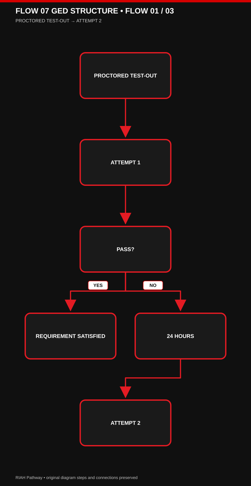

[View editable Mermaid Flow 01](./IMAGES/FLOW-07-GED-STRUCTURE-PART-01.mmd)

#### Mermaid Flow 02 — Placement/Test-Out Policy (Part 2 of 3)

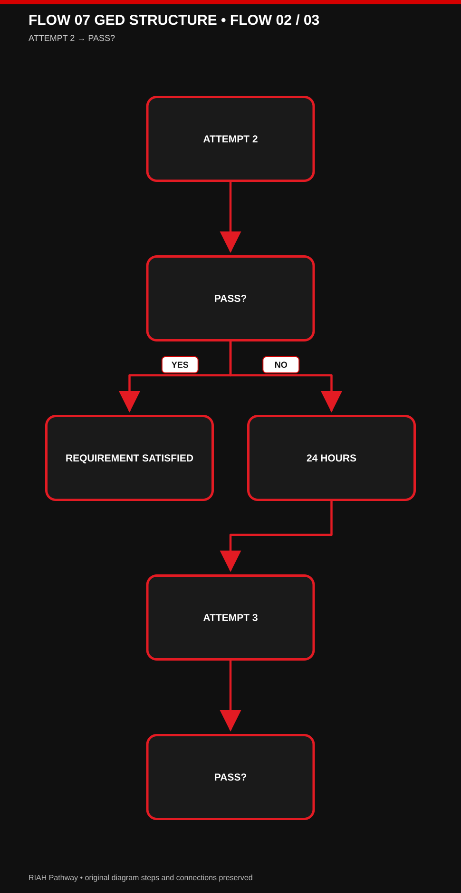

[View editable Mermaid Flow 02](./IMAGES/FLOW-07-GED-STRUCTURE-PART-02.mmd)

#### Mermaid Flow 03 — Placement/Test-Out Policy (Part 3 of 3)

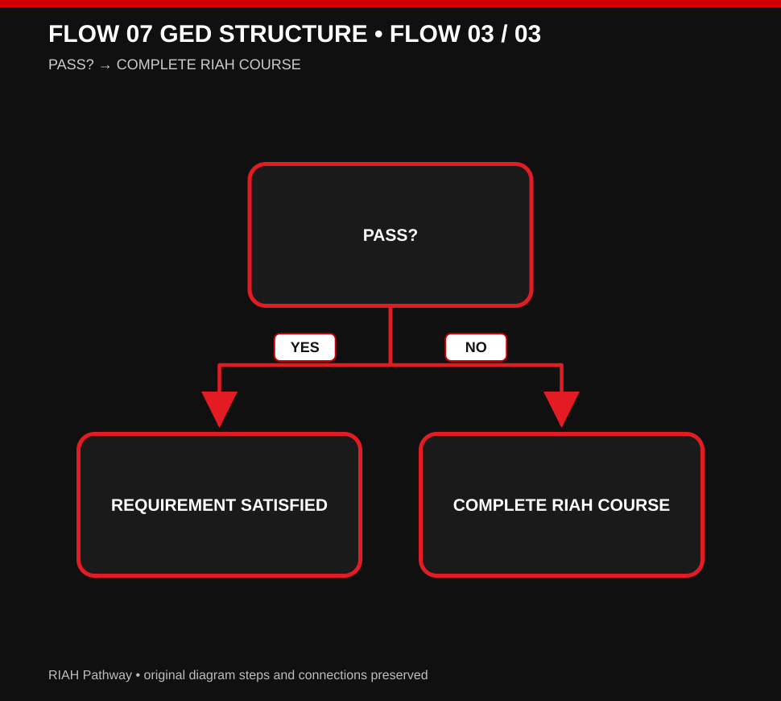

[View editable Mermaid Flow 03](./IMAGES/FLOW-07-GED-STRUCTURE-PART-03.mmd)

[View editable Mermaid diagram](./IMAGES/FLOW-07-GED-STRUCTURE.mmd)

---

# 8. GED + GENERAL EDUCATION CONCURRENT ACCELERATION

| GED Preparation | GED CR | Corresponding General Education | GE CR |
| --- | --- | --- | --- |
| **GED 101 — Mathematical Reasoning** | **3** | **MAT 1010 — College Algebra** | **3** |
| **GED 102 — RLA** | **3** | **ENG 1010 — College English** | **3** |
| **GED 103 — Science** | **3** | **SCI 1010 — Science** | **3** |
| **GED 104 — Social Studies** | **3** | **HIS 1010 — History** | **3** |
| **TOTAL** | **12** | **TOTAL** | **12** |

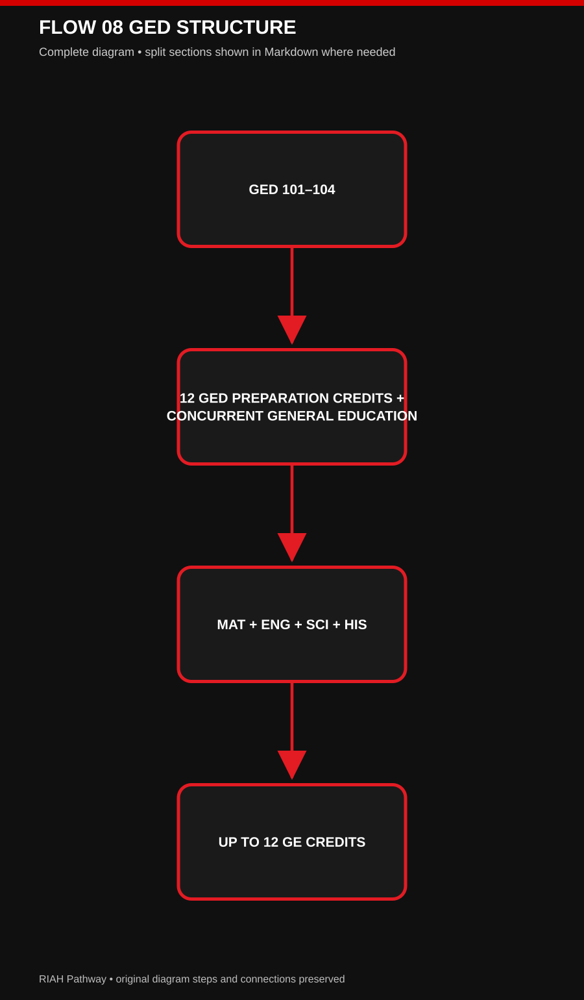

[View editable Mermaid diagram](./IMAGES/FLOW-08-GED-STRUCTURE.mmd)

---

# 9. EDMENTUM + HiSET PREPARATION MAPPING

| RIAH Course | Edmentum | HiSET Add-On Where Applicable | RIAH |
| --- | --- | --- | --- |
| **GED 101** | Mathematical Reasoning Preparation Content | Mathematics | Complete RIAH learning package + proctored assessments |
| **GED 102** | Reasoning Through Language Arts Preparation Content | Reading + Writing | Complete RIAH learning package + proctored assessments |
| **GED 103** | Science Preparation Content | Science | Complete RIAH learning package + proctored assessments |
| **GED 104** | Social Studies Preparation Content | Social Studies | Complete RIAH learning package + proctored assessments |

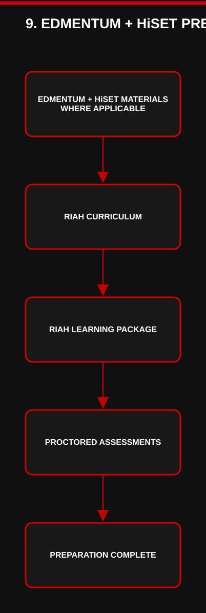

[View editable Mermaid diagram](./IMAGES/FLOW-09-GED-STRUCTURE.mmd)

---

# 10. GED 101–104 + 12-CREDIT CORRESPONDING GENERAL EDUCATION

| GED Preparation | GED CR | Corresponding GE | GE CR |
| --- | --- | --- | --- |
| **GED 101** | **3** | **MAT 1010** | **3** |
| **GED 102** | **3** | **ENG 1010** | **3** |
| **GED 103** | **3** | **SCI 1010** | **3** |
| **GED 104** | **3** | **HIS 1010** | **3** |
| **TOTAL** | **12** | **TOTAL** | **12** |

---

# 11. PRE-ADMISSION + ALTERNATIVE-CREDIT WINDOW

| PRE-ADMISSION + ALTERNATIVE-CREDIT WINDOW Component | PRE-ADMISSION + ALTERNATIVE-CREDIT WINDOW Requirement |
| --- | --- |
| Applicable sources may include | Applicable sources may include: |

| Credit Source | Credit Eligibility |
| --- | --- |
| Sophia Learning | - **Sophia Learning** |
| StraighterLine | - **StraighterLine** |
| Accredited College Transfer | - **Accredited College Transfer** |
| AP | - **AP** |
| IB | - **IB** |
| CLEP | - **CLEP** |
| ACT | - **ACT** |
| SAT | - **SAT** |
| Other applicable approved alternative-credit sources | - **Other applicable approved alternative-credit sources** |
| RIAH Placement/Test-Out Assessment | - **RIAH Placement/Test-Out Assessment** |

| PRE-ADMISSION + ALTERNATIVE-CREDIT WINDOW Component | PRE-ADMISSION + ALTERNATIVE-CREDIT WINDOW Requirement |
| --- | --- |
| Curriculum | **RIAH Curriculum is not an alternative-credit source.** |
| Curriculum | Sophia Learning remains an external alternative-credit source and is not embedded within the RIAH curriculum. |

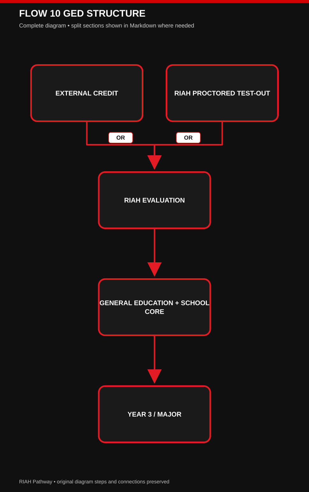

[View editable Mermaid diagram](./IMAGES/FLOW-10-GED-STRUCTURE.mmd)

---

# 12. SCHOOL CORE ALTERNATIVE CREDIT + PLACEMENT / TEST-OUT

| Assessment Component | Assessment Requirement |
| --- | --- |
| This structure applies to | This structure applies to: |

| Credit Source | Credit Eligibility |
| --- | --- |
| RIAH Pathway School of Business | - **RIAH Pathway School of Business** |
| RIAH Pathway School of Technology | - **RIAH Pathway School of Technology** |
| RIAH Pathway School of Law | - **RIAH Pathway School of Law** |
| RIAH Pathway School of Homeland Security | - **RIAH Pathway School of Homeland Security** |

| Assessment Component | Assessment Requirement |
| --- | --- |
| Student Eligibility | Students may satisfy applicable requirements through accepted transfer/alternative credit or applicable RIAH proctored placement/test-out assessments. |

#### Mermaid Flow 01 — 12. SCHOOL CORE ALTERNATIVE CREDIT + PLACEMENT / TEST-OUT (Part 1 of 4)

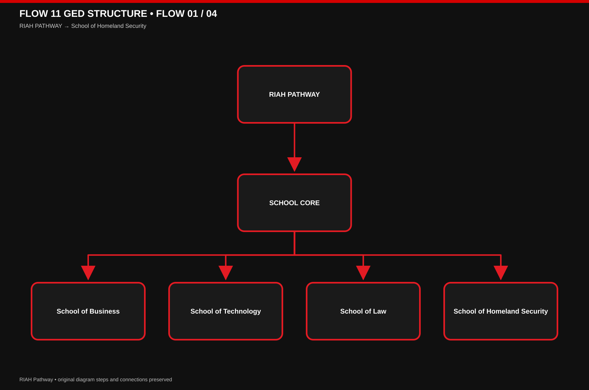

[View editable Mermaid Flow 01](./IMAGES/FLOW-11-GED-STRUCTURE-PART-01.mmd)

#### Mermaid Flow 02 — 12. SCHOOL CORE ALTERNATIVE CREDIT + PLACEMENT / TEST-OUT (Part 2 of 4)

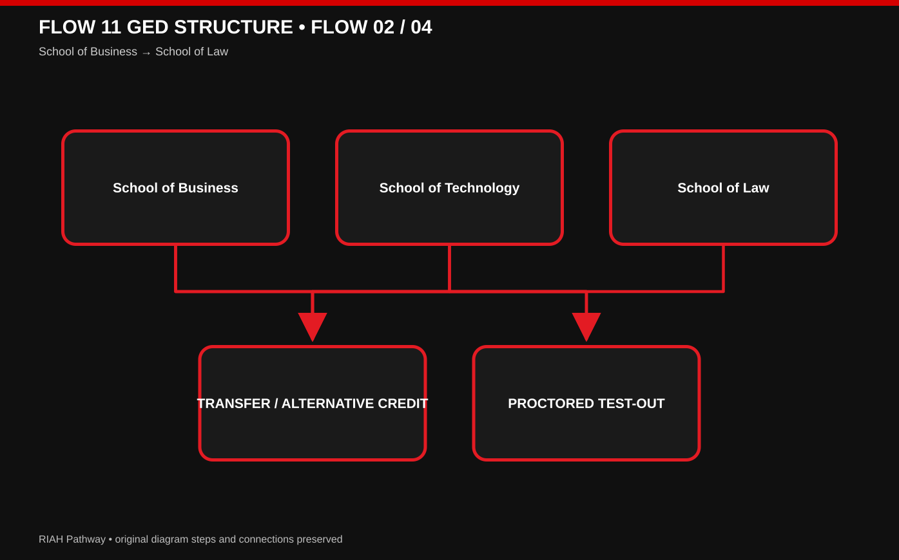

[View editable Mermaid Flow 02](./IMAGES/FLOW-11-GED-STRUCTURE-PART-02.mmd)

#### Mermaid Flow 03 — 12. SCHOOL CORE ALTERNATIVE CREDIT + PLACEMENT / TEST-OUT (Part 3 of 4)

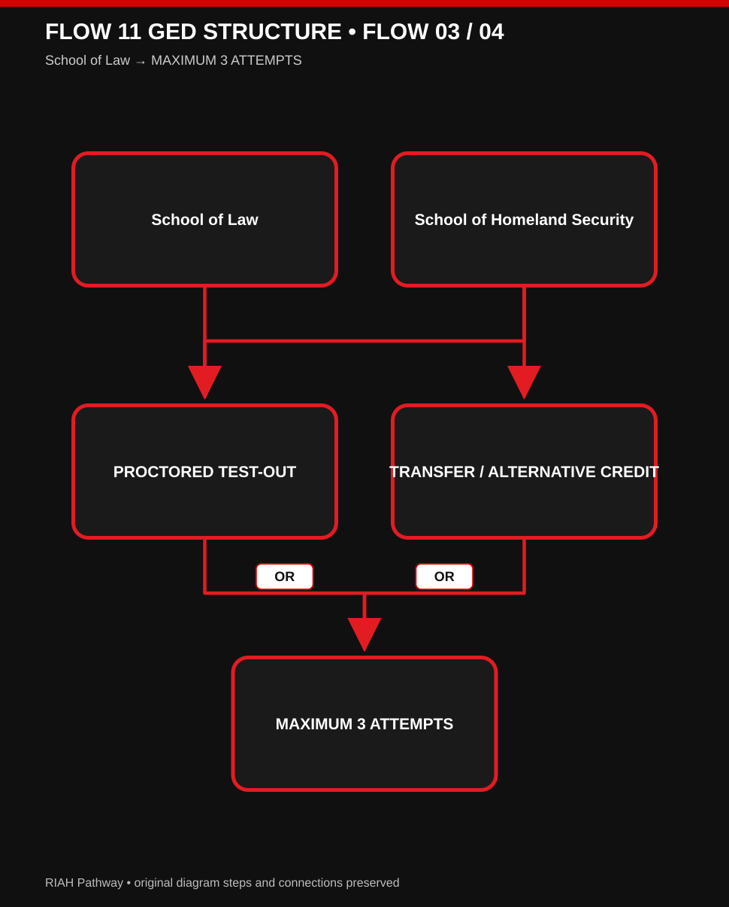

[View editable Mermaid Flow 03](./IMAGES/FLOW-11-GED-STRUCTURE-PART-03.mmd)

#### Mermaid Flow 04 — 12. SCHOOL CORE ALTERNATIVE CREDIT + PLACEMENT / TEST-OUT (Part 4 of 4)

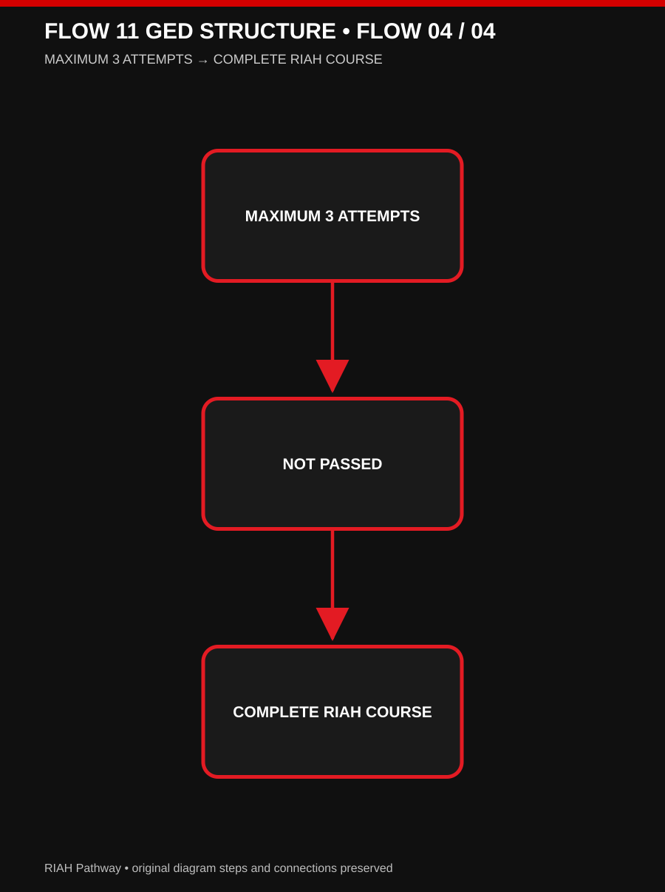

[View editable Mermaid Flow 04](./IMAGES/FLOW-11-GED-STRUCTURE-PART-04.mmd)

[View editable Mermaid diagram](./IMAGES/FLOW-11-GED-STRUCTURE.mmd)

---

# 13. COURSE COMPLETION AFTER TEST-OUT ATTEMPTS

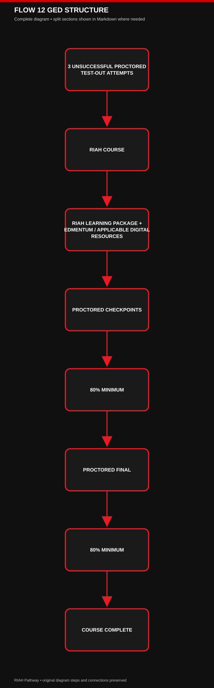

[View editable Mermaid diagram](./IMAGES/FLOW-12-GED-STRUCTURE.mmd)

---

# 14. REGULAR COURSE CHECKPOINTS + FINALS

| Assessment Component | Assessment Requirement |
| --- | --- |
| REGULAR COURSE CHECKPOINTS + FINALS | The three-attempt limitation applies **only to placement/test-out assessments**. |
| Regular course checkpoints and finals | Regular course checkpoints and finals: |

| Assessment Rule | Assessment Requirement |
| --- | --- |
| 80% minimum | - **80% minimum** |
| Proctored | - **Proctored** |
| Unlimited attempts within the applicable six-month semester | - **Unlimited attempts within the applicable six-month semester** |

#### Mermaid Flow 01 — 14. REGULAR COURSE CHECKPOINTS + FINALS (Part 1 of 3)

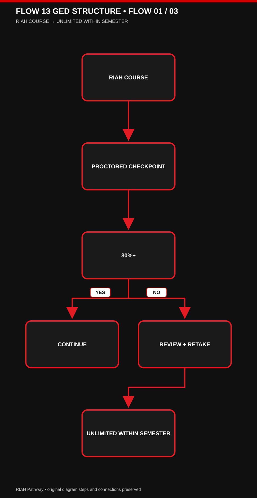

[View editable Mermaid Flow 01](./IMAGES/FLOW-13-GED-STRUCTURE-PART-01.mmd)

#### Mermaid Flow 02 — 14. REGULAR COURSE CHECKPOINTS + FINALS (Part 2 of 3)

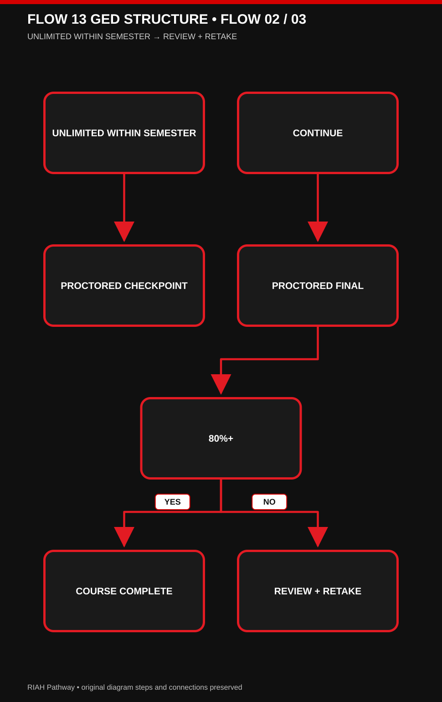

[View editable Mermaid Flow 02](./IMAGES/FLOW-13-GED-STRUCTURE-PART-02.mmd)

#### Mermaid Flow 03 — 14. REGULAR COURSE CHECKPOINTS + FINALS (Part 3 of 3)

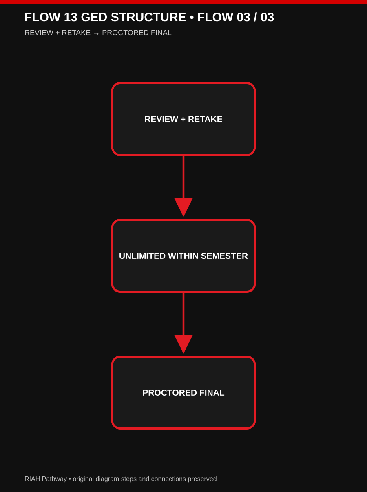

[View editable Mermaid Flow 03](./IMAGES/FLOW-13-GED-STRUCTURE-PART-03.mmd)

[View editable Mermaid diagram](./IMAGES/FLOW-13-GED-STRUCTURE.mmd)

---

# 15. SIX-MONTH SEMESTER + ASSESSMENT ATTEMPTS

| Academic Component | Credit / Semester Requirement |
| --- | --- |
| SIX-MONTH SEMESTER + ASSESSMENT ATTEMPTS | RIAH operates using **two six-month semesters per academic year**. |

| Assessment | Attempts | Proctored | Rule |
| --- | --- | --- | --- |
| **Placement/Test-Out** | **3 maximum** | **Yes** | 24-hour minimum between attempts |
| **Regular Course Checkpoint** | **Unlimited** | **Yes** | Within six-month semester |
| **Regular Course Final** | **Unlimited** | **Yes** | Within six-month semester |
| **GED/HSE Prep Checkpoint** | **Unlimited** | **Yes** | Within six-month semester |
| **GED/HSE Prep Final** | **Unlimited** | **Yes** | Within six-month semester |
| **OA / Objective Assessment** | Applicable RIAH policy | **Yes** | Applicable course structure |

---

# 16. PREPARATION SEPARATE FROM OFFICIAL CREDENTIALING

| PREPARATION SEPARATE FROM OFFICIAL CREDENTIALING Component | PREPARATION SEPARATE FROM OFFICIAL CREDENTIALING Requirement |
| --- | --- |
| Preparation | RIAH Pathway Secondary School provides the **GED/HSE Preparation pathway**. |
| Preparation | Preparation and official credentialing remain separate. |

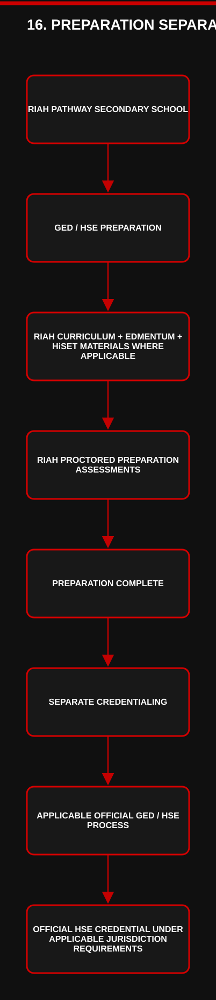

[View editable Mermaid diagram](./IMAGES/FLOW-14-GED-STRUCTURE.mmd)

---

# 17. RIAH PATHWAY SECONDARY SCHOOL — TWO SECONDARY PATHWAYS

| RIAH PATHWAY SECONDARY SCHOOL — TWO SECONDARY PATHWAYS Component | RIAH PATHWAY SECONDARY SCHOOL — TWO SECONDARY PATHWAYS Requirement |
| --- | --- |
| RIAH Pathway Secondary School offers | RIAH Pathway Secondary School offers: |

### High School Diploma Pathway

| High School Diploma Pathway Component | High School Diploma Pathway Requirement |
| --- | --- |
| For students seeking | For students seeking: |

| Pathway Component | Pathway Requirement |
| --- | --- |
| Traditional Grades 9–12 education | - Traditional Grades 9–12 education |
| Complete high-school curriculum | - Complete high-school curriculum |
| High-school transcript | - High-school transcript |
| Course grades | - Course grades |
| GPA | - GPA |
| High-school diploma | - High-school diploma |
| Concurrent college-level coursework where applicable | - Concurrent college-level coursework where applicable |
| Preparation for RIAH Pathway or other postsecondary institutions | - Preparation for RIAH Pathway or other postsecondary institutions |

### GED/HSE Preparation Pathway

| GED/HSE Preparation Pathway Component | GED/HSE Preparation Pathway Requirement |
| --- | --- |
| For students seeking | For students seeking: |

| Pathway Component | Pathway Requirement |
| --- | --- |
| Alternative high-school-equivalency preparation | - Alternative high-school-equivalency preparation |
| GED/HSE preparation | - GED/HSE preparation |
| 12 GED Preparation credits | - 12 GED Preparation credits |
| Up to 12 corresponding concurrent General Education credits | - Up to 12 corresponding concurrent General Education credits |
| Continuation into RIAH Pathway | - Continuation into RIAH Pathway |
| Admission to other postsecondary institutions accepting the applicable HSE credential | - Admission to other postsecondary institutions accepting the applicable HSE credential |

#### Mermaid Flow 01 — GED/HSE Preparation Pathway (Part 1 of 3)

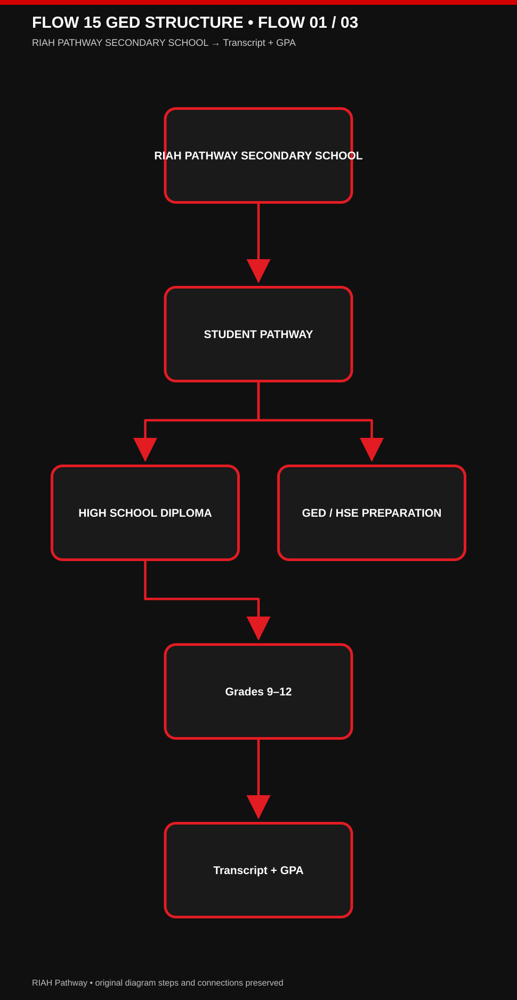

[View editable Mermaid Flow 01](./IMAGES/FLOW-15-GED-STRUCTURE-PART-01.mmd)

#### Mermaid Flow 02 — GED/HSE Preparation Pathway (Part 2 of 3)

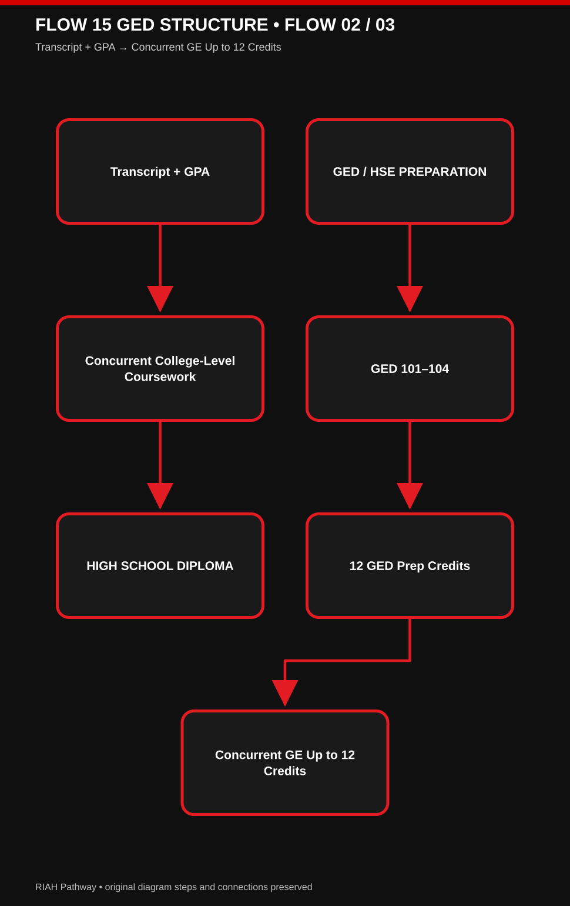

[View editable Mermaid Flow 02](./IMAGES/FLOW-15-GED-STRUCTURE-PART-02.mmd)

#### Mermaid Flow 03 — GED/HSE Preparation Pathway (Part 3 of 3)

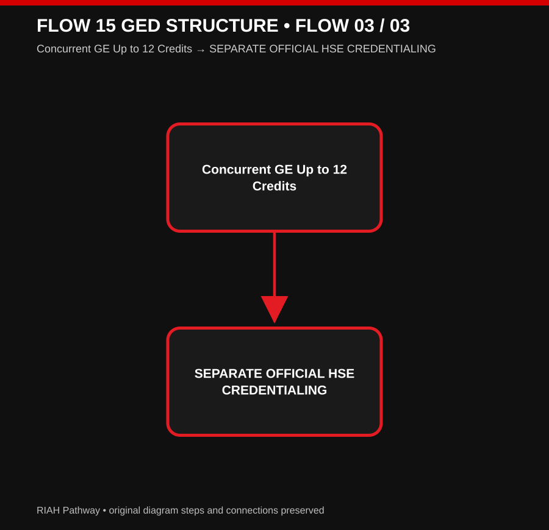

[View editable Mermaid Flow 03](./IMAGES/FLOW-15-GED-STRUCTURE-PART-03.mmd)

[View editable Mermaid diagram](./IMAGES/FLOW-15-GED-STRUCTURE.mmd)

---

# 18. HIGH SCHOOL DIPLOMA VS. GED/HSE PATHWAY BENEFITS

| Pathway Benefit | **RIAH Pathway High School Diploma** | **RIAH Pathway GED/HSE Preparation** |
| --- | --- | --- |
| **School** | RIAH Pathway Secondary School | RIAH Pathway Secondary School |
| **Primary Purpose** | Traditional secondary education | Alternative HSE preparation |
| **Structure** | Grades 9–12 | GED/HSE preparation |
| **Academic Record** | Full high-school transcript | RIAH preparation record + separate official HSE record |
| **GPA** | Yes | No traditional four-year high-school GPA |
| **Concurrent Coursework** | Yes | Yes |
| **GED Preparation Credits** | No | **12** |
| **Concurrent GE Opportunity** | Applicable college-level coursework | **Up to 12 corresponding GE credits** |
| **RIAH Pathway Continuation** | Yes | Yes |
| **Other Postsecondary Institutions** | Student applies using diploma and transcript | Student applies to institutions accepting applicable HSE credential |
| **Student Benefit** | Traditional diploma route and complete secondary academic record | More direct HSE route with concurrent GE acceleration |

### High School Diploma Student

| High School Diploma Student Component | High School Diploma Student Requirement |
| --- | --- |
| Student Eligibility | Designed for students who want a traditional high-school diploma and may intend to apply to institutions requiring a diploma, specified secondary coursework, or a traditional high-school academic record. |

### GED/HSE Student

| GED/HSE Student Component | GED/HSE Student Requirement |
| --- | --- |
| Student Eligibility | Designed for students who want the HSE pathway and intend to continue through RIAH Pathway or apply to another institution accepting the applicable HSE credential. |

#### Mermaid Flow 01 — GED/HSE Student (Part 1 of 4)

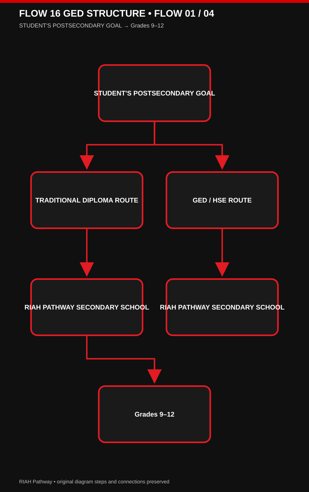

[View editable Mermaid Flow 01](./IMAGES/FLOW-16-GED-STRUCTURE-PART-01.mmd)

#### Mermaid Flow 02 — GED/HSE Student (Part 2 of 4)

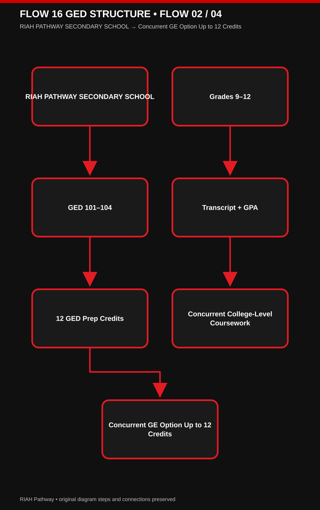

[View editable Mermaid Flow 02](./IMAGES/FLOW-16-GED-STRUCTURE-PART-02.mmd)

#### Mermaid Flow 03 — GED/HSE Student (Part 3 of 4)

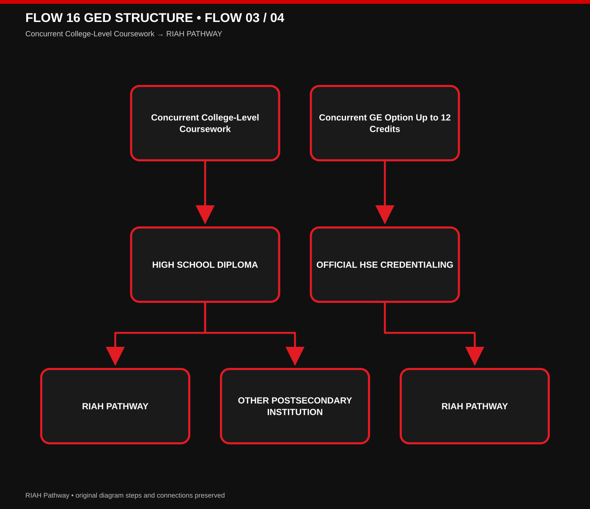

[View editable Mermaid Flow 03](./IMAGES/FLOW-16-GED-STRUCTURE-PART-03.mmd)

#### Mermaid Flow 04 — GED/HSE Student (Part 4 of 4)

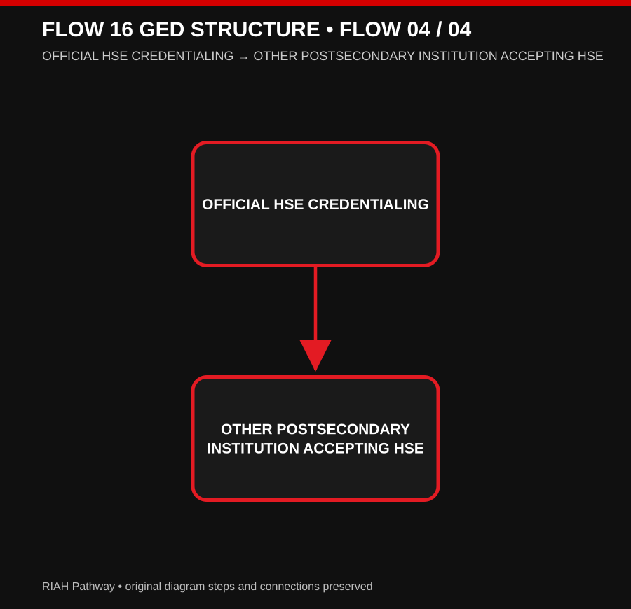

[View editable Mermaid Flow 04](./IMAGES/FLOW-16-GED-STRUCTURE-PART-04.mmd)

[View editable Mermaid diagram](./IMAGES/FLOW-16-GED-STRUCTURE.mmd)

---

# 19. POST-SECONDARY PATHWAY

## High School Diploma Route

#### Mermaid Flow 01 — High School Diploma Route (Part 1 of 2)

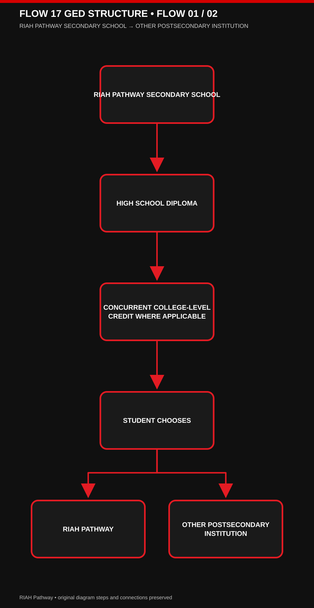

[View editable Mermaid Flow 01](./IMAGES/FLOW-17-GED-STRUCTURE-PART-01.mmd)

#### Mermaid Flow 02 — High School Diploma Route (Part 2 of 2)

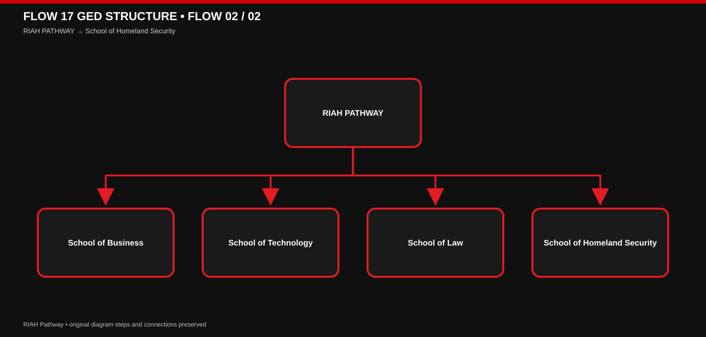

[View editable Mermaid Flow 02](./IMAGES/FLOW-17-GED-STRUCTURE-PART-02.mmd)

[View editable Mermaid diagram](./IMAGES/FLOW-17-GED-STRUCTURE.mmd)

## GED/HSE Route

#### Mermaid Flow 01 — GED/HSE Route (Part 1 of 2)

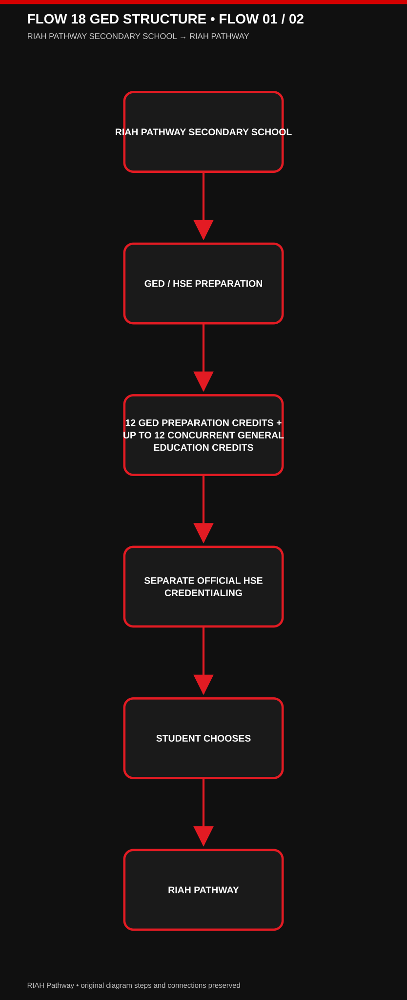

[View editable Mermaid Flow 01](./IMAGES/FLOW-18-GED-STRUCTURE-PART-01.mmd)

#### Mermaid Flow 02 — GED/HSE Route (Part 2 of 2)

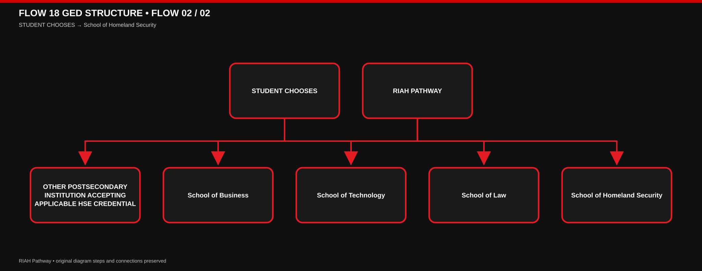

[View editable Mermaid Flow 02](./IMAGES/FLOW-18-GED-STRUCTURE-PART-02.mmd)

[View editable Mermaid diagram](./IMAGES/FLOW-18-GED-STRUCTURE.mmd)

---

# 20. COMPLETE RIAH PATHWAY SECONDARY SCHOOL → RIAH PATHWAY FLOW

#### Mermaid Flow 01 — 20. COMPLETE RIAH PATHWAY SECONDARY SCHOOL → RIAH PATHWAY FLOW (Part 1 of 6)

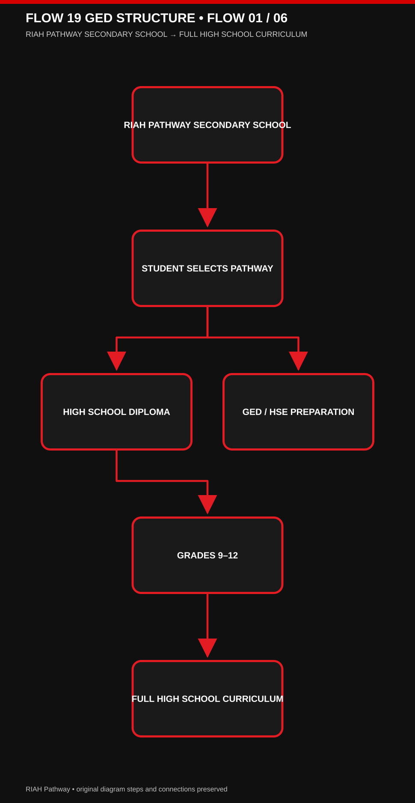

[View editable Mermaid Flow 01](./IMAGES/FLOW-19-GED-STRUCTURE-PART-01.mmd)

#### Mermaid Flow 02 — 20. COMPLETE RIAH PATHWAY SECONDARY SCHOOL → RIAH PATHWAY FLOW (Part 2 of 6)

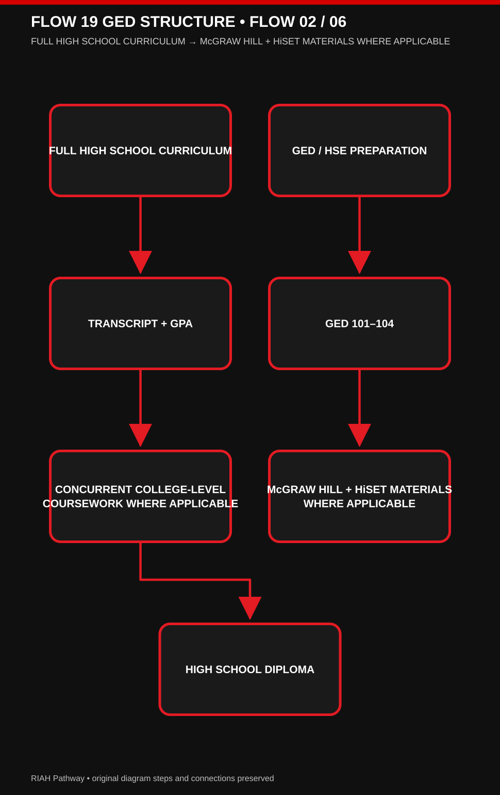

[View editable Mermaid Flow 02](./IMAGES/FLOW-19-GED-STRUCTURE-PART-02.mmd)

#### Mermaid Flow 03 — 20. COMPLETE RIAH PATHWAY SECONDARY SCHOOL → RIAH PATHWAY FLOW (Part 3 of 6)

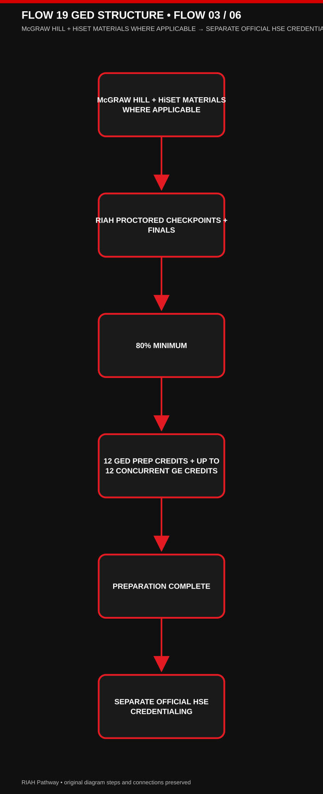

[View editable Mermaid Flow 03](./IMAGES/FLOW-19-GED-STRUCTURE-PART-03.mmd)

#### Mermaid Flow 04 — 20. COMPLETE RIAH PATHWAY SECONDARY SCHOOL → RIAH PATHWAY FLOW (Part 4 of 6)

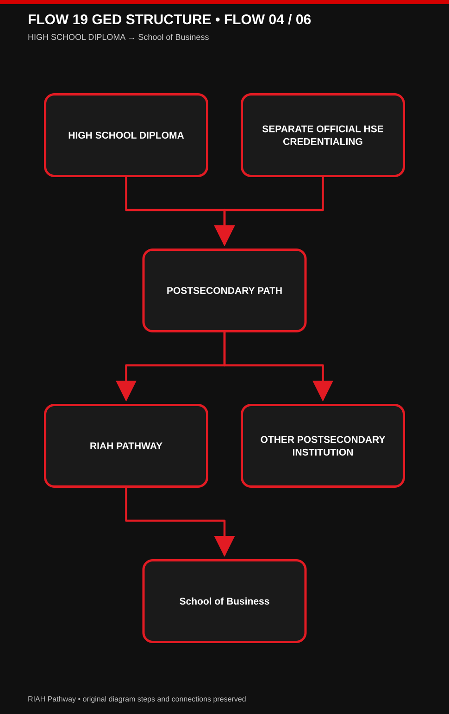

[View editable Mermaid Flow 04](./IMAGES/FLOW-19-GED-STRUCTURE-PART-04.mmd)

#### Mermaid Flow 05 — 20. COMPLETE RIAH PATHWAY SECONDARY SCHOOL → RIAH PATHWAY FLOW (Part 5 of 6)

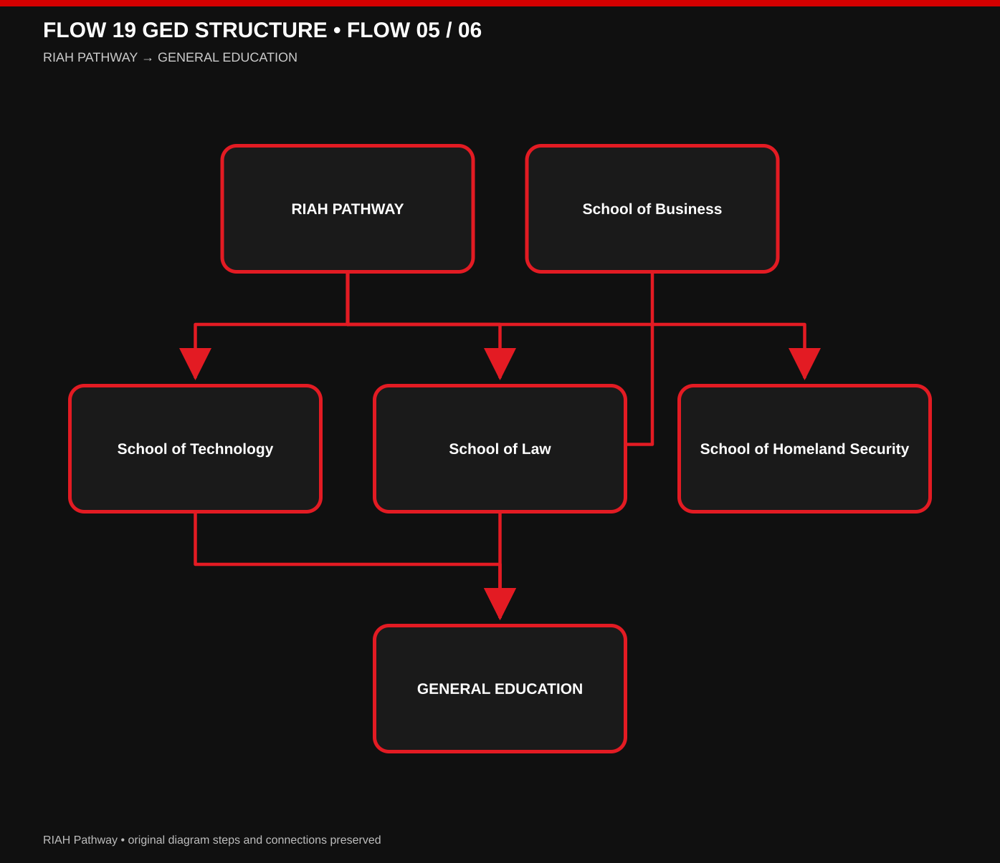

[View editable Mermaid Flow 05](./IMAGES/FLOW-19-GED-STRUCTURE-PART-05.mmd)

#### Mermaid Flow 06 — 20. COMPLETE RIAH PATHWAY SECONDARY SCHOOL → RIAH PATHWAY FLOW (Part 6 of 6)

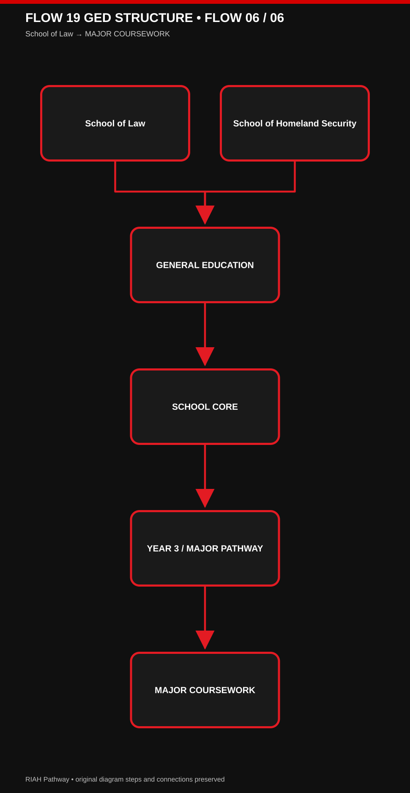

[View editable Mermaid Flow 06](./IMAGES/FLOW-19-GED-STRUCTURE-PART-06.mmd)

[View editable Mermaid diagram](./IMAGES/FLOW-19-GED-STRUCTURE.mmd)

---

# 👑RIAH Pathway.
