# 👑 RIAH PATHWAY.# 👑RIAH Pathway.

**Contributor/Founder/CEO/Chairman: Mariah Dominique Rucker**

There is currently no team. I am building everything myself until I have hired the beta team. I am starting the hiring process this month, **October 2026**, for the CTO, CISO, experiential professionals, PhD-qualified faculty, and adjunct faculty for each school and major, with hiring continuing across the entire ecosystem as it scales.

Beta team members will be hired with **equity participation and compensation during the beta cohort**, which launches in **Spring 2027**.

The website will launch in **October 2026** as I continue to build, develop, revise, and finalize aspects of the RIAH Pathway ecosystem.

Learn more about Mariah Dominique Rucker on GitHub and LinkedIn, or connect with me through social media and Linktree.

- **GitHub:** https://github.com/mariahdominiquerucker
- **LinkedIn:** https://linkedin.com/in/mariahrucker
- **Facebook:** https://facebook.com/heymariahrucker
- **Instagram:** https://instagram.com/heymariahrucker
- **Linktree:** https://linktr.ee/mariahrucker
- 
---

## 🗝️ Curriculum Visual Key

| Symbol | Meaning |
| --- | --- |
| 👑 | RIAH Pathway / institutional structure |
| 🏫 | RIAH Pathway Secondary School |
| 🎓 | Degree / academic pathway |
| 📚 | General Education / academic curriculum |
| 🧭 | Curriculum progression / academic pathway structure |
| 🔁 | Transfer, placement, test-out & alternative credit |
| 🧾 | School Core alternative credit course mapping |
| 📈 | Academic progression / acceleration |
| 🪜 | Developmental sequence / placement bands |
| 🏛️ | School structure / school-level architecture |
| 💼 | Major |
| 🌱 | Minor |
| ⭐ | School Core |
| ❤️ | Software / technology stack |
| 🛠️ | Project / Applied Build |
| 🏅 | Certification Review / Certification Track |
| 🎓 | Experiential / Capstone / Supervision |
| 🔗 | Multidisciplinary / integrated curriculum |
| 📐 | Curriculum architecture |
| 📋 | Policy / standard / approved rule |
| 🚪 | Admission / progression / completion gateway |
| ✅ | Required / included |
| ❌ | Not applicable / not included |
| 🎒 | Bachelor’s |
| 🔬 | Master’s |
| 📊 | MBA |
| ⚖️ | JD / Law |
| 🏛️⚖️ | Non-JD Law Pathway |
| 📜 | Certificate / credential-associated curriculum |
| 📘 | GED/HSE Preparation |
| 🏅 | High School Diploma |
| 🌐 | Virtual delivery |
| 🧩 | State-specific curriculum component |

| Transfer / Credit Component | Applicable Requirement |
| --- | --- |
| Transfer / Credit | Display Rule — Detailed course-by-course curriculum remains in the applicable curriculum document. This General document establishes the controlling institutional structure, academic architecture, assessment model, progression rules, transfer/placement framework, secondary-school structure, and curriculum-wide standards. |

## 📑 Curriculum Master Index

| Section | Curriculum Area |
| --- | --- |
| 1 | 📋 CURRICULUM PURPOSE AND EDUCATIONAL MODEL |
| 2 | 🧭 RIAH PATHWAY ACADEMIC STRUCTURE |
| 3 | 🏛️ SCHOOL STRUCTURE |
| 4 | 💻 SCHOOL OF TECHNOLOGY STRUCTURE |
| 5 | 🛡️ SCHOOL OF HOMELAND SECURITY STRUCTURE |
| 6 | ⚖️ SCHOOL OF LAW STRUCTURE |
| 7 | 💼 SCHOOL OF BUSINESS STRUCTURE |
| 8 | 📚 GENERAL EDUCATION — 30 CREDITS |
| 9 | 🔁 GENERAL EDUCATION PLACEMENT / TEST-OUT STANDARD |
| 10 | 🪜 COLLEGE ENGLISH & COLLEGE ALGEBRA DEVELOPMENTAL PLACEMENT |
| 11 | 🔁 TRANSFER & ALTERNATIVE CREDIT STRUCTURE |
| 12 | 🚪 ACADEMIC PROGRESSION GATEWAYS |
| 13 | 🌱 MINOR ARCHITECTURE |
| 14 | 🎒 BACHELOR’S ARCHITECTURE |
| 15 | 🧠 YEAR 3 MAJOR ARCHITECTURE |
| 16 | 🛠️ YEAR 4 MAJOR ARCHITECTURE |
| 17 | 🏅 CERTIFICATION-REVIEW ARCHITECTURE |
| 18 | 🔬 MASTER’S ARCHITECTURE |
| 19 | 📊 MBA ARCHITECTURE |
| 20 | 📊 GENERAL MBA |
| 21 | 🎓 EXPERIENTIAL STRUCTURE |
| 22 | 🏫 RIAH PATHWAY SECONDARY SCHOOL |
| 23 | 🏅 FOUR-YEAR HIGH SCHOOL DIPLOMA ARCHITECTURE |
| 24 | 🧩 HIGH SCHOOL STATE-COMPONENT STRUCTURE |
| 25 | 📘 GED/HSE PREPARATION ARCHITECTURE |
| 26 | ❤️ GED/HSE LEARNING ENVIRONMENT |
| 27 | 📘 GED/HSE ACADEMIC FLOW |
| 28 | 🧠 GED/HSE, HIGH SCHOOL & REGULAR COURSE ASSESSMENT STANDARD |
| 29 | 📈 GED/HSE CONCURRENT ACCELERATION |
| 30 | 📋 HIGH SCHOOL DIPLOMA VS. GED/HSE |
| 31 | 📐 UNIVERSAL COURSE ARCHITECTURE |
| 32 | 📐 ASSESSMENT × PROJECT ARCHITECTURE BY LEVEL |
| 33 | 📈 PREREQUISITE PROGRESSION STANDARD |
| 34 | 📋 DUPLICATE CREDIT & COURSE IDENTITY STANDARD |
| 35 | 🏅 PROFESSIONAL TRACK STANDARD |
| 36 | 🚪 PROGRAM COMPLETION STANDARD |
| 37 | 🧭 COMPLETE RIAH ACADEMIC ARCHITECTURE FLOW |
| 38 | ✅ CONTROLLING CURRICULUM STANDARD |
| 4.1 | 🔁 School of Technology — School Core Alternative Credit |
| 5.1 | 🔁 School of Homeland Security — School Core Alternative Credit |
| 6.1 | 🔁 School of Law — Criminal Justice School Core Alternative Credit |
| 7.1 | 🔁 School of Business — School Core Alternative Credit |
| 11A | 🧾 School Core Alternative Credit Course Tables Cross-Reference |

# 🎓 RIAH Pathway Course Assessments, Capstone Supervision, and Included Products

## 🏛️ Curriculum Architecture and Ongoing Development

The curriculum is structured and architected by the Founder and CEO. Once the Founder has hired PhD-qualified faculty and adjunct faculty within each applicable major, the curriculum will be continually developed, revised, and reviewed by those faculty members alongside experiential professionals.

Faculty hiring for the beta phase will include equity participation and compensation during the beta cohort and subsequent operations until operations are stable and accreditation is awarded.

Experiential programs are integrated throughout the education curriculum where applicable, together with the corresponding product collections.

| Curriculum Component | Responsibility or Integration |
|---|---|
| 🏛️ Structure and architecture | Established by the Founder and CEO |
| 👥 Faculty hiring | The Founder will hire PhD-qualified faculty and adjunct faculty within each applicable major |
| 🎓 Ongoing development, revision, and review | Will begin once the applicable faculty are hired and will involve those faculty members alongside experiential professionals |
| 💼 Beta faculty arrangements | Equity participation and compensation during the beta cohort and subsequent operations until operations are stable and accreditation is awarded |
| 🤝 Experiential programs | Integrated throughout the education curriculum where applicable |
| 📦 Product collections | Integrated with the applicable curriculum, courses, school, and major |

## 📝 Proctored Course Assessments

All courses are proctored through objective assessments, performance assessments, or both. This requirement applies to both the general track without certifications and applicable certification tracks.

| Assessment Requirement | Standard |
|---|---|
| 📋 Objective assessment | 25 questions per assessment |
| 🛠️ Performance assessment | One task-based performance assessment |
| ✅ Passing score | At least 80% on every required objective assessment and performance assessment |
| 🔄 Assessment attempts | Unlimited attempts to pass course assessments |
| 🔒 Course progression | Where applicable, remaining courses stay locked until required assessments are passed |

## 📈 Student Pacing, Acceleration, and Completion

RIAH Pathway education programs support acceleration based on each student’s academic readiness and pace. The earliest completion timeframe is **one month**, provided the student completes all required coursework, passes the required assessments, satisfies applicable prerequisites and supervision requirements, and makes the required payments. Any applicable mandatory program-duration or credentialing requirements remain controlling.

| Education Pathway | Typical Completion Timeframe |
|---|---|
| 🎓 Associate’s | Two years |
| 🎒 Bachelor’s | Four years |
| 🔬 Master’s | One year |
| 📊 MBA | One year |
| ⚖️ JD | Four years |
| 🌱 Minor | One semester to one year |
| 🏫 High School | Four years; academically gifted students may complete the required curriculum in one month when all completion requirements are satisfied |
| 📘 GED/HSE Preparation | Based on the student’s readiness and pace; accelerated curriculum completion may occur in one month |
| 📜 Other Education Pathways | Based on the applicable curriculum and student pace, with one month as the earliest completion timeframe where permitted |

Typical timeframes describe the standard pace. Students may advance more quickly as they complete the required courses and satisfy the applicable payment requirements.

All education pathways retain their required **proctored objective assessments, performance assessments, or both**, including during accelerated progression. Students must achieve at least **80% on every required assessment**. Applicable capstone projects retain their assigned industry-professional supervision.

Course progression requires completion of the applicable prior coursework and assessments, together with satisfaction of the required payment for the next course to unlock.

Payments follow the applicable **beta, pre-accreditation, or post-accreditation pricing stage** and payment rules established in the **RIAH Pathway Master Pricing Data Sheet** and **RIAH Pathway Pricing Engine** within the **Tuition-Pricing-and-Fees** folder. Acceleration changes progression and completion timing without automatically changing established total-program tuition.

GED/HSE curriculum completion remains separate from official examinations and credential issuance.

## High School and GED Parameters

For the **High School Diploma and GED pathways**, RIAH Pathway will establish clear eligibility parameters to ensure that the GED option does not encourage students to leave high school simply to pursue a GED instead.

Students who **left school before RIAH Pathway officially launches its GED program** may enroll in the GED pathway, provided they otherwise meet applicable eligibility requirements. This includes individuals who previously dropped out of school and never completed their high school diploma.

After RIAH Pathway’s GED program is officially launched, students who are still school-age and have not previously left school will be expected to complete the **High School Diploma Program** rather than dropping out and moving directly into the GED pathway.

The purpose of this structure is to make sure students are **not encouraged to drop out of high school simply because RIAH Pathway offers a GED option**, while still providing an appropriate GED pathway for individuals who had already left school before the program was established.

Individuals who were already out of school and did not complete their diploma will **not be forced into the High School Diploma Program**. They may proceed through the GED pathway.

## 🎓 Admission and Prerequisite Requirements

Students are not automatically admitted into Year 3 of a bachelor’s program. They must have completed the required general education and school core coursework.

Master’s and MBA programs require completion of the applicable prerequisites, along with a bachelor’s degree in the corresponding major or an equivalent qualification.

| Program | Requirement |
|---|---|
| 📘 Bachelor’s Year 3 | Admission is not automatic; students must have completed the required general education and school core coursework |
| 🎓 Master’s | Applicable prerequisites and a bachelor’s degree in the corresponding major or equivalent |
| 💼 MBA | Applicable prerequisites and a bachelor’s degree in the corresponding major or equivalent |

## 🛤️ General and Certification Track Options

Students may select a general track without certifications for bachelor’s Year 4, master’s, and MBA programs. Applicable certification tracks are also available. All courses require an objective assessment, performance assessment, or both, regardless of the selected track.

| Track Option | Requirements |
|---|---|
| 📚 General track without certifications | Available for bachelor’s Year 4, master’s, and MBA programs; all courses retain their required proctored assessments |
| 🏅 Applicable certification track | Includes certification review for the selected track where the certification is applicable; all courses retain their required proctored assessments |

## 🏅 Certification Review Courses

Certification review courses include proctored objective assessments and performance assessments conducted through task-based simulations. These requirements apply when certification review is selected within the student’s track and the certification is applicable.

| Certification Review Requirement | Standard |
|---|---|
| 📋 Objective assessment | Proctored assessment consisting of 25 questions |
| 🛠️ Performance assessment | One proctored task-based simulation |
| ✅ Passing score | At least 80% on each required assessment |
| 🔄 Assessment attempts | Unlimited attempts to pass course assessments |
| 🔒 Course progression | Where applicable, remaining courses stay locked until required assessments are passed |

## 🎯 Capstone Assessments and Project Supervision

Capstones include proctored objective assessments and performance assessments based on concepts students should have learned through their course assessments. Cumulative project work is supervised by assigned industry professionals.

**Industry-professional supervision applies only to Year 4 capstones for bachelor’s, master’s, and MBA programs and to courses 300A and 300B for minor-degree capstones.**

| Capstone Component | Requirement |
|---|---|
| 📋 Objective assessment | Proctored assessment consisting of 25 questions |
| 🛠️ Performance assessment | One proctored task-based performance assessment |
| ✅ Passing score | At least 80% on each required assessment |
| 🔄 Assessment attempts | Unlimited attempts to pass course assessments |
| 📚 Assessment scope | Concepts students should have learned through the proctored objective and performance assessments |
| 🧩 Cumulative projects | Not proctored; supervised by assigned industry professionals within the specified capstone courses |
| 👔 Assigned supervision | Industry professionals assigned to supervise the applicable capstone projects |
| 🎓 Bachelor’s, master’s, and MBA supervision | Year 4 capstones only |
| 📘 Minor-degree supervision | Capstone courses 300A and 300B only |
| ⏱️ Supervision hours | 20 hours of supervision across the capstone courses, with two hours of supervision per course |
| 👥 Human review panel | Five people representing industry professionals, employers, community members, and peers |

## 📦 Included Education Products and Collections

Education programs include products aligned with the student’s school and major. Applicable collections support minor, associate’s, bachelor’s, master’s, and MBA programs.

Collections include textbooks, workbooks, journals, planners, review guides, and study guides for their applicable courses.

| Internal Collection | Alignment |
|---|---|
| 🌍 General Education | General education coursework |
| 🏫 School Core | Core coursework within the student’s school |
| 🎓 Major | Coursework within the student’s major |
| 🎯 Capstone | Applicable capstone coursework and projects |

## 🧾 Product Features and Access

| Product Category | Availability and Reference |
|---|---|
| 🎒 Internal collections | Available only to enrolled students |
| 🛍️ External collections | Products offered to external customers |
| ⚙️ Included products and features | Listed in the pricing engine and data sheet |
| 🏫 Program alignment | Based on the student’s school, major, and applicable program |

# 📋 1. CURRICULUM PURPOSE AND EDUCATIONAL MODEL

| Curriculum Model Component | Institutional Structure |
| --- | --- |
| Curriculum Model | RIAH Pathway uses structured academic pathways with established General Education, School Core, major, minor, graduate, law, secondary-school, and GED/HSE preparation structures. |
| Fixed Curriculum | Academic pathways use established curriculum sequences rather than unrestricted student-selected coursework. |
| Course Identity | Established course numbers, names, credits, prerequisites, software, assessments, certification-review mappings, projects, experiential eligibility, capstone status, applied-build requirements, and supervision requirements remain attached to the applicable course unless the controlling curriculum expressly establishes a different structure. |
| Curriculum Integration | RIAH coursework may integrate academic education, professional software, certification-review curriculum, projects, experiential learning, applied builds, supervision, capstones, career preparation, and law/bar-associated preparation where applicable. |

| Academic Architecture Component | Governing Structure |
| --- | --- |
| High School Software Architecture | RIAH Pathway maps Edmentum instructional content/courseware to applicable High School Diploma courses while retaining RIAH curriculum as the controlling curriculum layer. RIAH may supplement software-provided content with additional RIAH curriculum, assessments, assignments, state components, and course-specific requirements. |
| Prerequisite Progression | Students progress through established prerequisite chains. The applicable prior foundational course must be completed or otherwise satisfied before progression where a prerequisite exists. |
| Assessment Architecture | Courses use Objective Assessments, Performance Assessments, projects, checkpoints, finals, applied builds, capstones, and/or supervision according to the applicable curriculum level and course design. |

| High School Pathway | Objective Assessment (OA) | Performance Assessment (PA) | Proctoring |
| --- | --- | --- | --- |
| Every RIAH Pathway High School Diploma course | includes an Objective Assessment (OA) | includes a Performance Assessment (PA) | Both assessments are proctored for every high-school course. |

| Academic Architecture Component | Governing Structure |
| --- | --- |
| Certification Architecture | Certification review may be embedded into an academic pathway or designated certification track. External certification examinations remain separate unless expressly required by an applicable external authority. |
| Experiential Architecture | Experiential participation follows the applicable pathway, eligibility, selection, placement, capacity, supervision, and timing requirements. |
| Secondary Education | RIAH Pathway Secondary School contains the Four-Year High School Diploma pathway and GED/HSE Preparation pathway. |
| Preparation vs. Credentialing | GED/HSE preparation provided by RIAH remains separate from official GED/HiSET examination and credential issuance. |
| Source of Course-Level Detail | Course-level curriculum remains controlled by the applicable Degree Curriculum, GED/HSE Curriculum, or High School Diploma Curriculum. |

# 🧭 2. RIAH PATHWAY ACADEMIC STRUCTURE

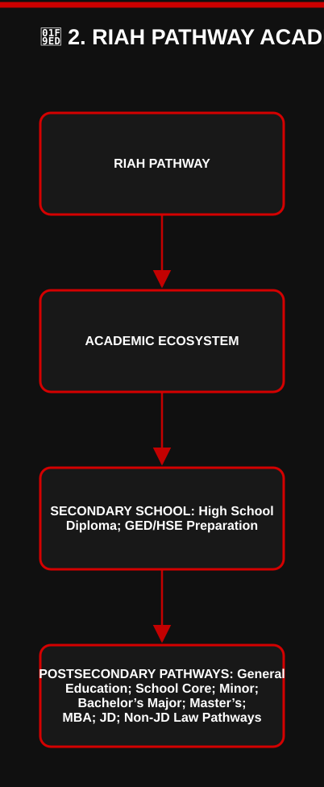

[View editable Mermaid diagram](./IMAGES/FLOW-01-ALL-SCHOOLS-COMBINED-GENERAL-STRUCTURE.mmd)

# 🏛️ 3. SCHOOL STRUCTURE

| School | School Core | Majors and Minors / Pathways |
| --- | --- | --- |
| RIAH Pathway School of Technology | 39-credit School Core | Computer Science, Cybersecurity, Data Analytics, Data Science, Software Development, Software Engineering, Project Management, Program Management, Information Systems. |
| RIAH Pathway School of Homeland Security | 30-credit School Core | Governance, Risk & Compliance, Intelligence, Physical Security, Private Investigations. |
| RIAH Pathway School of Law | Applicable Law Structure | Criminal Justice, JD, Non-JD Law Pathways. |
| RIAH Pathway School of Business | 30-credit School Core | Accounting, Entrepreneurship, Finance, Business Management, General MBA. |
| RIAH Pathway Secondary School | Secondary Curriculum | Four-Year High School Diploma, GED/HSE Preparation. |

# 💻 4. SCHOOL OF TECHNOLOGY STRUCTURE

| School Core | Credit Hours |
| --- | --- |
| School of Technology Core | 39 Credit Hours. |
| The Technology Core contains the shared technology foundation completed before applicable upper-division Technology major progression. | — |

| School | Majors and Minors |
| --- | --- |
| School of Technology | Computer Science, Cybersecurity, Data Analytics, Data Science, Software Development, Software Engineering, Project Management, Program Management, Information Systems. Each has the applicable Minor, Bachelor’s Year 3, Bachelor’s Year 4, Master’s, and MBA structure in the controlling degree curriculum. |

## ❤️ School of Technology Core — Cengage MindTap Software Coverage
| RIAH Course | Course Name | Cengage MindTap |
| --- | --- | --- |
| TEC 2101 | Principles of Computer Science | ✓ |
| TEC 2102 | Web Development | ✓ |
| TEC 2103 | Principles of Cybersecurity | ✓ |
| TEC 2104 | Principles of Information Systems | ✓ |
| TEC 2105 | Operating Systems & Architecture | ✓ |
| TEC 2106 | Systems Analysis & Design | ✓ |
| TEC 2107 | Principles of Data Analytics | ✓ |
| TEC 2108 | Principles of Data Science | ✓ |
| TEC 2109 | Principles of Project Management | ✓ |
| TEC 2110 | Principles of Program Management | ✓ |
| TEC 2111 | Principles of Software Development | ✓ |
| TEC 2112 | Principles of Software Engineering | ✓ |
| TEC 2113 | Statistics | ✓ |

## 🔁 4.1 SCHOOL OF TECHNOLOGY — SCHOOL CORE ALTERNATIVE CREDIT

| **RIAH Course** | **RIAH Placement** | **ACT** | **SAT** | **AP** | **IB** | **CLEP** | **Sophia Learning** | **StraighterLine** | **Accredited College Transfer** |
| --- | --- | --- | --- | --- | --- | --- | --- | --- | --- |
| **TEC 2101 — Principles of Computer Science** | 80%+ | — | — | AP Computer Science A — 3+ | IB Computer Science — 6+ | — | Introduction to Python Programming — Pass | Introduction to Programming — 80%+ | Equivalent Computer Science or Programming course — B− or better / Pass |
| **TEC 2102 — Web Development** | 80%+ | — | — | — | — | — | Introduction to Web Development — Pass | — | Equivalent Web Development course — B− or better / Pass |
| **TEC 2103 — Principles of Cybersecurity** | 80%+ | — | — | — | IB Computer Science — 6+ | — | Introduction to Cybersecurity — Pass | Introduction to Cybersecurity — 80%+ | Equivalent Cybersecurity or Information Security course — B− or better / Pass |
| **TEC 2104 — Principles of Information Systems** | 80%+ | — | — | AP Computer Science Principles — 3+ | IB Computer Science — 6+ | Information Systems — 64+ | Introduction to Information Technology — Pass | Introduction to Information Technology — 80%+ | Equivalent Information Systems course — B− or better / Pass |
| **TEC 2105 — Operating Systems & Architecture** | 80%+ | — | — | AP Computer Science A — 3+ | IB Computer Science — 6+ | — | — | — | Equivalent Operating Systems or Computer Architecture course — B− or better / Pass |
| **TEC 2106 — Systems Analysis & Design** | 80%+ | — | — | — | — | — | — | — | Equivalent Systems Analysis & Design course — B− or better / Pass |
| **TEC 2107 — Principles of Data Analytics** | 80%+ | — | — | — | — | — | Introduction to Data Analytics — Pass | — | Equivalent Data Analytics course — B− or better / Pass |
| **TEC 2108 — Principles of Data Science** | 80%+ | — | — | — | — | — | — | — | Equivalent Data Science course — B− or better / Pass |
| **TEC 2109 — Principles of Project Management** | 80%+ | — | — | — | — | — | Project Management — Pass | — | Equivalent Project Management course — B− or better / Pass |
| **TEC 2110 — Principles of Program Management** | 80%+ | — | — | — | — | — | Project Management — Pass | — | Equivalent Program Management or Project Management course — B− or better / Pass |
| **TEC 2111 — Principles of Software Development** | 80%+ | — | — | AP Computer Science A — 3+ | IB Computer Science — 6+ | — | Introduction to Python Programming — Pass | Introduction to Programming — 80%+ | Equivalent Software Development or Programming course — B− or better / Pass |
| **TEC 2112 — Principles of Software Engineering** | 80%+ | — | — | AP Computer Science A — 3+ | IB Computer Science — 6+ | — | — | — | Equivalent Software Engineering course — B− or better / Pass |
| **TEC 2113 — Statistics** | 80%+ | — | — | AP Statistics — 3+ | IB Mathematics — 6+ | — | Introduction to Statistics — Pass | Introduction to Statistics — 80%+ | Equivalent Statistics course — B− or better / Pass |

---

## 🔁 5.1 SCHOOL OF HOMELAND SECURITY — SCHOOL CORE ALTERNATIVE CREDIT

| **RIAH Course** | **RIAH Placement** | **ACT** | **SAT** | **AP** | **IB** | **CLEP** | **Sophia Learning** | **StraighterLine** | **Accredited College Transfer** |
| --- | --- | --- | --- | --- | --- | --- | --- | --- | --- |
| **HS 2101 — Foundations of Homeland Security** | 80%+ | — | — | — | — | — | — | — | Equivalent Homeland Security or Introduction to Homeland Security course — B− or better / Pass |
| **HS 2102 — Homeland Security Law, Policy and Ethics** | 80%+ | — | — | — | — | — | — | — | Equivalent Homeland Security Law, Policy or Ethics course — B− or better / Pass |
| **HS 2103 — Principles of Governance, Risk and Compliance** | 80%+ | — | — | — | — | — | — | — | Equivalent Governance, Risk & Compliance, Risk Management or Security Governance course — B− or better / Pass |
| **HS 2104 — Principles of Intelligence** | 80%+ | — | — | — | — | — | — | — | Equivalent Intelligence or Intelligence Analysis course — B− or better / Pass |
| **HS 2105 — Principles of Physical Security** | 80%+ | — | — | — | — | — | — | — | Equivalent Physical Security or Security Management course — B− or better / Pass |
| **HS 2106 — Principles of Private Investigations** | 80%+ | — | — | — | — | — | — | — | Equivalent Private Investigations, Investigations or Criminal Investigation course — B− or better / Pass |
| **HS 2107 — Emergency Management and Preparedness** | 80%+ | — | — | — | — | — | — | — | Equivalent Emergency Management, Emergency Preparedness or Disaster Management course — B− or better / Pass |
| **HS 2108 — Critical Infrastructure Protection** | 80%+ | — | — | — | — | — | — | — | Equivalent Critical Infrastructure Protection or Infrastructure Security course — B− or better / Pass |
| **HS 2109 — Security Operations and Incident Management** | 80%+ | — | — | — | — | — | — | — | Equivalent Security Operations, Incident Management or Security Management course — B− or better / Pass |
| **HS 2110 — Homeland Security Strategy and Coordination** | 80%+ | — | — | — | — | — | — | — | Equivalent Homeland Security Strategy, Security Strategy or Interagency Coordination course — B− or better / Pass |

---

## 🔁 7.1 SCHOOL OF BUSINESS — SCHOOL CORE ALTERNATIVE CREDIT

| **RIAH Course** | **RIAH Placement** | **ACT** | **SAT** | **AP** | **IB** | **CLEP** | **Sophia Learning** | **StraighterLine** | **Accredited College Transfer** |
| --- | --- | --- | --- | --- | --- | --- | --- | --- | --- |
| **BUS 2101 — Principles of Business** | 80%+ | — | — | — | IB Business Management — 6+ | Introductory Business Law — 64+ where applicable | Introduction to Business — Pass | Introduction to Business — 80%+ | Equivalent Introduction to Business or Principles of Business course — B− or better / Pass |
| **BUS 2102 — Principles of Accounting** | 80%+ | — | — | — | IB Business Management — 6+ | Financial Accounting — 64+ | Financial Accounting — Pass | Accounting I — 80%+ | Equivalent Financial Accounting or Principles of Accounting course — B− or better / Pass |
| **BUS 2103 — Principles of Finance** | 80%+ | — | — | — | IB Business Management — 6+ | — | Principles of Finance — Pass | Introduction to Business Finance — 80%+ | Equivalent Principles of Finance or Financial Management course — B− or better / Pass |
| **BUS 2104 — Principles of Management** | 80%+ | — | — | — | IB Business Management — 6+ | Principles of Management — 64+ | Principles of Management — Pass | Organizational Behavior — 80%+ | Equivalent Principles of Management or Management course — B− or better / Pass |
| **BUS 2105 — Principles of Marketing** | 80%+ | — | — | — | IB Business Management — 6+ | Principles of Marketing — 64+ | Principles of Marketing — Pass | Introduction to Marketing — 80%+ | Equivalent Principles of Marketing or Marketing course — B− or better / Pass |
| **BUS 2106 — Business Law & Ethics** | 80%+ | — | — | — | IB Business Management — 6+ | Introductory Business Law — 64+ | Business Law — Pass | Business Law — 80%+ | Equivalent Business Law, Legal Environment of Business or Business Ethics course — B− or better / Pass |
| **BUS 2107 — Organizational Behavior** | 80%+ | — | — | — | IB Business Management — 6+ | — | Organizational Behavior — Pass | Organizational Behavior — 80%+ | Equivalent Organizational Behavior course — B− or better / Pass |
| **BUS 2108 — Operations Management** | 80%+ | — | — | — | IB Business Management — 6+ | — | — | — | Equivalent Operations Management course — B− or better / Pass |
| **BUS 2109 — Business Analytics** | 80%+ | — | — | AP Statistics — 3+ | IB Mathematics — 6+ | — | Introduction to Statistics — Pass | Business Statistics — 80%+ | Equivalent Business Analytics, Business Statistics or Quantitative Business Analysis course — B− or better / Pass |
| **BUS 2110 — Strategic Management** | 80%+ | — | — | — | IB Business Management — 6+ | — | — | — | Equivalent Strategic Management, Business Strategy or Strategic Planning course — B− or better / Pass |

---

| Certification-Review Element | Academic / Professional Structure |
| --- | --- |
| Certification-Review | Applicable Technology programs may contain established professional certification-review tracks in addition to the general academic pathway. |

# 🛡️ 5. SCHOOL OF HOMELAND SECURITY STRUCTURE

| School Core | Credit Hours |
| --- | --- |
| Homeland Security School Core | 30 Credit Hours. |

| School | Majors and Minors |
| --- | --- |
| School of Homeland Security | Governance, Risk & Compliance; Intelligence; Physical Security; Private Investigations. Each has the applicable Minor, Bachelor’s Year 3, Bachelor’s Year 4, Master’s, and MBA structure in the controlling degree curriculum. |

## ❤️ School of Homeland Security Core — Cengage MindTap Software Coverage
| RIAH Course | Course Name | Cengage MindTap |
| --- | --- | --- |
| HS 2101 | Foundations of Homeland Security | ✓ |
| HS 2102 | Homeland Security Law, Policy and Ethics | ✓ |
| HS 2103 ★ | Principles of Governance, Risk and Compliance | X |
| HS 2104 | Principles of Intelligence | ✓ |
| HS 2105 ★ | Principles of Physical Security | X |
| HS 2106 | Principles of Private Investigations | ✓ |
| HS 2107 | Emergency Management and Preparedness | ✓ |
| HS 2108 | Critical Infrastructure Protection | ✓ |
| HS 2109 ★ | Security Operations and Incident Management | X |
| HS 2110 | Homeland Security Strategy and Coordination | ✓ |

| Certification-Review Element | Academic / Professional Structure |
| --- | --- |
| Certification-Review | Applicable Homeland Security programs may contain established professional certification-review tracks in addition to the general academic pathway. |

# ⚖️ 6. SCHOOL OF LAW STRUCTURE

| School of Law | Law Pathways |
| --- | --- |
| RIAH Pathway School of Law contains Criminal Justice, Juris Doctor | JD, and Non-JD State Law Pathways. |

| School Core | Credit Hours |
| --- | --- |
| School of Law Core | 30 Credit Hours. |
## ❤️ School of Law Core — Cengage MindTap Software Coverage
| RIAH Course | Course Name | Cengage MindTap |
| --- | --- | --- |
| LAW 2001 | Introduction to Law & Legal Systems | ✓ |
| LAW 2002 | Principles of Criminal Justice | ✓ |
| LAW 2003 | Criminal Law | ✓ |
| LAW 2004 | Courts & Judicial Systems | ✓ |
| LAW 2005 | Policing & Law Enforcement | ✓ |
| LAW 2006 | Corrections & Rehabilitation | ✓ |
| LAW 2007 | Criminal Investigation & Evidence | ✓ |
| LAW 2008 | Criminology | ✓ |
| LAW 2009 | Ethics in Criminal Justice | ✓ |
| LAW 2010 | Criminal Justice Research & Analysis | ✓ |

## 🔁 6.1 SCHOOL OF LAW — CRIMINAL JUSTICE SCHOOL CORE ALTERNATIVE CREDIT

| **RIAH Course** | **RIAH Placement** | **ACT** | **SAT** | **AP** | **IB** | **CLEP** | **Sophia Learning** | **StraighterLine** | **Accredited College Transfer** |
| --- | --- | --- | --- | --- | --- | --- | --- | --- | --- |
| **LAW 2001 — Introduction to Law & Legal Systems** | 80%+ | — | — | — | — | — | — | — | Equivalent Introduction to Law, Legal Systems or Legal Studies course — B− or better / Pass |
| **LAW 2002 — Principles of Criminal Justice** | 80%+ | — | — | — | — | — | — | — | Equivalent Introduction to Criminal Justice or Principles of Criminal Justice course — B− or better / Pass |
| **LAW 2003 — Criminal Law** | 80%+ | — | — | — | — | — | — | — | Equivalent Criminal Law course — B− or better / Pass |
| **LAW 2004 — Courts & Judicial Systems** | 80%+ | — | — | — | — | — | — | — | Equivalent Courts, Judicial Process or Judicial Systems course — B− or better / Pass |
| **LAW 2005 — Policing & Law Enforcement** | 80%+ | — | — | — | — | — | — | — | Equivalent Policing, Police Administration or Law Enforcement course — B− or better / Pass |
| **LAW 2006 — Corrections & Rehabilitation** | 80%+ | — | — | — | — | — | — | — | Equivalent Corrections, Correctional Systems or Rehabilitation course — B− or better / Pass |
| **LAW 2007 — Criminal Investigation & Evidence** | 80%+ | — | — | — | — | — | — | — | Equivalent Criminal Investigation, Criminal Evidence or Investigation & Evidence course — B− or better / Pass |
| **LAW 2008 — Criminology** | 80%+ | — | — | — | — | — | — | — | Equivalent Criminology course — B− or better / Pass |
| **LAW 2009 — Ethics in Criminal Justice** | 80%+ | — | — | — | — | — | — | — | Equivalent Criminal Justice Ethics, Ethics in Criminal Justice or Professional Ethics in Justice course — B− or better / Pass |
| **LAW 2010 — Criminal Justice Research & Analysis** | 80%+ | — | — | — | — | — | — | — | Equivalent Criminal Justice Research Methods, Criminal Justice Research & Analysis or Justice Research course — B− or better / Pass |

| Criminal Justice Level | Credits | Additional Structure |
| --- | --- | --- |
| Minor | 15-credit established Minor | applicable established certification-review tracks. |
| Bachelor’s Year 3 | 30 credits | applicable established certification-review tracks. |
| Bachelor’s Year 4 | 30 credits | applicable established certification-review tracks. |
| Master’s | 30 credits | applicable established certification-review tracks. |
| MBA | 30 credits | applicable established certification-review tracks. |

| JD Curriculum Year | Credit Hours |
| --- | --- |
| JD Curriculum | 96 Credit Hours. |
| 1L | 27 credits. |
| 2L | 24 credits. |
| 3L | 21 credits. |
| 4L | 24 credits. |
| Total | 96 credits. |

| JD Transfer Standard | Transfer Requirements |
| --- | --- |
| JD Transfer Rule | Transfer credit may be accepted from an ABA-accredited law school for applicable 1L coursework only. Maximum JD Transfer: 27 credit hours, subject to equivalency review. |

| JD Experiential Structure | Experiential Requirements |
| --- | --- |
| JD Experiential Structure | Apprentice → Intern → Associate → Senior Associate. The one-month internal RIAH experiential opportunity is guaranteed during 4L under the established JD structure. Timing remains based on applicable RIAH ecosystem needs. |

Non-JD Law Pathways:
| Curriculum Component | Academic Structure |
| --- | --- |
| Maine | 1 Year |
| California | 4 Years |
| Washington | 4 Years |
| Vermont | 4 Years |
| New York | 3 Years |
| Virginia | 3 Years |
| West Virginia | 3 Years |

| Academic Component | Applicable Requirement |
| --- | --- |
| Academic | Each Non-JD pathway remains governed by its applicable state pathway requirements, prerequisite conditions, supervision requirements, experiential structure, curriculum sequence, and external legal/licensing requirements. |

# 💼 7. SCHOOL OF BUSINESS STRUCTURE

| School Core | Credit Hours |
| --- | --- |
| Business Core | 30 Credit Hours. |

| School | Major / Minor | Applicable Structure |
| --- | --- | --- |
| School of Business | Accounting | Minor, Bachelor’s Year 3, Bachelor’s Year 4, Master’s, and MBA |
| School of Business | Entrepreneurship | Minor, Bachelor’s Year 3, Bachelor’s Year 4, Master’s, and MBA |
| School of Business | Finance | Minor, Bachelor’s Year 3, Bachelor’s Year 4, Master’s, and MBA |
| School of Business | Business Management | Minor, Bachelor’s Year 3, Bachelor’s Year 4, Master’s, and MBA |
| School of Business | General MBA | General MBA is a separate MBA pathway. |

## ❤️ School of Business Core — Cengage MindTap Software Coverage
| RIAH Course | Course Name | Cengage MindTap |
| --- | --- | --- |
| BUS 2101 | Principles of Financial Accounting | ✓ |
| BUS 2102 | Principles of Managerial Accounting | ✓ |
| BUS 2103 | Microeconomics | ✓ |
| BUS 2104 | Macroeconomics | ✓ |
| BUS 2105 | Statistics | ✓ |
| BUS 2106 | Marketing | ✓ |
| BUS 2107 | Principles of Management | ✓ |
| BUS 2108 | Operations Management | ✓ |
| BUS 2109 | Principles of Entrepreneurship | ✓ |
| BUS 2110 | Principles of Finance | ✓ |

| Certification-Review Element | Academic / Professional Structure |
| --- | --- |
| Certification-Review | Applicable Business programs may contain established professional certification-review tracks in addition to the general academic pathway. |

# 📚 8. GENERAL EDUCATION — 30 CREDITS

| Academic Component | Applicable Requirement |
| --- | --- |
| Academic | General Education provides the academic foundation for applicable RIAH Pathway degree pathways. |

| General Education | Credit Hours |
| --- | --- |
| General Education Total | 30 Credit Hours. |

| Academic Component | Applicable Requirement |
| --- | --- |
| Academic | General Education includes College English, College Algebra, Oral Communications, Foreign Language, History, Philosophy, Psychology, Sociology, Art, and Science. |

Detailed course tables remain in the controlling degree curriculum.

## ❤️ General Education — Edmentum Software Coverage

| RIAH Course | Course Name | Edmentum |
| --- | --- | --- |
| ENG 1010 | College English | ✓ |
| MAT 1010 | College Algebra | ✓ |
| COM 1010 | Oral Communications | ✓ |
| LAN 1010 | Foreign Language | ✓ |
| HIS 1010 | History | ✓ |
| PHI 1010 | Philosophy | X — RIAH Additional Curriculum |
| PSY 1010 | Psychology | ✓ |
| SOC 1010 | Sociology | ✓ |
| ART 1010 | Art | ✓ |
| SCI 1010 | Science | ✓ |

| Curriculum Owner / Source | Software / Content Function |
| --- | --- |
| Curriculum Ownership | Philosophy Note — PHI 1010 remains part of the RIAH General Education curriculum. RIAH will provide and/or integrate additional Philosophy curriculum because Edmentum does not provide the mapped Philosophy coverage used for this structure. |

# 🔁 9. GENERAL EDUCATION PLACEMENT / TEST-OUT STANDARD

| Transfer / Credit Component | Applicable Requirement |
| --- | --- |
| Transfer / Credit | Students may satisfy applicable General Education requirements through accepted transfer or alternative credit, or an applicable RIAH Placement/Test-Out Assessment. |

| Passing Standard | Proctoring | Maximum Attempts | Waiting Period |
| --- | --- | --- | --- |
| 80%. | Required. | 3. | Minimum 24 hours between attempts. |

| Test-Out Result | Academic Outcome |
| --- | --- |
| Successful Test-Out | Applicable requirement is satisfied under the established RIAH placement-credit structure. |
| Unsuccessful Attempt | No academic penalty. |
| Three Unsuccessful Attempts | Student completes the applicable RIAH course. |

| Academic Flow | Progression |
| --- | --- |
| Flow | Accepted Credit OR RIAH Proctored Test-Out → 80%+ → Requirement Satisfied. If not passed → up to 3 attempts, 24 hours between attempts → complete RIAH course if not passed. |

# 🪜 10. COLLEGE ENGLISH & COLLEGE ALGEBRA DEVELOPMENTAL PLACEMENT

| Transfer / Credit Component | Applicable Requirement |
| --- | --- |
| Transfer / Credit | College English and College Algebra function as foundational gateway courses. Where the applicable requirement is not already satisfied through accepted credit, placement determines whether the student satisfies the college-level requirement or enters developmental coursework. |

| Placement Score | Developmental Placement |
| --- | --- |
| 80–100% | College Algebra / College English requirement satisfied. |
| 60–79% | Basic Math IV / Basic English IV. |
| 40–59% | Basic Math III / Basic English III. |
| 20–39% | Basic Math II / Basic English II. |
| 0–19% | Basic Math I / Basic English I. |

| Developmental Placement | Progression |
| --- | --- |
| Developmental flow | Basic I → Basic II → Basic III → Basic IV → College-Level Course. |
| Students begin at the level demonstrated by placement and do not repeat lower levels already demonstrated. | — |

# 🔁 11. TRANSFER & ALTERNATIVE CREDIT STRUCTURE

| Transfer / Credit Component | Applicable Requirement |
| --- | --- |
| Transfer / Credit | Applicable accepted sources may include RIAH Placement/Test-Out Assessment, ACT, SAT, AP, IB, CLEP, Sophia Learning, StraighterLine, accredited college transfer, and other applicable approved sources. |

| Transfer / Credit Component | Applicable Requirement |
| --- | --- |
| Transfer / Credit | RIAH curriculum itself is not an external alternative-credit source. Sophia Learning and similar providers remain external alternative-credit sources rather than embedded RIAH curriculum. |

| Transfer / Credit Component | Applicable Requirement |
| --- | --- |
| Transfer / Credit | Applicable outside credit must be submitted within the established pre-admission/admission transfer-evaluation window. Once the applicable enrollment cutoff has passed, additional outside transfer/alternative credit is not added unless a controlling pathway expressly provides otherwise. |

| Transfer / Credit Component | Applicable Requirement |
| --- | --- |
| Transfer / Credit | Transfer evaluation remains subject to applicable equivalency review, applicable transfer maximum, applicable admissions transfer-credit evaluation process, applicable prerequisite requirements, and applicable program-specific restrictions. |

Transfer Maximums:
| Curriculum Component | Academic Structure |
| --- | --- |
| Associate’s | 30 Credits. |
| Bachelor’s | 60 Credits. |
| Minor | 6 Credits under the established minor transfer architecture. |
| MBA | 9 Credits. |
| JD | 27 Credits of applicable 1L coursework from an ABA-accredited law school. |
| Non-JD | Per applicable state pathway. |
| Master’s | Per applicable graduate pathway. |

## 🧾 School Core Alternative Credit Course Tables

The School Core alternative-credit course tables are distributed within the applicable School of Technology, School of Homeland Security, School of Law, and School of Business sections of this combined curriculum document.

# 🚪 12. ACADEMIC PROGRESSION GATEWAYS

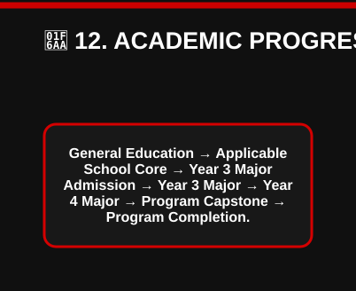

[View editable Mermaid diagram](./IMAGES/FLOW-02-ALL-SCHOOLS-COMBINED-GENERAL-STRUCTURE.mmd)

| Academic Component | Applicable Requirement |
| --- | --- |
| Academic | Students do not progress into applicable Year 3 major coursework until the foundational requirements established for that major have been satisfied. Applicable School Core courses retain their established prerequisites. |

# 🌱 13. MINOR ARCHITECTURE

Minors are predetermined academic sequences attached to the applicable discipline.

| Minor Requirement | Standard |
| --- | --- |
| Standard Minor Size | 15 credits in the current combined curriculum unless the applicable curriculum expressly establishes otherwise. |
| Typical Courses | 5 courses × 3 credits. |
| Course Selection | Predetermined. |
| Student-Selected Electives | No unrestricted electives. |
| OA | Required. |
| PA | Required. |
| Project | Generally reserved for the culminating applied-learning/capstone course under the current minor architecture. |
| Capstone | Culminating minor course where established. |
| Applied Build | Culminating course where established. |
| Supervision | Culminating course where established. |
| Experiential | According to the applicable minor/course record. |
| Transfer Maximum | 6 credits under the established minor transfer standard. |

| Minor Academic Flow | Progression |
| --- | --- |
| Minor flow | Minor Entry → Foundational Minor Course → Sequential Discipline Coursework → Applied Learning → Applied Learning Capstone → Minor Complete. |

| Curriculum Owner / Source | Software / Content Function |
| --- | --- |
| Curriculum Ownership | The controlling course-level minor curriculum determines the exact prerequisite chain, software, certification review, project, capstone, applied-build, experiential, and supervision requirements. |

# 🎒 14. BACHELOR’S ARCHITECTURE

| Academic Component | Applicable Requirement |
| --- | --- |
| Academic | The Bachelor’s pathway progresses through the applicable foundational curriculum into Year 3 and Year 4 major study. |

| Bachelor’s Component | Academic Structure |
| --- | --- |
| General Education | Applicable institutional foundation. |
| School Core | Applicable school-specific foundation. |
| Year 3 Major | 30 credits. |
| Year 4 Major | 30 credits. |
| Major Admission | Applicable Year 3 / Year 4 admission gateway. |
| Capstone | Final major course under the established Year 4 life-cycle sequence. |

# 🧠 15. YEAR 3 MAJOR ARCHITECTURE

Year 3 establishes the student's disciplinary major foundation.

| Year 3 Requirement | Academic Structure |
| --- | --- |
| Course Level | 3xxx major coursework. |
| Standard Major Credits | 30 credits. |
| Major Identity | Home-major discipline. |
| OA | Required. |
| PA | Required under the current combined major curriculum. |
| Project | Not required unless the applicable course expressly establishes otherwise. |
| Certification Review | According to applicable major/track. |
| Certification Progression | According to applicable major/track. |
| Software | According to applicable discipline. |
| Experiential if Selected | According to applicable major/course. |
| One-Month Internal Experiential | According to applicable pathway. |
| Capstone | Generally not applicable until the designated culminating course/level. |
| Applied Build | Generally not applicable unless expressly established. |
| Supervision | Generally not applicable unless expressly established. |

| Year 3 Academic Flow | Progression |
| --- | --- |
| Year 3 flow | Year 3 Major → Disciplinary Foundation → OA + PA → Sequential Major Knowledge → Year 4 Admission. |

# 🛠️ 16. YEAR 4 MAJOR ARCHITECTURE

| Year 4 Purpose | Progression |
| --- | --- |
| Year 4 | moves the student from disciplinary preparation into a sequential applied professional life cycle. |

| Year 4 Requirement | Academic Structure |
| --- | --- |
| Course Level | 4xxx major coursework. |
| Credits | 30. |
| Courses | 10 × 3-credit courses. |
| OA | Required. |
| PA | Required. |
| Project | Required throughout the Year 4 life cycle. |
| Experiential if Selected | Required where established. |
| Certification Review | According to applicable general pathway or professional track. |
| Certification Progression | Carried sequentially where a certification-review track applies. |
| Capstone | Final 4110 course. |
| Applied Build | Final culminating course where established. |
| Supervision | Final culminating course where established. |

### Year 4 Project Life Cycle

| Phase | Project Life Cycle |
| ---: | --- |
| 1 | Problem / Venture Definition |
| 2 | Requirements |
| 3 | Analysis |
| 4 | Architecture / Design |
| 5 | Development / Implementation |
| 6 | Integration |
| 7 | Testing / Validation |
| 8 | Deployment / Operations |
| 9 | Optimization |
| 10 | Life-Cycle Integration |
| 11 | 4110 Capstone. |

### Year 4 Assessment Structure

| Stage | Assessment Structure |
| ---: | --- |
| 1 | Each Year 4 Course |
| 2 | OA + PA + Project Phase |
| 3 | Next Life-Cycle Phase |
| 4 | Continuing Project |
| 5 | Final 4110 Course |
| 6 | Capstone + Applied Build + Supervision |
| 7 | Year 4 Complete. |

| Professional Certification-Review Tracks | Academic Major Relationship |
| --- | --- |
| may overlay certification learning, milestones, exam modules, and final review deadlines across the same academic life cycle | without replacing the underlying academic major. |

# 🏅 17. CERTIFICATION-REVIEW ARCHITECTURE

RIAH distinguishes academic program completion from external professional certification.

| Certification Component | Academic Standard |
| --- | --- |
| Academic Curriculum | Controlled by RIAH Pathway. |
| Certification Review | May be embedded in an applicable professional track. |
| External Certification | Separate from the RIAH academic credential unless an external authority independently requires otherwise. |
| Certification Progression | May progress across multiple sequential courses. |
| Exam Modules | Mapped to applicable courses where established. |
| Review Completion | May culminate in the final course. |
| Certification Track | Does not replace the underlying academic discipline. |
| General Pathway | May exist without certification review. |
| Track Pathway | Adds the established certification-review layer to the academic pathway. |

| Academic Component | Applicable Requirement |
| --- | --- |
| Academic | Examples of established review families appearing in the current combined curriculum include applicable Microsoft, cybersecurity, audit, risk, accounting, finance, fraud, tax, project-management, and program-management review tracks. |

# 🔬 18. MASTER’S ARCHITECTURE

The current graduate major structure uses a sequential 30-credit Master’s curriculum.

| Master’s Requirement | Academic Structure |
| --- | --- |
| Credits | 30. |
| Courses | 10 × 3 credits. |
| Course Level | 5xxx. |
| Sequence | Sequential. |
| OA | Required. |
| PA | Required. |
| Project | Required. |
| Experiential if Selected | According to applicable curriculum. |
| Certification Review | General pathway or applicable professional track. |
| Capstone | Final 5110 course. |
| Applied Build | Final culminating course where established. |
| Supervision | Final culminating course where established. |

Master’s Life Cycle:
| Stage | Master’s Progression |
| ---: | --- |
| 1 | Master’s Admission |
| 2 | 5101 |
| 3 | Graduate Analysis |
| 4 | Advanced Requirements |
| 5 | Architecture / Design |
| 6 | Advanced Implementation |
| 7 | Integration |
| 8 | Testing / Validation |
| 9 | Deployment / Operations |
| 10 | Monitoring / Evaluation |
| 11 | Optimization |
| 12 | 5110 Graduate Capstone. |

| Certification-Review Element | Academic / Professional Structure |
| --- | --- |
| Certification-Review | The project continues through the graduate life cycle where established. Professional certification-review tracks may reuse and advance the applicable certification-review framework at the graduate level. |

# 📊 19. MBA ARCHITECTURE

The current MBA-in-major structure uses a sequential 30-credit management curriculum.

| MBA Requirement | Academic Structure |
| --- | --- |
| Credits | 30. |
| Courses | 10 × 3 credits. |
| Course Level | 6xxx. |
| OA | Required. |
| PA | Required. |
| Project | Required. |
| Primary Orientation | Management, leadership, governance, strategy, organizational decision-making, operations, performance, and life-cycle management. |
| Experiential if Selected | According to applicable curriculum. |
| Certification Review | General pathway or applicable professional track. |
| Capstone | Final 6110 course. |
| Applied Build | Final culminating course where established. |
| Supervision | Final culminating course where established. |

MBA Management Life Cycle:
| Stage | MBA Progression |
| ---: | --- |
| 1 | MBA Admission |
| 2 | Management Venture / Strategic Definition |
| 3 | Organizational Requirements |
| 4 | Governance & Design |
| 5 | Program / Resource Management |
| 6 | Operations & Integration |
| 7 | Risk & Performance |
| 8 | Leadership & Implementation |
| 9 | Analytics & Control |
| 10 | Strategic Optimization |
| 11 | 6110 Management Capstone. |

| Academic Component | Applicable Requirement |
| --- | --- |
| Academic | The MBA maintains the student's disciplinary context while moving the work to the management and leadership level. |

# 📊 20. GENERAL MBA

| General MBA | Academic Structure |
| --- | --- |
| RIAH Pathway School of Business also maintains an established General MBA | 30 Credit Hours. The General MBA remains separate from MBA-in-major pathways and follows its own controlling curriculum. |

# 🎓 21. EXPERIENTIAL STRUCTURE

| Academic Component | Applicable Requirement |
| --- | --- |
| Academic | Experiential education is an integrated but separately governed component of applicable RIAH pathways. |

| Experiential Component | Program Standard |
| --- | --- |
| Eligibility | According to applicable program. |
| Selection | According to applicable pathway and available capacity. |
| Experiential if Selected | Appears in applicable course/program records. |
| Internal Experiential | Applicable pathways may include the established one-month internal RIAH experiential structure. |
| Placement | Based on applicable pathway, experience, placement requirements, supervision, and ecosystem needs. |
| Academic Curriculum | Experiential does not erase the student's academic course requirements. |
| Supervision | Applied where established by the applicable curriculum/pathway. |
| JD | One-month internal experiential guaranteed during 4L under the established JD structure. |
| Non-JD | Timing follows the applicable state pathway. |
| GED/HSE | Not treated as a degree-major experiential pathway. |
| High School | Governed separately through the secondary-school curriculum. |

# 🏫 22. RIAH PATHWAY SECONDARY SCHOOL

RIAH Pathway Secondary School contains two distinct secondary pathways:
| Curriculum Component | Academic Structure |
| --- | --- |
| 1. Four-Year High School Diploma. | — |
| 2. GED/HSE Preparation. | — |

| Secondary Pathway | Academic Progression |
| --- | --- |
| High School Diploma | Grades 9–12 → 120 Credits → OA + PA Every Course → Both Proctored → RIAH Pathway High School Diploma. |
| GED/HSE Preparation | GED 101–104 → 12 Preparation Credits → Proctored Preparation → Separate Official HSE Credentialing. |

# 🏅 23. FOUR-YEAR HIGH SCHOOL DIPLOMA ARCHITECTURE

## Religious Private High School and Multi-State Operating Structure

---

| High School Component | Academic Requirement |
| --- | --- |
| High School Curriculum | The RIAH Pathway High School Diploma is a fixed four-year Grades 9–12 secondary curriculum. |

| High School Component | Academic Structure |
| --- | --- |
| Grades | 9–12. |
| Academic Years | 4. |
| Semesters | 8. |
| Semester Length | 6 months. |
| Courses Per Semester | 5. |
| Credits Per Course | 3 RIAH credits. |
| Credits Per Semester | 15. |
| Credits Per Year | 30. |
| Total Courses | 40 fixed courses. |
| Total Credits | 120 RIAH credits. |
| Unspecified Electives | None. |
| Objective Assessment | Required every course. |
| Performance Assessment | Required every course. |
| OA Proctoring | Required for every course. |
| PA Proctoring | Required for every course. |
| Course Assessment Model | OA + PA, proctored. |
| Senior Capstone | None. |
| High School Capstone | No capstone requirement. |
| Delivery | Virtual in participating jurisdictions. |
| State Components | Integrated where applicable. |
| Graduation Controls | Applied where applicable. |
| Completion | Complete required curriculum and applicable graduation requirements. |
| Credential | RIAH Pathway High School Diploma. |

## High School Assessment Architecture

| High School Component | Academic Requirement |
| --- | --- |
| High School Curriculum | Every course within the RIAH Pathway Four-Year High School Diploma curriculum follows the same core assessment architecture: |

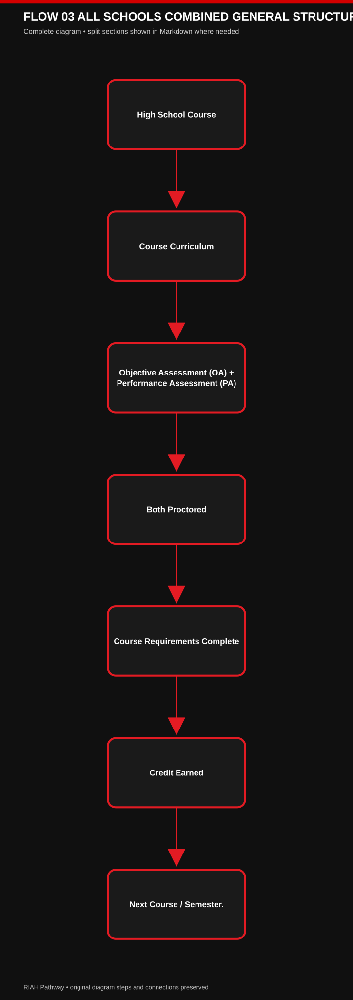

[View editable Mermaid diagram](./IMAGES/FLOW-03-ALL-SCHOOLS-COMBINED-GENERAL-STRUCTURE.mmd)

High School Assessment Rules:
| Curriculum Component | Academic Structure |
| --- | --- |
| OA Required | Yes, every course. |
| PA Required | Yes, every course. |
| OA Proctored | Yes, every course. |
| PA Proctored | Yes, every course. |
| Unproctored OA | No. |
| Unproctored PA | No. |
| Capstone | No. |
| Senior Capstone | No. |
| Separate Capstone Project | No. |
| Completion Basis | Required curriculum + OA + PA + applicable graduation requirements. |
| Diploma | Awarded after completion of the established High School Diploma curriculum and applicable graduation requirements. |

High School Progression:
| Curriculum Component | Academic Structure |
| --- | --- |
| Grade 9 | 30 credits — OA + PA proctored |
| → Grade 10 | 30 credits — OA + PA proctored |
| → Grade 11 | 30 credits — OA + PA proctored |
| → Grade 12 | 30 credits — OA + PA proctored |
| → 120 RIAH credits | — |
| → State-specific curriculum components where applicable | — |
| → State-specific graduation controls where applicable | — |
| → Graduation Audit | — |
| → No Capstone | — |
| → RIAH Pathway High School Diploma. | — |

| High School Component | Academic Requirement |
| --- | --- |
| High School Curriculum | High School Subject Architecture includes English Language Arts, Mathematics, Science, History, Geography, Government/Civics, Economics, Sociology, Psychology, Ethnic Studies, Financial Literacy, Personal Finance, World Language, Digital Literacy, Computer Science, Health, Physical Education, Fine Arts, and Oral Communication. |

| High School Component | Academic Requirement |
| --- | --- |
| High School Curriculum | Detailed course tables and state-component mappings remain in the controlling High School Diploma Curriculum. |

## ❤️ High School Instructional Software / Curriculum Content Layer

| Curriculum Owner | Instructional Software | Curriculum-Content Mapping | RIAH Supplemental Authority |
| --- | --- | --- | --- |
| RIAH Pathway retains and controls its own High School Diploma curriculum. | Edmentum is the primary instructional software | curriculum-content ecosystem mapped to the applicable RIAH high-school courses. | RIAH may supplement, expand, reorganize, or add curriculum content, assignments, OA, PA, state components, and other course requirements. |

| Software | RIAH Course | Course Name | Coverage |
| --- | --- | --- | --- |
| Edmentum | ENG 1101 | English I / Composition I | ✓ |
| Edmentum | MAT 1101 | Algebra I | ✓ |
| Edmentum | SCI 1101 | Geology | ✓ |
| Edmentum | GEO 1101 | World Geography | ✓ |
| Edmentum | TEC 1101 | Digital Literacy | ✓ |
| Edmentum | ENG 1102 | English II / Composition II | ✓ |
| Edmentum | MAT 1102 | Geometry | ✓ |
| Edmentum | SCI 1102 | Astronomy | ✓ |
| Edmentum | HIS 1101 | World History | ✓ |
| Edmentum | HLT 1101 | Health | ✓ |
| Edmentum | ENG 2101 | English III / American Literature | ✓ |
| Edmentum | MAT 2101 | Algebra II | ✓ |
| Edmentum | SCI 2101 | Earth Science | ✓ |
| Edmentum | HIS 2101 | Holocaust & Genocide Studies | ✓ |
| Edmentum | PED 2101 | Physical Education | ✓ |
| Edmentum | ENG 2102 | English IV / World Literature | ✓ |
| Edmentum | MAT 2102 | Trigonometry | ✓ |
| Edmentum | SCI 2102 | Environmental Science | ✓ |
| Edmentum | GOV 2101 | Government | ✓ |
| Edmentum | ART 2101 | Fine Arts | ✓ |
| Edmentum | MAT 3101 | Precalculus | ✓ |
| Edmentum | SCI 3101 | Biology | ✓ |
| Edmentum | HIS 3101 | American History | ✓ |
| Edmentum | FIN 3101 | Financial Literacy | ✓ |
| Edmentum | LAN 3101 | World Language I | ✓ |
| Edmentum | MAT 3102 | Calculus | ✓ |
| Edmentum | SCI 3102 | Chemistry | ✓ |
| Edmentum | HIS 3102 | State History | ✓ |
| Edmentum | LAN 3102 | World Language II | ✓ |
| Edmentum | PFI 3101 | Personal Finance | ✓ |
| Edmentum | MAT 4101 | Statistics | ✓ |
| Edmentum | SCI 4101 | Anatomy | ✓ |
| Edmentum | ECO 4101 | Economics | ✓ |
| Edmentum | CSC 4101 | Computer Science | ✓ |
| Edmentum | ETH 4101 | Ethnic Studies | ✓ |
| Edmentum | SCI 4102 | Physiology | ✓ |
| Edmentum | SCI 4103 | Physics | ✓ |
| Edmentum | SOC 4101 | Sociology | ✓ |
| Edmentum | PSY 4101 | Psychology | ✓ |
| Edmentum | COM 4101 | Oral Communication | ✓ |

| Curriculum Owner / Source | Software / Content Function |
| --- | --- |
| Curriculum Ownership | ✓ = Edmentum provides applicable instructional content/courseware mapped into the RIAH course. RIAH curriculum remains controlling for every course. |

# 🧩 24. HIGH SCHOOL STATE-COMPONENT STRUCTURE

| Academic Component | Applicable Requirement |
| --- | --- |
| Academic | State-specific curriculum components are integrated into established RIAH courses rather than automatically creating separate courses. |

| High School Component | Academic Requirement |
| --- | --- |
| High School Curriculum | Applicable components currently mapped within the controlling High School Diploma Curriculum include state-specific content involving Health, Physical Education, Government/Civics, Fine Arts, Financial Literacy, Personal Finance, State History, Computer Science, Holocaust/Genocide Studies, Ethnic Studies, and Health/Safety. |

| Academic Component | Applicable Requirement |
| --- | --- |
| Academic | State-specific non-course graduation controls remain separate from the academic course structure and are handled through the applicable graduation audit. |

| Academic Component | Applicable Requirement |
| --- | --- |
| Academic | State-specific components do not alter the general high-school assessment architecture. Each applicable high-school course continues to require Objective Assessment + Performance Assessment + Proctoring. |

# 📘 25. GED/HSE PREPARATION ARCHITECTURE

RIAH Pathway Secondary School provides GED/HSE preparation.

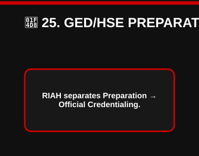

[View editable Mermaid diagram](./IMAGES/FLOW-04-ALL-SCHOOLS-COMBINED-GENERAL-STRUCTURE.mmd)

| GED/HSE Curriculum Component | Preparation / Credential Structure |
| --- | --- |
| GED/HSE | RIAH controls its preparation curriculum, instruction, learning package, internal assessments, and academic requirements. Official GED/HiSET examination and credential issuance remain governed by the applicable official examination provider and jurisdiction. |

| GED/HSE Course | Credits and Preparation Area |
| --- | --- |
| GED 101 | Mathematical Reasoning Preparation — 3 credits. |
| GED 102 | Reasoning Through Language Arts Preparation — 3 credits. |
| GED 103 | Science Preparation — 3 credits. |
| GED 104 | Social Studies Preparation — 3 credits. |
| Total | 12 credits. |

## ❤️ GED/HSE Preparation — Edmentum Software Coverage

| RIAH Course | Course Name | Edmentum |
| --- | --- | --- |
| GED 101 | Mathematical Reasoning Preparation | ✓ |
| GED 102 | Reasoning Through Language Arts Preparation | ✓ |
| GED 103 | Science Preparation | ✓ |
| GED 104 | Social Studies Preparation | ✓ |

| Curriculum Owner / Source | Software / Content Function |
| --- | --- |
| Curriculum Ownership | ✓ = Edmentum provides applicable instructional content/courseware that RIAH maps into its GED/HSE preparation curriculum. RIAH curriculum remains controlling. |

Corresponding Concurrent General Education Opportunity:
| Curriculum Component | Academic Structure |
| --- | --- |
| GED 101 → MAT 1010 | College Algebra. |
| GED 102 → ENG 1010 | College English. |
| GED 103 → SCI 1010 | Science. |
| GED 104 → HIS 1010 | History. |

| Transfer / Credit Component | Applicable Requirement |
| --- | --- |
| Transfer / Credit | Eligible GED/HSE students may pursue up to 12 corresponding General Education credits concurrently. GED Preparation credits and General Education credits remain academically separate. |

# ❤️ 26. GED/HSE LEARNING ENVIRONMENT

| Curriculum Owner / Source | Software / Content Function |
| --- | --- |
| Curriculum Ownership | GED/HSE students receive an integrated RIAH learning environment that may include RIAH Textbook, RIAH Workbook, RIAH Journal / Module Notebook, RIAH Planner / Curriculum Planner, RIAH Study Guide, RIAH Review Guide, RIAH LMS, RIAH Curriculum, RIAH Assignments, RIAH Assessments, Edmentum GED/HSE preparation content and courseware, official HiSET preparation materials where applicable, and applicable state add-on curriculum and resources. |

| Curriculum Owner / Source | Software / Content Function |
| --- | --- |
| Curriculum Ownership | Edmentum does not replace the RIAH curriculum. RIAH develops and controls its own academic curriculum and integrates applicable Edmentum and other approved educational resources into that curriculum. |

# 📘 27. GED/HSE ACADEMIC FLOW

#### Mermaid Flow 01 — 📘 27. GED/HSE ACADEMIC FLOW (Part 1 of 2)

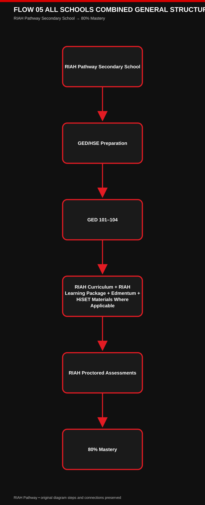

[View editable Mermaid Flow 01](./IMAGES/FLOW-05-ALL-SCHOOLS-COMBINED-GENERAL-STRUCTURE-PART-01.mmd)

#### Mermaid Flow 02 — 📘 27. GED/HSE ACADEMIC FLOW (Part 2 of 2)

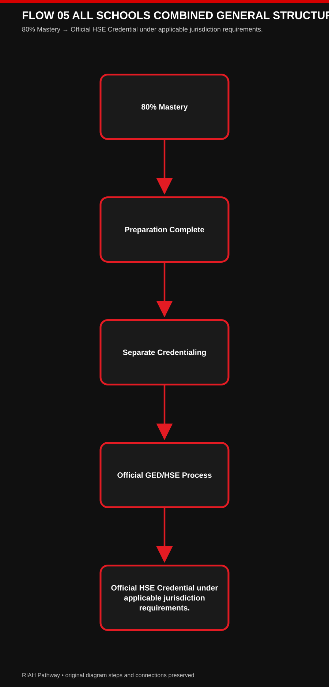

[View editable Mermaid Flow 02](./IMAGES/FLOW-05-ALL-SCHOOLS-COMBINED-GENERAL-STRUCTURE-PART-02.mmd)

[View editable Mermaid diagram](./IMAGES/FLOW-05-ALL-SCHOOLS-COMBINED-GENERAL-STRUCTURE.mmd)

# 🧠 28. GED/HSE, HIGH SCHOOL & REGULAR COURSE ASSESSMENT STANDARD

| Assessment Type | Attempts | Passing / Applicable Standard | Proctoring |
| --- | --- | --- | --- |
| Placement/Test-Out | 3 maximum attempts | applicable RIAH standard | Proctored. |
| GED/HSE Preparation Checkpoint | Unlimited within semester | 80% | Proctored. |
| GED/HSE Preparation Final | Unlimited within semester | 80% | Proctored. |
| High School Objective Assessment (OA) | Per high-school assessment policy | applicable high-school standard | Proctored every course. |
| High School Performance Assessment (PA) | Per high-school assessment policy | applicable high-school standard | Proctored every course. |
| Regular Course Checkpoint | Unlimited within semester | 80% | Proctored. |
| Regular Course Final | Unlimited within semester | 80% | Proctored. |
| OA | Applicable course policy | applicable RIAH standard | Proctored. |

| Academic Component | Applicable Requirement |
| --- | --- |
| Academic | The three-attempt limitation applies to placement/test-out assessments, not regular course checkpoints and finals. |

| High School Component | Academic Requirement |
| --- | --- |
| High School Curriculum | For the High School Diploma pathway, every course requires both an Objective Assessment and Performance Assessment, and both assessments are proctored. |

# 📈 29. GED/HSE CONCURRENT ACCELERATION

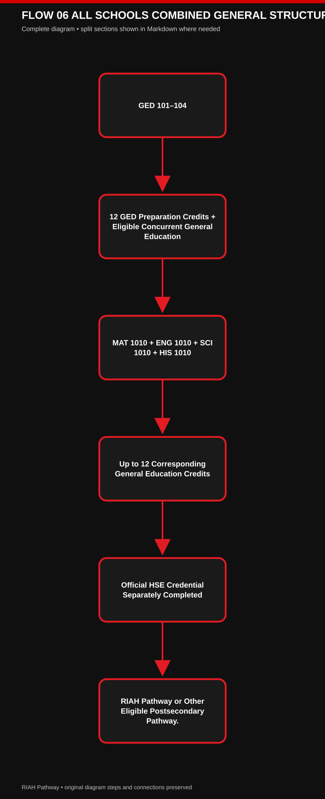

[View editable Mermaid diagram](./IMAGES/FLOW-06-ALL-SCHOOLS-COMBINED-GENERAL-STRUCTURE.mmd)

# 📋 30. HIGH SCHOOL DIPLOMA VS. GED/HSE

High School Diploma:
| Curriculum Component | Academic Structure |
| --- | --- |
| School | RIAH Pathway Secondary School. |
| Purpose | Traditional secondary education. |
| Structure | Grades 9–12. |
| RIAH Credits | 120. |
| Assessment | OA + PA in every course. |
| Proctoring | OA + PA proctored in every course. |
| Capstone | None. |
| Academic Record | Full high-school transcript. |
| GPA | Yes. |
| Concurrent Coursework | Available where applicable. |
| Credential | RIAH Pathway High School Diploma. |
| State Components | Where applicable. |
| Postsecondary Continuation | RIAH Pathway or other applicable institution. |

GED/HSE Preparation:
| Curriculum Component | Academic Structure |
| --- | --- |
| School | RIAH Pathway Secondary School. |
| Purpose | Alternative HSE preparation. |
| Structure | GED/HSE preparation. |
| RIAH Credits | 12 GED Preparation credits. |
| Assessment | Preparation assessments. |
| Proctoring | RIAH preparation assessments proctored. |
| Capstone | None. |
| Academic Record | RIAH preparation record + separate official HSE record. |
| GPA | No traditional four-year high-school GPA. |
| Concurrent Coursework | Up to 12 corresponding GE credits. |
| Credential | Official HSE credential through applicable official process. |
| State Components | Where applicable. |
| Postsecondary Continuation | RIAH Pathway or another institution accepting the applicable HSE credential. |

# 📐 31. UNIVERSAL COURSE ARCHITECTURE

| Course Identity Fields | Curriculum and Software Fields | Assessment and Project Fields | Experiential and Completion Fields |
| --- | --- | --- | --- |
| Course; School; Type; Course Name; Credit Hours; Prerequisite | Software Stack; PebblePad; Certification Review; Certification Progression and Learning; Exam Modules | Project; OA; PA | Experiential if Selected; Experiential — One Month Internal; Capstone; Applied Build; Supervision |

Not every field applies to every course.

| High School Component | Academic Requirement |
| --- | --- |
| High School Curriculum | High School Exception — Every High School Diploma course requires OA + PA, and both are proctored. High School Diploma courses do not use a capstone requirement. |

1. ✅ = applicable/included.
2. ❌ = not applicable/not included.

| High School Software and Content Layer | Curriculum Control |
| --- | --- |
| High School Software / Content Layer | Applicable High School Diploma courses use Edmentum as the mapped instructional software/content layer. The software content does not replace the RIAH curriculum; RIAH curriculum remains controlling and may add supplemental content, requirements, assignments, OA, PA, and other applicable course components. |
| The controlling course record determines all other requirements. | — |

# 📐 32. ASSESSMENT × PROJECT ARCHITECTURE BY LEVEL

| Academic Level | Assessment and Project Architecture |
| --- | --- |
| General Education | OA/PA/projects according to applicable course; generally no capstone, applied build, or supervision. |
| School Core | OA + PA; generally no project, capstone, applied build, or supervision. |
| Minor | OA + PA; culminating project/capstone/applied build/supervision where established. |
| Bachelor’s Year 3 | OA + PA; generally no project/capstone/applied build/supervision. |
| Bachelor’s Year 4 | OA + PA + sequential life-cycle project; final 4110 capstone; final applied build and supervision; PebblePad is used for the final cumulative project/capstone course. |
| Master’s | OA + PA + sequential graduate life-cycle project; final 5110 capstone; final applied build and supervision; PebblePad is used for the final cumulative project/capstone course. |
| MBA | OA + PA + sequential management life-cycle project; final 6110 capstone; final applied build and supervision; PebblePad is used for the final cumulative project/capstone course. |
| JD / Non-JD | Per controlling law curriculum. |
| High School Diploma | OA every course + PA every course; both proctored; no separate universal project requirement; no capstone; no applied build; no supervision. |
| GED/HSE Preparation | Proctored preparation assessments; no capstone, applied build, or supervision. |

# 📈 33. PREREQUISITE PROGRESSION STANDARD

| Prerequisite Component | Progression Standard |
| --- | --- |
| Progression | Foundation → Developing → Intermediate → Advanced → Applied / Integrative. |
| Prerequisite Definition | The applicable prior foundational course is identified. |
| Prerequisite Display | Course number and course title are used where established. |
| General Education Prerequisite | May be satisfied through applicable accepted credit or successful RIAH placement/test-out where permitted. |
| Sequential Curriculum | The preceding course is generally the prerequisite where the curriculum establishes a sequential life cycle. |
| Year 3 | Establishes disciplinary major knowledge and progression. |
| Year 4 | Applies disciplinary knowledge through a continuing project life cycle. |
| Master’s | Advances technical/professional knowledge through a graduate life cycle. |
| MBA | Advances management, strategy, governance, leadership, and organizational application through a management life cycle. |
| Minor | Follows its established prerequisite chain and culminates in the applicable applied-learning/capstone structure. |
| JD / Non-JD | Follows the controlling law prerequisite and state-pathway structure. |
| High School | Follows the established Grades 9–12 prerequisite sequence with proctored OA + PA for every course and no capstone requirement. |
| GED/HSE | Follows preparation, assessment, and official credentialing separation. |

# 📋 34. DUPLICATE CREDIT & COURSE IDENTITY STANDARD

| Transfer / Credit Component | Applicable Requirement |
| --- | --- |
| Transfer / Credit | A student does not receive duplicate academic credit for the same completed academic requirement merely because the same knowledge or skill is incorporated into another course, project, certification-review track, applied build, or multidisciplinary activity. |

| Academic Component | Applicable Requirement |
| --- | --- |
| Academic | Integrated content does not automatically create a second separately awarded course. Course identity remains controlled by the applicable curriculum record. |

# 🏅 35. PROFESSIONAL TRACK STANDARD

| Certification-Review Element | Academic / Professional Structure |
| --- | --- |
| Certification-Review | Applicable majors may contain a general academic pathway and/or one or more professional certification-review tracks. |

| Curriculum Owner / Source | Software / Content Function |
| --- | --- |
| Curriculum Ownership | A professional track may add Certification Review, Certification Progression, Exam Modules, Additional Software, Certification-specific project context, Review milestones, and Final review deadlines. |

| Certification-Review Element | Academic / Professional Structure |
| --- | --- |
| Certification-Review | The professional track remains part of the applicable academic discipline. It does not convert the academic degree into the external professional certification. |

# 🚪 36. PROGRAM COMPLETION STANDARD

| Transfer / Credit Component | Applicable Requirement |
| --- | --- |
| Transfer / Credit | Program completion requires satisfaction of the applicable required curriculum, credit requirement, prerequisites, OA requirements, PA requirements, proctoring requirements, projects where applicable, certification-review curriculum where attached to the selected pathway, experiential requirements where applicable, capstone where applicable, applied build where applicable, supervision where applicable, state-specific requirements, law-pathway requirements, secondary-school graduation requirements, and other controlling program requirements. |

## High School Diploma Completion Standard

| High School Diploma Requirement | Course / Assessment Requirement | Credit / Graduation Requirement | Completion Outcome |
| --- | --- | --- | --- |
| The High School Diploma pathway does not require a capstone. | Complete the established Grades 9–12 curriculum. | Earn the required 120 RIAH credits. | Complete the graduation audit. |
| Complete applicable state-specific curriculum and graduation requirements. | Complete the required Objective Assessment for every course. | Complete the OA and PA under proctoring. | Receive the RIAH Pathway High School Diploma upon successful completion of the applicable requirements. |
| No capstone. | Complete the required Performance Assessment for every course. | Applicable State Requirements. | RIAH Pathway High School Diploma. |

| Completion Stage | Curriculum | Assessment / Proctoring | Credits / State Requirements | Graduation |
| ---: | --- | --- | --- | --- |
| 1 | Complete High School Curriculum | OA + PA for Every Course | 120 RIAH Credits | Graduation Audit |
| 2 | Grades 9–12 curriculum | Every OA + PA Proctored | Applicable State Requirements | No Capstone |
| 3 | The applicable curriculum document remains controlling for course-level requirements. | Objective Assessment + Performance Assessment | applicable graduation requirements | RIAH Pathway High School Diploma. |

# 🧭 37. COMPLETE RIAH ACADEMIC ARCHITECTURE FLOW

#### Mermaid Flow 01 — 🧭 37. COMPLETE RIAH ACADEMIC ARCHITECTURE FLOW (Part 1 of 6)

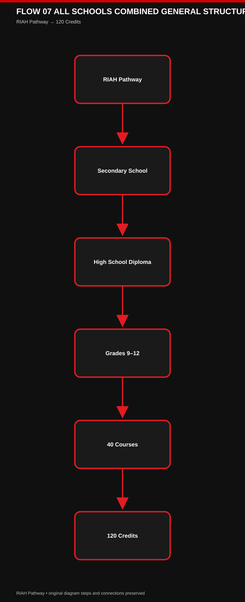

[View editable Mermaid Flow 01](./IMAGES/FLOW-07-ALL-SCHOOLS-COMBINED-GENERAL-STRUCTURE-PART-01.mmd)

#### Mermaid Flow 02 — 🧭 37. COMPLETE RIAH ACADEMIC ARCHITECTURE FLOW (Part 2 of 6)

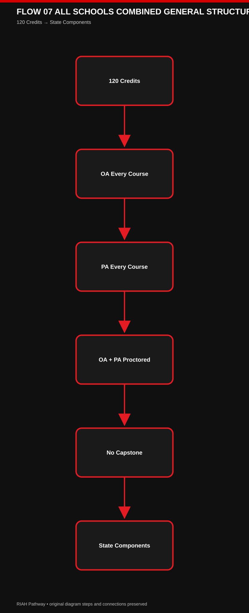

[View editable Mermaid Flow 02](./IMAGES/FLOW-07-ALL-SCHOOLS-COMBINED-GENERAL-STRUCTURE-PART-02.mmd)

#### Mermaid Flow 03 — 🧭 37. COMPLETE RIAH ACADEMIC ARCHITECTURE FLOW (Part 3 of 6)

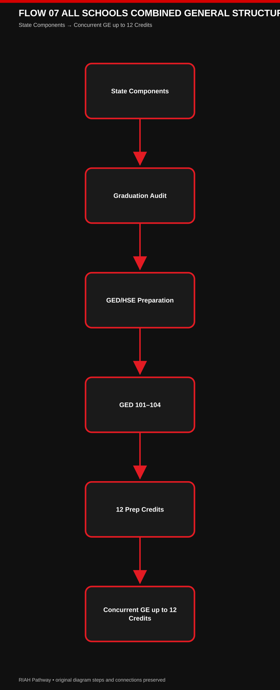

[View editable Mermaid Flow 03](./IMAGES/FLOW-07-ALL-SCHOOLS-COMBINED-GENERAL-STRUCTURE-PART-03.mmd)

#### Mermaid Flow 04 — 🧭 37. COMPLETE RIAH ACADEMIC ARCHITECTURE FLOW (Part 4 of 6)

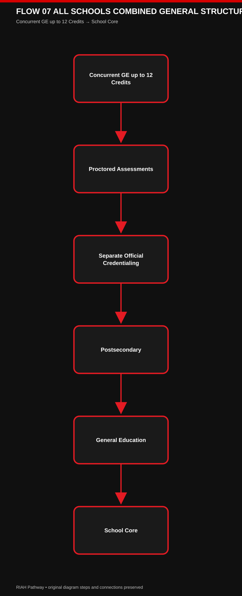

[View editable Mermaid Flow 04](./IMAGES/FLOW-07-ALL-SCHOOLS-COMBINED-GENERAL-STRUCTURE-PART-04.mmd)

#### Mermaid Flow 05 — 🧭 37. COMPLETE RIAH ACADEMIC ARCHITECTURE FLOW (Part 5 of 6)

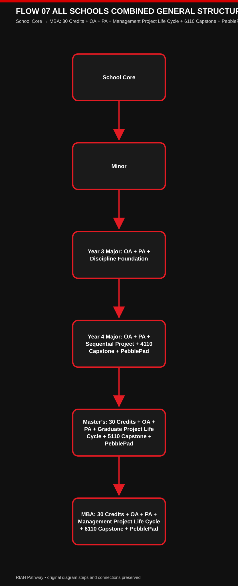

[View editable Mermaid Flow 05](./IMAGES/FLOW-07-ALL-SCHOOLS-COMBINED-GENERAL-STRUCTURE-PART-05.mmd)

#### Mermaid Flow 06 — 🧭 37. COMPLETE RIAH ACADEMIC ARCHITECTURE FLOW (Part 6 of 6)

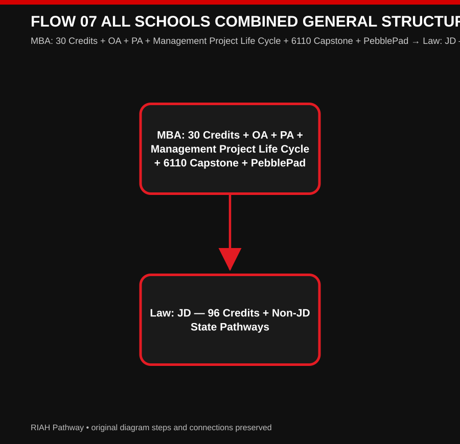

[View editable Mermaid Flow 06](./IMAGES/FLOW-07-ALL-SCHOOLS-COMBINED-GENERAL-STRUCTURE-PART-06.mmd)

[View editable Mermaid diagram](./IMAGES/FLOW-07-ALL-SCHOOLS-COMBINED-GENERAL-STRUCTURE.mmd)

| Curriculum Owner / Source | Software / Content Function |
| --- | --- |
| Curriculum Ownership | High School Software Mapping — The High School Diploma curriculum also controls the course-level mapping of Edmentum instructional content to applicable RIAH high-school courses. Edmentum functions as the instructional software/content layer beneath the RIAH curriculum and does not replace RIAH course ownership or curriculum requirements. |
# ✅ 38. CONTROLLING CURRICULUM STANDARD

This General document establishes the shared RIAH Pathway academic architecture.

The detailed curriculum remains controlled by:
| Curriculum Component | Academic Structure |
| --- | --- |
| DegreeCurriculum.md | degree, major, minor, School Core, Master’s, MBA, JD, Non-JD, certification-track, software, assessment, project, capstone, applied-build, experiential, and supervision details. |
| GEDCurriculumDraft.md | GED/HSE preparation, concurrent General Education, assessment, proctoring, learning-package, Edmentum, HiSET, and preparation-versus-credentialing structure. |
| HSDiplomaDraft.md | Grades 9–12 curriculum, course prerequisites, 120-credit structure, state components, graduation controls, diploma availability, secondary-school progression, and the proctored OA + PA assessment requirement for every high-school course with no high-school capstone requirement. |

| Academic Component | Applicable Requirement |
| --- | --- |
| Academic | Where a detailed curriculum document expressly establishes a course-specific or pathway-specific requirement, that controlling detailed curriculum governs the applicable course or pathway. |

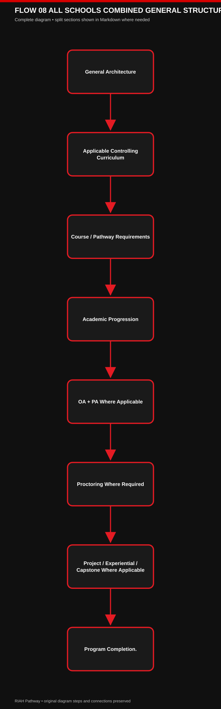

[View editable Mermaid diagram](./IMAGES/FLOW-08-ALL-SCHOOLS-COMBINED-GENERAL-STRUCTURE.mmd)

# 👑 RIAH PATHWAY
| Curriculum Architecture | Source |
| --- | --- |
| General Curriculum Architecture | Updated from the Final Curriculum Structure |
Displaying RIAH Pathway General Curriculum Architecture Rules and Standards.md.

---

# 👑RIAH Pathway.
