# 👑RIAH Pathway.

**Contributor; Mariah Dominique Rucker**

There is currently no team. I am building everything myself until I have hired the beta team. I am starting the hiring process this month, **October 2026**, for the CTO, CISO, experiential professionals, PhD-qualified faculty, and adjunct faculty for each school and major, with hiring continuing across the entire ecosystem as it scales.

Beta team members will be hired with **equity participation and compensation during the beta cohort**, which launches in **Spring 2027**.

The website will launch in **October 2026** as I continue to build, develop, revise, and finalize aspects of the RIAH Pathway ecosystem.

Learn more about me on GitHub and LinkedIn, or connect with me through social media and Linktree.

- **GitHub:** https://github.com/mariahdominiquerucker
- **LinkedIn:** https://linkedin.com/in/mariahrucker
- **Facebook:** https://facebook.com/heymariahrucker
- **Instagram:** https://instagram.com/heymariahrucker
- **Linktree:** https://linktr.ee/mariahrucker

---

# RIAH Pathway — Experiential Structure

## 🔑 Emoji Key

| Emoji | Purpose |
|---|---|
| 🧩 | Purpose |
| 🏗️ | Experiential architecture |
| ✅ | One-month Experiential guarantee |
| 🏫 | School alignment |
| 🌐 | Delivery, access, and placement format |
| 🏢 | Internal placement |
| 🤝 | External placement and partners |
| 🌍 | International Online Experiential |
| 🛡️ | Standards, controls, and compliance |
| 🧭 | Application, selection, Experiential levels, and placement flow |
| 👥 | Supervision, leadership, professionals, and review |
| 📚 | Curriculum, education, collections, and college credit |
| 💰 | Pricing, payment, paid, and unpaid standards |
| ⚖️ | Law, governance, and authorization |
| 📋 | Performance, documentation, and completion |
| 🚀 | Employment and career connection |

## 📑 Index

| Roman Numeral | Section | Emoji |
|---|---|---|
| I | PURPOSE | 🧩 |
| II | EXPERIENTIAL ARCHITECTURE | 🏗️ |
| III | EXPERIENTIAL DELIVERY | 🌐 |
| IV | INTERNAL PLACEMENT | 🏢 |
| V | EXTERNAL PLACEMENT | 🤝 |
| VI | INTERNATIONAL ONLINE EXPERIENTIAL | 🌍 |
| VII | CONSEQUENTIAL REAL-WORLD WORK STANDARD | 🛡️ |
| VIII | ONE-MONTH EXPERIENTIAL GUARANTEE | ✅ |
| IX | EXPERIENTIAL APPLICATION AND PLACEMENT PROCEDURE | 🧭 |
| X | PLACEMENT SELECTION | 🧭 |
| XI | SUPERVISION AND REVIEW | 👥 |
| XII | EXPERIENTIAL LEVELS | 🧭 |
| XIII | EXPERIENTIAL CURRICULUM AND COLLECTIONS | 📚 |
| XIV | EXPERIENTIAL PRICING | 💰 |
| XV | EXPERIENTIAL AND EDUCATION INTEGRATION | 📚 |
| XVI | EXPERIENTIAL COLLEGE CREDIT STRUCTURE | 📚 |
| XVII | SCHOOL ALIGNMENT | 🏫 |
| XVIII | NON-JD LAW EXPERIENTIAL STRUCTURE | ⚖️ |
| XIX | LAW EXPERIENTIAL SUPERVISION | ⚖️ |
| XX | PAID AND UNPAID PLACEMENT STANDARD | 💰 |
| XXI | ACCESSIBILITY AND PLACEMENT FLEXIBILITY | 🌐 |
| XXII | PERFORMANCE AND DOCUMENTATION | 📋 |
| XXIII | COMPLETION | 📋 |
| XXIV | EMPLOYMENT AND CAREER CONNECTION | 🚀 |
| XXV | EXPERIENTIAL GOVERNANCE | ⚖️ |
| XXVI | INTERNATIONAL COMPLIANCE CONTROL | 🛡️ |
| XXVII | CONTROLLING EXPERIENTIAL STRUCTURE | 🛡️ |
| XXVIII | WHOLE-SYSTEM EXPERIENTIAL DISTINCTION | 👑 |

# **XXVIII. 👑 WHOLE-SYSTEM EXPERIENTIAL DISTINCTION**

👑 **Real People:** Managers, Supervisors, Reviewers, faculty, professionals, governance, and employer partners.

👑 **Real Work:** Consequential work used in actual operations, development, implementation, production, and organizational objectives.

👑 **Internal + External Placements:** RIAH internal placements plus scalable vetted external employer placements.

👑 **Learning + Work:** 100% online Experiential curriculum completed concurrently with real applied work.

👑 **Experiential Collections + Capstone:** Experiential includes its applicable **Experiential Collection and Experiential Capstone Collection**, with the capstone integrated into the Experiential curriculum.

👑 **Supervised Capstone:** Experiential students receive supervision for their real work and **separate applicable supervision for the Experiential Capstone**, including human review through applicable supervisors, reviewers, faculty, employers, professional panels, and peers.

👑 **Assessment + Development:** Weekly proctored assessments connected to student development, assignments, and performance.

👑 **Experiential Levels:** Apprentice → Intern → Associate → Senior Associate → Manager → Executive. Students are placed at the applicable level based on RIAH requirements and verified eligibility.

👑 **Education Integration:** Experiential connects with applicable Bachelor's, Master's, MBA, JD, Non-JD, and college-credit structures.

👑 **Proprietary Technology:** RIAH Pathway integrates its **own proprietary mobile application and software** into the broader ecosystem.

👑 **Certification + Bar Review Integration:** Applicable **Certification Review Courses, Bar Review, and Baby Bar Review** are integrated into the broader education, Experiential, and professional-development ecosystem.

👑 **Integrated Products + Services:** Textbooks, workbooks, journals, planners, study materials, review products, mentoring, coaching, supervision, and other applicable products and services connect to the broader pathway.

👑 **Tuition + Payment:** Experiential pricing, upfront and monthly options, and broader applicable education payment structures.

👑 **Tuition Reimbursement:** Up to **50% tuition reimbursement** for eligible tuition payments and **guaranteed 10% reimbursement upon graduation** under applicable terms.

👑 **Documented Experience:** Performance, competencies, assignments, deliverables, supervision, reviews, capstone completion, and Experiential completion.

👑 **Career Connection:** Education, verified learning, real work, documented experience, employer exposure, and career connection operate within one ecosystem.

### Key

| Symbol | Purpose |
|---|---|
| ✅ | Feature is structurally included or supported |
| ❌ | Feature is not structurally included or required |

## 🔄 RIAH Pathway Whole System Connection

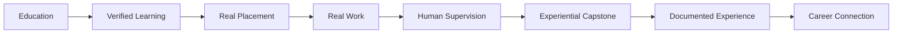

## Comparison Table

| **Purpose** | **Experiential Feature / Role / Benefit** | **RIAH Pathway Experiential** | **Traditional School of Law Experiential** | **Traditional School of Business Experiential** | **Traditional School of Technology Experiential** | **Traditional School of Homeland Security Experiential** | **Online AI-Agent Experiential Programs** | **Simulated / Project-Based Programs** |
|---|---|:---:|:---:|:---:|:---:|:---:|:---:|:---:|
| 💼 | **Actual real-world professional work** | ✅ | ✅ | ✅ | ✅ | ✅ | ❌ | ❌ |
| 🏗️ | **Work can contribute to actual organizational operations or deliverables** | ✅ | ✅ | ✅ | ✅ | ✅ | ❌ | ❌ |
| 🚫 | **Simulation cannot substitute for required Experiential work** | ✅ | ✅ | ✅ | ✅ | ✅ | ❌ | ❌ |
| 👔 | **Real human Manager** | ✅ | ✅ | ✅ | ✅ | ✅ | ❌ | ❌ |
| 👥 | **Real human professional Supervisor** | ✅ | ✅ | ✅ | ✅ | ✅ | ❌ | ❌ |
| 🔎 | **Dedicated real human Reviewer role** | ✅ | ❌ | ❌ | ❌ | ❌ | ❌ | ❌ |
| 🧑‍💼 | **Defined Manager + Supervisor + Reviewer structure** | ✅ | ❌ | ❌ | ❌ | ❌ | ❌ | ❌ |
| 🤖 | **AI cannot replace required human professional supervision** | ✅ | ✅ | ✅ | ✅ | ✅ | ❌ | ❌ |
| 🤝 | **Direct interaction with actual professionals** | ✅ | ✅ | ✅ | ✅ | ✅ | ❌ | ❌ |
| 👥 | **Participation on actual professional teams** | ✅ | ✅ | ✅ | ✅ | ✅ | ❌ | ❌ |
| 📅 | **Participation in actual professional meetings** | ✅ | ✅ | ✅ | ✅ | ✅ | ❌ | ❌ |
| 🧾 | **Applicable access to CPAs as real professionals** | ✅ | ❌ | ✅ | ❌ | ❌ | ❌ | ❌ |
| ⚖️ | **Applicable access to attorneys as real professionals** | ✅ | ✅ | ❌ | ❌ | ❌ | ❌ | ❌ |
| 🏛️ | **Applicable interaction with judges through approved placements** | ✅ | ✅ | ❌ | ❌ | ❌ | ❌ | ❌ |
| 💻 | **Applicable engineers and technology professionals** | ✅ | ❌ | ❌ | ✅ | ❌ | ❌ | ❌ |
| 🛡️ | **Applicable cybersecurity/security professionals** | ✅ | ❌ | ❌ | ✅ | ✅ | ❌ | ❌ |
| 👥 | **Approximately 120 dedicated internal Experiential Managers, Supervisors, and Reviewers at planned scale** | ✅ | ❌ | ❌ | ❌ | ❌ | ❌ | ❌ |
| 🌐 | **Approximately 225 real people throughout the planned ecosystem at scale** | ✅ | ❌ | ❌ | ❌ | ❌ | ❌ | ❌ |
| 🏢 | **Own internal multi-entity placement infrastructure** | ✅ | ❌ | ❌ | ❌ | ❌ | ❌ | ❌ |
| 🤝 | **External employer placement capability** | ✅ | ✅ | ✅ | ✅ | ✅ | ❌ | ❌ |
| 🏠 | **Not exclusively dependent on external employers for placement infrastructure** | ✅ | ❌ | ❌ | ❌ | ❌ | ❌ | ❌ |
| 📈 | **External capacity expandable through vetted employers** | ✅ | ✅ | ✅ | ✅ | ✅ | ❌ | ❌ |
| 👤 | **External placement requires actual people** | ✅ | ✅ | ✅ | ✅ | ✅ | ❌ | ❌ |
| 🧑‍🏫 | **External placement requires professional supervision** | ✅ | ✅ | ✅ | ✅ | ✅ | ❌ | ❌ |
| 📋 | **External placement requires actual assignments** | ✅ | ✅ | ✅ | ✅ | ✅ | ❌ | ❌ |
| 🏭 | **External placement requires work inside actual employer operations** | ✅ | ✅ | ✅ | ✅ | ✅ | ❌ | ❌ |
| 🏢 | **Can provide placement through its own operating ecosystem** | ✅ | ❌ | ❌ | ❌ | ❌ | ❌ | ❌ |
| ⚖️ | **Law-firm placements** | ✅ | ✅ | ❌ | ❌ | ❌ | ❌ | ❌ |
| 🏛️ | **Court placements** | ✅ | ✅ | ❌ | ❌ | ❌ | ❌ | ❌ |
| 🧾 | **CPA-firm placements** | ✅ | ❌ | ✅ | ❌ | ❌ | ❌ | ❌ |
| 💹 | **Finance/accounting employer placements** | ✅ | ❌ | ✅ | ❌ | ❌ | ❌ | ❌ |
| 🛡️ | **MSSP placements** | ✅ | ❌ | ❌ | ✅ | ✅ | ❌ | ❌ |
| 🔴 | **Authorized real red-team work through applicable placement** | ✅ | ❌ | ❌ | ✅ | ✅ | ❌ | ❌ |
| 🔵 | **Authorized real blue-team work through applicable placement** | ✅ | ❌ | ❌ | ✅ | ✅ | ❌ | ❌ |
| 🟣 | **Authorized real purple-team work through applicable placement** | ✅ | ❌ | ❌ | ✅ | ✅ | ❌ | ❌ |
| 🛡️ | **Real GRC work through applicable professional placement** | ✅ | ❌ | ✅ | ✅ | ✅ | ❌ | ❌ |
| 🔍 | **Real compliance and audit-support work through applicable placement** | ✅ | ❌ | ✅ | ✅ | ✅ | ❌ | ❌ |
| 💻 | **Development-firm placements** | ✅ | ❌ | ❌ | ✅ | ❌ | ❌ | ❌ |
| 🔐 | **Security-firm placements** | ✅ | ❌ | ❌ | ✅ | ✅ | ❌ | ❌ |
| ❤️ | **Nonprofit placements** | ✅ | ✅ | ✅ | ✅ | ✅ | ❌ | ❌ |
| 🚀 | **Startup placements** | ✅ | ❌ | ✅ | ✅ | ❌ | ❌ | ❌ |
| 🏪 | **Small-business placements** | ✅ | ❌ | ✅ | ✅ | ❌ | ❌ | ❌ |
| 🏙️ | **Corporate placements** | ✅ | ❌ | ✅ | ✅ | ✅ | ❌ | ❌ |
| 🏛️ | **Government-agency placements where permitted** | ✅ | ✅ | ✅ | ✅ | ✅ | ❌ | ❌ |
| 🌐 | **100% online supporting Experiential curriculum** | ✅ | ❌ | ❌ | ❌ | ❌ | ✅ | ✅ |
| 🔄 | **Online curriculum runs concurrently with required real applied placement work** | ✅ | ❌ | ❌ | ❌ | ❌ | ❌ | ❌ |
| 🧠 | **Formal learning integrated with applied professional experience** | ✅ | ✅ | ✅ | ✅ | ✅ | ✅ | ✅ |
| 📝 | **Weekly proctored Experiential assessments as a structural requirement** | ✅ | ❌ | ❌ | ❌ | ❌ | ❌ | ❌ |
| 🔎 | **Weekly assessment identifies student development needs** | ✅ | ❌ | ❌ | ❌ | ❌ | ✅ | ✅ |
| 🎯 | **Assessment can inform subsequent real-work assignments** | ✅ | ❌ | ❌ | ❌ | ❌ | ❌ | ❌ |
| 📊 | **Weekly planning with Manager + Supervisor + Reviewer** | ✅ | ❌ | ❌ | ❌ | ❌ | ❌ | ❌ |
| 📋 | **Applied assignments adjusted according to development needs** | ✅ | ❌ | ❌ | ❌ | ❌ | ❌ | ❌ |
| 📈 | **Documented professional performance** | ✅ | ✅ | ✅ | ✅ | ✅ | ✅ | ✅ |
| 💬 | **Feedback from actual workplace professionals** | ✅ | ✅ | ✅ | ✅ | ✅ | ❌ | ❌ |
| 🏗️ | **Consequential-work responsibilities formally documented** | ✅ | ❌ | ❌ | ❌ | ❌ | ❌ | ❌ |
| 📦 | **Operational deliverables documented** | ✅ | ✅ | ✅ | ✅ | ✅ | ❌ | ❌ |
| 📅 | **Weekly objectives and activity documented** | ✅ | ❌ | ❌ | ❌ | ❌ | ✅ | ✅ |
| 🏅 | **Professional competencies documented** | ✅ | ✅ | ✅ | ✅ | ✅ | ✅ | ✅ |
| 🌱 | **Apprentice — defined 1-month level** | ✅ | ❌ | ❌ | ❌ | ❌ | ❌ | ❌ |
| 🎓 | **Intern — defined 3-month level** | ✅ | ❌ | ❌ | ❌ | ❌ | ❌ | ❌ |
| 💼 | **Associate — defined 1-year Experiential level** | ✅ | ❌ | ❌ | ❌ | ❌ | ❌ | ❌ |
| 📈 | **Senior Associate — defined 1-year Experiential level** | ✅ | ❌ | ❌ | ❌ | ❌ | ❌ | ❌ |
| 👔 | **Manager — defined 1-year Experiential level** | ✅ | ❌ | ❌ | ❌ | ❌ | ❌ | ❌ |
| 👑 | **Executive — defined 1-year Experiential level** | ✅ | ❌ | ❌ | ❌ | ❌ | ❌ | ❌ |
| 🪜 | **Unified six-level Apprentice → Executive Experiential structure** | ✅ | ❌ | ❌ | ❌ | ❌ | ❌ | ❌ |
| ⏫ | **Verified prior experience can permit placement at a higher Experiential level** | ✅ | ✅ | ✅ | ✅ | ✅ | ✅ | ✅ |
| 🎓 | **Bachelor's Year-4 one-month Experiential guarantee for eligible students** | ✅ | ❌ | ❌ | ❌ | ❌ | ❌ | ❌ |
| 🎓 | **Master's/MBA eligible one-month guarantee framework** | ✅ | ❌ | ❌ | ❌ | ❌ | ❌ | ❌ |
| ⚖️ | **JD/Non-JD eligible one-month guarantee framework subject to applicable rules** | ✅ | ❌ | ❌ | ❌ | ❌ | ❌ | ❌ |
| 🏁 | **Guarantee tied to designated Milestones Guide requirement** | ✅ | ❌ | ❌ | ❌ | ❌ | ❌ | ❌ |
| 🏠 | **Remote placement capability** | ✅ | ✅ | ✅ | ✅ | ✅ | ✅ | ✅ |
| 🔄 | **Hybrid placement capability** | ✅ | ✅ | ✅ | ✅ | ✅ | ❌ | ❌ |
| 🏢 | **On-site placement capability** | ✅ | ✅ | ✅ | ✅ | ✅ | ❌ | ❌ |
| 🌍 | **International Online structure** | ✅ | ❌ | ❌ | ❌ | ❌ | ✅ | ✅ |
| 👥 | **International Online participant receives real human professional supervision** | ✅ | ❌ | ❌ | ❌ | ❌ | ❌ | ❌ |
| 🌎 | **International Online Experiential requires real work rather than simulation** | ✅ | ❌ | ❌ | ❌ | ❌ | ❌ | ❌ |
| 💵 | **Paid U.S. placement where terms and law permit** | ✅ | ✅ | ✅ | ✅ | ✅ | ❌ | ❌ |
| 📄 | **Unpaid U.S. placement where terms and law permit** | ✅ | ✅ | ✅ | ✅ | ✅ | ❌ | ❌ |
| 🧭 | **Standalone Experiential pathway** | ✅ | ❌ | ❌ | ❌ | ❌ | ✅ | ✅ |
| 🔗 | **Education + Experiential integration** | ✅ | ✅ | ✅ | ✅ | ✅ | ✅ | ✅ |
| 🎓 | **Bachelor's + Experiential integration** | ✅ | ❌ | ✅ | ✅ | ✅ | ❌ | ✅ |
| 🎓 | **Master's/MBA + Experiential integration** | ✅ | ❌ | ✅ | ✅ | ✅ | ❌ | ✅ |
| ⚖️ | **JD/Non-JD + Experiential architecture** | ✅ | ✅ | ❌ | ❌ | ❌ | ❌ | ❌ |
| 🏫 | **Potential college-credit structure** | ✅ | ✅ | ✅ | ✅ | ✅ | ❌ | ✅ |
| 1️⃣ | **Defined Apprentice potential credit structure — 1 credit** | ✅ | ❌ | ❌ | ❌ | ❌ | ❌ | ❌ |
| 3️⃣ | **Defined Intern potential credit structure — 3 credits** | ✅ | ❌ | ❌ | ❌ | ❌ | ❌ | ❌ |
| 6️⃣ | **Defined Associate–Executive potential credit structure — 6 credits per level** | ✅ | ❌ | ❌ | ❌ | ❌ | ❌ | ❌ |
| 📚 | **Experiential Collection included with Experiential curriculum** | ✅ | ❌ | ❌ | ❌ | ❌ | ❌ | ❌ |
| 🎓 | **Experiential Capstone Collection included with Experiential** | ✅ | ❌ | ❌ | ❌ | ❌ | ❌ | ❌ |
| 🧩 | **Experiential Capstone integrated into the Experiential curriculum** | ✅ | ❌ | ❌ | ❌ | ❌ | ❌ | ❌ |
| 👥 | **Experiential Capstone receives real human supervision** | ✅ | ❌ | ❌ | ❌ | ❌ | ❌ | ❌ |
| 🧑‍🏫 | **Capstone supervision provided in addition to supervision of applied Experiential work** | ✅ | ❌ | ❌ | ❌ | ❌ | ❌ | ❌ |
| 🧑‍⚖️ | **Human panel review of applicable Experiential Capstone** | ✅ | ❌ | ❌ | ❌ | ❌ | ❌ | ❌ |
| 🏢 | **Employer review/input for applicable Experiential Capstone** | ✅ | ❌ | ❌ | ❌ | ❌ | ❌ | ❌ |
| 🤝 | **Peer review/input for applicable Experiential Capstone** | ✅ | ❌ | ❌ | ❌ | ❌ | ❌ | ❌ |
| 👩‍🏫 | **Faculty/professional review for applicable Experiential Capstone** | ✅ | ❌ | ❌ | ❌ | ❌ | ❌ | ❌ |
| 🔎 | **Reviewer evaluation for applicable Experiential Capstone** | ✅ | ❌ | ❌ | ❌ | ❌ | ❌ | ❌ |
| 🔗 | **Experiential Capstone uses applicable review structures comparable to education pathway capstones** | ✅ | ❌ | ❌ | ❌ | ❌ | ❌ | ❌ |
| 📋 | **Capstone performance and completion documented within Experiential record** | ✅ | ❌ | ❌ | ❌ | ❌ | ❌ | ❌ |
| 📱 | **Own proprietary mobile application integrated into the ecosystem** | ✅ | ❌ | ❌ | ❌ | ❌ | ❌ | ❌ |
| 💻 | **Own proprietary software integrated into the ecosystem** | ✅ | ❌ | ❌ | ❌ | ❌ | ❌ | ❌ |
| 🔗 | **Proprietary application + software connected across education, Experiential, and ecosystem functions** | ✅ | ❌ | ❌ | ❌ | ❌ | ❌ | ❌ |
| 📕 | **Experiential textbook component** | ✅ | ❌ | ❌ | ❌ | ❌ | ❌ | ✅ |
| 📘 | **Experiential workbook component** | ✅ | ❌ | ❌ | ❌ | ❌ | ❌ | ✅ |
| 📓 | **Experiential journal component** | ✅ | ❌ | ❌ | ❌ | ❌ | ❌ | ✅ |
| 📅 | **Experiential planner component** | ✅ | ❌ | ❌ | ❌ | ❌ | ❌ | ✅ |
| 📚 | **Integrated physical and select digital educational products** | ✅ | ❌ | ❌ | ❌ | ❌ | ❌ | ✅ |
| 🛍️ | **Integrated textbooks, workbooks, journals, planners, review guides, study guides, and flashcards** | ✅ | ❌ | ❌ | ❌ | ❌ | ❌ | ✅ |
| 💻 | **LMS curriculum integrated into Experiential architecture** | ✅ | ❌ | ❌ | ❌ | ❌ | ✅ | ✅ |
| 🏅 | **Integrated professional Certification Review Courses** | ✅ | ❌ | ❌ | ❌ | ❌ | ❌ | ❌ |
| 💼 | **School of Business certification-review integration** | ✅ | ❌ | ❌ | ❌ | ❌ | ❌ | ❌ |
| 💻 | **School of Technology certification-review integration** | ✅ | ❌ | ❌ | ❌ | ❌ | ❌ | ❌ |
| 🛡️ | **School of Homeland Security certification-review integration** | ✅ | ❌ | ❌ | ❌ | ❌ | ❌ | ❌ |
| 📊 | **Project and Program Management certification-review integration** | ✅ | ❌ | ❌ | ❌ | ❌ | ❌ | ❌ |
| 🔐 | **Cybersecurity certification-review integration** | ✅ | ❌ | ❌ | ❌ | ❌ | ❌ | ❌ |
| ☁️ | **Microsoft Azure certification-review pathway integration** | ✅ | ❌ | ❌ | ❌ | ❌ | ❌ | ❌ |
| ⚖️ | **Integrated Bar Review** | ✅ | ❌ | ❌ | ❌ | ❌ | ❌ | ❌ |
| 🇺🇸 | **Bar Review structure covering all 50 states with applicable state module** | ✅ | ❌ | ❌ | ❌ | ❌ | ❌ | ❌ |
| ⚖️ | **Integrated California Baby Bar Review** | ✅ | ❌ | ❌ | ❌ | ❌ | ❌ | ❌ |
| 🧭 | **Mentoring integrated as an ecosystem service** | ✅ | ❌ | ❌ | ❌ | ❌ | ❌ | ❌ |
| 🗣️ | **Coaching integrated as an ecosystem service** | ✅ | ❌ | ❌ | ❌ | ❌ | ❌ | ❌ |
| 👥 | **Professional supervision available as an integrated service** | ✅ | ❌ | ❌ | ❌ | ❌ | ❌ | ❌ |
| 🔗 | **Products + services + education + Experiential integrated within one ecosystem** | ✅ | ❌ | ❌ | ❌ | ❌ | ❌ | ❌ |
| 🎯 | **Weekly learning objectives directly connected to real work** | ✅ | ✅ | ✅ | ✅ | ✅ | ❌ | ❌ |
| 📋 | **Weekly educational assignments connected to actual placement work** | ✅ | ✅ | ✅ | ✅ | ✅ | ❌ | ❌ |
| 🏗️ | **Real consequential work explicitly required alongside Experiential Collection** | ✅ | ❌ | ❌ | ❌ | ❌ | ❌ | ❌ |
| 🛡️ | **Governance and quality control before consequential work is released or implemented** | ✅ | ✅ | ✅ | ✅ | ✅ | ❌ | ❌ |
| ✍️ | **Student authority expressly limited for regulated/sign-off functions** | ✅ | ✅ | ✅ | ✅ | ✅ | ❌ | ❌ |
| ⚖️ | **Professional-scope restrictions incorporated into placement governance** | ✅ | ✅ | ✅ | ✅ | ✅ | ❌ | ❌ |
| 💰 | **Defined Apprentice Experiential tuition — $2,500** | ✅ | ❌ | ❌ | ❌ | ❌ | ❌ | ❌ |
| 💰 | **Defined Intern Experiential tuition — $5,000** | ✅ | ❌ | ❌ | ❌ | ❌ | ❌ | ❌ |
| 💰 | **Defined Associate–Executive Experiential tuition — $10,000 per level** | ✅ | ❌ | ❌ | ❌ | ❌ | ❌ | ❌ |
| 💳 | **Upfront Experiential payment option** | ✅ | ✅ | ✅ | ✅ | ✅ | ✅ | ✅ |
| 📆 | **Monthly Experiential payment option** | ✅ | ✅ | ✅ | ✅ | ✅ | ✅ | ✅ |
| 📚 | **Course-based broader education payment option where applicable** | ✅ | ✅ | ✅ | ✅ | ✅ | ❌ | ✅ |
| 🗓️ | **Semester payment structure where applicable** | ✅ | ✅ | ✅ | ✅ | ✅ | ❌ | ✅ |
| 🏦 | **Internal financing/loan pathway where applicable** | ✅ | ❌ | ❌ | ❌ | ❌ | ❌ | ❌ |
| 💸 | **Up to 50% tuition reimbursement for eligible tuition payments under applicable terms** | ✅ | ❌ | ❌ | ❌ | ❌ | ❌ | ❌ |
| 🎓 | **Guaranteed 10% tuition reimbursement upon graduation under applicable terms** | ✅ | ❌ | ❌ | ❌ | ❌ | ❌ | ❌ |
| 🧾 | **Combined eligible reimbursement architecture: up to 50% + guaranteed 10% at graduation** | ✅ | ❌ | ❌ | ❌ | ❌ | ❌ | ❌ |
| 💼 | **Documented professional experience** | ✅ | ✅ | ✅ | ✅ | ✅ | ❌ | ❌ |
| 🤝 | **Employer exposure through actual placement** | ✅ | ✅ | ✅ | ✅ | ✅ | ❌ | ❌ |
| 🚀 | **Career connection without falsely guaranteeing permanent employment** | ✅ | ✅ | ✅ | ✅ | ✅ | ✅ | ✅ |
| 🌐 | **Real work + human professionals + curriculum + assessment + placement + documentation in one defined architecture** | ✅ | ❌ | ❌ | ❌ | ❌ | ❌ | ❌ |
| 🎓 | **Experiential curriculum + Experiential Collection + supervised Experiential Capstone integrated with real work** | ✅ | ❌ | ❌ | ❌ | ❌ | ❌ | ❌ |
| 👥 | **Real-work supervision + separate applicable human capstone supervision and review** | ✅ | ❌ | ❌ | ❌ | ❌ | ❌ | ❌ |
| 📱 | **Proprietary technology + education + real work + human supervision integrated into one ecosystem** | ✅ | ❌ | ❌ | ❌ | ❌ | ❌ | ❌ |
| 🏅 | **Certification reviews + Bar Review + products + services integrated with the broader pathway** | ✅ | ❌ | ❌ | ❌ | ❌ | ❌ | ❌ |
| 🏢 | **Own internal placement infrastructure + scalable external placement network** | ✅ | ❌ | ❌ | ❌ | ❌ | ❌ | ❌ |
| 👑 | **Education + Experiential + collections + supervised capstone + proprietary technology + products + services + certification preparation + placement + pricing + payment + reimbursement integrated into the broader ecosystem** | ✅ | ❌ | ❌ | ❌ | ❌ | ❌ | ❌ |

# **I. 🧩 PURPOSE**

RIAH Pathway Experiential provides supervised, real-world professional learning through actual work, projects, assignments, deliverables, and professional review within the RIAH Pathway ecosystem or with approved employer and professional partners.

Experiential connects academic learning to applied professional experience while maintaining separate eligibility, placement, supervision, performance, legitimate, and recordkeeping standards.

Experiential includes **two placement types: Internal Placement and External Placement**.

These experiences are **not simulations, practice projects, hypothetical assignments, simulated workplaces, or disposable academic projects**. Students perform legitimate work for actual operational purposes within the RIAH Pathway ecosystem or with vetted and approved employer and professional partners.

Placement is based on the participant's **Experiential pathway, field, major, level, qualifications, placement type, placement availability, organizational needs, partner needs, capacity, supervision availability, and applicable placement requirements**.

# **II. 🏗️ EXPERIENTIAL ARCHITECTURE**

| Level | Duration | Baseline Eligibility | Placement Focus |
|---|---:|---|---|
| **Apprentice** | **1 Month** | Little to no experience; some or no prior knowledge in the selected field or major | Entry-level supervised exposure and foundational real-world work |
| **Intern** | **3 Months** | Little to no professional experience; some applicable coursework completed | Supervised applied work aligned to coursework and field |
| **Associate** | **1 Year** | Some applicable experience and required prerequisites completed | Sustained professional work with increasing independent responsibility |
| **Senior Associate** | **1 Year** | At least one year of applicable experience and required prerequisites completed | Advanced professional work, review, collaboration, and increased responsibility |
| **Manager** | **1 Year** | Senior Associate-level experience and required prerequisites completed | Management-level work, coordination, review, and leadership responsibilities |
| **Executive** | **1 Year** | At least one year of Manager-level experience and required prerequisites completed | Executive-level strategy, leadership, oversight, and professional application |

Eligibility for a level does not guarantee a particular placement. RIAH verifies prerequisites, experience, capacity, placement fit, supervision availability, and partner requirements before assignment.

# **III. 🌐 EXPERIENTIAL DELIVERY**

| Student or Participant | Delivery |
|---|---|
| **United States Student** | Remote, hybrid, or on-site depending on placement |
| **International Online Student residing outside the United States** | Remote only |
| **Internal RIAH Placement** | Remote, hybrid, or on-site where applicable |
| **Employer or Professional Partner Placement** | Remote, hybrid, or on-site where applicable and permitted |

United States students may participate in paid or unpaid Experiential placements depending on the placement, employer, applicable law, and written placement terms.

International Online Students residing outside the United States participate remotely and are limited by RIAH policy to unpaid Experiential placements. RIAH does not use the International Online Experiential pathway as U.S. employment or U.S. visa sponsorship. The student's country-of-residence requirements and the legal classification of the activity must still be reviewed before placement.

# **IV. 🏢 INTERNAL PLACEMENT**

Internal Placement provides opportunities throughout eligible **RIAH Pathway ecosystem entities** where legitimate work opportunities are available.

Students perform actual work under the guidance, supervision, management, and review of **internal professionals and Experiential professionals**.

## **Internal Experiential Staffing and Concurrent Curriculum**

Internal Experiential placements are supported by approximately **120 Experiential faculty and professionals serving as Managers, Supervisors, and Reviewers**, with additional support for external placement through approved partner employers. These are **real people and real professionals**, including applicable CPAs, attorneys, judges, engineers, and other qualified professionals.

All Experiential students complete a **100% online Experiential curriculum concurrently with their real applied Experiential work**. The curriculum covers the Experiential knowledge and concepts students should be learning or have learned while they perform their assigned work.

Students complete **weekly proctored assessments** within the Experiential curriculum. Students have flexibility within the applicable weekly period to complete the assessment. Assessment results help identify areas in which a student may need additional support and help inform the types of assignments or applied work in which the student should receive additional development.

Each week, students work with their **Manager, Supervisor, and Reviewer** to develop and review their performance plan, assignments, applied work, development needs, and applicable performance expectations.

## **Internal Placement Entities**

### **Internal Placement Entity Structure**

| Internal Placement Entity | Placement Entity |
|---|---|
| RIAH Pathway | **RIAH Pathway** |
| RIAH Pathway Holdings Corporation | **RIAH Pathway Holdings Corporation** |
| RIAH Pathway Corporation | **RIAH Pathway Corporation** |
| RIAH Pathway Professional Services LLP | Student-Centered • Not External Client Services |
| RIAH Pathway School of Business, | **RIAH Pathway School of Business, Homeland Security, Law, and Technology LLC** |
| RIAH Pathway Technology LLC | **RIAH Pathway Technology LLC** |
| RIAH Pathway Programs LLC | **RIAH Pathway Programs LLC** |
| RIAH Pathway Products LLC | **RIAH Pathway Products LLC** |
| RIAH Pathway 501(c)(3) Foundation | **RIAH Pathway 501(c)(3) Foundation** |

## **RIAH Pathway Professional Services LLP**

The **RIAH Pathway Professional Services LLP is student-centered and serves the RIAH Pathway ecosystem**. It does **not provide professional services to external clients**.

Services are provided internally throughout the RIAH Pathway ecosystem by students working with **internal professionals and Experiential professionals** through internal placements. Students may also complete external placements with **vetted employer partners**.

Students preparing for careers in public accounting, accounting, consulting, cybersecurity, technology, and other professional-service fields may gain applicable real-work experience internally before or alongside opportunities with external employers or client-serving firms.

## **Internal Placement Types**

### **Single-Area Assignments**

Students work within one professional or functional area and develop experience throughout that area. For example, a student assigned to accounting may perform work across audit, compliance, and other applicable accounting functions and responsibilities.

### **Rotational Placements**

Selected students may rotate through applicable functions, departments, professional areas, or ecosystem entities to develop broader experience.

Internal placements involve **actual work that contributes directly to the operations and needs of the RIAH Pathway ecosystem**.

# **V. 🤝 EXTERNAL PLACEMENT**

External Placement provides opportunities with **vetted employers, partners, and organizations** aligned with the participant's field, major, Experiential pathway, Experiential level, qualifications, and placement requirements.

RIAH vets external employers and Experiential partners to help verify that participating organizations are legitimate and provide legitimate real-work experiences where participants can **learn, contribute, perform actual work, and see the results of their contributions**.

External Experiential placements must involve **actual work rather than simulations, practice projects, or hypothetical assignments**.

## **Scalable External Partner Placement Structure**

External placement capacity is designed to be **scalable and not limited to the internal Experiential staffing model**. RIAH leverages numerous approved external partners and integrates their applicable people and professional environments into the RIAH Experiential ecosystem so students can be deployed into **actual real-work environments with real people, real professional teams, and real entities**. Examples include law firms, CPA firms, MSSPs, development firms, security firms, corporations, government agencies, and other approved professional organizations.

Approved external partners integrate their **actual employees and professionals into the RIAH Experiential ecosystem** for applicable external placements. This allows RIAH to deploy students into **actual work environments with real people, real professional teams, and real entities**. External placements must include **real people, real professional supervision, real assignments, and actual work** within the partner employer's business.

RIAH's vetting requirement for external partners requires that the placement provide actual professional personnel, actual work, appropriate assignments, and applicable supervision for students. The partner's applicable people and professional environment become part of the student's external RIAH Experiential placement structure, allowing students to work with real professionals, real teams, and real entities just as internal students work with real RIAH Experiential Managers, Supervisors, Reviewers, and other qualified professionals.

## **External Placement Opportunities**

### **External Placement Partner and Employer Opportunities**

| Partner or Employer Type | External Placement Opportunity |
|---|---|
| Professional Partners | Vetted professional employers and organizations where students perform real work with real professionals, real assignments, supervision, meetings, teams, deliverables, and placement responsibilities aligned to the student's field and Experiential level. |
| Educational Partners | Vetted educational institutions and education-related organizations where students may support real academic, administrative, technology, business, legal, research, program, project, or operational work under qualified professional supervision. |
| Law Firms | Vetted law firms where eligible students may perform legally permitted supervised work involving real matters, legal research, documentation, case support, law-office operations, compliance, and other assignments within the student's permitted scope under attorneys and other qualified legal professionals. |
| Courts | Vetted court environments where eligible students may complete legally permitted supervised assignments involving court operations, legal research, documentation, case-related support, administrative processes, and other approved work with judges, attorneys, court personnel, or other qualified professionals. |
| CPA Firms | Vetted CPA and accounting firms where students may perform supervised real work involving accounting, audit support, tax support where permitted, reconciliations, financial analysis, internal controls, compliance, reporting, month-end processes, and other accounting assignments with CPAs and accounting professionals. |
| MSSPs | Vetted Managed Security Service Providers where students may perform authorized supervised cybersecurity work such as red-team, blue-team, and purple-team activities; security monitoring; vulnerability and control work; governance, risk, and compliance activities; compliance audits and audit support; security documentation; incident-related support; and other real cybersecurity assignments within the student's authorized scope. |
| Development Firms | Vetted software, application, and technology development firms where students may contribute to real development, testing, documentation, integrations, databases, applications, software, implementation, deployment preparation, maintenance, and other production-oriented technology work with professional development teams. |
| Security Firms | Vetted cybersecurity, information-security, physical-security, or related firms where students may support real authorized security assessments, monitoring, controls, risk activities, compliance, documentation, investigations support where permitted, and other supervised security work. |
| Nonprofits | Vetted nonprofit organizations where students may perform real operational, accounting, finance, technology, cybersecurity, legal, compliance, project, program, research, marketing, fundraising-support, or other mission-related assignments with actual nonprofit teams and professionals. |
| Startups | Vetted startup employers where students may work on real business, technology, cybersecurity, finance, accounting, operations, project, program, legal, compliance, product, research, marketing, or implementation assignments as part of actual startup teams. |
| Small Businesses | Vetted small-business employers where students may perform real assignments supporting business operations, accounting, finance, technology, cybersecurity, projects, programs, legal and compliance functions where permitted, marketing, process improvement, and other actual business needs. |
| Entrepreneurial Organizations | Vetted entrepreneurial organizations where students may support real venture development, business operations, financial planning, technology, product development, project execution, research, market analysis, compliance, and other assignments tied to actual organizational objectives. |
| Corporations | Vetted corporate employers where students may join actual teams and perform supervised real work within applicable departments such as accounting, finance, technology, cybersecurity, operations, project and program management, legal, compliance, research, and other aligned professional functions. |
| Government Agencies | Vetted government agencies where eligible students may perform legally permitted and authorized supervised work involving administration, technology, cybersecurity, governance, risk, compliance, intelligence support where permitted, project and program work, financial functions, research, or other approved public-sector assignments. |
| Other approved employers and professional organizations | Other RIAH-vetted employers and professional organizations that can provide real work, real people, real professional supervision, real assignments, actual team participation, and an appropriate placement environment aligned to the student's field, level, qualifications, and applicable requirements. |

Students may work directly with professionals and employers including **CPAs, attorneys, judges, cybersecurity and technology professionals, nonprofits, startups, professional firms, corporations, and other vetted organizations**.

# **VI. 🌍 INTERNATIONAL ONLINE EXPERIENTIAL**

International Online Students are eligible to apply for RIAH Experiential.

Requirements:

1. Student remains physically outside the United States during the International Online Experiential placement.
2. Placement is remote.
3. Placement is unpaid under the RIAH International Online Experiential policy.
4. Work is supervised by applicable industry professionals.
5. Work is aligned to the student's field, major, pathway, or approved professional-development objective.
6. Placement may occur internally within the RIAH ecosystem or with an approved partner.
7. RIAH documents assignments, supervision, deliverables, performance, and completion.
8. Country-of-residence requirements and partner requirements apply.
9. Participation does not constitute U.S. visa sponsorship.
10. If a student is physically present in the United States, RIAH must separately review the student's immigration and work-authorization status before any work-based placement.

# **VII. 🛡️ CONSEQUENTIAL REAL-WORLD WORK STANDARD**

All RIAH Experiential placements are based on real and **actual consequential work**. Experiential is not a simulation, artificial exercise, mock workplace, practice company, or disposable academic project.

Consequential work means the participant performs real work for an actual operational purpose within the RIAH Pathway ecosystem or for an approved employer or professional partner. The work is intended to be used, implemented, reviewed, relied upon, moved into development or production, incorporated into operations, or otherwise contribute to a real organizational objective.

A participant is therefore working in the applicable field in the same practical context in which that work would be performed for an employer, subject to the participant's level, authorization, supervision, and applicable professional requirements.

Examples include:

### **Consequential Real-World Work by Professional Field**

| Professional Field | Actual Consequential Work |
|---|---|
| Accounting participants performing work supporting | Accounting participants performing work supporting actual month-end close, budgeting, financial analysis, audit support, internal controls, compliance, reconciliations, reporting, or other accounting functions. |
| Technology participants developing, testing, documenting, | Technology participants developing, testing, documenting, securing, maintaining, or supporting actual applications, software, systems, infrastructure, databases, integrations, automations, or technology used by RIAH or an approved partner. |
| Cybersecurity participants performing authorized security, | Cybersecurity participants performing authorized security, governance, risk, compliance, monitoring, documentation, control, or related work on actual organizational systems and processes within their permitted scope. |
| Business participants performing actual operations, | Business participants performing actual operations, finance, management, entrepreneurship, research, analysis, process improvement, marketing, or business-development work. |
| Project and program management participants | Project and program management participants coordinating actual initiatives, schedules, requirements, deliverables, risks, dependencies, resources, and implementation. |
| Legal participants performing actual legally | Legal participants performing actual legally permitted supervised legal work for real matters, operations, research, documentation, or qualifying placements within the limits of applicable law and professional supervision. |
| Homeland Security participants performing legally | Homeland Security participants performing legally permitted governance, risk, compliance, intelligence, physical-security, investigative-support, or related operational work within their authorized scope. |
| Other participants performing actual work | Other participants performing actual work aligned to their approved field, major, pathway, placement, and Experiential level. |

The fact that a participant is learning does not make the work simulated. Participant work may contain mistakes or require revision, just as work performed by developing professionals may require correction. RIAH uses governance, supervision, management, review, quality control, risk controls, and applicable compliance procedures so work is reviewed before it is approved, relied upon, released, implemented, filed, published, deployed, or moved into production when review is required.

Experiential Supervisors, Managers, Reviewers, faculty, industry professionals, and applicable licensed or authorized professionals are responsible for the level of review appropriate to the work. A participant may not independently approve, release, certify, sign, file, deploy, or perform work requiring authority, licensure, clearance, or credentials the participant does not possess.

Students may not perform work requiring a professional license, legal authorization, security clearance, or other credential unless the work and supervision comply with the applicable requirements.

# **VIII. ✅ ONE-MONTH EXPERIENTIAL GUARANTEE**

RIAH guarantees eligible education pathway students in the **Bachelor's, Master's, MBA, JD, or Non-JD programs only** the opportunity to apply for and receive one month of Experiential, subject to applicable rules and eligibility requirements. Participation in an eligible education pathway does not automatically qualify a student for the guarantee.

| Rule | Standard |
|---|---|
| **Length** | **1 Month** |
| **Eligible Education Pathways** | **Bachelor's, Master's, MBA, JD, and Non-JD programs only** |
| **Not Eligible for Guarantee** | **Minor, High School, and GED programs** |
| **Bachelor's Eligibility Period** | **Year 4 only** |
| **Master's and MBA Eligibility Period** | **Throughout the program, depending on when the student is placed; eligible students retain the one-month guarantee if they are not otherwise placed, subject to applicable rules and eligibility requirements** |
| **JD and Non-JD Eligibility Period** | **Subject to applicable program rules, placement timing, and eligibility requirements** |
| **Application** | Required |
| **Eligibility** | Subject to applicable rules and eligibility requirements, including completion of the applicable milestone identified in the Milestones Guide for the one-month Experiential guarantee; not automatic based solely on participation in an eligible education pathway |
| **Placement Source** | RIAH ecosystem or approved employer or professional partner |
| **Placement Basis** | Current needs, available work, student qualifications, field alignment, supervision, and placement capacity |
| **Work Type** | Real-world supervised work |
| **Compensation** | Paid or unpaid for eligible U.S. placements depending on placement terms and applicable law |
| **International Online Student** | Remote and unpaid under RIAH policy |
| **Guaranteed Item** | One-month Experiential opportunity for an eligible student who satisfies the applicable rules and eligibility requirements and completes the applicable milestone identified in the Milestones Guide for the one-month Experiential guarantee |
| **Not Guaranteed** | Specific employer, specific job, specific project, paid status, location, or permanent employment |

The one-month guarantee does not guarantee employment after completion.

# **IX. 🧭 EXPERIENTIAL APPLICATION AND PLACEMENT PROCEDURE**

## **Flow 1A — Student Request and Application**

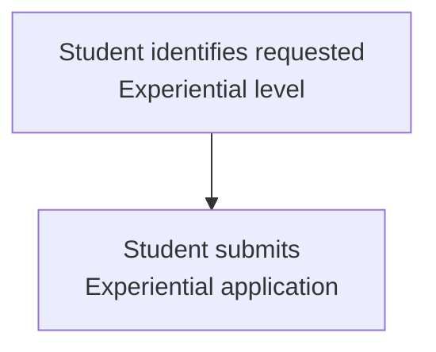

## **Flow 1B — Eligibility Verification**

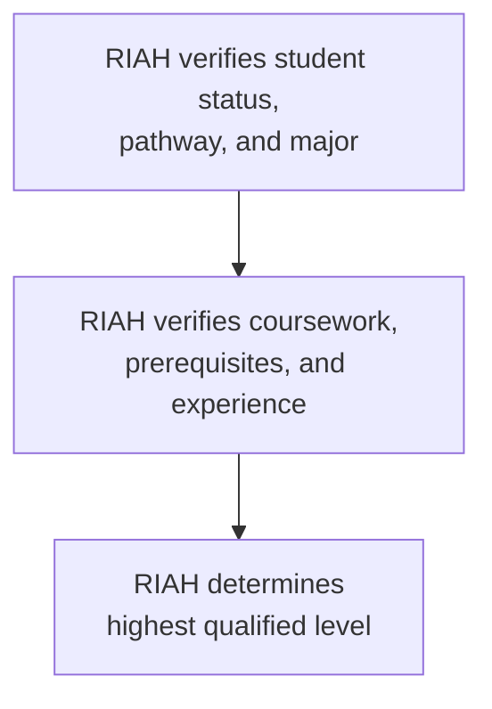

## **Flow 2A — Placement Review**

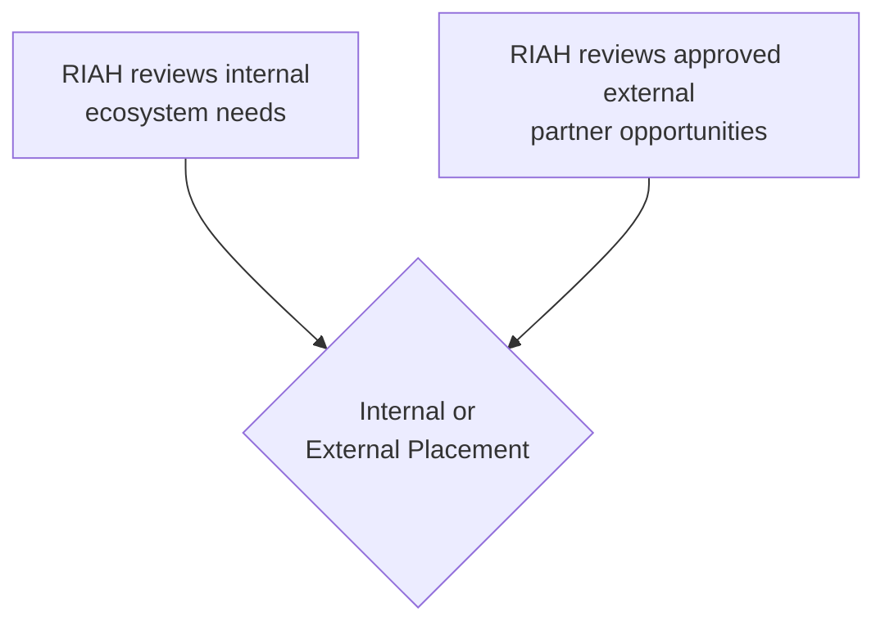

## **Flow 2B — Placement Matching**

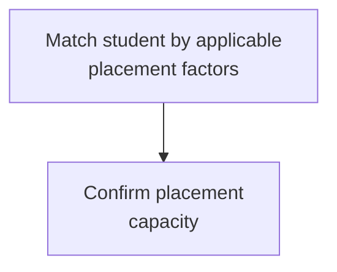

## **Flow 2C — Placement Terms**

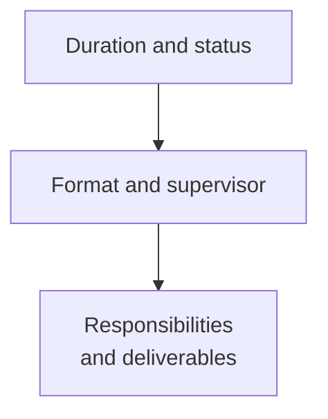

## **Flow 3A — Orientation and Real-World Work**

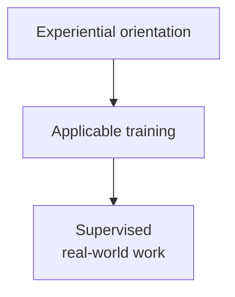

## **Flow 3B — Performance and Requirements**

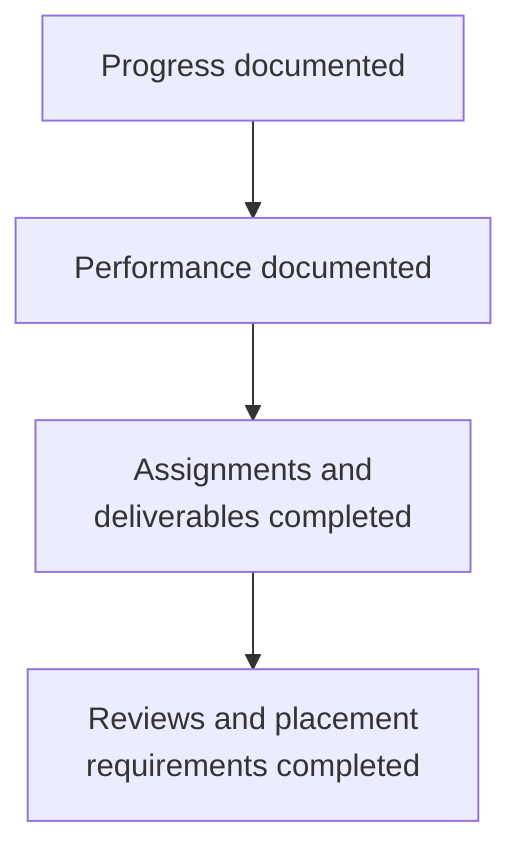

## **Flow 3C — Completion Record**

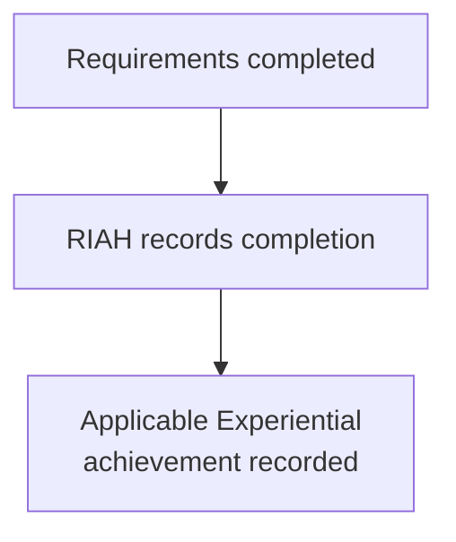

## **Placement Flow — Qualification**

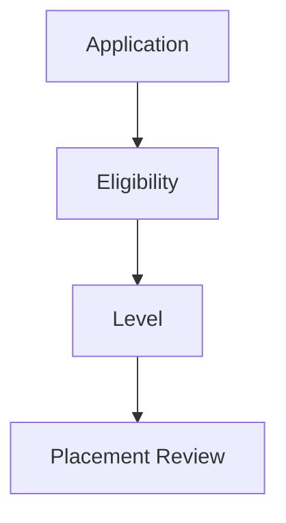

## **Placement Flow — Placement Type**

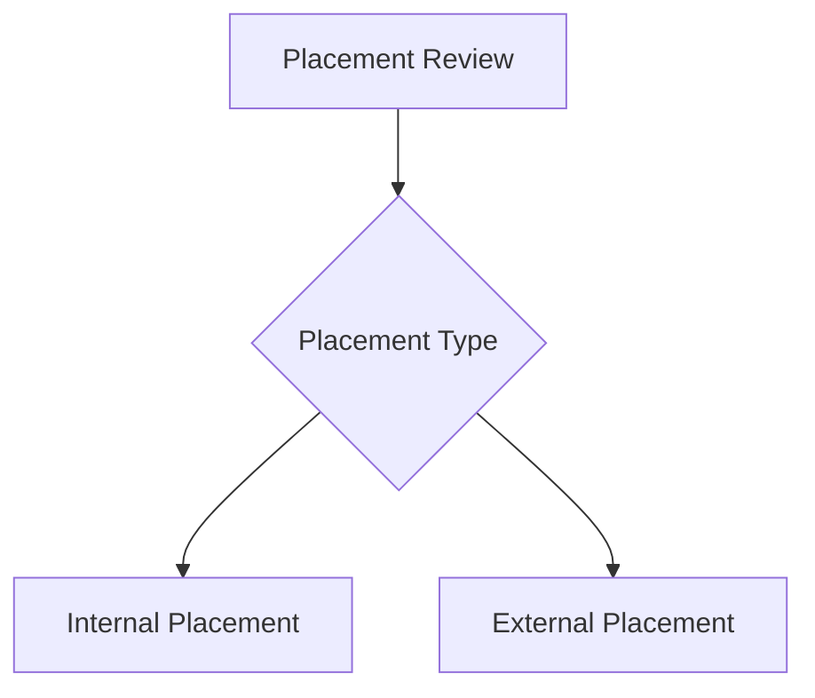

## **Placement Source Flow**

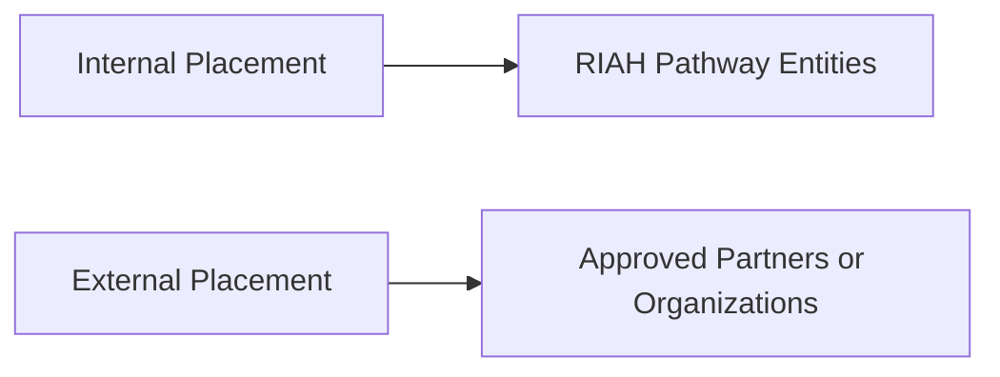

## **Placement Completion Flow — Start**

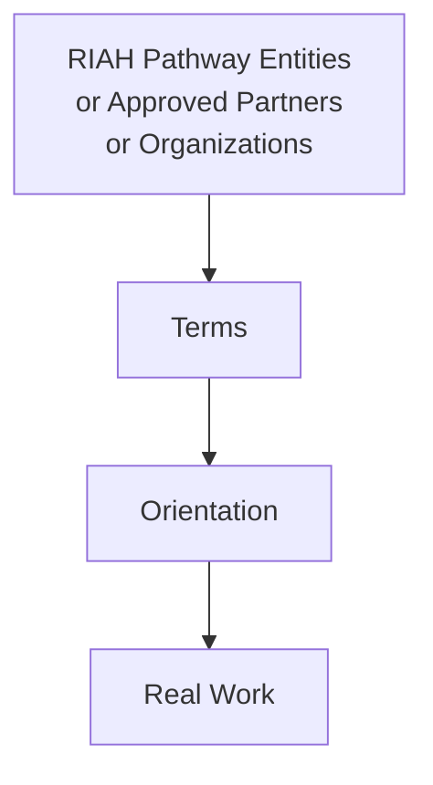

## **Placement Completion Flow — Review**

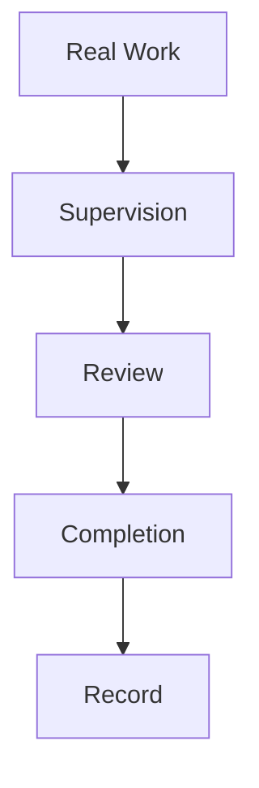

# **X. 🧭 PLACEMENT SELECTION**

Experiential placement is capacity-based.

Where demand exceeds capacity, RIAH may use an approved blind-selection process.

Where capacity is available, placements may use first-come, first-served processing after eligibility verification.

Placement decisions may consider:

### **Experiential Placement Selection Factors**

| Selection Factor | Placement Consideration |
|---|---|
| Experiential level | Experiential level |
| Major and field | Major and field |
| Completed prerequisites | Completed prerequisites |
| Prior experience | Prior experience |
| Applicable coursework | Applicable coursework |
| Skills | Skills |
| Placement requirements | Placement requirements |
| Delivery format | Delivery format |
| Schedule | Schedule |
| Professional supervision | Professional supervision |
| Internal ecosystem needs | Internal ecosystem needs |
| Partner needs | Partner needs |
| Available capacity | Available capacity |

Identity characteristics unrelated to placement qualifications are not used as placement-selection criteria.

# **XI. 👥 SUPERVISION AND REVIEW**

Experiential may use:

### **Experiential Supervision and Review Resources**

| Professional Resource | Supervision and Review Resource |
|---|---|
| Experiential Supervisors | Experiential Supervisors |
| Experiential Managers | Experiential Managers |
| Experiential Reviewers | Experiential Reviewers |
| Faculty | Faculty |
| Adjunct Faculty | Adjunct Faculty |
| Industry Professionals | Industry Professionals |
| Attorneys | Attorneys |
| Judges | Judges |
| Law Firms | Law Firms |
| Courts | Courts |
| CPA Firms | CPA Firms |
| Cybersecurity Firms | Cybersecurity Firms |
| Technology Firms | Technology Firms |
| Business Professionals | Business Professionals |
| Employer Partners | Employer Partners |
| Other approved professional partners | Other approved professional partners |

The applicable professional supervises work within their permitted professional scope.

RIAH maintains applicable placement, assignment, performance, review, and completion records.

## **Experiential Leadership — 12 People**

Experiential Leadership includes:

### **Experiential Leadership Staffing**

| Leadership Role | Staffing Level |
|---|---|
| Directors | 4 |
| Project Managers | 4 |
| Program Managers | 4 |

Experiential Leadership is structured across:

| School | Director | Project Manager | Program Manager |
|---|---:|---:|---:|
| **School of Business** | 1 | 1 | 1 |
| **School of Technology** | 1 | 1 | 1 |
| **School of Homeland Security** | 1 | 1 | 1 |
| **School of Law** | 1 | 1 | 1 |

**Directors** oversee the school's Experiential operations and connection to its academic programs.

**Project Managers** manage Experiential projects, assignments, schedules, deliverables, Supervisors, Reviewers, faculty coordination, and student project execution.

**Program Managers** manage Experiential programs, placements, participants, schedules, Supervisors, Reviewers, faculty coordination, and program delivery.

Directors, Project Managers, and Program Managers work directly with **Academic Faculty** so Experiential programs, projects, placements, assignments, supervision, evaluations, and professional experiences connect with the educational programs and curriculum.

## **Experiential Professionals — 120 People**

Experiential Professionals include:

### **Experiential Professional Staffing**

| Experiential Role | Internal Staffing Level |
|---|---|
| Supervisors | 40 |
| Managers | 40 |
| Reviewers | 40 |

Experiential Professionals operate across:

**Business • Technology • Homeland Security • Law**

**Supervisors** oversee students' applied work.

**Managers** manage Experiential operations, assignments, teams, and deliverables.

**Reviewers** independently evaluate student work, performance, competencies, projects, and outcomes.

Supervisors, Managers, and Reviewers coordinate with **Experiential Leadership and Academic Faculty** to connect professional experience to education.

## **Real-Person Experiential Staffing and Work Environment**

At scale, the RIAH Pathway ecosystem is designed to include approximately **225 real people** across the entire ecosystem, including **Experiential Professionals, PhD-qualified faculty, adjunct faculty, the Executive Board of Governance, Experiential Leadership, and other ecosystem roles**.

All Experiential placements include **real Managers, Supervisors, and Reviewers**. Experiential Managers, Supervisors, and Reviewers are **actual people and professionals, not AI or AI agents**.

Students interact directly with **actual people and actual professionals** applicable to their placement and field, including attorneys, judges, CPAs, engineers, and other qualified professionals. Students do not interact with AI or AI agents as a substitute for the real professional supervision, management, review, team participation, and professional interaction required within Experiential.

Students participate on **actual teams**, attend **actual meetings**, and perform **actual real-world work** in the same practical professional environment in which work is performed within other companies and professional organizations, subject to the student's level, authorization, supervision, placement, and applicable requirements.

Experiential work is actual work being used or moved through **development, production, implementation, integration, operations, or other real organizational purposes** throughout the RIAH Pathway ecosystem or within an approved partner employer's actual business.

# **XII. 🧭 EXPERIENTIAL LEVELS**

Experiential levels are separate placement levels and are not automatic promotions or progression levels.

Students may be placed at **Apprentice, Intern, Associate, Senior Associate, Manager, or Executive** based on the applicable RIAH requirements, prerequisites, verified experience, qualifications, readiness, placement fit, supervision availability, and other applicable eligibility requirements.

A student does not have to begin at Apprentice when the student already qualifies for a higher level. Placement at one Experiential level does not automatically move the student to another level.

A student who completes an Experiential level may choose to apply and pay for an additional Experiential level. The student must independently satisfy the applicable requirements for that additional level before placement.

The flow below shows how the Experiential levels connect within the overall structure. It does not represent automatic progression.

## **Experiential Level Flow — Entry**

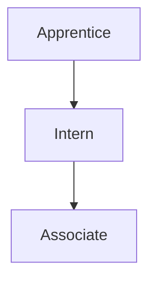

## **Experiential Level Flow — Advanced**

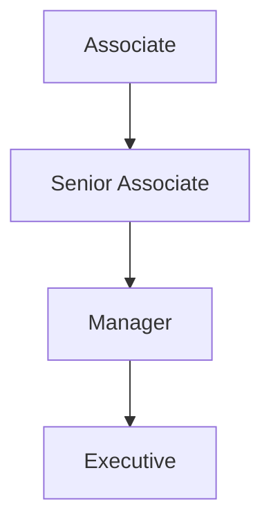

# **XIII. 📚 EXPERIENTIAL CURRICULUM AND COLLECTIONS**

Each level maintains its own Experiential curriculum and collection.

| Level | Collection |
|---|---|
| Apprentice | Apprentice Experiential Collection |
| Intern | Intern Experiential Collection |
| Associate | Associate Experiential Collection |
| Senior Associate | Senior Associate Experiential Collection |
| Manager | Manager Experiential Collection |
| Executive | Executive Experiential Collection |

The standard Experiential Collection may include:

### **Experiential Curriculum and Collection Components**

| Curriculum Component | Experiential Education Component |
|---|---|
| Experiential Textbook | Experiential Textbook |
| Experiential Workbook | Experiential Workbook |
| Experiential Journal | Experiential Journal |
| Experiential Planner | Experiential Planner |
| LMS Learning Courses | LMS Learning Courses |
| Weekly Objectives | Weekly Objectives |
| Weekly Assignments | Weekly Assignments |
| Weekly Performance Assessments | Weekly Performance Assessments |
| Real-World Consequential Work Experience | Real-World Consequential Work Experience |
| Applicable supporting educational resources | Applicable supporting educational resources |

The education component is attached directly to the participant's real-world Experiential work. Participants learn the applicable concepts, standards, methods, governance, risk, compliance, and professional practices while applying them to actual work.

Weekly objectives identify what the participant is expected to learn, apply, demonstrate, or improve through the work performed that week. Weekly assignments and performance assessments evaluate the participant based on the content and competencies the participant should have learned through that actual experience.

The educational collection supports the work; it does not replace the work with simulations. RIAH Experiential combines education with actual applied paid or unpaid work, as applicable, under industry-professional supervision.

The standard Experiential Collection follows the applicable product and curriculum structure established for the participant's level. Additional textbooks, workbooks, journals, planners, review materials, study materials, flashcards, learning resources, or other collection components may be included where established for the applicable Experiential curriculum.

# **XIV. 💰 EXPERIENTIAL PRICING**

Experiential participants have two tuition payment options:

1. **Upfront** — Pay the total Experiential tuition before the applicable payment deadline.
2. **Monthly** — Divide the total Experiential tuition across the standard duration of the selected Experiential level.

| Level | Duration | Total Experiential Tuition | Upfront Option | Monthly Option |
|---|---:|---:|---:|---:|
| Apprentice | **1 Month** | **$2,500** | **$2,500** | **$2,500 for 1 month** |
| Intern | **3 Months** | **$5,000** | **$5,000** | **$1,666.67 per month for 3 months*** |
| Associate | **12 Months** | **$10,000** | **$10,000** | **$833.33 per month for 12 months*** |
| Senior Associate | **12 Months** | **$10,000** | **$10,000** | **$833.33 per month for 12 months*** |
| Manager | **12 Months** | **$10,000** | **$10,000** | **$833.33 per month for 12 months*** |
| Executive | **12 Months** | **$10,000** | **$10,000** | **$833.33 per month for 12 months*** |

*Monthly amounts are the total tuition divided by the Experiential duration. Where division creates a rounding difference, the final payment is adjusted so total payments equal the stated Experiential tuition.

### Experiential Education Collection Deposit

Each Experiential level also has its applicable deposit associated with the Experiential education collection and materials.

The deposit supports the applicable collection components established for the participant's level, which may include:

### **Experiential Education Collection Components**

| Collection Component | Included Education Material |
|---|---|
| Experiential Textbook | Experiential Textbook |
| Experiential Workbook | Experiential Workbook |
| Experiential Journal | Experiential Journal |
| Experiential Planner | Experiential Planner |
| Review materials where applicable | Review materials where applicable |
| Study materials where applicable | Study materials where applicable |
| Flashcards where applicable | Flashcards where applicable |
| LMS learning materials | LMS learning materials |
| Other applicable Experiential education collection | Other applicable Experiential education collection components |

The applicable deposit amount is controlled by the RIAH Pathway Master Pricing Data Sheet and Pricing Engine and is separate from the Experiential tuition amounts shown above unless the controlling pricing documentation states otherwise.

Current Experiential tuition, deposits, and pricing remain controlled by the RIAH Pathway Master Pricing Data Sheet and Pricing Engine.

# **XV. 📚 EXPERIENTIAL AND EDUCATION INTEGRATION**

Experiential may operate as:

### **Experiential and Education Integration Formats**

| Integration Format | Experiential Pathway Application |
|---|---|
| A standalone Experiential pathway | A standalone Experiential pathway |
| An integrated Education and Experiential | An integrated Education and Experiential pathway |
| A final-year one-month guaranteed Experiential | A final-year one-month guaranteed Experiential opportunity |
| An applicable component of a | An applicable component of a law pathway |
| A partner placement | A partner placement |
| An internal RIAH ecosystem placement | An internal RIAH ecosystem placement |

Academic curriculum and Experiential work remain separately documented where applicable.

# **XVI. 📚 EXPERIENTIAL COLLEGE CREDIT STRUCTURE**

RIAH Pathway assigns the following experiential credit-hour values to the Experiential levels for applicable college-enrollment, cost-of-attendance, and coursework-agreement purposes:

| Experiential Level | Experiential Credit Hours |
|---|---:|
| **Apprentice** | **1 Credit Hour** |
| **Intern** | **3 Credit Hours** |
| **Associate** | **6 Credit Hours** |
| **Senior Associate** | **6 Credit Hours** |
| **Manager** | **6 Credit Hours** |
| **Executive** | **6 Credit Hours** |

For students completing RIAH Pathway Experiential through an applicable **cost-of-attendance arrangement or coursework agreement**, including applicable arrangements after RIAH Pathway obtains accreditation, the documented Experiential credit hours may be submitted to or recognized by the student's college or university for college credit.

Subject to the receiving college or university's policies, academic requirements, transfer or experiential-learning rules, and approval, the Experiential credit hours may be applied toward an **internship requirement, cooperative education or co-op requirement, experiential-learning requirement, or elective course credit**.

RIAH Pathway documents the applicable Experiential level, duration, supervised work, learning objectives, assignments, deliverables, performance assessments, completion, and assigned Experiential credit hours to support institutional review.

The receiving college or university retains authority over whether and how RIAH Pathway Experiential credit is accepted, transferred, converted, or applied to the student's academic program. RIAH Pathway does not guarantee acceptance by another institution unless acceptance is established through an applicable written articulation, coursework, cost-of-attendance, transfer, or institutional agreement.

# **XVII. 🏫 SCHOOL ALIGNMENT**

Experiential opportunities may align to:

| School | Applicable Areas |
|---|---|
| School of Business | Accounting, finance, business management, entrepreneurship, and related business areas |
| School of Technology | Cybersecurity, computer science, data analytics, data science, software development, software engineering, project management, program management, and related technology areas |
| School of Law | JD, Non-JD, criminal justice, legal research, law-office experience, and other legally permitted supervised legal work |
| School of Homeland Security | Governance, risk and compliance, intelligence, physical security, private investigations, and other legally permitted homeland-security areas |

# **XVIII. ⚖️ NON-JD LAW EXPERIENTIAL STRUCTURE**

RIAH's current Non-JD structure contains seven state pathways.

| State | Non-JD Length | RIAH Experiential Status | One-Month Internal Experiential |
|---|---:|---|---|
| **Maine** | **1 Year** | Eligible; capacity-based | **Guaranteed during the pathway year** |
| **California** | **4 Years** | Eligible beginning 1L; capacity-based | **Guaranteed during 4L** |
| **Washington** | **4 Years** | Separate RIAH Experiential is ineligible because qualifying paid law-clerk work experience is integrated into the state pathway | **Ineligible** |
| **Vermont** | **4 Years** | Eligible beginning 1L; capacity-based | **Guaranteed during 4L** |
| **New York** | **3 Years** | Eligible beginning Year 1; capacity-based | **Guaranteed during Year 3** |
| **Virginia** | **3 Years** | Eligible beginning Year 1; capacity-based | **Guaranteed during Year 3** |
| **West Virginia** | **3 Years** | Separate RIAH Experiential is ineligible because qualifying paralegal and legal-assistant experience is integrated into the pathway | **Ineligible** |

The applicable Non-JD state rules control qualifying legal study, employment, supervision, law-office study, and bar-eligibility requirements. RIAH Experiential does not replace a state-mandated legal apprenticeship, law-reader, law-clerk, law-office-study, employment, or supervision requirement.

# **XIX. ⚖️ LAW EXPERIENTIAL SUPERVISION**

Law Experiential may use approved:

### **Law Experiential Supervision Resources**

| Legal Professional or Placement | Supervision Resource |
|---|---|
| Attorneys | Attorneys |
| Judges | Judges |
| Law firms | Law firms |
| Courts | Courts |
| Legal departments | Legal departments |
| Legal organizations | Legal organizations |
| Other qualified legal professionals or | Other qualified legal professionals or approved legal placements |

Students may perform only work permitted for their status, training, jurisdiction, and supervision level.

Students may not represent themselves as licensed attorneys unless independently licensed.

# **XX. 💰 PAID AND UNPAID PLACEMENT STANDARD**

### United States Students

United States students may receive:

### **United States Experiential Compensation Options**

| Compensation Status | Placement Option |
|---|---|
| Paid placement | Paid placement |
| Unpaid placement | Unpaid placement |

The applicable placement agreement controls compensation subject to applicable law.

### International Online Students

International Online Students residing outside the United States receive:

### **International Online Experiential Requirements**

| International Requirement | Placement Standard |
|---|---|
| Remote placement only | Remote placement only |
| Unpaid placement under RIAH policy | Unpaid placement under RIAH policy |
| Professional supervision | Professional supervision |
| Real-world work | Real-world work |
| Performance review | Performance review |
| Completion documentation | Completion documentation |

International Online Experiential is not represented as U.S. employment, U.S. work authorization, or visa sponsorship.

# **XXI. 🌐 ACCESSIBILITY AND PLACEMENT FLEXIBILITY**

RIAH uses remote, hybrid, and on-site placement options to expand access for students who may experience geographic, transportation, scheduling, disability-access, family, employment, or other participation barriers.

Placement format depends on the participant, work, partner, supervision, applicable law, and program requirements.

International Online Students remain remote under the International Online Experiential policy.

# **XXII. 📋 PERFORMANCE AND DOCUMENTATION**

RIAH Experiential records may include:

### **Experiential Performance and Documentation Record**

| Documentation Field | Recorded Information |
|---|---|
| Participant | Participant |
| Student ID | Student ID |
| School | School |
| Major | Major |
| Experiential level | Experiential level |
| Placement | Placement |
| Internal or partner placement | Internal or partner placement |
| Supervisor | Supervisor |
| Manager | Manager |
| Reviewer | Reviewer |
| Start date | Start date |
| End date | End date |
| Delivery format | Delivery format |
| Paid or unpaid status | Paid or unpaid status |
| Assignments | Assignments |
| Consequential work responsibilities | Consequential work responsibilities |
| Operational deliverables | Operational deliverables |
| Weekly objectives | Weekly objectives |
| Weekly activity | Weekly activity |
| Weekly performance assessments | Weekly performance assessments |
| Educational content completed | Educational content completed |
| Professional competencies | Professional competencies |
| Performance reviews | Performance reviews |
| Supervisor feedback | Supervisor feedback |
| Completion status | Completion status |
| Applicable badge or achievement | Applicable badge or achievement |
| Applicable graduate benefit record | Applicable graduate benefit record |

# **XXIII. 📋 COMPLETION**

Experiential completion requires:

1. Required duration completed.
2. Required assignments completed.
3. Required real-world work completed.
4. Required professional supervision completed.
5. Required reviews completed.
6. Required deliverables completed.
7. Applicable curriculum completed.
8. Placement obligations satisfied.
9. Completion verified by RIAH.

Completion of an eligible Experiential pathway may qualify for applicable RIAH Graduate benefits under the controlling Contributor Benefits documentation.

# **XXIV. 🚀 EMPLOYMENT AND CAREER CONNECTION**

Experiential is designed to create documented professional experience and exposure to RIAH and employer partners.

Experiential completion does not guarantee:

### **Experiential Outcomes Not Guaranteed**

| Career Outcome | Guarantee Status |
|---|---|
| Permanent employment | Permanent employment |
| A job offer | A job offer |
| A specific employer | A specific employer |
| A specific salary | A specific salary |
| Paid placement | Paid placement |
| Professional licensure | Professional licensure |
| Bar eligibility | Bar eligibility |
| Immigration status | Immigration status |
| Work authorization | Work authorization |

Employment decisions remain separate from Experiential completion.

# **XXV. ⚖️ EXPERIENTIAL GOVERNANCE**

RIAH Pathway maintains the Experiential architecture.

Applicable faculty and Experiential professionals support curriculum development, supervision, review, and continuous improvement.

Experiential placements must:

### **Experiential Governance Requirements**

| Governance Requirement | Placement Standard |
|---|---|
| Align to the participant's approved | Align to the participant's approved pathway or professional-development objective. |
| Use appropriate professional supervision | Use appropriate professional supervision. |
| Define responsibilities, consequential work, and | Define responsibilities, consequential work, and operational deliverables. |
| Require appropriate review before consequential | Require appropriate review before consequential work is approved, relied upon, released, implemented, filed, published, deployed, or moved into production. |
| Maintain governance, risk, compliance, quality-control, | Maintain governance, risk, compliance, quality-control, and escalation procedures appropriate to the placement. |
| Protect confidential and restricted information | Protect confidential and restricted information. |
| Follow applicable law and professional | Follow applicable law and professional requirements. |
| Maintain appropriate records | Maintain appropriate records. |
| Complete performance review | Complete performance review. |
| Avoid assigning work outside the | Avoid assigning work outside the participant's permitted scope. |
| Follow applicable partner agreements | Follow applicable partner agreements. |
| Follow RIAH policies and governance | Follow RIAH policies and governance. |

# **XXVI. 🛡️ INTERNATIONAL COMPLIANCE CONTROL**

RIAH's International Online Experiential policy is designed for students who remain outside the United States and participate remotely.

Unpaid status alone does not determine whether an activity is legally permissible. Before placement, RIAH must consider the student's physical location, country-of-residence requirements, placement structure, partner requirements, and any applicable immigration or employment rules.

A student physically present in the United States under F-1 or another immigration status is not processed under the outside-the-United-States International Online Experiential rule. Any practical training or work-based activity for such a student requires separate status and work-authorization review.

# **XXVII. 🛡️ CONTROLLING EXPERIENTIAL STRUCTURE**

The Experiential pathway is:

### **Experiential Pathway Flow — Entry**

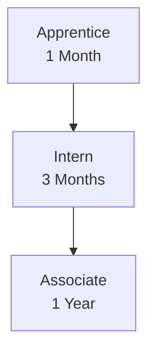

### **Experiential Pathway Flow — Advanced**

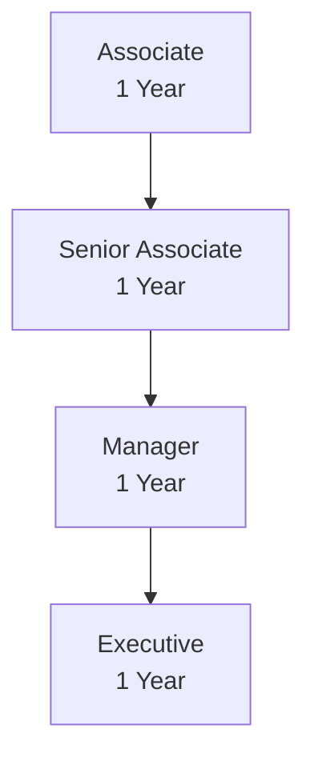

Placement may be internal to RIAH or through approved employer and professional partners.

United States participants may be remote, hybrid, or on-site and may be paid or unpaid depending on the placement and applicable law.

International Online Students residing outside the United States participate remotely and unpaid under RIAH policy.

Eligible education pathway students who qualify for the RIAH one-month Experiential guarantee receive the guarantee subject to application, eligibility, completion of the applicable milestone identified in the Milestones Guide for the one-month Experiential guarantee, available qualifying work, supervision, and placement procedures.

All Experiential is based on **consequential real-world professional work**, attached education, weekly objectives, weekly performance assessment, professional supervision, governance, review, and documented performance. RIAH Experiential does not substitute simulations or artificial workplace exercises for the actual work experience.

---

# 👑RIAH Pathway.
