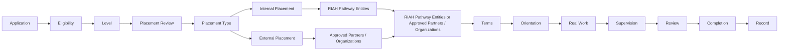
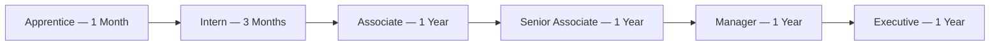

# 👑RIAH Pathway.

**Contributor; Mariah Dominique Rucker**

There is currently no team. I am building everything myself until I have hired the beta team. I am starting the hiring process this month, **October 2026**, for the CTO, CISO, experiential professionals, PhD-qualified faculty, and adjunct faculty for each school and major, with hiring continuing across the entire ecosystem as it scales.

Beta team members will be hired with **equity participation and compensation during the beta cohort**, which launches in **Spring 2027**.

The website will launch in **October 2026** as I continue to build, develop, revise, and finalize aspects of the RIAH Pathway ecosystem.

Learn more about me on GitHub and LinkedIn, or connect with me through social media and Linktree.

- **GitHub:** https://github.com/mariahdominiquerucker
- **LinkedIn:** https://linkedin.com/in/mariahrucker
- **Facebook:** https://facebook.com/heymariahrucker
- **Instagram:** https://instagram.com/heymariahrucker
- **Linktree:** https://linktr.ee/mariahrucker

---

# RIAH Pathway — Experiential Structure

## 🔑 Emoji Key
| Emoji | Meaning |
|---|---|
| 🎯 | Purpose and architecture |
| 🌐 | Delivery, access, and placement format |
| 🏢 | Internal placement |
| 🤝 | External placement and partners |
| 🌍 | International Online Experiential |
| ⚖️ | Law, compliance, governance, and authorization |
| 🧭 | Application, selection, progression, and placement flow |
| 👥 | Supervision, leadership, professionals, and review |
| 📚 | Curriculum, education, collections, and college credit |
| 💰 | Pricing, payment, paid, and unpaid standards |
| 📋 | Performance, documentation, and completion |
| 🚀 | Employment and career connection |
| 🛡️ | Controlling standards and compliance controls |

## 📑 Index
| Section | Area | Emoji |
|---|---|---|
| I | PURPOSE | 🎯 |
| II | EXPERIENTIAL ARCHITECTURE | 🎯 |
| III | EXPERIENTIAL DELIVERY | 🌐 |
| IV | INTERNAL PLACEMENT | 🏢 |
| V | EXTERNAL PLACEMENT | 🤝 |
| VI | INTERNATIONAL ONLINE EXPERIENTIAL | 🌍 |
| VII | CONSEQUENTIAL REAL-WORLD WORK STANDARD | 🛡️ |
| VIII | ONE-MONTH EXPERIENTIAL GUARANTEE | 🛡️ |
| IX | EXPERIENTIAL APPLICATION AND PLACEMENT PROCEDURE | 🧭 |
| X | PLACEMENT SELECTION | 🧭 |
| XI | SUPERVISION AND REVIEW | 👥 |
| XII | EXPERIENTIAL LEVEL PROGRESSION | 🧭 |
| XIII | EXPERIENTIAL CURRICULUM AND COLLECTIONS | 📚 |
| XIV | EXPERIENTIAL PRICING | 💰 |
| XV | EXPERIENTIAL AND EDUCATION INTEGRATION | 📚 |
| XVI | EXPERIENTIAL COLLEGE CREDIT STRUCTURE | 📚 |
| XVII | SCHOOL ALIGNMENT | 🛡️ |
| XVIII | NON-JD LAW EXPERIENTIAL STRUCTURE | ⚖️ |
| XIX | LAW EXPERIENTIAL SUPERVISION | ⚖️ |
| XX | PAID AND UNPAID PLACEMENT STANDARD | 💰 |
| XXI | ACCESSIBILITY AND PLACEMENT FLEXIBILITY | 🌐 |
| XXII | PERFORMANCE AND DOCUMENTATION | 📋 |
| XXIII | COMPLETION | 📋 |
| XXIV | EMPLOYMENT AND CAREER CONNECTION | 🚀 |
| XXV | EXPERIENTIAL GOVERNANCE | ⚖️ |
| XXVI | INTERNATIONAL COMPLIANCE CONTROL | 🌍 |
| XXVII | CONTROLLING EXPERIENTIAL STRUCTURE | 🛡️ |

# **I. 🎯 PURPOSE**

| Number | PURPOSE Standard | Emoji |
|---:|---|---|
| 1 | RIAH Pathway Experiential provides supervised, real-world professional learning through actual work, projects, assignments, deliverables, and professional review within the RIAH Pathway ecosystem or with approved employer and professional partners. | 🎯 |
| 2 | Experiential connects academic learning to applied professional experience while maintaining separate eligibility, placement, supervision, performance, completion, and recordkeeping standards. | 🎯 |
| 3 | Experiential includes **two placement types: Internal Placement and External Placement**. | 🎯 |
| 4 | These experiences are **not simulations, practice projects, hypothetical assignments, simulated workplaces, or disposable academic projects**. Students perform legitimate work for actual operational purposes within the RIAH Pathway ecosystem or with approved employer and professional partners. | 🎯 |
| 5 | Placement is based on the participant's **Experiential pathway, field, major, level, qualifications, placement type, placement availability, organizational needs, partner needs, capacity, supervision availability, and applicable placement requirements**. | 🎯 |

# **II. 🎯 EXPERIENTIAL ARCHITECTURE**

| Level | Duration | Baseline Eligibility | Placement Focus |
|---|---:|---|---|
| **Apprentice** | **1 Month** | Little to no experience; some or no prior knowledge in the selected field or major | Entry-level supervised exposure and foundational real-world work |
| **Intern** | **3 Months** | Little to no professional experience; some applicable coursework completed | Supervised applied work aligned to coursework and field |
| **Associate** | **1 Year** | Some applicable experience and required prerequisites completed | Sustained professional work with increasing independent responsibility |
| **Senior Associate** | **1 Year** | At least one year of applicable experience and required prerequisites completed | Advanced professional work, review, collaboration, and increased responsibility |
| **Manager** | **1 Year** | Senior Associate-level experience and required prerequisites completed | Management-level work, coordination, review, and leadership responsibilities |
| **Executive** | **1 Year** | At least one year of Manager-level experience and required prerequisites completed | Executive-level strategy, leadership, oversight, and professional application |
| Number | EXPERIENTIAL ARCHITECTURE Standard | Emoji |
|---:|---|---|
| 1 | Eligibility for a level does not guarantee a particular placement. RIAH verifies prerequisites, experience, capacity, placement fit, supervision availability, and partner requirements before assignment. | 🎯 |

# **III. 🌐 EXPERIENTIAL DELIVERY**

| Student or Participant | Delivery |
|---|---|
| **United States Student** | Remote, hybrid, or on-site depending on placement |
| **International Online Student residing outside the United States** | Remote only |
| **Internal RIAH Placement** | Remote, hybrid, or on-site where applicable |
| **Employer or Professional Partner Placement** | Remote, hybrid, or on-site where applicable and permitted |
| Number | EXPERIENTIAL DELIVERY Standard | Emoji |
|---:|---|---|
| 1 | United States students may participate in paid or unpaid Experiential placements depending on the placement, employer, applicable law, and written placement terms. | 🌐 |
| Number | EXPERIENTIAL DELIVERY Standard | Emoji |
|---:|---|---|
| 1 | International Online Students residing outside the United States participate remotely and are limited by RIAH policy to unpaid Experiential placements. RIAH does not use the International Online Experiential pathway as U.S. employment or U.S. visa sponsorship. The student's country-of-residence requirements and the legal classification of the activity must still be reviewed before placement. | 🌐 |

# **IV. 🏢 INTERNAL PLACEMENT**

| Number | INTERNAL PLACEMENT Standard | Emoji |
|---:|---|---|
| 1 | Internal Placement provides opportunities throughout eligible **RIAH Pathway ecosystem entities** where legitimate work opportunities are available. | 🏢 |
| 2 | Students perform actual work under the guidance, supervision, management, and review of **internal professionals and Experiential professionals**. | 🏢 |

## **Internal Placement Entities**

| Number | Internal Placement Entity | Emoji |
|---:|---|---|
| 1 | **RIAH Pathway** | 🏢 |
| 2 | **RIAH Pathway Holdings Corporation** | 🏢 |
| 3 | **RIAH Pathway Corporation** | 🏢 |
| 4 | **RIAH Pathway Professional Services LLP** — Student-Centered • Not External Client Services | 🏢 |
| 5 | **RIAH Pathway School of Business, Homeland Security, Law, and Technology LLC** | 🏢 |
| 6 | **RIAH Pathway Technology LLC** | 🏢 |
| 7 | **RIAH Pathway Programs LLC** | 🏢 |
| 8 | **RIAH Pathway Products LLC** | 🏢 |
| 9 | **RIAH Pathway 501(c)(3) Foundation** | 🏢 |

## **RIAH Pathway Professional Services LLP**

| Number | RIAH Pathway Professional Services LLP Standard | Emoji |
|---:|---|---|
| 1 | The **RIAH Pathway Professional Services LLP is student-centered and serves the RIAH Pathway ecosystem**. It does **not provide professional services to external clients**. | 🛡️ |
| 2 | Services are provided internally throughout the RIAH Pathway ecosystem by students working with **internal professionals and Experiential professionals** through internal placements. Students may also complete external placements with **vetted employer partners**. | 🛡️ |
| 3 | Students preparing for careers in public accounting, accounting, consulting, cybersecurity, technology, and other professional-service fields may gain applicable real-work experience internally before or alongside opportunities with external employers or client-serving firms. | 🛡️ |

## **Internal Placement Types**

### **Single-Area Assignments**

| Number | Single-Area Assignments Standard | Emoji |
|---:|---|---|
| 1 | Students work within one professional or functional area and develop experience throughout that area. For example, a student assigned to accounting may perform work across audit, compliance, and other applicable accounting functions and responsibilities. | 🛡️ |

### **Rotational Placements**

| Number | Rotational Placements Standard | Emoji |
|---:|---|---|
| 1 | Selected students may rotate through applicable functions, departments, professional areas, or ecosystem entities to develop broader experience. | 🛡️ |
| 2 | Internal placements involve **actual work that contributes directly to the operations and needs of the RIAH Pathway ecosystem**. | 🛡️ |

# **V. 🤝 EXTERNAL PLACEMENT**

| Number | EXTERNAL PLACEMENT Standard | Emoji |
|---:|---|---|
| 1 | External Placement provides opportunities with **vetted employers, partners, and organizations** aligned with the participant's field, major, Experiential pathway, Experiential level, qualifications, and placement requirements. | 🤝 |
| 2 | RIAH vets external employers and Experiential partners to help verify that participating organizations are legitimate and provide legitimate real-work experiences where participants can **learn, contribute, perform actual work, and see the results of their contributions**. | 🤝 |
| 3 | External Experiential placements must involve **actual work rather than simulations, practice projects, or hypothetical assignments**. | 🤝 |

## **External Placement Opportunities**

| Number | External Placement Opportunity | Emoji |
|---:|---|---|
| 1 | Professional Partners | 🤝 |
| 2 | Educational Partners | 🤝 |
| 3 | Law Firms | 🤝 |
| 4 | Courts | 🤝 |
| 5 | CPA Firms | 🤝 |
| 6 | MSSPs | 🤝 |
| 7 | Development Firms | 🤝 |
| 8 | Security Firms | 🤝 |
| 9 | Nonprofits | 🤝 |
| 10 | Startups | 🤝 |
| 11 | Small Businesses | 🤝 |
| 12 | Entrepreneurial Organizations | 🤝 |
| 13 | Corporations | 🤝 |
| 14 | Government Agencies | 🤝 |
| 15 | Other approved employers and professional organizations | 🤝 |
| Number | External Placement Opportunities Standard | Emoji |
|---:|---|---|
| 16 | Students may work directly with professionals and employers including **CPAs, attorneys, judges, cybersecurity and technology professionals, nonprofits, startups, professional firms, corporations, and other vetted organizations**. | 🤝 |

# **VI. 🌍 INTERNATIONAL ONLINE EXPERIENTIAL**

| Number | INTERNATIONAL ONLINE EXPERIENTIAL Standard | Emoji |
|---:|---|---|
| 1 | International Online Students are eligible to apply for RIAH Experiential. | 🌍 |
| 2 | Requirements: | 🌍 |
| Number | International Online Requirement | Emoji |
|---:|---|---|
| 3 | Student remains physically outside the United States during the International Online Experiential placement. | 🌍 |
| 4 | Placement is remote. | 🌍 |
| 5 | Placement is unpaid under the RIAH International Online Experiential policy. | 🌍 |
| 6 | Work is supervised by applicable industry professionals. | 🌍 |
| 7 | Work is aligned to the student's field, major, pathway, or approved professional-development objective. | 🌍 |
| 8 | Placement may occur internally within the RIAH ecosystem or with an approved partner. | 🌍 |
| 9 | RIAH documents assignments, supervision, deliverables, performance, and completion. | 🌍 |
| 10 | Country-of-residence requirements and partner requirements apply. | 🌍 |
| 11 | Participation does not constitute U.S. visa sponsorship. | 🌍 |
| 12 | If a student is physically present in the United States, RIAH must separately review the student's immigration and work-authorization status before any work-based placement. | 🌍 |

# **VII. 🛡️ CONSEQUENTIAL REAL-WORLD WORK STANDARD**

| Number | CONSEQUENTIAL REAL-WORLD WORK STANDARD Standard | Emoji |
|---:|---|---|
| 1 | All RIAH Experiential placements are based on **actual consequential work**. Experiential is not a simulation, artificial exercise, mock workplace, practice company, or disposable academic project. | 🛡️ |
| 2 | Consequential work means the participant performs real work for an actual operational purpose within the RIAH Pathway ecosystem or for an approved employer or professional partner. The work is intended to be used, implemented, reviewed, relied upon, moved into development or production, incorporated into operations, or otherwise contribute to a real organizational objective. | 🛡️ |
| 3 | A participant is therefore working in the applicable field in the same practical context in which that work would be performed for an employer, subject to the participant's level, authorization, supervision, and applicable professional requirements. | 🛡️ |
| 4 | Examples include: | 🛡️ |
| Number | Experiential Structure Content | Emoji |
|---:|---|---|
| 5 | Accounting participants performing work supporting actual month-end close, budgeting, financial analysis, audit support, internal controls, compliance, reconciliations, reporting, or other accounting functions. | 🛡️ |
| 6 | Technology participants developing, testing, documenting, securing, maintaining, or supporting actual applications, software, systems, infrastructure, databases, integrations, automations, or technology used by RIAH or an approved partner. | 🛡️ |
| 7 | Cybersecurity participants performing authorized security, governance, risk, compliance, monitoring, documentation, control, or related work on actual organizational systems and processes within their permitted scope. | 🛡️ |
| 8 | Business participants performing actual operations, finance, management, entrepreneurship, research, analysis, process improvement, marketing, or business-development work. | 🛡️ |
| 9 | Project and program management participants coordinating actual initiatives, schedules, requirements, deliverables, risks, dependencies, resources, and implementation. | 🛡️ |
| 10 | Legal participants performing actual legally permitted supervised legal work for real matters, operations, research, documentation, or qualifying placements within the limits of applicable law and professional supervision. | 🛡️ |
| 11 | Homeland Security participants performing legally permitted governance, risk, compliance, intelligence, physical-security, investigative-support, or related operational work within their authorized scope. | 🛡️ |
| 12 | Other participants performing actual work aligned to their approved field, major, pathway, placement, and Experiential level. | 🛡️ |
| 13 | The fact that a participant is learning does not make the work simulated. Participant work may contain mistakes or require revision, just as work performed by developing professionals may require correction. RIAH uses governance, supervision, management, review, quality control, risk controls, and applicable compliance procedures so work is reviewed before it is approved, relied upon, released, implemented, filed, published, deployed, or moved into production when review is required. | 🛡️ |
| 14 | Experiential Supervisors, Managers, Reviewers, faculty, industry professionals, and applicable licensed or authorized professionals are responsible for the level of review appropriate to the work. A participant may not independently approve, release, certify, sign, file, deploy, or perform work requiring authority, licensure, clearance, or credentials the participant does not possess. | 🛡️ |
| 15 | Students may not perform work requiring a professional license, legal authorization, security clearance, or other credential unless the work and supervision comply with the applicable requirements. | 🛡️ |

# **VIII. 🛡️ ONE-MONTH EXPERIENTIAL GUARANTEE**

| Number | ONE-MONTH EXPERIENTIAL GUARANTEE Standard | Emoji |
|---:|---|---|
| 1 | RIAH guarantees eligible education students the opportunity to apply for and receive one month of Experiential during the student's final year, subject to the rules below. | 🛡️ |
| Rule | Standard |
|---|---|
| **Length** | **1 Month** |
| **Eligibility Period** | **Student's final year** |
| **Application** | Required |
| **Placement Source** | RIAH ecosystem or approved employer or professional partner |
| **Placement Basis** | Current needs, available work, student qualifications, field alignment, supervision, and placement capacity |
| **Work Type** | Real-world supervised work |
| **Compensation** | Paid or unpaid for eligible U.S. placements depending on placement terms and applicable law |
| **International Online Student** | Remote and unpaid under RIAH policy |
| **Guaranteed Item** | One-month Experiential opportunity for an eligible final-year student |
| **Not Guaranteed** | Specific employer, specific job, specific project, paid status, location, or permanent employment |
| 2 | The one-month guarantee does not guarantee employment after completion. | 🛡️ |

# **IX. 🧭 EXPERIENTIAL APPLICATION AND PLACEMENT PROCEDURE**

| Step | Application and Placement Procedure | Emoji |
|---:|---|---|
| 1 | Student identifies the requested Experiential level. | 🧭 |
| 2 | Student submits the Experiential application. | 🧭 |
| 3 | RIAH verifies student status, pathway, major, coursework, prerequisites, and experience. | 🧭 |
| 4 | RIAH determines the highest level for which the student qualifies. | 🧭 |
| 5 | RIAH reviews internal ecosystem needs and approved external partner opportunities. | 🧭 |
| 6 | RIAH determines whether the applicable opportunity is an Internal Placement or External Placement. | 🧭 |
| 7 | RIAH matches the student by field, qualifications, experience, availability, delivery format, supervision, organizational needs, partner needs, placement requirements, and capacity. | 🧭 |
| 8 | Placement terms identify duration, paid or unpaid status where applicable, delivery format, supervisor, responsibilities, and expected deliverables. | 🧭 |
| 9 | Student completes Experiential orientation and applicable training. | 🧭 |
| 10 | Student begins supervised real-world work. | 🧭 |
| 11 | Supervisor and applicable Experiential Manager or Reviewer document progress and performance. | 🧭 |
| 12 | Student completes required assignments, deliverables, reviews, and placement requirements. | 🧭 |
| 13 | RIAH records completion and applicable Experiential achievement. | 🧭 |

## **Placement Flow**

# **X. 🧭 PLACEMENT SELECTION**

| Number | PLACEMENT SELECTION Standard | Emoji |
|---:|---|---|
| 1 | Experiential placement is capacity-based. | 🧭 |
| 2 | Where demand exceeds capacity, RIAH may use an approved blind-selection process. | 🧭 |
| 3 | Where capacity is available, placements may use first-come, first-served processing after eligibility verification. | 🧭 |
| 4 | Placement decisions may consider: | 🧭 |
| Number | Placement Selection Consideration | Emoji |
|---:|---|---|
| 5 | Experiential level | 🧭 |
| 6 | Major and field | 🧭 |
| 7 | Completed prerequisites | 🧭 |
| 8 | Prior experience | 🧭 |
| 9 | Applicable coursework | 🧭 |
| 10 | Skills | 🧭 |
| 11 | Placement requirements | 🧭 |
| 12 | Delivery format | 🧭 |
| 13 | Schedule | 🧭 |
| 14 | Professional supervision | 🧭 |
| 15 | Internal ecosystem needs | 🧭 |
| 16 | Partner needs | 🧭 |
| 17 | Available capacity | 🧭 |
| 18 | Identity characteristics unrelated to placement qualifications are not used as placement-selection criteria. | 🧭 |

# **XI. 👥 SUPERVISION AND REVIEW**

| Number | SUPERVISION AND REVIEW Standard | Emoji |
|---:|---|---|
| 1 | Experiential may use: | 👥 |
| Number | Supervision and Review Professional | Emoji |
|---:|---|---|
| 2 | Experiential Supervisors | 👥 |
| 3 | Experiential Managers | 👥 |
| 4 | Experiential Reviewers | 👥 |
| 5 | Faculty | 👥 |
| 6 | Adjunct Faculty | 👥 |
| 7 | Industry Professionals | 👥 |
| 8 | Attorneys | 👥 |
| 9 | Judges | 👥 |
| 10 | Law Firms | 👥 |
| 11 | Courts | 👥 |
| 12 | CPA Firms | 👥 |
| 13 | Cybersecurity Firms | 👥 |
| 14 | Technology Firms | 👥 |
| 15 | Business Professionals | 👥 |
| 16 | Employer Partners | 👥 |
| 17 | Other approved professional partners | 👥 |
| 18 | The applicable professional supervises work within their permitted professional scope. | 👥 |
| 19 | RIAH maintains applicable placement, assignment, performance, review, and completion records. | 👥 |

## **Experiential Leadership — 12 People**

| Number | Experiential Leadership — 12 People Standard | Emoji |
|---:|---|---|
| 1 | Experiential Leadership includes: | 🛡️ |
| Number | Experiential Structure Content | Emoji |
|---:|---|---|
| 2 | **Directors — 4** | 🛡️ |
| 3 | **Project Managers — 4** | 🛡️ |
| 4 | **Program Managers — 4** | 🛡️ |
| 5 | Experiential Leadership is structured across: | 🛡️ |
| School | Director | Project Manager | Program Manager |
|---|---:|---:|---:|
| **School of Business** | 1 | 1 | 1 |
| **School of Technology** | 1 | 1 | 1 |
| **School of Homeland Security** | 1 | 1 | 1 |
| **School of Law** | 1 | 1 | 1 |
| 6 | **Directors** oversee the school's Experiential operations and connection to its academic programs. | 🛡️ |
| 7 | **Project Managers** manage Experiential projects, assignments, schedules, deliverables, Supervisors, Reviewers, faculty coordination, and student project execution. | 🛡️ |
| 8 | **Program Managers** manage Experiential programs, placements, participants, schedules, Supervisors, Reviewers, faculty coordination, and program delivery. | 🛡️ |
| 9 | Directors, Project Managers, and Program Managers work directly with **Academic Faculty** so Experiential programs, projects, placements, assignments, supervision, evaluations, and professional experiences connect with the educational programs and curriculum. | 🛡️ |

## **Experiential Professionals — 120 People**

| Number | Experiential Professionals — 120 People Standard | Emoji |
|---:|---|---|
| 1 | Experiential Professionals include: | 🛡️ |
| Number | Experiential Structure Content | Emoji |
|---:|---|---|
| 2 | **Supervisors — 40** | 🛡️ |
| 3 | **Managers — 40** | 🛡️ |
| 4 | **Reviewers — 40** | 🛡️ |
| 5 | Experiential Professionals operate across: | 🛡️ |
| 6 | **Business • Technology • Homeland Security • Law** | 🛡️ |
| 7 | **Supervisors** oversee students' applied work. | 🛡️ |
| 8 | **Managers** manage Experiential operations, assignments, teams, and deliverables. | 🛡️ |
| 9 | **Reviewers** independently evaluate student work, performance, competencies, projects, and outcomes. | 🛡️ |
| 10 | Supervisors, Managers, and Reviewers coordinate with **Experiential Leadership and Academic Faculty** to connect professional experience to education. | 🛡️ |

# **XII. 🧭 EXPERIENTIAL LEVEL PROGRESSION**

| Number | EXPERIENTIAL LEVEL PROGRESSION Standard | Emoji |
|---:|---|---|
| 1 | Experiential levels are separate pathways and are not automatic promotions. | 🧭 |
| 2 | A participant must satisfy the applicable prerequisites for the requested level. | 🧭 |
| From | To | Progression Requirement |
|---|---|---|
| Apprentice | Intern | Applicable coursework, readiness, and Intern eligibility |
| Intern | Associate | Some applicable experience and Associate prerequisites |
| Associate | Senior Associate | At least one year applicable experience and prerequisites |
| Senior Associate | Manager | Senior Associate-level experience and Manager prerequisites |
| Manager | Executive | At least one year Manager-level experience and Executive prerequisites |
| 3 | Prior professional experience may support placement at an advanced level after verification. A student does not have to begin at Apprentice when the student already qualifies for a higher level. | 🧭 |

# **XIII. 📚 EXPERIENTIAL CURRICULUM AND COLLECTIONS**

| Number | EXPERIENTIAL CURRICULUM AND COLLECTIONS Standard | Emoji |
|---:|---|---|
| 1 | Each level maintains its own Experiential curriculum and collection. | 📚 |
| Level | Collection |
|---|---|
| Apprentice | Apprentice Experiential Collection |
| Intern | Intern Experiential Collection |
| Associate | Associate Experiential Collection |
| Senior Associate | Senior Associate Experiential Collection |
| Manager | Manager Experiential Collection |
| Executive | Executive Experiential Collection |
| 2 | The standard Experiential Collection may include: | 📚 |
| Number | Experiential Curriculum or Collection Component | Emoji |
|---:|---|---|
| 3 | Experiential Textbook | 📚 |
| 4 | Experiential Workbook | 📚 |
| 5 | Experiential Journal | 📚 |
| 6 | Experiential Planner | 📚 |
| 7 | LMS Learning Courses | 📚 |
| 8 | Weekly Objectives | 📚 |
| 9 | Weekly Assignments | 📚 |
| 10 | Weekly Performance Assessments | 📚 |
| 11 | Real-World Consequential Work Experience | 📚 |
| 12 | Applicable supporting educational resources | 📚 |
| 13 | The education component is attached directly to the participant's real-world Experiential work. Participants learn the applicable concepts, standards, methods, governance, risk, compliance, and professional practices while applying them to actual work. | 📚 |
| 14 | Weekly objectives identify what the participant is expected to learn, apply, demonstrate, or improve through the work performed that week. Weekly assignments and performance assessments evaluate the participant based on the content and competencies the participant should have learned through that actual experience. | 📚 |
| 15 | The educational collection supports the work; it does not replace the work with simulations. RIAH Experiential combines education with actual applied paid or unpaid work, as applicable, under industry-professional supervision. | 📚 |
| 16 | The standard Experiential Collection follows the applicable product and curriculum structure established for the participant's level. Additional textbooks, workbooks, journals, planners, review materials, study materials, flashcards, learning resources, or other collection components may be included where established for the applicable Experiential curriculum. | 📚 |

# **XIV. 💰 EXPERIENTIAL PRICING**

| Number | EXPERIENTIAL PRICING Standard | Emoji |
|---:|---|---|
| 1 | Experiential participants have two tuition payment options: | 💰 |
| Number | Experiential Pricing or Payment Standard | Emoji |
|---:|---|---|
| 2 | **Upfront** — Pay the total Experiential tuition before the applicable payment deadline. | 💰 |
| 3 | **Monthly** — Divide the total Experiential tuition across the standard duration of the selected Experiential level. | 💰 |
| Level | Duration | Total Experiential Tuition | Upfront Option | Monthly Option |
|---|---:|---:|---:|---:|
| Apprentice | **1 Month** | **$2,500** | **$2,500** | **$2,500 for 1 month** |
| Intern | **3 Months** | **$5,000** | **$5,000** | **$1,666.67 per month for 3 months*** |
| Associate | **12 Months** | **$10,000** | **$10,000** | **$833.33 per month for 12 months*** |
| Senior Associate | **12 Months** | **$10,000** | **$10,000** | **$833.33 per month for 12 months*** |
| Manager | **12 Months** | **$10,000** | **$10,000** | **$833.33 per month for 12 months*** |
| Executive | **12 Months** | **$10,000** | **$10,000** | **$833.33 per month for 12 months*** |
| 4 | *Monthly amounts are the total tuition divided by the Experiential duration. Where division creates a rounding difference, the final payment is adjusted so total payments equal the stated Experiential tuition. | 💰 |

### Experiential Education Collection Deposit

| Number | Experiential Education Collection Deposit Standard | Emoji |
|---:|---|---|
| 1 | Each Experiential level also has its applicable deposit associated with the Experiential education collection and materials. | 📚 |
| 2 | The deposit supports the applicable collection components established for the participant's level, which may include: | 📚 |
| Number | Experiential Structure Content | Emoji |
|---:|---|---|
| 3 | Experiential Textbook | 🛡️ |
| 4 | Experiential Workbook | 🛡️ |
| 5 | Experiential Journal | 🛡️ |
| 6 | Experiential Planner | 🛡️ |
| 7 | Review materials where applicable | 🛡️ |
| 8 | Study materials where applicable | 🛡️ |
| 9 | Flashcards where applicable | 🛡️ |
| 10 | LMS learning materials | 🛡️ |
| 11 | Other applicable Experiential education collection components | 🛡️ |
| 12 | The applicable deposit amount is controlled by the RIAH Pathway Master Pricing Data Sheet and Pricing Engine and is separate from the Experiential tuition amounts shown above unless the controlling pricing documentation states otherwise. | 📚 |
| 13 | Current Experiential tuition, deposits, and pricing remain controlled by the RIAH Pathway Master Pricing Data Sheet and Pricing Engine. | 📚 |

# **XV. 📚 EXPERIENTIAL AND EDUCATION INTEGRATION**

| Number | EXPERIENTIAL AND EDUCATION INTEGRATION Standard | Emoji |
|---:|---|---|
| 1 | Experiential may operate as: | 📚 |
| Number | Education Integration Structure | Emoji |
|---:|---|---|
| 2 | A standalone Experiential pathway | 📚 |
| 3 | An integrated Education and Experiential pathway | 📚 |
| 4 | A final-year one-month guaranteed Experiential opportunity | 📚 |
| 5 | An applicable component of a law pathway | 📚 |
| 6 | A partner placement | 📚 |
| 7 | An internal RIAH ecosystem placement | 📚 |
| 8 | Academic curriculum and Experiential work remain separately documented where applicable. | 📚 |

# **XVI. 📚 EXPERIENTIAL COLLEGE CREDIT STRUCTURE**

| Number | EXPERIENTIAL COLLEGE CREDIT STRUCTURE Standard | Emoji |
|---:|---|---|
| 1 | RIAH Pathway assigns the following experiential credit-hour values to the Experiential levels for applicable college-enrollment, cost-of-attendance, and coursework-agreement purposes: | 📚 |
| Experiential Level | Experiential Credit Hours |
|---|---:|
| **Apprentice** | **1 Credit Hour** |
| **Intern** | **3 Credit Hours** |
| **Associate** | **6 Credit Hours** |
| **Senior Associate** | **6 Credit Hours** |
| **Manager** | **6 Credit Hours** |
| **Executive** | **6 Credit Hours** |
| 2 | For students completing RIAH Pathway Experiential through an applicable **cost-of-attendance arrangement or coursework agreement**, including applicable arrangements after RIAH Pathway obtains accreditation, the documented Experiential credit hours may be submitted to or recognized by the student's college or university for college credit. | 📚 |
| 3 | Subject to the receiving college or university's policies, academic requirements, transfer or experiential-learning rules, and approval, the Experiential credit hours may be applied toward an **internship requirement, cooperative education or co-op requirement, experiential-learning requirement, or elective course credit**. | 📚 |
| 4 | RIAH Pathway documents the applicable Experiential level, duration, supervised work, learning objectives, assignments, deliverables, performance assessments, completion, and assigned Experiential credit hours to support institutional review. | 📚 |
| 5 | The receiving college or university retains authority over whether and how RIAH Pathway Experiential credit is accepted, transferred, converted, or applied to the student's academic program. RIAH Pathway does not guarantee acceptance by another institution unless acceptance is established through an applicable written articulation, coursework, cost-of-attendance, transfer, or institutional agreement. | 📚 |

# **XVII. 🛡️ SCHOOL ALIGNMENT**

| Number | SCHOOL ALIGNMENT Standard | Emoji |
|---:|---|---|
| 1 | Experiential opportunities may align to: | 🛡️ |
| School | Applicable Areas |
|---|---|
| School of Business | Accounting, finance, business management, entrepreneurship, and related business areas |
| School of Technology | Cybersecurity, computer science, data analytics, data science, software development, software engineering, project management, program management, and related technology areas |
| School of Law | JD, Non-JD, criminal justice, legal research, law-office experience, and other legally permitted supervised legal work |
| School of Homeland Security | Governance, risk and compliance, intelligence, physical security, private investigations, and other legally permitted homeland-security areas |

# **XVIII. ⚖️ NON-JD LAW EXPERIENTIAL STRUCTURE**

| Number | NON-JD LAW EXPERIENTIAL STRUCTURE Standard | Emoji |
|---:|---|---|
| 1 | RIAH's current Non-JD structure contains seven state pathways. | ⚖️ |
| State | Non-JD Length | RIAH Experiential Status | One-Month Internal Experiential |
|---|---:|---|---|
| **Maine** | **1 Year** | Eligible; capacity-based | **Guaranteed during the pathway year** |
| **California** | **4 Years** | Eligible beginning 1L; capacity-based | **Guaranteed during 4L** |
| **Washington** | **4 Years** | Separate RIAH Experiential is ineligible because qualifying paid law-clerk work experience is integrated into the state pathway | **Ineligible** |
| **Vermont** | **4 Years** | Eligible beginning 1L; capacity-based | **Guaranteed during 4L** |
| **New York** | **3 Years** | Eligible beginning Year 1; capacity-based | **Guaranteed during Year 3** |
| **Virginia** | **3 Years** | Eligible beginning Year 1; capacity-based | **Guaranteed during Year 3** |
| **West Virginia** | **3 Years** | Separate RIAH Experiential is ineligible because qualifying paralegal and legal-assistant experience is integrated into the pathway | **Ineligible** |
| 2 | The applicable Non-JD state rules control qualifying legal study, employment, supervision, law-office study, and bar-eligibility requirements. RIAH Experiential does not replace a state-mandated legal apprenticeship, law-reader, law-clerk, law-office-study, employment, or supervision requirement. | ⚖️ |

# **XIX. ⚖️ LAW EXPERIENTIAL SUPERVISION**

| Number | LAW EXPERIENTIAL SUPERVISION Standard | Emoji |
|---:|---|---|
| 1 | Law Experiential may use approved: | ⚖️ |
| Number | Law Experiential Supervisor or Placement | Emoji |
|---:|---|---|
| 2 | Attorneys | ⚖️ |
| 3 | Judges | ⚖️ |
| 4 | Law firms | ⚖️ |
| 5 | Courts | ⚖️ |
| 6 | Legal departments | ⚖️ |
| 7 | Legal organizations | ⚖️ |
| 8 | Other qualified legal professionals or approved legal placements | ⚖️ |
| 9 | Students may perform only work permitted for their status, training, jurisdiction, and supervision level. | ⚖️ |
| 10 | Students may not represent themselves as licensed attorneys unless independently licensed. | ⚖️ |

# **XX. 💰 PAID AND UNPAID PLACEMENT STANDARD**

### United States Students

| Number | United States Students Standard | Emoji |
|---:|---|---|
| 1 | United States students may receive: | 🛡️ |
| Number | Experiential Structure Content | Emoji |
|---:|---|---|
| 2 | Paid placement | 🛡️ |
| 3 | Unpaid placement | 🛡️ |
| 4 | The applicable placement agreement controls compensation subject to applicable law. | 🛡️ |

### International Online Students

| Number | International Online Students Standard | Emoji |
|---:|---|---|
| 1 | International Online Students residing outside the United States receive: | 🌍 |
| Number | International Online Requirement | Emoji |
|---:|---|---|
| 2 | Remote placement only | 🌍 |
| 3 | Unpaid placement under RIAH policy | 🌍 |
| 4 | Professional supervision | 🌍 |
| 5 | Real-world work | 🌍 |
| 6 | Performance review | 🌍 |
| 7 | Completion documentation | 🌍 |
| 8 | International Online Experiential is not represented as U.S. employment, U.S. work authorization, or visa sponsorship. | 🌍 |

# **XXI. 🌐 ACCESSIBILITY AND PLACEMENT FLEXIBILITY**

| Number | ACCESSIBILITY AND PLACEMENT FLEXIBILITY Standard | Emoji |
|---:|---|---|
| 1 | RIAH uses remote, hybrid, and on-site placement options to expand access for students who may experience geographic, transportation, scheduling, disability-access, family, employment, or other participation barriers. | 🌐 |
| 2 | Placement format depends on the participant, work, partner, supervision, applicable law, and program requirements. | 🌐 |
| 3 | International Online Students remain remote under the International Online Experiential policy. | 🌐 |

# **XXII. 📋 PERFORMANCE AND DOCUMENTATION**

| Number | PERFORMANCE AND DOCUMENTATION Standard | Emoji |
|---:|---|---|
| 1 | RIAH Experiential records may include: | 📋 |
| Number | Performance and Documentation Field | Emoji |
|---:|---|---|
| 2 | Participant | 📋 |
| 3 | Student ID | 📋 |
| 4 | School | 📋 |
| 5 | Major | 📋 |
| 6 | Experiential level | 📋 |
| 7 | Placement | 📋 |
| 8 | Internal or partner placement | 📋 |
| 9 | Supervisor | 📋 |
| 10 | Manager | 📋 |
| 11 | Reviewer | 📋 |
| 12 | Start date | 📋 |
| 13 | End date | 📋 |
| 14 | Delivery format | 📋 |
| 15 | Paid or unpaid status | 📋 |
| 16 | Assignments | 📋 |
| 17 | Consequential work responsibilities | 📋 |
| 18 | Operational deliverables | 📋 |
| 19 | Weekly objectives | 📋 |
| 20 | Weekly activity | 📋 |
| 21 | Weekly performance assessments | 📋 |
| 22 | Educational content completed | 📋 |
| 23 | Professional competencies | 📋 |
| 24 | Performance reviews | 📋 |
| 25 | Supervisor feedback | 📋 |
| 26 | Completion status | 📋 |
| 27 | Applicable badge or achievement | 📋 |
| 28 | Applicable graduate benefit record | 📋 |

# **XXIII. 📋 COMPLETION**

| Number | COMPLETION Standard | Emoji |
|---:|---|---|
| 1 | Experiential completion requires: | 📋 |
| Number | Completion Requirement | Emoji |
|---:|---|---|
| 2 | Required duration completed. | 📋 |
| 3 | Required assignments completed. | 📋 |
| 4 | Required real-world work completed. | 📋 |
| 5 | Required professional supervision completed. | 📋 |
| 6 | Required reviews completed. | 📋 |
| 7 | Required deliverables completed. | 📋 |
| 8 | Applicable curriculum completed. | 📋 |
| 9 | Placement obligations satisfied. | 📋 |
| 10 | Completion verified by RIAH. | 📋 |
| 11 | Completion of an eligible Experiential pathway may qualify for applicable RIAH Graduate benefits under the controlling Contributor Benefits documentation. | 📋 |

# **XXIV. 🚀 EMPLOYMENT AND CAREER CONNECTION**

| Number | EMPLOYMENT AND CAREER CONNECTION Standard | Emoji |
|---:|---|---|
| 1 | Experiential is designed to create documented professional experience and exposure to RIAH and employer partners. | 🚀 |
| 2 | Experiential completion does not guarantee: | 🚀 |
| Number | Employment or Career Standard | Emoji |
|---:|---|---|
| 3 | Permanent employment | 🚀 |
| 4 | A job offer | 🚀 |
| 5 | A specific employer | 🚀 |
| 6 | A specific salary | 🚀 |
| 7 | Paid placement | 🚀 |
| 8 | Professional licensure | 🚀 |
| 9 | Bar eligibility | 🚀 |
| 10 | Immigration status | 🚀 |
| 11 | Work authorization | 🚀 |
| 12 | Employment decisions remain separate from Experiential completion. | 🚀 |

# **XXV. ⚖️ EXPERIENTIAL GOVERNANCE**

| Number | EXPERIENTIAL GOVERNANCE Standard | Emoji |
|---:|---|---|
| 1 | RIAH Pathway maintains the Experiential architecture. | ⚖️ |
| 2 | Applicable faculty and Experiential professionals support curriculum development, supervision, review, and continuous improvement. | ⚖️ |
| 3 | Experiential placements must: | ⚖️ |
| Number | Experiential Governance Requirement | Emoji |
|---:|---|---|
| 4 | Align to the participant's approved pathway or professional-development objective. | ⚖️ |
| 5 | Use appropriate professional supervision. | ⚖️ |
| 6 | Define responsibilities, consequential work, and operational deliverables. | ⚖️ |
| 7 | Require appropriate review before consequential work is approved, relied upon, released, implemented, filed, published, deployed, or moved into production. | ⚖️ |
| 8 | Maintain governance, risk, compliance, quality-control, and escalation procedures appropriate to the placement. | ⚖️ |
| 9 | Protect confidential and restricted information. | ⚖️ |
| 10 | Follow applicable law and professional requirements. | ⚖️ |
| 11 | Maintain appropriate records. | ⚖️ |
| 12 | Complete performance review. | ⚖️ |
| 13 | Avoid assigning work outside the participant's permitted scope. | ⚖️ |
| 14 | Follow applicable partner agreements. | ⚖️ |
| 15 | Follow RIAH policies and governance. | ⚖️ |

# **XXVI. 🌍 INTERNATIONAL COMPLIANCE CONTROL**

| Number | INTERNATIONAL COMPLIANCE CONTROL Standard | Emoji |
|---:|---|---|
| 1 | RIAH's International Online Experiential policy is designed for students who remain outside the United States and participate remotely. | 🌍 |
| 2 | Unpaid status alone does not determine whether an activity is legally permissible. Before placement, RIAH must consider the student's physical location, country-of-residence requirements, placement structure, partner requirements, and any applicable immigration or employment rules. | 🌍 |
| 3 | A student physically present in the United States under F-1 or another immigration status is not processed under the outside-the-United-States International Online Experiential rule. Any practical training or work-based activity for such a student requires separate status and work-authorization review. | 🌍 |

# **XXVII. 🛡️ CONTROLLING EXPERIENTIAL STRUCTURE**

| Number | CONTROLLING EXPERIENTIAL STRUCTURE Standard | Emoji |
|---:|---|---|
| 1 | The Experiential pathway is: | 🛡️ |

| Number | CONTROLLING EXPERIENTIAL STRUCTURE Standard | Emoji |
|---:|---|---|
| 1 | Placement may be internal to RIAH or through approved employer and professional partners. | 🛡️ |
| 2 | United States participants may be remote, hybrid, or on-site and may be paid or unpaid depending on the placement and applicable law. | 🛡️ |
| 3 | International Online Students residing outside the United States participate remotely and unpaid under RIAH policy. | 🛡️ |
| 4 | Eligible final-year education students receive the RIAH one-month Experiential guarantee subject to application, eligibility, available qualifying work, supervision, and placement procedures. | 🛡️ |
| 5 | All Experiential is based on **consequential real-world professional work**, attached education, weekly objectives, weekly performance assessment, professional supervision, governance, review, and documented performance. RIAH Experiential does not substitute simulations or artificial workplace exercises for the actual work experience. | 🛡️ |
| 6 | RIAH Pathway | 🛡️ |

---

# 👑RIAH Pathway.
