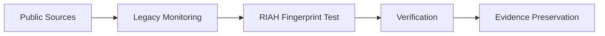
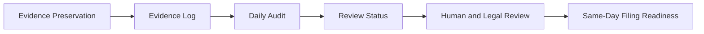
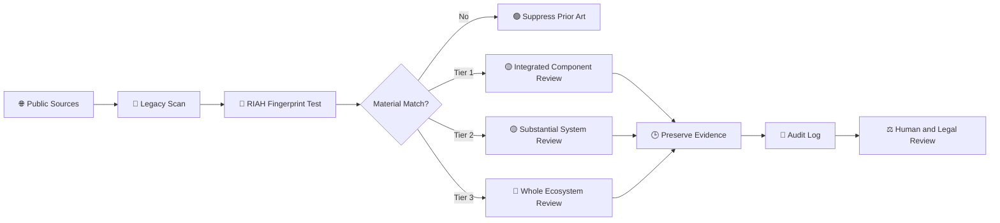
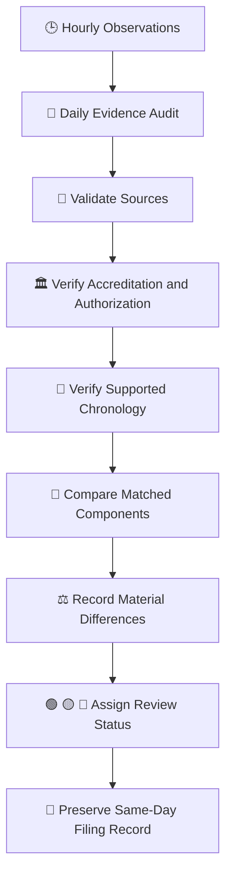

# 👑RIAH Pathway.

**Contributor; Mariah Dominique Rucker**

There is currently no team. I am building everything myself until I have hired the beta team. I am starting the hiring process this month, **October 2026**, for the CTO, CISO, experiential professionals, PhD-qualified faculty, and adjunct faculty for each school and major, with hiring continuing across the entire ecosystem as it scales.

Beta team members will be hired with **equity participation and compensation during the beta cohort**, which launches in **Spring 2027**.

The website will launch in **October 2026** as I continue to build, develop, revise, and finalize aspects of the RIAH Pathway ecosystem.

Learn more about me on GitHub and LinkedIn, or connect with me through social media and Linktree.

- **GitHub:** https://github.com/mariahdominiquerucker
- **LinkedIn:** https://linkedin.com/in/mariahrucker
- **Facebook:** https://facebook.com/heymariahrucker
- **Instagram:** https://instagram.com/heymariahrucker
- **Linktree:** https://linktr.ee/mariahrucker

---

# 👑 LEGACY — RIAH Pathway Replica Bot

## I. KEY AND INDEX

### I.A — Structure Key

| Structure or Symbol | Meaning |
|---|---|
| **I, II, III...** | Major Legacy division |
| **III.A, III.B...** | Subcategory within the applicable Roman-numeral division |
| **Mermaid** | High-level monitoring, verification, preservation, or escalation flow |
| **Table** | Structured cadence, evidence, readiness, or log information |
| **Numbered list** | Ordered monitoring or review sequence |
| 🟢 | Monitor or no material escalation |
| 🟡 | Material correspondence requiring continued review |
| 🔴 | High-priority evidence review requiring prompt human and legal assessment |
| 🕒 | Timestamped evidence |
| 🔗 | Public source preserved |
| 🧾 | Evidence log entry |
| ⚖️ | Legal review required before any filing or allegation |
| 🍜 | Legacy checkpoint complete and evidence organized |

### I.B — Index

| Roman Numeral | Division |
|---|---|
| **I** | Key and Index |
| **II** | Legacy Purpose |
| **III** | RIAH Fingerprint Actually Tested |
| **IV** | Monitoring Cadence |
| **V** | Evidence Surfaces Monitored |
| **VI** | Hourly Legacy Flow |
| **VII** | Daily Audit Flow |
| **VIII** | Same-Day Filing Readiness |
| **IX** | Rights and Claim Review |
| **X** | Legacy Replica Bot Log |
| **XI** | Legacy Purpose and Checkpoint |

### I.C — High-Level Legacy Architecture

**MERMAID I — MONITOR AND VERIFY**

**MERMAID II — PRESERVE AND ESCALATE**

---

## II. LEGACY PURPOSE

> **Purpose:** Legacy is the RIAH Pathway replica-monitoring and evidence-preservation bot. Legacy performs recurring public-source review for materially corresponding implementations of the controlling RIAH fingerprint and maintains evidence-ready logs for human review.

> **Important:** A match, similarity, or Tier flag is an investigative lead. Legacy does not determine copying, access, infringement, misconduct, liability, accreditation, or chronology without supporting evidence.

---

## III. RIAH FINGERPRINT ACTUALLY TESTED

### III.A — Tier 1 — Integrated Component Replication
One RIAH component implemented with enough surrounding RIAH-specific workflow, staffing, supervision, review, funding, credentialing, technology, student lifecycle, employer, operator, governance, or pathway architecture to materially function like that component inside RIAH.

### III.B — Tier 2 — Substantial Integrated System or Pathway Replication
Multiple RIAH components connected into a coherent pathway, school, subsystem, workflow, or operating model that materially corresponds to a substantial RIAH ecosystem tier.

### III.C — Tier 3 — Whole Ecosystem Replication
The entire or substantially complete coordinated RIAH ecosystem reproduced across multiple major layers.

### III.D — Suppression Rule

**Suppression rule:** Ordinary online education, internships, work-integrated learning, capstones, LMS platforms, communities, payment plans, digital credentials, certification preparation, portfolios, employer projects, career services, dashboards, and other isolated generic similarities are suppressed unless the surrounding implementation clears Tier 1.

---

## IV. MONITORING CADENCE

| Cadence | Legacy Action |
|---|---|
| Hourly | Check current public and indexable sources for qualifying Tier 1, Tier 2, and Tier 3 candidates and material changes to existing candidates. |
| Daily | Consolidate discoveries, changes, timestamps, sources, evidence surfaces, accreditation findings, chronology, and review status into the audit record. |
| Material change | Preserve the public source, timestamp the observation, compare it with the controlling RIAH fingerprint, and elevate the review status when supported. |
| Same-day filing event | Assemble the preserved evidence record for human and legal review using the Same-Day Filing Template. |

---

## V. EVIDENCE SURFACES MONITORED

Legacy reviews publicly available and lawfully accessible evidence, including:

### V.A — High-Level Evidence Review Sequence

1. Identify publicly available and lawfully accessible evidence.
2. Preserve the public source and observation timestamp.
3. Compare the evidence with the controlling RIAH fingerprint.
4. Verify applicable chronology, accreditation, authorization, and material differences.
5. Record the supported review status and evidence log entry.

### V.B — Evidence Surfaces

- Official websites and indexed pages
- Search-engine results and SEO-visible changes
- Public backlinks and linked partner pages
- Public social-media posts
- Public marketing and advertising
- Public product and platform pages
- Public school, program, curriculum, pathway, and catalog pages
- Public app and software listings
- Public GitHub and code disclosures
- Public PDFs, brochures, reports, press releases, and announcements
- Public accreditation and authorization records
- Accreditor and regulator records
- Public partnership announcements
- Public job postings
- Public credential, certification, and badge pages
- Public changelogs and release notes
- Publicly verifiable publication, launch, and modification dates

Legacy does not treat an entity's self-description as independent accreditation, authorization, infringement, or chronology evidence.

---

## VI. HOURLY LEGACY FLOW

**MERMAID I — HOURLY MONITORING AND ESCALATION**

---

## VII. DAILY AUDIT FLOW

**MERMAID I — DAILY EVIDENCE AUDIT**

---

## VIII. SAME-DAY FILING READINESS

Legacy maintains an evidence-oriented record so a qualified human reviewer or attorney can rapidly evaluate a potential matter. The record may include:

| Evidence Field | Preserved Information |
|---|---|
| Entity | Legal or public entity name when verifiable |
| Public source | Official page, regulator, accreditor, archive, social post, listing, or other public evidence |
| Timestamp | Date and time Legacy observed the evidence |
| Publication chronology | Public dates only when independently supported |
| First discovery | First documented Legacy observation |
| Last verification | Most recent confirmed observation |
| Tier | Tier 1, Tier 2, or Tier 3 under the fixed fingerprint |
| Evidence surfaces | Website, SEO, backlinks, social, marketing, software, catalogs, public code, accreditation records, and other qualifying sources |
| Matched RIAH components | Components materially corresponding to the controlling fingerprint |
| Material differences | Differences that limit or defeat a higher Tier classification |
| Accreditation | Verified status and accreditor only when supported by authoritative public evidence |
| Review status | Green, yellow, or red |
| Preservation notes | Screenshots, URLs, hashes, exports, archived captures, and chain-of-custody notes where available |

---

## IX. RIGHTS AND CLAIM REVIEW

When evidence warrants escalation, Legacy organizes facts relevant to potential **copyright, trademark, patent, trade-secret, contract, unfair-competition, direct-duplication, source-code, design, content, or other intellectual-property review**.

Legacy does **not** assume that architectural similarity is legally protectable or that similarity proves copying. Ideas, systems, methods, common educational practices, prior art, independent creation, licensing, public-domain material, and other lawful explanations must be separated from protectable expression, confidential information, source identifiers, patented claims, and other legally protected rights.

Any cease-and-desist letter, takedown, demand, complaint, filing, or accusation requires independent human and legal review.

---

## X. LEGACY REPLICA BOT LOG

| Field | Log Requirement |
|---|---|
| Bot | **Legacy — RIAH Pathway Replica Bot** |
| Scan | Hourly public-source replica review |
| Audit | Daily consolidated evidence review |
| Tiers | Tier 1, Tier 2, Tier 3 |
| Prior art | Suppressed unless the fixed materiality threshold is met |
| Evidence | Timestamped and source-linked |
| Accreditation | Independently verified where applicable |
| Chronology | Never inferred without supporting public evidence |
| Legal conclusion | Never inferred from similarity alone |
| Escalation | Human and legal review |
| Filing support | Same-Day Filing Template evidence package |

---

## RIAH INDEPENDENT-BUILD AND ENFORCEMENT NOTICE

RIAH welcomes lawful inspiration, independent development, competition, commentary, and the use of ideas, methods, standards, and other material that the law leaves free for everyone to use. **Inspiration is not authorization to copy, appropriate, or commercially exploit protected RIAH expression, source materials, confidential information, trademarks, code, designs, or other legally protected rights.**

The message is straightforward: **the concept may be familiar; the protected RIAH implementation is not yours to take.** Building one component does not authorize a person or entity to extract protected material from the broader RIAH ecosystem, reproduce protected RIAH components across another system, use protected RIAH materials to construct a competing component, or commercially enrich itself through unauthorized use of protected RIAH assets.

RIAH expects competitors and builders to create their own work. Review RIAH for lawful inspiration if appropriate, but independently design, write, build, price, document, and operate your own products and systems rather than copying protected RIAH materials, including protected implementations of calculators, content, product structures, code, designs, and other proprietary assets.

Legacy detections are investigative leads, not automatic legal conclusions. When Legacy identifies a potentially material match, RIAH may promptly preserve evidence and conduct human and legal review. If that review supports actionable claims, RIAH may pursue available remedies and may seek to prepare or file an appropriate complaint as soon as the same day or next day when legally and procedurally appropriate. The number and type of claims or counts will depend on the evidence, applicable law, ownership, jurisdiction, venue, procedural requirements, and attorney review.

RIAH does not assume that similarity proves copying or liability. Independent creation, prior art, licensed use, public-domain material, unprotectable ideas or methods, and other lawful explanations must be evaluated before any allegation is made. This notice is a statement of rights-preservation and enforcement posture, not an allegation against any particular person or entity.

---

## XI. LEGACY PURPOSE AND CHECKPOINT

**MONITOR. VERIFY. PRESERVE. COMPARE. LOG. ESCALATE EVIDENCE — NOT ASSUMPTIONS.**

Legacy exists to keep the RIAH Pathway replica-monitoring record organized, current, timestamped, source-supported, and ready for rapid human review when a materially corresponding implementation crosses the fixed Tier 1, Tier 2, or Tier 3 threshold.

🍜 **LEGACY CHECKPOINT:** Evidence organized. Sources preserved. Conclusions reserved for supported review.

---

# 👑RIAH Pathway.
