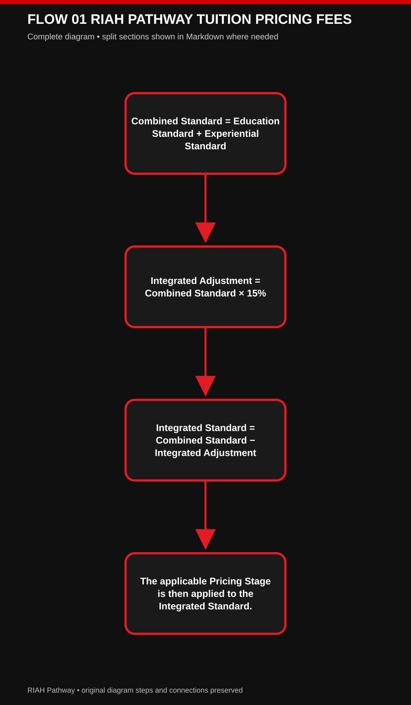
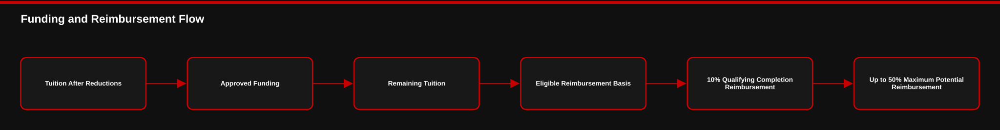
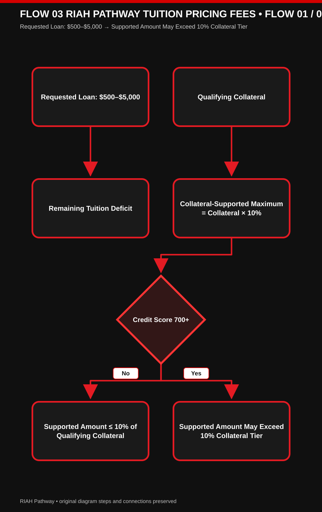
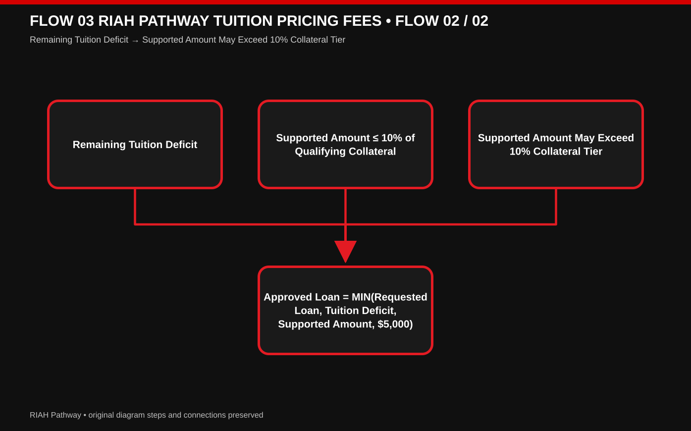
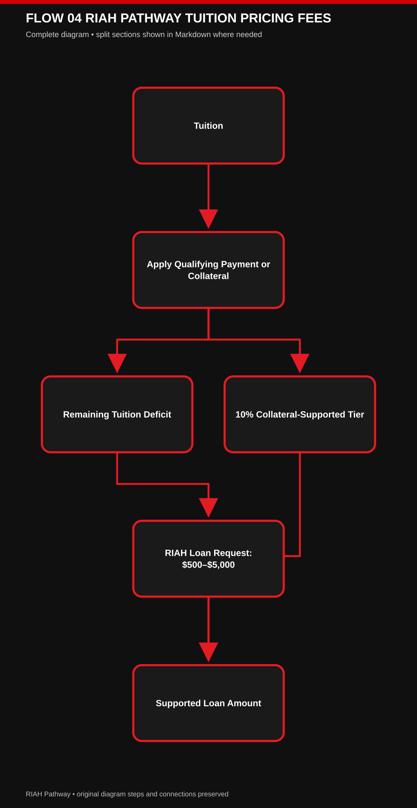
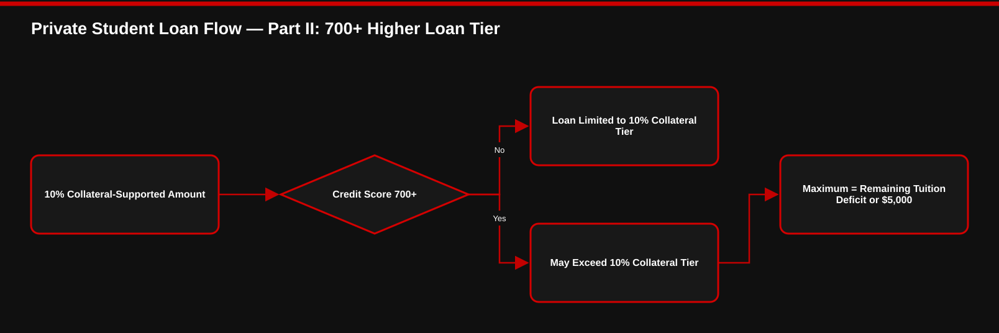
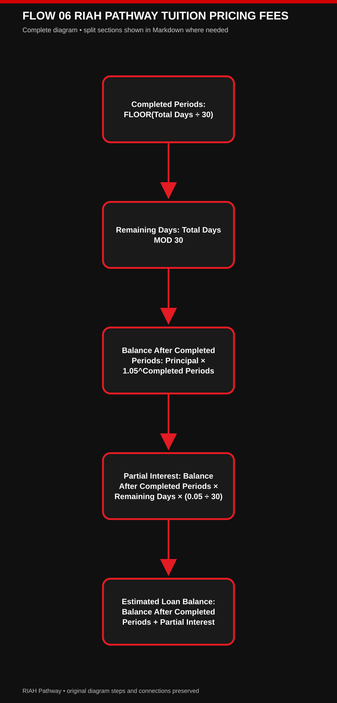

# 👑RIAH Pathway.

**Contributor/Founder/CEO/Chairman: Mariah Dominique Rucker**

There is currently no team. I am building everything myself until I have hired the beta team. I am starting the hiring process this month, **October 2026**, for the CTO, CISO, experiential professionals, PhD-qualified faculty, and adjunct faculty for each school and major, with hiring continuing across the entire ecosystem as it scales.

Beta team members will be hired with **equity participation and compensation during the beta cohort**, which launches in **Spring 2027**.

The website will launch in **October 2026** as I continue to build, develop, revise, and finalize aspects of the RIAH Pathway ecosystem.

Learn more about me on GitHub and LinkedIn, or connect with me through social media and Linktree.

- **GitHub:** https://github.com/mariahdominiquerucker
- **LinkedIn:** https://linkedin.com/in/mariahrucker
- **Facebook:** https://facebook.com/heymariahrucker
- **Instagram:** https://instagram.com/heymariahrucker
- **Linktree:** https://linktr.ee/mariahrucker

---

## Pricing Data Source for the RIAH Pathway Pricing Engine

This sheet contains the established dollar values, percentages, limits,
multipliers, allocations, fees, funding amounts, reductions, financing
values, reimbursement values, and other numerical configuration records
used by the RIAH Pathway Pricing Engine.

The Pricing Engine should reference these structured values rather than
independently recreating or inventing financial values.

------------------------------------------------------------------------

## 📑 INDEX

**I. 🎓 ACADEMIC STANDARD TUITION**  
**II. 💰 PRICING STAGES**  
**III. ⚖️ NON JD TUITION**  
**IV. 🎓 PRIMARY AND SECONDARY DEGREE PRICING**  
**V. 🎓 MINOR PRICING**  
**VI. 💼 EXPERIENTIAL PRICING**  
**VII. 🔄 INTEGRATED EDUCATION AND EXPERIENTIAL ADJUSTMENT**  
**VIII. 🏷️ ORDINARY TUITION REDUCTIONS**  
**IX. 🛡️ ORDINARY TUITION REDUCTION CAP**  
**X. 🤝 PARTNER EMPLOYEE PRICING**  
**XI. 👥 RIAH TEAM MEMBER PRICING**  
**XII. 🌐 COMMUNITY CONTRIBUTOR PRICING**  
**XIII. 🏫 SUBSTITUTE TEACHER AMBASSADOR DISCOUNTS**  
**XIV. 🚗 RIDESHARE AND DELIVERY AMBASSADOR DISCOUNTS**  
**XV. 🛍️ PRODUCT REDUCTION VALUES**  
**XVI. 🧾 EDUCATION DEPOSIT RESOURCE ALLOCATIONS**  
**XVII. 🧾 EDUCATION DEPOSIT**  
**XVIII. 💵 FEES**  
**XIX. 🔄 COMPLETE TRANSFER FEE INTERNAL ALLOCATION**  
**XX. 🔄 TRANSFER CREDIT MAXIMUMS**  
**XXI. 📚 CERTIFICATION AND BAR REVIEW PRICING**  
**XXII. 📚 MULTIPLE STANDALONE REVIEW PRICING**  
**XXIII. 🎁 NEED BASED SCHOLARSHIP VALUES**  
**XXIV. 🎁 MERIT BASED SCHOLARSHIP VALUES**  
**XXV. 🎁 NEED BASED GRANT VALUES**  
**XXVI. 🎁 MERIT BASED GRANT VALUES**  
**XXVII. 💵 STUDENT SUPPORT STIPENDS**  
**XXVIII. 🎁 INTERNAL FUNDING POOL ALLOCATION**  
**XXIX. 🌐 EXTERNAL FUNDING**  
**XXX. 🧮 FUNDING CALCULATION**  
**XXXI. 💵 TUITION REIMBURSEMENT**  
**XXXII. 💳 PAYMENT OPTIONS**  
**XXXIII. 📆 SEMESTER CONFIGURATION**  
**XXXIV. 📚 BACHELOR’S PER COURSE CONFIGURATION**  
**XXXV. 🏦 RIAH PRIVATE STUDENT LOAN**  
**XXXVI. 🛡️ RIAH PRIVATE STUDENT LOAN PATHWAY ELIGIBILITY AND COLLATERAL**  
**XXXVII. ➗ RIAH PRIVATE STUDENT LOAN INTEREST**  
**XXXVIII. 💵 LOAN RECOVERY THROUGH REIMBURSEMENT**  
**XXXIX. ✅ INCLUDED ZERO DOLLAR COMPONENTS**  
**XL. ⚡ MASTER ACTIVE NUMBER TABLE**  
**XLI. 🎁 MASTER SCHOLARSHIP, GRANT, AND STIPEND LOOKUP TABLE**  
**XLII. 🔐 ENGINE SOURCE OF TRUTH RULE**  
**XLIII. ⚙️ SOURCE CONFLICTS REQUIRING ENGINE SYNCHRONIZATION**

---

# 🔑 KEY AND LEGEND

| SYMBOL | CATEGORY | MEANING |
|---|---|---|
| 📘 | Master Data | Master pricing data and source-of-truth configuration |
| 📑 | Index | Document navigation and section directory |
| 🔑 | Key | Symbols and document conventions |
| 🎓 | Academic | Tuition, degrees, minors, and education pathways |
| 💰 | Pricing | Pricing stages, amounts, and financial values |
| ⚖️ | Non JD | Non JD tuition and legal pathway pricing |
| 💼 | Experiential | Experiential pathways and pricing |
| 🔄 | Integration and Transfer | Integrated adjustments, transfer fees, and transfer credits |
| 🏷️ | Reduction | Tuition reductions and discounts |
| 🛡️ | Limits and Eligibility | Caps, exclusions, safeguards, and eligibility |
| 🤝 | Partner | Partner employee pricing |
| 👥 | Team | RIAH Team Member pricing |
| 🌐 | Community and External | Community contributor and external funding |
| 🏫 | Ambassador | Substitute Teacher Ambassador pricing |
| 🚗 | Ambassador | Rideshare and Delivery Ambassador pricing |
| 🛍️ | Products | Product reduction values |
| 🧾 | Deposit | Education Deposit and resource allocations |
| 💵 | Fees and Reimbursement | Fees, stipends, reimbursement, and recovery |
| 📚 | Review | Certification Review, Bar Review, and per-course configuration |
| 🎁 | Funding | Scholarships, grants, stipends, and funding pools |
| 🧮 | Calculation | Funding and pricing calculations |
| 💳 | Payment | Payment options and payment structures |
| 📆 | Semester | Semester configuration |
| 🏦 | Financing | RIAH Private Student Loan |
| ➗ | Interest | Loan interest calculations |
| ✅ | Included | Zero-dollar and included components |
| ⚡ | Quick Reference | Consolidated active numerical records |
| 🔐 | Source of Truth | Engine-controlled authoritative configuration |
| ⚙️ | Synchronization | Pricing Engine synchronization requirements |

---

## 🖼️ Image 1 — Example Student Complete RIAH Pathway, Tuition & Reimbursement Journey.

- Criminal Justice pathway, and $20,000 for her experiential pathway, plus separate application fees and deposits.
- By completing her required monthly and annual milestones throughout the four-year journey, she qualifies for the maximum 50% tuition reimbursement—$35,000—reducing her $70,000 tuition to $35,000 after reimbursement.


## 🖼️ Image 2 — Four Years of Education, Experience, Leadership & Milestones.

- This image takes a closer look at how the student progresses from L1 through L4 across four years, showing that her RIAH experience extends beyond completing coursework.
- Her journey develops year by year through her California Non-JD and Criminal Justice pathways, legal development, Technology and Intellectual Property Law experience, attorney or judge supervision, Law Review, honor society participation, Sigma Gamma Rho, student government leadership, community involvement, and final RIAH Bar Review preparation.
- Each year contributes to her required reimbursement milestones, ultimately allowing her to earn the full $35,000 tuition reimbursement, cutting her original $70,000 combined tuition in half to a $35,000 net tuition amount while completing a multidimensional academic, experiential, professional, and leadership pathway.


## 🖼️ Image 3 — Example Student to Graduate to Career Opportunity.

- This image brings the entire student story together—from entering RIAH with goals of earning a degree, completing the California Non-JD pathway, gaining real legal experience, earning certifications, and becoming a student leader, to completing four years of education and professional development.
- Criminal Justice pathway, California Non-JD education, four years of supervised legal development, experiential learning, certifications, Law Review, honor society participation, and student government leadership, while meeting the milestones necessary to receive $35,000 back through RIAH’s 50% tuition reimbursement program.
- Her story concludes with graduation and a career opportunity in law, illustrating the intended full-circle RIAH Pathway: invest in education and experience, complete the milestones, receive substantial tuition reimbursement, and leave with education, experience, professional preparation, leadership development, and a foundation for the next stage of her career.


# I. 🎓 Academic Standard Tuition

- Academic Standard Tuition establishes the 100% standard tuition amount for each education pathway before the applicable Pricing Stage, tuition reductions, funding, financing, or other adjustments are calculated.
- Tuition is configured by total program except Non JD, which is calculated by the applicable required pathway year.

| Pricing Category | Standard 100% Amount | Unit |
|:---|---:|:---|
| GED and HSE | \$1,500 | Total Program — includes 12 concurrent college General Education credits across College English, College Math, History, and Science; applicable completed coursework converts into General Education college credit while GED and HSE preparation is completed concurrently |
| High School Diploma | \$5,000 | Total Program — High School students participate in concurrent enrollment; 30 college General Education credits are embedded and converted throughout the High School curriculum within a broader 60-credit General Education structure |
| Minor | \$5,000 | Total Program |
| Associate’s | \$10,000 | Total Program |
| Bachelor’s | \$20,000 | Total Program |
| Master’s | \$15,000 | Total Program |
| MBA | \$15,000 | Total Program |
| JD | \$40,000 | Total Program |
| Non JD | \$10,000 | Per Applicable Pathway Year |

# II. 💰 Pricing Stages

Pricing Stages determine what percentage of the beta, pre-accredited, or post-accreditation tuition applies based on the student’s applicable institutional pricing stage. Pricing Stage is separate from ordinary tuition reductions.

| Pricing Stage | Percentage of Standard Price | Multiplier |
|:---|---:|---:|
| Beta | 25% | 0.25 |
| Pre Accreditation | 50% | 0.50 |
| Post-Accreditation | 100% | 1.00 |

Pricing Stage is separate from ordinary tuition reductions.

# III. ⚖️ Non JD Tuition

Non JD tuition is calculated at \$10,000 for each applicable required pathway year. The configured jurisdiction determines the required duration before the applicable Pricing Stage is applied.

| Required Pathway Duration | Standard Tuition |
|:---|---:|
| 1 Year | \$10,000 |
| 2 Years | \$20,000 |
| 3 Years | \$30,000 |
| 4 Years | \$40,000 |

Base rule: **Non JD Standard Tuition = \$10,000 × Applicable Required
Pathway Years**

Configured jurisdictions include California, Maine, Vermont, Virginia,
Washington, New York, and West Virginia.

The Pricing Stage applies after determining applicable Non JD tuition.

# IV. 🎓 Primary and Secondary Degree Pricing

Primary and Secondary Degree Pricing allows an academically applicable secondary degree to receive the established 5% tuition reduction. The secondary degree may be at the same or a different degree level where academically applicable, and its reduction counts toward the ordinary tuition reduction maximum.

| Component | Base Price | Tuition Reduction |
|:---|---:|---:|
| Primary Degree | Applicable Degree Price | 0% |
| Secondary Degree | Applicable Degree Price | 5% |

The Secondary Degree reduction counts toward the ordinary
tuition reduction maximum. The Secondary Degree may be the same or a
different degree level where academically applicable.

# V. 🎓 Minor Pricing

Minor Pricing establishes the standard \$5,000 price for a primary or secondary minor. A secondary minor receives the established 5% reduction, which counts toward the ordinary tuition reduction maximum.

| Minor Type | Standard Price | Tuition Reduction |
|:---|---:|---:|
| Primary Minor | \$5,000 | 0% |
| Secondary Minor | \$5,000 | 5% |

The Secondary Minor reduction counts toward the ordinary
tuition reduction maximum.

# VI. 💼 Experiential Pricing

Experiential Pricing establishes the standard amount and duration for each level of the Experiential pathway. The progression begins with the Apprentice level and continues through Intern, Associate, Senior Associate, Manager, and Executive.

The post-accreditation amounts below are the **total standard program cost** for each selected Experiential level, not an additional annual or monthly charge. Experiential pricing has doubled to reflect the human labor and program resources required for real-world placements, including qualified Managers, Supervisors, Reviewers, placement coordination, and applicable learning materials. Existing Beta and Pre Accreditation pricing-stage rules and the separately listed Progressive and Rotational add-on charges remain unchanged.

| Experiential Selection | Duration | Standard Amount |
|:---|:---:|---:|
| Apprentice | one month | \$5,000 |
| Intern | three months | \$10,000 |
| Associate | 1 Year | \$20,000 |
| Senior Associate | 1 Year | \$20,000 |
| Manager | 1 Year | \$20,000 |
| Executive | 1 Year | \$20,000 |
| Progressive Experience Add-On | Progression from approved starting level through subsequent eligible levels | **+\$10,000** on top of selected starting-level tuition |
| Rotational Experience Add-On | Rotation through applicable placements, functions, departments, professional areas, or ecosystem entities | **+\$5,000** on top of selected Experiential tuition |

### Progressive Experience

Students may apply for **Progressive Experience** to begin at their approved Experiential level and progress through subsequent eligible Experiential levels. Progressive Experience is an additional **\$10,000** on top of the standard tuition for the student's approved starting level and is subject to capacity, resources, supervision availability, placement availability, eligibility, and applicable requirements.

**Example:** Apprentice Experiential is \$5,000. Apprentice with Progressive Experience is **\$15,000**.

### Rotational Experience

Students may apply for **Rotational Experience** to rotate through applicable placements, functions, departments, professional areas, or ecosystem entities. Rotational Experience is an additional **\$5,000** on top of the standard tuition for the selected Experiential level and is subject to capacity, resources, supervision availability, placement availability, and applicable requirements.

**Example:** Associate Experiential is \$20,000. Associate with Rotational Experience is **\$25,000**.

# VII. 🔄 Integrated Education and Experiential Adjustment

The Integrated Education and Experiential Adjustment applies when eligible Education and Experiential selections are combined. The 5% adjustment is calculated before the applicable Pricing Stage and does not count toward the ordinary tuition reduction maximum.

| Rule | Value |
|:---|---:|
| Integrated Education and Experiential Adjustment | 5% |
| Counts Toward Ordinary Tuition Reduction Maximum | No |
| Applied Before Pricing Stage | Yes |



[View editable Mermaid diagram](./IMAGES/FLOW-01-RIAH-PATHWAY-TUITION-PRICING-FEES.mmd)

# VIII. 🏷️ Ordinary Tuition Reductions

Ordinary Tuition Reductions are applied to qualifying tuition according to the established percentage or amount. Reductions identified as counting toward the ordinary cap are collectively limited by the maximum established in Section 9.

| Tuition Reduction | Percentage or Amount | Counts Toward Ordinary Cap |
|:---|---:|:---|
| Upfront Payment | 15% | Yes |
| SNAP | 5% | Yes |
| TANF | 5% | Yes |
| WIC | 5% | Yes |
| Qualifying Housing or Homelessness | 5% | Yes |
| Secondary Degree | 5% | Yes |
| Secondary Minor | 5% | Yes |
| Partner Employee | 15% | Yes |
| Community Contributor | 1%–25% | Yes |
| Substitute Teacher Ambassador | 1%–25% | Yes |
| Rideshare and Delivery Ambassador | 1%–25% | Yes |

# IX. 🛡️ Ordinary Tuition Reduction Cap

- The Pricing Engine may identify multiple qualifying ordinary tuition reductions, but their combined applied value cannot exceed 25%.
- Pricing Stages, the Integrated Education and Experiential Adjustment, Scholarships, Grants, Stipends, other applicable funding, Education Deposit, Student Resource Allocations, and financing remain outside this cap.

| Rule | Value |
|:---|---:|
| Maximum Ordinary Tuition Reduction | 25% |

The engine may identify multiple qualifying reductions, but the total
ordinary tuition reduction actually applied cannot exceed 25%.

The Pricing Stage, Integrated Education and Experiential Adjustment,
Scholarships, Grants, Stipends, other applicable funding, Education
Deposit, Student Resource Allocations, and financing do not count toward
the 25% ordinary tuition reduction maximum.

# X. 🤝 Partner Employee Pricing

Partner Employee Pricing provides the established tuition and product reductions for eligible partner employees. Tuition and product reductions are calculated separately.

| Benefit | Value |
|:---|---:|
| Partner Employee Tuition Reduction | 15% |
| Partner Employee Product Reduction | 15% |

# XI. 👥 RIAH Team Member Pricing

RIAH Team Member Pricing establishes \$0 eligible education tuition and a 50% eligible product reduction. Team Member Tuition Reimbursement remains configured at \$0.

| Benefit | Value |
|:---|---:|
| Eligible Education Tuition | \$0 |
| Eligible Product Reduction | 50% |
| Team Member Tuition Reimbursement | \$0 |

# XII. 🌐 Community Contributor Pricing

Community Contributor Pricing provides configurable tuition and product reductions from 1% through 25% in 1% increments. The tuition portion remains subject to the ordinary tuition reduction maximum.

| Benefit | Minimum | Maximum | Increment |
|:---|---:|---:|---:|
| Tuition Reduction | 1% | 25% | 1% |
| Product Reduction | 1% | 25% | 1% |

The tuition portion remains subject to the 25% maximum ordinary tuition
reduction.

# XIII. 🏫 Substitute Teacher Ambassador Discounts

Substitute Teacher Ambassador Discounts provide configurable tuition and product reductions from 1% through 25% in 1% increments. The tuition portion remains subject to the ordinary tuition reduction maximum.

| Benefit | Minimum | Maximum | Increment |
|:---|---:|---:|---:|
| Tuition Reduction | 1% | 25% | 1% |
| Product Reduction | 1% | 25% | 1% |

The tuition portion remains subject to the 25% maximum ordinary tuition
reduction.

# XIV. 🚗 Rideshare and Delivery Ambassador Discounts

Rideshare and Delivery Ambassador Discounts provide configurable tuition and product reductions from 1% through 25% in 1% increments. The tuition portion remains subject to the ordinary tuition reduction maximum.

| Benefit | Minimum | Maximum | Increment |
|:---|---:|---:|---:|
| Tuition Reduction | 1% | 25% | 1% |
| Product Reduction | 1% | 25% | 1% |

The tuition portion remains subject to the 25% maximum ordinary tuition
reduction.

# XV. 🛍️ Product Reduction Values

Product reductions are separate from tuition reductions and apply according to the qualifying category. Taxes, shipping, handling, and applicable checkout charges remain outside tuition calculations.

| Category | Product Reduction |
|:---|---:|
| RIAH Team Member | 50% |
| Partner Employee | 15% |
| Community Contributor | 1%–25% |
| Substitute Teacher Ambassador | 1%–25% |
| Rideshare and Delivery Ambassador | 1%–25% |

Product reductions are separate from tuition reductions. Taxes,
shipping, handling, and applicable checkout charges remain outside
tuition calculations.

# XVI. 🧾 Education Deposit Resource Allocations

- Student Resource Allocations are separate from tuition and provide pathway based funding for student educational resources.
- Depending on the student and pathway, resources may include textbooks, workbooks, educational materials, laptops and technology, software and subscriptions, certification resources, proctoring, transcripts, graduation resources, welcome materials, and other student academic resources.

| Pathway | Student Resource Allocation |
|:---|---:|
| Minor | \$250 |
| Associate’s | \$500 |
| Bachelor’s | \$1,000 |
| Master’s | \$1,000 |
| MBA | \$1,000 |

# XVII. 🧾 Education Deposit

The Education Deposit combines one \$500 RIAH Education Deposit Fee with the Student Resource Allocation for the selected applicable education pathway or pathways. The \$500 RIAH Fee is charged once per applicable Education Deposit rather than once for every selected pathway.

| Deposit Component | Amount |
|:---|---:|
| RIAH Education Deposit Fee | \$500 Once |
| Student Resource Allocation | Sum of Applicable Pathway Allocations |
| Total Education Deposit | \$500 + Applicable Resource Allocations |

| Selected Education | Resource Allocation | RIAH Fee | Education Deposit |
|:---|---:|---:|---:|
| Minor | \$250 | \$500 | \$750 |
| Associate’s | \$500 | \$500 | \$1,000 |
| Bachelor’s | \$1,000 | \$500 | \$1,500 |
| Master’s | \$1,000 | \$500 | \$1,500 |
| MBA | \$1,000 | \$500 | \$1,500 |
| Bachelor’s + Minor | \$1,250 | \$500 | \$1,750 |
| Bachelor’s + Master’s | \$2,000 | \$500 | \$2,500 |
| Double Bachelor’s + Minor | \$2,250 | \$500 | \$2,750 |

The \$500 RIAH Fee is charged once per applicable Education Deposit
rather than once for every selected pathway.

# XVIII. 💵 Fees

The fee structure identifies the established application, admissions, enrollment, transfer, and Education Deposit fees. The optional transfer credit evaluation and processing fee is charged only when applicable, while admissions and enrollment have no separate fee.

| Fee | Amount |
|:---|---:|
| Application Fee | \$50 |
| Admissions Fee | \$0 |
| Enrollment Fee | \$0 |
| Optional Transfer Credit Evaluation and Processing | \$250 Total When Both Apply (\$125 + \$125) |
| Transfer Tuition Reduction | \$0 |
| RIAH Education Deposit Fee | \$500 Once |

# XIX. 🔄 Transfer Credit Evaluation and Processing Fee

## Transfer Credit Evaluation — One-Time Optional Service

| Component | Fee | Timing |
| --- | ---: | --- |
| Transfer credit evaluation (including alternative credit, prior learning, and applicable previous coursework) | $125 | After prerequisite/transcript eligibility review and before determining which credits apply |
| Processing and administration | $125 | Once the student is admitted to the applicable program/year and the transfer credit determination is processed |
| **Total when both services apply** | **$250** | **One-time; not charged twice for the same evaluation** |

The $250 is **not charged to every applicant**. It applies only to students requesting transfer credit evaluation and subsequent processing. Transcripts are submitted during pre-admissions and reviewed for prerequisite eligibility and outstanding requirements. Students meeting the applicable education admission requirements are admitted; the transfer credit evaluation determines which previous credits apply and which courses remain, rather than determining whether the student is admitted. Students with missing prerequisites are informed of the deficiencies and may return after completing them for a follow-up review without a second evaluation charge. For a Year 3 placement, the transfer evaluation and required prerequisites must be completed before Year 3 admission/placement. The $125 processing and administration portion is assessed only once the student is admitted to the applicable year or master's/MBA program. J.D. transfers are limited to up to 27 Year 1 (1L) credits and entry after Year 1; no transfers into J.D. Years 2–4. Master's and MBA transfer limits are 9 credits each.

**Admissions positioning:** Accessible education for applicants who meet program prerequisites; affordable program pricing; rigorous proctored assessments, performance assessments, and capstones. Educational admission is based on meeting published prerequisites and transcript requirements, not on purchasing the optional transfer credit evaluation service.

# XX. 🔄 Transfer Credit Maximums

**Final transfer-credit restrictions (education pathways):** Associate's — up to 30 credits from general education, school core, or a combination of both. Bachelor's — up to 60 credits applicable only to general education and school core. Bachelor's Years 3 and 4 consist of RIAH Pathway coursework and do not accept transfer credits; no additional transfer credits may be added after the initial transfer evaluation and placement. Master's — up to 9 credits. MBA — up to 9 credits. J.D. — up to 27 approved first-year (1L) credits for entry after Year 1 only; no J.D. transfer into Years 2, 3, or 4. Transfer credit is determined once as part of the initial transfer evaluation; later additional transfer-credit submissions are not accepted. High School and GED/HSE admission and transfer parameters remain subject to separate review and are not changed by this clarification.


Transfer credits may accelerate applicable academic progress up to the established maximum for each pathway. The configured Transfer Tuition Reduction remains \$0, meaning accepted transfer credits do not independently reduce the established tuition price.

| Pathway | Maximum Transfer Credits |
|:---|---:|
| Minor | 6 Credits |
| Associate’s | 30 Credits |
| Bachelor’s | 60 Credits |
| MBA | 9 Credits |
| JD | 27 Credits |

Transfer credits accelerate applicable academic progress. Configured
Transfer Tuition Reduction: **\$0**

# XXI. 📚 Certification and Bar Review Pricing

Certification Review and Bar Review use the established Basic, Standard, and Premium standalone pricing tiers. When Certification Review or Bar Review is included with an applicable pathway, the included review is \$0 additional.

### Technology and Cybersecurity Certification Review Coverage

- The Technology and Cybersecurity Certification Review catalog includes the existing configured review courses plus the following expanded vendor and cybersecurity coverage.
- Every eligible standalone certification review uses the same Certification Review pricing tiers established above: **Basic $500, Standard $1,000, Premium $1,500**.
- Included reviews remain **$0 additional** where an applicable pathway includes the review.

| Certification Area | Review Course Coverage | Basic | Standard | Premium |
|:---|:---|---:|---:|---:|
| School of Business — Accounting | CFE — Certified Fraud Examiner; CPA — Certified Public Accountant; CIA — Certified Internal Auditor; CMA — Certified Management Accountant; EA — Enrolled Agent | $500 | $1,000 | $1,500 |
| School of Business — Finance | CFA — Chartered Financial Analyst; CFP — Certified Financial Planner | $500 | $1,000 | $1,500 |
| School of Technology — Cybersecurity Red Team | OSCP — Offensive Security Certified Professional | $500 | $1,000 | $1,500 |
| School of Technology — Cybersecurity Ethical Hacking | CEH — Certified Ethical Hacker | $500 | $1,000 | $1,500 |
| School of Technology — Cybersecurity and Information Systems | CISSP — Certified Information Systems Security Professional; CISA — Certified Information Systems Auditor; CISM — Certified Information Security Manager; CRISC — Certified in Risk and Information Systems Control | $500 | $1,000 | $1,500 |
| School of Technology — CompTIA | All CompTIA certifications for which RIAH offers a Certification Review course | $500 | $1,000 | $1,500 |
| School of Technology — Project and Program Management | PMP — Project Management Professional; PgMP — Program Management Professional | $500 | $1,000 | $1,500 |
| School of Technology — Microsoft and Azure | Azure Administrator Associate; Azure AI Engineer Associate; Azure AI Fundamentals; Azure Data Engineer Associate; Azure Data Fundamentals; Azure Data Scientist Associate; Azure Developer Associate; Azure Fundamentals; Azure Network Engineer Associate; Azure Security Engineer Associate; Azure Solutions Architect Expert; DevOps Engineer Expert; Fabric Data Engineer Associate; Power BI Data Analyst Associate | $500 | $1,000 | $1,500 |
| School of Technology — Google | All Google and Google Cloud certifications for which RIAH offers a Certification Review course | $500 | $1,000 | $1,500 |
| School of Technology — Amazon Web Services | All AWS certifications for which RIAH offers a Certification Review course | $500 | $1,000 | $1,500 |
| School of Technology — Hack The Box | CAPE; CDSA; CJCA; COAE; CPTS; CWEE; CWES; CWPE | $500 | $1,000 | $1,500 |
| School of Homeland Security | CLEA — Certified Law Enforcement Analyst; PCI — Professional Certified Investigator; PSP — Physical Security Professional | $500 | $1,000 | $1,500 |
| School of Law — Bar Review | Full RIAH Bar Review — All 50 States + Washington, D.C.; California Baby Bar Review | $500 | $1,000 | $1,500 |

This expansion adds eligible certification coverage only. It does **not** change Certification Review pricing, multiple-review rules, included-review treatment, discount logic, refund rules, or any other Pricing Engine calculation rule.

### Basic, Standard, and Premium Review Package Inclusions

| Package Feature | Basic — $500 | Standard — $1,000 | Premium — $1,500 |
|:---|:---:|:---:|:---:|
| RIAH Certification Review or Applicable Bar Review Course | Included | Included | Included |
| Applicable Certification Sections, Parts, or Modules | Included | Included | Included |
| Applicable Bar Jurisdiction Module | Included Where Applicable | Included Where Applicable | Included Where Applicable |
| Applicable Course Material | Included | Included | Included |
| Textbook | — | — | Included |
| Core Questions and MCQs | Included | Included | Included |
| Core Practice Tests | Included | Included | Included |
| Core Simulations | Included | Included | Included |
| Mini Practice Exams | 2 | 2 | 2 + Additional Practice Exams + 5 Additional Practice Tests Per Applicable Module |
| Mini Simulated Exams | 2 | 2 | 2 + Additional Simulation Practice + 5 Additional Simulations Per Applicable Module |
| Full Simulated Exam | 1 | 1 | 1 |
| Workbook | — | Included | Printed Workbook Included |
| Study Guide | — | Included | Printed Study Guide Included |
| Review Guide | — | Included | Printed Review Guide Included |
| Solution Guide | — | Included | Printed Solution Guide Included |
| Flashcards | — | Included | Printed Flashcards Included |
| Planner | — | Included | Printed Planner Included |
| Journal | — | Included | Printed Journal Included |
| Expanded 250-Question Practice Bank | — | — | Included |
| Timed Testing | Included | Included | Included |
| Grading Review | Included | Included | Included |
| Grading and Scoring | Included | Included | Included |
| Performance Review | Included | Included | Included |
| Complete Printed Product Set | — | — | Included |
| Printed Textbook | — | — | Included |
| 500 Additional Questions Per Applicable Module | — | — | Included |
| Academic and Review Advisement | — | — | Included |
| Study Support | — | — | Included |
| Mentorship | — | — | 5 |
| Study Sessions | — | — | 5 |
| Live Review | — | — | 5 |
| Live Review | — | — | 5 |
| Coaching | — | — | 5 |
| Coaching | — | — | 5 |
| Applicable Professional Supervision | — | — | 2 |

- Basic is the core review package and includes timed testing, grading review, grading and scoring, and performance review.
- Standard includes everything in Basic plus the additional learning materials listed for Standard.
- Premium includes everything in Basic and Standard plus the textbook, printed textbook, Expanded 250-Question Practice Bank, complete expanded practice package, and all applicable standalone professional-support services, including academic and review advisement, study support, mentorship, live review, coaching, and applicable professional supervision.

Full RIAH Bar Review uses one core Bar Review with the first applicable jurisdiction module included where applicable. Each additional jurisdiction module is **$250**. California Baby Bar Review uses the same **Basic $500, Standard $1,000, Premium $1,500** package architecture.

### Internal Student Collection Architecture

RIAH Student Collections are internal curriculum resources. They are included or allocated according to the applicable student pathway and are not standalone external retail collections.

| Collection Category | Collection Structure | External Retail Treatment |
|:---|:---|:---|
| General Education Collection | Representative General Education course collection: Textbook, Workbook, Journal, Study Guide, Review Guide, Flashcards, Planner, LMS | Internal Student Collection |
| School Core Collections | School of Business — Business Core; School of Technology — Technology Core; School of Law — Law Core; School of Homeland Security — Homeland Security Core | Internal Student Collection |
| Year 3 Major Collections | Each individual major receives its own applicable Year 3 Major Collection organized by school and major | Internal Student Collection |
| Certification Review Collection | Certification Textbook or Textbooks, Workbook, Journal, Study Guide, Review Guide, Flashcards, Planner, LMS Certification Review | Internal where included; standalone review governed by review pricing |
| Bachelor’s and Year 4 Collection | Advanced and application curriculum collection aligned to Year 4 progression | Internal Student Collection |
| Bachelor’s Capstone Collection | Level-specific Year 4 Bachelor’s capstone collection | Internal Student Collection |
| Minor Collection | Applicable Minor curriculum collection | Internal Student Collection |
| Minor Capstone Collection | Applicable Minor Applied Learning and Capstone Collection | Internal Student Collection |
| Master’s Collection | Graduate-level Master’s curriculum collection | Internal Student Collection |
| Master’s Capstone Collection | Level-specific Master’s capstone collection | Internal Student Collection |
| MBA Collection | MBA curriculum and management application collection | Internal Student Collection |
| MBA Capstone Collection | Level-specific MBA capstone collection | Internal Student Collection |
| Experiential Collections | Apprentice, Intern, Associate, Senior Associate, Manager, and Executive collections; standard Experiential collection may include Experiential Textbook, Workbook, Journal, Planner, LMS Learning Courses, Weekly Assignments, and Real-World Work Experience | Internal Student Collection |
| High School Diploma Collection | Physical and digital learning products aligned to the High School Diploma pathway | Internal Student Collection |
| GED and HiSET Collection | Preparation products and digital learning environment aligned to GED and HiSET preparation | Internal Student Collection |

Applicable collections may include Textbooks, Workbooks, Journals, Planners, Review Guides, Study Guides, Flashcards, Practice Resources, and Applicable Digital Resources. The standard Experiential Collection does not include a Study Guide or Review Guide.

The Year 4, Master’s, and MBA levels each retain their own level-specific capstone collection.

### External Products, Content Development, and Professional Support Delivery

RIAH external educational products and professional-support services are **people-developed and people-delivered, supported by technology**.

- The Founder and CEO establishes and directs the curriculum architecture, product structure, ecosystem alignment, and applicable content direction.
- Certification Review courses, Bar Review materials, textbooks, workbooks, review resources, practice resources, and associated educational content are developed and reviewed with qualified faculty, PhD-level subject-matter professionals, and professionals within the applicable discipline.
- Depending on the school and subject, this includes professionals in accounting, business, technology, cybersecurity, homeland security, and other applicable disciplines.
- Law and Bar Review content and support incorporate qualified legal professionals, including attorneys and judges where applicable.

- Live professional-support products—including applicable mentorship, coaching, academic advisement, study support, and live review—are delivered by qualified people within the relevant discipline.
- Delivery may use RIAH faculty, adjunct faculty, experiential professionals, and contracted external professionals who supplement the RIAH ecosystem and provide applicable subject-matter services.
- Contracted professionals extend service capacity beyond the 173-person at-scale internal team structure without replacing the RIAH product, curriculum, or quality-control architecture.

Certification Review and Bar Review package support is matched to the applicable discipline and package inclusion so students and external customers receiving live mentorship, coaching, advisement, study support, or live review interact with applicable professionals rather than technology alone.

Educational and review content is revised **quarterly** to remain aligned with applicable industry standards, professional expectations, certification or review structures, and approved RIAH curriculum and product standards.

- Technology supports delivery, access, practice, assessment, scheduling, communication, and the learning environment.
- Technology does not replace the qualified faculty, subject-matter professionals, experiential professionals, attorneys, judges, mentors, coaches, or other professionals responsible for applicable content development and live professional support.

### Product and Professional Support Price Records

| Category | Product or Service | Digital | Printed or Physical | Standard Price |
|:---|:---|---:|---:|---:|
| Educational Material | Textbook | $29.99 | $59.99 | By Format |
| Educational Material | Workbook | $29.99 | $49.99 | By Format |
| Educational Material | Study Guide | $19.99 | $29.99 | By Format |
| Educational Material | Review Guide | $19.99 | $29.99 | By Format |
| Educational Material | Solution Guide | $19.99 | $29.99 | By Format |
| Educational Material | Flashcards | $9.99 | $19.99 | By Format |
| Educational Material | Planner | $19.99 | $29.99 | By Format |
| Educational Material | Journal | $19.99 | $29.99 | By Format |
| Practice | Mini Practice Exam | — | — | $19.99 |
| Practice | Mini Simulated Exam | — | — | $29.99 |
| Practice | Full Simulated Practice Exam | — | — | $49.99 |
| Practice | 500-Question Bank | — | — | $29.99 |
| Practice | 5 Additional Practice Tests | — | — | $39.99 |
| Practice | 25-Simulation Bank | — | — | $149.99 |
| Product Bundle | Workbook Bundle | — | — | $49.99 |
| Product Bundle | Study Bundle | — | — | $59.99 |
| Product Bundle | Question Bundle | — | — | $69.99 |
| Product Bundle | Full Simulation Bundle | — | — | $79.99 |
| Product Bundle | Digital Materials Bundle | — | — | $129.99 |
| Product Bundle | Mini Exam Bundle | — | — | $149.99 |
| Product Bundle | Simulation Bundle | — | — | $149.99 |
| Product Bundle | Printed Materials Bundle | — | — | $199.99 |
| Product Bundle | Complete Materials Bundle | — | — | $299.99 |
| Professional Resource Bundle | Digital Professional Resource Bundle | — | — | $129.99 |
| Professional Resource Bundle | Printed Professional Resource Bundle | — | — | $199.99 |
| Professional Resource Bundle | Complete Materials and Professional Resource Bundle | — | — | $299.99 |

### Individual Professional Support

| Service | Price |
|:---|---:|
| Academic Advisement | $29.99 per Session |
| Study Support | $39.99 per Session |
| Mentorship | $59.99 per Session |
| Live Review | $69.99 per Session |
| Coaching | $79.99 per Session |

### Professional Support Bundles

| Bundle | Included Sessions | Price |
|:---|:---:|---:|
| Academic Advisement | 3 Sessions | $79.99 |
| Mentorship | 3 Sessions | $149.99 |
| Study Support | 5 Sessions | $179.99 |
| Live Review | 5 Sessions | $299.99 |
| Coaching | 5 Sessions | $349.99 |
| Complete Support Bundle | Applicable Complete Support Package | $599.99 |

### Monthly Professional Support

| Service | Monthly Price |
|:---|---:|
| Advisement | $29.99 |
| Study Support | $69.99 |
| Coaching | $79.99 |
| Mentorship | $99.99 |
| Live Review | $129.99 |
| Mentorship + Coaching | $149.99 |
| Live Review + Study | $179.99 |
| Complete Support | $249.99 |

**Product Price − Applicable Product Discount + Applicable Taxes/Fees + Applicable Shipping = Final Product Amount**

The majority of applicable educational and professional products are physical and shipped. Only select products are complete digital products. Applicable physical products may include a limited digital preview such as the first chapter, first few pages, or another selected preview portion.

| Review Tier | Standard Price |
|:---|---:|
| Basic | \$500 |
| Standard | \$1,000 |
| Premium | \$1,500 |

# XXII. 📚 Multiple Standalone Review Pricing

Multiple standalone reviews use the established pricing sequence below. Included Certification Review and included Bar Review remain \$0 additional when established as part of an applicable pathway.

| Review Position | Applicable Percentage |
|:---|---:|
| First Review | 100% |
| Second Review | 50% |
| Third Review | 25% |

Included Certification Review: **\$0 Additional**

Included Bar Review: **\$0 Additional**

# XXIII. 🎁 Need Based Scholarship Values

Need Based Scholarships use six established fixed award levels ranging from \$500 through \$50,000. The applicable level determines the fixed scholarship amount rather than creating a separate percentage based award.

| Scholarship Level | Fixed Award |
|:---|---:|
| Need Based Scholarship Level 1 | \$500 |
| Need Based Scholarship Level 2 | \$2,500 |
| Need Based Scholarship Level 3 | \$5,000 |
| Need Based Scholarship Level 4 | \$10,000 |
| Need Based Scholarship Level 5 | \$15,000 |
| Need Based Scholarship Level 6 | \$50,000 |

Funding ladder: **\$500 → \$2,500 → \$5,000 → \$10,000 → \$15,000 →
\$50,000**

# XXIV. 🎁 Merit Based Scholarship Values

Merit Based Scholarships use the same six established fixed award levels, ranging from \$500 through \$50,000. Scholarship awards are separate from ordinary tuition reductions.

| Scholarship Level | Fixed Award |
|:---|---:|
| Merit Based Scholarship Level 1 | \$500 |
| Merit Based Scholarship Level 2 | \$2,500 |
| Merit Based Scholarship Level 3 | \$5,000 |
| Merit Based Scholarship Level 4 | \$10,000 |
| Merit Based Scholarship Level 5 | \$15,000 |
| Merit Based Scholarship Level 6 | \$50,000 |

Funding ladder: **\$500 → \$2,500 → \$5,000 → \$10,000 → \$15,000 →
\$50,000**

Scholarship minimum: **\$500**

Scholarship maximum: **\$50,000**

# XXV. 🎁 Need Based Grant Values

Need Based Grants use six established fixed award levels ranging from \$500 through \$50,000. Grants are treated as funding rather than ordinary tuition reductions.

| Grant Level | Fixed Award |
|:---|---:|
| Need Based Grant Level 1 | \$500 |
| Need Based Grant Level 2 | \$2,500 |
| Need Based Grant Level 3 | \$5,000 |
| Need Based Grant Level 4 | \$10,000 |
| Need Based Grant Level 5 | \$15,000 |
| Need Based Grant Level 6 | \$50,000 |

Funding ladder: **\$500 → \$2,500 → \$5,000 → \$10,000 → \$15,000 →
\$50,000**

# XXVI. 🎁 Merit Based Grant Values

Merit Based Grants use the same six established fixed award levels ranging from \$500 through \$50,000. The established minimum and maximum apply across the configured grant structure.

| Grant Level | Fixed Award |
|:---|---:|
| Merit Based Grant Level 1 | \$500 |
| Merit Based Grant Level 2 | \$2,500 |
| Merit Based Grant Level 3 | \$5,000 |
| Merit Based Grant Level 4 | \$10,000 |
| Merit Based Grant Level 5 | \$15,000 |
| Merit Based Grant Level 6 | \$50,000 |

Funding ladder: **\$500 → \$2,500 → \$5,000 → \$10,000 → \$15,000 →
\$50,000**

Grant minimum: **\$500**

Grant maximum: **\$50,000**

# XXVII. 💵 Student Support Stipends

Student Support Stipends use five fixed funding levels ranging from \$100 through \$500. Applicable support uses may include textbooks, workbooks, graduation fees, transfer fees, educational materials, and other student support expenses.

| Stipend | Fixed Amount |
|:---|---:|
| Student Support Stipend Level 1 | \$100 |
| Student Support Stipend Level 2 | \$200 |
| Student Support Stipend Level 3 | \$300 |
| Student Support Stipend Level 4 | \$400 |
| Student Support Stipend Level 5 | \$500 |

Stipend funding ladder: **\$100 → \$200 → \$300 → \$400 → \$500**

Stipend minimum: **\$100**

Stipend maximum: **\$500**

Applicable support uses may include textbooks, workbooks, graduation
fees, transfer fees, educational materials, and other approved
student support expenses.

# XXVIII. 🎁 Internal Funding Pool Allocation

The Internal Funding Pool allocates 5% each to the Scholarship Pool, Grant Pool, and Stipend Pool for a combined institutional allocation of 15%. These percentages represent institutional funding architecture rather than automatic individual student awards.

| Institutional Funding Pool | Allocation |
|:---|---:|
| Scholarship Pool | 5% |
| Grant Pool | 5% |
| Stipend Pool | 5% |
| Combined Institutional Funding Pool | 15% |

These percentages represent institutional allocation architecture. They
are not automatic individual student awards. Individual student awards
use the established fixed dollar funding records.

# XXIX. 🌐 External Funding

External Funding allows applicable scholarships, grants, stipends, employer assistance, workforce assistance, donor or community funding, and other approved funding to be incorporated into the student’s funding calculation. Only confirmed and applicable funding reduces confirmed tuition responsibility.

| External Funding Category | Calculator Amount |
|:---|:---|
| External Scholarship | Student Entered Estimate |
| External Grant | Student Entered Estimate |
| External Stipend | Student Entered Estimate |
| Employer Assistance | Student Entered or Confirmed Amount |
| Workforce Assistance | Student Entered or Confirmed Amount |
| Donor or Community Funding | Applicable Approved Amount |
| Other Approved Funding | Applicable Approved Amount |

Only approved and applicable funding reduces confirmed tuition
responsibility.

# XXX. 🧮 Funding Calculation

The Funding Calculation combines all approved scholarship, grant, stipend, employer, workforce, external, donor, community, and other approved funding. Funding is deducted from tuition after applicable reductions, and remaining tuition cannot fall below \$0.

**Approved Funding = Approved Scholarships + Approved Grants + Approved
Stipends + Approved Employer Funding + Approved Workforce Funding +
Approved External Funding + Approved Donor or Community Funding + Other
Approved Funding**

**Remaining Tuition = MAX(Tuition After Reductions − Approved Funding,
\$0)**

Minimum Remaining Tuition: **\$0**

### Funding and Reimbursement Flow



[View editable Mermaid diagram](./IMAGES/FLOW-02-RIAH-PATHWAY-TUITION-PRICING-FEES.mmd)

Negative tuition is prohibited.

# XXXI. 💵 Tuition Reimbursement

Tuition Reimbursement ranges from the established 10% minimum qualifying completion reimbursement through a maximum potential reimbursement of 50%. Reimbursement is calculated against the applicable eligible reimbursement basis after controlling reductions and non reimbursable funding.

| Reimbursement Rule | Value |
|:---|---:|
| Minimum or Guaranteed Qualifying Completion Reimbursement | 10% |
| Maximum Potential Reimbursement | 50% |
| Team Member Tuition Reimbursement | \$0 |

Reimbursement range: **10%–50%**

Reimbursement is calculated against the applicable eligible
reimbursement basis after controlling reductions and non reimbursable
funding.

# XXXII. 💳 Payment Options

Payment Options allow applicable tuition responsibility to be paid upfront, monthly, by semester, per course, or through separate financing. These payment schedules allocate the applicable tuition responsibility and do not redefine total program tuition.

| Payment Option | Pricing Value or Rule |
|:---|:---|
| Upfront | 15% eligible tuition reduction |
| Monthly | Individual-course payments; course-price basis, duration, credit-hour/course-count relationship, installment count, and timing are PENDING CONFIGURATION |
| Semester | Applicable tuition responsibility divided by applicable semester count |
| Per Course | Applicable tuition responsibility divided by configured course count |
| Financing | Separate financing obligation |
| Ordinary RIAH Payment Plan Interest | 0% |

Payment schedule does not redefine total program tuition.

# XXXIII. 📆 Semester Configuration

Semester Configuration uses 6 month semesters. A typical four year program therefore contains eight semesters. The JD examples below show the equivalent semester allocation at each Pricing Stage without changing total program tuition.

| Configuration | Value |
|:---|---:|
| Semester Length | 6 Months |
| Four Year Program Semester Count | 8 Semesters |

| Pricing Stage | Total JD Tuition | 8 Semester Equivalent |
|:---|---:|---:|
| Beta 25% | \$10,000 | \$1,250 per Semester |
| Pre Accreditation 50% | \$20,000 | \$2,500 per Semester |
| Post Accreditation 100% | \$40,000 | \$5,000 per Semester |

# XXXIV. 📚 Bachelor’s Per Course Configuration

The Bachelor’s configuration uses 120 total credits and a typical 3 credit course, producing a calculated 40 course equivalent. Per course amounts represent payment allocations and do not change total program tuition.

| Configuration | Value |
|:---|---:|
| Bachelor’s Total Credits | 120 Credits |
| Typical Course | 3 Credits |
| Calculated Course Count | 40 Courses |

| Pricing Stage | Total Tuition | 40 Course Equivalent |
|:---|---:|---:|
| Beta 25% | \$5,000 | \$125 per Course |
| Pre Accreditation 50% | \$10,000 | \$250 per Course |
| Post Accreditation 100% | \$20,000 | \$500 per Course |

Per course values are payment allocations and do not change
total program tuition.

# XXXV. 🏦 RIAH Private Student Loan

- The RIAH Private Student Loan is separate financing rather than a tuition reduction.
- All RIAH pathways are eligible for loan consideration.
- Students select a requested amount within the configured \$500 minimum and \$5,000 maximum.
- Without the higher-loan credit tier, the maximum collateral-supported loan is 10% of qualifying collateral.
- A credit score of 700 or above is required to approve an amount above the 10% collateral-supported tier, subject to the tuition deficit and \$5,000 maximum.

| Financing Configuration | Value |
|:---|---:|
| Minimum Loan | \$500 |
| Maximum Loan | \$5,000 |
| Credit Score Required Above 10% Collateral Tier | 700+ |
| Interest | 5% per 30 Days |
| Active Loans Allowed | 1 |
| Payment Plan Maximum | 12 Months |
| Standard Loan Due Date | 3 Months After Graduation |
| Pathway Eligibility | All RIAH Pathways Eligible for Consideration |
| Approval Basis | 10% of Qualifying Collateral; 700+ Credit Required Above Collateral Tier |
| Collateral Recovery | Applicable pledged collateral secures the approved loan amount and may be applied to recover an unpaid or defaulted RIAH loan according to the governing agreement |

Loan request amount is selected by the student within applicable
eligibility limits. The calculator does not automatically assign the
maximum loan amount. Financing is not a tuition reduction.


# XXXVI. 🛡️ RIAH Private Student Loan Pathway Eligibility and Collateral

- All RIAH pathways are eligible for RIAH Private Student Loan consideration.
- Pathway type does not independently exclude a student from consideration.
- The approved loan amount remains subject to the \$500 minimum and \$5,000 maximum.
- The collateral-supported tier is limited to 10% of qualifying collateral.
- A credit score of 700 or above is required for an approved loan above that 10% collateral-supported amount.

| Component | Loan Eligible |
|:---|:---|
| GED and HSE | Eligible for Consideration |
| High School | Eligible for Consideration |
| Minor | Eligible for Consideration |
| Associate’s | Eligible for Consideration |
| Bachelor’s | Eligible for Consideration |
| Master’s | Eligible for Consideration |
| MBA | Eligible for Consideration |
| JD | Eligible for Consideration |
| Applicable Non JD | Eligible for Consideration |
| Experiential | Eligible for Consideration |
| Certification Review | Eligible for Consideration |
| Bar Review | Eligible for Consideration |
| Products and Other Applicable Pathway Components | Eligible for Consideration |

Loan eligibility does not guarantee approval of a particular amount. The student requests an amount from \$500 through \$5,000.

**Collateral-Supported Maximum = Qualifying Collateral × 10%**

**If Credit Score < 700: Approved Loan ≤ 10% of Qualifying Collateral**

**If Credit Score ≥ 700: Approved Loan may exceed the 10% collateral-supported tier, but cannot exceed the remaining tuition deficit or \$5,000 maximum.**

**Approved RIAH Loan = MIN(Requested Loan, Remaining Tuition Deficit, Applicable Supported Loan Amount, \$5,000)**

### Private Student Loan Calculation Logic

#### Mermaid Flow 01 — Private Student Loan Calculation Logic (Part 1 of 2)



[View editable Mermaid Flow 01](./IMAGES/FLOW-03-RIAH-PATHWAY-TUITION-PRICING-FEES-PART-01.mmd)

#### Mermaid Flow 02 — Private Student Loan Calculation Logic (Part 2 of 2)



[View editable Mermaid Flow 02](./IMAGES/FLOW-03-RIAH-PATHWAY-TUITION-PRICING-FEES-PART-02.mmd)

[View editable Mermaid diagram](./IMAGES/FLOW-03-RIAH-PATHWAY-TUITION-PRICING-FEES.mmd)

### Private Student Loan Flow — Part I: Collateral Tier



[View editable Mermaid diagram](./IMAGES/FLOW-04-RIAH-PATHWAY-TUITION-PRICING-FEES.mmd)

### Private Student Loan Flow — Part II: 700+ Higher Loan Tier



[View editable Mermaid diagram](./IMAGES/FLOW-05-RIAH-PATHWAY-TUITION-PRICING-FEES.mmd)

### 700+ Credit Example

| Calculation | Amount |
|:---|---:|
| Tuition | $15,000 |
| Qualifying Payment or Collateral | $10,000 |
| Remaining Tuition Deficit | $5,000 |
| 10% Collateral-Supported Tier | $1,000 |
| Credit Score | 700+ |
| Additional Potential RIAH Loan | $4,000 |
| Maximum Total RIAH Loan | $5,000 |

- Where an applicable reimbursement is payable and an outstanding RIAH Private Student Loan exists, the existing Loan Recovery Through Reimbursement rule applies first.
- Reimbursement generated from qualifying eligible payment sources, including qualifying direct debit or credit payments and qualifying student-loan payments, follows the reimbursement rules and applicable loan-servicer or student payment routing.

# XXXVII. ➗ RIAH Private Student Loan Interest

Private Student Loan interest is configured at 5% for every 30 day period. Completed periods use the established interest calculation while partial periods are prorated based on the remaining number of days.

| Rule | Value |
|:---|---:|
| Interest Rate | 5% |
| Interest Period | Every 30 Days |
| Partial Period | Prorated |
| Maximum Loan Principal | \$5,000 |



[View editable Mermaid diagram](./IMAGES/FLOW-06-RIAH-PATHWAY-TUITION-PRICING-FEES.mmd)

# XXXVIII. 💵 Loan Recovery Through Reimbursement

Loan Recovery Through Reimbursement determines how an applicable tuition reimbursement interacts with an outstanding RIAH Private Student Loan. Gross reimbursement is first applied against the outstanding loan balance, with any remaining reimbursement available to the student after the applicable loan recovery.

**Gross Reimbursement = Eligible Reimbursable Tuition × Applicable
Reimbursement Percentage**

**RIAH Loan Recovery = MIN(Gross Reimbursement, Outstanding RIAH Loan
Balance)**

**Remaining RIAH Loan = MAX(Outstanding RIAH Loan − Gross Reimbursement,
\$0)**

**Student Reimbursement = MAX(Gross Reimbursement − Outstanding RIAH
Loan Balance, \$0)**

# XXXIX. ✅ Included Zero Dollar Components

- The following components have no additional configured price where active policy establishes their inclusion.
- Applicable standard transcripts, diploma, graduation items, cap and gown, orientation, and standard administrative services are also treated as included rather than separately charged where established by active policy.

| Component | Additional Price |
|:---|---:|
| Admissions Fee | \$0 |
| Enrollment Fee | \$0 |
| Transfer Tuition Reduction | \$0 |
| Included Certification Review | \$0 |
| Included Bar Review | \$0 |
| Primary Major | \$0 Additional |
| Standard Concentration or Specialization | \$0 Additional |
| Eligible Team Education Tuition | \$0 |
| Team Tuition Reimbursement | \$0 |

Where active policy establishes inclusion, applicable standard
transcript, diploma, graduation items, cap and gown, orientation, and
standard administrative services are also treated as included rather
than separately charged.

## Calculator Implementation Configuration

The calculator implementation uses the active numerical records in this data sheet. Non-applicable components contribute \$0 to the applicable calculation, included components contribute \$0 additional, and active fields resolve to a configured, approved entered, or calculated value.

### GED and HSE Concurrent General Education Rule

```javascript
const GED_HSE_CONFIGURATION = {
    tuition: 1500,
    concurrentCollegeCredits: 12,
    generalEducationAreas: [
        "College English",
        "College Math",
        "History",
        "Science"
    ],
    concurrentPreparation: true,
    convertsToGeneralEducationCredit: true,
    preparationAndCollegeCourseworkConcurrent: true
};
```

### High School Concurrent General Education Rule

```javascript
const HIGH_SCHOOL_CONFIGURATION = {
    tuition: 5000,
    concurrentEnrollment: true,
    generalEducationStructureCredits: 60,
    embeddedGeneralEducationCredits: 30,
    embeddedWithinHighSchoolCurriculum: true,
    convertsEmbeddedCourseworkToGeneralEducationCredit: true,
    pricingStatus: "CURRENT",
    pricingReviewNote: "Current pricing may change slightly as duration and added program components are finalized through community suggestions and final RIAH approval."
};
```

- The current \$5,000 High School tuition is the active price for the High School program with 30 General Education college credits embedded and converted throughout the High School curriculum.
- The broader concurrent-enrollment General Education structure is 60 credits.
- Pricing may change slightly as duration and additional program components are finalized through community suggestions and final RIAH approval.

### Scholarship, Grant, and Stipend Configuration

```javascript
const FUNDING_LEVELS = {
    needBasedScholarship: { level1: 500, level2: 2500, level3: 5000, level4: 10000, level5: 15000, level6: 50000 },
    meritBasedScholarship: { level1: 500, level2: 2500, level3: 5000, level4: 10000, level5: 15000, level6: 50000 },
    needBasedGrant: { level1: 500, level2: 2500, level3: 5000, level4: 10000, level5: 15000, level6: 50000 },
    meritBasedGrant: { level1: 500, level2: 2500, level3: 5000, level4: 10000, level5: 15000, level6: 50000 },
    studentSupportStipend: { level1: 100, level2: 200, level3: 300, level4: 400, level5: 500 }
};
```

### Calculator Value Handling

```javascript
function resolveCalculatorValue(record, applicable) {
    if (!applicable) {
        return { status: "NOT_APPLICABLE", amount: 0 };
    }

    if (record.included === true) {
        return { status: "INCLUDED", amount: 0 };
    }

    return { status: "APPLICABLE", amount: record.value };
}
```

# XL. ⚡ Master Active Number Table

The Master Active Number Table consolidates the active numerical records used throughout the Pricing Engine. These values correspond to the detailed rules established in the preceding sections and provide a centralized numerical reference without replacing those rules.

| Pricing Record | Active Value |
|:---|---:|
| GED and HSE Tuition | \$1,500 |
| GED and HSE Concurrent College Coursework | 12 College Credits |
| GED and HSE College English | Included in Concurrent General Education Coursework |
| GED and HSE College Math | Included in Concurrent General Education Coursework |
| GED and HSE History | Included in Concurrent General Education Coursework |
| GED and HSE Science | Included in Concurrent General Education Coursework |
| GED and HSE Course Conversion | Applicable Concurrent Coursework Converts to General Education College Credit |
| High School Tuition | \$5,000 |
| High School Concurrent Enrollment | Included |
| High School General Education Structure | 60 College Credits |
| High School Embedded General Education Coursework | 30 College Credits |
| High School Embedded Credit Rule | 30 General Education college credits are embedded and converted throughout the High School curriculum |
| High School Pricing Status | Current \$5,000 tuition; may change slightly as duration and added program components are finalized through community suggestions and final RIAH approval |
| Minor Tuition | \$5,000 |
| Associate’s Tuition | \$10,000 |
| Bachelor’s Tuition | \$20,000 |
| Master’s Tuition | \$15,000 |
| MBA Tuition | \$15,000 |
| JD Tuition | \$40,000 |
| Non JD Tuition | \$10,000 per Year |
| Beta Pricing Stage | 25% |
| Pre Accreditation Pricing Stage | 50% |
| Post Accreditation | 100% |
| Apprentice Experiential | \$5,000 |
| Intern Experiential | \$10,000 |
| Associate Experiential | \$20,000 |
| Senior Associate Experiential | \$20,000 |
| Manager Experiential | \$20,000 |
| Executive Experiential | \$20,000 |
| Integrated Education and Experiential Adjustment | 5% |
| Upfront Payment Reduction | 15% |
| SNAP Reduction | 5% |
| TANF Reduction | 5% |
| WIC Reduction | 5% |
| Housing or Homelessness Reduction | 5% |
| Secondary Degree Reduction | 5% |
| Primary Minor Reduction | 0% |
| Secondary Minor Reduction | 5% |
| Partner Employee Tuition Reduction | 15% |
| Partner Employee Product Reduction | 15% |
| Community Contributor Tuition Reduction | 1%–25% |
| Community Contributor Product Reduction | 1%–25% |
| Substitute Teacher Ambassador Tuition Reduction | 1%–25% |
| Substitute Teacher Ambassador Product Reduction | 1%–25% |
| Rideshare and Delivery Ambassador Tuition Reduction | 1%–25% |
| Rideshare and Delivery Ambassador Product Reduction | 1%–25% |
| Maximum Ordinary Tuition Reduction | 25% |
| Team Tuition | \$0 |
| Team Product Reduction | 50% |
| Team Reimbursement | \$0 |
| Application Fee | \$50 |
| Admissions Fee | \$0 |
| Enrollment Fee | \$0 |
| Complete Transfer Fee | \$500 |
| Transfer Tuition Reduction | \$0 |
| Minor Resource Allocation | \$250 |
| Associate’s Resource Allocation | \$500 |
| Bachelor’s Resource Allocation | \$1,000 |
| Master’s Resource Allocation | \$1,000 |
| MBA Resource Allocation | \$1,000 |
| RIAH Education Deposit Fee | \$500 Once |
| Basic Certification or Bar Review | \$500 |
| Standard Certification or Bar Review | \$1,000 |
| Premium Certification or Bar Review | \$1,500 |
| First Standalone Review | 100% |
| Second Standalone Review | 50% |
| Third Standalone Review | 25% |
| Included Review | \$0 |
| Need Based Scholarship Level 1 | \$500 |
| Need Based Scholarship Level 2 | \$2,500 |
| Need Based Scholarship Level 3 | \$5,000 |
| Need Based Scholarship Level 4 | \$10,000 |
| Need Based Scholarship Level 5 | \$15,000 |
| Need Based Scholarship Level 6 | \$50,000 |
| Merit Based Scholarship Level 1 | \$500 |
| Merit Based Scholarship Level 2 | \$2,500 |
| Merit Based Scholarship Level 3 | \$5,000 |
| Merit Based Scholarship Level 4 | \$10,000 |
| Merit Based Scholarship Level 5 | \$15,000 |
| Merit Based Scholarship Level 6 | \$50,000 |
| Need Based Grant Level 1 | \$500 |
| Need Based Grant Level 2 | \$2,500 |
| Need Based Grant Level 3 | \$5,000 |
| Need Based Grant Level 4 | \$10,000 |
| Need Based Grant Level 5 | \$15,000 |
| Need Based Grant Level 6 | \$50,000 |
| Merit Based Grant Level 1 | \$500 |
| Merit Based Grant Level 2 | \$2,500 |
| Merit Based Grant Level 3 | \$5,000 |
| Merit Based Grant Level 4 | \$10,000 |
| Merit Based Grant Level 5 | \$15,000 |
| Merit Based Grant Level 6 | \$50,000 |
| Student Support Stipend Level 1 | \$100 |
| Student Support Stipend Level 2 | \$200 |
| Student Support Stipend Level 3 | \$300 |
| Student Support Stipend Level 4 | \$400 |
| Student Support Stipend Level 5 | \$500 |
| Scholarship Minimum | \$500 |
| Scholarship Maximum | \$50,000 |
| Grant Minimum | \$500 |
| Grant Maximum | \$50,000 |
| Stipend Minimum | \$100 |
| Stipend Maximum | \$500 |
| Scholarship Pool | 5% |
| Grant Pool | 5% |
| Stipend Pool | 5% |
| Combined Institutional Funding Pool | 15% |
| Minimum Tuition Reimbursement | 10% |
| Maximum Tuition Reimbursement | 50% |
| Ordinary RIAH Payment Plan Interest | 0% |
| RIAH Private Student Loan Minimum | \$500 |
| RIAH Private Student Loan Maximum | \$5,000 |
| RIAH Private Student Loan Credit Score Required Above 10% Collateral Tier | 700+ |
| RIAH Private Student Loan Interest | 5% per 30 Days |
| RIAH Private Student Loan Due Date | 3 Months After Graduation |
| RIAH Private Student Loan Payment Plan Maximum | 12 Months |
| RIAH Private Student Loan Pathway Eligibility | All RIAH Pathways Eligible for Consideration |
| RIAH Private Student Loan Collateral Tier | 10% of Qualifying Collateral |
| RIAH Private Student Loan Approval Basis | 10% Collateral Tier; 700+ Credit Required Above Collateral Tier |
| RIAH Private Student Loan Collateral Recovery | Applicable pledged collateral may secure and recover an unpaid or defaulted approved loan according to the governing agreement |
| Semester Length | 6 Months |
| Four Year Semester Count | 8 |
| Bachelor’s Credits | 120 |
| Typical Bachelor’s Course | 3 Credits |
| Bachelor’s Course Count | 40 |
| Minimum Remaining Tuition | \$0 |

# XLI. 🎁 Master Scholarship, Grant, and Stipend Lookup Table

The Master Scholarship, Grant, and Stipend Lookup Table consolidates the fixed funding levels established in Sections 23 through 27. Need Based and Merit Based Scholarships and Grants use six fixed levels from \$500 through \$50,000, while Student Support Stipends use five fixed levels from \$100 through \$500.

| Funding Type | Category | Level | Fixed Amount |
|:---|:---|---:|---:|
| Scholarship | Need Based | 1 | \$500 |
| Scholarship | Need Based | 2 | \$2,500 |
| Scholarship | Need Based | 3 | \$5,000 |
| Scholarship | Need Based | 4 | \$10,000 |
| Scholarship | Need Based | 5 | \$15,000 |
| Scholarship | Need Based | 6 | \$50,000 |
| Scholarship | Merit Based | 1 | \$500 |
| Scholarship | Merit Based | 2 | \$2,500 |
| Scholarship | Merit Based | 3 | \$5,000 |
| Scholarship | Merit Based | 4 | \$10,000 |
| Scholarship | Merit Based | 5 | \$15,000 |
| Scholarship | Merit Based | 6 | \$50,000 |
| Grant | Need Based | 1 | \$500 |
| Grant | Need Based | 2 | \$2,500 |
| Grant | Need Based | 3 | \$5,000 |
| Grant | Need Based | 4 | \$10,000 |
| Grant | Need Based | 5 | \$15,000 |
| Grant | Need Based | 6 | \$50,000 |
| Grant | Merit Based | 1 | \$500 |
| Grant | Merit Based | 2 | \$2,500 |
| Grant | Merit Based | 3 | \$5,000 |
| Grant | Merit Based | 4 | \$10,000 |
| Grant | Merit Based | 5 | \$15,000 |
| Grant | Merit Based | 6 | \$50,000 |
| Stipend | Student Support | 1 | \$100 |
| Stipend | Student Support | 2 | \$200 |
| Stipend | Student Support | 3 | \$300 |
| Stipend | Student Support | 4 | \$400 |
| Stipend | Student Support | 5 | \$500 |

# XLII. 🔐 Engine Source of Truth Rule

- The Master Pricing Data Sheet and its corresponding structured database records are the numerical source of truth for the Pricing Engine.
- The engine should retrieve configured financial values rather than independently inventing or estimating tuition, fees, deposits, allocations, reductions, funding, financing, interest, reimbursement, review pricing, or other financial values.

The RIAH Pathway Pricing Engine should retrieve applicable financial
values from this Master Pricing Data Sheet or its corresponding
structured database records.

The engine should not independently invent tuition, fees, deposits,
resource allocations, reductions, product reductions, scholarship
awards, grant awards, stipends, financing amounts, interest rates,
reimbursement percentages, review pricing, pricing stage multipliers,
transfer financial treatment, or any other financial amount.

Where a required financial value is not configured, the engine should
return:

**PENDING CONFIGURATION**

rather than creating a value.


---

# 👑RIAH Pathway.
