# 👑 RIAH PATHWAY — 11 ADMISSIONS WIREFRAMES CTA LINKS ROUTING
**[PARENT — 11 ADMISSIONS]**
## I. ADMISSIONS WIREFRAMES ROUTING DIRECTORY
1. **Route:** 11 → **Markdown:** `ADMISSIONS-WIREFRAME-MAIN.md`
2. **Route:** 11.1 → **Markdown:** `11.1-OVERVIEW-WIREFRAME.md`
3. **Route:** 11.2 → **Markdown:** `11.2-PRE-ADMISSIONS-WIREFRAME.md`
4. **Route:** 11.3 → **Markdown:** `11.3-APPLICATION-WIREFRAME.md`
5. **Route:** 11.4 → **Markdown:** `11.4-ACCEPTANCE-AND-ENROLLMENT-WIREFRAME.md`
6. **Route:** 11.5 → **Markdown:** `11.5-ONBOARDING-AND-STUDENT-EXPERIENCE-WIREFRAME.md`
7. **Route:** 11.6 → **Markdown:** `11.6-GRADUATION-AND-ALUMNI-WIREFRAME.md`
8. **Route:** 11.7 → **Markdown:** `11.7-HOW-RIAH-PATHWAY-WORKS-WIREFRAME.md`
9. **Route:** 11.8 → **Markdown:** `11.8-TRANSFER-STUDENTS-WIREFRAME.md`
## II. ADMISSIONS INTERNAL SUBPAGE ROUTING
1. **Route:** 11 → **Destination:** Admissions
2. **Route:** 11.2 → **Destination:** Pre-Admissions
3. **Route:** 11.2.1 → **Destination:** General Admissions
4. **Route:** 11.2.2 → **Destination:** School and Major Admissions
5. **Route:** 11.2.3 → **Destination:** Experiential Pre-Admissions
6. **Route:** 11.2.4 → **Destination:** High School Admissions
7. **Route:** 11.2.5 → **Destination:** GED/HSE Admissions
8. **Route:** 11.2.6 → **Destination:** Law Pre-Admissions
9. **Route:** 11.3 → **Destination:** Application
10. **Route:** 11.3.1 → **Destination:** Admissions Process
11. **Route:** 11.3.2 → **Destination:** Application Form
12. **Route:** 11.3.3 → **Destination:** Admissions by Pathway
13. **Route:** 11.4 → **Destination:** Acceptance & Enrollment
14. **Route:** 11.4.1 → **Destination:** Acceptance Experience
15. **Route:** 11.4.2 → **Destination:** After Admission
16. **Route:** 11.5 → **Destination:** Onboarding & Student Experience
17. **Route:** 11.5.1 → **Destination:** Personalized Welcome
18. **Route:** 11.5.2 → **Destination:** Orientation
19. **Route:** 11.5.3 → **Destination:** Cohort, School & Community
20. **Route:** 11.5.4 → **Destination:** Active Student
21. **Route:** 11.5.5 → **Destination:** Achievements & Milestones
22. **Route:** 11.6 → **Destination:** Graduation & Alumni
23. **Route:** 11.6.1 → **Destination:** Graduation Experience
24. **Route:** 11.6.2 → **Destination:** Alumni & Legacy
25. **Route:** 11.6.3 → **Destination:** Receive • Earn • Purchase
26. **Route:** 11.7 → **Destination:** How RIAH Pathway Works
27. **Route:** 11.8 → **Destination:** Transfer Students
## III. CROSS-WEBSITE ROUTING
1. **Route:** 03 → **Destination:** Pathway
2. **Route:** 04 → **Destination:** Degree Programs
3. **Route:** 05 → **Destination:** Experiential
4. **Route:** 5.2 → **Destination:** Experiential Levels
5. **Route:** 5.4 → **Destination:** Experiential Process
6. **Route:** 5.5 → **Destination:** Internal Placements
7. **Route:** 5.6 → **Destination:** External Placements
8. **Route:** 06 → **Destination:** High School
9. **Route:** 07 → **Destination:** GED/HSE
10. **Route:** 08 → **Destination:** Certification Review
11. **Route:** 09 → **Destination:** Bar Review
12. **Route:** 10 → **Destination:** Curriculum
13. **Route:** 12 → **Destination:** Tuition
14. **Route:** 12.3 → **Destination:** Fees
15. **Route:** 12.4 → **Destination:** Payment Options
16. **Route:** 12.5 → **Destination:** Funding
17. **Route:** 12.6 → **Destination:** Reimbursement
18. **Route:** 14 → **Destination:** Products
19. **Route:** 15 → **Destination:** Accreditation
20. **Route:** 16.2 → **Destination:** Student Life
21. **Route:** 16.2.20 → **Destination:** Career Services
22. **Route:** 17.8 → **Destination:** Policies
23. **Route:** 17.9 → **Destination:** Procedures
24. **Route:** 17.10 → **Destination:** Guidelines
25. **Route:** 18.4 → **Destination:** Admissions FAQ
26. **Route:** 18.9 → **Destination:** Technical Support FAQ
27. **Route:** 19.2 → **Destination:** Contact Admissions
28. **Route:** 19.4 → **Destination:** Technical Support
29. **Route:** 19.5 → **Destination:** Student Support
## IV. ALL WIREFRAME CTA BUTTONS AND LINKS
| CTA ID / Label | Destination | Source Markdown |
|---|---|---|
| 11-M01 — APPLY NOW | CLASSE365 | ADMISSIONS-WIREFRAME-MAIN.md |
| 11-M02 — LOG IN | SUITEDASH | ADMISSIONS-WIREFRAME-MAIN.md |
| 11-M03 — APPLY NOW | CLASSE365 | ADMISSIONS-WIREFRAME-MAIN.md |
| 11-M04 — PRE-ADMISSIONS | 11.2 | ADMISSIONS-WIREFRAME-MAIN.md |
| 11-M05 — PATHWAYS | 03 | ADMISSIONS-WIREFRAME-MAIN.md |
| 11-M06 — ACCEPTANCE & ENROLLMENT | 11.4 | ADMISSIONS-WIREFRAME-MAIN.md |
| 11-M07 — PRE-ADMISSIONS | 11.2 | ADMISSIONS-WIREFRAME-MAIN.md |
| 11-M08 — APPLY NOW | CLASSE365 | ADMISSIONS-WIREFRAME-MAIN.md |
| 11-M09 — APPLICATION | 11.3 | ADMISSIONS-WIREFRAME-MAIN.md |
| 11-M10 — ACCEPTANCE & ENROLLMENT | 11.4 | ADMISSIONS-WIREFRAME-MAIN.md |
| 11-M11 — ONBOARDING & STUDENT EXPERIENCE | 11.5 | ADMISSIONS-WIREFRAME-MAIN.md |
| 11-M12 — GRADUATION & ALUMNI | 11.6 | ADMISSIONS-WIREFRAME-MAIN.md |
| 11-M13 — HOW RIAH PATHWAY WORKS | 11.7 | ADMISSIONS-WIREFRAME-MAIN.md |
| 11-M14 — TRANSFER STUDENTS | 11.8 | ADMISSIONS-WIREFRAME-MAIN.md |
| 11-M15 — BRAND IDENTITY | 2.6 | ADMISSIONS-WIREFRAME-MAIN.md |
| 11-M16 — STUDENT LIFE | 16.2 | ADMISSIONS-WIREFRAME-MAIN.md |
| 11-M17 — CONTACT ADMISSIONS | 19.2 | ADMISSIONS-WIREFRAME-MAIN.md |
| 11-M18 — STUDENT SUPPORT | 19.5 | ADMISSIONS-WIREFRAME-MAIN.md |
| 11-M19 — TECHNICAL SUPPORT | 19.4 | ADMISSIONS-WIREFRAME-MAIN.md |
| 11-M20 — APPLY NOW | CLASSE365 | ADMISSIONS-WIREFRAME-MAIN.md |
| 11-M21 — PATHWAYS | 03 | ADMISSIONS-WIREFRAME-MAIN.md |
| 11-M22 — DEGREE PROGRAMS | 04 | ADMISSIONS-WIREFRAME-MAIN.md |
| 11-M23 — EXPERIENTIAL | 05 | ADMISSIONS-WIREFRAME-MAIN.md |
| 11-M24 — CURRICULUM | 10 | ADMISSIONS-WIREFRAME-MAIN.md |
| 11-M25 — PRE-ADMISSIONS | SUITEDASH | ADMISSIONS-WIREFRAME-MAIN.md |
| 11-M26 — APPLY NOW | CLASSE365 | ADMISSIONS-WIREFRAME-MAIN.md |
| 11-M27 — TUITION | 12 | ADMISSIONS-WIREFRAME-MAIN.md |
| 11-P01 — PRE-ADMISSIONS | SUITEDASH FORM | 11.2-PRE-ADMISSIONS-WIREFRAME.md |
| 11-P02 — PRE-ADMISSIONS | SUITEDASH FORM | 11.2-PRE-ADMISSIONS-WIREFRAME.md |
| 11-P03 — DEGREE PROGRAMS | 04 | 11.2-PRE-ADMISSIONS-WIREFRAME.md |
| 11-P04 — CURRICULUM | 10 | 11.2-PRE-ADMISSIONS-WIREFRAME.md |
| 11-P05 — MINOR PROGRAMS | 04 | 11.2-PRE-ADMISSIONS-WIREFRAME.md |
| 11-P06 — MASTER'S | 04 | 11.2-PRE-ADMISSIONS-WIREFRAME.md |
| 11-P07 — MBA | 04 | 11.2-PRE-ADMISSIONS-WIREFRAME.md |
| 11-P08 — EXPERIENTIAL | 05 | 11.2-PRE-ADMISSIONS-WIREFRAME.md |
| 11-P09 — LEVELS AND DURATIONS | 5.2 | 11.2-PRE-ADMISSIONS-WIREFRAME.md |
| 11-P10 — INTERNAL PLACEMENTS | 5.5 | 11.2-PRE-ADMISSIONS-WIREFRAME.md |
| 11-P11 — EXTERNAL PLACEMENTS | 5.6 | 11.2-PRE-ADMISSIONS-WIREFRAME.md |
| 11-P12 — HIGH SCHOOL | 06 | 11.2-PRE-ADMISSIONS-WIREFRAME.md |
| 11-P13 — HIGH SCHOOL PRE-ADMISSIONS | SUITEDASH FORM | 11.2-PRE-ADMISSIONS-WIREFRAME.md |
| 11-P14 — GED/HSE | 07 | 11.2-PRE-ADMISSIONS-WIREFRAME.md |
| 11-P15 — GED/HSE PRE-ADMISSIONS | SUITEDASH FORM | 11.2-PRE-ADMISSIONS-WIREFRAME.md |
| 11-P16 — LAW PATHWAYS | 4.4 | 11.2-PRE-ADMISSIONS-WIREFRAME.md |
| 11-P17 — BAR REVIEW | 09 | 11.2-PRE-ADMISSIONS-WIREFRAME.md |
| 11-P18 — APPLY NOW | 11.3 | 11.2-PRE-ADMISSIONS-WIREFRAME.md |
| 11-P19 — CONTACT ADMISSIONS | 19.2 | 11.2-PRE-ADMISSIONS-WIREFRAME.md |
| 11-A01 — APPLY NOW | CLASSE365 | 11.3-APPLICATION-WIREFRAME.md |
| 11-A02 — APPLY NOW | CLASSE365 | 11.3-APPLICATION-WIREFRAME.md |
| 11-A03 — EXPERIENTIAL PROCESS | 5.4 | 11.3-APPLICATION-WIREFRAME.md |
| 11-A04 — CONTACT ADMISSIONS | 19.2 | 11.3-APPLICATION-WIREFRAME.md |
| 11-A05 — TECHNICAL SUPPORT | 19.4 | 11.3-APPLICATION-WIREFRAME.md |
| 11-A06 — PRE-ADMISSIONS | 11.2 | 11.3-APPLICATION-WIREFRAME.md |
| 11-A07 — TUITION | 12 | 11.3-APPLICATION-WIREFRAME.md |
| 11-A08 — ACCEPTANCE & ENROLLMENT | 11.4 | 11.3-APPLICATION-WIREFRAME.md |
| 11-A09 — APPLY NOW | CLASSE365 | 11.3-APPLICATION-WIREFRAME.md |
| 11-E01 — TUITION | 12 | 11.4-ACCEPTANCE-AND-ENROLLMENT-WIREFRAME.md |
| 11-E02 — FEES | 12.3 | 11.4-ACCEPTANCE-AND-ENROLLMENT-WIREFRAME.md |
| 11-E03 — PAYMENT OPTIONS | 12.4 | 11.4-ACCEPTANCE-AND-ENROLLMENT-WIREFRAME.md |
| 11-E04 — CONTACT ADMISSIONS | 19.2 | 11.4-ACCEPTANCE-AND-ENROLLMENT-WIREFRAME.md |
| 11-E05 — POLICIES | 17.8 | 11.4-ACCEPTANCE-AND-ENROLLMENT-WIREFRAME.md |
| 11-E06 — STUDENT SUPPORT | 19.5 | 11.4-ACCEPTANCE-AND-ENROLLMENT-WIREFRAME.md |
| 11-E07 — ONBOARDING & STUDENT EXPERIENCE | 11.5 | 11.4-ACCEPTANCE-AND-ENROLLMENT-WIREFRAME.md |
| 11-S01 — TRANSFER STUDENTS | 11.8 | 11.5-ONBOARDING-AND-STUDENT-EXPERIENCE-WIREFRAME.md |
| 11-S02 — STUDENT LIFE | 16.2 | 11.5-ONBOARDING-AND-STUDENT-EXPERIENCE-WIREFRAME.md |
| 11-S03 — REIMBURSEMENT | 12.6 | 11.5-ONBOARDING-AND-STUDENT-EXPERIENCE-WIREFRAME.md |
| 11-S04 — STUDENT LIFE | 16.2 | 11.5-ONBOARDING-AND-STUDENT-EXPERIENCE-WIREFRAME.md |
| 11-S05 — CAREER SERVICES | 16.2.20 | 11.5-ONBOARDING-AND-STUDENT-EXPERIENCE-WIREFRAME.md |
| 11-S06 — GRADUATION & ALUMNI | 11.6 | 11.5-ONBOARDING-AND-STUDENT-EXPERIENCE-WIREFRAME.md |
| 11-G01 — STUDENT LIFE | 16.2 | 11.6-GRADUATION-AND-ALUMNI-WIREFRAME.md |
| 11-G02 — SHOP NOW | SHOPIFY | 11.6-GRADUATION-AND-ALUMNI-WIREFRAME.md |
| 11-G03 — PRODUCTS | 14 | 11.6-GRADUATION-AND-ALUMNI-WIREFRAME.md |
| 11-G04 — REQUEST TRANSCRIPT | PARCHMENT | 11.6-GRADUATION-AND-ALUMNI-WIREFRAME.md |
| 11-G05 — ENROLLMENT VERIFICATION | NATIONAL STUDENT CLEARINGHOUSE | 11.6-GRADUATION-AND-ALUMNI-WIREFRAME.md |
| 11-G06 — DEGREE VERIFICATION | NATIONAL STUDENT CLEARINGHOUSE | 11.6-GRADUATION-AND-ALUMNI-WIREFRAME.md |
| 11-G07 — ACHIEVEMENTS | 11.5.5 | 11.6-GRADUATION-AND-ALUMNI-WIREFRAME.md |
| 11-G08 — STUDENT SUPPORT | 19.5 | 11.6-GRADUATION-AND-ALUMNI-WIREFRAME.md |
| 11-G09 — CAREER SERVICES | 16.2.20 | 11.6-GRADUATION-AND-ALUMNI-WIREFRAME.md |
| 11-G10 — STUDENT LIFE | 16.2 | 11.6-GRADUATION-AND-ALUMNI-WIREFRAME.md |
| 11-G11 — PRODUCTS | 14 | 11.6-GRADUATION-AND-ALUMNI-WIREFRAME.md |
| 11-G12 — ALUMNI & LEGACY | 11.6.2 | 11.6-GRADUATION-AND-ALUMNI-WIREFRAME.md |
| 11-H01 — EXPERIENTIAL | 05 | 11.7-HOW-RIAH-PATHWAY-WORKS-WIREFRAME.md |
| 11-H02 — REQUEST TRANSCRIPT | PARCHMENT | 11.7-HOW-RIAH-PATHWAY-WORKS-WIREFRAME.md |
| 11-H03 — ENROLLMENT VERIFICATION | NATIONAL STUDENT CLEARINGHOUSE | 11.7-HOW-RIAH-PATHWAY-WORKS-WIREFRAME.md |
| 11-H04 — DEGREE VERIFICATION | NATIONAL STUDENT CLEARINGHOUSE | 11.7-HOW-RIAH-PATHWAY-WORKS-WIREFRAME.md |
| 11-H05 — ACHIEVEMENTS | 11.5.5 | 11.7-HOW-RIAH-PATHWAY-WORKS-WIREFRAME.md |
| 11-H06 — POLICIES | 17.8 | 11.7-HOW-RIAH-PATHWAY-WORKS-WIREFRAME.md |
| 11-H07 — PROCEDURES | 17.9 | 11.7-HOW-RIAH-PATHWAY-WORKS-WIREFRAME.md |
| 11-H08 — GUIDELINES | 17.10 | 11.7-HOW-RIAH-PATHWAY-WORKS-WIREFRAME.md |
| 11-H09 — CAREER SERVICES | 16.2.20 | 11.7-HOW-RIAH-PATHWAY-WORKS-WIREFRAME.md |
| 11-H10 — TUITION | 12 | 11.7-HOW-RIAH-PATHWAY-WORKS-WIREFRAME.md |
| 11-H11 — FUNDING | 12.5 | 11.7-HOW-RIAH-PATHWAY-WORKS-WIREFRAME.md |
| 11-T01 — ONBOARDING & STUDENT EXPERIENCE | 11.5 | 11.8-TRANSFER-STUDENTS-WIREFRAME.md |
| 11-T02 — TRANSFER ADMISSIONS | SUITEDASH FORM | 11.8-TRANSFER-STUDENTS-WIREFRAME.md |
| 11-T03 — DEGREE PROGRAMS | 04 | 11.8-TRANSFER-STUDENTS-WIREFRAME.md |
| 11-T04 — TUITION | 12 | 11.8-TRANSFER-STUDENTS-WIREFRAME.md |
| 11-T05 — APPLY NOW | 11.3 | 11.8-TRANSFER-STUDENTS-WIREFRAME.md |
| 11-T06 — CONTACT ADMISSIONS | 19.2 | 11.8-TRANSFER-STUDENTS-WIREFRAME.md |
## V. EXTERNAL LINK ROUTING
1. **ID:** 11-E01 → **Platform:** Classe365 → **Purpose:** Applications → **Status:** Institutional endpoint to attach / verify
2. **ID:** 11-E02 → **Platform:** SuiteDash → **Purpose:** Portal, forms, documents, support → **Status:** Institutional endpoint to attach / verify
3. **ID:** 11-E03 → **Platform:** LearnWorlds → **Purpose:** Learning → **Status:** Institutional endpoint to attach / verify
4. **ID:** 11-E04 → **Platform:** SoundBreak → **Purpose:** Original theme song → **Status:** Institutional endpoint to attach / verify
5. **ID:** 11-E05 → **Platform:** Symplicity CSM → **Purpose:** Career Services → **Status:** Institutional endpoint to attach / verify
6. **ID:** 11-E06 → **Platform:** PeopleGrove → **Purpose:** Experiential → **Status:** Institutional endpoint to attach / verify
7. **ID:** 11-E07 → **Platform:** Tutor.com → **Purpose:** Tutoring → **Status:** Institutional endpoint to attach / verify
8. **ID:** 11-E08 → **Platform:** PebblePad → **Purpose:** Portfolios → **Status:** Institutional endpoint to attach / verify
9. **ID:** 11-E09 → **Platform:** Shopify → **Purpose:** Products → **Status:** Institutional endpoint to attach / verify
10. **ID:** 11-E10 → **Platform:** Parchment → **Purpose:** Official Transcripts → **Status:** Institutional endpoint to attach / verify
| Row | ID | Platform | Purpose | Status |
| --- | --- | --- | --- | --- |
| 11 | 11-E11   | National Student Clearinghouse   | Enrollment Verification   | Institutional endpoint to attach / verify |
12. **ID:** 11-E12 → **Platform:** National Student Clearinghouse → **Purpose:** Degree Verification → **Status:** Institutional endpoint to attach / verify
## VI. DOWNLOAD ROUTING
1. **ID:** 11-D01 → **Download:** Admissions Guide → **Status:** TO ATTACH
2. **ID:** 11-D02 → **Download:** Pre-Admissions Checklist → **Status:** TO ATTACH
3. **ID:** 11-D03 → **Download:** Student Journey Roadmap → **Status:** TO ATTACH
4. **ID:** 11-D04 → **Download:** Experiential Admissions and Placement Guide → **Status:** TO ATTACH
5. **ID:** 11-D05 → **Download:** Transfer Student Checklist → **Status:** TO ATTACH
6. **ID:** 11-D06 → **Download:** Acceptance and Enrollment Checklist → **Status:** TO ATTACH
7. **ID:** 11-D07 → **Download:** Orientation and Onboarding Overview → **Status:** TO ATTACH
8. **ID:** 11-D08 → **Download:** Graduation and Alumni Overview → **Status:** TO ATTACH
9. **ID:** 11-D09 → **Download:** New Student Guide — SuiteDash Authenticated Portal → **Status:** SuiteDash authenticated portal
10. **ID:** 11-D10 → **Download:** High School Transcript Evaluation Checklist → **Status:** TO ATTACH
11. **ID:** 11-D11 → **Download:** GED/HSE Admissions Checklist → **Status:** TO ATTACH
12. **ID:** 11-D12 → **Download:** Year 3 Prerequisite Checklist → **Status:** TO ATTACH
13. **ID:** 11-D13 → **Download:** Minor Program Prerequisite Checklist → **Status:** TO ATTACH
14. **ID:** 11-D14 → **Download:** Master's and MBA Prerequisite Checklist → **Status:** TO ATTACH
15. **ID:** 11-D15 → **Download:** Experiential Prerequisite Checklist → **Status:** TO ATTACH
## VII. MEDIA, IMAGE AND ICON ASSET ROUTING
1. **ID:** 11-M01 → **Asset:** Admissions Journey Hero Video → **Status:** IMAGE OR MEDIA TO CREATE / ATTACH
2. **ID:** 11-M02 → **Asset:** Complete Student Journey Flow → **Status:** IMAGE OR MEDIA TO CREATE / ATTACH
3. **ID:** 11-M03 → **Asset:** Monthly Cohort Calendar → **Status:** IMAGE OR MEDIA TO CREATE / ATTACH
4. **ID:** 11-M04 → **Asset:** Pre-Admissions Checklist → **Status:** IMAGE OR MEDIA TO CREATE / ATTACH
5. **ID:** 11-M05 → **Asset:** Academic School Cards → **Status:** IMAGE OR MEDIA TO CREATE / ATTACH
6. **ID:** 11-M06 → **Asset:** Experiential Categories → **Status:** IMAGE OR MEDIA TO CREATE / ATTACH
7. **ID:** 11-M07 → **Asset:** Progressive Experience Ladder → **Status:** IMAGE OR MEDIA TO CREATE / ATTACH
8. **ID:** 11-M08 → **Asset:** Rotational Experience Flow → **Status:** IMAGE OR MEDIA TO CREATE / ATTACH
9. **ID:** 11-M09 → **Asset:** Application Experience → **Status:** IMAGE OR MEDIA TO CREATE / ATTACH
10. **ID:** 11-M10 → **Asset:** Six-Level Experiential Ladder → **Status:** IMAGE OR MEDIA TO CREATE / ATTACH
11. **ID:** 11-M11 → **Asset:** Acceptance Package → **Status:** IMAGE OR MEDIA TO CREATE / ATTACH
12. **ID:** 11-M12 → **Asset:** Welcome Kit → **Status:** IMAGE OR MEDIA TO CREATE / ATTACH
13. **ID:** 11-M13 → **Asset:** Orientation Compass → **Status:** IMAGE OR MEDIA TO CREATE / ATTACH
14. **ID:** 11-M14 → **Asset:** Virtual Student Community → **Status:** IMAGE OR MEDIA TO CREATE / ATTACH
15. **ID:** 11-M15 → **Asset:** Student Dashboard → **Status:** IMAGE OR MEDIA TO CREATE / ATTACH
16. **ID:** 11-M16 → **Asset:** Milestone Recognition → **Status:** IMAGE OR MEDIA TO CREATE / ATTACH
17. **ID:** 11-M17 → **Asset:** Regional Graduation → **Status:** IMAGE OR MEDIA TO CREATE / ATTACH
18. **ID:** 11-M18 → **Asset:** Alumni Network → **Status:** IMAGE OR MEDIA TO CREATE / ATTACH
19. **ID:** 11-M19 → **Asset:** Institutional Ecosystem → **Status:** IMAGE OR MEDIA TO CREATE / ATTACH
20. **ID:** 11-M20 → **Asset:** Transfer Student Journey → **Status:** IMAGE OR MEDIA TO CREATE / ATTACH
21. **ID:** 11-M21 → **Asset:** Unified Crown and Brand Identity → **Status:** IMAGE OR MEDIA TO CREATE / ATTACH
22. **ID:** 11-M22 → **Asset:** Resource Library → **Status:** IMAGE OR MEDIA TO CREATE / ATTACH
23. **ID:** 11-M23 → **Asset:** Admissions Support → **Status:** IMAGE OR MEDIA TO CREATE / ATTACH
24. **ID:** 11-M24 → **Asset:** RIAH Pathway Goat → **Status:** IMAGE OR MEDIA TO CREATE / ATTACH
25. **ID:** 11-M25 → **Asset:** Official Transcript Request → **Status:** IMAGE OR MEDIA TO CREATE / ATTACH
26. **ID:** 11-M26 → **Asset:** Enrollment Verification → **Status:** IMAGE OR MEDIA TO CREATE / ATTACH
27. **ID:** 11-M27 → **Asset:** Degree Verification → **Status:** IMAGE OR MEDIA TO CREATE / ATTACH
28. **ID:** 11-M28 → **Asset:** Registrar Technology Flow → **Status:** IMAGE OR MEDIA TO CREATE / ATTACH
29. **ID:** 11-M29 → **Asset:** Academic Records and Credentials → **Status:** IMAGE OR MEDIA TO CREATE / ATTACH
30. **ID:** 11-M30 → **Asset:** Year 3 Prerequisite Flow → **Status:** IMAGE OR MEDIA TO CREATE / ATTACH
31. **ID:** 11-M31 → **Asset:** Minor Program Prerequisites → **Status:** IMAGE OR MEDIA TO CREATE / ATTACH
32. **ID:** 11-M32 → **Asset:** Master's and MBA Admissions → **Status:** IMAGE OR MEDIA TO CREATE / ATTACH
33. **ID:** 11-M33 → **Asset:** Experiential Prerequisite Evaluation → **Status:** IMAGE OR MEDIA TO CREATE / ATTACH
34. **ID:** 11-M34 → **Asset:** Grades 9–12 Progression → **Status:** IMAGE OR MEDIA TO CREATE / ATTACH
35. **ID:** 11-M35 → **Asset:** Eighth-to-Ninth-Grade Transition → **Status:** IMAGE OR MEDIA TO CREATE / ATTACH
36. **ID:** 11-M36 → **Asset:** High School Transcript Evaluation → **Status:** IMAGE OR MEDIA TO CREATE / ATTACH
37. **ID:** 11-M37 → **Asset:** Concurrent High School and College Coursework → **Status:** IMAGE OR MEDIA TO CREATE / ATTACH
38. **ID:** 11-M38 → **Asset:** GED/HSE and College Credit → **Status:** IMAGE OR MEDIA TO CREATE / ATTACH
39. **ID:** 11-M39 → **Asset:** GED/HSE Concurrent Coursework Flow → **Status:** IMAGE OR MEDIA TO CREATE / ATTACH
## VIII. CTA AUDIT
| CTA Family | Status | Purpose |
|---|---|---|
| APPLY NOW | Included | Classe365 |
| LEARN MORE | Included | Internal routing |
| GET STARTED | Included | SuiteDash forms and services |
| LOG IN | Included | SuiteDash and LearnWorlds |
| SHOP NOW | Included | Shopify |
## IX. DOWNLOAD AUDIT
1. **Category:** Admissions Guide → **Status:** PLANNED ASSET
2. **Category:** Pre-Admissions Checklist → **Status:** PLANNED ASSET
3. **Category:** Student Journey Roadmap → **Status:** PLANNED ASSET
4. **Category:** Experiential Admissions and Placement Guide → **Status:** PLANNED ASSET
5. **Category:** Transfer Student Checklist → **Status:** PLANNED ASSET
6. **Category:** Acceptance and Enrollment Checklist → **Status:** PLANNED ASSET
7. **Category:** Orientation and Onboarding Overview → **Status:** PLANNED ASSET
8. **Category:** Graduation and Alumni Overview → **Status:** PLANNED ASSET
9. **Category:** New Student Guide — SuiteDash Authenticated Portal → **Status:** AUTHENTICATED
10. **Category:** High School Transcript Evaluation Checklist → **Status:** PLANNED ASSET
11. **Category:** GED/HSE Admissions Checklist → **Status:** PLANNED ASSET
12. **Category:** Year 3 Prerequisite Checklist → **Status:** PLANNED ASSET
13. **Category:** Minor Program Prerequisite Checklist → **Status:** PLANNED ASSET
14. **Category:** Master's and MBA Prerequisite Checklist → **Status:** PLANNED ASSET
15. **Category:** Experiential Prerequisite Checklist → **Status:** PLANNED ASSET
## X. ROUTING AND CONTENT AUDIT
1. **Component:** Global Header, Admissions Hero, Journey, Monthly Cohorts → **Placement:** 11 Main
2. **Component:** General Admissions → **Placement:** 11.2.1
3. **Component:** Year 3, Minor, Master's, MBA → **Placement:** 11.2.2
4. **Component:** Experiential Prerequisites → **Placement:** 11.2.3
5. **Component:** High School → **Placement:** 11.2.4
6. **Component:** GED/HSE → **Placement:** 11.2.5
7. **Component:** Law → **Placement:** 11.2.6
8. **Component:** Application and Experiential by Level → **Placement:** 11.3
9. **Component:** Acceptance, Deposits, Enrollment → **Placement:** 11.4
10. **Component:** Welcome, Orientation, Community, Active Student, Milestones → **Placement:** 11.5
11. **Component:** Graduation, Alumni, Receive • Earn • Purchase → **Placement:** 11.6
12. **Component:** Technology, Registrar, Policies, Career, Finance → **Placement:** 11.7
13. **Component:** Transfer and $500 Evaluation Fee → **Placement:** 11.8
14. **Component:** CTA Links, Downloads, Images, Audits → **Placement:** This Routing Markdown
## XI. PLACEHOLDER STANDARDS

**[BUTTON NUMBER — CTA LABEL → DESTINATION]**
**[IMAGE — DESCRIPTION]**

**[ICON — DESCRIPTION]**
**[VIDEO — DESCRIPTION]**

**[DOWNLOAD — RESOURCE NAME]**
**[EXTERNAL LINK — LABEL → APPROVED DESTINATION]**
**[QR CODE — DESTINATION DESCRIPTION]**

## XII. ADDITIONAL ADMISSIONS CONTENT AND ASSET ROUTING
1. **ID:** 11-B38 → **Element:** Registrar and Records → **Destination:** 11.7.4
2. **ID:** 11-B39 → **Element:** Request Transcript → **Destination:** Parchment
3. **ID:** 11-B40 → **Element:** Enrollment Verification → **Destination:** National Student Clearinghouse
4. **ID:** 11-B41 → **Element:** Degree Verification → **Destination:** National Student Clearinghouse
5. **ID:** 11-B42 → **Element:** Year 3 Admissions → **Destination:** 11.2.2
6. **ID:** 11-B43 → **Element:** Minor Program Admissions → **Destination:** 11.2.2
7. **ID:** 11-B44 → **Element:** Master's and MBA Admissions → **Destination:** 11.2.2
8. **ID:** 11-B45 → **Element:** High School Pre-Admissions → **Destination:** SuiteDash Form
9. **ID:** 11-B46 → **Element:** GED/HSE Pre-Admissions → **Destination:** SuiteDash Form
10. **ID:** 11-B47 → **Element:** Experiential Prerequisites → **Destination:** 11.2.3
11. **ID:** 11-E04 → **Element:** Pathway to Success — SoundBreak → **Destination:** https://app.soundbreak.ai/listen/365e6a20
12. **ID:** 11-D10 → **Element:** High School Transcript Evaluation Checklist → **Destination:** 11.2.4 / Resources
13. **ID:** 11-D11 → **Element:** GED/HSE Admissions Checklist → **Destination:** 11.2.5 / Resources
14. **ID:** 11-D12 → **Element:** Year 3 Prerequisite Checklist → **Destination:** 11.2.2 / Resources
15. **ID:** 11-D13 → **Element:** Minor Program Prerequisite Checklist → **Destination:** 11.2.2 / Resources
16. **ID:** 11-D14 → **Element:** Master's and MBA Prerequisite Checklist → **Destination:** 11.2.2 / Resources
17. **ID:** 11-D15 → **Element:** Experiential Prerequisite Checklist → **Destination:** 11.2.3 / Resources
18. **ID:** 11-M30 → **Element:** Year 3 Prerequisite Flow → **Destination:** 11.2.2
19. **ID:** 11-M31 → **Element:** Minor Program Prerequisites → **Destination:** 11.2.2
20. **ID:** 11-M32 → **Element:** Master's and MBA Admissions → **Destination:** 11.2.2
21. **ID:** 11-M33 → **Element:** Experiential Prerequisite Evaluation → **Destination:** 11.2.3
22. **ID:** 11-M34 → **Element:** Grades 9–12 Progression → **Destination:** 11.2.4
23. **ID:** 11-M35 → **Element:** Eighth-to-Ninth-Grade Transition → **Destination:** 11.2.4
24. **ID:** 11-M36 → **Element:** High School Transcript Evaluation → **Destination:** 11.2.4
25. **ID:** 11-M37 → **Element:** High School and College Concurrent Coursework → **Destination:** 11.2.4
26. **ID:** 11-M38 → **Element:** GED/HSE and College Credit → **Destination:** 11.2.5
27. **ID:** 11-M39 → **Element:** GED/HSE Concurrent Coursework Flow → **Destination:** 11.2.5
**CTA Families:** APPLY NOW • LEARN MORE • GET STARTED • LOG IN • SHOP NOW.
**Public downloads are planned wireframe assets until created, approved, and attached. Authenticated student guide remains a SuiteDash portal resource.**

---

# 👑 APPROVED ADMISSIONS STUDENT EXPERIENCE — 15-STAGE ADDENDUM

### 🔄 ADMISSIONS PHASE 01 ENTRY

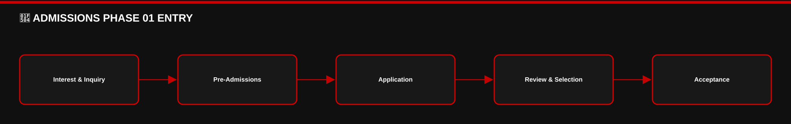

[View editable Mermaid diagram](./IMAGES/ADMISSIONS-PHASE-01-ENTRY.mmd)

### 🔄 ADMISSIONS PHASE 02 ENROLLMENT

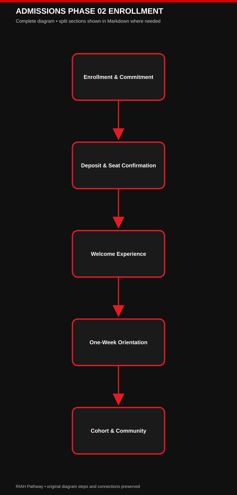

[View editable Mermaid diagram](./IMAGES/ADMISSIONS-PHASE-02-ENROLLMENT.mmd)

### 🔄 ADMISSIONS PHASE 03 COMPLETION

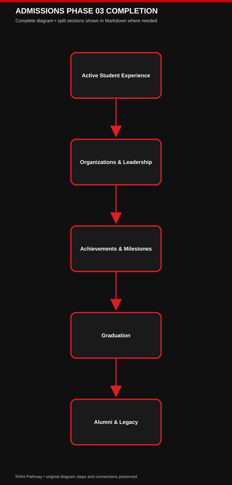

[View editable Mermaid diagram](./IMAGES/ADMISSIONS-PHASE-03-COMPLETION.mmd)

**Status:** Approved student-facing updates.  
This addendum preserves all preceding original draft content verbatim.  
Where an earlier draft describes a different platform, fee, deadline, or student-experience sequence, the explicitly labeled updates below supersede only that conflicting detail.  
This is a working website wireframe; unfinalized product mockups remain concepts.

**[IMAGE — RIAH PATHWAY COMPLETE 15-STAGE ADMISSIONS-TO-ALUMNI FLOW; RED, BLACK, WHITE, GOLD CROWN; DISTINCT DIGITAL, PHYSICAL AND COMMUNITY ICONS]**

**[ICON — MONTHLY ADMISSIONS CALENDAR]**

## 01 🔎 INTEREST & INQUIRY
**Delivery:** Digital.
**Experience:** Discover RIAH Pathway, its four schools, academic pathways, experiential programs and opportunities.
**Materials received:** Digital brochures, flyers, pamphlets, blogs, podcasts, social content, videos/vlogs, event and community-event information, school information, academic and experiential pathway guides, general information.

**[BUTTON — EXPLORE PATHWAYS → 03]**

## 02 📋 PRE-ADMISSIONS & PREPARATION
**Delivery:** Digital.
**Academic applicants:** Review eligibility, prerequisites, transcripts, documentation, academic level, school, major and preparation requirements.
**Experiential applicants:** Review eligibility, program-specific prerequisites, required documents, level/duration, preparation, placement and supervision requirements across Business, Technology, Homeland Security and Law.
**JD / Non-JD:** Review applicable law-pathway eligibility, prerequisites, supervision and preparation requirements.
**Materials received:** Pre-admissions guides, eligibility checklists, transcript and documentation requirements, pathway/school/major information, program-specific preparation materials.

**[BUTTON — PRE-ADMISSIONS → 11.2]**

## 03 📝 APPLICATION

### 🔄 APPLICATION REVIEW

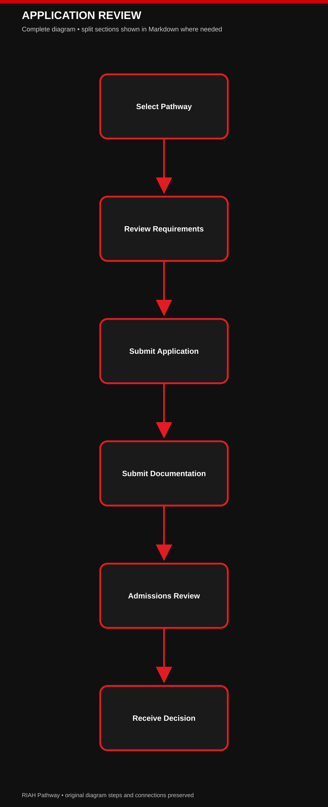

[View editable Mermaid diagram](./IMAGES/APPLICATION-REVIEW.mmd)

**Delivery:** Digital. **Platform:** Classe365. **Frequency:** Monthly admission cohorts for academic and experiential programs.
**Fee:** $50 non-refundable application processing fee for all academic and experiential programs.
**General testing:** No SAT, ACT or general writing assessment. Applicable pathway-specific requirements remain separate.
**Student actions:** Select school/pathway/major or experiential program, submit application and required documentation, pay application fee, meet applicable monthly deadline.
**Materials received:** Application checklist, required-document information, payment confirmation, application updates, intended cohort and next steps.

**[BUTTON — APPLY NOW → CLASSE365]**

## 04 ⚙️ ADMISSIONS REVIEW & EXPERIENTIAL SELECTION
**Delivery:** Digital.
**Academic route:** Completed application → eligibility and applicable pathway review → decision.
**Experiential route:** Completed application → application deadline → automated blind selection among eligible applicants → decision.
**Schools:** School of Business; School of Technology; School of Homeland Security; School of Law.
**Experiential selection:** Do not describe a general selection interview. Selection is automated and blind under applicable eligibility and capacity rules.
**Materials received:** Decision updates, selection notices, applicable cohort and deadline information.

**[ICON — AUTOMATED BLIND SELECTION]**

## 05 ✉️ ACCEPTANCE

### 🔄 ACCEPTANCE ENROLLMENT

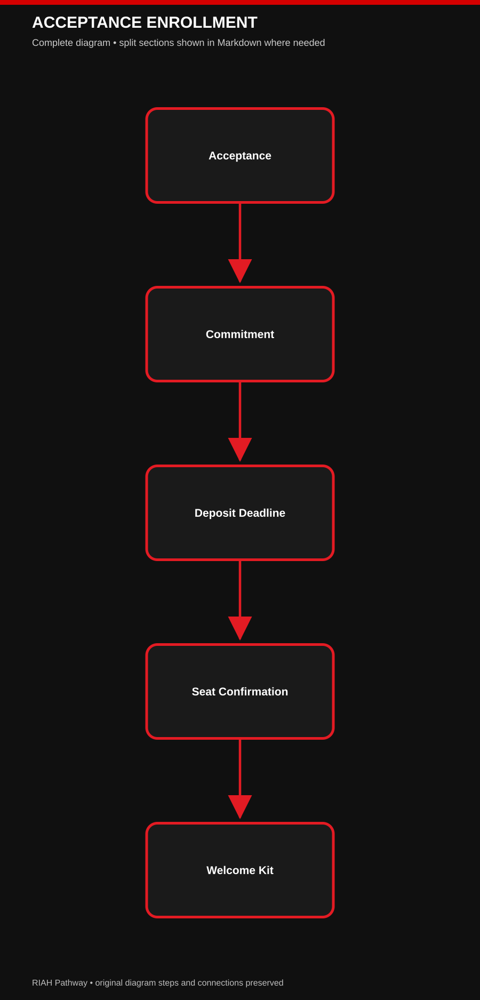

[View editable Mermaid diagram](./IMAGES/ACCEPTANCE-ENROLLMENT.mmd)

**Delivery:** Digital + Physical. **First mailed student touchpoint.**
**Materials received:** Digital acceptance, personalized mailed acceptance letter, branded envelope and seal, school-specific presentation, acceptance folder/package, congratulations materials, enrollment instructions, cohort/start information, deposit deadline.
**Experiential:** Selected applicants also receive experiential acceptance and next-step information.

**[IMAGE — SCHOOL-SPECIFIC ACCEPTANCE LETTER AND SEALED ENVELOPE WITH UNIFIED CROWN]**

## 06 ✍️ ENROLLMENT & COMMITMENT
**Delivery:** Digital.
**Student actions:** Accept offer, commit to RIAH Pathway, complete enrollment requirements and confirm upcoming monthly cohort; accept experiential offer where applicable.
**Materials received:** Enrollment confirmation, checklist, tuition and fee information, required-material information, deposit instructions and deadline, cohort/start details and next steps.

**[BUTTON — ENROLLMENT & COMMITMENT]**

## 07 💰 DEPOSIT & SEAT CONFIRMATION
**Delivery:** Digital / Financial.
**Required deposit:** $1,000 total = $500 institutional deposit portion + $500 allocation toward the Welcome Experience, applicable materials and software.
**Sequence:** Enrollment commitment → deposit deadline → payment → seat/cohort confirmation → Welcome Kit preparation and delivery.
**Welcome Kit restriction:** The full Welcome Kit is not shipped until the required deposit has been paid.
**Experiential capacity/deadline rule:** Accepted experiential applicants must pay by the first deposit deadline or forfeit their reserved seat.  
Vacancies are offered to other eligible/selected applicants with a second deadline; continue until capacity is reached.
**Academic cohort timing:** A student missing the applicable academic cohort deadline may enter a subsequent monthly cohort after satisfying requirements.
**Materials received:** Payment confirmation, seat/cohort confirmation, Welcome Kit preparation notice.

**[ICON — $1,000 DEPOSIT; $500 DEPOSIT + $500 MATERIALS]**
**[BUTTON — DEPOSIT INFORMATION → 12]**

## 08 🎁 WELCOME EXPERIENCE
**Delivery:** Digital + Physical + Community. **Trigger:** Deposit paid.
**Personalization layers:** RIAH Pathway core + entry status (new/transfer) + pathway/level + school + major/program + monthly cohort + orientation/community.
**Schools:** Business; Technology; Law; Homeland Security. School robes, scarves, bags and other items may have distinct school colors; visual designs remain concept-stage.
**Pathways/levels:** High School, GED, Associate's, Bachelor's, JD, Non-JD and applicable programs.
**Concept materials received:** Branded Welcome Box and letter; school robe, scarf, backpack/bag and gear; applicable books, workbooks, journals, planners, pathway/major materials, orientation workbook, cohort and student-success materials, ID/badge concepts, applicable software/materials.
**Transfer branch:** High School, GED, Associate's, Bachelor's, JD and Non-JD transfer entrants receive a transfer-specific welcome letter, transfer materials, orientation/credit-pathway information and resources, plus the standard personalized Welcome Experience.  
Transfer students then follow the same orientation, cohort, active student, graduation and alumni flow.

**[IMAGE — WELCOME BOX, ROBE, SCARF, BAG, BOOKS AND ORIENTATION MATERIALS]**
**[IMAGE — TRANSFER STUDENT BRANCH REJOINS STANDARD STUDENT JOURNEY]**

## 09 🧭 ONE-WEEK VIRTUAL ORIENTATION, ONBOARDING & TRAINING

### 🔄 ONBOARDING STUDENT EXPERIENCE

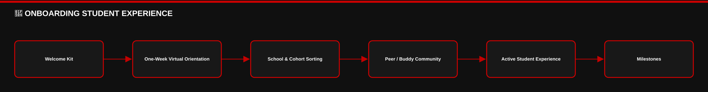

[View editable Mermaid diagram](./IMAGES/ONBOARDING-STUDENT-EXPERIENCE.mmd)

**Delivery:** Digital + Physical + Community. **Duration:** One full week, virtually.
**Training Pillar:** Supports academic ecosystem orientation, experiential preparation, and applicable JD/Non-JD supervision training.  
Students already have physical orientation materials in their Welcome Kits and also receive digital training materials.
**Academic training (all applicable academic pathways):** Institutional identity/dynasty, school and program expectations, navigating student resources and systems, academic policies, where to find support, opportunities, student organizations, honor societies, ambassadors, leadership, milestones, cohort communities and peer/buddy connections.
**Experiential training (all four schools and all experiential durations):** Shared cohort orientation plus school/program/assignment-specific breakout sessions.  
Examples: Business/Finance and Law/Criminal Justice.  
Training includes expectations, materials, placements and introductions to assigned supervisor, manager and reviewer.
**JD / Non-JD:** Applicable law-pathway supervision training, assigned law supervisor, placement/assignment details, expectations and resources.
**Assignments communicated during onboarding:** Experiential placement, supervisor, manager, reviewer and start details; JD/Non-JD supervisor and applicable assignment information.
**Materials received:** Orientation workbook, handbook, guide, digital training resources, planners/checklists, policies, student-success and school/program materials, cohort information and buddy details.
**LMS sequence:** LearnWorlds account is provisioned during onboarding, but actual course/program content remains gated until the Active Student Experience starts.
**Relevant finalized platforms:** SuiteDash for onboarding; Microsoft Teams for virtual orientation, training and breakout sessions; LearnWorlds for LMS.

**[IMAGE — ONE-WEEK TRAINING TIMELINE WITH COLLECTIVE SESSIONS AND SCHOOL-SPECIFIC BREAKOUTS]**
**[ICON — LMS PROVISIONED → CONTENT GATED → ACTIVE START UNLOCKS]**

## 10 👥 COHORT, SCHOOL & COMMUNITY
**Delivery:** Digital + Physical + Community.
**Placement:** Automated student sorting → monthly cohort → school community → cohort community → peer/buddy connection.
**Experience:** Human camaraderie, student-to-student engagement, school identity, group activities, shared cohort progress, student support.
**Materials/access received:** School and cohort community access, schedules, event details, community resources, student organization information, peer/buddy connection; applicable physical cohort items are already included in Welcome Kits.
**Relevant finalized platform:** SuiteDash student communities and communications. Prior Slack/Geneva references are superseded for this student-community function.

**[IMAGE — AUTOMATED COHORT AND SCHOOL COMMUNITY SORTING FLOW]**

## 11 🚀 ACTIVE STUDENT EXPERIENCE
**Delivery:** Digital + Physical + Community.
**Start:** LearnWorlds course/program content opens when the active program begins, following onboarding and the one-week training.
**Academic:** Coursework, school and major/program materials, student resources, school and cohort engagement, peer/buddy network.
**Experiential:** Assigned placements and experiential participation begin when applicable; supervisors, managers and reviewers remain involved.
**Law:** Applicable JD/Non-JD supervision and program participation.
**Student opportunities:** Ambassador Program, student organizations, professional and academic organizations, honor societies, leadership positions, community activities.
**Materials/access received:** Active LMS/course access, applicable academic/experiential materials, community and organization access, student support resources.

**[BUTTON — STUDENT PORTAL → SUITEDASH]**
**[ICON — LEARNWORLDS COURSE ACCESS OPEN]**

## 12 📣 STUDENT ORGANIZATIONS & LEADERSHIP
**Delivery:** Digital + Community; applicable physical recognition.
**Participation:** Ambassador Program (participation opportunities may also exist before enrollment); student leadership roles during active enrollment; discipline-specific professional and academic organizations; honor societies; school and cohort leadership.
**Benefits:** Eligible participation may contribute to planned milestone points, leadership recognition and qualifying tuition-reimbursement opportunities.
**Materials/opportunities:** Organization information, leadership opportunities, ambassador resources, recognition and student engagement.
**Wireframe treatment:** May appear as a subsection of Active Student Experience rather than an additional navigation page.

**[ICON — AMBASSADOR, HONOR SOCIETY AND STUDENT LEADERSHIP]**

## 13 🏆 ACHIEVEMENTS & MILESTONES
**Delivery:** Digital + Physical + Community. **Timing:** Throughout active enrollment, not only at graduation.
**Eligible areas:** Academics, experiential achievement, ambassadors, leadership, student organizations, honor societies, cohort and community participation.
**Recognition concepts:** Honor cords, certificates, medals, awards, plaques, trophies, class rings, technology/gadget rewards, academic honors, leadership and experiential recognition.
**Applicable opportunities:** Scholarships, grants, stipends, tuition-reimbursement eligibility and milestone/point recognition, subject to qualifying rules.
**Relevant finalized platform:** Merit Pages only if a student-recognition platform is identified in existing wireframe sections; do not add unrelated system descriptions.

**[IMAGE — MILESTONE AWARDS, HONOR CORDS, CLASS RINGS, TROPHIES]**

## 14 🎓 GRADUATION EXPERIENCE

### 🔄 GRADUATION ALUMNI

[View editable Mermaid diagram](./IMAGES/GRADUATION-ALUMNI.mmd)

**Delivery:** Digital + Physical + Ceremonial / Community.
**U.S. regions:** North, South, East, West. Graduates may choose regional in-person graduation or virtual participation; venue size depends on attendance.
**International:** Virtual graduation option.
**Concept materials:** Graduation robe/regalia, cap, tassel, earned honor cords, diploma, diploma case/cover, diploma/picture frame, graduation package, class ring, yearbook/keepsakes, program and recognition items.
**Fee treatment:** Applicable standard graduation materials are planned into overall tuition/student fees, subject to finalized fee schedule; not an automatic new graduation purchase.
**Virtual ceremony technology:** Microsoft Teams is the finalized virtual meeting reference, superseding earlier Zoom mentions in this function.

**[IMAGE — NORTH / SOUTH / EAST / WEST REGIONAL GRADUATION AND VIRTUAL OPTION]**

## 15 👑 ALUMNI & LEGACY
**Delivery:** Digital + Physical + Community.
**Experience:** Transition into alumni community, continued professional connections, networking, career resources, mentorship, alumni events and institutional legacy.
**Materials/access received:** Mailed Alumni/Legacy Kit, alumni welcome and keepsake materials, alumni community access, networking, career and mentorship resources, event information.

**[IMAGE — ALUMNI LEGACY KIT AND COMMUNITY]**

## 📅 MONTHLY ADMISSIONS & COHORT CYCLE

**[ICON — MONTHLY CALENDAR]**
**All academic and experiential programs use monthly admissions cohorts**, rather than unrestricted daily entry.  
This allows time for application processing, decisions, applicable aid and accreditation-related preparation, deposit deadlines, seat/capacity confirmation, Welcome Kit fulfillment, one-week orientation/training, student-community placement and program activation.  
Accreditation or Title IV participation must not be represented as already approved unless separately verified.

**Application + $50 fee  
→ Monthly deadline  
→ Academic review / blind experiential selection  
→ Acceptance  
→ Enrollment commitment  
→ $1,000 deposit deadline  
→ Seat/cohort confirmation  
→ Welcome Kit  
→ One-week virtual orientation/training  
→ School/cohort/buddy community  
→ Applicable experiential/law assignments  
→ Active LMS/program access  
→ Milestones  
→ Graduation  
→ Alumni.**

## 🌐 PUBLIC WEBSITE FLOW — ADMISSIONS

### 🔄 TRANSFER STUDENT JOURNEY

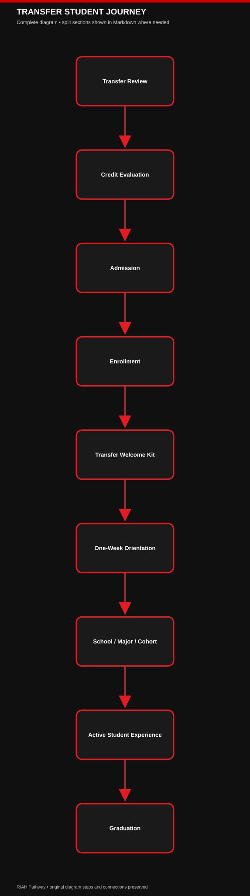

[View editable Mermaid diagram](./IMAGES/TRANSFER-STUDENT-JOURNEY.mmd)

**[IMAGE — NUMBERED 15-STEP STUDENT JOURNEY WITH EMOJI-STYLE ICONS AND DELIVERY LEGEND]**
1. **#:** 01 🔎 → **Stage:** Interest & Inquiry → **Student-Facing Summary:** Discover RIAH Pathway and its schools/programs → **Delivery:** Digital
2. **#:** 02 📋 → **Stage:** Pre-Admissions & Preparation → **Student-Facing Summary:** Review academic/experiential requirements → **Delivery:** Digital
3. **#:** 03 📝 → **Stage:** Application → **Student-Facing Summary:** Apply for monthly cohort; $50 non-refundable fee → **Delivery:** Digital
4. **#:** 04 ⚙️ → **Stage:** Review & Selection → **Student-Facing Summary:** Academic review; automated blind experiential selection → **Delivery:** Digital
5. **#:** 05 ✉️ → **Stage:** Acceptance → **Student-Facing Summary:** Receive digital and mailed acceptance → **Delivery:** Digital + Physical
6. **#:** 06 ✍️ → **Stage:** Enrollment & Commitment → **Student-Facing Summary:** Accept offer and confirm cohort intentions → **Delivery:** Digital
7. **#:** 07 💰 → **Stage:** Deposit & Seat Confirmation → **Student-Facing Summary:** Pay $1,000 by deadline; confirm seat → **Delivery:** Digital
| Row | # | Stage | Student-Facing Summary | Delivery |
| --- | --- | --- | --- | --- |
| 8 | 08 🎁   | Welcome Experience   | Receive personalized kit and community information   | Digital + Physical + Community |
| 9 | 09 🧭   | One-Week Orientation & Training   | Academic, experiential and applicable law supervision training; LMS provisioned   | Digital + Physical + Community |
| 10 | 10 👥   | Cohort, School & Community   | School group, cohort group and peer/buddy connection   | Digital + Physical + Community |
| 11 | 11 🚀   | Active Student Experience   | LearnWorlds opens; academics/experiential begin   | Digital + Physical + Community |
| 12 | 12 📣   | Organizations & Leadership   | Ambassadors, honor societies, organizations and leadership   | Digital + Community |
| 13 | 13 🏆   | Achievements & Milestones   | Recognition and qualifying opportunities throughout enrollment   | Digital + Physical + Community |
| 14 | 14 🎓   | Graduation   | Regional in-person or virtual ceremony and materials   | Digital + Physical + Community |
| 15 | 15 👑   | Alumni & Legacy   | Alumni Kit, community, networking and mentorship   | Digital + Physical + Community |

## 🔄 LIMITED SUPERSEDED TECH STACK REFERENCES — ADMISSIONS ONLY

### 🔄 TECHNOLOGY STUDENT FLOW

[View editable Mermaid diagram](./IMAGES/TECHNOLOGY-STUDENT-FLOW.mmd)

| Row | Student-facing function | Superseded reference | Current reference | Scope |
| --- | --- | --- | --- | --- |
| 1 | Applications / admissions   | No change   | Classe365   | Retain existing application references |
| 2 | Onboarding / student portal   | No change   | SuiteDash   | Retain existing onboarding references |
| 3 | Virtual orientation / training / cohort sessions   | Zoom   | Microsoft Teams   | Use Teams for student-facing virtual sessions |
| 4 | Student school/cohort communities   | Slack; Geneva   | SuiteDash   | Use SuiteDash for student community |
| 5 | LMS / active course access   | No change   | LearnWorlds   | Provision during onboarding; open course access at active start |
| 6 | Experiential placement functions   | Earlier references if any   | PeopleGrove CORE + Experience Hub + CompMS   | Update only existing relevant placement-system mentions |
| 7 | Career services   | Earlier references if any   | Symplicity CSM   | Update only existing relevant career-service mentions |
| 8 | Student recognition   | Earlier references if any   | Merit Pages   | Update only existing relevant recognition-system mentions |

**Technology limitation:** Do not copy the finalized tech-stack document into this wireframe.  
Do not add internal infrastructure, cybersecurity architecture, private databases, proprietary curriculum systems, or unrelated software.  
Existing original wireframe source text remains preserved above; this addendum governs only the specifically superseded Admissions student-experience references.

**[BUTTON — APPLY NOW → CLASSE365]**

**[BUTTON — PRE-ADMISSIONS → 11.2]**
**[BUTTON — ACCEPTANCE & ENROLLMENT → 11.4]**

**[BUTTON — STUDENT EXPERIENCE → 11.5]**
**[BUTTON — GRADUATION & ALUMNI → 11.6]**

**[BUTTON — TRANSFER STUDENTS → 11.8]**

---

## ADMISSIONS FLOW DIAGRAMS — MERMAID

**[IMAGE — BLACK AND RED ADMISSIONS FLOW DIAGRAMS]**

### FLOW 01 ADMISSIONS TO ALUMNI

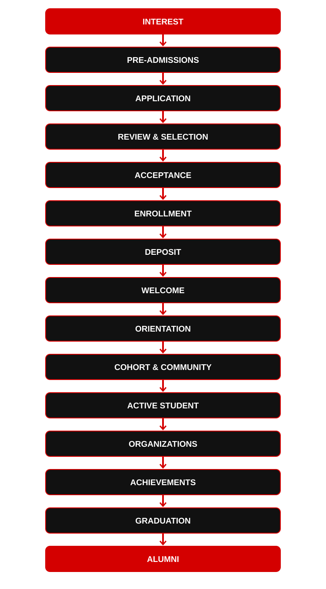

[VIEW EDITABLE MERMAID DIAGRAM](./IMAGES/FLOW-01-ADMISSIONS-TO-ALUMNI.mmd)

### FLOW 02 EXPERIENTIAL SELECTION AND SEAT

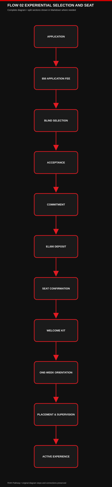

[VIEW EDITABLE MERMAID DIAGRAM](./IMAGES/FLOW-02-EXPERIENTIAL-SELECTION-AND-SEAT.mmd)

### FLOW 03 TRANSFER STUDENT JOURNEY

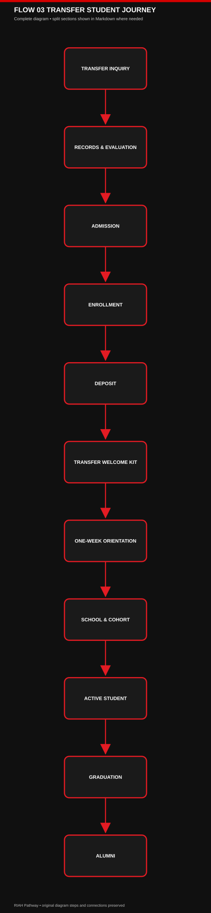

[VIEW EDITABLE MERMAID DIAGRAM](./IMAGES/FLOW-03-TRANSFER-STUDENT-JOURNEY.mmd)

### FLOW 04 ORIENTATION AND LMS ACCESS

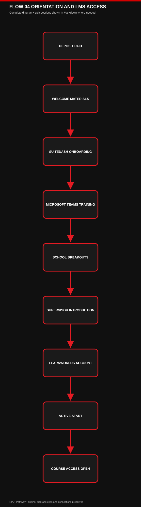

[VIEW EDITABLE MERMAID DIAGRAM](./IMAGES/FLOW-04-ORIENTATION-AND-LMS-ACCESS.mmd)

---
