# 👑 RIAH PATHWAY — 11.2 PRE-ADMISSIONS WIREFRAME
## I. PRE-ADMISSIONS HERO

**[ICON — ADMISSIONS CHECKLIST]**
# KNOW YOUR PATH BEFORE YOU APPLY.
Pre-Admissions helps prospective students understand academic, professional, experiential, and other applicable requirements before submitting an application.

**[IMAGE — STUDENT REVIEWING REQUIREMENTS]**
**[BUTTON 11-P01 — PRE-ADMISSIONS → SUITEDASH FORM]**
## II. 11.2.1 — GENERAL ADMISSIONS
**Academic Eligibility**  
• Pathway Eligibility  
• Prior Education  
• Applicable Age and Grade Requirements  
• Program Prerequisites  
• Professional Requirements  
• Jurisdictional Requirements**
| Document Category | Purpose |
| --- | --- |
| Official Transcripts | Academic history |
| Prior College Records | Previous coursework |
| Academic Credentials | Completed education |
| Transfer Documentation | Eligible transfer credit |
| Alternative Credit Records | Alternative credit |
| Certification Records | Certifications |
| Additional Documentation | Pathway requirements |
Missing prerequisite courses must be completed before admission into the requested level.
**Background Checks — Where Required • Character and Fitness — Where Required • International Records — Where Applicable**
### Applicants Younger Than 18 — Permissions and Eligibility

**Minors under 18 may apply** to eligible education and Experiential programs, subject to academic and jurisdictional conditions.

| Pathway | Under-18 Prerequisite |
| --- | --- |
| Experiential | **Parent or legal guardian must sign required permission and placement forms before any Experiential work starts.** Check major coursework, level-specific experience, lawful work scope, hours and supervision. |
| Education/Degree | Minors with completed college coursework may apply to eligible programs after review of records and applicable academic and enrollment rules. |
| High School Dual Enrollment | **Both signed parent/legal-guardian permission and high school guidance counselor approval** are required before college-course enrollment, in addition to academic and school requirements. |

**Experiential location:** Internal RIAH Pathway placement = **remote only**. Approved external partner placement = **remote, hybrid, or on-site**, only as permitted by laws applying to the minor and its authorized duties, hours and supervision.

### Standalone Review Products

**Certification Review and Bar Review have no RIAH Pathway admissions requirements; they are standalone products.** Purchase does not establish eligibility for an external certification examination, bar examination, or professional license.

**[BUTTON 11-P02 — PRE-ADMISSIONS → SUITEDASH FORM]**
**[DOWNLOAD — PRE-ADMISSIONS CHECKLIST]**
## III. 11.2.2 — SCHOOL AND MAJOR ADMISSION

**[IMAGE — FOUR SCHOOL CARDS]**
| School | Admissions Considerations |
| --- | --- |
| Business | Academic eligibility, major, prerequisites |
| Homeland Security | Academic eligibility, major, professional requirements |
| Law | Academic eligibility, law pathway, jurisdiction |
| Technology | Academic eligibility, major, prerequisites |

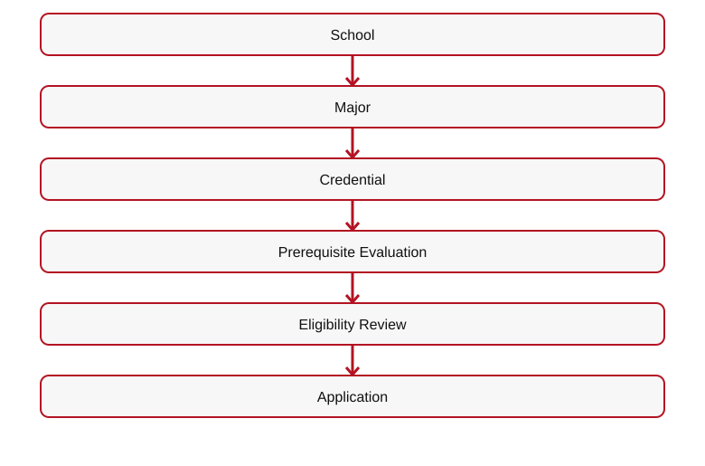
[Mermaid source](IMAGES/11.1-PRE-ADMISSIONS-FLOW-01.mmd)

### Year 3

**[ICON — ACADEMIC PROGRESSION]**
**Year 3 requires completed General Education AND School Core.**
**Tuition and transfer timing:** Whether the student completes the foundational requirements through approved outside courses or through RIAH, **program tuition remains the same**. A student may finish eligible outside coursework in as little as **one month** and, if admitted and otherwise eligible, complete the remaining RIAH-controlled coursework in **another month**; timing varies and any required program minimums remain controlling. **Transfer affects acceleration, not tuition.**
**Highly recommended — bachelor's Year 3 preparation:** Complete the applicable **General Education and School Core** requirements before seeking admission into Year 3, with a target of **up to 60 approved foundational transfer credits** where applicable. Sources for individualized evaluation include **Sophia.org, StraighterLine, accredited colleges/universities, AP, IB, SAT, ACT, CLEP, or approved RIAH placement/test-out**. Alternative coursework, examination results, and placement scores require RIAH course-level equivalency review; **SAT/ACT scores do not automatically confer college credit**. Each school's actual core still controls (the School of Technology core, for example, is 39 credits). Applicants without all approved foundational coursework complete the missing General Education and School Core courses through RIAH before Year 3. Submit external credits in the initial transfer evaluation window; **bachelor's Years 3–4 use RIAH-controlled coursework and do not accept outside transfer credit**.

**Accessible, affordable, and rigorous acceleration:** Eligible students may progress through RIAH Year 3–4 courses at an accelerated pace, but must pass each required **proctored objective and performance assessment at 80% or higher**, plus any other required examinations, prerequisites, projects, capstones, and supervision. **One month is the earliest potential curriculum-completion timeframe where permitted**, not a completion promise for every program or credential.
**RIAH's post-transfer academic rigor is unchanged:** Bachelor's **Years 3 and 4** remain RIAH-controlled, and **master's, MBA, and J.D.** coursework remains subject to each program's established admissions, progression, and degree requirements. Required courses use **proctored objective assessments, performance assessments, or both**, with **ProctorU** as RIAH's assessment-proctoring platform; the required assessment passing threshold is **80% or higher**, along with any other course tests, projects, professional oversight, and **supervised capstones where applicable**. A transfer or accelerated pace waives none of these requirements. All applicable mandatory program-duration, credentialing, authorization, and payment rules still apply.
**Submit Transcripts**  

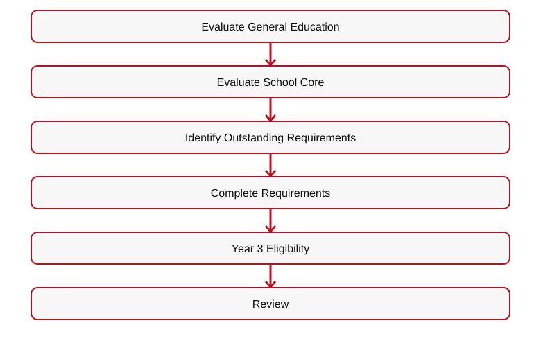
[Mermaid source](IMAGES/11.1-PRE-ADMISSIONS-FLOW-02.mmd)

| Requirement | Standard |
| --- | --- |
| General Education | Completed |
| School Core | Completed |
| Prior Records | Submitted |
| Outstanding Prerequisites | Completed before Year 3 |
| Major Coursework | Approved academic pathway |

**[BUTTON 11-P03 — DEGREE PROGRAMS → 04]**
**[BUTTON 11-P04 — CURRICULUM → 10]**
### Minor

**[ICON — MINOR PROGRAM]**
**Formal admission to a minor is granted after successfully completing the first required course in that minor AND all prerequisites for that first course.** The student may complete entry coursework before the minor is formally added.

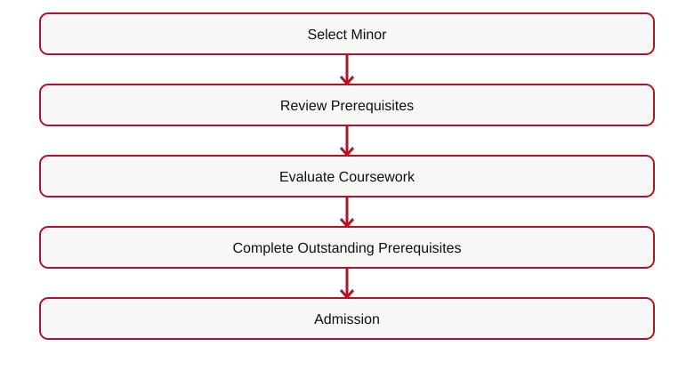
[Mermaid source](IMAGES/11.1-PRE-ADMISSIONS-FLOW-03.mmd)

| Requirement | Standard |
| --- | --- |
| Selected Minor | Identified |
| Prerequisites for First Minor Course | Completed |
| First Required Minor Course | Successfully completed |
| Prior Coursework | Evaluated |
| Formal Minor Admission | Minor added once both conditions are verified |
**Computer Science minor example:** The student completes **College Algebra** and **Principles of Computer Science**, and then the Computer Science minor is formally added; the remaining minor coursework can follow. This differs from the Computer Science **Experiential** prerequisite of Introduction to Computer Science.

**[BUTTON 11-P05 — MINOR PROGRAMS → 04]**
### Master's and MBA

**[ICON — GRADUATE DEGREE]**
**Master's: Applicable Bachelor's Degree OR Accepted Equivalent; missing program prerequisites completed before admission.**
**MBA: Applicable Bachelor's Degree OR Accepted Equivalent; missing business or other MBA prerequisites completed before admission.**
| Requirement | Master's | MBA |
| --- | --- | --- |
| Bachelor's Degree | Applicable or accepted equivalent | Applicable or accepted equivalent |
| Academic Evaluation | Required | Required |
| Program Prerequisites | Required | Required |
| Missing Prerequisites | Completed before admission | Completed before admission |
| Decision | After requirements | After requirements |

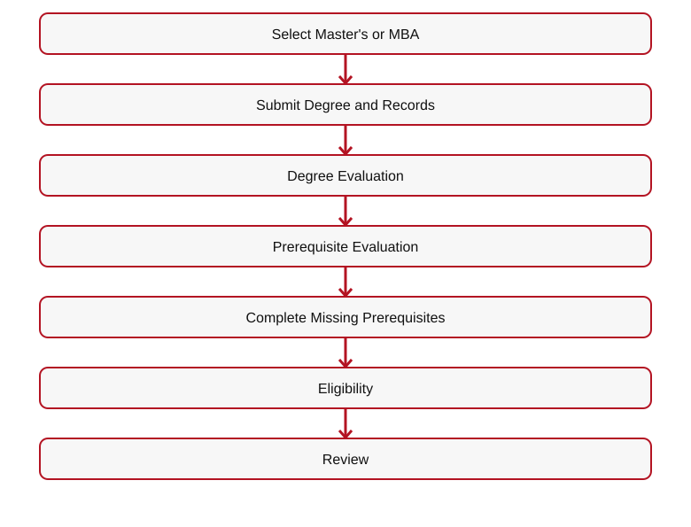
[Mermaid source](IMAGES/11.1-PRE-ADMISSIONS-FLOW-04.mmd)

**[BUTTON 11-P06 — MASTER'S → 04]**
**[BUTTON 11-P07 — MBA → 04]**
## IV. 11.2.3 — EXPERIENTIAL PRE-ADMISSIONS

**[ICON — PROFESSIONAL BRIEFCASE]**
Applicants must meet experience-level requirements AND academic prerequisites; review includes placement, supervision, and capacity.
**Per-major Experiential pre-admissions must identify BOTH the required coursework for that major and the verified experience for the selected Apprentice/Intern/Associate/Senior Associate/Manager/Executive level.** Complete those standards before opening any major/level for admission.
| Category | Structure |
| --- | --- |
| Single-Area | One professional area |
| Rotational | Multiple approved functions, departments, areas, entities |
| Progressive | Advancement through eligible levels |

**[IMAGE — SIX-LEVEL EXPERIENTIAL LADDER]**
| Level | Duration | Experience Requirement |
| --- | --- | --- |
| Apprentice | 1 Month | Little to no prior professional experience |
| Intern | 3 Months | Foundational experience or qualifications |
| Associate | 1 Year | Associate-level experience and prerequisites |
| Senior Associate | 1 Year | Advanced experience and prerequisites |
| Manager | 1 Year | Management-level experience and prerequisites |
| Executive | 1 Year | Executive-level experience and prerequisites |
### Academic Prerequisites
**Accounting: Financial Accounting AND Managerial Accounting.**
**Computer Science: Introduction to Computer Science.**
**Other Approved Majors: Major-specific prerequisite courses.**
| Area | Prerequisites |
| --- | --- |
| Accounting | Financial and Managerial Accounting |
| Computer Science | Introduction to Computer Science |
| Other Majors | Applicable courses |
| Advanced Levels | Coursework plus professional experience |
**Experience by level:** Apprentice — little/no prior experience; Intern — applicable foundation/qualifications; Associate — some relevant experience; Senior Associate — at least one year relevant experience; Manager — Senior Associate-level experience; Executive — at least one year of Manager-level experience. All levels also satisfy their approved major's applicable coursework.

**Under 18:** Signed parent/legal-guardian consent and placement forms are prerequisites before Experiential work. Internal placement remote only; external remote/hybrid/on-site only where legally permitted.
**Select Area**  

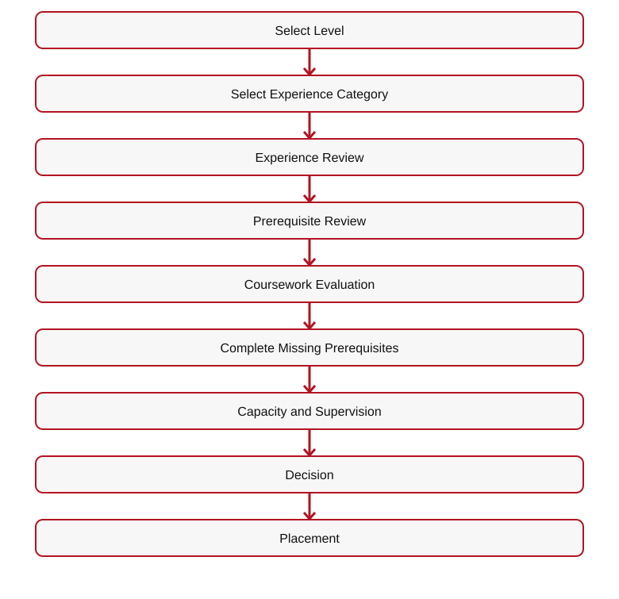
[Mermaid source](IMAGES/11.1-PRE-ADMISSIONS-FLOW-05.mmd)

### Rotational Experience
**Additional Rotational Tuition: $5,000. Associate Experiential $10,000; Associate with Rotational Experience $15,000.**
Approval subject to capacity, resources, supervision, coordination, requirements.
### Progressive Experience

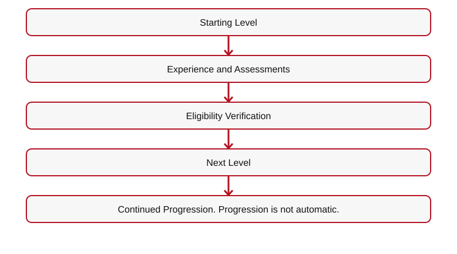
[Mermaid source](IMAGES/11.1-PRE-ADMISSIONS-FLOW-06.mmd)

**[IMAGE — SINGLE-AREA, ROTATIONAL, PROGRESSIVE COMPARISON]**
**[BUTTON 11-P08 — EXPERIENTIAL → 05]**

**[BUTTON 11-P09 — LEVELS AND DURATIONS → 5.2]**
**[BUTTON 11-P10 — INTERNAL PLACEMENTS → 5.5]**

**[BUTTON 11-P11 — EXTERNAL PLACEMENTS → 5.6]**
## V. 11.2.4 — HIGH SCHOOL ADMISSIONS

**[IMAGE — GRADES 9–12 PROGRESSION]**
# HIGH SCHOOL DIPLOMA + CONCURRENT COLLEGE COURSEWORK
**Initial States: Ohio • Florida • Texas.** Planned expansion to all 50 states and Washington, D.C., subject to authorization.
| Student | Requirement |
| --- | --- |
| Eighth Grade Entering Ninth | Eighth-grade transcript; ninth-grade entry |
| Current Ninth | High school transcript |
| Current Tenth | Transcript, grade and credit evaluation |
| Current Eleventh | Transcript, grade and credit evaluation |
| Current Twelfth | Transcript, grade and credit evaluation |

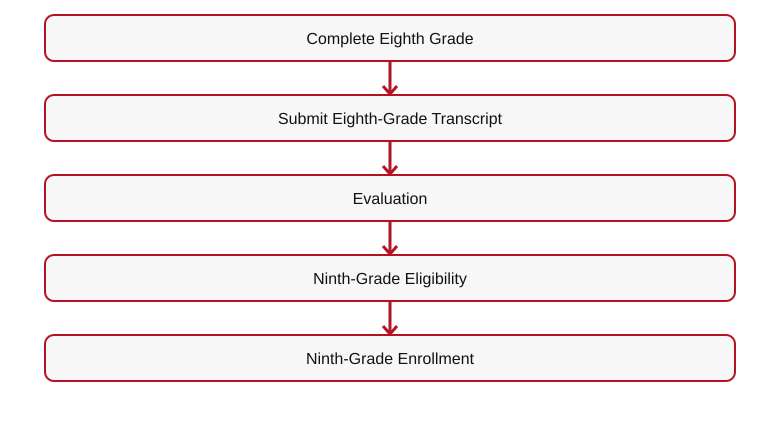
[Mermaid source](IMAGES/11.1-PRE-ADMISSIONS-FLOW-07.mmd)

Grades 9–12 submit transcripts to evaluate completed courses, credits, grade, remaining diploma requirements, eligible concurrent college courses.
**High school dual enrollment for students under 18:** Obtain **both parent/legal-guardian signed authorization and high school guidance counselor approval** before entry into college/degree courses. Verify transcripts, courses, prerequisites and any jurisdictional conditions. Minors with prior college coursework may apply to eligible education programs.

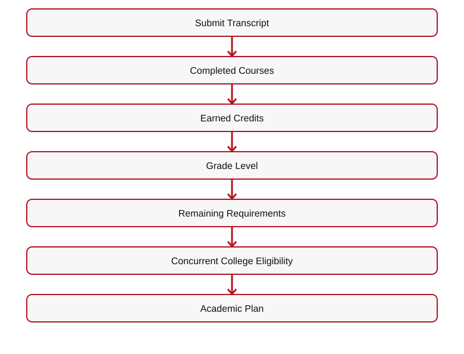
[Mermaid source](IMAGES/11.1-PRE-ADMISSIONS-FLOW-08.mmd)

| Evaluation Area | Purpose |
| --- | --- |
| Current Grade | Grade 9–12 placement |
| Completed Courses | Previous coursework |
| Earned Credits | Credit recognition |
| Remaining Requirements | Graduation coursework |
| Concurrent College | College opportunities |
| Academic Plan | Remaining courses |

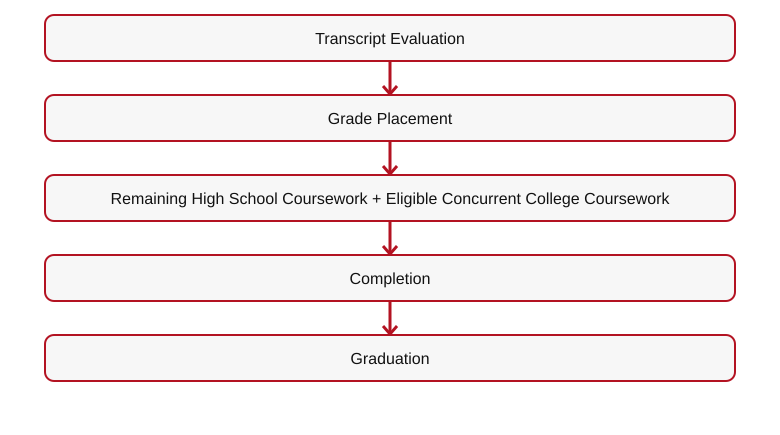
[Mermaid source](IMAGES/11.1-PRE-ADMISSIONS-FLOW-09.mmd)

**[BUTTON 11-P12 — HIGH SCHOOL → 06]**
**[BUTTON 11-P13 — HIGH SCHOOL PRE-ADMISSIONS → SUITEDASH FORM]**

**[DOWNLOAD — HIGH SCHOOL TRANSCRIPT EVALUATION CHECKLIST]**
## VI. 11.2.5 — GED/HSE ADMISSIONS

**[IMAGE — GED/HSE STUDENT WITH CONCURRENT COLLEGE COURSEWORK]**
# EARN YOUR GED/HSE WHILE PURSUING COLLEGE CREDIT.
Eligible students who did not complete high school submit prior high school transcript or available academic record showing noncompletion.
**GED/HSE Preparation + Concurrent College Coursework = 12 COLLEGE CREDIT HOURS.**
**Noncompletion**  

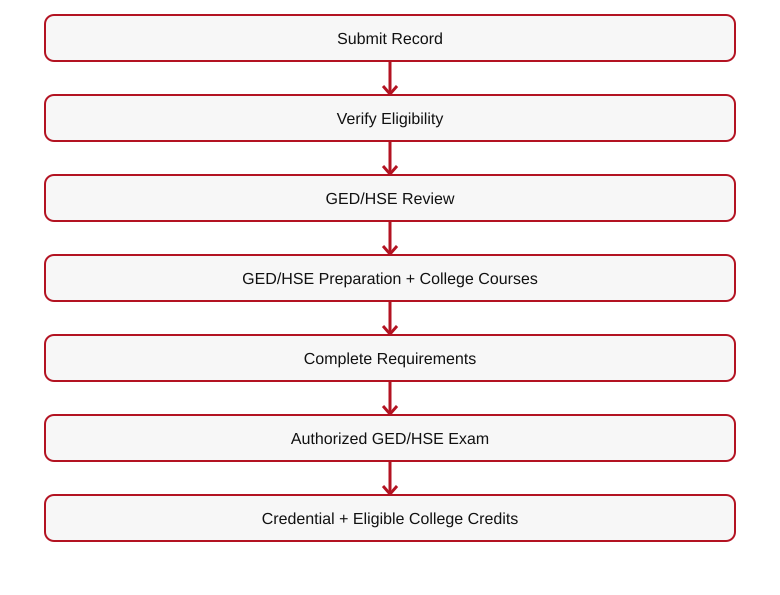
[Mermaid source](IMAGES/11.1-PRE-ADMISSIONS-FLOW-10.mmd)

| Component | Requirement |
| --- | --- |
| Prior High School Completion | Must not already hold diploma |
| Academic Record | Transcript or available record |
| GED/HSE Preparation | Applicable preparation |
| Concurrent College Courses | Approved courses |
| College Credit Opportunity | 12 hours |
| GED/HSE Examination | Authorized exam |
| Credential | Applicable requirements |

**[BUTTON 11-P14 — GED/HSE → 07]**
**[BUTTON 11-P15 — GED/HSE PRE-ADMISSIONS → SUITEDASH FORM]**

**[DOWNLOAD — GED/HSE ADMISSIONS CHECKLIST]**
## VII. 11.2.6 — LAW PRE-ADMISSIONS
**J.D. • Non-J.D. Bar License • Criminal Justice**
Applicable academic, professional, background, character-and-fitness, supervision, and jurisdictional reviews. Admission does not independently establish bar or licensure eligibility.
**Bar Review is a standalone review product and requires no institutional admission.** Jurisdictional exam/licensure qualifications remain separate.

**[BUTTON 11-P16 — LAW PATHWAYS → 4.4]**
**[BUTTON 11-P17 — BAR REVIEW → 09]**
## VIII. PRE-ADMISSIONS DOWNLOADS

**[DOWNLOAD — PRE-ADMISSIONS CHECKLIST]**
**[DOWNLOAD — HIGH SCHOOL TRANSCRIPT EVALUATION CHECKLIST]**

**[DOWNLOAD — GED/HSE ADMISSIONS CHECKLIST]**
**[DOWNLOAD — YEAR 3 PREREQUISITE CHECKLIST]**

**[DOWNLOAD — MINOR PROGRAM PREREQUISITE CHECKLIST]**
**[DOWNLOAD — MASTER'S AND MBA PREREQUISITE CHECKLIST]**

**[DOWNLOAD — EXPERIENTIAL PREREQUISITE CHECKLIST]**
## IX. FINAL CTA

**[BUTTON 11-P18 — APPLY NOW → 11.3]**
**[BUTTON 11-P19 — CONTACT ADMISSIONS → 19.2]**
**[ROUTING TABLE — SEE 11-ADMISSIONS-WIREFRAMES-CTA-LINKS-ROUTING.md]**

## X. ADDITIONAL PRE-ADMISSIONS FLOW DETAIL
### Year 3 Eligibility
**Submit Academic Transcripts**  

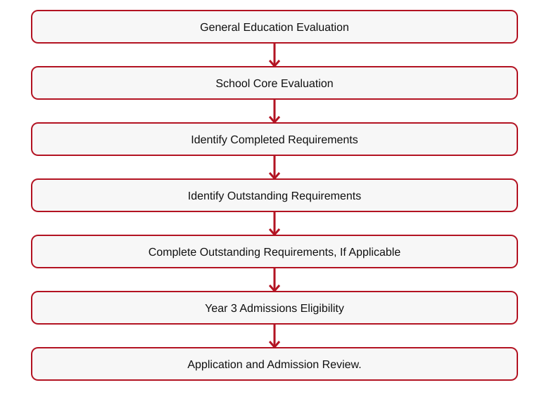
[Mermaid source](IMAGES/11.1-PRE-ADMISSIONS-FLOW-11.mmd)

| Requirement | Admissions Standard |
| --- | --- |
| General Education | Must be completed |
| School Core | Must be completed |
| Prior Academic Records | Must be submitted for evaluation |
| Outstanding Prerequisites | Must be completed before Year 3 admission |
| Major Coursework | Begins according to the approved academic pathway |
### Minor Admissions

**Formal minor addition:** The first required course AND its prerequisites must be complete. Computer Science: College Algebra and Principles of Computer Science.
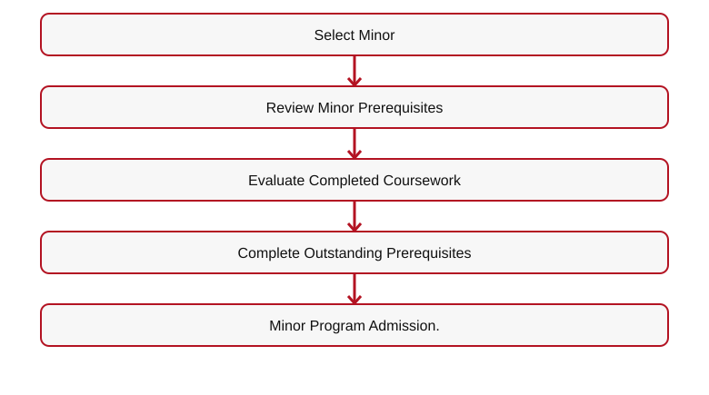
[Mermaid source](IMAGES/11.1-PRE-ADMISSIONS-FLOW-12.mmd)

### Graduate Admissions
**Select Master's or MBA**  

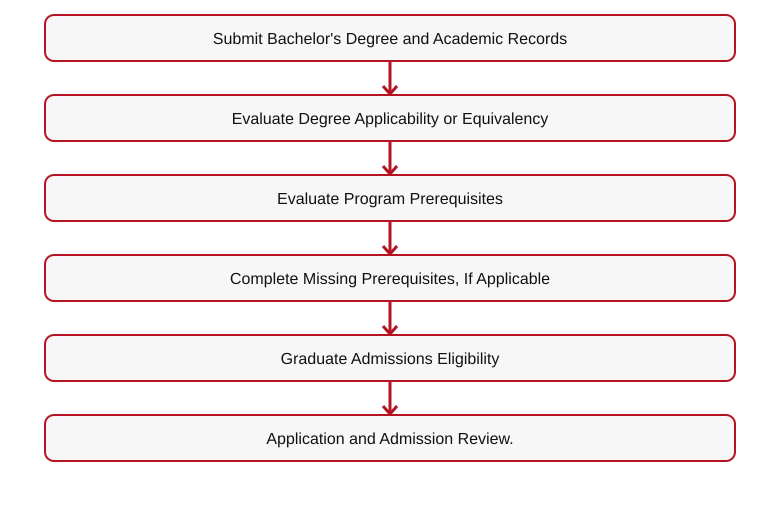
[Mermaid source](IMAGES/11.1-PRE-ADMISSIONS-FLOW-13.mmd)

### High School Eligibility and Placement
**Ohio • Florida • Texas**, expanding to all 50 states and Washington, D.C., subject to authorization.

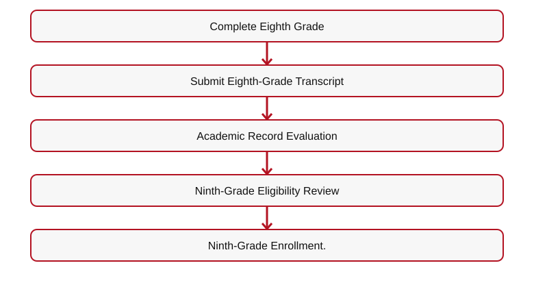
[Mermaid source](IMAGES/11.1-PRE-ADMISSIONS-FLOW-14.mmd)

**Submit Transcript**  

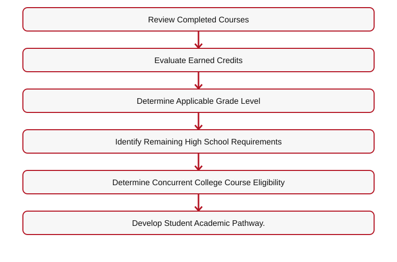
[Mermaid source](IMAGES/11.1-PRE-ADMISSIONS-FLOW-15.mmd)

### GED/HSE
**Did Not Complete High School**  

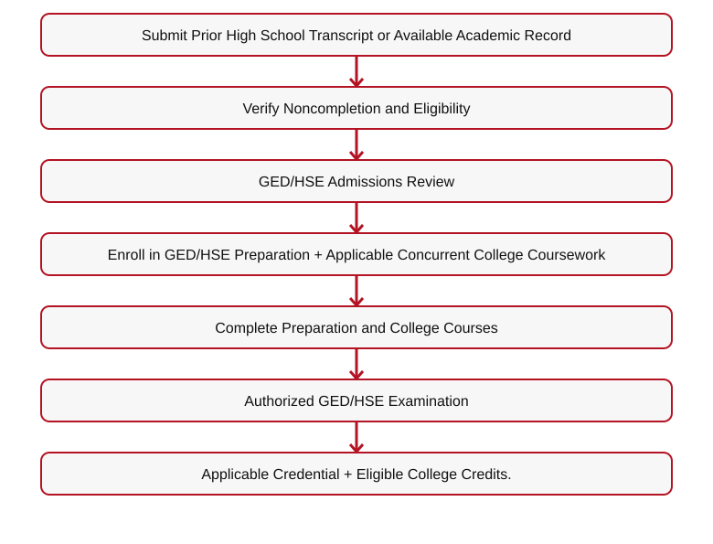
[Mermaid source](IMAGES/11.1-PRE-ADMISSIONS-FLOW-16.mmd)

### Experiential Major Prerequisites
| Area | Required Foundational Coursework |
| --- | --- |
| Accounting | Financial Accounting and Managerial Accounting |
| Computer Science | Introduction to Computer Science |
| Other Approved Majors | Applicable major-specific prerequisite courses |
| Advanced Levels | Academic prerequisites plus required professional experience |
**Select Experiential Area**  

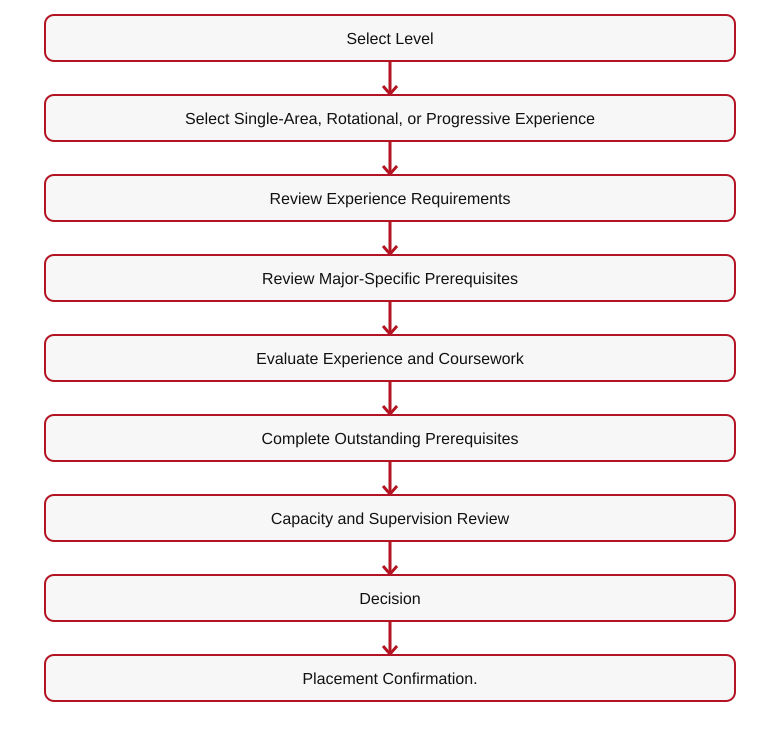
[Mermaid source](IMAGES/11.1-PRE-ADMISSIONS-FLOW-17.mmd)

**[DOWNLOAD — YEAR 3 PREREQUISITE CHECKLIST]**
**[DOWNLOAD — MINOR PROGRAM PREREQUISITE CHECKLIST]**

**[DOWNLOAD — MASTER'S AND MBA PREREQUISITE CHECKLIST]**
**[DOWNLOAD — HIGH SCHOOL TRANSCRIPT EVALUATION CHECKLIST]**

**[DOWNLOAD — GED/HSE ADMISSIONS CHECKLIST]**
**[DOWNLOAD — EXPERIENTIAL PREREQUISITE CHECKLIST]**

---

## ORIGINAL ADMISSIONS MAIN WIREFRAME — 11.2 CROSS-REFERENCE

## V. PRE-ADMISSIONS OVERVIEW

**[ICON — ADMISSIONS CHECKLIST]**
# KNOW YOUR PATH BEFORE YOU APPLY.

### Numbered Subpage References

1. **11.2.1** — General Admissions — Eligibility, documentation, academic standing
2. **11.2.2** — School and Major — Year 3, minors, master's, MBA, prerequisites
3. **11.2.3** — Experiential — Levels, placements, prerequisites
4. **11.2.4** — High School — Grades 9–12, transcripts, concurrent coursework
5. **11.2.5** — GED/HSE — Preparation and 12 college credits
6. **11.2.6** — Law — J.D., Non-J.D., applicable requirements

**[BUTTON 11-M07 — PRE-ADMISSIONS → 11.2]**

---

**Transfer eligibility clarification:** J.D. transfer entry is available only after completion of Year 1 (1L), for up to 27 approved 1L credits; no transfers into J.D. Years 2, 3, or 4. Master's and MBA pathways each permit up to 9 approved transfer credits, subject to evaluation and applicable prerequisites.

## Transfer Credit Evaluation — One-Time Optional Service

| Component | Fee | Timing |
| --- | ---: | --- |
| Transfer credit evaluation (including alternative credit, prior learning, and applicable previous coursework) | $50 | After prerequisite/transcript eligibility review and before determining which credits apply |
| Processing and administration | $50 | Once the student is admitted to the applicable program/year and the transfer credit determination is processed |
| **Total when both services apply** | **$100** | **One-time; not charged twice for the same evaluation** |

The $100 is **not charged to every applicant**. It applies only to students requesting transfer credit evaluation and subsequent processing. Transcripts are submitted during pre-admissions and reviewed for prerequisite eligibility and outstanding requirements. Students meeting the applicable education admission requirements are admitted; the transfer credit evaluation determines which previous credits apply and which courses remain, rather than determining whether the student is admitted. Students with missing prerequisites are informed of the deficiencies and may return after completing them for a follow-up review without a second evaluation charge. For a Year 3 placement, the transfer evaluation and required prerequisites must be completed before Year 3 admission/placement. The $50 processing and administration portion is assessed only once the student is admitted to the applicable year or master's/MBA program. J.D. transfers are limited to up to 27 Year 1 (1L) credits and entry after Year 1; no transfers into J.D. Years 2–4. Master's and MBA transfer limits are 9 credits each.

**Admissions positioning:** Accessible education for applicants who meet program prerequisites; affordable program pricing; rigorous proctored assessments, performance assessments, and capstones. Educational admission is based on meeting published prerequisites and transcript requirements, not on purchasing the optional transfer credit evaluation service.

**Final transfer-credit restrictions (education pathways):** Associate's — up to 30 credits from general education, school core, or a combination of both. Bachelor's — up to 60 credits applicable only to general education and school core. Bachelor's Years 3 and 4 consist of RIAH Pathway coursework and do not accept transfer credits; no additional transfer credits may be added after the initial transfer evaluation and placement. Master's — up to 9 credits. MBA — up to 9 credits. J.D. — up to 27 approved first-year (1L) credits for entry after Year 1 only; no J.D. transfer into Years 2, 3, or 4. Transfer credit is determined once as part of the initial transfer evaluation; later additional transfer-credit submissions are not accepted. High School and GED/HSE admission and transfer parameters remain subject to separate review and are not changed by this clarification.

### Personalized Student Collections After Transfer Credit Evaluation

**Course-by-course determination:** After the one-time transfer credit evaluation, RIAH Pathway identifies the student's accepted credits, outstanding general education courses, outstanding school core courses, and any remaining major, capstone, or program requirements. The student's academic course plan determines the contents of their internal student collection package.

**Not one-size-fits-all:** Each student receives a personalized collection of applicable textbooks, workbooks, study guides, review guides, journals, planners, flashcards, and other course resources based on the courses they actually need to complete. Students do not automatically receive the entire general education or school core collection when approved transfer credits have already satisfied some or all of those courses.

**Example:** A bachelor's transfer student whose approved credits satisfy all general education requirements but not the school core receives the outstanding school core course collections, plus the applicable subsequent major and capstone materials; the student does **not** need a complete general education collection. If only some general education or core courses remain, include the collections for those outstanding courses only.

**Fulfillment and student experience:** Finalize the personalized course and collection list after transfer evaluation and placement, before assembling or assigning the student's applicable learning materials and Welcome/Transfer Kit resources. Continue to apply the established deposit, onboarding, and kit-delivery requirements. The internal student collection is determined by actual outstanding coursework, not a uniform full-program bundle.

**Current enrollment pricing notice:** $0 to apply; no separate Education Deposit Fee or $500 RIAH institutional charge. The Student Resource Allocation Fee is the selected pathway's resource allocation payment/deposit (GED $250; High School $500; Minor $250; Associate's $500; Bachelor's, Master's, MBA, J.D. and Non-J.D. $1,000 each; Experiential estimated $500–$1,500, level-dependent). These are separate from tuition. Any resources or services outside the published allocation carry an additional disclosed charge, but included items are not billed twice. Optional transcript/transfer evaluation is $50 and processing $50 ($100 total when both are needed and not included).
