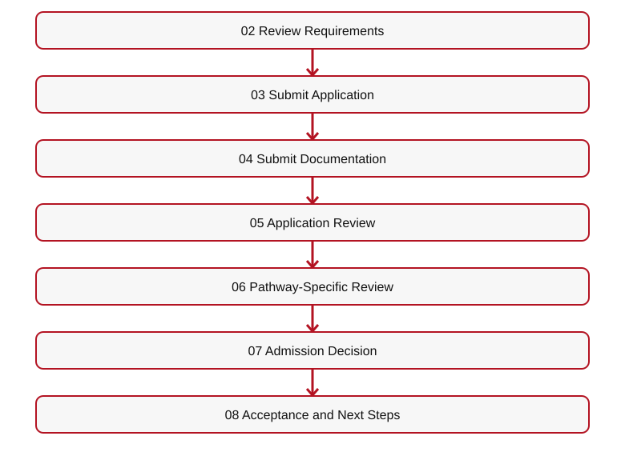
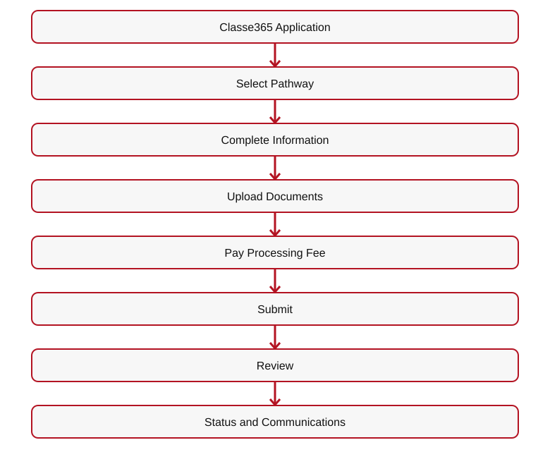
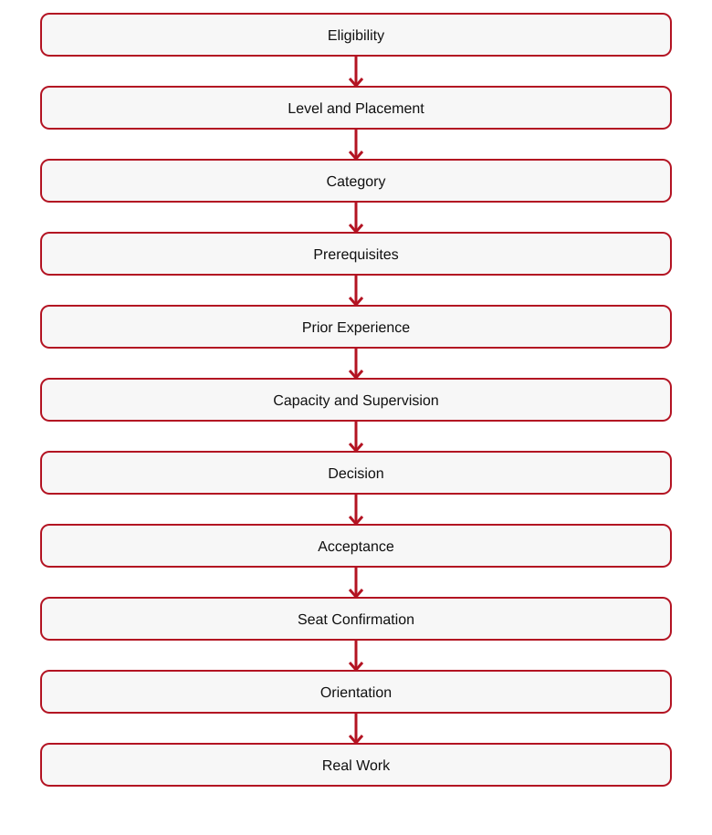

# 👑 RIAH PATHWAY — 11.3 APPLICATION WIREFRAME
## I. APPLICATION HERO

**[IMAGE — STUDENT COMPLETING DIGITAL APPLICATION]**
# YOUR FORMAL ENTRY INTO THE ADMISSIONS PROCESS.
**Application Platform: Classe365.**
**Application Processing Fee: $50 — NON-REFUNDABLE.**
**Student Information**  
• Selected Pathway  
• Prior Education  
• Academic History  
• Required Documentation  
• Applicable Pathway Questions  
• Student Communications**

**[BUTTON 11-A01 — APPLY NOW → CLASSE365]**
## II. 11.3.1 — ADMISSIONS PROCESS
**01 Select Your Pathway**  

[Mermaid source](IMAGES/11.2-APPLICATION-FLOW-01.mmd)

**[IMAGE — ADMISSIONS PROCESS FLOW]**
## III. 11.3.2 — APPLICATION FLOW

[Mermaid source](IMAGES/11.2-APPLICATION-FLOW-02.mmd)

**[BUTTON 11-A02 — APPLY NOW → CLASSE365]**
## IV. 11.3.3 — ADMISSIONS BY PATHWAY
1. **Pathway:** Associate's → **Review:** Academic eligibility and records → **Main Page:** 04
2. **Pathway:** Bachelor's → **Review:** Academic eligibility, transfers, prerequisites → **Main Page:** 04
3. **Pathway:** Year 3 → **Review:** General education and school core completed → **Main Page:** 04
4. **Pathway:** Minor → **Review:** Selected minor prerequisites completed → **Main Page:** 04
5. **Pathway:** Master's → **Review:** Bachelor's or equivalent and prerequisites → **Main Page:** 04
6. **Pathway:** MBA → **Review:** Bachelor's or equivalent and prerequisites → **Main Page:** 04
7. **Pathway:** J.D. → **Review:** Academic and law requirements → **Main Page:** 4.4
8. **Pathway:** Non-J.D. → **Review:** Jurisdictional eligibility and supervision → **Main Page:** 4.4
9. **Pathway:** Experiential → **Review:** Experience, prerequisites, supervision, capacity → **Main Page:** 05
10. **Pathway:** High School → **Review:** Eighth-grade or grades 9–12 transcript evaluation → **Main Page:** 06
11. **Pathway:** GED/HSE → **Review:** Prior high school record, noncompletion, college coursework → **Main Page:** 07
## V. EXPERIENTIAL ADMISSIONS BY LEVEL

**[IMAGE — SIX-LEVEL EXPERIENTIAL LADDER]**
1. **Level:** Apprentice → **Duration:** 1 Month
2. **Level:** Intern → **Duration:** 3 Months
3. **Level:** Associate → **Duration:** 1 Year
4. **Level:** Senior Associate → **Duration:** 1 Year
5. **Level:** Manager → **Duration:** 1 Year
6. **Level:** Executive → **Duration:** 1 Year
**Internal Placements + External Approved Employer and Organizational Placements.**
1. **Participant:** United States Student → **Applicable Format:** Remote, hybrid, or on-site
2. **Participant:** International Online Student → **Applicable Format:** Remote, subject to requirements
3. **Participant:** Internal Placement → **Applicable Format:** Remote, hybrid, or on-site
4. **Participant:** External Placement → **Applicable Format:** Remote, hybrid, or on-site where permitted
**Application**  

[Mermaid source](IMAGES/11.2-APPLICATION-FLOW-03.mmd)

Higher-demand opportunities may use automated blind selection; lower-demand opportunities may use first-come, first-served admission until capacity is reached.

**[BUTTON 11-A03 — EXPERIENTIAL PROCESS → 5.4]**
## VI. APPLICATION SUPPORT

**[ICON — APPLICATION SUPPORT]**
**[BUTTON 11-A04 — CONTACT ADMISSIONS → 19.2]**

**[BUTTON 11-A05 — TECHNICAL SUPPORT → 19.4]**
## VII. APPLICATION DOWNLOADS

**[DOWNLOAD — ADMISSIONS GUIDE]**
**[DOWNLOAD — PRE-ADMISSIONS CHECKLIST]**

**[DOWNLOAD — EXPERIENTIAL ADMISSIONS AND PLACEMENT GUIDE]**
**[DOWNLOAD — HIGH SCHOOL TRANSCRIPT EVALUATION CHECKLIST]**

**[DOWNLOAD — GED/HSE ADMISSIONS CHECKLIST]**
## VIII. APPLICATION RELATED LINKS

**[BUTTON 11-A06 — PRE-ADMISSIONS → 11.2]**
**[BUTTON 11-A07 — TUITION → 12]**

**[BUTTON 11-A08 — ACCEPTANCE & ENROLLMENT → 11.4]**
## IX. FINAL CTA

**[BUTTON 11-A09 — APPLY NOW → CLASSE365]**
**[ROUTING TABLE — SEE 11-ADMISSIONS-WIREFRAMES-CTA-LINKS-ROUTING.md]**

## X. EXPANDED APPLICATION AND PLACEMENT ROUTING
1. **Pathway:** Year 3 → **Admission Review:** General education and school core completion → **Website:** 04
2. **Pathway:** Minor → **Admission Review:** Minor prerequisites completed → **Website:** 04
3. **Pathway:** Master's / MBA → **Admission Review:** Applicable bachelor's or equivalent, program prerequisites → **Website:** 04
4. **Pathway:** High School → **Admission Review:** Eighth-grade or grades 9–12 transcript evaluation → **Website:** 06
5. **Pathway:** GED/HSE → **Admission Review:** Prior noncompletion record, concurrent college coursework → **Website:** 07
6. **Pathway:** Accounting Experiential → **Admission Review:** Financial Accounting and Managerial Accounting → **Website:** 05
7. **Pathway:** Computer Science Experiential → **Admission Review:** Introduction to Computer Science → **Website:** 05
8. **Pathway:** Other Experiential Majors → **Admission Review:** Major-specific foundational prerequisites → **Website:** 05
**Experiential categories:** Single-Area Assignment • Rotational Experience • Progressive Experience.
**Rotational Experience:** Additional $5,000 tuition. Associate $10,000; Associate with Rotational Experience $15,000. Approval depends on capacity, resources, supervision, coordination, and requirements.
**Progressive Experience:** Approved Starting Level  

[Mermaid source](IMAGES/11.2-APPLICATION-FLOW-04.mmd)

**Capacity:** High-demand eligible applicants may undergo blind selection; lower-demand opportunities may use first-come, first-served admission until approved capacity is reached.

**[IMAGE — SINGLE-AREA, ROTATIONAL, AND PROGRESSIVE EXPERIENCE COMPARISON]**
**[BUTTON — EXPERIENTIAL LEVELS → 5.2]**

**[BUTTON — EXPERIENTIAL PROCESS → 5.4]**
**[BUTTON — INTERNAL PLACEMENTS → 5.5]**

**[BUTTON — EXTERNAL PLACEMENTS → 5.6]**

---

## ORIGINAL ADMISSIONS MAIN WIREFRAME — 11.3 CROSS-REFERENCE

## VI. APPLICATION OVERVIEW

**[IMAGE — STUDENT COMPLETING DIGITAL APPLICATION]**
# YOUR FORMAL ENTRY INTO THE ADMISSIONS PROCESS.
**Classe365 • $50 NON-REFUNDABLE APPLICATION PROCESSING FEE**
**Student Information • Selected Pathway • Prior Education • Academic History • Required Documentation • Applicable Pathway Questions • Communications**

[Mermaid source](IMAGES/11.2-APPLICATION-FLOW-05.mmd)

**[BUTTON 11-M08 — APPLY NOW → CLASSE365]**
**[BUTTON 11-M09 — APPLICATION → 11.3]**

---

**Transfer admission limits:** J.D. — up to 27 approved Year 1 (1L) credits, entry after Year 1 only; no transfer into Years 2–4. Master's and MBA — up to 9 approved credits each.

## Transfer Credit Evaluation — One-Time Optional Service

| Component | Fee | Timing |
| --- | ---: | --- |
| Transfer credit evaluation (including alternative credit, prior learning, and applicable previous coursework) | $125 | After prerequisite/transcript eligibility review and before determining which credits apply |
| Processing and administration | $125 | Once the student is admitted to the applicable program/year and the transfer credit determination is processed |
| **Total when both services apply** | **$250** | **One-time; not charged twice for the same evaluation** |

The $250 is **not charged to every applicant**. It applies only to students requesting transfer credit evaluation and subsequent processing. Transcripts are submitted during pre-admissions and reviewed for prerequisite eligibility and outstanding requirements. Students meeting the applicable education admission requirements are admitted; the transfer credit evaluation determines which previous credits apply and which courses remain, rather than determining whether the student is admitted. Students with missing prerequisites are informed of the deficiencies and may return after completing them for a follow-up review without a second evaluation charge. For a Year 3 placement, the transfer evaluation and required prerequisites must be completed before Year 3 admission/placement. The $125 processing and administration portion is assessed only once the student is admitted to the applicable year or master's/MBA program. J.D. transfers are limited to up to 27 Year 1 (1L) credits and entry after Year 1; no transfers into J.D. Years 2–4. Master's and MBA transfer limits are 9 credits each.

**Admissions positioning:** Accessible education for applicants who meet program prerequisites; affordable program pricing; rigorous proctored assessments, performance assessments, and capstones. Educational admission is based on meeting published prerequisites and transcript requirements, not on purchasing the optional transfer credit evaluation service.

**Final transfer-credit restrictions (education pathways):** Associate's — up to 30 credits from general education, school core, or a combination of both. Bachelor's — up to 60 credits applicable only to general education and school core. Bachelor's Years 3 and 4 consist of RIAH Pathway coursework and do not accept transfer credits; no additional transfer credits may be added after the initial transfer evaluation and placement. Master's — up to 9 credits. MBA — up to 9 credits. J.D. — up to 27 approved first-year (1L) credits for entry after Year 1 only; no J.D. transfer into Years 2, 3, or 4. Transfer credit is determined once as part of the initial transfer evaluation; later additional transfer-credit submissions are not accepted. High School and GED/HSE admission and transfer parameters remain subject to separate review and are not changed by this clarification.

### Personalized Student Collections After Transfer Credit Evaluation

**Course-by-course determination:** After the one-time transfer credit evaluation, RIAH Pathway identifies the student's accepted credits, outstanding general education courses, outstanding school core courses, and any remaining major, capstone, or program requirements. The student's academic course plan determines the contents of their internal student collection package.

**Not one-size-fits-all:** Each student receives a personalized collection of applicable textbooks, workbooks, study guides, review guides, journals, planners, flashcards, and other course resources based on the courses they actually need to complete. Students do not automatically receive the entire general education or school core collection when approved transfer credits have already satisfied some or all of those courses.

**Example:** A bachelor's transfer student whose approved credits satisfy all general education requirements but not the school core receives the outstanding school core course collections, plus the applicable subsequent major and capstone materials; the student does **not** need a complete general education collection. If only some general education or core courses remain, include the collections for those outstanding courses only.

**Fulfillment and student experience:** Finalize the personalized course and collection list after transfer evaluation and placement, before assembling or assigning the student's applicable learning materials and Welcome/Transfer Kit resources. Continue to apply the established deposit, onboarding, and kit-delivery requirements. The internal student collection is determined by actual outstanding coursework, not a uniform full-program bundle.
