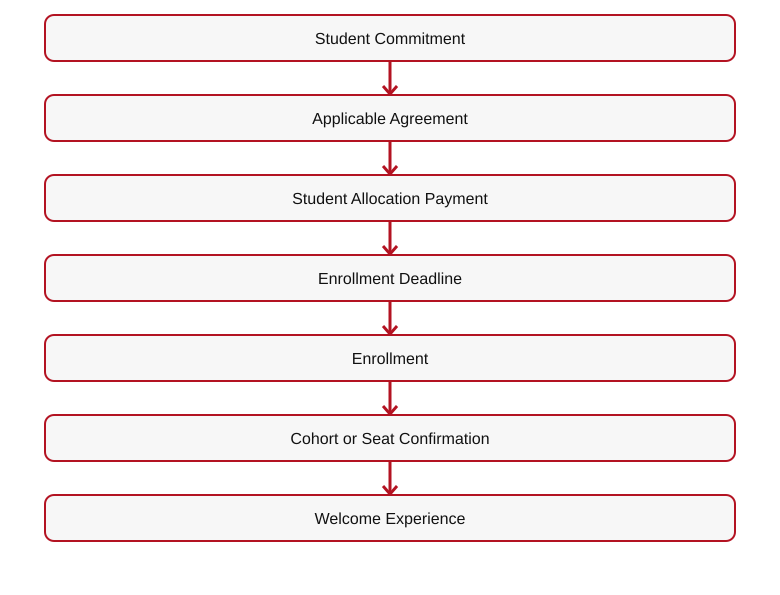
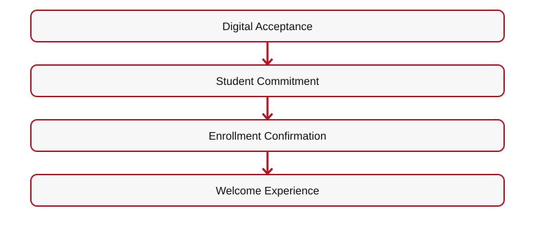
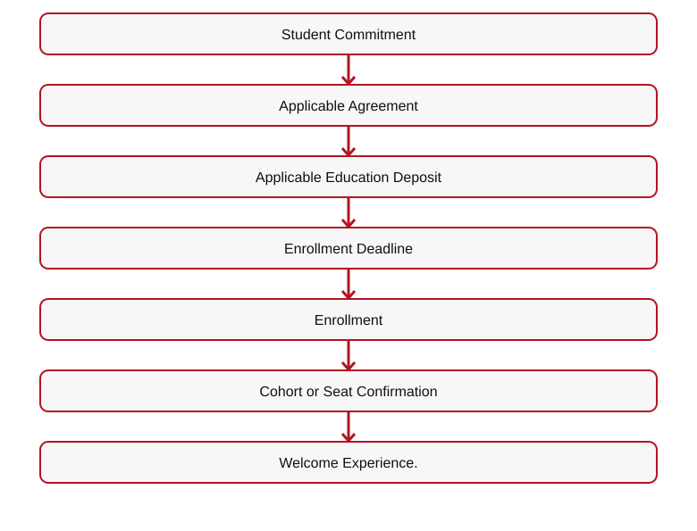

# 👑 RIAH PATHWAY — 11.4 ACCEPTANCE & ENROLLMENT WIREFRAME
## I. ACCEPTANCE HERO
# WELCOME TO THE PATHWAY.

**[IMAGE — PERSONALIZED ACCEPTANCE LETTER WITH UNIFIED CROWN]**
## II. 11.4.1 — ACCEPTANCE EXPERIENCE
**Digital Acceptance + Physical Personalized Acceptance Letter.**
**Student Name • School Identity • Selected Pathway • Institutional Branding • Unified Crown • Acceptance Information • Next Steps**

**[ICON — ACCEPTANCE LETTER WITH SEAL]**
## III. 11.4.2 — AFTER ADMISSION
**Admission Offer**  

[Mermaid source](IMAGES/11.3-ACCEPTANCE-AND-ENROLLMENT-FLOW-01.mmd)

## IV. EDUCATION DEPOSIT
**Education Deposit Fee: $500.**
| Pathway | Student Resource Allocation |
| --- | --- |
| Minor | $250 |
| Associate's | $500 |
| Bachelor's | $1,000 |
| Master's | $1,000 |
| MBA | $1,000 |
**$500 Education Deposit Fee + Applicable Student Resource Allocation = Applicable Total.**
## V. ACADEMIC ENROLLMENT
Degree students missing a monthly cohort may complete steps for a later eligible cohort, subject to policies.
**Experiential enrollment is capacity-based and requires timely confirmation.**

**[BUTTON 11-E01 — TUITION → 12]**
**[BUTTON 11-E02 — FEES → 12.3]**

**[BUTTON 11-E03 — PAYMENT OPTIONS → 12.4]**
## VI. ENROLLMENT COMMUNICATIONS

**[ICON — DIGITAL ENROLLMENT CONFIRMATION]**

[Mermaid source](IMAGES/11.3-ACCEPTANCE-AND-ENROLLMENT-FLOW-02.mmd)

## VII. DOWNLOADS

**[DOWNLOAD — ACCEPTANCE AND ENROLLMENT CHECKLIST]**
**[DOWNLOAD — STUDENT COST GUIDE]**

**[DOWNLOAD — ORIENTATION AND ONBOARDING OVERVIEW]**
## VIII. SUPPORT

**[BUTTON 11-E04 — CONTACT ADMISSIONS → 19.2]**
**[BUTTON 11-E05 — POLICIES → 17.8]**

**[BUTTON 11-E06 — STUDENT SUPPORT → 19.5]**
## IX. FINAL CTA

**[BUTTON 11-E07 — ONBOARDING & STUDENT EXPERIENCE → 11.5]**
**[ROUTING TABLE — SEE 11-ADMISSIONS-WIREFRAMES-CTA-LINKS-ROUTING.md]**

## X. ENROLLMENT DECISION AND COMMUNICATION DETAILS
| Stage | Stage Name | Communication |
| --- | --- | --- |
| 1 | Acceptance | Digital + Physical |
| 2 | Commitment | Digital |
| 3 | Enrollment | Digital |
| 4 | Welcome | Digital + Physical + Community |
| 5 | Orientation | Digital + Community |
**Admission Offer**  

[Mermaid source](IMAGES/11.3-ACCEPTANCE-AND-ENROLLMENT-FLOW-03.mmd)

**Education Deposit Fee: $500.**
| Pathway | Student Resource Allocation |
| --- | --- |
| Minor | $250 |
| Associate's | $500 |
| Bachelor's | $1,000 |
| Master's | $1,000 |
| MBA | $1,000 |
**Total deposit = $500 Education Deposit Fee + Applicable Student Resource Allocation.**
**Academic:** Later monthly cohort possible after completing requirements, subject to policies.
**Experiential:** Seats are capacity-based and require timely confirmation.

**[DOWNLOAD — ACCEPTANCE AND ENROLLMENT CHECKLIST]**
**[BUTTON — FEES → 12.3]**

**[BUTTON — PAYMENT OPTIONS → 12.4]**

---

## ORIGINAL ADMISSIONS MAIN WIREFRAME — 11.4 CROSS-REFERENCE

## VII. ACCEPTANCE & ENROLLMENT OVERVIEW

**[IMAGE — PERSONALIZED ACCEPTANCE LETTER WITH UNIFIED CROWN]**
# WELCOME TO THE PATHWAY.
**Digital Acceptance + Physical Personalized Acceptance Letter**
**Student Name • School Identity • Selected Pathway • Institutional Branding • Unified Crown • Acceptance Information • Next Steps**

**[ICON — ACCEPTANCE LETTER WITH SEAL]**

[Mermaid source](IMAGES/11.3-ACCEPTANCE-AND-ENROLLMENT-FLOW-04.mmd)

**[BUTTON 11-M10 — ACCEPTANCE & ENROLLMENT → 11.4]**

---

## Transfer Credit Evaluation — One-Time Optional Service

| Component | Fee | Timing |
| --- | ---: | --- |
| Transfer credit evaluation (including alternative credit, prior learning, and applicable previous coursework) | $125 | After prerequisite/transcript eligibility review and before determining which credits apply |
| Processing and administration | $125 | Once the student is admitted to the applicable program/year and the transfer credit determination is processed |
| **Total when both services apply** | **$250** | **One-time; not charged twice for the same evaluation** |

The $250 is **not charged to every applicant**. It applies only to students requesting transfer credit evaluation and subsequent processing. Transcripts are submitted during pre-admissions and reviewed for prerequisite eligibility and outstanding requirements. Students meeting the applicable education admission requirements are admitted; the transfer credit evaluation determines which previous credits apply and which courses remain, rather than determining whether the student is admitted. Students with missing prerequisites are informed of the deficiencies and may return after completing them for a follow-up review without a second evaluation charge. For a Year 3 placement, the transfer evaluation and required prerequisites must be completed before Year 3 admission/placement. The $125 processing and administration portion is assessed only once the student is admitted to the applicable year or master's/MBA program. J.D. transfers are limited to up to 27 Year 1 (1L) credits and entry after Year 1; no transfers into J.D. Years 2–4. Master's and MBA transfer limits are 9 credits each.

**Admissions positioning:** Accessible education for applicants who meet program prerequisites; affordable program pricing; rigorous proctored assessments, performance assessments, and capstones. Educational admission is based on meeting published prerequisites and transcript requirements, not on purchasing the optional transfer credit evaluation service.

**Final transfer-credit restrictions (education pathways):** Associate's — up to 30 credits from general education, school core, or a combination of both. Bachelor's — up to 60 credits applicable only to general education and school core. Bachelor's Years 3 and 4 consist of RIAH Pathway coursework and do not accept transfer credits; no additional transfer credits may be added after the initial transfer evaluation and placement. Master's — up to 9 credits. MBA — up to 9 credits. J.D. — up to 27 approved first-year (1L) credits for entry after Year 1 only; no J.D. transfer into Years 2, 3, or 4. Transfer credit is determined once as part of the initial transfer evaluation; later additional transfer-credit submissions are not accepted. High School and GED/HSE admission and transfer parameters remain subject to separate review and are not changed by this clarification.

### Personalized Student Collections After Transfer Credit Evaluation

**Course-by-course determination:** After the one-time transfer credit evaluation, RIAH Pathway identifies the student's accepted credits, outstanding general education courses, outstanding school core courses, and any remaining major, capstone, or program requirements. The student's academic course plan determines the contents of their internal student collection package.

**Not one-size-fits-all:** Each student receives a personalized collection of applicable textbooks, workbooks, study guides, review guides, journals, planners, flashcards, and other course resources based on the courses they actually need to complete. Students do not automatically receive the entire general education or school core collection when approved transfer credits have already satisfied some or all of those courses.

**Example:** A bachelor's transfer student whose approved credits satisfy all general education requirements but not the school core receives the outstanding school core course collections, plus the applicable subsequent major and capstone materials; the student does **not** need a complete general education collection. If only some general education or core courses remain, include the collections for those outstanding courses only.

**Fulfillment and student experience:** Finalize the personalized course and collection list after transfer evaluation and placement, before assembling or assigning the student's applicable learning materials and Welcome/Transfer Kit resources. Continue to apply the established deposit, onboarding, and kit-delivery requirements. The internal student collection is determined by actual outstanding coursework, not a uniform full-program bundle.
