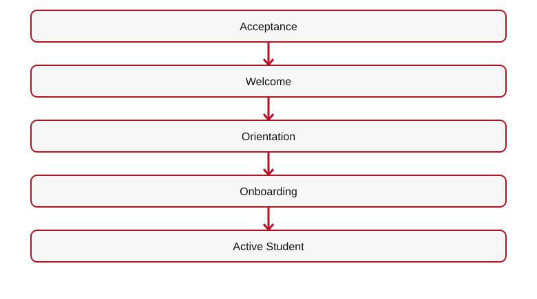
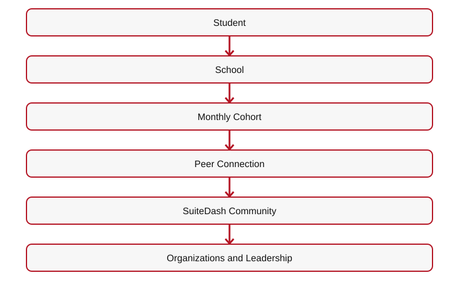
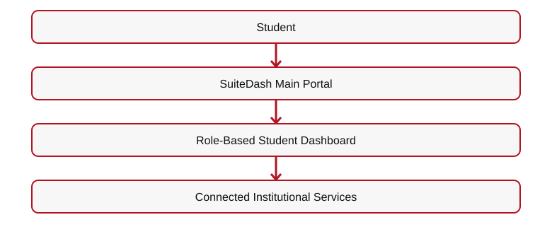
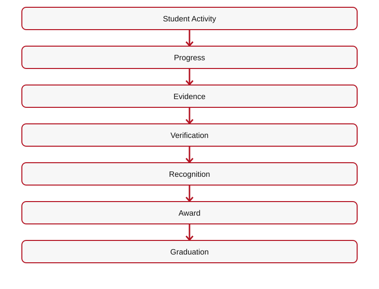
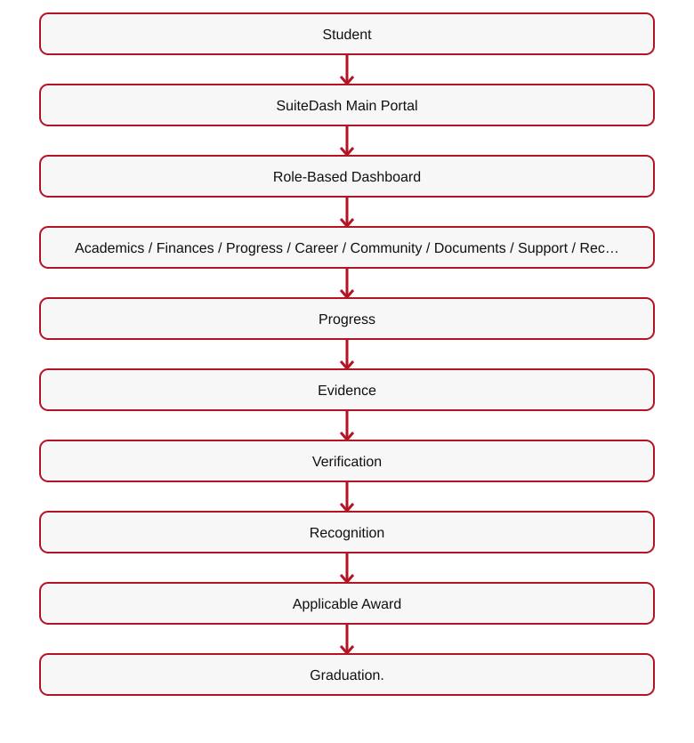

# 👑 RIAH PATHWAY — 11.5 ONBOARDING & STUDENT EXPERIENCE WIREFRAME
## I. STUDENT EXPERIENCE HERO
# YOUR RIAH PATHWAY EXPERIENCE BEGINS BEFORE THE FIRST COURSE.

**[IMAGE — RIAH PATHWAY WELCOME KIT]**

### Personalized Student Collections After Transfer Credit Evaluation

**Course-by-course determination:** After the one-time transfer credit evaluation, RIAH Pathway identifies the student's accepted credits, outstanding general education courses, outstanding school core courses, and any remaining major, capstone, or program requirements. The student's academic course plan determines the contents of their internal student collection package.

**Not one-size-fits-all:** Each student receives a personalized collection of applicable textbooks, workbooks, study guides, review guides, journals, planners, flashcards, and other course resources based on the courses they actually need to complete. Students do not automatically receive the entire general education or school core collection when approved transfer credits have already satisfied some or all of those courses.

**Example:** A bachelor's transfer student whose approved credits satisfy all general education requirements but not the school core receives the outstanding school core course collections, plus the applicable subsequent major and capstone materials; the student does **not** need a complete general education collection. If only some general education or core courses remain, include the collections for those outstanding courses only.

**Fulfillment and student experience:** Finalize the personalized course and collection list after transfer evaluation and placement, before assembling or assigning the student's applicable learning materials and Welcome/Transfer Kit resources. Continue to apply the established deposit, onboarding, and kit-delivery requirements. The internal student collection is determined by actual outstanding coursework, not a uniform full-program bundle.

## II. 11.5.1 — PERSONALIZED WELCOME EXPERIENCE
**Physical Welcome Materials + Digital Access + School Identity + Cohort Community.**
**Student ID • School Materials • Academic Materials • Orientation Materials • Branded Items • Applicable Robe • Scarf • Bag • Student Resources.**
**Student Resource Allocation — enrollment through graduation:** The applicable pathway allocation (GED and Minor $250 each; High School and Associate's $500 each; Bachelor's, Master's, MBA, J.D., and Non-J.D. $1,000 each; Experiential estimated $500–$1,500) supports relevant personalized textbooks/workbooks and other academic materials, laptop/technology, software and subscriptions, certification/proctoring resources, Welcome/Transfer Kit items, standard transcripts and graduation hat/cap, gown/robe, applicable earned cords and other graduation/completion resources. These resources are **not all necessarily delivered with the Welcome Kit**; distribution follows the student's actual courses and milestones. The separate **$500 RIAH Education Deposit Fee** is for administrative processing and coordination of individualized resource preparation and is charged once per applicable Education Deposit. **[FINAL RESOURCE NUMBERING, EXACT INCLUSIONS, QUANTITIES, FULFILLMENT TIMING, AND ADMINISTRATIVE TASK LIST: TO BE FINALIZED.]**
Transfer students receive applicable transfer materials.

**[BUTTON 11-S01 — TRANSFER STUDENTS → 11.8]**
## III. 11.5.2 — ONBOARDING & ORIENTATION

**[ICON — COMPASS]**
# ONE WEEK TO PREPARE FOR THE PATH AHEAD.
| Area | Preparation |
| --- | --- |
| Academics | Expectations and resources |
| Technology | Systems and access |
| Institution | Institutional identity |
| Community | School, cohort, organizations |
| Experiential | Placement and supervision |
| Law | Legal supervision |
| Career | Career-development resources |

**Under-18 onboarding controls:** Before a minor starts Experiential work, verify the parent/legal guardian's signed permission and required participation/placement forms; work-scope, age, schedule, required permits, lawful duties, and supervision approvals. RIAH **internal placement is remote only**; **external partner placement may be remote, hybrid, or on-site** only where legally permitted. Before under-18 high school dual enrollment starts, collect **both parental/legal-guardian and guidance counselor approval**, along with relevant academic eligibility documentation.

| Function | Platform |
|---|---|
| Main Portal | SuiteDash |
| Admissions and SIS | Classe365 |
| Learning Management | LearnWorlds |
| Orientation Meetings | Microsoft Teams |
| Authentication | Microsoft Entra ID |
| Forms and Onboarding | SuiteDash |
| Student Resources | SuiteDash |
| Help Desk | SuiteDash |

[Mermaid source](IMAGES/11.4-ONBOARDING-AND-STUDENT-EXPERIENCE-FLOW-01.mmd)

## IV. 11.5.3 — COHORT, SCHOOL & COMMUNITY

**[IMAGE — VIRTUAL STUDENT COMMUNITY]**
**Monthly Cohorts**  
• Schools  
• Majors  
• Student Organizations  
• Student Governance  
• Leadership  
• Honor Societies  
• Greek Life Where Applicable  
• Ambassadors  
• Community Service  
• Peer Mentorship  
• Career Development**
**SuiteDash Community.**

[Mermaid source](IMAGES/11.4-ONBOARDING-AND-STUDENT-EXPERIENCE-FLOW-02.mmd)

**[BUTTON 11-S02 — STUDENT LIFE → 16.2]**
## V. 11.5.4 — ACTIVE STUDENT EXPERIENCE
| Function | Platform |
| --- | --- |
| Applications and Admissions | Classe365 |
| SIS, Academic Records, Degree Audit, Alumni | Classe365 |
| Official Transcript Ordering and Delivery | Parchment |
| Enrollment and Degree Verification | National Student Clearinghouse |
| Learning Management, Assessments, Gradebook | LearnWorlds |
| Digital Courseware | Cengage MindTap |
| Student Portfolios and Applied-Learning Evidence | PebblePad |
| Exam Proctoring | ProctorU |
| Supplemental Tutoring | Tutor.com |
| Portal, Community, Onboarding, Communications | SuiteDash |
| Resources, Forms, Documents, Policies, Procedures, Guidelines | SuiteDash |
| Help Desk and Tickets | SuiteDash |
| Career Services | Symplicity CSM |
| Placements, Supervision, Evaluations | PeopleGrove CORE + Experience Hub + CompMS |
| Student Finance | TouchNet |
| Financial Aid | Regent Education |
| Institutional Recognition | Merit Pages |
| Identity and Authentication | Microsoft Entra ID |
| Virtual Meetings | Microsoft Teams |
| Institutional Analytics | Microsoft Power BI |
### Technology Ownership
**SuiteDash — Portal, community, onboarding, communications, support, forms, resources, documents.**
**Classe365 — Admissions, SIS, academic records, degree audit, alumni.**
**Parchment — Official transcript ordering and delivery.**
**National Student Clearinghouse — Enrollment and degree verification.**
**LearnWorlds — Learning, assessments, academic progress.**
**Cengage MindTap — Digital courseware.**
**PebblePad — Portfolios, competencies, work products, evidence.**
**PeopleGrove CORE + Experience Hub + CompMS — Experiential placements and evaluations.**
**Symplicity CSM — Career services.**
## VI. ONE FRONT DOOR

**[IMAGE — STUDENT DASHBOARD WITH EIGHT SERVICE CATEGORIES]**

[Mermaid source](IMAGES/11.4-ONBOARDING-AND-STUDENT-EXPERIENCE-FLOW-03.mmd)

| Academics | Finances | Progress | Career |
| --- | --- | --- | --- |
| LearnWorlds | TouchNet | Classe365 | Symplicity CSM |
| Cengage MindTap | Regent Education | Merit Pages | Advising |
| Tutor.com | Student Accounts | PebblePad | Opportunities |
| ProctorU | Financial Information | Milestones | Employers |
| Community | Documents | Support | Records |
|---|---|---|---|
| SuiteDash | SuiteDash | SuiteDash | Classe365 |
| Organizations | Policies | Help Desk | Academic Records |
| Cohorts | Procedures | Tickets | Degree Audit |
| Student Life | Guidelines | Human Support | Parchment |
| Engagement | Forms | Resources | National Student Clearinghouse |
**Microsoft Entra ID — Identity and Authentication.** Connections and SSO must be configured before being presented as operational.
## VII. 11.5.5 — ACHIEVEMENTS & MILESTONES

**[IMAGE — ACHIEVEMENT BADGES AND INSTITUTIONAL RECOGNITION]**
**Academic Achievement**  
• Experiential Achievement  
• Leadership  
• Community Service  
• Mentorship  
• Career Development  
• Professional Credentials  
• Institutional Recognition**
| Recognition | Platform |
| --- | --- |
| Institutional Degrees, Academic Achievements, Recognition | Merit Pages |
| Applicable RIAH Credentials | Merit Pages |
| External Certifications | Applicable Certification Bodies |
| Student Portfolios, Applied Evidence | PebblePad |

[Mermaid source](IMAGES/11.4-ONBOARDING-AND-STUDENT-EXPERIENCE-FLOW-04.mmd)

**Tuition Reimbursement: Up to 50% for eligible tuition payments under applicable terms.**
**Graduation Reimbursement: Guaranteed 10% upon graduation under applicable terms.**

**[BUTTON 11-S03 — REIMBURSEMENT → 12.6]**
## VIII. DOWNLOADS

**[DOWNLOAD — ORIENTATION AND ONBOARDING OVERVIEW]**
**[DOWNLOAD — STUDENT TECHNOLOGY GUIDE]**

**[DOWNLOAD — NEW STUDENT GUIDE — SUITEDASH AUTHENTICATED PORTAL]**
## IX. FINAL CTA

**[BUTTON 11-S04 — STUDENT LIFE → 16.2]**
**[BUTTON 11-S05 — CAREER SERVICES → 16.2.20]**

**[BUTTON 11-S06 — GRADUATION & ALUMNI → 11.6]**
**[ROUTING TABLE — SEE 11-ADMISSIONS-WIREFRAMES-CTA-LINKS-ROUTING.md]**

## X. COMPLETE STUDENT EXPERIENCE TECHNOLOGY AND MILESTONE DETAIL
| Function | Platform |
| --- | --- |
| Official Transcript Ordering and Delivery | Parchment |
| Enrollment and Degree Verification | National Student Clearinghouse |
| Academic Learning and Assessments | LearnWorlds |
| Digital Courseware | Cengage MindTap |
| Portfolios and Applied-Learning Evidence | PebblePad |
| Exam Proctoring | ProctorU |
| Supplemental Tutoring | Tutor.com |
| Student Portal, Community, Onboarding, Forms, Policies, Help Desk | SuiteDash |
| Academic Records, Degree Audit, Alumni | Classe365 |
| Career Services | Symplicity CSM |
| Experiential Placement, Supervision, Evaluations | PeopleGrove CORE + Experience Hub + CompMS |
| Student Accounts | TouchNet |
| Financial Aid Administration | Regent Education |
| Institutional Recognition | Merit Pages |
| Identity and Authentication | Microsoft Entra ID |
| Virtual Meetings | Microsoft Teams |
| Reporting | Microsoft Power BI |

[Mermaid source](IMAGES/11.4-ONBOARDING-AND-STUDENT-EXPERIENCE-FLOW-05.mmd)

**Tuition Reimbursement:** Up to 50% for eligible tuition payments under applicable terms; guaranteed 10% upon graduation under applicable terms.
**One-week virtual orientation:** Academics • Technology • Institution • Community • Experiential • Law • Career.
**Welcome:** Physical materials + digital access + school identity + cohort community; applicable student ID, academic materials, robe, scarf, bag, and student resources.

**[IMAGE — STUDENT DASHBOARD WITH EIGHT SERVICE CATEGORIES]**
**[DOWNLOAD — ORIENTATION AND ONBOARDING OVERVIEW]**

---

## ORIGINAL ADMISSIONS MAIN WIREFRAME — 11.5 CROSS-REFERENCE

## VIII. ONBOARDING & STUDENT EXPERIENCE OVERVIEW

**[IMAGE — RIAH PATHWAY WELCOME KIT]**
**Physical Welcome Materials + Digital Access + School Identity + Cohort Community**
**Student ID • School Materials • Academic Materials • Orientation Materials • Branded Items • Applicable Robe • Scarf • Bag • Student Resources**
| Orientation Area | Preparation |
| --- | --- |
| Academics | Expectations and resources |
| Technology | Systems and access |
| Institution | Institutional identity |
| Community | School, cohort, organizations |
| Experiential | Placement and supervision |
| Law | Legal supervision requirements |
| Career | Career-development resources |

**[BUTTON 11-M11 — ONBOARDING & STUDENT EXPERIENCE → 11.5]**

---

**Current enrollment pricing notice:** $0 to apply; no separate Education Deposit Fee or $500 RIAH institutional charge. The Student Resource Allocation Fee is the selected pathway's resource allocation payment/deposit (GED $250; High School $500; Minor $250; Associate's $500; Bachelor's, Master's, MBA, J.D. and Non-J.D. $1,000 each; Experiential estimated $500–$1,500, level-dependent). These are separate from tuition. Any resources or services outside the published allocation carry an additional disclosed charge, but included items are not billed twice. Optional transcript/transfer evaluation is $50 and processing $50 ($100 total when both are needed and not included).
