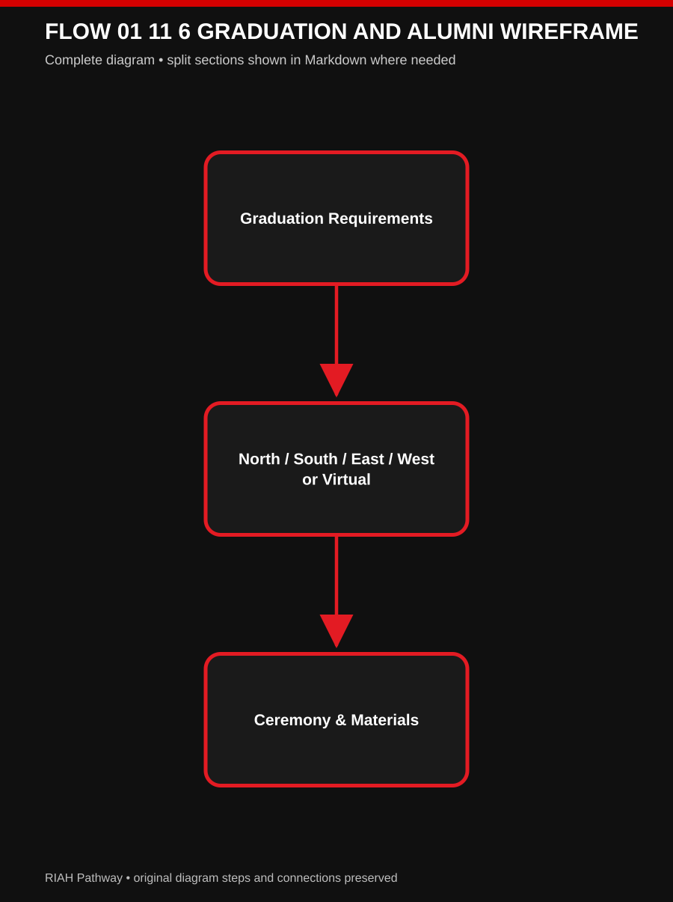
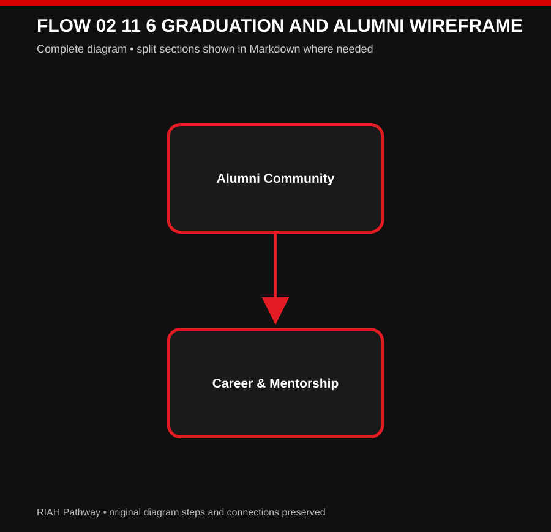

# 👑 RIAH PATHWAY — 11.6 GRADUATION & ALUMNI WIREFRAME

**[SITEMAP WIREFRAME MD — 11.6-GRADUATION-AND-ALUMNI-WIREFRAME.md]**
## I. GRADUATION HERO
# THE PATHWAY LEADS TO A MILESTONE WORTH CELEBRATING.

**[IMAGE — REGIONAL GRADUATION CEREMONY]**
## II. 11.6.1 — GRADUATION EXPERIENCE

### 🔄 GRADUATION ALUMNI — PHASE 1

[View editable Mermaid diagram](./IMAGES/FLOW-01-11-6-GRADUATION-AND-ALUMNI-WIREFRAME.mmd)

### 🔄 GRADUATION ALUMNI — PHASE 2

[View editable Mermaid diagram](./IMAGES/FLOW-02-11-6-GRADUATION-AND-ALUMNI-WIREFRAME.mmd)

[VIEW COMPLETE EDITABLE MERMAID DIAGRAM](./IMAGES/MERMAIDS/GRADUATION-ALUMNI.mmd)

1. **Before:** Eligibility Review → **Ceremony:** Regalia → **After:** Graduation Kit
2. **Before:** Graduation Application → **Ceremony:** Honor Cords → **After:** Credential
3. **Before:** Academic Records Review → **Ceremony:** Recognition → **After:** Career Transition
4. **Before:** Clearance → **Ceremony:** Regional Ceremony → **After:** Alumni Transition
5. **Before:** Communications → **Ceremony:** Virtual Option → **After:** Alumni Network
**NORTH • SOUTH • EAST • WEST.**
**Regional In-Person Ceremony + Virtual Graduation Option.**
## III. 11.6.2 — ALUMNI & LEGACY

**[ICON — ALUMNI NETWORK]**
# GRADUATION ENDS A PROGRAM. IT DOESN'T END THE PATHWAY.
1. **Function:** Alumni Records → **Platform:** Classe365
2. **Function:** Alumni Community → **Platform:** SuiteDash
3. **Function:** Career Services → **Platform:** Symplicity CSM
4. **Function:** Institutional Recognition → **Platform:** Merit Pages
5. **Function:** Alumni Communications → **Platform:** SuiteDash
**Student → Graduate → Classe365 Alumni Record → SuiteDash Alumni Community → Career and Mentorship → Legacy**

**[BUTTON 11-G01 — STUDENT LIFE → 16.2]**
## IV. 11.6.3 — RECEIVE • EARN • PURCHASE
1. **RECEIVE:** Acceptance Materials → **EARN:** Milestone Recognition → **PURCHASE:** Optional Merchandise
2. **RECEIVE:** Welcome Materials → **EARN:** Credentials → **PURCHASE:** Yearbooks
3. **RECEIVE:** Student Materials → **EARN:** Awards → **PURCHASE:** Class Rings
4. **RECEIVE:** Applicable Graduation Materials → **EARN:** Honor Cords → **PURCHASE:** Optional Frames
5. **RECEIVE:** Alumni Materials → **EARN:** Achievement Recognition → **PURCHASE:** Additional Apparel
6. **RECEIVE:** Student ID → **EARN:** Applicable Certificates → **PURCHASE:** Keepsakes
**Admissions = RECEIVE + EARN. Products = PURCHASE.**

**[BUTTON 11-G02 — SHOP NOW → SHOPIFY]**
**[BUTTON 11-G03 — PRODUCTS → 14]**
## V. REGISTRAR & RECORDS

**[IMAGE — DIGITAL ACADEMIC RECORDS AND VERIFICATION FLOW]**
1. **Function:** Student, Enrollment, Academic Records, Degree Audit, Alumni → **Platform:** Classe365
2. **Function:** Official Transcript Ordering and Delivery → **Platform:** Parchment
3. **Function:** Enrollment and Degree Verification → **Platform:** National Student Clearinghouse
4. **Function:** Institutional Recognition → **Platform:** Merit Pages
5. **Function:** Portfolio Evidence → **Platform:** PebblePad
**Student Enrollment  
→ Classe365  
→ Academic Progress and Degree Audit  
→ Official Academic Record  
→ Registrar Services  
→ Parchment Transcripts / National Student Clearinghouse Verification**

**[ICON — OFFICIAL TRANSCRIPT]**
**Student or Graduate → Request Transcript → Parchment → Institutional Processing → Official Delivery → Recipient**

**[BUTTON 11-G04 — REQUEST TRANSCRIPT → PARCHMENT]**
**[ICON — VERIFIED ACADEMIC CREDENTIAL]**
**Student or Graduate Record → Classe365 → Institutional Reporting → National Student Clearinghouse → Authorized Request → Verification**

**[BUTTON 11-G05 — ENROLLMENT VERIFICATION → NATIONAL STUDENT CLEARINGHOUSE]**
**[BUTTON 11-G06 — DEGREE VERIFICATION → NATIONAL STUDENT CLEARINGHOUSE]**
**Academic Milestone → Institutional Review → Merit Pages → Recognition**

**[BUTTON 11-G07 — ACHIEVEMENTS → 11.5.5]**
## VI. DOWNLOADS

**[DOWNLOAD — GRADUATION AND ALUMNI OVERVIEW]**
**[DOWNLOAD — GRADUATION CHECKLIST]**

**[DOWNLOAD — ALUMNI GUIDE]**
## VII. SUPPORT

**[BUTTON 11-G08 — STUDENT SUPPORT → 19.5]**
**[BUTTON 11-G09 — CAREER SERVICES → 16.2.20]**
## VIII. RESOURCES

**[BUTTON 11-G10 — STUDENT LIFE → 16.2]**
**[BUTTON 11-G11 — PRODUCTS → 14]**
## IX. FINAL CTA
# ONE DYNASTY. INFINITE LEGACIES.

**[BUTTON 11-G12 — ALUMNI & LEGACY → 11.6.2]**
**[ROUTING TABLE — SEE 11-ADMISSIONS-WIREFRAMES-CTA-LINKS-ROUTING.md]**

## X. COMPLETE GRADUATION AND ALUMNI LIFECYCLE
1. **Before:** Eligibility Review → **Ceremony:** Regalia → **After:** Graduation Kit
2. **Before:** Graduation Application → **Ceremony:** Honor Cords → **After:** Applicable Credential
3. **Before:** Academic Records Review → **Ceremony:** Recognition → **After:** Career Transition
4. **Before:** Applicable Clearance → **Ceremony:** Regional Ceremony → **After:** Alumni Transition
5. **Before:** Communications → **Ceremony:** Virtual Option → **After:** Alumni Network
**Graduation regions:** NORTH • SOUTH • EAST • WEST.
**Options:** Regional In-Person Ceremony + Virtual Graduation Option.
**Student → Graduate → Classe365 Alumni Record → SuiteDash Alumni Community → Career and Mentorship → Legacy.**
1. **RECEIVE:** Acceptance Materials → **EARN:** Milestone Recognition → **PURCHASE:** Optional Merchandise
2. **RECEIVE:** Welcome Materials → **EARN:** Credentials → **PURCHASE:** Yearbooks
3. **RECEIVE:** Student Materials → **EARN:** Awards → **PURCHASE:** Class Rings
4. **RECEIVE:** Applicable Graduation Materials → **EARN:** Honor Cords → **PURCHASE:** Optional Frames
5. **RECEIVE:** Alumni Materials → **EARN:** Achievement Recognition → **PURCHASE:** Additional Apparel
6. **RECEIVE:** Student ID → **EARN:** Applicable Certificates → **PURCHASE:** Keepsakes
**Admissions = RECEIVE + EARN. Products = PURCHASE.**

**[BUTTON — SHOP NOW → SHOPIFY]**
**[DOWNLOAD — GRADUATION AND ALUMNI OVERVIEW]**

---

## ORIGINAL ADMISSIONS MAIN WIREFRAME — 11.6 CROSS-REFERENCE

## IX. GRADUATION & ALUMNI OVERVIEW

**[IMAGE — REGIONAL GRADUATION CEREMONY]**
**NORTH • SOUTH • EAST • WEST**
**Regional In-Person Ceremony + Virtual Graduation Option**
**Student → Graduate → Classe365 Alumni Record → SuiteDash Alumni Community → Career and Mentorship → Legacy**

**[BUTTON 11-M12 — GRADUATION & ALUMNI → 11.6]**

---

<!-- APPROVED ADMISSIONS DRAFT DISTRIBUTION — 2026-10-08 -->

# 👑 ADMISSIONS DRAFT — APPROVED UPDATES

**Original content above retained verbatim.** The following approved updates are distributed from `DRAFT-ADMISSIONS-WIREFRAME-DRAFT.md`.  
Only specifically conflicting student-facing details are superseded; other original content is preserved.

## 14 🎓 GRADUATION EXPERIENCE
**Delivery:** Digital + Physical + Ceremonial / Community.
**U.S. regions:** North, South, East, West. Graduates may choose regional in-person graduation or virtual participation; venue size depends on attendance.
**International:** Virtual graduation option.
**Concept materials:** Graduation robe/regalia, cap, tassel, earned honor cords, diploma, diploma case/cover, diploma/picture frame, graduation package, class ring, yearbook/keepsakes, program and recognition items.
**Fee treatment:** Applicable standard graduation materials are planned into overall tuition/student fees, subject to finalized fee schedule; not an automatic new graduation purchase.
**Virtual ceremony technology:** Microsoft Teams is the finalized virtual meeting reference, superseding earlier Zoom mentions in this function.

**[IMAGE — NORTH / SOUTH / EAST / WEST REGIONAL GRADUATION AND VIRTUAL OPTION]**

## 15 👑 ALUMNI & LEGACY
**Delivery:** Digital + Physical + Community.
**Experience:** Transition into alumni community, continued professional connections, networking, career resources, mentorship, alumni events and institutional legacy.
**Materials/access received:** Mailed Alumni/Legacy Kit, alumni welcome and keepsake materials, alumni community access, networking, career and mentorship resources, event information.

**[IMAGE — ALUMNI LEGACY KIT AND COMMUNITY]**

---

## ADMISSIONS FLOW DIAGRAMS — MERMAID

**[IMAGE — BLACK AND RED ADMISSIONS FLOW DIAGRAMS]**

### FLOW 01 ADMISSIONS TO ALUMNI

[VIEW EDITABLE MERMAID DIAGRAM](./IMAGES/FLOW-01-ADMISSIONS-TO-ALUMNI.mmd)

---
