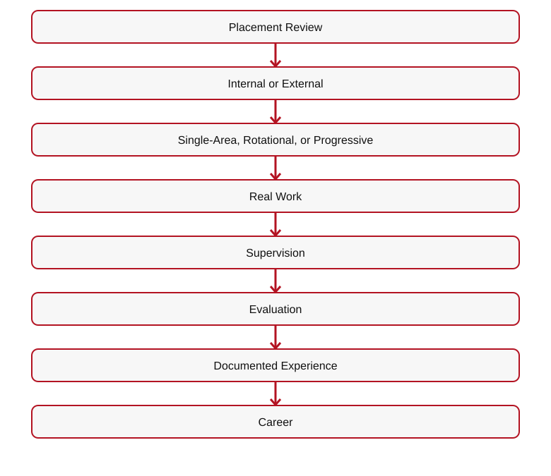
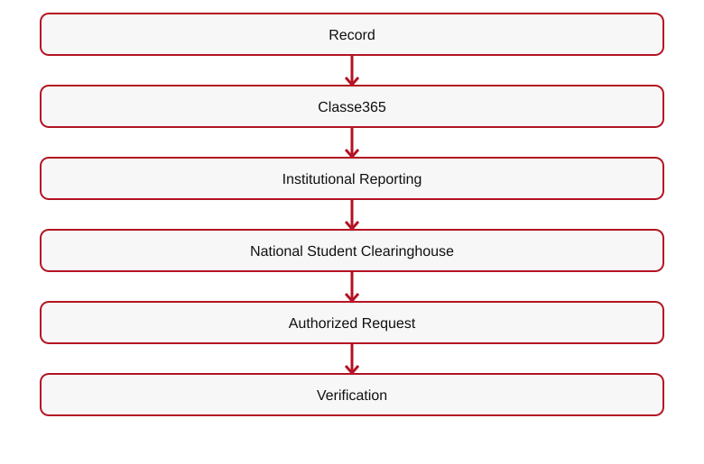
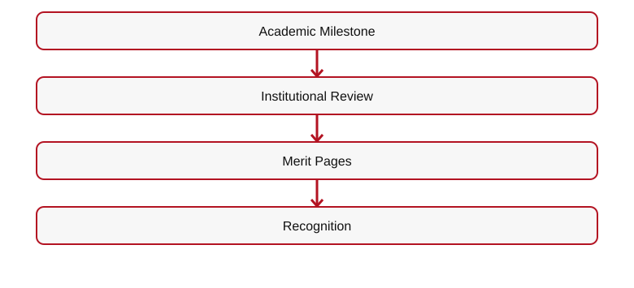

# 👑 RIAH PATHWAY — 11.7 HOW RIAH PATHWAY WORKS WIREFRAME
## I. TECHNOLOGY HERO
# ONE CONNECTED INSTITUTIONAL ECOSYSTEM.

**[IMAGE — INSTITUTIONAL SERVICE ECOSYSTEM]**
RIAH Pathway connects academic administration, curriculum, student support, finance, careers, experiential learning, academic records, recognition, and community.
## II. EDUCATION & STUDENT ADMINISTRATION
| Function | Platform |
| --- | --- |
| Admissions, SIS, Academic Records, Degree Audit, Alumni | Classe365 |
| Learning, Assessments | LearnWorlds |
| Digital Courseware | Cengage MindTap |
| Portfolios | PebblePad |
| Proctoring | ProctorU |
| Tutoring | Tutor.com |
| Institutional Recognition | Merit Pages |
## III. PORTAL, COMMUNITY & SUPPORT
### SuiteDash — Central Ecosystem
| Function | Platform |
| --- | --- |
| Main Ecosystem, Role-Based Portal, Dashboard | SuiteDash |
| Community, Onboarding, Communications | SuiteDash |
| Student Resources, Forms, Portal Documents | SuiteDash |
| Policies, Procedures, Guidelines | SuiteDash |
| Help Desk, Support Tickets, Projects, Tasks, CRM | SuiteDash |

[Mermaid source](IMAGES/11.6-HOW-RIAH-PATHWAY-WORKS-FLOW-01.mmd)

## IV. EXPERIENTIAL ECOSYSTEM
### PeopleGrove CORE + Experience Hub + CompMS
| Function | Platform |
| --- | --- |
| Experiential Ecosystem | PeopleGrove CORE + Experience Hub + CompMS |
| Internal and External Placements | PeopleGrove CORE + Experience Hub + CompMS |
| Placement Employer and Partner Engagement | PeopleGrove CORE + Experience Hub + CompMS |
| Work Assignments, Supervision, Progress, Evaluations | PeopleGrove CORE + Experience Hub + CompMS |
**Application**  

[Mermaid source](IMAGES/11.6-HOW-RIAH-PATHWAY-WORKS-FLOW-02.mmd)

**[BUTTON 11-H01 — EXPERIENTIAL → 05]**
## V. REGISTRAR & RECORDS

**[IMAGE — DIGITAL ACADEMIC RECORDS AND VERIFICATION FLOW]**
| Function | Platform |
| --- | --- |
| Student, Enrollment, Academic Records, Degree Audit, Alumni | Classe365 |
| Official Transcript Ordering and Delivery | Parchment |
| Enrollment and Degree Verification | National Student Clearinghouse |
| Recognition | Merit Pages |
| Portfolio Evidence | PebblePad |
**Student Enrollment**  

[Mermaid source](IMAGES/11.6-HOW-RIAH-PATHWAY-WORKS-FLOW-03.mmd)

**[ICON — OFFICIAL TRANSCRIPT]**

[Mermaid source](IMAGES/11.6-HOW-RIAH-PATHWAY-WORKS-FLOW-04.mmd)

**[BUTTON 11-H02 — REQUEST TRANSCRIPT → PARCHMENT]**
**[ICON — VERIFIED ACADEMIC CREDENTIAL]**

[Mermaid source](IMAGES/11.6-HOW-RIAH-PATHWAY-WORKS-FLOW-05.mmd)

**[BUTTON 11-H03 — ENROLLMENT VERIFICATION → NATIONAL STUDENT CLEARINGHOUSE]**
**[BUTTON 11-H04 — DEGREE VERIFICATION → NATIONAL STUDENT CLEARINGHOUSE]**

[Mermaid source](IMAGES/11.6-HOW-RIAH-PATHWAY-WORKS-FLOW-06.mmd)

**[BUTTON 11-H05 — ACHIEVEMENTS → 11.5.5]**
## VI. POLICIES, PROCEDURES & GUIDELINES

**[ICON — INSTITUTIONAL DOCUMENT LIBRARY]**
# ONE DOCUMENT ACCESS STRUCTURE: SUITEDASH
| Document Category | Platform |
| --- | --- |
| Institutional Policies, Procedures, Guidelines | SuiteDash |
| Student Handbook and Resources | SuiteDash |
| Admissions and Enrollment Documentation | SuiteDash |
| Student Forms, Portal Documents, Support Documents | SuiteDash |
| Student Communications | SuiteDash |

[Mermaid source](IMAGES/11.6-HOW-RIAH-PATHWAY-WORKS-FLOW-07.mmd)

**[BUTTON 11-H06 — POLICIES → 17.8]**
**[BUTTON 11-H07 — PROCEDURES → 17.9]**

**[BUTTON 11-H08 — GUIDELINES → 17.10]**
## VII. CAREER ECOSYSTEM
### Symplicity CSM
**Career Advising • Career Opportunities • Recruiting • Employer Engagement • Career Milestones**
**Academic Records — Classe365 • Experiential — PeopleGrove • Portfolios — PebblePad • Career Services — Symplicity CSM**

**[BUTTON 11-H09 — CAREER SERVICES → 16.2.20]**
## VIII. STUDENT FINANCIAL ECOSYSTEM
| Function | Platform |
| --- | --- |
| Financial Aid Administration | Regent Education |
| Student Accounts, Tuition Billing, Payment Plans, Disbursement | TouchNet |
| General Payments | Stripe |

**[BUTTON 11-H10 — TUITION → 12]**
**[BUTTON 11-H11 — FUNDING → 12.5]**
## IX. PUBLIC INSTITUTIONAL TECHNOLOGY MODEL
[DIAGRAM — PUBLIC WEBSITE CONNECTED TO STUDENT SERVICES]
**Webflow**  
→ SuiteDash  
→ Classe365  
→ Parchment + National Student Clearinghouse + LearnWorlds + Cengage MindTap + PebblePad + ProctorU + Tutor.com + PeopleGrove CORE + Experience Hub + CompMS + Symplicity CSM + TouchNet + Regent Education + Merit Pages**
| Function | Platform |
| --- | --- |
| Virtual Meetings | Microsoft Teams |
| Productivity | Microsoft 365 |
| Internal Working Documents | OneDrive |
| Automation | Microsoft Power Automate |
| Identity | Microsoft Entra ID |
| Reporting | Microsoft Power BI |
| Public Website | Webflow |
[INTERNAL DESIGN NOTE — DO NOT DISPLAY PRIVATE SECURITY CONFIGURATIONS, RESTRICTED INFRASTRUCTURE, CREDENTIALS, OR PROTECTED INFORMATION]
**[ROUTING TABLE — SEE 11-ADMISSIONS-WIREFRAMES-CTA-LINKS-ROUTING.md]**

## X. COMPLETE PUBLIC-FACING SYSTEM FLOW AND RECORDS
**Webflow — Public Website**  
→ SuiteDash — Main Portal, Community, Documents, Forms, Support  
→ Classe365 — Admissions, SIS, Academic Records, Degree Audit, Alumni.**
**Connected services:** Parchment — Official Transcripts  
• National Student Clearinghouse — Enrollment and Degree Verification  
• LearnWorlds — Courses and Assessments  
• Cengage MindTap — Digital Courseware  
• PebblePad — Portfolios and Evidence  
• ProctorU — Exam Proctoring  
• Tutor.com — Supplemental Tutoring  
• PeopleGrove CORE + Experience Hub + CompMS — Experiential  
• Symplicity CSM — Career  
• TouchNet — Student Finance  
• Regent Education — Financial Aid  
• Merit Pages — Institutional Recognition.
### Registrar Flows

[Mermaid source](IMAGES/11.6-HOW-RIAH-PATHWAY-WORKS-FLOW-08.mmd)

**Student or Graduate Record**  

[Mermaid source](IMAGES/11.6-HOW-RIAH-PATHWAY-WORKS-FLOW-09.mmd)

### Document and Support Flows

[Mermaid source](IMAGES/11.6-HOW-RIAH-PATHWAY-WORKS-FLOW-10.mmd)

### Platform Responsibilities
**SuiteDash:** Main portal, role-based dashboard, community, onboarding, communications, resources, forms, portal documents, policies, procedures, guidelines, help desk, tickets, projects, tasks, CRM.
**Classe365:** Admissions, student information, academic records, degree audit, alumni.
**PeopleGrove CORE + Experience Hub + CompMS:** Internal and external placements, employer and partner engagement, work assignments, supervision, progress, evaluations.
**Symplicity CSM:** Career advising, opportunities, recruiting, employer engagement, career milestones.
**Microsoft Teams:** Virtual meetings. **Microsoft 365:** Productivity. **OneDrive:** Working documents. **Microsoft Power Automate:** Automation. **Microsoft Entra ID:** Authentication. **Microsoft Power BI:** Reporting.

**[BUTTON — REQUEST TRANSCRIPT → PARCHMENT]**
**[BUTTON — ENROLLMENT VERIFICATION → NATIONAL STUDENT CLEARINGHOUSE]**

**[BUTTON — DEGREE VERIFICATION → NATIONAL STUDENT CLEARINGHOUSE]**
**[BUTTON — POLICIES → 17.8]**

**[BUTTON — PROCEDURES → 17.9]**
**[BUTTON — GUIDELINES → 17.10]**

---

## ORIGINAL ADMISSIONS MAIN WIREFRAME — 11.7 CROSS-REFERENCE

## X. HOW RIAH PATHWAY WORKS OVERVIEW

**[IMAGE — INSTITUTIONAL SERVICE ECOSYSTEM]**

[Mermaid source](IMAGES/11.6-HOW-RIAH-PATHWAY-WORKS-FLOW-11.mmd)

**Parchment — Official Transcripts**  
• National Student Clearinghouse — Enrollment and Degree Verification  
• LearnWorlds — Courses  
• Cengage MindTap — Courseware  
• PebblePad — Portfolios  
• ProctorU — Proctoring  
• Tutor.com — Tutoring  
• PeopleGrove CORE + Experience Hub + CompMS — Experiential  
• Symplicity CSM — Careers  
• TouchNet — Finance  
• Regent Education — Financial Aid  
• Merit Pages — Recognition**

**[BUTTON 11-M13 — HOW RIAH PATHWAY WORKS → 11.7]**

---
