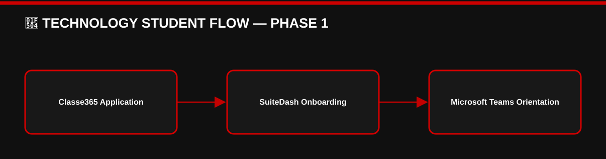
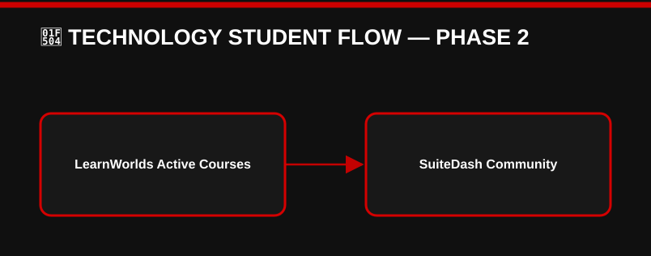

# 👑 RIAH PATHWAY — 11.7 HOW RIAH PATHWAY WORKS WIREFRAME

**[SITEMAP WIREFRAME MD — 11.7-HOW-RIAH-PATHWAY-WORKS-WIREFRAME.md]**
## I. TECHNOLOGY HERO
# ONE CONNECTED INSTITUTIONAL ECOSYSTEM.

**[IMAGE — INSTITUTIONAL SERVICE ECOSYSTEM]**
RIAH Pathway connects academic administration, curriculum, student support, finance, careers, experiential learning, academic records, recognition, and community.
## II. EDUCATION & STUDENT ADMINISTRATION

### 🔄 TECHNOLOGY STUDENT FLOW — PHASE 1

[View editable Mermaid diagram](./IMAGES/FLOW-01-11-7-HOW-RIAH-PATHWAY-WORKS-WIREFRAME.mmd)

### 🔄 TECHNOLOGY STUDENT FLOW — PHASE 2

[View editable Mermaid diagram](./IMAGES/FLOW-02-11-7-HOW-RIAH-PATHWAY-WORKS-WIREFRAME.mmd)

[VIEW COMPLETE EDITABLE MERMAID DIAGRAM](./IMAGES/TECHNOLOGY-STUDENT-FLOW.mmd)

1. **Function:** Admissions, SIS, Academic Records, Degree Audit, Alumni → **Platform:** Classe365
2. **Function:** Learning, Assessments → **Platform:** LearnWorlds
3. **Function:** Digital Courseware → **Platform:** Cengage MindTap
4. **Function:** Portfolios → **Platform:** PebblePad
5. **Function:** Proctoring → **Platform:** ProctorU
6. **Function:** Tutoring → **Platform:** Tutor.com
7. **Function:** Institutional Recognition → **Platform:** Merit Pages
## III. PORTAL, COMMUNITY & SUPPORT
### SuiteDash — Central Ecosystem
1. **Function:** Main Ecosystem, Role-Based Portal, Dashboard → **Platform:** SuiteDash
2. **Function:** Community, Onboarding, Communications → **Platform:** SuiteDash
3. **Function:** Student Resources, Forms, Portal Documents → **Platform:** SuiteDash
4. **Function:** Policies, Procedures, Guidelines → **Platform:** SuiteDash
5. **Function:** Help Desk, Support Tickets, Projects, Tasks, CRM → **Platform:** SuiteDash
**Student → SuiteDash Help Desk → Ticket → Applicable Department → Human Support → Resolution**
## IV. EXPERIENTIAL ECOSYSTEM
### PeopleGrove CORE + Experience Hub + CompMS
1. **Function:** Experiential Ecosystem → **Platform:** PeopleGrove CORE + Experience Hub + CompMS
2. **Function:** Internal and External Placements → **Platform:** PeopleGrove CORE + Experience Hub + CompMS
3. **Function:** Placement Employer and Partner Engagement → **Platform:** PeopleGrove CORE + Experience Hub + CompMS
4. **Function:** Work Assignments, Supervision, Progress, Evaluations → **Platform:** PeopleGrove CORE + Experience Hub + CompMS
**Application  
→ Placement Review  
→ Internal or External  
→ Single-Area, Rotational, or Progressive  
→ Real Work  
→ Supervision  
→ Evaluation  
→ Documented Experience  
→ Career**

**[BUTTON 11-H01 — EXPERIENTIAL → 05]**
## V. REGISTRAR & RECORDS

**[IMAGE — DIGITAL ACADEMIC RECORDS AND VERIFICATION FLOW]**
1. **Function:** Student, Enrollment, Academic Records, Degree Audit, Alumni → **Platform:** Classe365
2. **Function:** Official Transcript Ordering and Delivery → **Platform:** Parchment
3. **Function:** Enrollment and Degree Verification → **Platform:** National Student Clearinghouse
4. **Function:** Recognition → **Platform:** Merit Pages
5. **Function:** Portfolio Evidence → **Platform:** PebblePad
**Student Enrollment  
→ Classe365  
→ Academic Progress and Degree Audit  
→ Official Record  
→ Registrar  
→ Parchment Transcripts / National Student Clearinghouse Verification**

**[ICON — OFFICIAL TRANSCRIPT]**
**Student or Graduate → Request Transcript → Parchment → Institutional Processing → Delivery → Recipient**

**[BUTTON 11-H02 — REQUEST TRANSCRIPT → PARCHMENT]**
**[ICON — VERIFIED ACADEMIC CREDENTIAL]**
**Record → Classe365 → Institutional Reporting → National Student Clearinghouse → Authorized Request → Verification**

**[BUTTON 11-H03 — ENROLLMENT VERIFICATION → NATIONAL STUDENT CLEARINGHOUSE]**
**[BUTTON 11-H04 — DEGREE VERIFICATION → NATIONAL STUDENT CLEARINGHOUSE]**
**Academic Milestone → Institutional Review → Merit Pages → Recognition**

**[BUTTON 11-H05 — ACHIEVEMENTS → 11.5.5]**
## VI. POLICIES, PROCEDURES & GUIDELINES

**[ICON — INSTITUTIONAL DOCUMENT LIBRARY]**
# ONE DOCUMENT ACCESS STRUCTURE: SUITEDASH
1. **Document Category:** Institutional Policies, Procedures, Guidelines → **Platform:** SuiteDash
2. **Document Category:** Student Handbook and Resources → **Platform:** SuiteDash
3. **Document Category:** Admissions and Enrollment Documentation → **Platform:** SuiteDash
4. **Document Category:** Student Forms, Portal Documents, Support Documents → **Platform:** SuiteDash
5. **Document Category:** Student Communications → **Platform:** SuiteDash
**Institutional Document → Review and Approval → SuiteDash Management → Access Permissions → Authorized User**
**Webflow Public Website → Approved Public Information → Applicable SuiteDash Document → Authorized Access**

**[BUTTON 11-H06 — POLICIES → 17.8]**
**[BUTTON 11-H07 — PROCEDURES → 17.9]**

**[BUTTON 11-H08 — GUIDELINES → 17.10]**
## VII. CAREER ECOSYSTEM
### Symplicity CSM
**Career Advising • Career Opportunities • Recruiting • Employer Engagement • Career Milestones**
**Academic Records — Classe365 • Experiential — PeopleGrove • Portfolios — PebblePad • Career Services — Symplicity CSM**

**[BUTTON 11-H09 — CAREER SERVICES → 16.2.20]**
## VIII. STUDENT FINANCIAL ECOSYSTEM
1. **Function:** Financial Aid Administration → **Platform:** Regent Education
2. **Function:** Student Accounts, Tuition Billing, Payment Plans, Disbursement → **Platform:** TouchNet
3. **Function:** General Payments → **Platform:** Stripe

**[BUTTON 11-H10 — TUITION → 12]**
**[BUTTON 11-H11 — FUNDING → 12.5]**
## IX. PUBLIC INSTITUTIONAL TECHNOLOGY MODEL
[DIAGRAM — PUBLIC WEBSITE CONNECTED TO STUDENT SERVICES]
**Webflow  
→ SuiteDash  
→ Classe365  
→ Parchment + National Student Clearinghouse + LearnWorlds + Cengage MindTap + PebblePad + ProctorU + Tutor.com + PeopleGrove CORE + Experience Hub + CompMS + Symplicity CSM + TouchNet + Regent Education + Merit Pages**
1. **Function:** Virtual Meetings → **Platform:** Microsoft Teams
2. **Function:** Productivity → **Platform:** Microsoft 365
3. **Function:** Internal Working Documents → **Platform:** OneDrive
4. **Function:** Automation → **Platform:** Microsoft Power Automate
5. **Function:** Identity → **Platform:** Microsoft Entra ID
6. **Function:** Reporting → **Platform:** Microsoft Power BI
7. **Function:** Public Website → **Platform:** Webflow
[INTERNAL DESIGN NOTE — DO NOT DISPLAY PRIVATE SECURITY CONFIGURATIONS, RESTRICTED INFRASTRUCTURE, CREDENTIALS, OR PROTECTED INFORMATION]
**[ROUTING TABLE — SEE 11-ADMISSIONS-WIREFRAMES-CTA-LINKS-ROUTING.md]**

## X. COMPLETE PUBLIC-FACING SYSTEM FLOW AND RECORDS
**Webflow — Public Website  
→ SuiteDash — Main Portal, Community, Documents, Forms, Support  
→ Classe365 — Admissions, SIS, Academic Records, Degree Audit, Alumni.**
**Connected services:** Parchment — Official Transcripts  
• National Student Clearinghouse — Enrollment and Degree Verification  
• LearnWorlds — Courses and Assessments  
• Cengage MindTap — Digital Courseware  
• PebblePad — Portfolios and Evidence  
• ProctorU — Exam Proctoring  
• Tutor.com — Supplemental Tutoring  
• PeopleGrove CORE + Experience Hub + CompMS — Experiential  
• Symplicity CSM — Career  
• TouchNet — Student Finance  
• Regent Education — Financial Aid  
• Merit Pages — Institutional Recognition.
### Registrar Flows
**Student or Graduate → Request Official Transcript → Parchment → Applicable Institutional Processing → Official Transcript Delivery → Authorized Recipient.**
**Student or Graduate Record  
→ Classe365  
→ Applicable Institutional Reporting  
→ National Student Clearinghouse  
→ Authorized Verification Request  
→ Enrollment or Degree Verification.**
**Academic Milestone → Institutional Review → Merit Pages → Applicable Recognition.**
### Document and Support Flows
**Institutional Document → Review and Approval → SuiteDash Document / Resource Management → Applicable Access Permissions → Authorized User.**
**Student → SuiteDash Help Desk → Support Ticket → Applicable Department → Human Support → Resolution.**
### Platform Responsibilities
**SuiteDash:** Main portal, role-based dashboard, community, onboarding, communications, resources, forms, portal documents, policies, procedures, guidelines, help desk, tickets, projects, tasks, CRM.
**Classe365:** Admissions, student information, academic records, degree audit, alumni.
**PeopleGrove CORE + Experience Hub + CompMS:** Internal and external placements, employer and partner engagement, work assignments, supervision, progress, evaluations.
**Symplicity CSM:** Career advising, opportunities, recruiting, employer engagement, career milestones.
**Microsoft Teams:** Virtual meetings. **Microsoft 365:** Productivity. **OneDrive:** Working documents. **Microsoft Power Automate:** Automation. **Microsoft Entra ID:** Authentication. **Microsoft Power BI:** Reporting.

**[BUTTON — REQUEST TRANSCRIPT → PARCHMENT]**
**[BUTTON — ENROLLMENT VERIFICATION → NATIONAL STUDENT CLEARINGHOUSE]**

**[BUTTON — DEGREE VERIFICATION → NATIONAL STUDENT CLEARINGHOUSE]**
**[BUTTON — POLICIES → 17.8]**

**[BUTTON — PROCEDURES → 17.9]**
**[BUTTON — GUIDELINES → 17.10]**

---

## ORIGINAL ADMISSIONS MAIN WIREFRAME — 11.7 CROSS-REFERENCE

## X. HOW RIAH PATHWAY WORKS OVERVIEW

**[IMAGE — INSTITUTIONAL SERVICE ECOSYSTEM]**
**Webflow — Public Website → SuiteDash — Portal, Community, Documents, Forms, Support → Classe365 — Admissions, SIS, Records, Degree Audit, Alumni**
**Parchment — Official Transcripts  
• National Student Clearinghouse — Enrollment and Degree Verification  
• LearnWorlds — Courses  
• Cengage MindTap — Courseware  
• PebblePad — Portfolios  
• ProctorU — Proctoring  
• Tutor.com — Tutoring  
• PeopleGrove CORE + Experience Hub + CompMS — Experiential  
• Symplicity CSM — Careers  
• TouchNet — Finance  
• Regent Education — Financial Aid  
• Merit Pages — Recognition**

**[BUTTON 11-M13 — HOW RIAH PATHWAY WORKS → 11.7]**

---

<!-- APPROVED ADMISSIONS DRAFT DISTRIBUTION — 2026-10-08 -->

# 👑 ADMISSIONS DRAFT — APPROVED UPDATES

**Original content above retained verbatim.** The following approved updates are distributed from `DRAFT-ADMISSIONS-WIREFRAME-DRAFT.md`.  
Only specifically conflicting student-facing details are superseded; other original content is preserved.

## 🔄 LIMITED SUPERSEDED TECH STACK REFERENCES — ADMISSIONS ONLY
| Row | Student-facing function | Superseded reference | Current reference | Scope |
| --- | --- | --- | --- | --- |
| 1 | Applications / admissions   | No change   | Classe365   | Retain existing application references |
| Row | Student-facing function | Superseded reference | Current reference | Scope |
| --- | --- | --- | --- | --- |
| 2 | Onboarding / student portal   | No change   | SuiteDash   | Retain existing onboarding references |
| Row | Student-facing function | Superseded reference | Current reference | Scope |
| --- | --- | --- | --- | --- |
| 3 | Virtual orientation / training / cohort sessions   | Zoom   | Microsoft Teams   | Use Teams for student-facing virtual sessions |
| Row | Student-facing function | Superseded reference | Current reference | Scope |
| --- | --- | --- | --- | --- |
| 4 | Student school/cohort communities   | Slack; Geneva   | SuiteDash   | Use SuiteDash for student community |
| Row | Student-facing function | Superseded reference | Current reference | Scope |
| --- | --- | --- | --- | --- |
| 5 | LMS / active course access   | No change   | LearnWorlds   | Provision during onboarding; open course access at active start |
| Row | Student-facing function | Superseded reference | Current reference | Scope |
| --- | --- | --- | --- | --- |
| 6 | Experiential placement functions   | Earlier references if any   | PeopleGrove CORE + Experience Hub + CompMS   | Update only existing relevant placement-system mentions |
| Row | Student-facing function | Superseded reference | Current reference | Scope |
| --- | --- | --- | --- | --- |
| 7 | Career services   | Earlier references if any   | Symplicity CSM   | Update only existing relevant career-service mentions |
| Row | Student-facing function | Superseded reference | Current reference | Scope |
| --- | --- | --- | --- | --- |
| 8 | Student recognition   | Earlier references if any   | Merit Pages   | Update only existing relevant recognition-system mentions |

**Technology limitation:** Do not copy the finalized tech-stack document into this wireframe.  
Do not add internal infrastructure, cybersecurity architecture, private databases, proprietary curriculum systems, or unrelated software.  
Existing original wireframe source text remains preserved above; this addendum governs only the specifically superseded Admissions student-experience references.

**[BUTTON — APPLY NOW → CLASSE365]**

**[BUTTON — PRE-ADMISSIONS → 11.2]**
**[BUTTON — ACCEPTANCE & ENROLLMENT → 11.4]**

**[BUTTON — STUDENT EXPERIENCE → 11.5]**
**[BUTTON — GRADUATION & ALUMNI → 11.6]**

**[BUTTON — TRANSFER STUDENTS → 11.8]**

---

## ADMISSIONS FLOW DIAGRAMS — MERMAID

**[IMAGE — BLACK AND RED ADMISSIONS FLOW DIAGRAMS]**

### FLOW 01 ADMISSIONS TO ALUMNI

[VIEW EDITABLE MERMAID DIAGRAM](./IMAGES/FLOW-01-ADMISSIONS-TO-ALUMNI.mmd)

### FLOW 04 ORIENTATION AND LMS ACCESS

[VIEW EDITABLE MERMAID DIAGRAM](./IMAGES/FLOW-04-ORIENTATION-AND-LMS-ACCESS.mmd)

---
