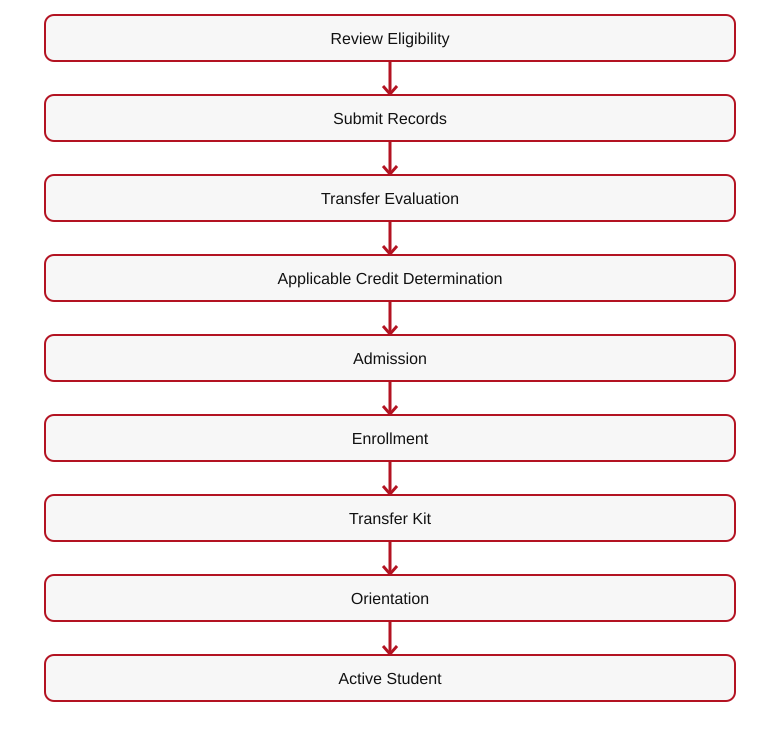
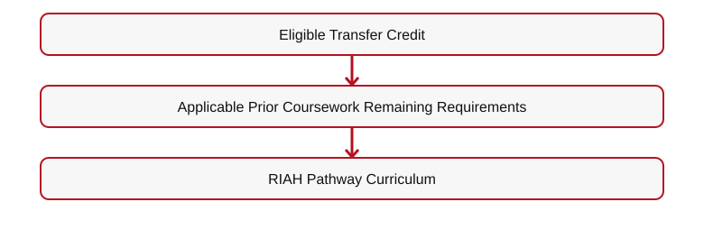
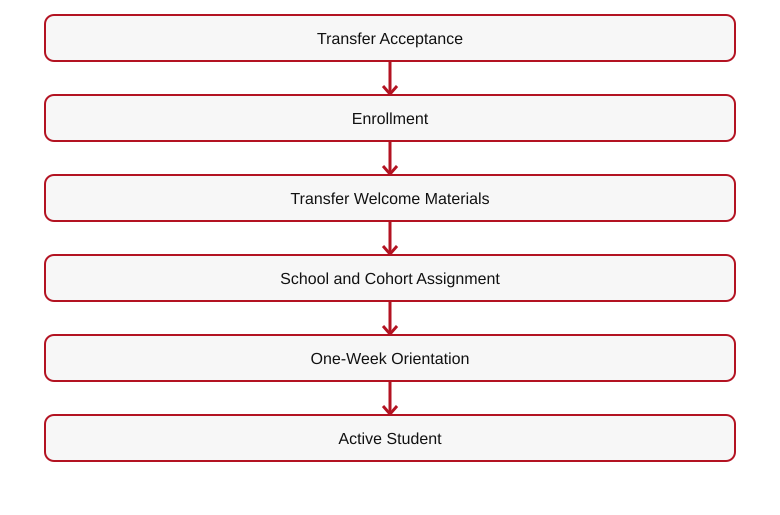
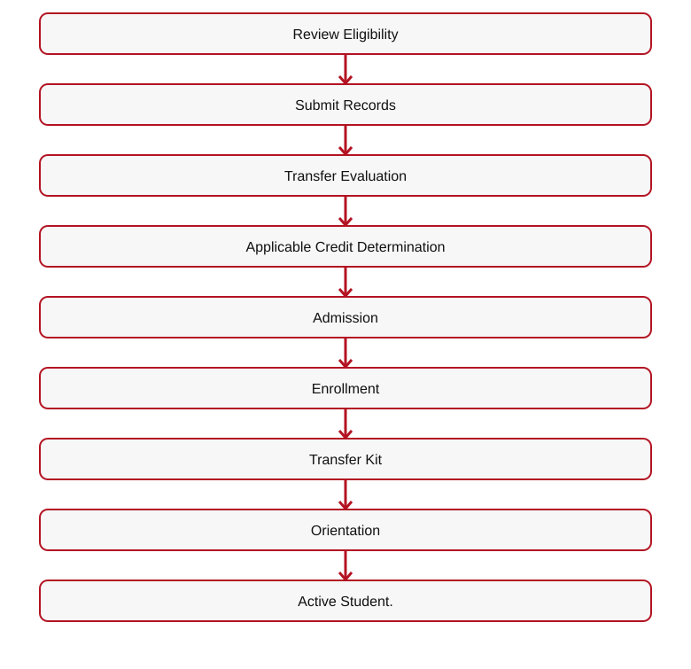
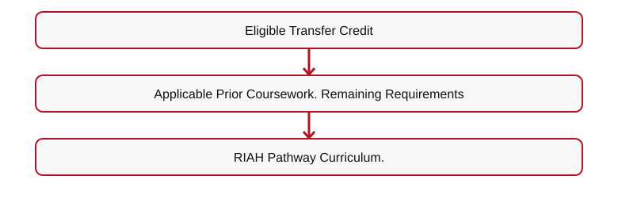
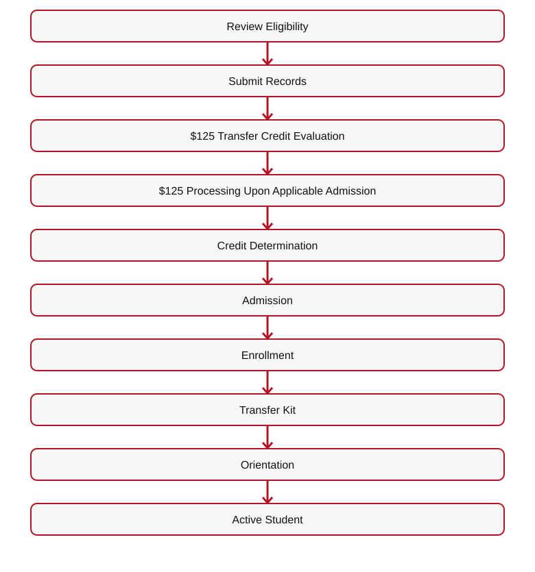

# 👑 RIAH PATHWAY — 11.8 TRANSFER STUDENTS WIREFRAME
## I. TRANSFER STUDENTS HERO
# YOUR PREVIOUS EDUCATION CAN HELP SHAPE YOUR NEXT PATHWAY.

**[IMAGE — TRANSFER STUDENT JOURNEY]**
## II. TRANSFER FLOW
**Explore Transfer Pathway**  

[Mermaid source](IMAGES/11.7-TRANSFER-STUDENTS-FLOW-01.mmd)

## III. TRANSFER CREDIT MAXIMUMS
**Highly recommended — bachelor's Year 3 preparation:** Complete the applicable **General Education and School Core** requirements before seeking admission into Year 3, with a target of **up to 60 approved foundational transfer credits** where applicable. Sources for individualized evaluation include **Sophia.org, StraighterLine, accredited colleges/universities, AP, IB, SAT, ACT, CLEP, or approved RIAH placement/test-out**. Alternative coursework, examination results, and placement scores require RIAH course-level equivalency review; **SAT/ACT scores do not automatically confer college credit**. Each school's actual core still controls (the School of Technology core, for example, is 39 credits). Applicants without all approved foundational coursework complete the missing General Education and School Core courses through RIAH before Year 3. Submit external credits in the initial transfer evaluation window; **bachelor's Years 3–4 use RIAH-controlled coursework and do not accept outside transfer credit**.

**Acceleration after Year 3 admission:** Rigorous RIAH-controlled major coursework remains subject to required proctored objective/performance assessments (at least **80% each**), other tests and capstones. One month is the earliest potential curriculum-completion benchmark where the pathway permits.
**Tuition is the same with or without approved transfer or alternative credits.** Transfer credits can reduce the number of RIAH courses remaining and **change the student's pacing and entry point, not the published program tuition**; the established Transfer Tuition Reduction remains **$0**. Any applicable application, resource-allocation, or optional transfer-evaluation fees remain governed by their separate schedules.

**Acceleration example (not a guarantee):** A student might finish the eligible outside General Education/School Core courses in **one month**, complete the initial transfer-credit review, and—if the school-specific prerequisites are satisfied—complete the remaining approved RIAH curriculum in **another month**. The actual outside-learning period may instead take two years or longer, and the RIAH portion may take longer. A one-month RIAH coursework benchmark applies **only where academic, accreditation, supervision, minimum-duration, payment, and other credentialing requirements permit**; it does not promise a one-month bachelor's, master's, MBA, or J.D. award.

**RIAH's post-transfer academic rigor is unchanged:** Bachelor's **Years 3 and 4** remain RIAH-controlled, and **master's, MBA, and J.D.** coursework remains subject to each program's established admissions, progression, and degree requirements. Required courses use **proctored objective assessments, performance assessments, or both**, with **ProctorU** as RIAH's assessment-proctoring platform; the required assessment passing threshold is **80% or higher**, along with any other course tests, projects, professional oversight, and **supervised capstones where applicable**. A transfer or accelerated pace waives none of these requirements.
| Credential | Maximum Transfer Credit |
| --- | --- |
| Associate's | 30 (general education, school core, or any combination of both; initial transfer evaluation only) |
| Bachelor's | 60 (general education and school core only; no transfer credit for Years 3 or 4) |
| MBA | 9 |
**Credential:** Master's → **Maximum Transfer Credit:** 9
4. **Credential:** J.D. → **Maximum Transfer Credit:** 27 (1L / Year 1 coursework only; transfer entry is permitted after Year 1. No transfer into J.D. Years 2, 3, or 4.)
**J.D. transfer restriction:** Applicants may transfer into the J.D. pathway after completing Year 1 (1L) at an eligible law school, with up to 27 approved credits from that first year. Transfers into J.D. Year 2, Year 3, or Year 4 are not permitted. This is a one-time entry opportunity after Year 1, not an opportunity to transfer credits earned in later J.D. years.

**Master's and MBA transfer maximums:** Each permits up to 9 approved transfer credits, subject to evaluation and program requirements.

**Final transfer-credit restrictions (education pathways):** Associate's — up to 30 credits from general education, school core, or a combination of both. Bachelor's — up to 60 credits applicable only to general education and school core. Bachelor's Years 3 and 4 consist of RIAH Pathway coursework and do not accept transfer credits; no additional transfer credits may be added after the initial transfer evaluation and placement. Master's — up to 9 credits. MBA — up to 9 credits. J.D. — up to 27 approved first-year (1L) credits for entry after Year 1 only; no J.D. transfer into Years 2, 3, or 4. Transfer credit is determined once as part of the initial transfer evaluation; later additional transfer-credit submissions are not accepted. High School and GED/HSE admission and transfer parameters remain subject to separate review and are not changed by this clarification.

## IV. TRANSFER EVALUATION FEE
# $250 (WHEN BOTH SERVICES APPLY)
## Transfer Credit Evaluation — One-Time Optional Service

| Component | Fee | Timing |
| --- | ---: | --- |
| Transfer credit evaluation (including alternative credit, prior learning, and applicable previous coursework) | $125 | After prerequisite/transcript eligibility review and before determining which credits apply |
| Processing and administration | $125 | Once the student is admitted to the applicable program/year and the transfer credit determination is processed |
| **Total when both services apply** | **$250** | **One-time; not charged twice for the same evaluation** |

The $250 is **not charged to every applicant**. It applies only to students requesting transfer credit evaluation and subsequent processing. Transcripts are submitted during pre-admissions and reviewed for prerequisite eligibility and outstanding requirements. Students meeting the applicable education admission requirements are admitted; the transfer credit evaluation determines which previous credits apply and which courses remain, rather than determining whether the student is admitted. Students with missing prerequisites are informed of the deficiencies and may return after completing them for a follow-up review without a second evaluation charge. For a Year 3 placement, the transfer evaluation and required prerequisites must be completed before Year 3 admission/placement. The $125 processing and administration portion is assessed only once the student is admitted to the applicable year or master's/MBA program. J.D. transfers are limited to up to 27 Year 1 (1L) credits and entry after Year 1; no transfers into J.D. Years 2–4. Master's and MBA transfer limits are 9 credits each.

**Admissions positioning:** Accessible education for applicants who meet program prerequisites; affordable program pricing; rigorous proctored assessments, performance assessments, and capstones. Educational admission is based on meeting published prerequisites and transcript requirements, not on purchasing the optional transfer credit evaluation service.

Transfer credits remain subject to evaluation, approval, and applicable academic or regulatory requirements.
## V. TRANSFER ARCHITECTURE

[Mermaid source](IMAGES/11.7-TRANSFER-STUDENTS-FLOW-02.mmd)

**[IMAGE — PREVIOUS CREDITS → TRANSFER EVALUATION → REMAINING CURRICULUM]**
### Personalized Student Collections After Transfer Credit Evaluation

**Course-by-course determination:** After the one-time transfer credit evaluation, RIAH Pathway identifies the student's accepted credits, outstanding general education courses, outstanding school core courses, and any remaining major, capstone, or program requirements. The student's academic course plan determines the contents of their internal student collection package.

**Not one-size-fits-all:** Each student receives a personalized collection of applicable textbooks, workbooks, study guides, review guides, journals, planners, flashcards, and other course resources based on the courses they actually need to complete. Students do not automatically receive the entire general education or school core collection when approved transfer credits have already satisfied some or all of those courses.

**Example:** A bachelor's transfer student whose approved credits satisfy all general education requirements but not the school core receives the outstanding school core course collections, plus the applicable subsequent major and capstone materials; the student does **not** need a complete general education collection. If only some general education or core courses remain, include the collections for those outstanding courses only.

**Fulfillment and student experience:** Finalize the personalized course and collection list after transfer evaluation and placement, before assembling or assigning the student's applicable learning materials and Welcome/Transfer Kit resources. Continue to apply the established deposit, onboarding, and kit-delivery requirements. The internal student collection is determined by actual outstanding coursework, not a uniform full-program bundle.

## VI. TRANSFER WELCOME EXPERIENCE
Transfer students receive applicable transfer materials. After admissions and enrollment requirements, transfer students proceed through standard welcome and orientation.

**[IMAGE — TRANSFER STUDENT WELCOME KIT]**
## VII. TRANSFER ONBOARDING & ORIENTATION

[Mermaid source](IMAGES/11.7-TRANSFER-STUDENTS-FLOW-03.mmd)

**[BUTTON 11-T01 — ONBOARDING & STUDENT EXPERIENCE → 11.5]**
## VIII. TRANSFER RESOURCES

**[DOWNLOAD — TRANSFER STUDENT CHECKLIST]**
**[BUTTON 11-T02 — TRANSFER ADMISSIONS → SUITEDASH FORM]**

**[BUTTON 11-T03 — DEGREE PROGRAMS → 04]**
**[BUTTON 11-T04 — TUITION → 12]**
## IX. FINAL CTA

**[BUTTON 11-T05 — APPLY NOW → 11.3]**
**[BUTTON 11-T06 — CONTACT ADMISSIONS → 19.2]**
**[ROUTING TABLE — SEE 11-ADMISSIONS-WIREFRAMES-CTA-LINKS-ROUTING.md]**

## X. COMPLETE TRANSFER ELIGIBILITY AND STUDENT FLOW
**Explore Transfer Pathway**  

[Mermaid source](IMAGES/11.7-TRANSFER-STUDENTS-FLOW-04.mmd)

| Credential | Maximum Transfer Credit |
| --- | --- |
| Associate's | 30 (general education, school core, or any combination of both; initial transfer evaluation only) |
| Bachelor's | 60 (general education and school core only; no transfer credit for Years 3 or 4) |
| MBA | 9 |
**Credential:** Master's → **Maximum Transfer Credit:** 9
4. **Credential:** J.D. → **Maximum Transfer Credit:** 27 (1L / Year 1 coursework only; transfer entry is permitted after Year 1. No transfer into J.D. Years 2, 3, or 4.)
**Transfer Credit Evaluation: $125; Processing and Administration: $125 upon applicable admission/placement; total $250 when both apply, one-time.**

[Mermaid source](IMAGES/11.7-TRANSFER-STUDENTS-FLOW-05.mmd)

**Transfer kit:** Applicable transfer materials provided at transfer confirmation; student continues through the standard welcome, orientation, school, major, and cohort flow.
**Year 3 transfer:** General education and school core requirements must be completed before Year 3 admission. All transfer credit must be evaluated and applied at initial placement; Years 3 and 4 require RIAH Pathway coursework with no further transfers.
**Minor transfer:** Applicable minor prerequisites must be completed.
**Master's / MBA transfer:** Applicable bachelor's degree or accepted equivalent and any outstanding program prerequisites must be completed before admission.

**[DOWNLOAD — TRANSFER STUDENT CHECKLIST]**
**[BUTTON — PRE-ADMISSIONS → 11.2]**

**[BUTTON — DEGREE PROGRAMS → 04]**

---

## ORIGINAL ADMISSIONS MAIN WIREFRAME — 11.8 CROSS-REFERENCE

## XI. TRANSFER STUDENTS OVERVIEW

**[IMAGE — TRANSFER STUDENT JOURNEY]**
**Explore Transfer**  

[Mermaid source](IMAGES/11.7-TRANSFER-STUDENTS-FLOW-06.mmd)

**[BUTTON 11-M14 — TRANSFER STUDENTS → 11.8]**

---
