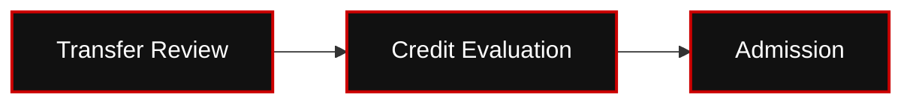
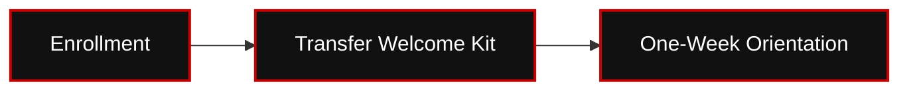

# 👑 RIAH PATHWAY — 11.8 TRANSFER STUDENTS WIREFRAME

**[SITEMAP WIREFRAME MD — 11.8-TRANSFER-STUDENTS-WIREFRAME.md]**
## I. TRANSFER STUDENTS HERO
# YOUR PREVIOUS EDUCATION CAN HELP SHAPE YOUR NEXT PATHWAY.

**[IMAGE — TRANSFER STUDENT JOURNEY]**
## II. TRANSFER FLOW

### 🔄 TRANSFER STUDENT JOURNEY — PHASE 1

### 🔄 TRANSFER STUDENT JOURNEY — PHASE 2

### 🔄 TRANSFER STUDENT JOURNEY — PHASE 3

[VIEW COMPLETE EDITABLE MERMAID DIAGRAM](./IMAGES/MERMAIDS/TRANSFER-STUDENT-JOURNEY.mmd)

**Explore Transfer Pathway  
→ Review Eligibility  
→ Submit Records  
→ Transfer Evaluation  
→ Applicable Credit Determination  
→ Admission  
→ Enrollment  
→ Transfer Kit  
→ Orientation  
→ Active Student**
## III. TRANSFER CREDIT MAXIMUMS
1. **Credential:** Associate's → **Maximum Transfer Credit:** 30
2. **Credential:** Bachelor's → **Maximum Transfer Credit:** 60
3. **Credential:** MBA → **Maximum Transfer Credit:** 9
4. **Credential:** J.D. → **Maximum Transfer Credit:** 60
## IV. TRANSFER EVALUATION FEE
# $500
**Transfer Evaluation Fee: $500.**
Transfer credits remain subject to evaluation, approval, and applicable academic or regulatory requirements.
## V. TRANSFER ARCHITECTURE
**Eligible Transfer Credit → Applicable Prior Coursework**
**Remaining Requirements → RIAH Pathway Curriculum**

**[IMAGE — PREVIOUS CREDITS → TRANSFER EVALUATION → REMAINING CURRICULUM]**
## VI. TRANSFER WELCOME EXPERIENCE
Transfer students receive applicable transfer materials. After admissions and enrollment requirements, transfer students proceed through standard welcome and orientation.

**[IMAGE — TRANSFER STUDENT WELCOME KIT]**
## VII. TRANSFER ONBOARDING & ORIENTATION
**Transfer Acceptance → Enrollment → Transfer Welcome Materials → School and Cohort Assignment → One-Week Orientation → Active Student**

**[BUTTON 11-T01 — ONBOARDING & STUDENT EXPERIENCE → 11.5]**
## VIII. TRANSFER RESOURCES

**[DOWNLOAD — TRANSFER STUDENT CHECKLIST]**
**[BUTTON 11-T02 — TRANSFER ADMISSIONS → SUITEDASH FORM]**

**[BUTTON 11-T03 — DEGREE PROGRAMS → 04]**
**[BUTTON 11-T04 — TUITION → 12]**
## IX. FINAL CTA

**[BUTTON 11-T05 — APPLY NOW → 11.3]**
**[BUTTON 11-T06 — CONTACT ADMISSIONS → 19.2]**
**[ROUTING TABLE — SEE 11-ADMISSIONS-WIREFRAMES-CTA-LINKS-ROUTING.md]**

## X. COMPLETE TRANSFER ELIGIBILITY AND STUDENT FLOW
**Explore Transfer Pathway  
→ Review Eligibility  
→ Submit Records  
→ Transfer Evaluation  
→ Applicable Credit Determination  
→ Admission  
→ Enrollment  
→ Transfer Kit  
→ Orientation  
→ Active Student.**
1. **Credential:** Associate's → **Maximum Transfer Credit:** 30
2. **Credential:** Bachelor's → **Maximum Transfer Credit:** 60
3. **Credential:** MBA → **Maximum Transfer Credit:** 9
4. **Credential:** J.D. → **Maximum Transfer Credit:** 60
**Transfer Evaluation Fee: $500.**
**Eligible Transfer Credit → Applicable Prior Coursework. Remaining Requirements → RIAH Pathway Curriculum.**
**Transfer kit:** Applicable transfer materials provided at transfer confirmation; student continues through the standard welcome, orientation, school, major, and cohort flow.
**Year 3 transfer:** General education and school core requirements must be completed before Year 3 admission.
**Minor transfer:** Applicable minor prerequisites must be completed.
**Master's / MBA transfer:** Applicable bachelor's degree or accepted equivalent and any outstanding program prerequisites must be completed before admission.

**[DOWNLOAD — TRANSFER STUDENT CHECKLIST]**
**[BUTTON — PRE-ADMISSIONS → 11.2]**

**[BUTTON — DEGREE PROGRAMS → 04]**

---

## ORIGINAL ADMISSIONS MAIN WIREFRAME — 11.8 CROSS-REFERENCE

## XI. TRANSFER STUDENTS OVERVIEW

**[IMAGE — TRANSFER STUDENT JOURNEY]**
**Explore Transfer  
→ Review Eligibility  
→ Submit Records  
→ $500 Transfer Evaluation  
→ Credit Determination  
→ Admission  
→ Enrollment  
→ Transfer Kit  
→ Orientation  
→ Active Student**

**[BUTTON 11-M14 — TRANSFER STUDENTS → 11.8]**

---

<!-- APPROVED ADMISSIONS DRAFT DISTRIBUTION — 2026-10-08 -->

# 👑 ADMISSIONS DRAFT — APPROVED UPDATES

**Original content above retained verbatim.** The following approved updates are distributed from `DRAFT-ADMISSIONS-WIREFRAME-DRAFT.md`.  
Only specifically conflicting student-facing details are superseded; other original content is preserved.

## 🎒 TRANSFER STUDENT WELCOME BRANCH — APPROVED UPDATE

**Transfer branch:** High School, GED, Associate's, Bachelor's, JD and Non-JD transfer entrants receive a transfer-specific welcome letter, transfer materials, orientation/credit-pathway information and resources, plus the standard personalized Welcome Experience.  
Transfer students then follow the same orientation, cohort, active student, graduation and alumni flow.

**Standard sequence:** Transfer eligibility and credit evaluation  
→ admission  
→ enrollment commitment  
→ required deposit  
→ transfer-specific kit and standard Welcome Experience  
→ one-week virtual orientation  
→ school, major and monthly cohort community  
→ active student experience  
→ graduation  
→ alumni.

**[IMAGE — TRANSFER BRANCH REJOINS STANDARD ADMISSIONS-TO-ALUMNI FLOW]**

---

## ADMISSIONS FLOW DIAGRAMS — MERMAID

**[IMAGE — BLACK AND RED ADMISSIONS FLOW DIAGRAMS]**

### FLOW 03 TRANSFER STUDENT JOURNEY

[VIEW EDITABLE MERMAID DIAGRAM](./IMAGES/FLOW-03-TRANSFER-STUDENT-JOURNEY.mmd)

---
