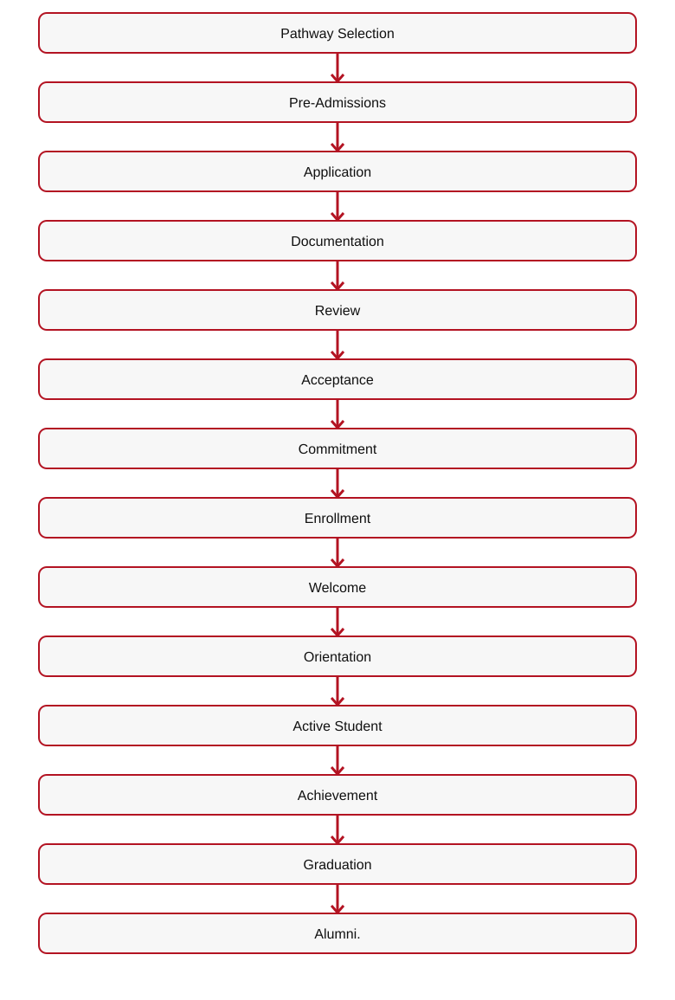
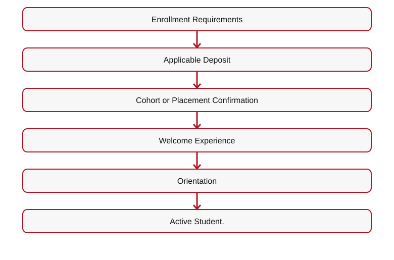

# 👑 RIAH PATHWAY — 11 ADMISSIONS — MAIN WIREFRAME
**ONE DYNASTY. INFINITE LEGACIES.**
## I. GLOBAL WEBSITE HEADER

**[LOGO — RIAH PATHWAY UNIFIED CROWN]**
**[NAVIGATION — 01 HOME**  
• 02 ABOUT  
• 03 PATHWAY  
• 04 DEGREE PROGRAMS  
• 05 EXPERIENTIAL  
• 06 HIGH SCHOOL  
• 07 GED/HSE  
• 08 CERTIFICATION REVIEW  
• 09 BAR REVIEW  
• 10 CURRICULUM  
• 11 ADMISSIONS  
• 12 TUITION  
• 13 DONATIONS  
• 14 PRODUCTS  
• 15 ACCREDITATION & AUTHORIZATION  
• 16 JOIN US  
• 17 RESOURCES  
• 18 FAQ  
• 19 CONTACT]**
**[MOBILE NAVIGATION — COLLAPSIBLE MENU]**

**[BUTTON 11-M01 — APPLY NOW → CLASSE365]**
**[BUTTON 11-M02 — LOG IN → SUITEDASH]**
## II. ADMISSIONS HERO & OVERVIEW

**[VIDEO — ADMISSIONS JOURNEY: EXPLORING, APPLYING, ACCEPTANCE, COHORTS, EDUCATION, GRADUATION]**
# FROM INTEREST TO ENROLLMENT. ONE CONNECTED PATH.
RIAH Pathway provides a structured admissions experience connecting pathway exploration, pre-admissions, eligibility review, applications, documentation, admission decisions, acceptance, enrollment, cohort placement, onboarding, orientation, active student experience, graduation, and alumni engagement.
**Explore**  

[Mermaid source](IMAGES/ADMISSIONS-WIREFRAME-MAIN-FLOW-01.mmd)

**[IMAGE — COMPLETE ADMISSIONS-TO-ALUMNI STUDENT JOURNEY]**
**[BUTTON 11-M03 — APPLY NOW → CLASSE365]**

**[BUTTON 11-M04 — PRE-ADMISSIONS → 11.2]**
**[BUTTON 11-M05 — PATHWAYS → 03]**
## III. COMPLETE STUDENT JOURNEY
| Stage | Stage Name | Student Experience | Communication |
| --- | --- | --- | --- |
| 1 | Interest | Explore pathways, schools, curriculum, tuition, resources | Digital |
| 2 | Pathway Selection | Select educational or experiential route | Digital |
| 3 | Pre-Admissions | Review eligibility and requirements | Digital |
| 4 | Application | Submit application | Digital |
| 5 | Documentation | Submit required records | Digital |
| 6 | Review | Institutional and pathway-specific review | Digital |
| 7 | Acceptance | Receive decision | Digital + Physical |
| 8 | Commitment | Enrollment requirements | Digital |
| 9 | Enrollment | Cohort or placement | Digital |
| 10 | Welcome | Student materials and portal | Digital + Physical + Community |
| 11 | Orientation | One-week virtual orientation | Digital + Community |
| 12 | Active Student | Courses, experience, student life | Digital + Community |
| 13 | Achievement | Milestones | Digital + Applicable Physical |
| 14 | Graduation | Graduation requirements | Digital + Physical |
| 15 | Alumni | Professional and institutional engagement | Digital + Community |

**[IMAGE — STUDENT JOURNEY WITH DIGITAL, PHYSICAL, COMMUNITY ICONS]**
## IV. MONTHLY COHORT MODEL

**[ICON — MONTHLY CALENDAR]**
1. **Academic Preparation:** Orientation → **Student Community:** Cohort identity → **Institutional Operations:** Enrollment processing
2. **Academic Preparation:** Academic readiness → **Student Community:** School connection → **Institutional Operations:** Student account preparation
3. **Academic Preparation:** Pathway preparation → **Student Community:** Peer connection → **Institutional Operations:** Portal access
4. **Academic Preparation:** Resource training → **Student Community:** Community participation → **Institutional Operations:** Academic-system access
5. **Academic Preparation:** Student expectations → **Student Community:** Student organizations → **Institutional Operations:** Placement coordination

[Mermaid source](IMAGES/ADMISSIONS-WIREFRAME-MAIN-FLOW-02.mmd)

**[BUTTON 11-M06 — ACCEPTANCE & ENROLLMENT → 11.4]**
## V. PRE-ADMISSIONS OVERVIEW

**[ICON — ADMISSIONS CHECKLIST]**
# KNOW YOUR PATH BEFORE YOU APPLY.
1. **Section:** 11.2.1 → **Category:** General Admissions → **Purpose:** Eligibility, documentation, academic standing
2. **Section:** 11.2.2 → **Category:** School and Major → **Purpose:** Year 3, minors, master's, MBA, prerequisites
3. **Section:** 11.2.3 → **Category:** Experiential → **Purpose:** Levels, placements, prerequisites
4. **Section:** 11.2.4 → **Category:** High School → **Purpose:** Grades 9–12, transcripts, concurrent coursework
5. **Section:** 11.2.5 → **Category:** GED/HSE → **Purpose:** Preparation and 12 college credits
6. **Section:** 11.2.6 → **Category:** Law → **Purpose:** J.D., Non-J.D., applicable requirements

**[BUTTON 11-M07 — PRE-ADMISSIONS → 11.2]**
## VI. APPLICATION OVERVIEW

**[IMAGE — STUDENT COMPLETING DIGITAL APPLICATION]**
# YOUR FORMAL ENTRY INTO THE ADMISSIONS PROCESS.
**Classe365 • $50 NON-REFUNDABLE APPLICATION PROCESSING FEE**
**Student Information • Selected Pathway • Prior Education • Academic History • Required Documentation • Applicable Pathway Questions • Communications**

[Mermaid source](IMAGES/ADMISSIONS-WIREFRAME-MAIN-FLOW-03.mmd)

**[BUTTON 11-M08 — APPLY NOW → CLASSE365]**
**[BUTTON 11-M09 — APPLICATION → 11.3]**
## VII. ACCEPTANCE & ENROLLMENT OVERVIEW

**[IMAGE — PERSONALIZED ACCEPTANCE LETTER WITH UNIFIED CROWN]**
# WELCOME TO THE PATHWAY.
**Digital Acceptance + Physical Personalized Acceptance Letter**
**Student Name • School Identity • Selected Pathway • Institutional Branding • Unified Crown • Acceptance Information • Next Steps**

**[ICON — ACCEPTANCE LETTER WITH SEAL]**

[Mermaid source](IMAGES/ADMISSIONS-WIREFRAME-MAIN-FLOW-04.mmd)

**[BUTTON 11-M10 — ACCEPTANCE & ENROLLMENT → 11.4]**
## VIII. ONBOARDING & STUDENT EXPERIENCE OVERVIEW

**[IMAGE — RIAH PATHWAY WELCOME KIT]**
**Physical Welcome Materials + Digital Access + School Identity + Cohort Community**
**Student ID • School Materials • Academic Materials • Orientation Materials • Branded Items • Applicable Robe • Scarf • Bag • Student Resources**
1. **Orientation Area:** Academics → **Preparation:** Expectations and resources
2. **Orientation Area:** Technology → **Preparation:** Systems and access
3. **Orientation Area:** Institution → **Preparation:** Institutional identity
4. **Orientation Area:** Community → **Preparation:** School, cohort, organizations
5. **Orientation Area:** Experiential → **Preparation:** Placement and supervision
6. **Orientation Area:** Law → **Preparation:** Legal supervision requirements
7. **Orientation Area:** Career → **Preparation:** Career-development resources

**[BUTTON 11-M11 — ONBOARDING & STUDENT EXPERIENCE → 11.5]**
## IX. GRADUATION & ALUMNI OVERVIEW

**[IMAGE — REGIONAL GRADUATION CEREMONY]**
**NORTH • SOUTH • EAST • WEST**
**Regional In-Person Ceremony + Virtual Graduation Option**

[Mermaid source](IMAGES/ADMISSIONS-WIREFRAME-MAIN-FLOW-05.mmd)

**[BUTTON 11-M12 — GRADUATION & ALUMNI → 11.6]**
## X. HOW RIAH PATHWAY WORKS OVERVIEW

**[IMAGE — INSTITUTIONAL SERVICE ECOSYSTEM]**

[Mermaid source](IMAGES/ADMISSIONS-WIREFRAME-MAIN-FLOW-06.mmd)

**Parchment — Official Transcripts**  
• National Student Clearinghouse — Enrollment and Degree Verification  
• LearnWorlds — Courses  
• Cengage MindTap — Courseware  
• PebblePad — Portfolios  
• ProctorU — Proctoring  
• Tutor.com — Tutoring  
• PeopleGrove CORE + Experience Hub + CompMS — Experiential  
• Symplicity CSM — Careers  
• TouchNet — Finance  
• Regent Education — Financial Aid  
• Merit Pages — Recognition**

**[BUTTON 11-M13 — HOW RIAH PATHWAY WORKS → 11.7]**
## XI. TRANSFER STUDENTS OVERVIEW

### Personalized Student Collections After Transfer Credit Evaluation

**Course-by-course determination:** After the one-time transfer credit evaluation, RIAH Pathway identifies the student's accepted credits, outstanding general education courses, outstanding school core courses, and any remaining major, capstone, or program requirements. The student's academic course plan determines the contents of their internal student collection package.

**Not one-size-fits-all:** Each student receives a personalized collection of applicable textbooks, workbooks, study guides, review guides, journals, planners, flashcards, and other course resources based on the courses they actually need to complete. Students do not automatically receive the entire general education or school core collection when approved transfer credits have already satisfied some or all of those courses.

**Example:** A bachelor's transfer student whose approved credits satisfy all general education requirements but not the school core receives the outstanding school core course collections, plus the applicable subsequent major and capstone materials; the student does **not** need a complete general education collection. If only some general education or core courses remain, include the collections for those outstanding courses only.

**Fulfillment and student experience:** Finalize the personalized course and collection list after transfer evaluation and placement, before assembling or assigning the student's applicable learning materials and Welcome/Transfer Kit resources. Continue to apply the established deposit, onboarding, and kit-delivery requirements. The internal student collection is determined by actual outstanding coursework, not a uniform full-program bundle.

**Final transfer-credit restrictions (education pathways):** Associate's — up to 30 credits from general education, school core, or a combination of both. Bachelor's — up to 60 credits applicable only to general education and school core. Bachelor's Years 3 and 4 consist of RIAH Pathway coursework and do not accept transfer credits; no additional transfer credits may be added after the initial transfer evaluation and placement. Master's — up to 9 credits. MBA — up to 9 credits. J.D. — up to 27 approved first-year (1L) credits for entry after Year 1 only; no J.D. transfer into Years 2, 3, or 4. Transfer credit is determined once as part of the initial transfer evaluation; later additional transfer-credit submissions are not accepted. High School and GED/HSE admission and transfer parameters remain subject to separate review and are not changed by this clarification.

## Transfer Credit Evaluation — One-Time Optional Service

| Component | Fee | Timing |
| --- | ---: | --- |
| Transfer credit evaluation (including alternative credit, prior learning, and applicable previous coursework) | $125 | After prerequisite/transcript eligibility review and before determining which credits apply |
| Processing and administration | $125 | Once the student is admitted to the applicable program/year and the transfer credit determination is processed |
| **Total when both services apply** | **$250** | **One-time; not charged twice for the same evaluation** |

The $250 is **not charged to every applicant**. It applies only to students requesting transfer credit evaluation and subsequent processing. Transcripts are submitted during pre-admissions and reviewed for prerequisite eligibility and outstanding requirements. Students meeting the applicable education admission requirements are admitted; the transfer credit evaluation determines which previous credits apply and which courses remain, rather than determining whether the student is admitted. Students with missing prerequisites are informed of the deficiencies and may return after completing them for a follow-up review without a second evaluation charge. For a Year 3 placement, the transfer evaluation and required prerequisites must be completed before Year 3 admission/placement. The $125 processing and administration portion is assessed only once the student is admitted to the applicable year or master's/MBA program. J.D. transfers are limited to up to 27 Year 1 (1L) credits and entry after Year 1; no transfers into J.D. Years 2–4. Master's and MBA transfer limits are 9 credits each.

**Admissions positioning:** Accessible education for applicants who meet program prerequisites; affordable program pricing; rigorous proctored assessments, performance assessments, and capstones. Educational admission is based on meeting published prerequisites and transcript requirements, not on purchasing the optional transfer credit evaluation service.

**J.D. transfers:** Up to 27 credits from Year 1 (1L) coursework; transfer entry is permitted after Year 1 only. No transfer into J.D. Years 2, 3, or 4.

**Master's and MBA transfers:** Up to 9 approved credits for each program, subject to evaluation.

**[IMAGE — TRANSFER STUDENT JOURNEY]**
**Explore Transfer**  

[Mermaid source](IMAGES/ADMISSIONS-WIREFRAME-MAIN-FLOW-07.mmd)

**[BUTTON 11-M14 — TRANSFER STUDENTS → 11.8]**
## XII. BRAND & STUDENT EXPERIENCE STANDARDS

**[IMAGE — UNIFIED CROWN, LOGOS, SCHOOL COLORS, GOAT MASCOT]**
1. **Standard:** Slogan → **RIAH Pathway:** ONE DYNASTY. INFINITE LEGACIES.
2. **Standard:** Logo → **RIAH Pathway:** RP • Stacked • Horizontal
3. **Standard:** Colors → **RIAH Pathway:** Black • Red • Gold • White • Silver
4. **Standard:** Symbol → **RIAH Pathway:** Unified Crown
5. **Standard:** Mascot → **RIAH Pathway:** RIAH Pathway Goat
6. **Standard:** Value → **RIAH Pathway:** PERSEVERANCE
7. **Standard:** POWER → **RIAH Pathway:** People • Ownership • Work • Equity • Results
8. **Standard:** Student Message → **RIAH Pathway:** STUDENTS BUILD DYNASTIES TOO.
9. **Standard:** Brand Message → **RIAH Pathway:** BUILT DIFFERENT
10. **Standard:** Career Sequence → **RIAH Pathway:** Education → Experience → Certification → Opportunity → Career
11. **Standard:** Theme Song → **RIAH Pathway:** Pathway to Success — Original SoundBreak Creation
**[EXTERNAL LINK — THEME SONG → SOUNDBREAK]**

**[BUTTON 11-M15 — BRAND IDENTITY → 2.6]**
**[BUTTON 11-M16 — STUDENT LIFE → 16.2]**
## XIII. SUPPORTING RESOURCES

**[ICON — DIGITAL RESOURCE LIBRARY]**
1. **Resource:** Pathway → **Destination:** 03
2. **Resource:** Degree Programs → **Destination:** 04
3. **Resource:** Experiential → **Destination:** 05
4. **Resource:** High School → **Destination:** 06
5. **Resource:** GED/HSE → **Destination:** 07
6. **Resource:** Certification Review → **Destination:** 08
7. **Resource:** Bar Review → **Destination:** 09
8. **Resource:** Curriculum → **Destination:** 10
9. **Resource:** Tuition → **Destination:** 12
10. **Resource:** Accreditation → **Destination:** 15
11. **Resource:** Student Life → **Destination:** 16.2
12. **Resource:** Policies → **Destination:** 17.8
13. **Resource:** Procedures → **Destination:** 17.9
14. **Resource:** Guidelines → **Destination:** 17.10
15. **Resource:** Admissions FAQ → **Destination:** 18.4
16. **Resource:** Technical FAQ → **Destination:** 18.9
17. **Resource:** Contact Admissions → **Destination:** 19.2

**[DOWNLOAD — ADMISSIONS GUIDE]**
**[DOWNLOAD — PRE-ADMISSIONS CHECKLIST]**

**[DOWNLOAD — STUDENT JOURNEY ROADMAP]**
**[DOWNLOAD — EXPERIENTIAL ADMISSIONS AND PLACEMENT GUIDE]**

**[DOWNLOAD — TRANSFER STUDENT CHECKLIST]**
**[DOWNLOAD — ACCEPTANCE AND ENROLLMENT CHECKLIST]**

**[DOWNLOAD — ORIENTATION AND ONBOARDING OVERVIEW]**
**[DOWNLOAD — GRADUATION AND ALUMNI OVERVIEW]**

**[DOWNLOAD — HIGH SCHOOL TRANSCRIPT EVALUATION CHECKLIST]**
**[DOWNLOAD — GED/HSE ADMISSIONS CHECKLIST]**

**[DOWNLOAD — YEAR 3 PREREQUISITE CHECKLIST]**
**[DOWNLOAD — MINOR PREREQUISITE CHECKLIST]**

**[DOWNLOAD — MASTER'S AND MBA PREREQUISITE CHECKLIST]**
**[DOWNLOAD — EXPERIENTIAL PREREQUISITE CHECKLIST]**
**SuiteDash — Authenticated Student Resources, Documents, Policies, Procedures, Guidelines, Forms, Support**
## XIV. CONTACT ADMISSIONS

**[ICON — ADMISSIONS SUPPORT]**
**Website: RIAHPathway.com • SuiteDash Help Desk • Toll-Free: 877-245-7424 • Vanity: 877-245-RIAH**

**[BUTTON 11-M17 — CONTACT ADMISSIONS → 19.2]**
**[BUTTON 11-M18 — STUDENT SUPPORT → 19.5]**

**[BUTTON 11-M19 — TECHNICAL SUPPORT → 19.4]**
**[BUTTON 11-M20 — APPLY NOW → CLASSE365]**
## XV. FINAL CTA
**[CTA BAND — BLACK / RED / GOLD]**
# FIND YOUR PATH. UNDERSTAND THE PROCESS. GET STARTED.

**[BUTTON 11-M21 — PATHWAYS → 03]**
**[BUTTON 11-M22 — DEGREE PROGRAMS → 04]**

**[BUTTON 11-M23 — EXPERIENTIAL → 05]**
**[BUTTON 11-M24 — CURRICULUM → 10]**

**[BUTTON 11-M25 — PRE-ADMISSIONS → SUITEDASH]**
**[BUTTON 11-M26 — APPLY NOW → CLASSE365]**

**[BUTTON 11-M27 — TUITION → 12]**
## XVI. GLOBAL FOOTER

**[LOGO — RIAH PATHWAY]**
**ONE DYNASTY. INFINITE LEGACIES.**
**[GLOBAL NAVIGATION — ALL 19 MAIN PAGES]**
**Website: RIAHPathway.com • Phone: 877-245-7424**
**Privacy • Terms • Accessibility • Consumer Information • Policies**
**[ROUTING TABLE — SEE 11-ADMISSIONS-WIREFRAMES-CTA-LINKS-ROUTING.md]**

## XVII. COMPLETE ADMISSIONS CONTENT PRESERVATION — SUPPLEMENTAL CROSS-REFERENCES

**[IMAGE — COMPLETE ADMISSIONS-TO-ALUMNI STUDENT JOURNEY]**
**Interest**  

[Mermaid source](IMAGES/ADMISSIONS-WIREFRAME-MAIN-FLOW-08.mmd)

**Monthly cohorts:** Acceptance  

[Mermaid source](IMAGES/ADMISSIONS-WIREFRAME-MAIN-FLOW-09.mmd)

**Pre-admissions:** Year 3 requires completed general education and school core; minors require applicable prerequisites; master's and MBA require applicable bachelor's degree or accepted equivalent and outstanding prerequisites completed before admission.
**High School:** Initial states Ohio, Florida, Texas; eighth-grade transcripts for students entering ninth grade; grades 9–12 transcripts evaluated for grade, credits, remaining requirements, and eligible concurrent college courses.
**GED/HSE:** Prior high school record demonstrating noncompletion; online preparation and applicable concurrent college coursework offering 12 college credit hours; authorized state examination.
**Experiential:** Apprentice 1 month; Intern 3 months; Associate, Senior Associate, Manager, Executive 1 year each.  
Accounting requires Financial Accounting and Managerial Accounting; Computer Science requires Introduction to Computer Science; other majors require their applicable foundational courses.

**[BUTTON — PRE-ADMISSIONS → 11.2]**
**[BUTTON — APPLICATION → 11.3]**

**[BUTTON — ACCEPTANCE & ENROLLMENT → 11.4]**
**[BUTTON — STUDENT EXPERIENCE → 11.5]**

**[BUTTON — GRADUATION & ALUMNI → 11.6]**
**[BUTTON — HOW RIAH PATHWAY WORKS → 11.7]**

**[BUTTON — TRANSFER STUDENTS → 11.8]**

---

---

# 👑 RIAH PATHWAY — 11.1 ADMISSIONS OVERVIEW WIREFRAME

## I. ADMISSIONS HERO & OVERVIEW

**[VIDEO — ADMISSIONS JOURNEY: EXPLORING, APPLYING, ACCEPTANCE, COHORTS, EDUCATION, GRADUATION]**
# FROM INTEREST TO ENROLLMENT. ONE CONNECTED PATH.
RIAH Pathway provides a structured admissions experience connecting pathway exploration, pre-admissions, eligibility review, applications, documentation, admission decisions, acceptance, enrollment, cohort placement, onboarding, orientation, active student experience, graduation, and alumni engagement.
**Explore**  

[Mermaid source](IMAGES/ADMISSIONS-WIREFRAME-MAIN-FLOW-10.mmd)

**[IMAGE — COMPLETE ADMISSIONS-TO-ALUMNI STUDENT JOURNEY]**
**[BUTTON 11-M03 — APPLY NOW → CLASSE365]**

**[BUTTON 11-M04 — PRE-ADMISSIONS → 11.2]**
**[BUTTON 11-M05 — PATHWAYS → 03]**
## II. COMPLETE STUDENT JOURNEY
| Stage | Stage Name | Student Experience | Communication |
| --- | --- | --- | --- |
| 1 | Interest | Explore pathways, schools, curriculum, tuition, resources | Digital |
| 2 | Pathway Selection | Select educational or experiential route | Digital |
| 3 | Pre-Admissions | Review eligibility and requirements | Digital |
| 4 | Application | Submit application | Digital |
| 5 | Documentation | Submit required records | Digital |
| 6 | Review | Institutional and pathway-specific review | Digital |
| 7 | Acceptance | Receive decision | Digital + Physical |
| 8 | Commitment | Enrollment requirements | Digital |
| 9 | Enrollment | Cohort or placement | Digital |
| 10 | Welcome | Student materials and portal | Digital + Physical + Community |
| 11 | Orientation | One-week virtual orientation | Digital + Community |
| 12 | Active Student | Courses, experience, student life | Digital + Community |
| 13 | Achievement | Milestones | Digital + Applicable Physical |
| 14 | Graduation | Graduation requirements | Digital + Physical |
| 15 | Alumni | Professional and institutional engagement | Digital + Community |

**[IMAGE — STUDENT JOURNEY WITH DIGITAL, PHYSICAL, COMMUNITY ICONS]**
## III. MONTHLY COHORT MODEL

**[ICON — MONTHLY CALENDAR]**
1. **Academic Preparation:** Orientation → **Student Community:** Cohort identity → **Institutional Operations:** Enrollment processing
2. **Academic Preparation:** Academic readiness → **Student Community:** School connection → **Institutional Operations:** Student account preparation
3. **Academic Preparation:** Pathway preparation → **Student Community:** Peer connection → **Institutional Operations:** Portal access
4. **Academic Preparation:** Resource training → **Student Community:** Community participation → **Institutional Operations:** Academic-system access
5. **Academic Preparation:** Student expectations → **Student Community:** Student organizations → **Institutional Operations:** Placement coordination

[Mermaid source](IMAGES/ADMISSIONS-WIREFRAME-MAIN-FLOW-11.mmd)

**[BUTTON 11-M06 — ACCEPTANCE & ENROLLMENT → 11.4]**

## IV. BRAND & STUDENT EXPERIENCE STANDARDS

**[IMAGE — UNIFIED CROWN, LOGOS, SCHOOL COLORS, GOAT MASCOT]**
1. **Standard:** Slogan → **RIAH Pathway:** ONE DYNASTY. INFINITE LEGACIES.
2. **Standard:** Logo → **RIAH Pathway:** RP • Stacked • Horizontal
3. **Standard:** Colors → **RIAH Pathway:** Black • Red • Gold • White • Silver
4. **Standard:** Symbol → **RIAH Pathway:** Unified Crown
5. **Standard:** Mascot → **RIAH Pathway:** RIAH Pathway Goat
6. **Standard:** Value → **RIAH Pathway:** PERSEVERANCE
7. **Standard:** POWER → **RIAH Pathway:** People • Ownership • Work • Equity • Results
8. **Standard:** Student Message → **RIAH Pathway:** STUDENTS BUILD DYNASTIES TOO.
9. **Standard:** Brand Message → **RIAH Pathway:** BUILT DIFFERENT
10. **Standard:** Career Sequence → **RIAH Pathway:** Education → Experience → Certification → Opportunity → Career
11. **Standard:** Theme Song → **RIAH Pathway:** Pathway to Success — Original SoundBreak Creation
**[EXTERNAL LINK — THEME SONG → SOUNDBREAK]**

**[BUTTON 11-M15 — BRAND IDENTITY → 2.6]**
**[BUTTON 11-M16 — STUDENT LIFE → 16.2]**
## V. SUPPORTING RESOURCES

**[ICON — DIGITAL RESOURCE LIBRARY]**
1. **Resource:** Pathway → **Destination:** 03
2. **Resource:** Degree Programs → **Destination:** 04
3. **Resource:** Experiential → **Destination:** 05
4. **Resource:** High School → **Destination:** 06
5. **Resource:** GED/HSE → **Destination:** 07
6. **Resource:** Certification Review → **Destination:** 08
7. **Resource:** Bar Review → **Destination:** 09
8. **Resource:** Curriculum → **Destination:** 10
9. **Resource:** Tuition → **Destination:** 12
10. **Resource:** Accreditation → **Destination:** 15
11. **Resource:** Student Life → **Destination:** 16.2
12. **Resource:** Policies → **Destination:** 17.8
13. **Resource:** Procedures → **Destination:** 17.9
14. **Resource:** Guidelines → **Destination:** 17.10
15. **Resource:** Admissions FAQ → **Destination:** 18.4
16. **Resource:** Technical FAQ → **Destination:** 18.9
17. **Resource:** Contact Admissions → **Destination:** 19.2

**[DOWNLOAD — ADMISSIONS GUIDE]**
**[DOWNLOAD — PRE-ADMISSIONS CHECKLIST]**

**[DOWNLOAD — STUDENT JOURNEY ROADMAP]**
**[DOWNLOAD — EXPERIENTIAL ADMISSIONS AND PLACEMENT GUIDE]**

**[DOWNLOAD — TRANSFER STUDENT CHECKLIST]**
**[DOWNLOAD — ACCEPTANCE AND ENROLLMENT CHECKLIST]**

**[DOWNLOAD — ORIENTATION AND ONBOARDING OVERVIEW]**
**[DOWNLOAD — GRADUATION AND ALUMNI OVERVIEW]**

**[DOWNLOAD — HIGH SCHOOL TRANSCRIPT EVALUATION CHECKLIST]**
**[DOWNLOAD — GED/HSE ADMISSIONS CHECKLIST]**

**[DOWNLOAD — YEAR 3 PREREQUISITE CHECKLIST]**
**[DOWNLOAD — MINOR PREREQUISITE CHECKLIST]**

**[DOWNLOAD — MASTER'S AND MBA PREREQUISITE CHECKLIST]**
**[DOWNLOAD — EXPERIENTIAL PREREQUISITE CHECKLIST]**
**SuiteDash — Authenticated Student Resources, Documents, Policies, Procedures, Guidelines, Forms, Support**
## VI. CONTACT ADMISSIONS

**[ICON — ADMISSIONS SUPPORT]**
**Website: RIAHPathway.com • SuiteDash Help Desk • Toll-Free: 877-245-7424 • Vanity: 877-245-RIAH**

**[BUTTON 11-M17 — CONTACT ADMISSIONS → 19.2]**
**[BUTTON 11-M18 — STUDENT SUPPORT → 19.5]**

**[BUTTON 11-M19 — TECHNICAL SUPPORT → 19.4]**
**[BUTTON 11-M20 — APPLY NOW → CLASSE365]**
## VII. FINAL CTA
**[CTA BAND — BLACK / RED / GOLD]**
# FIND YOUR PATH. UNDERSTAND THE PROCESS. GET STARTED.

**[BUTTON 11-M21 — PATHWAYS → 03]**
**[BUTTON 11-M22 — DEGREE PROGRAMS → 04]**

**[BUTTON 11-M23 — EXPERIENTIAL → 05]**
**[BUTTON 11-M24 — CURRICULUM → 10]**

**[BUTTON 11-M25 — PRE-ADMISSIONS → SUITEDASH]**
**[BUTTON 11-M26 — APPLY NOW → CLASSE365]**

**[BUTTON 11-M27 — TUITION → 12]**
## VIII. GLOBAL FOOTER

**[LOGO — RIAH PATHWAY]**
**ONE DYNASTY. INFINITE LEGACIES.**
**[GLOBAL NAVIGATION — ALL 19 MAIN PAGES]**
**Website: RIAHPathway.com • Phone: 877-245-7424**
**Privacy • Terms • Accessibility • Consumer Information • Policies**
**[ROUTING TABLE — SEE 11-ADMISSIONS-WIREFRAMES-CTA-LINKS-ROUTING.md]**

**[BUTTON — MAIN ADMISSIONS → 11]**

**[BUTTON — PRE-ADMISSIONS → 11.2]**
**[BUTTON — APPLICATION → 11.3]**

**[BUTTON — ACCEPTANCE & ENROLLMENT → 11.4]**
**[BUTTON — ONBOARDING & STUDENT EXPERIENCE → 11.5]**

**[BUTTON — GRADUATION & ALUMNI → 11.6]**
**[BUTTON — HOW RIAH PATHWAY WORKS → 11.7]**

**[BUTTON — TRANSFER STUDENTS → 11.8]**

---

## ORIGINAL ADMISSIONS MAIN WIREFRAME — 11.1 CROSS-REFERENCE

## II. ADMISSIONS HERO & OVERVIEW

**[VIDEO — ADMISSIONS JOURNEY: EXPLORING, APPLYING, ACCEPTANCE, COHORTS, EDUCATION, GRADUATION]**
# FROM INTEREST TO ENROLLMENT. ONE CONNECTED PATH.
RIAH Pathway provides a structured admissions experience connecting pathway exploration, pre-admissions, eligibility review, applications, documentation, admission decisions, acceptance, enrollment, cohort placement, onboarding, orientation, active student experience, graduation, and alumni engagement.
**Explore**  

[Mermaid source](IMAGES/ADMISSIONS-WIREFRAME-MAIN-FLOW-12.mmd)

**[IMAGE — COMPLETE ADMISSIONS-TO-ALUMNI STUDENT JOURNEY]**
**[BUTTON 11-M03 — APPLY NOW → CLASSE365]**

**[BUTTON 11-M04 — PRE-ADMISSIONS → 11.2]**
**[BUTTON 11-M05 — PATHWAYS → 03]**
## III. COMPLETE STUDENT JOURNEY
| Stage | Stage Name | Student Experience | Communication |
| --- | --- | --- | --- |
| 1 | Interest | Explore pathways, schools, curriculum, tuition, resources | Digital |
| 2 | Pathway Selection | Select educational or experiential route | Digital |
| 3 | Pre-Admissions | Review eligibility and requirements | Digital |
| 4 | Application | Submit application | Digital |
| 5 | Documentation | Submit required records | Digital |
| 6 | Review | Institutional and pathway-specific review | Digital |
| 7 | Acceptance | Receive decision | Digital + Physical |
| 8 | Commitment | Enrollment requirements | Digital |
| 9 | Enrollment | Cohort or placement | Digital |
| 10 | Welcome | Student materials and portal | Digital + Physical + Community |
| 11 | Orientation | One-week virtual orientation | Digital + Community |
| 12 | Active Student | Courses, experience, student life | Digital + Community |
| 13 | Achievement | Milestones | Digital + Applicable Physical |
| 14 | Graduation | Graduation requirements | Digital + Physical |
| 15 | Alumni | Professional and institutional engagement | Digital + Community |

**[IMAGE — STUDENT JOURNEY WITH DIGITAL, PHYSICAL, COMMUNITY ICONS]**
## IV. MONTHLY COHORT MODEL

**[ICON — MONTHLY CALENDAR]**
1. **Academic Preparation:** Orientation → **Student Community:** Cohort identity → **Institutional Operations:** Enrollment processing
2. **Academic Preparation:** Academic readiness → **Student Community:** School connection → **Institutional Operations:** Student account preparation
3. **Academic Preparation:** Pathway preparation → **Student Community:** Peer connection → **Institutional Operations:** Portal access
4. **Academic Preparation:** Resource training → **Student Community:** Community participation → **Institutional Operations:** Academic-system access
5. **Academic Preparation:** Student expectations → **Student Community:** Student organizations → **Institutional Operations:** Placement coordination

[Mermaid source](IMAGES/ADMISSIONS-WIREFRAME-MAIN-FLOW-13.mmd)

**[BUTTON 11-M06 — ACCEPTANCE & ENROLLMENT → 11.4]**

---
