# 👑 RIAH PATHWAY — 12 ADMISSIONS WIREFRAMES CTA LINKS ROUTING
**[PARENT — 12 ADMISSIONS]**
## I. ADMISSIONS WIREFRAMES ROUTING DIRECTORY
| Route | Markdown |
| --- | --- |
| 12 | `ADMISSIONS-WIREFRAME-MAIN.md` |
| 12.1 | `12.1-PRE-ADMISSIONS-WIREFRAME.md` |
| 12.2 | `12.2-APPLICATION-WIREFRAME.md` |
| 12.3 | `12.3-ACCEPTANCE-AND-ENROLLMENT-WIREFRAME.md` |
| 12.4 | `12.4-ONBOARDING-AND-STUDENT-EXPERIENCE-WIREFRAME.md` |
| 12.5 | `12.5-GRADUATION-AND-ALUMNI-WIREFRAME.md` |
| 12.6 | `12.6-HOW-RIAH-PATHWAY-WORKS-WIREFRAME.md` |
| 12.7 | `12.7-TRANSFER-STUDENTS-WIREFRAME.md` |
### Entrepreneurship Program — Separate Spring/Fall Admissions Routing

| Route | Purpose |
|---|---|
| 15.4 | Startup Launch (12 weeks; $5,000) and Small Business Recovery & Growth (16 weeks; $10,000) |
| 12 / Entrepreneurship | Spring/Fall application, readiness/needs assessment and business verification |
| 12 / Entrepreneurship | $75 Entrepreneurship Program application fee; $500 enrollment deposit credited toward tuition |
| 12 / Entrepreneurship Payment Options | 25% upfront tuition discount or monthly at full tuition; nonpayment program pause; upfront cancellation and unused prepaid tuition refund |
| 15.5 | Business Affiliate Connections through independent Extended Services intake |
| 17.3 | Experiential professional collaboration and external partnership network |

## II. ADMISSIONS INTERNAL SUBPAGE ROUTING
| Route | Destination |
| --- | --- |
| 12 | Admissions |
| 12.1 | Pre-Admissions |
| 12.2 | Application |
| 12.3 | Acceptance & Enrollment |
| 12.4 | Onboarding & Student Experience |
| 12.5 | Graduation & Alumni |
| 12.6 | How RIAH Pathway Works |
| 12.7 | Transfer Students |

### Numbered Subpage References

1. **12.2.1** — General Admissions
2. **12.2.2** — School and Major Admissions
3. **12.2.3** — Experiential Pre-Admissions
4. **12.2.4** — High School Admissions
5. **12.2.5** — GED/HSE Admissions
6. **12.2.6** — Law Pre-Admissions
7. **12.3.1** — Admissions Process
8. **12.3.2** — Application Form
9. **12.3.3** — Admissions by Pathway
10. **12.4.1** — Acceptance Experience
11. **12.4.2** — After Admission
12. **12.5.1** — Personalized Welcome
13. **12.5.2** — Orientation
14. **12.5.3** — Cohort, School & Community
15. **12.5.4** — Active Student
16. **12.5.5** — Achievements & Milestones
17. **12.6.1** — Graduation Experience
18. **12.6.2** — Alumni & Legacy
19. **12.6.3** — Receive • Earn • Purchase

## III. CROSS-WEBSITE ROUTING
| Route | Destination |
| --- | --- |
| 03 | Pathway |
| 04 | Degree Programs |
| 05 | Experiential |
| 5.2 | Experiential Levels |
| 5.4 | Experiential Process |
| 5.5 | Internal Placements |
| 5.6 | External Placements |
| 07 | High School |
| 08 | GED/HSE |
| 09 | Certification Review |
| 10 | Bar Review |
| 11 | Curriculum |
| 13 | Tuition |
| 13.3 | Fees |
| 13.4 | Payment Options |
| 13.5 | Funding |
| 13.6 | Reimbursement |
| 15 | Products |
| 16 | Accreditation |
| 17.2 | Student Life |
| 18.8 | Policies |
| 18.9 | Procedures |
| 18.10 | Guidelines |
| 19.4 | Admissions FAQ |
| 19.9 | Technical Support FAQ |
| 20.2 | Contact Admissions |
| 20.4 | Technical Support |
| 20.5 | Student Support |

### Numbered Subpage References

1. **17.2.20** — Career Services

## IV. ALL WIREFRAME CTA BUTTONS AND LINKS
### Button Routing — Wireframe CTA References
1. **[BUTTON 11-M01 — APPLY NOW → CLASSE365]** — Source Markdown: ADMISSIONS-WIREFRAME-MAIN.md
2. **[BUTTON 11-M02 — LOG IN → SUITEDASH]** — Source Markdown: ADMISSIONS-WIREFRAME-MAIN.md
3. **[BUTTON 11-M03 — APPLY NOW → CLASSE365]** — Source Markdown: ADMISSIONS-WIREFRAME-MAIN.md
4. **[BUTTON 11-M04 — PRE-ADMISSIONS → 12.2]** — Source Markdown: ADMISSIONS-WIREFRAME-MAIN.md
5. **[BUTTON 11-M05 — PATHWAYS → 03]** — Source Markdown: ADMISSIONS-WIREFRAME-MAIN.md
6. **[BUTTON 11-M06 — ACCEPTANCE & ENROLLMENT → 12.4]** — Source Markdown: ADMISSIONS-WIREFRAME-MAIN.md
7. **[BUTTON 11-M07 — PRE-ADMISSIONS → 12.2]** — Source Markdown: ADMISSIONS-WIREFRAME-MAIN.md
8. **[BUTTON 11-M08 — APPLY NOW → CLASSE365]** — Source Markdown: ADMISSIONS-WIREFRAME-MAIN.md
9. **[BUTTON 11-M09 — APPLICATION → 12.3]** — Source Markdown: ADMISSIONS-WIREFRAME-MAIN.md
10. **[BUTTON 11-M10 — ACCEPTANCE & ENROLLMENT → 12.4]** — Source Markdown: ADMISSIONS-WIREFRAME-MAIN.md
11. **[BUTTON 11-M11 — ONBOARDING & STUDENT EXPERIENCE → 12.5]** — Source Markdown: ADMISSIONS-WIREFRAME-MAIN.md
12. **[BUTTON 11-M12 — GRADUATION & ALUMNI → 12.6]** — Source Markdown: ADMISSIONS-WIREFRAME-MAIN.md
13. **[BUTTON 11-M13 — HOW RIAH PATHWAY WORKS → 12.7]** — Source Markdown: ADMISSIONS-WIREFRAME-MAIN.md
14. **[BUTTON 11-M14 — TRANSFER STUDENTS → 12.8]** — Source Markdown: ADMISSIONS-WIREFRAME-MAIN.md
15. **[BUTTON 11-M15 — BRAND IDENTITY → 2.6]** — Source Markdown: ADMISSIONS-WIREFRAME-MAIN.md
16. **[BUTTON 11-M16 — STUDENT LIFE → 17.2]** — Source Markdown: ADMISSIONS-WIREFRAME-MAIN.md
17. **[BUTTON 11-M17 — CONTACT ADMISSIONS → 20.2]** — Source Markdown: ADMISSIONS-WIREFRAME-MAIN.md
18. **[BUTTON 11-M18 — STUDENT SUPPORT → 20.5]** — Source Markdown: ADMISSIONS-WIREFRAME-MAIN.md
19. **[BUTTON 11-M19 — TECHNICAL SUPPORT → 20.4]** — Source Markdown: ADMISSIONS-WIREFRAME-MAIN.md
20. **[BUTTON 11-M20 — APPLY NOW → CLASSE365]** — Source Markdown: ADMISSIONS-WIREFRAME-MAIN.md
21. **[BUTTON 11-M21 — PATHWAYS → 03]** — Source Markdown: ADMISSIONS-WIREFRAME-MAIN.md
22. **[BUTTON 11-M22 — DEGREE PROGRAMS → 04]** — Source Markdown: ADMISSIONS-WIREFRAME-MAIN.md
23. **[BUTTON 11-M23 — EXPERIENTIAL → 05]** — Source Markdown: ADMISSIONS-WIREFRAME-MAIN.md
24. **[BUTTON 11-M24 — CURRICULUM → 11]** — Source Markdown: ADMISSIONS-WIREFRAME-MAIN.md
25. **[BUTTON 11-M25 — PRE-ADMISSIONS → SUITEDASH]** — Source Markdown: ADMISSIONS-WIREFRAME-MAIN.md
26. **[BUTTON 11-M26 — APPLY NOW → CLASSE365]** — Source Markdown: ADMISSIONS-WIREFRAME-MAIN.md
27. **[BUTTON 11-M27 — TUITION → 13]** — Source Markdown: ADMISSIONS-WIREFRAME-MAIN.md
28. **[BUTTON 11-P01 — PRE-ADMISSIONS → SUITEDASH FORM]** — Source Markdown: 12.2-PRE-ADMISSIONS-WIREFRAME.md
29. **[BUTTON 11-P02 — PRE-ADMISSIONS → SUITEDASH FORM]** — Source Markdown: 12.2-PRE-ADMISSIONS-WIREFRAME.md
30. **[BUTTON 11-P03 — DEGREE PROGRAMS → 04]** — Source Markdown: 12.2-PRE-ADMISSIONS-WIREFRAME.md
31. **[BUTTON 11-P04 — CURRICULUM → 11]** — Source Markdown: 12.2-PRE-ADMISSIONS-WIREFRAME.md
32. **[BUTTON 11-P05 — MINOR PROGRAMS → 04]** — Source Markdown: 12.2-PRE-ADMISSIONS-WIREFRAME.md
33. **[BUTTON 11-P06 — MASTER'S → 04]** — Source Markdown: 12.2-PRE-ADMISSIONS-WIREFRAME.md
34. **[BUTTON 11-P07 — MBA → 04]** — Source Markdown: 12.2-PRE-ADMISSIONS-WIREFRAME.md
35. **[BUTTON 11-P08 — EXPERIENTIAL → 05]** — Source Markdown: 12.2-PRE-ADMISSIONS-WIREFRAME.md
36. **[BUTTON 11-P09 — LEVELS AND DURATIONS → 5.2]** — Source Markdown: 12.2-PRE-ADMISSIONS-WIREFRAME.md
37. **[BUTTON 11-P10 — INTERNAL PLACEMENTS → 5.5]** — Source Markdown: 12.2-PRE-ADMISSIONS-WIREFRAME.md
38. **[BUTTON 11-P11 — EXTERNAL PLACEMENTS → 5.6]** — Source Markdown: 12.2-PRE-ADMISSIONS-WIREFRAME.md
39. **[BUTTON 11-P12 — HIGH SCHOOL → 07]** — Source Markdown: 12.2-PRE-ADMISSIONS-WIREFRAME.md
40. **[BUTTON 11-P13 — HIGH SCHOOL PRE-ADMISSIONS → SUITEDASH FORM]** — Source Markdown: 12.2-PRE-ADMISSIONS-WIREFRAME.md
41. **[BUTTON 11-P14 — GED/HSE → 08]** — Source Markdown: 12.2-PRE-ADMISSIONS-WIREFRAME.md
42. **[BUTTON 11-P15 — GED/HSE PRE-ADMISSIONS → SUITEDASH FORM]** — Source Markdown: 12.2-PRE-ADMISSIONS-WIREFRAME.md
43. **[BUTTON 11-P16 — LAW PATHWAYS → 4.4]** — Source Markdown: 12.2-PRE-ADMISSIONS-WIREFRAME.md
44. **[BUTTON 11-P17 — BAR REVIEW → 10]** — Source Markdown: 12.2-PRE-ADMISSIONS-WIREFRAME.md
45. **[BUTTON 11-P18 — APPLY NOW → 12.3]** — Source Markdown: 12.2-PRE-ADMISSIONS-WIREFRAME.md
46. **[BUTTON 11-P19 — CONTACT ADMISSIONS → 20.2]** — Source Markdown: 12.2-PRE-ADMISSIONS-WIREFRAME.md
47. **[BUTTON 11-A01 — APPLY NOW → CLASSE365]** — Source Markdown: 12.3-APPLICATION-WIREFRAME.md
48. **[BUTTON 11-A02 — APPLY NOW → CLASSE365]** — Source Markdown: 12.3-APPLICATION-WIREFRAME.md
49. **[BUTTON 11-A03 — EXPERIENTIAL PROCESS → 5.4]** — Source Markdown: 12.3-APPLICATION-WIREFRAME.md
50. **[BUTTON 11-A04 — CONTACT ADMISSIONS → 20.2]** — Source Markdown: 12.3-APPLICATION-WIREFRAME.md
51. **[BUTTON 11-A05 — TECHNICAL SUPPORT → 20.4]** — Source Markdown: 12.3-APPLICATION-WIREFRAME.md
52. **[BUTTON 11-A06 — PRE-ADMISSIONS → 12.2]** — Source Markdown: 12.3-APPLICATION-WIREFRAME.md
53. **[BUTTON 11-A07 — TUITION → 13]** — Source Markdown: 12.3-APPLICATION-WIREFRAME.md
54. **[BUTTON 11-A08 — ACCEPTANCE & ENROLLMENT → 12.4]** — Source Markdown: 12.3-APPLICATION-WIREFRAME.md
55. **[BUTTON 11-A09 — APPLY NOW → CLASSE365]** — Source Markdown: 12.3-APPLICATION-WIREFRAME.md
56. **[BUTTON 11-E01 — TUITION → 13]** — Source Markdown: 12.4-ACCEPTANCE-AND-ENROLLMENT-WIREFRAME.md
57. **[BUTTON 11-E02 — FEES → 13.3]** — Source Markdown: 12.4-ACCEPTANCE-AND-ENROLLMENT-WIREFRAME.md
58. **[BUTTON 11-E03 — PAYMENT OPTIONS → 13.4]** — Source Markdown: 12.4-ACCEPTANCE-AND-ENROLLMENT-WIREFRAME.md
59. **[BUTTON 11-E04 — CONTACT ADMISSIONS → 20.2]** — Source Markdown: 12.4-ACCEPTANCE-AND-ENROLLMENT-WIREFRAME.md
60. **[BUTTON 11-E05 — POLICIES → 18.8]** — Source Markdown: 12.4-ACCEPTANCE-AND-ENROLLMENT-WIREFRAME.md
61. **[BUTTON 11-E06 — STUDENT SUPPORT → 20.5]** — Source Markdown: 12.4-ACCEPTANCE-AND-ENROLLMENT-WIREFRAME.md
62. **[BUTTON 11-E07 — ONBOARDING & STUDENT EXPERIENCE → 12.5]** — Source Markdown: 12.4-ACCEPTANCE-AND-ENROLLMENT-WIREFRAME.md
63. **[BUTTON 11-S01 — TRANSFER STUDENTS → 12.8]** — Source Markdown: 12.5-ONBOARDING-AND-STUDENT-EXPERIENCE-WIREFRAME.md
64. **[BUTTON 11-S02 — STUDENT LIFE → 17.2]** — Source Markdown: 12.5-ONBOARDING-AND-STUDENT-EXPERIENCE-WIREFRAME.md
65. **[BUTTON 11-S03 — REIMBURSEMENT → 13.6]** — Source Markdown: 12.5-ONBOARDING-AND-STUDENT-EXPERIENCE-WIREFRAME.md
66. **[BUTTON 11-S04 — STUDENT LIFE → 17.2]** — Source Markdown: 12.5-ONBOARDING-AND-STUDENT-EXPERIENCE-WIREFRAME.md
67. **[BUTTON 11-S05 — CAREER SERVICES → 17.2.20]** — Source Markdown: 12.5-ONBOARDING-AND-STUDENT-EXPERIENCE-WIREFRAME.md
68. **[BUTTON 11-S06 — GRADUATION & ALUMNI → 12.6]** — Source Markdown: 12.5-ONBOARDING-AND-STUDENT-EXPERIENCE-WIREFRAME.md
69. **[BUTTON 11-G01 — STUDENT LIFE → 17.2]** — Source Markdown: 12.6-GRADUATION-AND-ALUMNI-WIREFRAME.md
70. **[BUTTON 11-G02 — SHOP NOW → SHOPIFY]** — Source Markdown: 12.6-GRADUATION-AND-ALUMNI-WIREFRAME.md
71. **[BUTTON 11-G03 — PRODUCTS → 15]** — Source Markdown: 12.6-GRADUATION-AND-ALUMNI-WIREFRAME.md
72. **[BUTTON 11-G04 — REQUEST TRANSCRIPT → PARCHMENT]** — Source Markdown: 12.6-GRADUATION-AND-ALUMNI-WIREFRAME.md
73. **[BUTTON 11-G05 — ENROLLMENT VERIFICATION → NATIONAL STUDENT CLEARINGHOUSE]** — Source Markdown: 12.6-GRADUATION-AND-ALUMNI-WIREFRAME.md
74. **[BUTTON 11-G06 — DEGREE VERIFICATION → NATIONAL STUDENT CLEARINGHOUSE]** — Source Markdown: 12.6-GRADUATION-AND-ALUMNI-WIREFRAME.md
75. **[BUTTON 11-G07 — ACHIEVEMENTS → 12.5.5]** — Source Markdown: 12.6-GRADUATION-AND-ALUMNI-WIREFRAME.md
76. **[BUTTON 11-G08 — STUDENT SUPPORT → 20.5]** — Source Markdown: 12.6-GRADUATION-AND-ALUMNI-WIREFRAME.md
77. **[BUTTON 11-G09 — CAREER SERVICES → 17.2.20]** — Source Markdown: 12.6-GRADUATION-AND-ALUMNI-WIREFRAME.md
78. **[BUTTON 11-G10 — STUDENT LIFE → 17.2]** — Source Markdown: 12.6-GRADUATION-AND-ALUMNI-WIREFRAME.md
79. **[BUTTON 11-G11 — PRODUCTS → 15]** — Source Markdown: 12.6-GRADUATION-AND-ALUMNI-WIREFRAME.md
80. **[BUTTON 11-G12 — ALUMNI & LEGACY → 12.6.2]** — Source Markdown: 12.6-GRADUATION-AND-ALUMNI-WIREFRAME.md
81. **[BUTTON 11-H01 — EXPERIENTIAL → 05]** — Source Markdown: 12.7-HOW-RIAH-PATHWAY-WORKS-WIREFRAME.md
82. **[BUTTON 11-H02 — REQUEST TRANSCRIPT → PARCHMENT]** — Source Markdown: 12.7-HOW-RIAH-PATHWAY-WORKS-WIREFRAME.md
83. **[BUTTON 11-H03 — ENROLLMENT VERIFICATION → NATIONAL STUDENT CLEARINGHOUSE]** — Source Markdown: 12.7-HOW-RIAH-PATHWAY-WORKS-WIREFRAME.md
84. **[BUTTON 11-H04 — DEGREE VERIFICATION → NATIONAL STUDENT CLEARINGHOUSE]** — Source Markdown: 12.7-HOW-RIAH-PATHWAY-WORKS-WIREFRAME.md
85. **[BUTTON 11-H05 — ACHIEVEMENTS → 12.5.5]** — Source Markdown: 12.7-HOW-RIAH-PATHWAY-WORKS-WIREFRAME.md
86. **[BUTTON 11-H06 — POLICIES → 18.8]** — Source Markdown: 12.7-HOW-RIAH-PATHWAY-WORKS-WIREFRAME.md
87. **[BUTTON 11-H07 — PROCEDURES → 18.9]** — Source Markdown: 12.7-HOW-RIAH-PATHWAY-WORKS-WIREFRAME.md
88. **[BUTTON 11-H08 — GUIDELINES → 18.10]** — Source Markdown: 12.7-HOW-RIAH-PATHWAY-WORKS-WIREFRAME.md
89. **[BUTTON 11-H09 — CAREER SERVICES → 17.2.20]** — Source Markdown: 12.7-HOW-RIAH-PATHWAY-WORKS-WIREFRAME.md
90. **[BUTTON 11-H10 — TUITION → 13]** — Source Markdown: 12.7-HOW-RIAH-PATHWAY-WORKS-WIREFRAME.md
91. **[BUTTON 11-H11 — FUNDING → 13.5]** — Source Markdown: 12.7-HOW-RIAH-PATHWAY-WORKS-WIREFRAME.md
92. **[BUTTON 11-T01 — ONBOARDING & STUDENT EXPERIENCE → 12.5]** — Source Markdown: 12.8-TRANSFER-STUDENTS-WIREFRAME.md
93. **[BUTTON 11-T02 — TRANSFER ADMISSIONS → SUITEDASH FORM]** — Source Markdown: 12.8-TRANSFER-STUDENTS-WIREFRAME.md
94. **[BUTTON 11-T03 — DEGREE PROGRAMS → 04]** — Source Markdown: 12.8-TRANSFER-STUDENTS-WIREFRAME.md
95. **[BUTTON 11-T04 — TUITION → 13]** — Source Markdown: 12.8-TRANSFER-STUDENTS-WIREFRAME.md
96. **[BUTTON 11-T05 — APPLY NOW → 12.3]** — Source Markdown: 12.8-TRANSFER-STUDENTS-WIREFRAME.md
97. **[BUTTON 11-T06 — CONTACT ADMISSIONS → 20.2]** — Source Markdown: 12.8-TRANSFER-STUDENTS-WIREFRAME.md
## V. EXTERNAL LINK ROUTING
| ID | Platform | Purpose | Status |
| --- | --- | --- | --- |
| 11-E01 | Classe365 | Applications | Institutional endpoint to attach / verify |
| 11-E02 | SuiteDash | Portal, forms, documents, support | Institutional endpoint to attach / verify |
| 11-E03 | LearnWorlds | Learning | Institutional endpoint to attach / verify |
| 11-E04 | SoundBreak | Original theme song | Institutional endpoint to attach / verify |
| 11-E05 | Symplicity CSM | Career Services | Institutional endpoint to attach / verify |
| 11-E06 | PeopleGrove | Experiential | Institutional endpoint to attach / verify |
| 11-E07 | Tutor.com | Tutoring | Institutional endpoint to attach / verify |
| 11-E08 | PebblePad | Portfolios | Institutional endpoint to attach / verify |
| 11-E09 | Shopify | Products | Institutional endpoint to attach / verify |
| 11-E10 | Parchment | Official Transcripts | Institutional endpoint to attach / verify |
| Row | ID | Platform | Purpose | Status |
| --- | --- | --- | --- | --- |
| 11 | 11-E11   | National Student Clearinghouse   | Enrollment Verification   | Institutional endpoint to attach / verify |
12. **ID:** 11-E12 → **Platform:** National Student Clearinghouse → **Purpose:** Degree Verification → **Status:** Institutional endpoint to attach / verify
## VI. DOWNLOAD ROUTING
| ID | Download | Status |
| --- | --- | --- |
| 11-D01 | Admissions Guide | TO ATTACH |
| 11-D02 | Pre-Admissions Checklist | TO ATTACH |
| 11-D03 | Student Journey Roadmap | TO ATTACH |
| 11-D04 | Experiential Admissions and Placement Guide | TO ATTACH |
| 11-D05 | Transfer Student Checklist | TO ATTACH |
| 11-D06 | Acceptance and Enrollment Checklist | TO ATTACH |
| 11-D07 | Orientation and Onboarding Overview | TO ATTACH |
| 11-D08 | Graduation and Alumni Overview | TO ATTACH |
| 11-D09 | New Student Guide — SuiteDash Authenticated Portal | SuiteDash authenticated portal |
| 11-D10 | High School Transcript Evaluation Checklist | TO ATTACH |
| 11-D11 | GED/HSE Admissions Checklist | TO ATTACH |
| 11-D12 | Year 3 Prerequisite Checklist | TO ATTACH |
| 11-D13 | Minor Program Prerequisite Checklist | TO ATTACH |
| 11-D14 | Master's and MBA Prerequisite Checklist | TO ATTACH |
| 11-D15 | Experiential Prerequisite Checklist | TO ATTACH |
## VII. MEDIA, IMAGE AND ICON ASSET ROUTING
| ID | Asset | Status |
| --- | --- | --- |
| 11-M01 | Admissions Journey Hero Video | IMAGE OR MEDIA TO CREATE / ATTACH |
| 11-M02 | Complete Student Journey Flow | IMAGE OR MEDIA TO CREATE / ATTACH |
| 11-M03 | Monthly Cohort Calendar | IMAGE OR MEDIA TO CREATE / ATTACH |
| 11-M04 | Pre-Admissions Checklist | IMAGE OR MEDIA TO CREATE / ATTACH |
| 11-M05 | Academic School Cards | IMAGE OR MEDIA TO CREATE / ATTACH |
| 11-M06 | Experiential Categories | IMAGE OR MEDIA TO CREATE / ATTACH |
| 11-M07 | Progressive Experience Ladder | IMAGE OR MEDIA TO CREATE / ATTACH |
| 11-M08 | Rotational Experience Flow | IMAGE OR MEDIA TO CREATE / ATTACH |
| 11-M09 | Application Experience | IMAGE OR MEDIA TO CREATE / ATTACH |
| 11-M10 | Six-Level Experiential Ladder | IMAGE OR MEDIA TO CREATE / ATTACH |
| 11-M11 | Acceptance Package | IMAGE OR MEDIA TO CREATE / ATTACH |
| 11-M12 | Welcome Kit | IMAGE OR MEDIA TO CREATE / ATTACH |
| 11-M13 | Orientation Compass | IMAGE OR MEDIA TO CREATE / ATTACH |
| 11-M14 | Virtual Student Community | IMAGE OR MEDIA TO CREATE / ATTACH |
| 11-M15 | Student Dashboard | IMAGE OR MEDIA TO CREATE / ATTACH |
| 11-M16 | Milestone Recognition | IMAGE OR MEDIA TO CREATE / ATTACH |
| 11-M17 | Regional Graduation | IMAGE OR MEDIA TO CREATE / ATTACH |
| 11-M18 | Alumni Network | IMAGE OR MEDIA TO CREATE / ATTACH |
| 11-M19 | Institutional Ecosystem | IMAGE OR MEDIA TO CREATE / ATTACH |
| 11-M20 | Transfer Student Journey | IMAGE OR MEDIA TO CREATE / ATTACH |
| 11-M21 | Unified Crown and Brand Identity | IMAGE OR MEDIA TO CREATE / ATTACH |
| 11-M22 | Resource Library | IMAGE OR MEDIA TO CREATE / ATTACH |
| 11-M23 | Admissions Support | IMAGE OR MEDIA TO CREATE / ATTACH |
| 11-M24 | RIAH Pathway Goat | IMAGE OR MEDIA TO CREATE / ATTACH |
| 11-M25 | Official Transcript Request | IMAGE OR MEDIA TO CREATE / ATTACH |
| 11-M26 | Enrollment Verification | IMAGE OR MEDIA TO CREATE / ATTACH |
| 11-M27 | Degree Verification | IMAGE OR MEDIA TO CREATE / ATTACH |
| 11-M28 | Registrar Technology Flow | IMAGE OR MEDIA TO CREATE / ATTACH |
| 11-M29 | Academic Records and Credentials | IMAGE OR MEDIA TO CREATE / ATTACH |
| 11-M30 | Year 3 Prerequisite Flow | IMAGE OR MEDIA TO CREATE / ATTACH |
| 11-M31 | Minor Program Prerequisites | IMAGE OR MEDIA TO CREATE / ATTACH |
| 11-M32 | Master's and MBA Admissions | IMAGE OR MEDIA TO CREATE / ATTACH |
| 11-M33 | Experiential Prerequisite Evaluation | IMAGE OR MEDIA TO CREATE / ATTACH |
| 11-M34 | Grades 9–12 Progression | IMAGE OR MEDIA TO CREATE / ATTACH |
| 11-M35 | Eighth-to-Ninth-Grade Transition | IMAGE OR MEDIA TO CREATE / ATTACH |
| 11-M36 | High School Transcript Evaluation | IMAGE OR MEDIA TO CREATE / ATTACH |
| 11-M37 | Concurrent High School and College Coursework | IMAGE OR MEDIA TO CREATE / ATTACH |
| 11-M38 | GED/HSE and College Credit | IMAGE OR MEDIA TO CREATE / ATTACH |
| 11-M39 | GED/HSE Concurrent Coursework Flow | IMAGE OR MEDIA TO CREATE / ATTACH |
## VIII. CTA AUDIT
| CTA Family | Status | Purpose |
|---|---|---|
| APPLY NOW | Included | Classe365 |
| LEARN MORE | Included | Internal routing |
| GET STARTED | Included | SuiteDash forms and services |
| LOG IN | Included | SuiteDash and LearnWorlds |
| SHOP NOW | Included | Shopify |
## IX. DOWNLOAD AUDIT
| Category | Status |
| --- | --- |
| Admissions Guide | PLANNED ASSET |
| Pre-Admissions Checklist | PLANNED ASSET |
| Student Journey Roadmap | PLANNED ASSET |
| Experiential Admissions and Placement Guide | PLANNED ASSET |
| Transfer Student Checklist | PLANNED ASSET |
| Acceptance and Enrollment Checklist | PLANNED ASSET |
| Orientation and Onboarding Overview | PLANNED ASSET |
| Graduation and Alumni Overview | PLANNED ASSET |
| New Student Guide — SuiteDash Authenticated Portal | AUTHENTICATED |
| High School Transcript Evaluation Checklist | PLANNED ASSET |
| GED/HSE Admissions Checklist | PLANNED ASSET |
| Year 3 Prerequisite Checklist | PLANNED ASSET |
| Minor Program Prerequisite Checklist | PLANNED ASSET |
| Master's and MBA Prerequisite Checklist | PLANNED ASSET |
| Experiential Prerequisite Checklist | PLANNED ASSET |
## X. ROUTING AND CONTENT AUDIT
| Component | Placement |
| --- | --- |
| Global Header, Admissions Hero, Journey, Monthly Cohorts | 11 Main |
| General Admissions | 12.2.1 |
| Year 3, Minor, Master's, MBA | 12.2.2 |
| Experiential Prerequisites | 12.2.3 |
| High School | 12.2.4 |
| GED/HSE | 12.2.5 |
| Law | 12.2.6 |
| Application and Experiential by Level | 12.3 |
| Acceptance, Deposits, Enrollment | 12.4 |
| Welcome, Orientation, Community, Active Student, Milestones | 12.5 |
| Graduation, Alumni, Receive • Earn • Purchase | 12.6 |
| Technology, Registrar, Policies, Career, Finance | 12.7 |
| Optional transcript/transfer evaluation ($50) and processing ($50 upon applicable admission; $100 total when both apply) | 12.8 |
| CTA Links, Downloads, Images, Audits | This Routing Markdown |
## XI. PLACEHOLDER STANDARDS

**[BUTTON NUMBER — CTA LABEL → DESTINATION]**
**[IMAGE — DESCRIPTION]**

**[ICON — DESCRIPTION]**
**[VIDEO — DESCRIPTION]**

**[DOWNLOAD — RESOURCE NAME]**
**[EXTERNAL LINK — LABEL → APPROVED DESTINATION]**
**[QR CODE — DESTINATION DESCRIPTION]**

## XII. ADDITIONAL ADMISSIONS CONTENT AND ASSET ROUTING
| ID | Element | Destination |
| --- | --- | --- |
| 11-B38 | Registrar and Records | 12.7.4 |
| 11-B39 | Request Transcript | Parchment |
| 11-B40 | Enrollment Verification | National Student Clearinghouse |
| 11-B41 | Degree Verification | National Student Clearinghouse |
| 11-B42 | Year 3 Admissions | 12.2.2 |
| 11-B43 | Minor Program Admissions | 12.2.2 |
| 11-B44 | Master's and MBA Admissions | 12.2.2 |
| 11-B45 | High School Pre-Admissions | SuiteDash Form |
| 11-B46 | GED/HSE Pre-Admissions | SuiteDash Form |
| 11-B47 | Experiential Prerequisites | 12.2.3 |
| 11-E04 | Pathway to Success — SoundBreak | https://app.soundbreak.ai/listen/365e6a20 |
| 11-D10 | High School Transcript Evaluation Checklist | 12.2.4 / Resources |
| 11-D11 | GED/HSE Admissions Checklist | 12.2.5 / Resources |
| 11-D12 | Year 3 Prerequisite Checklist | 12.2.2 / Resources |
| 11-D13 | Minor Program Prerequisite Checklist | 12.2.2 / Resources |
| 11-D14 | Master's and MBA Prerequisite Checklist | 12.2.2 / Resources |
| 11-D15 | Experiential Prerequisite Checklist | 12.2.3 / Resources |
| 11-M30 | Year 3 Prerequisite Flow | 12.2.2 |
| 11-M31 | Minor Program Prerequisites | 12.2.2 |
| 11-M32 | Master's and MBA Admissions | 12.2.2 |
| 11-M33 | Experiential Prerequisite Evaluation | 12.2.3 |
| 11-M34 | Grades 9–12 Progression | 12.2.4 |
| 11-M35 | Eighth-to-Ninth-Grade Transition | 12.2.4 |
| 11-M36 | High School Transcript Evaluation | 12.2.4 |
| 11-M37 | High School and College Concurrent Coursework | 12.2.4 |
| 11-M38 | GED/HSE and College Credit | 12.2.5 |
| 11-M39 | GED/HSE Concurrent Coursework Flow | 12.2.5 |
**CTA Families:** APPLY NOW • LEARN MORE • GET STARTED • LOG IN • SHOP NOW.
**Public downloads are planned wireframe assets until created, approved, and attached. Authenticated student guide remains a SuiteDash portal resource.**

---

# 👑 APPROVED ADMISSIONS STUDENT EXPERIENCE — 15-STAGE ADDENDUM

### 🔄 ADMISSIONS PHASE 01 ENTRY

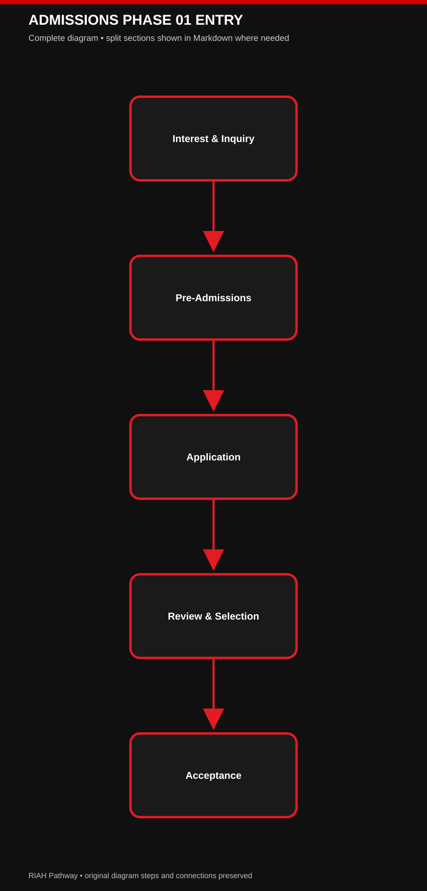

[View editable Mermaid diagram](./IMAGES/ADMISSIONS-PHASE-01-ENTRY.mmd)

### 🔄 ADMISSIONS PHASE 02 ENROLLMENT

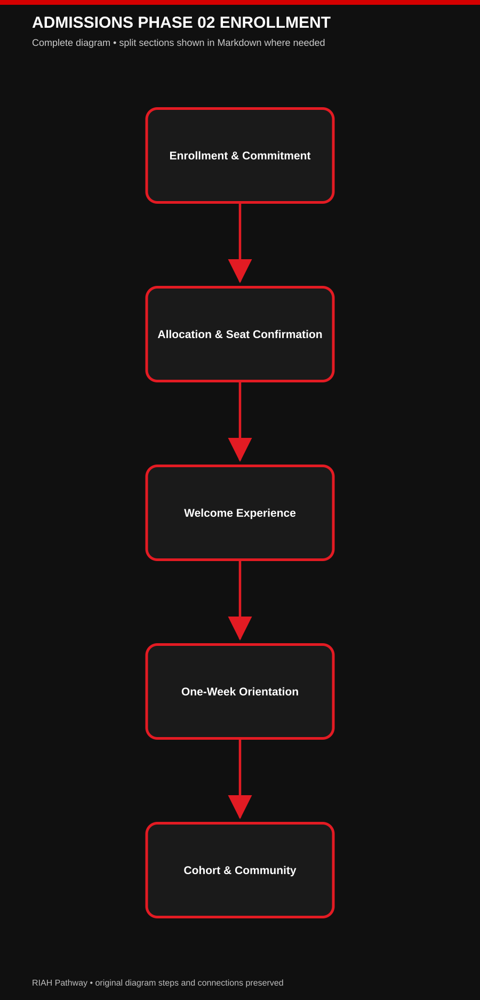

[View editable Mermaid diagram](./IMAGES/ADMISSIONS-PHASE-02-ENROLLMENT.mmd)

### 🔄 ADMISSIONS PHASE 03 COMPLETION

[View editable Mermaid diagram](./IMAGES/ADMISSIONS-PHASE-03-COMPLETION.mmd)

**Status:** Approved student-facing updates.  
This addendum preserves all preceding original draft content verbatim.  
Where an earlier draft describes a different platform, fee, deadline, or student-experience sequence, the explicitly labeled updates below supersede only that conflicting detail.  
This is a working website wireframe; unfinalized product mockups remain concepts.

**[IMAGE — RIAH PATHWAY COMPLETE 15-STAGE ADMISSIONS-TO-ALUMNI FLOW; RED, BLACK, WHITE, GOLD CROWN; DISTINCT DIGITAL, PHYSICAL AND COMMUNITY ICONS]**

**[ICON — MONTHLY ADMISSIONS CALENDAR]**

## 01 🔎 INTEREST & INQUIRY
**Delivery:** Digital.
**Experience:** Discover RIAH Pathway, its four schools, academic pathways, experiential programs and opportunities.
| Receive | Items Received |
| --- | --- |
| Materials received | Digital brochures, flyers, pamphlets, blogs, podcasts, social content, videos/vlogs, event and community-event information, school information, academic and experiential pathway guides, general information. |

**[BUTTON — EXPLORE PATHWAYS → 03]**

## 02 📋 PRE-ADMISSIONS & PREPARATION
**Delivery:** Digital.
**Academic applicants:** Review eligibility, prerequisites, transcripts, documentation, academic level, school, major and preparation requirements.
**Experiential applicants:** Review eligibility, program-specific prerequisites, required documents, level/duration, preparation, placement and supervision requirements across Business, Technology, Homeland Security and Law.
**JD / Non-JD:** Review applicable law-pathway eligibility, prerequisites, supervision and preparation requirements.
| Receive | Items Received |
| --- | --- |
| Materials received | Pre-admissions guides, eligibility checklists, transcript and documentation requirements, pathway/school/major information, program-specific preparation materials. |

**[BUTTON — PRE-ADMISSIONS → 12.2]**

## 03 📝 APPLICATION

### 🔄 APPLICATION REVIEW

[View editable Mermaid diagram](./IMAGES/APPLICATION-REVIEW.mmd)

**Delivery:** Digital. **Platform:** Classe365. **Frequency:** Monthly admission cohorts for academic and experiential programs.
**Fee:** $0 to apply — no application fee for academic or experiential programs.
**General testing:** No SAT, ACT or general writing assessment. Applicable pathway-specific requirements remain separate.
**Student actions:** Select school/pathway/major or experiential program, submit application and required documentation, apply at no cost, meet applicable monthly deadline.
| Receive | Items Received |
| --- | --- |
| Materials received | Application checklist, required-document information, payment confirmation, application updates, intended cohort and next steps. |

**[BUTTON — APPLY NOW → CLASSE365]**

## 04 ⚙️ ADMISSIONS REVIEW & EXPERIENTIAL SELECTION
**Delivery:** Digital.

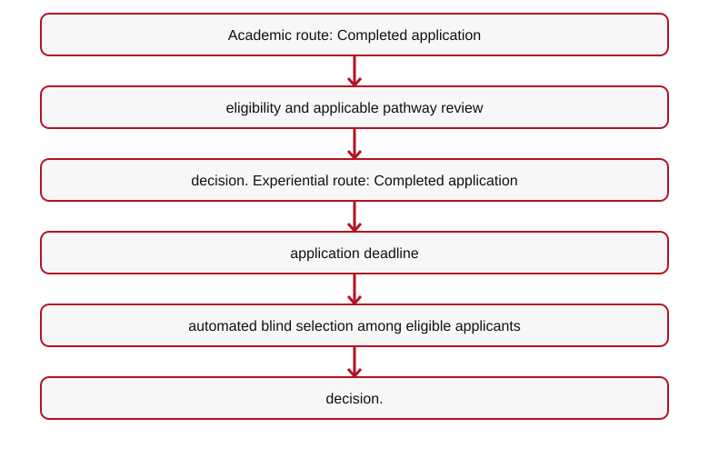
[Mermaid source](IMAGES/12-ADMISSIONS-WIREFRAMES-CTA-LINKS-ROUTING-FLOW-01.mmd)

**Schools:** School of Business; School of Technology; School of Homeland Security; School of Law.
**Experiential selection:** Do not describe a general selection interview. Selection is automated and blind under applicable eligibility and capacity rules.
| Receive | Items Received |
| --- | --- |
| Materials received | Decision updates, selection notices, applicable cohort and deadline information. |

**[ICON — AUTOMATED BLIND SELECTION]**

## 05 ✉️ ACCEPTANCE

### 🔄 ACCEPTANCE ENROLLMENT

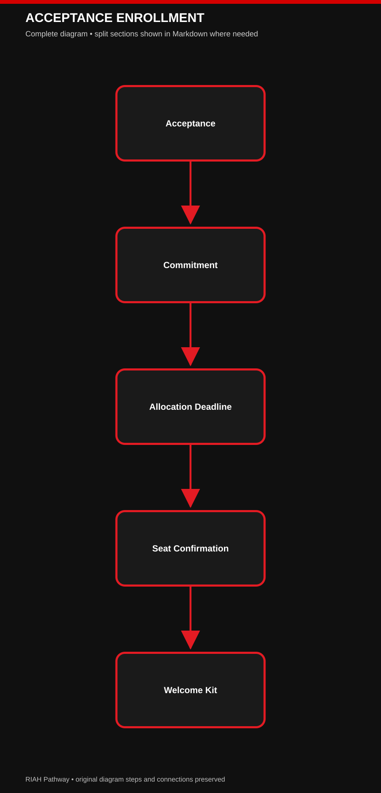

[View editable Mermaid diagram](./IMAGES/ACCEPTANCE-ENROLLMENT.mmd)

**Delivery:** Digital + Physical. **First mailed student touchpoint.**
| Receive | Items Received |
| --- | --- |
| Materials received | Digital acceptance, personalized mailed acceptance letter, branded envelope and seal, school-specific presentation, acceptance folder/package, congratulations materials, enrollment instructions, cohort/start information, resource allocation deadline. |
**Experiential:** Selected applicants also receive experiential acceptance and next-step information.

**[IMAGE — SCHOOL-SPECIFIC ACCEPTANCE LETTER AND SEALED ENVELOPE WITH UNIFIED CROWN]**

## 06 ✍️ ENROLLMENT & COMMITMENT
**Delivery:** Digital.
**Student actions:** Accept offer, commit to RIAH Pathway, complete enrollment requirements and confirm upcoming monthly cohort; accept experiential offer where applicable.
| Receive | Items Received |
| --- | --- |
| Materials received | Enrollment confirmation, checklist, tuition and fee information, required-material information, resource allocation payment instructions and deadline, cohort/start details and next steps. |

**[BUTTON — ENROLLMENT & COMMITMENT]**

## 07 💰 STUDENT RESOURCE ALLOCATION & SEAT CONFIRMATION
**Delivery:** Digital / Financial.
**Application fee:** $0 — free to apply for all education and Experiential pathways.
**Student Resource Allocation Fee:** The resource allocation payment/deposit covers student resources from enrollment through graduation. There is no separate $500 RIAH Education Deposit Fee; allocations depend on the selected program.

| Selected Pathway | Student Resource Allocation Fee |
| --- | ---: |
| GED / HSE | $500 |
| High School Diploma | $500 |
| Minor | $500 |
| Associate's | $500 |
| Bachelor's | $1,000 |
| Master's | $1,000 |
| MBA | $1,000 |
| J.D. (JD) | $1,000 |
| Non-J.D. (Non-JD) | $1,000 |
| Experiential | $500–$1,500, estimated; varies by level and approved resources |

**Student resource allocation covers applicable items from enrollment through graduation**, including personalized textbooks/workbooks and educational collections, laptop/technology, software/subscriptions, applicable assessments and certification resources, Welcome/Transfer Kit items, standard transcripts, and graduation cap, tassel, gown, applicable cords, diploma and completion materials. Exact items vary by pathway, and every student does not necessarily receive all listed resources. Additional resources or services outside the allocation are charged separately at their disclosed price; items included in the allocation are not double-billed.

**Optional transcript/transfer credit services:** $50 evaluation plus $50 processing ($100 combined when both apply), only where needed and not already included in the student's published allocation. **Experiential allocations:** Estimated $500–$1,500 by applicable program, without any separate education-deposit or application fee. Existing seat-confirmation and welcome-kit timelines apply.

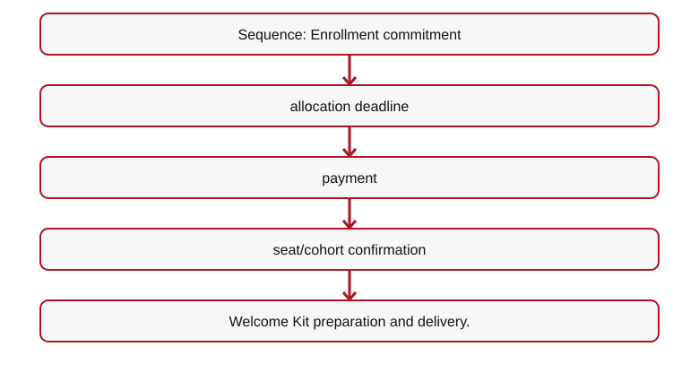
[Mermaid source](IMAGES/12-ADMISSIONS-WIREFRAMES-CTA-LINKS-ROUTING-FLOW-02.mmd)

**Welcome Kit restriction:** The full Welcome Kit is not shipped until the applicable Student Resource Allocation Fee has been paid.
**Experiential capacity/deadline rule:** Accepted experiential applicants must pay by the first resource allocation deadline or forfeit their reserved seat.  
Vacancies are offered to other eligible/selected applicants with a second deadline; continue until capacity is reached.
**Academic cohort timing:** A student missing the applicable academic cohort deadline may enter a subsequent monthly cohort after satisfying requirements.
| Receive | Items Received |
| --- | --- |
| Materials received | Payment confirmation, seat/cohort confirmation, Welcome Kit preparation notice. |

**[ICON — STUDENT RESOURCE ALLOCATION: PROGRAM-SPECIFIC; NO SEPARATE DEPOSIT FEE]**
**[BUTTON — STUDENT ALLOCATION INFORMATION → 13]**

## 08 🎁 WELCOME EXPERIENCE
**Delivery:** Digital + Physical + Community. **Trigger:** Student Resource Allocation Fee paid.
**Personalization layers:** RIAH Pathway core + entry status (new/transfer) + pathway/level + school + major/program + monthly cohort + orientation/community.
**Schools:** Business; Technology; Law; Homeland Security. School robes, scarves, bags and other items may have distinct school colors; visual designs remain concept-stage.
**Pathways/levels:** High School, GED, Associate's, Bachelor's, JD, Non-JD and applicable programs.
| Receive | Items Received |
| --- | --- |
| Concept materials received | Branded Welcome Box and letter; school robe, scarf, backpack/bag and gear; applicable books, workbooks, journals, planners, pathway/major materials, orientation workbook, cohort and student-success materials, ID/badge concepts, applicable software/materials. |
**Transfer branch:** High School, GED, Associate's, Bachelor's, JD and Non-JD transfer entrants receive a transfer-specific welcome letter, transfer materials, orientation/credit-pathway information and resources, plus the standard personalized Welcome Experience.  
Transfer students then follow the same orientation, cohort, active student, graduation and alumni flow.

**[IMAGE — WELCOME BOX, ROBE, SCARF, BAG, BOOKS AND ORIENTATION MATERIALS]**
**[IMAGE — TRANSFER STUDENT BRANCH REJOINS STANDARD STUDENT JOURNEY]**

## 09 🧭 ONE-WEEK VIRTUAL ORIENTATION, ONBOARDING & TRAINING

### 🔄 ONBOARDING STUDENT EXPERIENCE

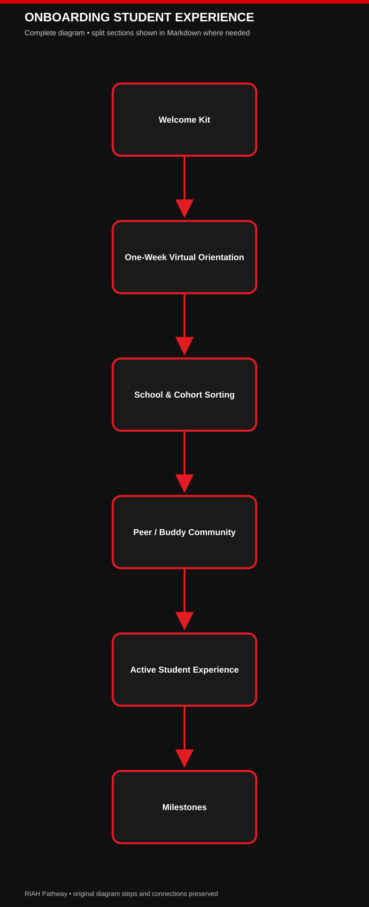

[View editable Mermaid diagram](./IMAGES/ONBOARDING-STUDENT-EXPERIENCE.mmd)

**Delivery:** Digital + Physical + Community. **Duration:** One full week, virtually.
**Training Pillar:** Supports academic ecosystem orientation, experiential preparation, and applicable JD/Non-JD supervision training.  
Students already have physical orientation materials in their Welcome Kits and also receive digital training materials.
**Academic training (all applicable academic pathways):** Institutional identity/dynasty, school and program expectations, navigating student resources and systems, academic policies, where to find support, opportunities, student organizations, honor societies, ambassadors, leadership, milestones, cohort communities and peer/buddy connections.
**Experiential training (all four schools and all experiential durations):** Shared cohort orientation plus school/program/assignment-specific breakout sessions.  
Examples: Business/Finance and Law/Criminal Justice.  
Training includes expectations, materials, placements and introductions to assigned supervisor, manager and reviewer.
**JD / Non-JD:** Applicable law-pathway supervision training, assigned law supervisor, placement/assignment details, expectations and resources.
**Assignments communicated during onboarding:** Experiential placement, supervisor, manager, reviewer and start details; JD/Non-JD supervisor and applicable assignment information.
| Receive | Items Received |
| --- | --- |
| Materials received | Orientation workbook, handbook, guide, digital training resources, planners/checklists, policies, student-success and school/program materials, cohort information and buddy details. |
**LMS sequence:** LearnWorlds account is provisioned during onboarding, but actual course/program content remains gated until the Active Student Experience starts.
**Relevant finalized platforms:** SuiteDash for onboarding; Microsoft Teams for virtual orientation, training and breakout sessions; LearnWorlds for LMS.

**[IMAGE — ONE-WEEK TRAINING TIMELINE WITH COLLECTIVE SESSIONS AND SCHOOL-SPECIFIC BREAKOUTS]**
**[ICON — LMS PROVISIONED → CONTENT GATED → ACTIVE START UNLOCKS]**

## 10 👥 COHORT, SCHOOL & COMMUNITY
**Delivery:** Digital + Physical + Community.

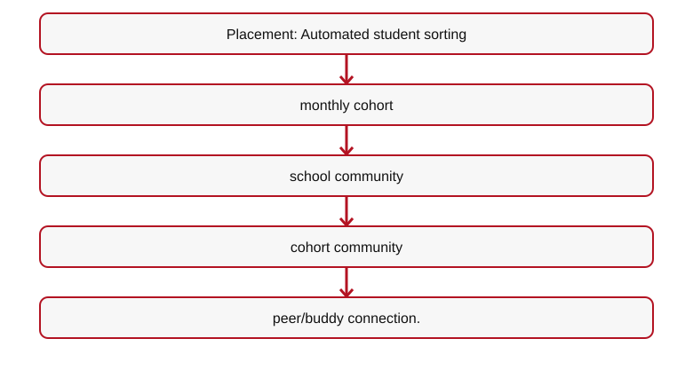
[Mermaid source](IMAGES/12-ADMISSIONS-WIREFRAMES-CTA-LINKS-ROUTING-FLOW-03.mmd)

**Experience:** Human camaraderie, student-to-student engagement, school identity, group activities, shared cohort progress, student support.
| Receive | Items Received |
| --- | --- |
| Materials/access received | School and cohort community access, schedules, event details, community resources, student organization information, peer/buddy connection; applicable physical cohort items are already included in Welcome Kits. |
**Relevant finalized platform:** SuiteDash student communities and communications. Prior Slack/Geneva references are superseded for this student-community function.

**[IMAGE — AUTOMATED COHORT AND SCHOOL COMMUNITY SORTING FLOW]**

## 11 🚀 ACTIVE STUDENT EXPERIENCE
**Delivery:** Digital + Physical + Community.
**Start:** LearnWorlds course/program content opens when the active program begins, following onboarding and the one-week training.
**Academic:** Coursework, school and major/program materials, student resources, school and cohort engagement, peer/buddy network.
**Experiential:** Assigned placements and experiential participation begin when applicable; supervisors, managers and reviewers remain involved.
**Law:** Applicable JD/Non-JD supervision and program participation.
**Student opportunities:** Ambassador Program, student organizations, professional and academic organizations, honor societies, leadership positions, community activities.
| Receive | Items Received |
| --- | --- |
| Materials/access received | Active LMS/course access, applicable academic/experiential materials, community and organization access, student support resources. |

**[BUTTON — STUDENT PORTAL → SUITEDASH]**
**[ICON — LEARNWORLDS COURSE ACCESS OPEN]**

## 12 📣 STUDENT ORGANIZATIONS & LEADERSHIP
**Delivery:** Digital + Community; applicable physical recognition.
**Participation:** Ambassador Program (participation opportunities may also exist before enrollment); student leadership roles during active enrollment; discipline-specific professional and academic organizations; honor societies; school and cohort leadership.
**Benefits:** Eligible participation may contribute to planned milestone points, leadership recognition and qualifying tuition-reimbursement opportunities.
**Materials/opportunities:** Organization information, leadership opportunities, ambassador resources, recognition and student engagement.
**Wireframe treatment:** May appear as a subsection of Active Student Experience rather than an additional navigation page.

**[ICON — AMBASSADOR, HONOR SOCIETY AND STUDENT LEADERSHIP]**

## 13 🏆 ACHIEVEMENTS & MILESTONES
**Delivery:** Digital + Physical + Community. **Timing:** Throughout active enrollment, not only at graduation.
**Eligible areas:** Academics, experiential achievement, ambassadors, leadership, student organizations, honor societies, cohort and community participation.
**Recognition concepts:** Honor cords, certificates, medals, awards, plaques, trophies, class rings, technology/gadget rewards, academic honors, leadership and experiential recognition.
**Applicable opportunities:** Scholarships, grants, stipends, tuition-reimbursement eligibility and milestone/point recognition, subject to qualifying rules.
**Relevant finalized platform:** Merit Pages only if a student-recognition platform is identified in existing wireframe sections; do not add unrelated system descriptions.

**[IMAGE — MILESTONE AWARDS, HONOR CORDS, CLASS RINGS, TROPHIES]**

## 14 🎓 GRADUATION EXPERIENCE

### 🔄 GRADUATION ALUMNI

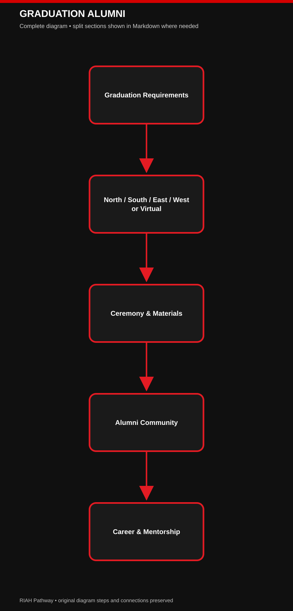

[View editable Mermaid diagram](./IMAGES/GRADUATION-ALUMNI.mmd)

**Delivery:** Digital + Physical + Ceremonial / Community.
**U.S. regions:** North, South, East, West. Graduates may choose regional in-person graduation or virtual participation; venue size depends on attendance.
**International:** Virtual graduation option.
**Concept materials:** Graduation robe/regalia, cap, tassel, earned honor cords, diploma, diploma case/cover, diploma/picture frame, graduation package, class ring, yearbook/keepsakes, program and recognition items.
**Fee treatment:** Applicable standard graduation materials are planned into overall tuition/student fees, subject to finalized fee schedule; not an automatic new graduation purchase.
**Virtual ceremony technology:** Microsoft Teams is the finalized virtual meeting reference, superseding earlier Zoom mentions in this function.

**[IMAGE — NORTH / SOUTH / EAST / WEST REGIONAL GRADUATION AND VIRTUAL OPTION]**

## 15 👑 ALUMNI & LEGACY
**Delivery:** Digital + Physical + Community.
**Experience:** Transition into alumni community, continued professional connections, networking, career resources, mentorship, alumni events and institutional legacy.
| Receive | Items Received |
| --- | --- |
| Materials/access received | Mailed Alumni/Legacy Kit, alumni welcome and keepsake materials, alumni community access, networking, career and mentorship resources, event information. |

**[IMAGE — ALUMNI LEGACY KIT AND COMMUNITY]**

## 📅 MONTHLY ADMISSIONS & COHORT CYCLE

**[ICON — MONTHLY CALENDAR]**
**All academic and experiential programs use monthly admissions cohorts**, rather than unrestricted daily entry.  
This allows time for application processing, decisions, applicable aid and accreditation-related preparation, resource allocation deadlines, seat/capacity confirmation, Welcome Kit fulfillment, one-week orientation/training, student-community placement and program activation.  
Accreditation or Title IV participation must not be represented as already approved unless separately verified.

**Application — $0 (free to apply)**  

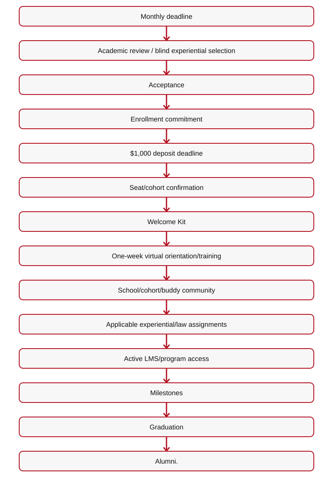
[Mermaid source](IMAGES/12-ADMISSIONS-WIREFRAMES-CTA-LINKS-ROUTING-FLOW-04.mmd)

## 🌐 PUBLIC WEBSITE FLOW — ADMISSIONS

### 🔄 TRANSFER STUDENT JOURNEY

#### Mermaid Flow 01 — 🔄 TRANSFER STUDENT JOURNEY (Part 1 of 2)

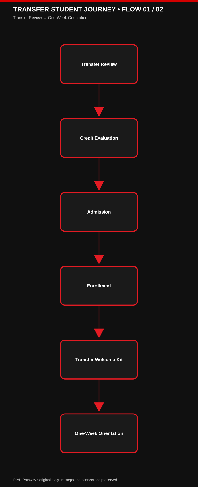

[View editable Mermaid Flow 01](./IMAGES/TRANSFER-STUDENT-JOURNEY-PART-01.mmd)

#### Mermaid Flow 02 — 🔄 TRANSFER STUDENT JOURNEY (Part 2 of 2)

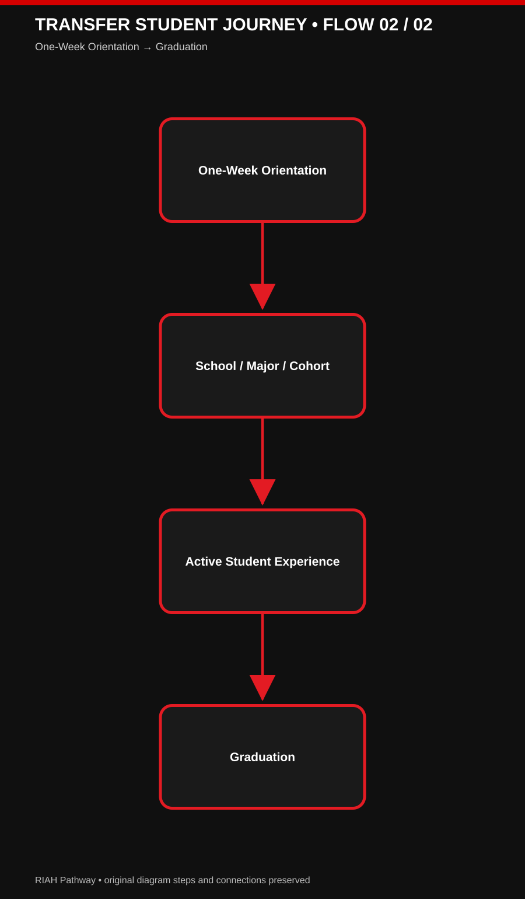

[View editable Mermaid Flow 02](./IMAGES/TRANSFER-STUDENT-JOURNEY-PART-02.mmd)

[View editable Mermaid diagram](./IMAGES/TRANSFER-STUDENT-JOURNEY.mmd)

**[IMAGE — NUMBERED 15-STEP STUDENT JOURNEY WITH EMOJI-STYLE ICONS AND DELIVERY LEGEND]**
| # | Stage | Student-Facing Summary | Delivery |
| --- | --- | --- | --- |
| 01 🔎 | Interest & Inquiry | Discover RIAH Pathway and its schools/programs | Digital |
| 02 📋 | Pre-Admissions & Preparation | Review academic/experiential requirements | Digital |
| 03 📝 | Application | Apply for monthly cohort; $0 application fee | Digital |
| 04 ⚙️ | Review & Selection | Academic review; automated blind experiential selection | Digital |
| 05 ✉️ | Acceptance | Receive digital and mailed acceptance | Digital + Physical |
| 06 ✍️ | Enrollment & Commitment | Accept offer and confirm cohort intentions | Digital |
| 07 💰 | Student Allocation & Seat Confirmation | Pay only the selected Student Resource Allocation Fee (no separate education-deposit fee); Experiential allocation varies by program; confirm seat | Digital |
| Row | # | Stage | Student-Facing Summary | Delivery |
| --- | --- | --- | --- | --- |
| 8 | 08 🎁   | Welcome Experience   | Receive personalized kit and community information   | Digital + Physical + Community |
| 9 | 09 🧭   | One-Week Orientation & Training   | Academic, experiential and applicable law supervision training; LMS provisioned   | Digital + Physical + Community |
| 10 | 10 👥   | Cohort, School & Community   | School group, cohort group and peer/buddy connection   | Digital + Physical + Community |
| 11 | 11 🚀   | Active Student Experience   | LearnWorlds opens; academics/experiential begin   | Digital + Physical + Community |
| 12 | 12 📣   | Organizations & Leadership   | Ambassadors, honor societies, organizations and leadership   | Digital + Community |
| 13 | 13 🏆   | Achievements & Milestones   | Recognition and qualifying opportunities throughout enrollment   | Digital + Physical + Community |
| 14 | 14 🎓   | Graduation   | Regional in-person or virtual ceremony and materials   | Digital + Physical + Community |
| 15 | 15 👑   | Alumni & Legacy   | Alumni Kit, community, networking and mentorship   | Digital + Physical + Community |

## 🔄 LIMITED SUPERSEDED TECH STACK REFERENCES — ADMISSIONS ONLY

### 🔄 TECHNOLOGY STUDENT FLOW

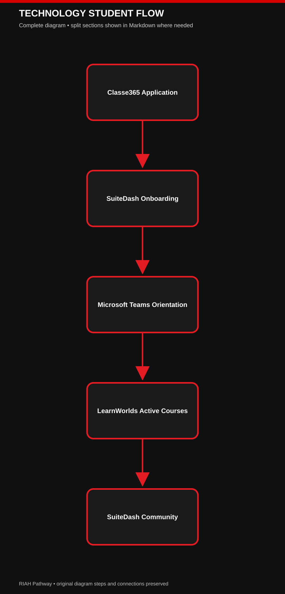

[View editable Mermaid diagram](./IMAGES/TECHNOLOGY-STUDENT-FLOW.mmd)

| Row | Student-facing function | Superseded reference | Current reference | Scope |
| --- | --- | --- | --- | --- |
| 1 | Applications / admissions   | No change   | Classe365   | Retain existing application references |
| 2 | Onboarding / student portal   | No change   | SuiteDash   | Retain existing onboarding references |
| 3 | Virtual orientation / training / cohort sessions   | Zoom   | Microsoft Teams   | Use Teams for student-facing virtual sessions |
| 4 | Student school/cohort communities   | Slack; Geneva   | SuiteDash   | Use SuiteDash for student community |
| 5 | LMS / active course access   | No change   | LearnWorlds   | Provision during onboarding; open course access at active start |
| 7 | Experiential placement functions   | Earlier references if any   | PeopleGrove CORE + Experience Hub + CompMS   | Update only existing relevant placement-system mentions |
| 7 | Career services   | Earlier references if any   | Symplicity CSM   | Update only existing relevant career-service mentions |
| 8 | Student recognition   | Earlier references if any   | Merit Pages   | Update only existing relevant recognition-system mentions |

**Technology limitation:** Do not copy the finalized tech-stack document into this wireframe.  
Do not add internal infrastructure, cybersecurity architecture, private databases, proprietary curriculum systems, or unrelated software.  
Existing original wireframe source text remains preserved above; this addendum governs only the specifically superseded Admissions student-experience references.

**[BUTTON — APPLY NOW → CLASSE365]**

**[BUTTON — PRE-ADMISSIONS → 12.2]**
**[BUTTON — ACCEPTANCE & ENROLLMENT → 12.4]**

**[BUTTON — STUDENT EXPERIENCE → 12.5]**
**[BUTTON — GRADUATION & ALUMNI → 12.6]**

**[BUTTON — TRANSFER STUDENTS → 12.8]**

---

## ADMISSIONS FLOW DIAGRAMS — MERMAID

**[IMAGE — BLACK AND RED ADMISSIONS FLOW DIAGRAMS]**

### FLOW 01 ADMISSIONS TO ALUMNI

#### Mermaid Flow 01 — FLOW 01 ADMISSIONS TO ALUMNI (Part 1 of 3)

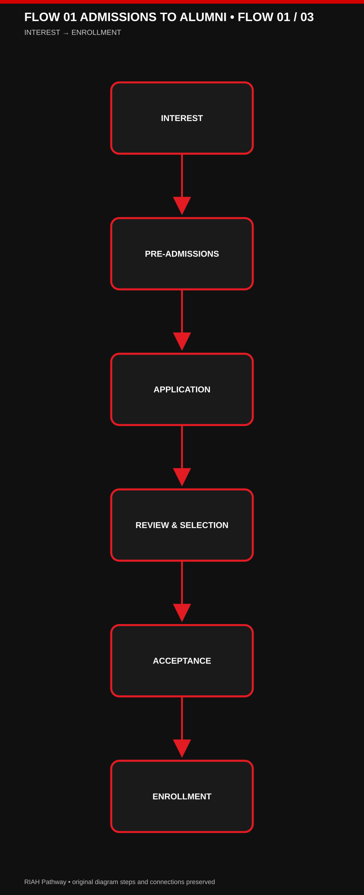

[View editable Mermaid Flow 01](./IMAGES/FLOW-01-ADMISSIONS-TO-ALUMNI-PART-01.mmd)

#### Mermaid Flow 02 — FLOW 01 ADMISSIONS TO ALUMNI (Part 2 of 3)

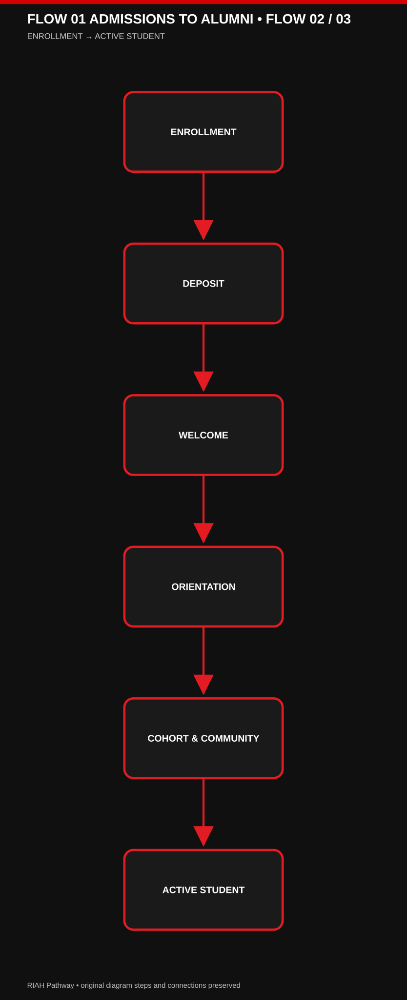

[View editable Mermaid Flow 02](./IMAGES/FLOW-01-ADMISSIONS-TO-ALUMNI-PART-02.mmd)

#### Mermaid Flow 03 — FLOW 01 ADMISSIONS TO ALUMNI (Part 3 of 3)

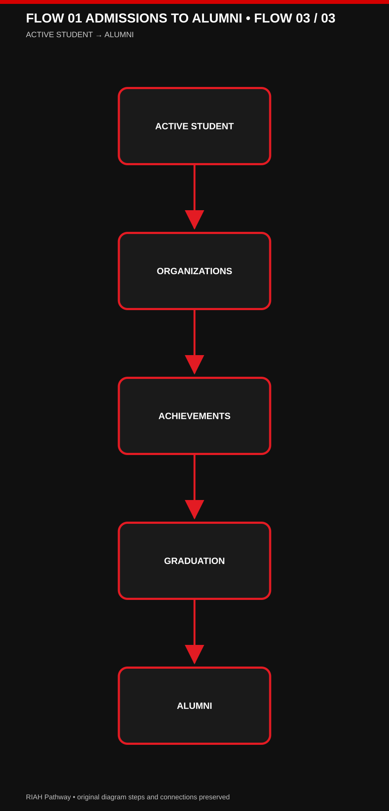

[View editable Mermaid Flow 03](./IMAGES/FLOW-01-ADMISSIONS-TO-ALUMNI-PART-03.mmd)

[VIEW EDITABLE MERMAID DIAGRAM](./IMAGES/FLOW-01-ADMISSIONS-TO-ALUMNI.mmd)

### FLOW 02 EXPERIENTIAL SELECTION AND SEAT

#### Mermaid Flow 01 — FLOW 02 EXPERIENTIAL SELECTION AND SEAT (Part 1 of 2)

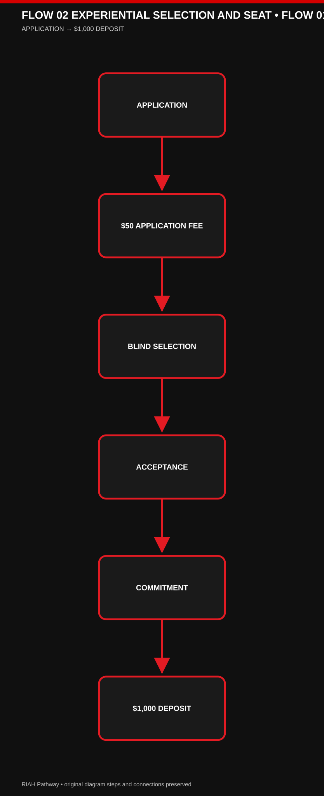

[View editable Mermaid Flow 01](./IMAGES/FLOW-02-EXPERIENTIAL-SELECTION-AND-SEAT-PART-01.mmd)

#### Mermaid Flow 02 — FLOW 02 EXPERIENTIAL SELECTION AND SEAT (Part 2 of 2)

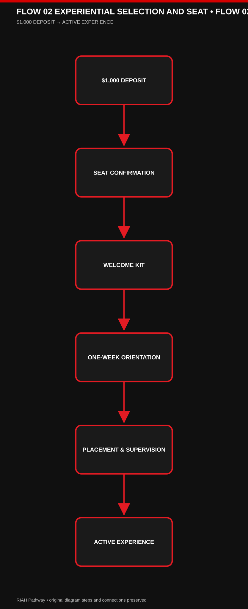

[View editable Mermaid Flow 02](./IMAGES/FLOW-02-EXPERIENTIAL-SELECTION-AND-SEAT-PART-02.mmd)

[VIEW EDITABLE MERMAID DIAGRAM](./IMAGES/FLOW-02-EXPERIENTIAL-SELECTION-AND-SEAT.mmd)

### FLOW 03 TRANSFER STUDENT JOURNEY

#### Mermaid Flow 01 — FLOW 03 TRANSFER STUDENT JOURNEY (Part 1 of 2)

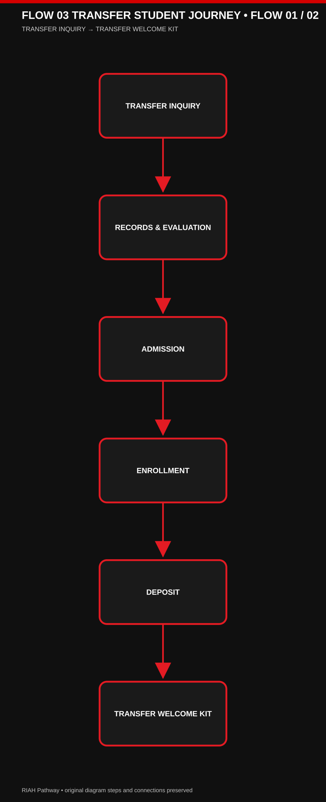

[View editable Mermaid Flow 01](./IMAGES/FLOW-03-TRANSFER-STUDENT-JOURNEY-PART-01.mmd)

#### Mermaid Flow 02 — FLOW 03 TRANSFER STUDENT JOURNEY (Part 2 of 2)

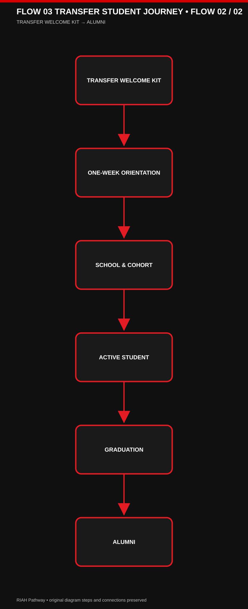

[View editable Mermaid Flow 02](./IMAGES/FLOW-03-TRANSFER-STUDENT-JOURNEY-PART-02.mmd)

[VIEW EDITABLE MERMAID DIAGRAM](./IMAGES/FLOW-03-TRANSFER-STUDENT-JOURNEY.mmd)

### FLOW 04 ORIENTATION AND LMS ACCESS

#### Mermaid Flow 01 — FLOW 04 ORIENTATION AND LMS ACCESS (Part 1 of 2)

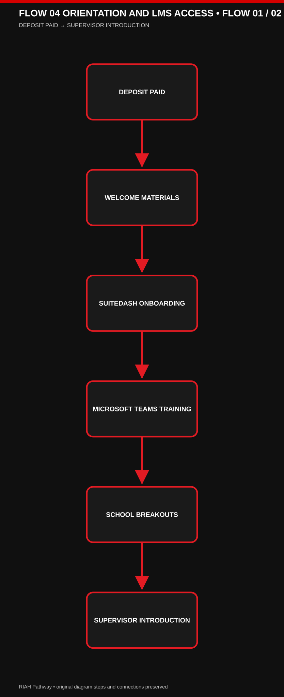

[View editable Mermaid Flow 01](./IMAGES/FLOW-04-ORIENTATION-AND-LMS-ACCESS-PART-01.mmd)

#### Mermaid Flow 02 — FLOW 04 ORIENTATION AND LMS ACCESS (Part 2 of 2)

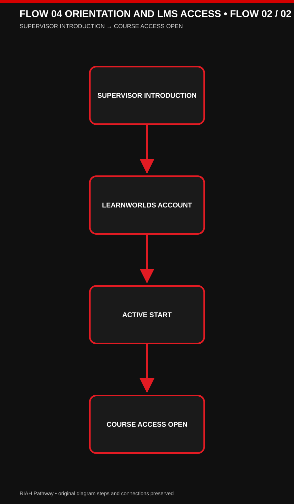

[View editable Mermaid Flow 02](./IMAGES/FLOW-04-ORIENTATION-AND-LMS-ACCESS-PART-02.mmd)

[VIEW EDITABLE MERMAID DIAGRAM](./IMAGES/FLOW-04-ORIENTATION-AND-LMS-ACCESS.mmd)

---

## Transfer Credit Evaluation — One-Time Optional Service

| Component | Fee | Timing |
| --- | ---: | --- |
| Transfer credit evaluation (including alternative credit, prior learning, and applicable previous coursework) | $50 | After prerequisite/transcript eligibility review and before determining which credits apply |
| Processing and administration | $50 | Once the student is admitted to the applicable program/year and the transfer credit determination is processed |
| **Total when both services apply** | **$100** | **One-time; not charged twice for the same evaluation** |

The $100 is **not charged to every applicant**. It applies only to students requesting transfer credit evaluation and subsequent processing. Transcripts are submitted during pre-admissions and reviewed for prerequisite eligibility and outstanding requirements. Students meeting the applicable education admission requirements are admitted; the transfer credit evaluation determines which previous credits apply and which courses remain, rather than determining whether the student is admitted. Students with missing prerequisites are informed of the deficiencies and may return after completing them for a follow-up review without a second evaluation charge. For a Year 3 placement, the transfer evaluation and required prerequisites must be completed before Year 3 admission/placement. The $50 processing and administration portion is assessed only once the student is admitted to the applicable year or master's/MBA program. J.D. transfers are limited to up to 27 Year 1 (1L) credits and entry after Year 1; no transfers into J.D. Years 2–4. Master's and MBA transfer limits are 9 credits each.

**Admissions positioning:** Accessible education for applicants who meet program prerequisites; affordable program pricing; rigorous proctored assessments, performance assessments, and capstones. Educational admission is based on meeting published prerequisites and transcript requirements, not on purchasing the optional transfer credit evaluation service.

**Final transfer-credit restrictions (education pathways):** Associate's — up to 30 credits from general education, school core, or a combination of both. Bachelor's — up to 60 credits applicable only to general education and school core. Bachelor's Years 3 and 4 consist of RIAH Pathway coursework and do not accept transfer credits; no additional transfer credits may be added after the initial transfer evaluation and placement. Master's — up to 9 credits. MBA — up to 9 credits. J.D. — up to 27 approved first-year (1L) credits for entry after Year 1 only; no J.D. transfer into Years 2, 3, or 4. Transfer credit is determined once as part of the initial transfer evaluation; later additional transfer-credit submissions are not accepted. High School and GED/HSE admission and transfer parameters remain subject to separate review and are not changed by this clarification.

### Personalized Student Collections After Transfer Credit Evaluation

**Course-by-course determination:** After the one-time transfer credit evaluation, RIAH Pathway identifies the student's accepted credits, outstanding general education courses, outstanding school core courses, and any remaining major, capstone, or program requirements. The student's academic course plan determines the contents of their internal student collection package.

**Not one-size-fits-all:** Each student receives a personalized collection of applicable textbooks, workbooks, study guides, review guides, journals, planners, flashcards, and other course resources based on the courses they actually need to complete. Students do not automatically receive the entire general education or school core collection when approved transfer credits have already satisfied some or all of those courses.

**Example:** A bachelor's transfer student whose approved credits satisfy all general education requirements but not the school core receives the outstanding school core course collections, plus the applicable subsequent major and capstone materials; the student does **not** need a complete general education collection. If only some general education or core courses remain, include the collections for those outstanding courses only.

**Fulfillment and student experience:** Finalize the personalized course and collection list after transfer evaluation and placement, before assembling or assigning the student's applicable learning materials and Welcome/Transfer Kit resources. Continue to apply the established deposit, onboarding, and kit-delivery requirements. The internal student collection is determined by actual outstanding coursework, not a uniform full-program bundle.

## ADDENDUM — EDUCATION / EXPERIENTIAL PRICING, CONTRIBUTORS, TUITION REIMBURSEMENT & FOUNDER ROUTING

| Admissions Source Markdown | Added CTA / Link / Download | Route / Destination |
|---|---|---|
| ADMISSIONS-WIREFRAME-MAIN.md | Tuition, pricing stages and Experiential / academic costs | 13 |
| ADMISSIONS-WIREFRAME-MAIN.md | Verified tuition reimbursement and contributor milestones | 13.6; 17.2.15 |
| ADMISSIONS-WIREFRAME-MAIN.md | Founder contributions and financial transparency | 17.6 |
| 12.1-PRE-ADMISSIONS-WIREFRAME.md | Tuition before applying / contributor benefits / Founder | 12; 13.6; 17.6 |
| 12.2-APPLICATION-WIREFRAME.md | Program prices / reimbursement / Founder | 12; 13.6; 17.6 |
| 12.3-ACCEPTANCE-AND-ENROLLMENT-WIREFRAME.md | Enrollment pricing / contribution milestones / Founder | 12; 13.6; 17.6 |
| 12.4-ONBOARDING-AND-STUDENT-EXPERIENCE-WIREFRAME.md | Verified milestones / reimbursement / Founder | 17.2.15; 13.6; 17.6 |
| 12.5-GRADUATION-AND-ALUMNI-WIREFRAME.md | Guaranteed qualifying 10% completion / up to 50% approved milestones | 13.6; 17.2.15 |
| 12.6-HOW-RIAH-PATHWAY-WORKS-WIREFRAME.md | Student financial reimbursements / Founder equity pool | 13.6; 17.6 |
| 12.7-TRANSFER-STUDENTS-WIREFRAME.md | Published tuition / milestone reimbursement / Founder | 12; 13.6; 17.6 |

[DOWNLOAD: Current Academic and Experiential Tuition Prices and Pricing Stages → ../../RIAH-PATHWAY-TUITION-PRICING-FEES-STRUCTURE/RIAH-PATHWAY-TUITION-PRICING-FEES.md]

[DOWNLOAD: Contributor Benefits and Non-Stacking Milestone Rules → ../../RIAH-PATHWAY-CONTRIBUTOR-BENEFITS-STRUCTURE/README.md]

[DOWNLOAD: Student and Experiential Qualifying Completion Benefits → ../../RIAH-PATHWAY-CONTRIBUTOR-BENEFITS-STRUCTURE/STUDENTS.md]

[INTERNAL LINK: Founder Equity Contributions & Allocations → ../17-JOIN-US/17.6-FOUNDER-EQUITY-CONTRIBUTIONS-ALLOCATIONS.md]

[INTERNAL ROUTE: Tuition → 13; Tuition Reimbursement → 13.6; Student Milestones → 17.2.15; Founder Contributions → 17.6]

## Entrepreneurship Admissions — Page 6

| Pool | Level | Duration | Stage |
| --- | --- | --- | --- |
| Startup | 6.2.1 Apprentice Startup | 1 Month | Pre-launch / just starting |
| Startup | 6.2.2 New Startup | 12 Weeks | Under 1 year |
| Startup | 6.2.3 One-Year Startup | 12 Weeks | At least 1 year |
| Startup | 6.2.4 Growth Startup | 16 Weeks | Over 1 year |
| Small Business | 6.3.1 Apprentice Small Business | 1 Month | Forming / restarting |
| Small Business | 6.3.2 New Small Business | 12 Weeks | Under 1 year |
| Small Business | 6.3.3 Established Small Business | 12 Weeks | At least 1 year |
| Small Business | 6.3.4 Recovery & Growth | 16 Weeks | Over 1 year |

Spring/Fall entrepreneurship admission and verification are distinct from monthly Professional Experiential intake.

[BUTTON — ENTREPRENEURSHIP → 6]
[BUTTON — ENTREPRENEURSHIP TUITION → 13]
