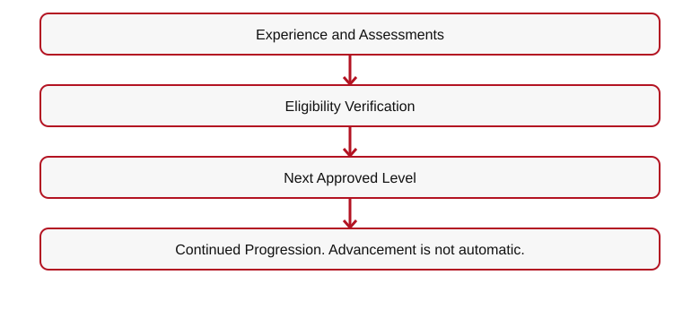
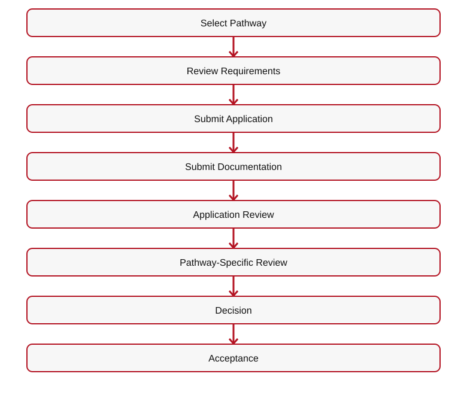

# 👑 RIAH PATHWAY — 12.3 APPLICATION WIREFRAME
## I. APPLICATION HERO

**[IMAGE — STUDENT COMPLETING DIGITAL APPLICATION]**
# YOUR FORMAL ENTRY INTO THE ADMISSIONS PROCESS.
**Application Platform: Classe365.**
**Application Fee: $0 — FREE TO APPLY.**
**Student Information**  
• Selected Pathway  
• Prior Education  
• Academic History  
• Required Documentation  
• Applicable Pathway Questions  
• Student Communications**

**[BUTTON 11-A01 — APPLY NOW → CLASSE365]**
## II. 12.3.1 — ADMISSIONS PROCESS
**01 Select Your Pathway**  

[Mermaid source](IMAGES/11.2-APPLICATION-FLOW-01.mmd)

**[IMAGE — ADMISSIONS PROCESS FLOW]**
## III. 12.3.2 — APPLICATION FLOW

[Mermaid source](IMAGES/11.2-APPLICATION-FLOW-02.mmd)

**[BUTTON 11-A02 — APPLY NOW → CLASSE365]**
## IV. 12.3.3 — ADMISSIONS BY PATHWAY
| Pathway | Review | Main Page |
| --- | --- | --- |
| Associate's | Academic eligibility and records | 04 |
| Bachelor's | Academic eligibility, transfers, prerequisites | 04 |
| Year 3 | General education and school core completed | 04 |
**Highly recommended — bachelor's Year 3 preparation:** Complete the applicable **General Education and School Core** requirements before seeking admission into Year 3, with a target of **up to 60 approved foundational transfer credits** where applicable. Sources for individualized evaluation include **Sophia.org, StraighterLine, accredited colleges/universities, AP, IB, SAT, ACT, CLEP, or approved RIAH placement/test-out**. Alternative coursework, examination results, and placement scores require RIAH course-level equivalency review; **SAT/ACT scores do not automatically confer college credit**. Each school's actual core still controls (the School of Technology core, for example, is 39 credits). Applicants without all approved foundational coursework complete the missing General Education and School Core courses through RIAH before Year 3. Submit external credits in the initial transfer evaluation window; **bachelor's Years 3–4 use RIAH-controlled coursework and do not accept outside transfer credit**.

**Accelerated Years 3–4:** Required proctored objective and performance assessments must each be passed at **80%+**, alongside other required tests, course and capstone requirements. The one-month earliest benchmark applies only where all relevant requirements permit.
**Tuition is the same with or without approved transfer or alternative credits.** Transfer credits can reduce the number of RIAH courses remaining and **change the student's pacing and entry point, not the published program tuition**; the established Transfer Tuition Reduction remains **$0**. Any applicable application, resource-allocation, or optional transfer-evaluation fees remain governed by their separate schedules.

**Acceleration example (not a guarantee):** A student might finish the eligible outside General Education/School Core courses in **one month**, complete the initial transfer-credit review, and—if the school-specific prerequisites are satisfied—complete the remaining approved RIAH curriculum in **another month**. The actual outside-learning period may instead take two years or longer, and the RIAH portion may take longer. A one-month RIAH coursework benchmark applies **only where academic, accreditation, supervision, minimum-duration, payment, and other credentialing requirements permit**; it does not promise a one-month bachelor's, master's, MBA, or J.D. award.

**RIAH's post-transfer academic rigor is unchanged:** Bachelor's **Years 3 and 4** remain RIAH-controlled, and **master's, MBA, and J.D.** coursework remains subject to each program's established admissions, progression, and degree requirements. Required courses use **proctored objective assessments, performance assessments, or both**, with **ProctorU** as RIAH's assessment-proctoring platform; the required assessment passing threshold is **80% or higher**, along with any other course tests, projects, professional oversight, and **supervised capstones where applicable**. A transfer or accelerated pace waives none of these requirements.
| Minor | First required minor course and prerequisites completed; Computer Science: College Algebra and Principles of Computer Science | 04 |
| Master's | Bachelor's or equivalent and prerequisites | 04 |
| MBA | Bachelor's or equivalent and prerequisites | 04 |
| J.D. | Academic and law requirements | 4.4 |
| Non-J.D. | Jurisdictional eligibility and supervision | 4.4 |
| Experiential | Major-specific coursework AND verified experience at requested level; supervision/capacity and under-18 clearance if applicable | 05 |
| High School | Eighth-grade or grades 9–12 transcript evaluation | 07 |
| GED/HSE | Prior high school record, noncompletion, college coursework | 08 |
**Minors:** Applicants under 18 may apply to eligible Experiential and education pathways. Parent/legal-guardian sign-off and required forms are mandatory **before Experiential work**. High school dual enrollment requires **both** parent/legal-guardian and school guidance counselor approval before college-course enrollment. Previously completed college courses may support a minor's application to an eligible degree program.

**Certification Review and Bar Review are standalone products, with no RIAH Pathway admissions requirements.**
## V. EXPERIENTIAL ADMISSIONS BY LEVEL

**[IMAGE — SIX-LEVEL EXPERIENTIAL LADDER]**
| Level | Duration |
| --- | --- |
| Apprentice | 1 Month |
| Intern | 3 Months |
| Associate | 1 Year |
| Senior Associate | 1 Year |
| Manager | 1 Year |
| Executive | 1 Year |
**Internal Placements + External Approved Employer and Organizational Placements.**
| Participant | Applicable Format |
| --- | --- |
| United States Student | Internal remote only; external remote, hybrid, or on-site when lawful |
| International Online Student | Remote, subject to requirements |
| Internal Placement | **Remote only** |
| External Placement | Remote, hybrid, or on-site where legally permitted; minor-specific safeguards apply |
**Application**  

[Mermaid source](IMAGES/11.2-APPLICATION-FLOW-03.mmd)

Higher-demand opportunities may use automated blind selection; lower-demand opportunities may use first-come, first-served admission until capacity is reached.
**Prior to participation:** Check coursework and experience for the major and level. For a minor, verify parental/legal-guardian signed forms, legal work scope/hours, required permits, and supervision before placement.

**[BUTTON 11-A03 — EXPERIENTIAL PROCESS → 5.4]**
## VI. APPLICATION SUPPORT

**[ICON — APPLICATION SUPPORT]**
**[BUTTON 11-A04 — CONTACT ADMISSIONS → 20.2]**

**[BUTTON 11-A05 — TECHNICAL SUPPORT → 20.4]**
## VII. APPLICATION DOWNLOADS

**[DOWNLOAD — ADMISSIONS GUIDE]**
**[DOWNLOAD — PRE-ADMISSIONS CHECKLIST]**

**[DOWNLOAD — EXPERIENTIAL ADMISSIONS AND PLACEMENT GUIDE]**
**[DOWNLOAD — HIGH SCHOOL TRANSCRIPT EVALUATION CHECKLIST]**

**[DOWNLOAD — GED/HSE ADMISSIONS CHECKLIST]**
## VIII. APPLICATION RELATED LINKS

**[BUTTON 11-A06 — PRE-ADMISSIONS → 12.2]**
**[BUTTON 11-A07 — TUITION → 13]**

**[BUTTON 11-A08 — ACCEPTANCE & ENROLLMENT → 12.4]**
### Application Planning — Published Program Tuition & Qualifying Benefits

Tuition varies by pathway and applicable institutional pricing stage. Eligible Education and Experiential students receive **10% guaranteed tuition reimbursement upon qualifying completion**. Verified contributor / Ambassador milestones may add up to 25% and additional approved milestones up to 15%, for **up to 50% total**; this maximum is earned, not automatic, and applies only to the eligible reimbursement basis under verification and non-stacking rules.

[BUTTON: View Program Tuition Before Application → INTERNAL ROUTE 13]
[BUTTON: Review Completion & Milestone Reimbursement → INTERNAL ROUTE 13.6]
[DOWNLOAD: Current Education & Experiential Prices → ../../RIAH-PATHWAY-TUITION-PRICING-FEES-STRUCTURE/RIAH-PATHWAY-TUITION-PRICING-FEES.md]
[DOWNLOAD: Contributor and Graduate Benefits → ../../RIAH-PATHWAY-CONTRIBUTOR-BENEFITS-STRUCTURE/STUDENTS.md]
[INTERNAL LINK: Founder Equity Contributions & Allocations → ../17-JOIN-US/17.6-FOUNDER-EQUITY-CONTRIBUTIONS-ALLOCATIONS.md]

## IX. FINAL CTA

**[BUTTON 11-A09 — APPLY NOW → CLASSE365]**
**[ROUTING TABLE — SEE 12-ADMISSIONS-WIREFRAMES-CTA-LINKS-ROUTING.md]**

## X. EXPANDED APPLICATION AND PLACEMENT ROUTING
| Pathway | Admission Review | Website |
| --- | --- | --- |
| Year 3 | General education and school core completion | 04 |
| Minor | First qualifying minor course and its prerequisites completed before formal addition | 04 |
| Master's / MBA | Applicable bachelor's or equivalent, program prerequisites | 04 |
| High School | Eighth-grade or grades 9–12 transcript evaluation | 07 |
| GED/HSE | Prior noncompletion record, concurrent college coursework | 08 |
| Accounting Experiential | Financial Accounting and Managerial Accounting | 05 |
| Computer Science Experiential | Introduction to Computer Science | 05 |
| Other Experiential Majors | Each major's published coursework and the requested level's verified experience | 05 |
**Experiential categories:** Single-Area Assignment • Rotational Experience • Progressive Experience.
**Rotational Experience:** Additional $5,000 tuition. Associate $10,000; Associate with Rotational Experience $15,000. Approval depends on capacity, resources, supervision, coordination, and requirements.
**Progressive Experience:** Approved Starting Level  

[Mermaid source](IMAGES/11.2-APPLICATION-FLOW-04.mmd)

**Capacity:** High-demand eligible applicants may undergo blind selection; lower-demand opportunities may use first-come, first-served admission until approved capacity is reached.

**[IMAGE — SINGLE-AREA, ROTATIONAL, AND PROGRESSIVE EXPERIENCE COMPARISON]**
**[BUTTON — EXPERIENTIAL LEVELS → 5.2]**

**[BUTTON — EXPERIENTIAL PROCESS → 5.4]**
**[BUTTON — INTERNAL PLACEMENTS → 5.5]**

**[BUTTON — EXTERNAL PLACEMENTS → 5.6]**

---

## ORIGINAL ADMISSIONS MAIN WIREFRAME — 12.3 CROSS-REFERENCE

## VI. APPLICATION OVERVIEW

**[IMAGE — STUDENT COMPLETING DIGITAL APPLICATION]**
# YOUR FORMAL ENTRY INTO THE ADMISSIONS PROCESS.
**Classe365 • $0 TO APPLY — NO APPLICATION FEE**
**Student Information • Selected Pathway • Prior Education • Academic History • Required Documentation • Applicable Pathway Questions • Communications**

[Mermaid source](IMAGES/11.2-APPLICATION-FLOW-05.mmd)

**[BUTTON 11-M08 — APPLY NOW → CLASSE365]**
**[BUTTON 11-M09 — APPLICATION → 12.3]**

---

**Transfer admission limits:** J.D. — up to 27 approved Year 1 (1L) credits, entry after Year 1 only; no transfer into Years 2–4. Master's and MBA — up to 9 approved credits each.

## Transfer Credit Evaluation — One-Time Optional Service

| Component | Fee | Timing |
| --- | ---: | --- |
| Transfer credit evaluation (including alternative credit, prior learning, and applicable previous coursework) | $50 | After prerequisite/transcript eligibility review and before determining which credits apply |
| Processing and administration | $50 | Once the student is admitted to the applicable program/year and the transfer credit determination is processed |
| **Total when both services apply** | **$100** | **One-time; not charged twice for the same evaluation** |

The $100 is **not charged to every applicant**. It applies only to students requesting transfer credit evaluation and subsequent processing. Transcripts are submitted during pre-admissions and reviewed for prerequisite eligibility and outstanding requirements. Students meeting the applicable education admission requirements are admitted; the transfer credit evaluation determines which previous credits apply and which courses remain, rather than determining whether the student is admitted. Students with missing prerequisites are informed of the deficiencies and may return after completing them for a follow-up review without a second evaluation charge. For a Year 3 placement, the transfer evaluation and required prerequisites must be completed before Year 3 admission/placement. The $50 processing and administration portion is assessed only once the student is admitted to the applicable year or master's/MBA program. J.D. transfers are limited to up to 27 Year 1 (1L) credits and entry after Year 1; no transfers into J.D. Years 2–4. Master's and MBA transfer limits are 9 credits each.

**Admissions positioning:** Accessible education for applicants who meet program prerequisites; affordable program pricing; rigorous proctored assessments, performance assessments, and capstones. Educational admission is based on meeting published prerequisites and transcript requirements, not on purchasing the optional transfer credit evaluation service.

**Final transfer-credit restrictions (education pathways):** Associate's — up to 30 credits from general education, school core, or a combination of both. Bachelor's — up to 60 credits applicable only to general education and school core. Bachelor's Years 3 and 4 consist of RIAH Pathway coursework and do not accept transfer credits; no additional transfer credits may be added after the initial transfer evaluation and placement. Master's — up to 9 credits. MBA — up to 9 credits. J.D. — up to 27 approved first-year (1L) credits for entry after Year 1 only; no J.D. transfer into Years 2, 3, or 4. Transfer credit is determined once as part of the initial transfer evaluation; later additional transfer-credit submissions are not accepted. High School and GED/HSE admission and transfer parameters remain subject to separate review and are not changed by this clarification.

### Personalized Student Collections After Transfer Credit Evaluation

**Course-by-course determination:** After the one-time transfer credit evaluation, RIAH Pathway identifies the student's accepted credits, outstanding general education courses, outstanding school core courses, and any remaining major, capstone, or program requirements. The student's academic course plan determines the contents of their internal student collection package.

**Not one-size-fits-all:** Each student receives a personalized collection of applicable textbooks, workbooks, study guides, review guides, journals, planners, flashcards, and other course resources based on the courses they actually need to complete. Students do not automatically receive the entire general education or school core collection when approved transfer credits have already satisfied some or all of those courses.

**Example:** A bachelor's transfer student whose approved credits satisfy all general education requirements but not the school core receives the outstanding school core course collections, plus the applicable subsequent major and capstone materials; the student does **not** need a complete general education collection. If only some general education or core courses remain, include the collections for those outstanding courses only.

**Fulfillment and student experience:** Finalize the personalized course and collection list after transfer evaluation and placement, before assembling or assigning the student's applicable learning materials and Welcome/Transfer Kit resources. Continue to apply the established deposit, onboarding, and kit-delivery requirements. The internal student collection is determined by actual outstanding coursework, not a uniform full-program bundle.

**Current enrollment pricing notice:** $0 to apply; no separate Education Deposit Fee or $500 RIAH institutional charge. The Student Resource Allocation Fee is the selected pathway's resource allocation payment/deposit (GED $500; High School $500; Minor $500; Associate's $500; Bachelor's, Master's, MBA, J.D. and Non-J.D. $1,000 each; Experiential estimated $500–$1,500, level-dependent). These are separate from tuition. Any resources or services outside the published allocation carry an additional disclosed charge, but included items are not billed twice. Optional transcript/transfer evaluation is $50 and processing $50 ($100 total when both are needed and not included).
