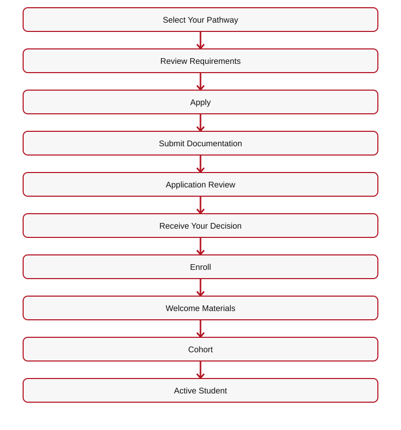
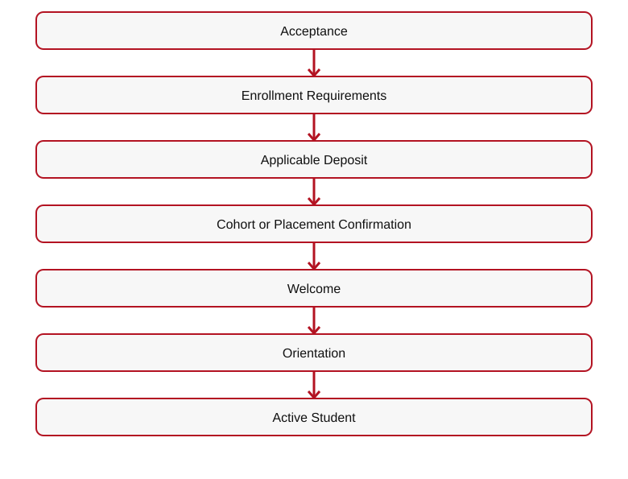
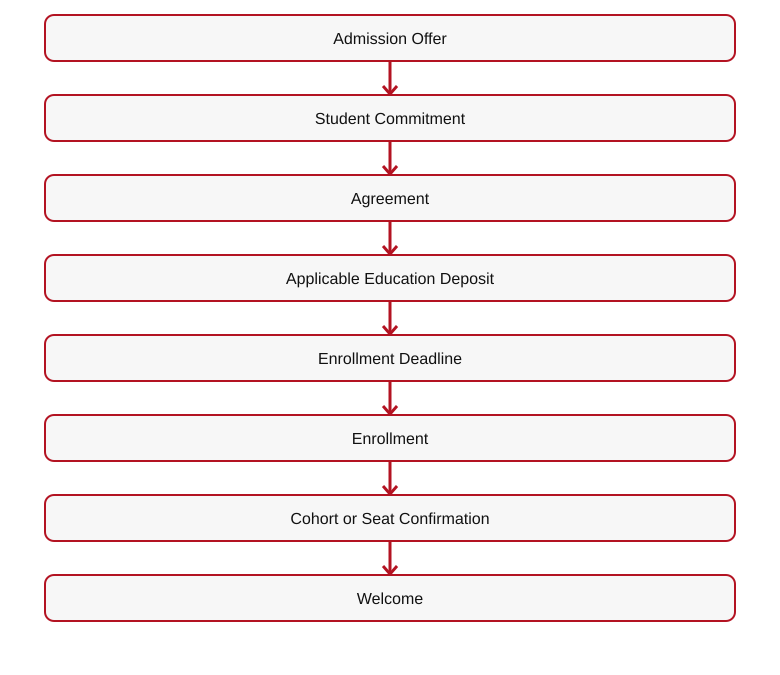
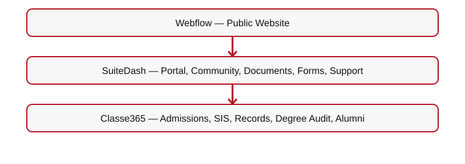

# 👑 RIAH PATHWAY — 12 ADMISSIONS — MAIN WIREFRAME
**ONE DYNASTY. INFINITE LEGACIES.**
## I. GLOBAL WEBSITE HEADER

**[LOGO — RIAH PATHWAY UNIFIED CROWN]**
**[NAVIGATION — 01 HOME**  
• 02 ABOUT  
• 03 PATHWAY  
• 04 DEGREE PROGRAMS  
• 05 EXPERIENTIAL  
• 07 HIGH SCHOOL  
• 08 GED/HSE  
• 09 CERTIFICATION REVIEW  
• 10 BAR REVIEW  
• 11 CURRICULUM  
• 12 ADMISSIONS  
• 13 TUITION  
• 14 DONATIONS  
• 15 PRODUCTS  
• 16 ACCREDITATION & AUTHORIZATION  
• 17 JOIN US  
• 18 RESOURCES  
• 19 FAQ  
• 20 CONTACT]**
**[MOBILE NAVIGATION — COLLAPSIBLE MENU]**

**[BUTTON 11-M01 — APPLY NOW → CLASSE365]**
**[BUTTON 11-M02 — LOG IN → SUITEDASH]**
## II. ADMISSIONS HERO & OVERVIEW

**[VIDEO — ADMISSIONS JOURNEY: EXPLORING, APPLYING, ACCEPTANCE, COHORTS, EDUCATION, GRADUATION]**
# FROM INTEREST TO ENROLLMENT. ONE CONNECTED PATH.
RIAH Pathway provides a structured admissions experience connecting pathway exploration, pre-admissions, eligibility review, applications, documentation, admission decisions, acceptance, enrollment, cohort placement, onboarding, orientation, active student experience, graduation, and alumni engagement.
**Explore**  

[Mermaid source](IMAGES/ADMISSIONS-WIREFRAME-MAIN-FLOW-01.mmd)

**[IMAGE — COMPLETE ADMISSIONS-TO-ALUMNI STUDENT JOURNEY]**
**[BUTTON 11-M03 — APPLY NOW → CLASSE365]**

**[BUTTON 11-M04 — PRE-ADMISSIONS → 12.2]**
**[BUTTON 11-M05 — PATHWAYS → 03]**
## III. COMPLETE STUDENT JOURNEY
| Stage | Stage Name | Student Experience | Communication |
| --- | --- | --- | --- |
| 1 | Interest | Explore pathways, schools, curriculum, tuition, resources | Digital |
| 2 | Pathway Selection | Select educational or experiential route | Digital |
| 3 | Pre-Admissions | Review eligibility and requirements | Digital |
| 4 | Application | Submit application | Digital |
| 5 | Documentation | Submit required records | Digital |
| 7 | Review | Institutional and pathway-specific review | Digital |
| 7 | Acceptance | Receive decision | Digital + Physical |
| 8 | Commitment | Enrollment requirements | Digital |
| 9 | Enrollment | Cohort or placement | Digital |
| 10 | Welcome | Student materials and portal | Digital + Physical + Community |
| 11 | Orientation | One-week virtual orientation | Digital + Community |
| 12 | Active Student | Courses, experience, student life | Digital + Community |
| 13 | Achievement | Milestones | Digital + Applicable Physical |
| 14 | Graduation | Graduation requirements | Digital + Physical |
| 15 | Alumni | Professional and institutional engagement | Digital + Community |

**[IMAGE — STUDENT JOURNEY WITH DIGITAL, PHYSICAL, COMMUNITY ICONS]**
## IV. MONTHLY COHORT MODEL

**[ICON — MONTHLY CALENDAR]**
| Academic Preparation | Student Community | Institutional Operations |
| --- | --- | --- |
| Orientation | Cohort identity | Enrollment processing |
| Academic readiness | School connection | Student account preparation |
| Pathway preparation | Peer connection | Portal access |
| Resource training | Community participation | Academic-system access |
| Student expectations | Student organizations | Placement coordination |

[Mermaid source](IMAGES/ADMISSIONS-WIREFRAME-MAIN-FLOW-02.mmd)

**[BUTTON 11-M06 — ACCEPTANCE & ENROLLMENT → 12.4]**
## V. PRE-ADMISSIONS OVERVIEW

**School of Foundations admission rules:** Students already enrolled in grades 9–12 when RIAH Pathway launches finish their high school diploma at that institution, but may take RIAH **college dual enrollment**. RIAH's High School Diploma Program accepts eligible students transitioning **from eighth grade into ninth grade only**; students already in ninth–twelfth grade cannot transfer into RIAH for the diploma. GED/HSE preparation is exclusively for people who **withdrew before RIAH launched**, remain **without a diploma or GED**, and seek a second opportunity after academic difficulty. Students may not leave high school after launch to qualify for RIAH GED, and incoming ninth graders follow the diploma path instead. Eligible GED students may combine GED with **12 concurrent college credits**, and eligible RIAH diploma entrants may choose diploma with college dual enrollment.
**Highly recommended — bachelor's Year 3 preparation:** Complete the applicable **General Education and School Core** requirements before seeking admission into Year 3, with a target of **up to 60 approved foundational transfer credits** where applicable. Sources for individualized evaluation include **Sophia.org, StraighterLine, accredited colleges/universities, AP, IB, SAT, ACT, CLEP, or approved RIAH placement/test-out**. Alternative coursework, examination results, and placement scores require RIAH course-level equivalency review; **SAT/ACT scores do not automatically confer college credit**. Each school's actual core still controls (the School of Technology core, for example, is 39 credits). Applicants without all approved foundational coursework complete the missing General Education and School Core courses through RIAH before Year 3. Submit external credits in the initial transfer evaluation window; **bachelor's Years 3–4 use RIAH-controlled coursework and do not accept outside transfer credit**.

**Accessible, affordable, and rigorous acceleration:** Eligible students may progress through RIAH Year 3–4 courses at an accelerated pace, but must pass each required **proctored objective and performance assessment at 80% or higher**, plus any other required examinations, prerequisites, projects, capstones, and supervision. **One month is the earliest potential curriculum-completion timeframe where permitted**, not a completion promise for every program or credential. All applicable mandatory program-duration, credentialing, authorization, and payment rules still apply.

**Typical completion timeframes:** Associate's — 2 years; Bachelor's — 4 years; Master's/MBA — 1 year; J.D. — 4 years; Minor — 1 semester to 1 year; High School — 4 years; GED/HSE preparation — based on readiness and pace.
**Tuition is the same with or without approved transfer or alternative credits.** Transfer credits can reduce the number of RIAH courses remaining and **change the student's pacing and entry point, not the published program tuition**; the established Transfer Tuition Reduction remains **$0**. Any applicable application, resource-allocation, or optional transfer-evaluation fees remain governed by their separate schedules.

**Acceleration example (not a guarantee):** A student might finish the eligible outside General Education/School Core courses in **one month**, complete the initial transfer-credit review, and—if the school-specific prerequisites are satisfied—complete the remaining approved RIAH curriculum in **another month**. The actual outside-learning period may instead take two years or longer, and the RIAH portion may take longer. A one-month RIAH coursework benchmark applies **only where academic, accreditation, supervision, minimum-duration, payment, and other credentialing requirements permit**; it does not promise a one-month bachelor's, master's, MBA, or J.D. award.

**RIAH's post-transfer academic rigor is unchanged:** Bachelor's **Years 3 and 4** remain RIAH-controlled, and **master's, MBA, and J.D.** coursework remains subject to each program's established admissions, progression, and degree requirements. Required courses use **proctored objective assessments, performance assessments, or both**, with **ProctorU** as RIAH's assessment-proctoring platform; the required assessment passing threshold is **80% or higher**, along with any other course tests, projects, professional oversight, and **supervised capstones where applicable**. A transfer or accelerated pace waives none of these requirements.

**[ICON — ADMISSIONS CHECKLIST]**
# KNOW YOUR PATH BEFORE YOU APPLY.

### Numbered Subpage References

1. **12.2.1** — General Admissions — Eligibility, documentation, academic standing
2. **12.2.2** — School and Major — Year 3, minors, master's, MBA, prerequisites
3. **12.2.3** — Experiential — Levels, placements, prerequisites
4. **12.2.4** — High School — RIAH diploma entry from grade 8 to 9 only; other current high school students may apply for college dual enrollment
5. **12.2.5** — GED/HSE — only pre-launch noncompleters without diploma/GED; optional 12 concurrent college credits
6. **12.2.6** — Law — J.D., Non-J.D., applicable requirements
**Under-18 pre-admissions:** Minors may apply to eligible programs. Before Experiential work, obtain signed parent/legal-guardian permission and required forms. Internal RIAH assignments are **remote only**; external approved partners may offer **remote, hybrid, or on-site** placement where minor-work, supervision and jurisdictional rules permit. High school dual enrollment requires **both parent/legal-guardian and guidance counselor approval** before college-course enrollment; prior college coursework may qualify a minor to apply to an eligible degree pathway.

**Formal minor entry** requires the first minor course and its prerequisites (Computer Science: **College Algebra and Principles of Computer Science**). Each Experiential major has both coursework and level-specific experience requirements. **Certification Review and Bar Review are standalone products without RIAH admissions requirements.**

**[BUTTON 11-M07 — PRE-ADMISSIONS → 12.2]**
## VI. APPLICATION OVERVIEW

**[IMAGE — STUDENT COMPLETING DIGITAL APPLICATION]**
# YOUR FORMAL ENTRY INTO THE ADMISSIONS PROCESS.
**Classe365 • $0 TO APPLY — NO APPLICATION FEE**
**Student Information • Selected Pathway • Prior Education • Academic History • Required Documentation • Applicable Pathway Questions • Communications**

[Mermaid source](IMAGES/ADMISSIONS-WIREFRAME-MAIN-FLOW-03.mmd)

**[BUTTON 11-M08 — APPLY NOW → CLASSE365]**
**[BUTTON 11-M09 — APPLICATION → 12.3]**
## VII. ACCEPTANCE & ENROLLMENT OVERVIEW

**[IMAGE — PERSONALIZED ACCEPTANCE LETTER WITH UNIFIED CROWN]**
# WELCOME TO THE PATHWAY.
**Digital Acceptance + Physical Personalized Acceptance Letter**
**Student Name • School Identity • Selected Pathway • Institutional Branding • Unified Crown • Acceptance Information • Next Steps**

**[ICON — ACCEPTANCE LETTER WITH SEAL]**

[Mermaid source](IMAGES/ADMISSIONS-WIREFRAME-MAIN-FLOW-04.mmd)

**[BUTTON 11-M10 — ACCEPTANCE & ENROLLMENT → 12.4]**
## VIII. ONBOARDING & STUDENT EXPERIENCE OVERVIEW

**[IMAGE — RIAH PATHWAY WELCOME KIT]**
**Physical Welcome Materials + Digital Access + School Identity + Cohort Community**
**Student ID • School Materials • Academic Materials • Orientation Materials • Branded Items • Applicable Robe • Scarf • Bag • Student Resources**
**Student allocation / fee distinction:** $0 to apply and no separate $500 RIAH Education Deposit Fee. Students pay only their selected Student Resource Allocation Fee (resource allocation payment/deposit), generally $500–$1,500 by program, with GED and Minor at $500, High School at $500, J.D. and Non-J.D. at $1,000 each. The allocation supports applicable laptops, personalized books, transcripts, graduation cap and gown, software/subscriptions, Welcome/Transfer Kit and other approved enrollment-through-graduation resources. Additional non-included items carry their disclosed separate price; no double charges for included resources. Optional transcript/transfer evaluation costs $50 and processing $50 ($100 total when both apply).
| Orientation Area | Preparation |
| --- | --- |
| Academics | Expectations and resources |
| Technology | Systems and access |
| Institution | Institutional identity |
| Community | School, cohort, organizations |
| Experiential | Placement and supervision |
| Law | Legal supervision requirements |
| Career | Career-development resources |

**[BUTTON 11-M11 — ONBOARDING & STUDENT EXPERIENCE → 12.5]**
## IX. GRADUATION & ALUMNI OVERVIEW

**[IMAGE — REGIONAL GRADUATION CEREMONY]**
**NORTH • SOUTH • EAST • WEST**
**Regional In-Person Ceremony + Virtual Graduation Option**

[Mermaid source](IMAGES/ADMISSIONS-WIREFRAME-MAIN-FLOW-05.mmd)

**[BUTTON 11-M12 — GRADUATION & ALUMNI → 12.6]**
## X. HOW RIAH PATHWAY WORKS OVERVIEW

**[IMAGE — INSTITUTIONAL SERVICE ECOSYSTEM]**

[Mermaid source](IMAGES/ADMISSIONS-WIREFRAME-MAIN-FLOW-06.mmd)

**Parchment — Official Transcripts**  
• National Student Clearinghouse — Enrollment and Degree Verification  
• LearnWorlds — Courses  
• Cengage MindTap — Courseware  
• PebblePad — Portfolios  
• ProctorU — Proctoring  
• Tutor.com — Tutoring  
• PeopleGrove CORE + Experience Hub + CompMS — Experiential  
• Symplicity CSM — Careers  
• TouchNet — Finance  
• Regent Education — Financial Aid  
• Merit Pages — Recognition**

**[BUTTON 11-M13 — HOW RIAH PATHWAY WORKS → 12.7]**
## XI. TRANSFER STUDENTS OVERVIEW

### Personalized Student Collections After Transfer Credit Evaluation

**Course-by-course determination:** After the one-time transfer credit evaluation, RIAH Pathway identifies the student's accepted credits, outstanding general education courses, outstanding school core courses, and any remaining major, capstone, or program requirements. The student's academic course plan determines the contents of their internal student collection package.

**Not one-size-fits-all:** Each student receives a personalized collection of applicable textbooks, workbooks, study guides, review guides, journals, planners, flashcards, and other course resources based on the courses they actually need to complete. Students do not automatically receive the entire general education or school core collection when approved transfer credits have already satisfied some or all of those courses.

**Example:** A bachelor's transfer student whose approved credits satisfy all general education requirements but not the school core receives the outstanding school core course collections, plus the applicable subsequent major and capstone materials; the student does **not** need a complete general education collection. If only some general education or core courses remain, include the collections for those outstanding courses only.

**Fulfillment and student experience:** Finalize the personalized course and collection list after transfer evaluation and placement, before assembling or assigning the student's applicable learning materials and Welcome/Transfer Kit resources. Continue to apply the established deposit, onboarding, and kit-delivery requirements. The internal student collection is determined by actual outstanding coursework, not a uniform full-program bundle.

**Final transfer-credit restrictions (education pathways):** Associate's — up to 30 credits from general education, school core, or a combination of both. Bachelor's — up to 60 credits applicable only to general education and school core. Bachelor's Years 3 and 4 consist of RIAH Pathway coursework and do not accept transfer credits; no additional transfer credits may be added after the initial transfer evaluation and placement. Master's — up to 9 credits. MBA — up to 9 credits. J.D. — up to 27 approved first-year (1L) credits for entry after Year 1 only; no J.D. transfer into Years 2, 3, or 4. Transfer credit is determined once as part of the initial transfer evaluation; later additional transfer-credit submissions are not accepted. High School and GED/HSE admission and transfer parameters remain subject to separate review and are not changed by this clarification.

## Transfer Credit Evaluation — One-Time Optional Service

| Component | Fee | Timing |
| --- | ---: | --- |
| Transfer credit evaluation (including alternative credit, prior learning, and applicable previous coursework) | $50 | After prerequisite/transcript eligibility review and before determining which credits apply |
| Processing and administration | $50 | Once the student is admitted to the applicable program/year and the transfer credit determination is processed |
| **Total when both services apply** | **$100** | **One-time; not charged twice for the same evaluation** |

The $100 is **not charged to every applicant**. It applies only to students requesting transfer credit evaluation and subsequent processing. Transcripts are submitted during pre-admissions and reviewed for prerequisite eligibility and outstanding requirements. Students meeting the applicable education admission requirements are admitted; the transfer credit evaluation determines which previous credits apply and which courses remain, rather than determining whether the student is admitted. Students with missing prerequisites are informed of the deficiencies and may return after completing them for a follow-up review without a second evaluation charge. For a Year 3 placement, the transfer evaluation and required prerequisites must be completed before Year 3 admission/placement. The $50 processing and administration portion is assessed only once the student is admitted to the applicable year or master's/MBA program. J.D. transfers are limited to up to 27 Year 1 (1L) credits and entry after Year 1; no transfers into J.D. Years 2–4. Master's and MBA transfer limits are 9 credits each.

**Admissions positioning:** Accessible education for applicants who meet program prerequisites; affordable program pricing; rigorous proctored assessments, performance assessments, and capstones. Educational admission is based on meeting published prerequisites and transcript requirements, not on purchasing the optional transfer credit evaluation service.

**J.D. transfers:** Up to 27 credits from Year 1 (1L) coursework; transfer entry is permitted after Year 1 only. No transfer into J.D. Years 2, 3, or 4.

**Master's and MBA transfers:** Up to 9 approved credits for each program, subject to evaluation.

**[IMAGE — TRANSFER STUDENT JOURNEY]**
**Explore Transfer**  

[Mermaid source](IMAGES/ADMISSIONS-WIREFRAME-MAIN-FLOW-07.mmd)

**[BUTTON 11-M14 — TRANSFER STUDENTS → 12.8]**
## XII. BRAND & STUDENT EXPERIENCE STANDARDS

**[IMAGE — UNIFIED CROWN, LOGOS, SCHOOL COLORS, GOAT MASCOT]**
| Standard | RIAH Pathway |
| --- | --- |
| Slogan | ONE DYNASTY. INFINITE LEGACIES. |
| Logo | RP • Stacked • Horizontal |
| Colors | Black • Red • Gold • White • Silver |
| Symbol | Unified Crown |
| Mascot | RIAH Pathway Goat |
| Value | PERSEVERANCE |
| POWER | People • Ownership • Work • Equity • Results |
| Student Message | STUDENTS BUILD DYNASTIES TOO. |
| Brand Message | BUILT DIFFERENT |
10. **Standard:** Career Sequence → **RIAH Pathway:** Education → Experience → Certification → Opportunity → Career
11. **Standard:** Theme Song → **RIAH Pathway:** Pathway to Success — Original SoundBreak Creation
**[EXTERNAL LINK — THEME SONG → SOUNDBREAK]**

**[BUTTON 11-M15 — BRAND IDENTITY → 2.6]**
**[BUTTON 11-M16 — STUDENT LIFE → 17.2]**
## XIII. SUPPORTING RESOURCES

**[ICON — DIGITAL RESOURCE LIBRARY]**
| Resource | Destination |
| --- | --- |
| Pathway | 03 |
| Degree Programs | 04 |
| Experiential | 05 |
| High School | 07 |
| GED/HSE | 08 |
| Certification Review | 09 |
| Bar Review | 10 |
| Curriculum | 11 |
| Tuition | 13 |
| Accreditation | 16 |
| Student Life | 17.2 |
| Policies | 18.8 |
| Procedures | 18.9 |
| Guidelines | 18.10 |
| Admissions FAQ | 19.4 |
| Technical FAQ | 19.9 |
| Contact Admissions | 20.2 |

**[DOWNLOAD — ADMISSIONS GUIDE]**
**[DOWNLOAD — PRE-ADMISSIONS CHECKLIST]**

**[DOWNLOAD — STUDENT JOURNEY ROADMAP]**
**[DOWNLOAD — EXPERIENTIAL ADMISSIONS AND PLACEMENT GUIDE]**

**[DOWNLOAD — TRANSFER STUDENT CHECKLIST]**
**[DOWNLOAD — ACCEPTANCE AND ENROLLMENT CHECKLIST]**

**[DOWNLOAD — ORIENTATION AND ONBOARDING OVERVIEW]**
**[DOWNLOAD — GRADUATION AND ALUMNI OVERVIEW]**

**[DOWNLOAD — HIGH SCHOOL TRANSCRIPT EVALUATION CHECKLIST]**
**[DOWNLOAD — GED/HSE ADMISSIONS CHECKLIST]**

**[DOWNLOAD — YEAR 3 PREREQUISITE CHECKLIST]**
**[DOWNLOAD — MINOR PREREQUISITE CHECKLIST]**

**[DOWNLOAD — MASTER'S AND MBA PREREQUISITE CHECKLIST]**
**[DOWNLOAD — EXPERIENTIAL PREREQUISITE CHECKLIST]**
**SuiteDash — Authenticated Student Resources, Documents, Policies, Procedures, Guidelines, Forms, Support**
### Academic and Experiential Tuition, Contributor Benefits & Founder Financial Transparency

The following are **100% standard post-accreditation** tuition amounts before Beta (25%), Pre-Accreditation (50%) or Post-Accreditation (100%) pricing stages and other permitted adjustments.

| Education Program | Standard Tuition | Basis |
|---|---:|---|
| GED/HSE | $1,500 | Total program; 12 concurrent college credits |
| High School Diploma | $5,000 | Total program; 30 embedded college credits |
| Minor | $5,000 | Total program |
| Associate’s | $10,000 | Total program |
| Bachelor’s | $20,000 | Total program |
| Master’s | $15,000 | Total program |
| MBA | $15,000 | Total program |
| J.D. | $40,000 | Total program |
| Non-J.D. | $10,000 | Per applicable required pathway year |

| Experiential Level | Duration | Standard Tuition |
|---|---|---:|
| Apprentice | 1 month | $5,000 |
| Intern | 3 months | $10,000 |
| Associate | 1 year | $20,000 |
| Senior Associate | 1 year | $20,000 |
| Manager | 1 year | $20,000 |
| Executive | 1 year | $20,000 |

Optional Progressive Experience adds $10,000 and optional Rotational Experience adds $5,000, subject to availability and eligibility.

**Tuition reimbursement:** Eligible Education and Experiential participants completing their program qualify for a **guaranteed 10% completion reimbursement**. Verified contributor / Ambassador milestones may add up to **25%**, and additional approved milestones may add up to **15%**, for **up to 50% total**, subject to eligible tuition, verification, and non-stacking rules; 50% is not automatic. Eligible internal Team Member tuition and product benefits are separately governed.

[BUTTON: Explore Tuition & Pricing Stages → INTERNAL ROUTE 13]
[BUTTON: Review Contributor Milestones & Tuition Reimbursement → INTERNAL ROUTES 13.6; 17.2.15]
[BUTTON: Review Founder Contributions & Financial Transparency → INTERNAL ROUTE 17.6]
[BUTTON: Explore Experiential Admissions → INTERNAL ROUTE 5]
[DOWNLOAD: Published Education & Experiential Tuition Schedule → ../../RIAH-PATHWAY-TUITION-PRICING-FEES-STRUCTURE/RIAH-PATHWAY-TUITION-PRICING-FEES.md]
[DOWNLOAD: Contributor Benefits & Milestone Verification → ../../RIAH-PATHWAY-CONTRIBUTOR-BENEFITS-STRUCTURE/README.md]
[DOWNLOAD: Student and Experiential Completion Benefits → ../../RIAH-PATHWAY-CONTRIBUTOR-BENEFITS-STRUCTURE/STUDENTS.md]
[INTERNAL LINK: Founder Equity Contributions & Allocations → ../17-JOIN-US/17.6-FOUNDER-EQUITY-CONTRIBUTIONS-ALLOCATIONS.md]

## XIII-A. ENTREPRENEURSHIP PROGRAM — SPRING & FALL ADMISSIONS

[IMAGE PLACEHOLDER — Business owner completing an entrepreneurship readiness assessment]
[ICON — SPRING / FALL CALENDAR]

RIAH Pathway accepts Entrepreneurship Program applications **twice annually: Spring and Fall**. These are **separate from the monthly Education and standard Experiential cohorts**.

| Entrepreneurship Track | Requirements | Duration | Total Tuition |
|---|---|---|---:|
| Startup Launch | Developed business plan/model, market research, projections and tangible product/service, sample or MVP; an idea alone is not sufficient | **12 weeks** | **$5,000** |
| Small Business Recovery & Growth | Legitimate verified operating small business, documented business challenges and an involved owner or decision-maker | **16 weeks** | **$10,000** |

**Priority outreach:** Minority-owned, women-owned, Black-owned, LGBTQ-owned, Asian-owned, economically disadvantaged and underserved startups and small businesses across all industries.

**Enrollment:** [APPLICATION → BUSINESS VERIFICATION → READINESS/NEEDS ASSESSMENT → ADMISSIONS REVIEW → ACCEPTANCE → ENROLLMENT → ORIENTATION → CONCURRENT COURSES + APPLIED BUSINESS WORK WITH EXPERIENTIAL TEAM AND INDEPENDENT PARTNER FIRMS → MILESTONES / COMPLETION]

Entrepreneurship application fee: **$75**. Enrollment deposit: **$500 credited toward tuition**. Program participation may be remote, hybrid or on-site. External affiliate professional services are independently scoped and charged. Standard Education and Experiential applications remain $0; this is a separate entrepreneurship program.

### Entrepreneurship Payment Choice at Enrollment

| Payment | Startup Launch | Small Business Recovery & Growth |
|---|---:|---:|
| **Pay upfront — 25% off** | **$3,750** | **$7,500** |
| **Pay monthly at full tuition** | **3 installments totaling $5,000** | **4 installments totaling $10,000** |

The $500 enrollment deposit credits either choice. **Missed monthly payments pause the whole program, curriculum, courses and managed professional activities until paid.** Upfront payers **may cancel at any time**; used four-week program periods are earned revenue and **unused prepaid tuition is refunded**. See 13 / Tuition and Fees for exact installment amounts, partial-month use and refund examples.

[BUTTON — SELECT ENTREPRENEURSHIP PAYMENT OPTION → 13 / TUITION AND FEES]
[FLOW — CHOOSE UPFRONT OR MONTHLY → TUITION DEPOSIT CREDIT → ACTIVE PROGRAM → PAYMENT VERIFIED / REVENUE EARNED → CONTINUE, PAUSE OR CANCEL]

[BUTTON — EXPLORE ENTREPRENEURSHIP PROGRAM → 15.4]
[BUTTON — ENTREPRENEURSHIP TUITION AND FEES → 13 / TUITION]
[BUTTON — BUSINESS AFFILIATE CONNECTIONS → 15.5]

## XIV. CONTACT ADMISSIONS

**[ICON — ADMISSIONS SUPPORT]**
**Website: RIAHPathway.com • SuiteDash Help Desk • Toll-Free: 877-245-7424 • Vanity: 877-245-RIAH**

**[BUTTON 11-M17 — CONTACT ADMISSIONS → 20.2]**
**[BUTTON 11-M18 — STUDENT SUPPORT → 20.5]**

**[BUTTON 11-M19 — TECHNICAL SUPPORT → 20.4]**
**[BUTTON 11-M20 — APPLY NOW → CLASSE365]**
## XV. FINAL CTA
**[CTA BAND — BLACK / RED / GOLD]**
# FIND YOUR PATH. UNDERSTAND THE PROCESS. GET STARTED.

**[BUTTON 11-M21 — PATHWAYS → 03]**
**[BUTTON 11-M22 — DEGREE PROGRAMS → 04]**

**[BUTTON 11-M23 — EXPERIENTIAL → 05]**
**[BUTTON 11-M24 — CURRICULUM → 11]**

**[BUTTON 11-M25 — PRE-ADMISSIONS → SUITEDASH]**
**[BUTTON 11-M26 — APPLY NOW → CLASSE365]**

**[BUTTON 11-M27 — TUITION → 13]**
## XVI. GLOBAL FOOTER

**[LOGO — RIAH PATHWAY]**
**ONE DYNASTY. INFINITE LEGACIES.**
**[GLOBAL NAVIGATION — ALL 19 MAIN PAGES]**
**Website: RIAHPathway.com • Phone: 877-245-7424**
**Privacy • Terms • Accessibility • Consumer Information • Policies**
**[ROUTING TABLE — SEE 12-ADMISSIONS-WIREFRAMES-CTA-LINKS-ROUTING.md]**

## XVII. COMPLETE ADMISSIONS CONTENT PRESERVATION — SUPPLEMENTAL CROSS-REFERENCES

**[IMAGE — COMPLETE ADMISSIONS-TO-ALUMNI STUDENT JOURNEY]**
**Interest**  

[Mermaid source](IMAGES/ADMISSIONS-WIREFRAME-MAIN-FLOW-08.mmd)

**Monthly cohorts:** Acceptance  

[Mermaid source](IMAGES/ADMISSIONS-WIREFRAME-MAIN-FLOW-09.mmd)

**Pre-admissions:** Year 3 requires completed general education and school core; formal admission to a minor requires its first qualifying minor course plus prerequisites (Computer Science: College Algebra and Principles of Computer Science); master's and MBA require applicable bachelor's degree or accepted equivalent and outstanding prerequisites completed before admission.
**High School:** Initial states Ohio, Florida, Texas; eighth-grade transcripts for RIAH diploma entrants entering ninth grade. Current grades 9–12 students finish their diploma at their existing school; transcripts are evaluated for college dual enrollment only, not diploma transfer.
**GED/HSE:** Evidence of withdrawal before RIAH launched and no diploma or GED; eligible applicants may pursue GED preparation and 12 concurrent college credits. Post-launch withdrawal and incoming ninth-grade applicants do not qualify for GED.
**Experiential:** Apprentice 1 month; Intern 3 months; Associate, Senior Associate, Manager, Executive 1 year each.  
Each approved Experiential major requires specific coursework AND verified experience at the requested level. Accounting requires Financial Accounting and Managerial Accounting; Computer Science Experiential requires Introduction to Computer Science; other approved majors require published foundational courses.
**Under-18 placement:** signed parent/legal-guardian authorization before work; internal remote only; external remote/hybrid/on-site where lawful. High school dual enrollment requires both parental and guidance counselor approval. Certification Review and Bar Review have no admission process.

**[BUTTON — PRE-ADMISSIONS → 12.2]**
**[BUTTON — APPLICATION → 12.3]**

**[BUTTON — ACCEPTANCE & ENROLLMENT → 12.4]**
**[BUTTON — STUDENT EXPERIENCE → 12.5]**

**[BUTTON — GRADUATION & ALUMNI → 12.6]**
**[BUTTON — HOW RIAH PATHWAY WORKS → 12.7]**

**[BUTTON — TRANSFER STUDENTS → 12.8]**

---

## Entrepreneurship Experiential — New Page 6 Admissions Integration

| Participant Pool | Levels | Duration Options | Enrollment |
|---|---|---|---|
| Startup Entrepreneurship | 6.2.1 Apprentice; 6.2.2 New; 6.2.3 One-Year; 6.2.4 Growth | 1 Month; 12 Weeks; 16 Weeks | Spring and Fall |
| Small Business Entrepreneurship | 6.3.1 Apprentice; 6.3.2 New; 6.3.3 Established; 6.3.4 Recovery & Growth | 1 Month; 12 Weeks; 16 Weeks | Spring and Fall |

**Verification:** Developed startup plans and readiness or legitimate small-business records; assess the level and planned applied work. **Application fee:** $75. **Enrollment deposit:** $500 credited toward program tuition. Published Entrepreneurship prices and separate Extended Services affiliate fees remain documented on Pages 13 and 15.5 respectively.

[BUTTON — ENTREPRENEURSHIP MAIN PAGE → 6]
[BUTTON — STARTUP ENTREPRENEURSHIP → 6.2]
[BUTTON — SMALL BUSINESS ENTREPRENEURSHIP → 6.3]
[BUTTON — ENTREPRENEURSHIP TUITION → 13]
[BUTTON — OPTIONAL AFFILIATE CONNECTIONS → 15.5]
