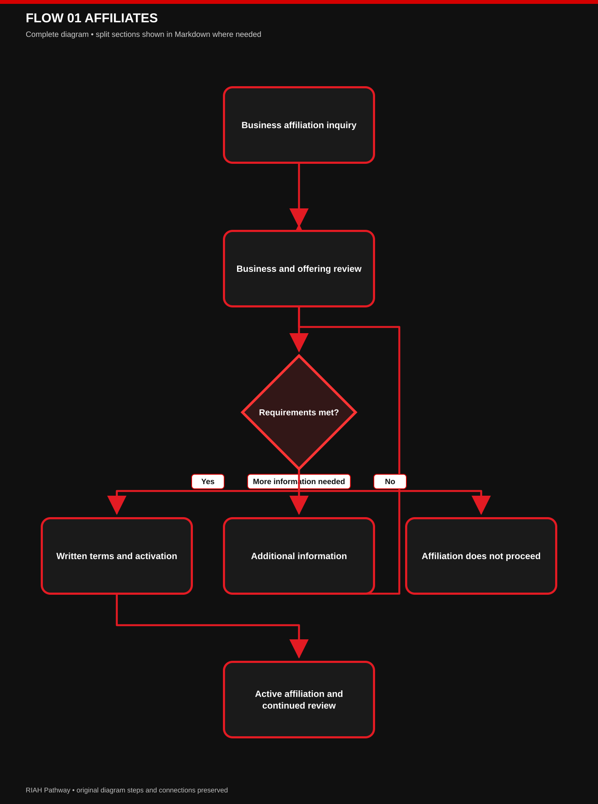

# 👑 RIAH Pathway
# 🔗 Business Affiliate Standards, Requirements & Application Process

RIAH Pathway welcomes business affiliates that offer legitimate websites, products, services, platforms, or other business activities and want to build a mutually beneficial relationship through relevant links, referrals, and shared promotion.

**Business affiliation supports connections between our organizations and audiences. Participation does not require involvement in RIAH Pathway’s education or Experiential pathways.**

## 📑 Index

| SECTION | TITLE |
|---|---|
| I | 🔑 Emoji Key |
| II | 🤝 Purpose of Business Affiliation |
| III | 🛡️ Our Affiliate Standards |
| IV | 📂 Application Requirements |
| V | 🔎 Application & Verification Process |
| VI | 🌐 Requirements by Business Activity |
| VII | 🔗 Links, Backlinks & Cross-Promotion |
| VIII | ✍️ Affiliate Agreements & Getting Started |
| IX | 📣 Public Representation & Customer Experience |
| X | 🔄 Maintaining an Approved Affiliation |
| XI | 📬 Apply to Become a Business Affiliate |
| XII | 👑 Public Information & Intellectual Property |

## I. 🔑 Emoji Key

| EMOJI | MEANING |
|---|---|
| 👑 | RIAH Pathway |
| 🤝 | Business affiliation |
| 🛡️ | Standards & protection |
| 📂 | Required information |
| 🔎 | Verification & review |
| 🌐 | Businesses, websites & platforms |
| 🔗 | Links, backlinks & referrals |
| 📣 | Shared promotion |
| ✍️ | Written terms |
| ✅ | Approved |
| ⏳ | Additional information needed |
| 🔄 | Continued review & renewal |

## II. 🤝 Purpose of Business Affiliation

Business affiliates work with RIAH Pathway to connect people with relevant businesses, products, services, and information.

An affiliation may include reciprocal website links, business listings, referrals, shared promotions, or other agreed activities that help both organizations reach appropriate audiences.

| ACTIVITY | PURPOSE |
|---|---|
| WEBSITE LINKS & BACKLINKS | Help visitors discover relevant information, products, or services |
| BUSINESS LISTINGS | Introduce approved businesses through agreed directories or resource pages |
| PRODUCT & SERVICE REFERRALS | Connect interested customers with relevant offerings |
| CROSS-PROMOTION | Share approved information with each organization’s audience |
| SHARED CAMPAIGNS | Coordinate agreed promotional activities |
| BUSINESS CONNECTIONS | Support introductions and opportunities for mutual growth |

**Business affiliation is a separate relationship from student placements, educational partnerships, employer partnerships, and ambassador participation.**

## III. 🛡️ Our Affiliate Standards

We consider businesses whose operations, offerings, and proposed activities are legitimate, verifiable, and appropriate for the relationship.

| STANDARD | WHAT WE REQUIRE |
|---|---|
| LEGITIMATE BUSINESS | A lawfully operating business or entity with verifiable ownership or responsible representatives |
| REAL OPERATIONS | Actual products, services, websites, platforms, or business activities |
| ACCOUNTABLE PEOPLE | Identifiable people authorized to represent the business |
| AUTHORIZED OFFERINGS | Permission to sell, provide, publish, or promote the proposed products and services |
| RELEVANT CONNECTION | A clear reason the affiliation would be useful to both organizations and their audiences |
| ACCURATE CLAIMS | Truthful descriptions of offerings, prices, qualifications, and the relationship |
| RELIABLE CUSTOMER EXPERIENCE | Clear contact information, applicable terms, and a way to address customer concerns |
| RESPONSIBLE PRACTICES | Appropriate privacy, security, communication, and promotional practices |
| RESPECT FOR OWNERSHIP | Proper use of each organization’s names, materials, products, and intellectual property |

A website or social media presence alone does not establish eligibility. We review the business behind it and the activities proposed.

New businesses and sole proprietors may qualify when they provide appropriate evidence of legitimate operations.

## IV. 📂 Application Requirements

| REQUIREMENT | WHAT TO PROVIDE |
|---|---|
| BUSINESS DETAILS | Legal name, trade name where applicable, business structure, location, and contact information |
| PROOF OF OPERATIONS | Applicable registration, business documentation, or other evidence appropriate to the operating structure |
| AUTHORIZED REPRESENTATIVE | Name, role, business contact information, and authority to enter the affiliation |
| WEBSITE & CHANNELS | Websites, platforms, storefronts, or other channels involved in the proposal |
| PRODUCTS & SERVICES | A description of the offerings to be linked, listed, referred, or promoted |
| OWNERSHIP & PERMISSIONS | Confirmation that the business controls or is authorized to use the relevant channels and materials |
| REQUIRED QUALIFICATIONS | Applicable licenses, permits, or professional credentials |
| CUSTOMER INFORMATION | Relevant prices, service terms, purchase policies, and support contacts |
| AFFILIATION PROPOSAL | Requested links, listings, referrals, promotions, or other shared activities |
| RELEVANT BACKGROUND | References or supporting information when requested |

Sensitive information should be submitted through the designated application channel. Confidential business evidence may be redacted where appropriate.

## V. 🔎 Application & Verification Process

| STEP | WHAT TO EXPECT |
|---|---|
| SUBMIT AN INQUIRY | Introduce your business and describe the affiliation you propose |
| PROVIDE INFORMATION | Submit the requested business details, websites, and supporting evidence |
| COMPLETE VERIFICATION | We confirm relevant business information, representatives, ownership, and required qualifications |
| REVIEW THE OFFERINGS | We review the products, services, or pages included in the proposal |
| DISCUSS THE RELATIONSHIP | We agree on the purpose, audience, responsibilities, and proposed activities |
| RECEIVE A DECISION | We approve the proposal, request additional information, or explain why it cannot proceed |
| CONFIRM WRITTEN TERMS | Both organizations document the approved activities and permissions |
| BEGIN THE AFFILIATION | Approved links, listings, or promotions become active |

[View editable Mermaid diagram](./../../IMAGES/FLOW-01-AFFILIATES.mmd)

**Approval covers the business, offerings, channels, and activities identified in the written terms.**

## VI. 🌐 Requirements by Business Activity

| BUSINESS ACTIVITY | ADDITIONAL REQUIREMENTS |
|---|---|
| BUSINESS WEBSITES & PLATFORMS | Verifiable ownership or authority, accurate content, working contact information, and appropriate privacy practices |
| PHYSICAL PRODUCTS | Clear product descriptions, authority to sell, applicable safety requirements, and stated purchase and fulfillment terms |
| DIGITAL PRODUCTS & SOFTWARE | Rights to distribute the offering, clear functionality and access terms, and appropriate customer support |
| PROFESSIONAL SERVICES | Required licenses or credentials, accurate service descriptions, and clear limits of service |
| ONLINE STORES & MARKETPLACES | Identifiable operator, transparent seller responsibilities, and clear transaction and customer-support terms |
| SUBSCRIPTION SERVICES | Clear pricing, billing frequency, renewal conditions, and cancellation information |
| BUSINESS DIRECTORIES & RESOURCE SITES | Accurate listings, relevant placement, and transparent descriptions of the affiliation |
| REFERRAL & PROMOTIONAL SERVICES | Agreed referral methods, accurate messaging, and any required permissions or disclosures |
| REGULATED PRODUCTS OR SERVICES | Applicable authorization and compliance with requirements governing the proposed offering |

The review reflects the actual activity. A business offering several types of products or services may need to meet more than one set of requirements.

## VII. 🔗 Links, Backlinks & Cross-Promotion

Approved affiliates may exchange links and participate in shared promotion under agreed terms.

| REQUIREMENT | STANDARD |
|---|---|
| AGREED PLACEMENT | Both organizations approve where and how links or listings will appear |
| RELEVANT DESTINATION | Links lead to the agreed business, product, service, or information page |
| ACCURATE DESCRIPTION | Titles, descriptions, and surrounding content correctly describe the destination |
| WORKING LINKS | Links remain functional and direct visitors to the approved destination |
| APPROVED BRAND USE | Names, logos, and promotional materials are used with permission |
| CLEAR RELATIONSHIP | The affiliation is described accurately, including applicable commercial disclosures |
| RESPONSIBLE PROMOTION | No misleading listings, fabricated traffic, unsolicited bulk promotion, or mass link exchanges |
| UPDATED CONTENT | Changes affecting links, offerings, or descriptions are communicated and corrected |
| MUTUAL CONSENT | New campaigns, placements, or promotional commitments require agreement |

**Reciprocal links, featured listings, and promotional placements are agreed individually. Affiliate approval does not automatically guarantee every form of promotion.**

An affiliation does not guarantee website traffic, search rankings, sales, customer volume, or revenue.

## VIII. ✍️ Affiliate Agreements & Getting Started

| AGREEMENT AREA | WHAT THE TERMS ADDRESS |
|---|---|
| PARTICIPATING BUSINESSES | The organizations and authorized representatives entering the relationship |
| APPROVED OFFERINGS | Products, services, websites, or platforms covered by the affiliation |
| LINKS & LISTINGS | Approved destinations, descriptions, locations, and maintenance responsibilities |
| SHARED PROMOTION | Agreed campaigns, materials, channels, and timing |
| COMMERCIAL TERMS | Any agreed discounts, fees, referral compensation, or other business benefits |
| CUSTOMER RESPONSIBILITIES | Who handles purchases, fulfillment, service delivery, support, and complaints |
| PRIVACY & INFORMATION | Any permitted information sharing and applicable protections |
| BRAND & CONTENT PERMISSIONS | Authorized use of names, logos, descriptions, and materials |
| REVIEW & ENDING THE RELATIONSHIP | Changes, renewal, suspension, termination, and removal of materials |

**Commissions, discounts, revenue sharing, exclusivity, and other commercial benefits apply only when expressly agreed in writing.**

Getting started includes confirming approved materials, testing links, and identifying contacts for updates and customer concerns.

## IX. 📣 Public Representation & Customer Experience

| REQUIREMENT | AFFILIATE COMMITMENT |
|---|---|
| ACCURATE AFFILIATION | Describe the relationship within the approved scope |
| INDEPENDENT BUSINESS IDENTITY | Make clear which business provides the product or service |
| CLEAR CUSTOMER TERMS | Provide applicable pricing, purchase conditions, and service information |
| CUSTOMER SUPPORT | Maintain a reliable contact for questions and concerns |
| HONEST PROMOTION | Avoid unsupported claims, misleading comparisons, or fabricated endorsements |
| AUTHORIZED STATEMENTS | Do not make commitments on behalf of RIAH Pathway |
| PRIVACY | Do not collect or exchange customer information beyond agreed permissions |
| RESPECTFUL COMMUNICATION | Follow applicable communication requirements and platform rules |

Affiliation does not mean RIAH Pathway owns, operates, licenses, or guarantees the affiliate’s business or offerings. Any endorsement or recommendation must be expressly authorized.

## X. 🔄 Maintaining an Approved Affiliation

| REQUIREMENT | CONTINUED PARTICIPATION STANDARD |
|---|---|
| CURRENT BUSINESS INFORMATION | Keep ownership, representatives, contact details, and required qualifications current |
| CONSISTENT OFFERINGS | Maintain accurate information about approved products and services |
| FUNCTIONAL LINKS | Keep agreed links and listings working and current |
| RELIABLE PRACTICES | Continue meeting customer, promotional, privacy, and ownership standards |
| NOTICE OF CHANGES | Report changes affecting the business, offerings, channels, or agreement |
| COOPERATION | Address concerns and correct unauthorized or inaccurate materials |
| PERIODIC REVIEW | Complete re-verification or renewal when required by the agreement |

RIAH Pathway may request corrections, pause promotional activities, remove links or listings, or end an affiliation when requirements are no longer met.

## XI. 📬 Apply to Become a Business Affiliate

**Tell us what your business offers and how a connection between our organizations would benefit our audiences.**

| NEXT STEP | WHAT TO INCLUDE |
|---|---|
| SUBMIT AN INQUIRY | Contact → Partnerships & Organizations |
| IDENTIFY YOUR BUSINESS | Business name, website, and authorized contact |
| DESCRIBE YOUR OFFERINGS | Relevant products, services, platforms, or business activities |
| PROPOSE THE CONNECTION | Backlinks, listings, referrals, cross-promotion, or a shared campaign |
| COMPLETE THE REVIEW | Provide the requested evidence and discuss participation terms |
| BEGIN APPROVED ACTIVITIES | Confirm the agreement and activate the approved connections |

Businesses may apply for affiliation without providing student placements or participating in education or Experiential pathways.

## XII. 👑 Public Information & Intellectual Property

RIAH Pathway publishes information so the public can understand its programs, opportunities, requirements, and participation terms.

**Public availability does not grant permission to copy, adapt, republish, commercialize, or build another organization’s materials or offerings from RIAH Pathway’s protected content.**

Approved affiliates may link to public pages and use expressly authorized descriptions or promotional materials. Affiliation, backlinks, and shared promotion do not grant ownership or broader rights to RIAH Pathway’s curriculum, program structures, website materials, products, or branding.

Both organizations retain their respective ownership rights. Use of protected materials is governed by applicable licenses, published terms, and written permissions or agreements.

### Board Governance, Contributions & Financial Transparency

RIAH Pathway’s Board oversees three divisions: **Corporate (Ecosystem Corporation), Institutional (Education, Experiential Programs, and Products), and Foundation (Accreditation and State Authorization).**

**Board Members:** Founder and Chairman, President, Vice President, Secretary, independent CPA Treasurer, and independent Attorney-at-Law Trustee.

**Financial Responsibilities:**
- **CPA Treasurer & Attorney Trustee:** Manage accreditation funding, donations, state authorization fees, and the monthly contribution pool.
- **Contribution Pool:** At full scale, **2,168 equity-bearing contributors** share a projected **$2,400,000 annual pool**: the existing **168 fixed internal team members** plus **2,000 JD and Non-JD attorney/judge supervisors**. These supervisors meet applicable state requirements and RIAH Pathway's JD/Non-JD curriculum, documentation, and oversight requirements. The equal-share reference at full capacity is **approximately $1,107.01 annually ($92.25 monthly) per participant**, due on the **15th**; contributions are recalculated as positions fill.
- **Fund Allocation:** Legal, marketing, advertising, accreditation, state authorization, technology, and operational expenses.
- **Escrow:** Monthly contributions held in escrow and distributed with Board authorization, including the Chairman.

**Meetings & Transparency:**
- Monthly Board financial reviews and quarterly formal Board meetings.
- Executive Team attends Board meetings, receives meeting minutes, and distributes financial reports to internal team members.
- Equity holders and future investors receive contribution, donation, accreditation, and expenditure reports.
- Internal audits conducted internally; independent external CPA firm audits Corporate, Institutional, and Foundation operations.

**Purpose:** Independent financial oversight, conflict-of-interest prevention, and transparency regarding how contributions are collected, authorized, and distributed.
