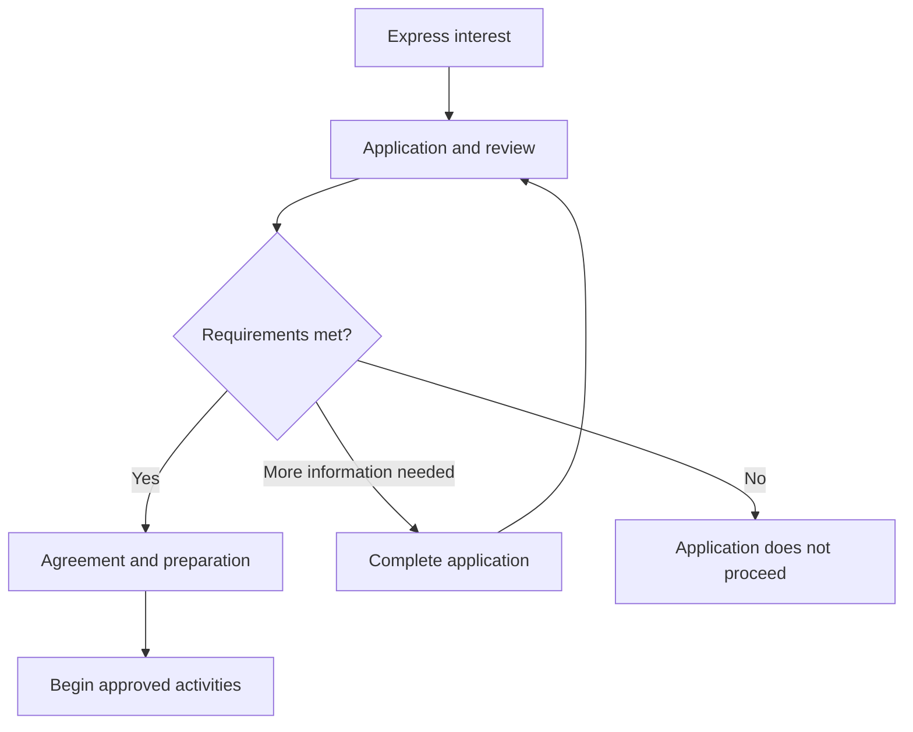
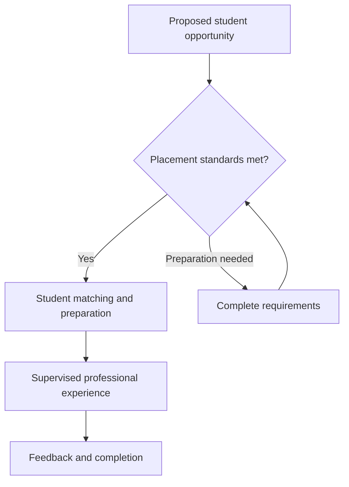

# 👑 RIAH Pathway
# 🤝 Partnership Standards, Requirements & Application Process

RIAH Pathway works with educational institutions, professional firms, businesses, public agencies, and other organizations that support education, meaningful professional experience, and career development.

**Our partners must demonstrate legitimate operations, accountable people, and the ability to fulfill their commitments. Organizations providing student placements must also offer appropriate work, qualified supervision, and a safe professional environment.**

## 📑 Index

| SECTION | TITLE |
|---|---|
| I | 🔑 Emoji Key |
| II | 🛡️ Our Partnership Standards |
| III | 🏫 Schools & Industry Connections |
| IV | 📂 What Applicants Must Provide |
| V | 🔎 The Partnership Application Process |
| VI | 🤝 Requirements for Different Organizations |
| VII | 🎓 Standards for Student Placements |
| VIII | ✍️ Agreements & Getting Started |
| IX | 🔗 Affiliate Links & Partner Benefits |
| X | 🔄 Maintaining an Approved Partnership |
| XI | 📬 Apply to Partner With Us |
| XII | 👑 Public Information & Intellectual Property |

## I. 🔑 Emoji Key

| EMOJI | MEANING |
|---|---|
| 👑 | RIAH Pathway |
| 🤝 | Partnership |
| 🏫 | Education & school connections |
| 📂 | Application documents |
| 🔎 | Verification & review |
| 👥 | People & professional supervision |
| 🎓 | Student experience |
| ⚖️ | Professional qualifications & permitted activities |
| 🛡️ | Safety, privacy & protection |
| 🔗 | Affiliate links & benefits |
| ✅ | Approved |
| ⏳ | Additional information needed |
| 🔄 | Continued participation & renewal |

## II. 🛡️ Our Partnership Standards

We welcome organizations that can demonstrate a clear purpose for working with RIAH Pathway and a commitment to the people they serve.

| STANDARD | WHAT IT MEANS |
|---|---|
| LEGITIMATE ORGANIZATION | Your organization is real, verifiable, and lawfully operating |
| ACCOUNTABLE REPRESENTATIVES | The people representing your organization are identifiable and authorized to make commitments |
| ACTIVE OPERATIONS | Your organization carries out actual business, educational, professional, or public-service activities |
| MEANINGFUL OPPORTUNITIES | Proposed activities offer clear educational, professional, or career value |
| QUALIFIED PEOPLE | Participating professionals have the experience and qualifications needed for their responsibilities |
| RESPECTFUL ENVIRONMENT | Students and participants receive fair treatment, appropriate support, and a professional experience |
| SAFETY & PRIVACY | Your organization protects people, confidential information, and the materials entrusted to it |
| RELIABLE COMMITMENTS | Your organization has the people and resources to deliver what it agrees to provide |

A website, social media page, or business registration alone does not establish eligibility. We consider the organization’s operations, people, proposed activities, and ability to meet the applicable requirements.

**New businesses, startups, and smaller organizations may qualify. Every organization must demonstrate readiness for the activities it proposes.**

## III. 🏫 Schools & Industry Connections

Organizations across all industries may work with RIAH Pathway when their activities support the relevant school, field of study, or professional pathway.

| SCHOOL OR PATHWAY | INDUSTRY CONNECTIONS | EXAMPLES OF APPROPRIATE ACTIVITIES |
|---|---|---|
| SCHOOL OF BUSINESS | All industries | Accounting, finance, management, operations, marketing, and business development |
| SCHOOL OF TECHNOLOGY | All industries, especially software, fintech, and technology | Software development, engineering, data, cybersecurity, and technology services |
| SCHOOL OF HOMELAND SECURITY | All industries, especially security organizations and government agencies | Security, investigations, intelligence, risk management, and compliance |
| SCHOOL OF LAW | All industries with appropriate legal functions, especially courts and law firms | Legal research, court operations, legal administration, and supervised legal work |
| ENTREPRENEURSHIP | All industries | Venture development, market research, business planning, and entrepreneurial experience |
| STARTUPS | All industries, especially software, fintech, and technology | Product development, business operations, applied projects, recruitment, and employment |

The organization’s industry does not determine eligibility by itself. The proposed activities must match the student’s education, qualifications, experience level, and permitted responsibilities.

## IV. 📂 What Applicants Must Provide

Applicants provide information appropriate to their organization and the activities they want to offer.

| REQUIREMENT | WHAT WE ASK FOR |
|---|---|
| ORGANIZATION DETAILS | Legal name, any business or trade name, location, organization type, and contact information |
| PROOF OF LEGITIMACY | Applicable business registration, school recognition, public-agency record, or professional-practice documentation |
| PRIMARY CONTACT | An authorized representative who can discuss the application and make commitments for the organization |
| DESCRIPTION OF OPERATIONS | Information about your services, products, programs, projects, or public responsibilities |
| PROPOSED ACTIVITIES | A clear description of how you want to work with RIAH Pathway |
| PROFESSIONAL QUALIFICATIONS | Relevant experience, credentials, and required licenses of participating professionals |
| AVAILABLE RESOURCES | The people, work, supervision, equipment, and other resources needed to support your proposal |
| RELEVANT BACKGROUND | References and information about relevant professional or regulatory matters |
| PARTICIPANT PROTECTION | Applicable safety, privacy, confidentiality, and insurance or public-entity coverage information |

Requirements reflect the organization’s structure. Courts and government agencies may provide official public records. Sole proprietors, professional practices, and startups provide documentation appropriate to their operations.

We may accept redacted work examples when necessary to protect confidential information. Sensitive documents should be provided through the designated application channel.

## V. 🔎 The Partnership Application Process

| STEP | WHAT TO EXPECT |
|---|---|
| EXPRESS INTEREST | Tell us about your organization and how you would like to work with RIAH Pathway |
| PROVIDE INFORMATION | Submit the requested organization details and supporting documents |
| COMPLETE VERIFICATION | We confirm relevant organizational information, professional qualifications, and authority to participate |
| DISCUSS YOUR PROPOSAL | We discuss your goals, available opportunities, participating professionals, and resources |
| CONFIRM REQUIREMENTS | We determine whether the proposed activities meet our educational, professional, and participant-protection standards |
| RECEIVE A DECISION | We approve the proposed activities, request additional information, or explain why the application cannot proceed |
| COMPLETE THE AGREEMENT | Approved organizations confirm their responsibilities and participation terms in writing |
| GET STARTED | Complete the applicable orientation and preparation before approved activities begin |

**Approval identifies the activities your organization is authorized to provide. Additional activities, student placements, or affiliate participation may require further approval.**

## VI. 🤝 Requirements for Different Organizations

Every applicant meets our shared standards. The additional requirements below reflect the organization’s work and the opportunities it proposes.

| ORGANIZATION | WHAT WE REQUIRE | WAYS TO WORK WITH RIAH PATHWAY |
|---|---|---|
| LAW FIRMS | A verifiable practice, appropriately licensed attorneys, professional standing, confidentiality, and qualified supervision | Legal Experiential, legal education, and qualified adjunct opportunities |
| COURTS | Official court identification, permission to participate, appropriate supervision, and compliance with court requirements | Approved court experience and opportunities involving attorneys, judges, and court professionals |
| HIGH SCHOOLS | Recognized school or district authority, student safeguards, and approval of proposed educational arrangements | Experiential, dual enrollment, college credit, and certification review |
| COLLEGES | Verifiable institutional authority, accurate accreditation information where claimed, and an authorized academic contact | Experiential and certification review opportunities |
| UNIVERSITIES | Verifiable institutional authority, accurate accreditation information where claimed, and approval of proposed activities | Educational collaboration and Experiential opportunities |
| COMMUNITY COLLEGES | Institutional verification and clear written terms for any proposed transfer arrangements | Connections to bachelor’s programs |
| MBA SCHOOLS | A verifiable program, appropriate student eligibility, and qualified management professionals | Management, Manager, and Executive Experiential |
| LAW SCHOOLS | Verifiable program status, appropriate student eligibility, and qualified legal supervision | Legal Experiential with attorneys and judges |
| CPA FIRMS | Required firm permissions, appropriately licensed CPAs, professional standing, and protection of client information | Accounting and finance Experiential, education, and qualified adjunct opportunities |
| MANAGED SECURITY SERVICE PROVIDERS — MSSPS | Verifiable security services, qualified professionals, permission to perform the proposed work, and protection of confidential information | Cybersecurity Experiential and education |
| TRAINING PROVIDERS | Qualified instructors, accurate descriptions of training, permission to use materials, and appropriate resources | Approved Experiential collaboration |
| DEVELOPMENT FIRMS | Active projects, experienced technical professionals, permission to use project materials, and appropriate work review | Software development and engineering Experiential and education |
| CERTIFICATION PROVIDERS | Verified authority to issue or support the relevant certification and clear terms for materials, vouchers, or discounts | Curriculum connections, student vouchers, and discounts |
| STARTUPS | Identifiable founders, legitimate operations, active work, available resources, and qualified supervision | Experiential, applied experience, recruitment, and employment |
| SMALL BUSINESSES | Verifiable ownership, lawful operations, required licenses, and sufficient work and supervision | Experiential, applied experience, recruitment, and employment |
| ENTREPRENEURSHIP VENTURES | Identifiable operators, active venture activities, qualified mentors, and permission to use relevant project materials | Venture development and entrepreneurship connections |
| EMPLOYERS | A verifiable employing organization, authorized recruitment contacts, legitimate opportunities, and appropriate working conditions | Experiential, recruitment, hiring, and employment |

Government agencies, security organizations, and nonprofits provide evidence appropriate to their public, professional, or organizational responsibilities. Any required licenses, clearances, or permissions must be in place before the relevant activities begin.

Professionals interested in faculty roles must also meet the applicable faculty requirements.

## VII. 🎓 Standards for Student Placements

**Student placements must provide real professional work, appropriate learning, and support from qualified people.**

| REQUIREMENT | WHAT STUDENTS SHOULD EXPECT |
|---|---|
| REAL WORK | Assignments that contribute to actual organizational or professional needs |
| APPROPRIATE RESPONSIBILITIES | Work suited to their field, education, qualifications, and experience level |
| QUALIFIED SUPERVISION | An identified Manager, qualified Supervisor, and independent Reviewer |
| CLEAR EXPECTATIONS | Written information about duties, schedule, location or remote format, duration, and compensation status |
| EDUCATIONAL CONNECTION | Work connected to applicable learning objectives, curriculum, and assessment |
| REGULAR FEEDBACK | Professional guidance and documented review of progress and work |
| SAFE PARTICIPATION | Appropriate working conditions, accessibility, confidentiality, and access to necessary resources |
| PERMITTED ACTIVITIES | Responsibilities within the student’s qualifications and any applicable professional restrictions |
| SUPPORT | Clear contacts for questions, concerns, and placement assistance |
| DOCUMENTED COMPLETION | Records of work, feedback, progress, and completed requirements |

Organizations must have enough work, qualified supervision, and resources for the students they host. AI tools may support approved activities, but qualified people remain responsible for supervision and professional review.

Compensation terms are disclosed before participation. Paid and unpaid arrangements must meet applicable requirements.

International Online Students residing outside the United States participate remotely and unpaid under RIAH policy, subject to applicable country-of-residence requirements. Students physically in the United States receive a separate review of any required work authorization.

Recruiting organizations follow RIAH Pathway’s blind review standards. Approved work and skills evidence are reviewed before identity disclosure at the offer stage, with required legal or placement identity checks handled through restricted processes.

**A student placement does not guarantee permanent employment, a particular employer or salary, professional licensure, or bar eligibility.**

## VIII. ✍️ Agreements & Getting Started

An approved partnership begins with written terms that explain what each organization will provide and how participants will be supported.

| AGREEMENT AREA | WHAT IS EXPLAINED |
|---|---|
| APPROVED ACTIVITIES | The work, educational connections, or opportunities covered by the partnership |
| RESPONSIBILITIES | What the organization and RIAH Pathway agree to provide |
| STUDENT PARTICIPATION | Supervision, expectations, compensation terms, and performance review where applicable |
| PRIVACY & CONFIDENTIALITY | How information and participant privacy will be protected |
| MATERIALS & STUDENT WORK | Ownership and permitted use of materials, work products, and portfolio examples |
| BENEFITS & AFFILIATE PARTICIPATION | Who is eligible and which terms apply |
| PUBLIC COMMUNICATION | Accurate descriptions of the relationship and approved use of names and materials |
| CONTINUED PARTICIPATION | Renewal, changes, concerns, and circumstances that may end the relationship |

Getting started may include orientation, introductions to participating professionals, preparation for students, and confirmation of support contacts.

## IX. 🔗 Affiliate Links & Partner Benefits

Approved partners receive an assigned affiliate link and QR code after completing the applicable authorization and participation requirements.

These links help people explore RIAH Pathway and allow eligible referral activity to be attributed to the approved participant.

| FEATURE | PUBLIC PARTICIPATION STANDARD |
|---|---|
| ASSIGNED LINK | Connected to an approved partner or participant |
| AVAILABLE INFORMATION | May direct people to education, Experiential, certification review, bar review, products, and services |
| VERIFIED REFERRALS | Eligible activity and milestones must be confirmed before benefits are awarded |
| ELIGIBLE PARTICIPANTS | Partner Employees and Partner Affiliates meet their respective participation requirements |
| ACCURATE INFORMATION | Participants use approved materials and truthful descriptions of RIAH Pathway |
| BENEFIT DISCLOSURE | Applicable benefit connections are clearly disclosed |
| AUTHORIZED PARTICIPATION | Public agencies, courts, and educational institutions confirm permission to participate |

**An affiliate link does not provide access to student records or authorize an organization to host student placements.**

Eligible benefits follow the governing program and partnership terms.

| BENEFIT | APPLICABLE LIMIT OR REQUIREMENT |
|---|---|
| AMBASSADOR COMPONENT | Up to 25%; participation in multiple categories does not increase this cap |
| ELIGIBLE COMPLETION BENEFIT | 10% guaranteed after qualifying completion |
| ADDITIONAL REIMBURSEMENT | Up to 15% through qualifying milestones |
| TOTAL ELIGIBLE REIMBURSEMENT | Up to 50%, subject to applicable requirements |
| PRODUCT DISCOUNT | Up to 25% under the separate verified purchase-attribution rules |
| PAYING STUDENT REFERRAL | Does not automatically produce a 25% benefit |

## X. 🔄 Maintaining an Approved Partnership

Approved partners continue to meet the standards associated with their activities.

| REQUIREMENT | PARTNER COMMITMENT |
|---|---|
| CURRENT INFORMATION | Keep organization details, contacts, qualifications, and required coverage current |
| RELIABLE PARTICIPATION | Provide the agreed activities, resources, and professional support |
| QUALITY EXPERIENCES | Maintain meaningful opportunities and timely feedback |
| RESPECTFUL TREATMENT | Support a professional environment where concerns can be raised |
| NOTIFICATION OF CHANGES | Report changes that affect approved activities or the ability to fulfill commitments |
| COOPERATION | Participate in reviews and address identified concerns |
| RENEWAL | Complete periodic verification and annual partnership review |

RIAH Pathway may request improvements, limit activities, suspend participation, or end a partnership when requirements are no longer met. When a student placement is affected, we coordinate appropriate support and next steps.

## XI. 📬 Apply to Partner With Us

**Tell us about your organization, the opportunities you can provide, and how you would like to work with RIAH Pathway.**

| NEXT STEP | WHERE TO GO |
|---|---|
| EXPLORE ORGANIZATIONAL OPPORTUNITIES | Join Us → Partnerships |
| SUBMIT A PARTNERSHIP INQUIRY | Contact → Partnerships & Organizations |
| LEARN ABOUT STUDENT PLACEMENTS | Experiential |
| EXPLORE RECRUITMENT OPPORTUNITIES | Student Life → Career Opportunities & Employer Engagement |
| REVIEW AVAILABLE BENEFITS | Partner Benefits Guide |

We review each proposal according to the organization’s activities and the requirements that apply. Participation begins after the necessary approval, agreement, and preparation are complete.

## XII. 👑 Public Information & Intellectual Property

RIAH Pathway publishes information so prospective students, employees, partners, and the public can understand our programs, opportunities, requirements, and participation terms.

This includes information about curriculum, website structure, tuition, pricing, employment opportunities, equity arrangements, and partnership standards.

**Public availability does not grant permission to copy, adapt, republish, commercialize, or build another organization’s materials or offerings from RIAH Pathway’s protected content.**

Use of protected RIAH Pathway materials is governed by the applicable repository license, published terms, and any written permission or agreement. Approved partners may use materials only within the permissions granted to them.

### Board Governance, Contributions & Financial Transparency

RIAH Pathway’s Board oversees three divisions: **Corporate (Ecosystem Corporation), Institutional (Education, Experiential Programs, and Products), and Foundation (Accreditation and State Authorization).**

**Board Members:** Founder and Chairman, President, Vice President, Secretary, independent CPA Treasurer, and independent Attorney-at-Law Trustee.

**Financial Responsibilities:**
- **CPA Treasurer & Attorney Trustee:** Manage accreditation funding, donations, state authorization fees, and the monthly contribution pool.
- **Contribution Pool:** 168 internal team members, expanding to 2,168 participants at scale, including 2,000 JD and non-JD supervisors.
- **Fund Allocation:** Legal, marketing, advertising, accreditation, state authorization, technology, and operational expenses.
- **Escrow:** Monthly contributions held in escrow and distributed with Board authorization, including the Chairman.

**Meetings & Transparency:**
- Monthly Board financial reviews and quarterly formal Board meetings.
- Executive Team attends Board meetings, receives meeting minutes, and distributes financial reports to internal team members.
- Equity holders and future investors receive contribution, donation, accreditation, and expenditure reports.
- Internal audits conducted internally; independent external CPA firm audits Corporate, Institutional, and Foundation operations.

**Purpose:** Independent financial oversight, conflict-of-interest prevention, and transparency regarding how contributions are collected, authorized, and distributed.
