# RIAH PATHWAY
## Equity Contribution Pool & Founder Commitment
### Pre-Beta Internal Team Recruitment | Financial Transparency

[VIDEO: Founder Mariah Dominique Rucker Introduction, Mission, Vision & RIAH Pathway Ecosystem Goals — Embedded Video Player Featuring the Founder Introducing Herself, Sharing Her Background and Personal Journey, Explaining Her Mission and Vision, Outlining the Goals of the RIAH Pathway Ecosystem, and Discussing Her Commitment to Building the Organization]

[IMAGE: RIAH Pathway Equity Contribution Pool Recruitment Flyer — Red, Black, White, and Gold Branding]

[BUTTON: Apply for Internal Equity Team]

[BUTTON: View Compensation, Equity & Benefits]

[INTERNAL ROUTE: Apply for Internal Equity Team → 17.4.9 — Apply to Join RIAH Pathway → Breezy HR Application (Institutional URL to Configure)]

[DOWNLOAD ROUTE: View Compensation, Equity & Benefits → ./COMPENSATION-EQUITY-BENEFITS.md]

[INTERNAL LINK: Meet the Founder & Leadership → 2.3 — Leadership]

[INTERNAL LINK: Explore Join Our Team → 17.4 — Join Our Team]

[EXTERNAL LINK: Founder GitHub Professional Profile → https://github.com/mariahdominiquerucker]

[EXTERNAL LINK: Founder LinkedIn Professional Profile → https://linkedin.com/in/mariahrucker]

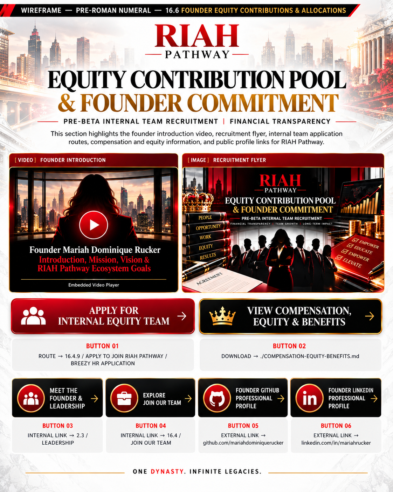

---

# I. 💰 EQUITY CONTRIBUTION STRUCTURE

The 48 Pre-Beta internal equity team members collectively contribute toward the $300,000 annual pool before organizational expansion and experiential professional hiring.

## Contribution Structure

| Category | Pre-Beta | Full Scale | Markdown |
|---|---:|---:|---|
| Total Equity-Bearing Contribution Pool Participants | 48 | **2,168** | [At-Scale Staffing & Equity Structure](./DOWNLOADS/RIAH-PATHWAY-AT-SCALE-STAFFING-ASSIGNMENT-EQUITY-STRUCTURE.md) · [Equity & Four-Year Vesting](./DOWNLOADS/EQUITY-AND-FOUR-YEAR-VESTING-TABLE.md) |
| Fixed Internal Equity Team Members | 48 | **168** (48 Pre-Beta + 120 core Experiential) | [At-Scale Staffing & Equity Structure](./DOWNLOADS/RIAH-PATHWAY-AT-SCALE-STAFFING-ASSIGNMENT-EQUITY-STRUCTURE.md) |
| JD / Non-JD Attorney & Judge Supervisors (Separate Equity Group) | 0 | **2,000** | [At-Scale Staffing & Equity Structure](./DOWNLOADS/RIAH-PATHWAY-AT-SCALE-STAFFING-ASSIGNMENT-EQUITY-STRUCTURE.md) |
| Annual Contribution Pool | $300,000 | **$2,400,000** | [At-Scale Staffing & Equity Structure](./DOWNLOADS/RIAH-PATHWAY-AT-SCALE-STAFFING-ASSIGNMENT-EQUITY-STRUCTURE.md) |
| Annual Contribution Per Participant | $6,250.00 | **Approximately $1,107.01** | [At-Scale Staffing & Equity Structure](./DOWNLOADS/RIAH-PATHWAY-AT-SCALE-STAFFING-ASSIGNMENT-EQUITY-STRUCTURE.md) |
| Monthly Contribution Per Participant | $520.83 | **Approximately $92.25** | [At-Scale Staffing & Equity Structure](./DOWNLOADS/RIAH-PATHWAY-AT-SCALE-STAFFING-ASSIGNMENT-EQUITY-STRUCTURE.md) |
| Monthly Due Date | 15th | 15th | [At-Scale Staffing & Equity Structure](./DOWNLOADS/RIAH-PATHWAY-AT-SCALE-STAFFING-ASSIGNMENT-EQUITY-STRUCTURE.md) |

**Full-scale contribution-pool clarification:** The 2,168 equity-bearing contributors comprise **168 fixed internal team members** (48 Pre-Beta + 120 core Experiential Professionals) plus **2,000 separately allocated JD/Non-JD attorney and judge supervisors**. The projected **$2,400,000 annual pool** equals approximately **$1,107.01 annually / $92.25 monthly per person** at full participation; contributions are calculated and reconciled to approved budgets and actual participation so rounding does not change the total. The **168 fixed internal positions remain a distinct staffing count** and are not replaced by the larger contribution-pool participation total.

## Contribution Pool Allocations

| Category | Allocation Purpose | Markdown |
|---|---|---|
| Accreditation | Accreditation applications, reviews, and fees | [At-Scale Staffing & Equity Structure](./DOWNLOADS/RIAH-PATHWAY-AT-SCALE-STAFFING-ASSIGNMENT-EQUITY-STRUCTURE.md) |
| State Authorization | State authorization applications and fees | [At-Scale Staffing & Equity Structure](./DOWNLOADS/RIAH-PATHWAY-AT-SCALE-STAFFING-ASSIGNMENT-EQUITY-STRUCTURE.md) |
| Marketing | Branding, outreach, and student recruitment | [At-Scale Staffing & Equity Structure](./DOWNLOADS/RIAH-PATHWAY-AT-SCALE-STAFFING-ASSIGNMENT-EQUITY-STRUCTURE.md) |
| Advertising | Paid advertising and enrollment campaigns | [At-Scale Staffing & Equity Structure](./DOWNLOADS/RIAH-PATHWAY-AT-SCALE-STAFFING-ASSIGNMENT-EQUITY-STRUCTURE.md) |
| Legal Fees & Registration | Business registrations, filings, and fees | [At-Scale Staffing & Equity Structure](./DOWNLOADS/RIAH-PATHWAY-AT-SCALE-STAFFING-ASSIGNMENT-EQUITY-STRUCTURE.md) |
| Operating Costs | Business administration and operating expenses | [At-Scale Staffing & Equity Structure](./DOWNLOADS/RIAH-PATHWAY-AT-SCALE-STAFFING-ASSIGNMENT-EQUITY-STRUCTURE.md) |
| Technology | Software, applications, infrastructure, and tech stack subscriptions | [At-Scale Staffing & Equity Structure](./DOWNLOADS/RIAH-PATHWAY-AT-SCALE-STAFFING-ASSIGNMENT-EQUITY-STRUCTURE.md) |
| Founder Living Expenses | $1,500 monthly essential living expense allocation | [Founder Monthly Allocation](#ii--founder-monthly-living-expenses) |

[IMAGE: Contribution Pool Allocation Infographic — Illustrate the $300,000 Annual Pool, 48 Internal Equity Team Members, and Eight Funding Categories Using Icons]

[FLOW DIAGRAM: 48 Pre-Beta Equity Team Members → $300,000 Annual Contribution Pool → Approved Organizational Expenses → Pre-Beta Development → Beta Cohort Launch]

[BUTTON: View Accreditation & Authorization → INTERNAL ROUTE 16]

[BUTTON: Explore State Authorization → INTERNAL ROUTE 16.5]

[BUTTON: Review Equity & Four-Year Vesting → DOWNLOAD ./EQUITY-AND-FOUR-YEAR-VESTING-TABLE.md]

[INTERNAL LINK: Explore Internal Equity Team Positions → 17.4 — Join Our Team]

[DOWNLOAD: Contribution Pool & Founder Allocation Summary → ./FOUNDER-EQUITY-CONTRIBUTIONS-ALLOCATIONS.md — Current Markdown Wireframe]

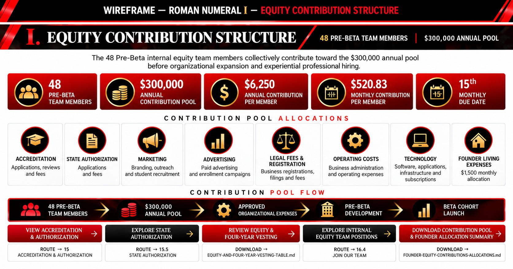

---

# II. 🏠 FOUNDER MONTHLY LIVING EXPENSES

The Founder currently lives with family after relocating back to Cleveland, Ohio from Las Vegas, Nevada while dedicating 40+ hours weekly to building RIAH Pathway.

Current rent is $0. The Founder may need to leave the family residence within the short timeframe is searching for a studio or one-bedroom apartment for $800 or less monthly.

Housing and food are the immediate priorities for maintaining a secure, private working environment during full-time ecosystem development.

## Monthly Living Expense Allocation

| Expense | Monthly Allocation Amount |
|---|---:|
| Studio or One-Bedroom Apartment Rent | $800 |
| Wi-Fi Hotspot | $40 |
| Phone Bill | $25 |
| Gas & Electricity | $135 |
| Food & Groceries | $300 |
| Hygiene | $50 |
| Toiletries | $50 |
| Transportation (Monthly Bus Pass) | $100 |
| **Total Monthly Allocation** | **$1,500** |
| **Annual Allocation (12 Months)** | **$18,000** |

The Founder previously sold their vehicle and relies on public bus transportation.

The monthly allocation ensures essential living expenses while the Founder continues building RIAH Pathway.

**Monthly Distribution Date: 1st of Each Month**

[IMAGE: Founder Monthly Living Expense Infographic — Display Housing, Utilities, Wi-Fi, Phone, Food, Hygiene, Toiletries, and Transportation Using Individual Icons and Dollar Amounts]

[FLOW DIAGRAM: $1,500 Monthly Allocation → Housing + Utilities + Food + Hygiene + Transportation → Essential Living Expenses]

[BUTTON: Review Financial Oversight & Allocation → ON-PAGE SECTION V]

[INTERNAL LINK: Board & Governance → 2.4 — Board & Governance]

[DOWNLOAD: Founder Monthly Living Expense Allocation → Downloadable Allocation Summary — File to Attach; Amounts Must Match Section II]

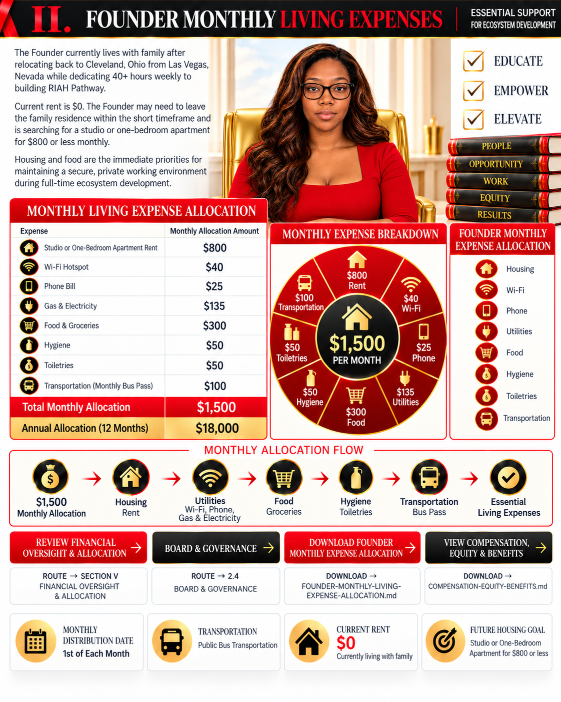

---

# III. 📚 EMPLOYMENT & STATE LICENSING VERIFICATION

The Founder has already been hired by Renhill Group for Substitute Teaching within participating Cleveland, Ohio school districts.

The Founder has completed the requirements set forth by the State of Ohio Board of Education.

The State of Ohio State Board of Education — Office of Educator Licensure and Effectiveness has approved its portion of the application.

Final licensing approval remains with the State of Ohio State Board of Education — Office of Professional Conduct, Licensing Division.

## Employment & Licensing Status

| Category | Status |
|---|---|
| Employer | Renhill Group |
| Position | Substitute Teaching |
| Location | Cleveland, Ohio School Districts |
| Employment Hiring | Confirmed |
| Office of Educator Licensure and Effectiveness | Approved |
| Office of Professional Conduct, Licensing Division | Pending Final Approval |
| Daytime Employment | Substitute Teaching Once Licensed |
| Evenings & Nights | RIAH Pathway Development |
| Weekends | RIAH Pathway Development |
| Federal Holidays | RIAH Pathway Development |
| School Off Days | RIAH Pathway Development |
| Weather Days | RIAH Pathway Development |

The Founder will continue developing RIAH Pathway while awaiting final licensing approval.

## Supporting Documentation

| Screenshot | Documentation | Screenshot Image & Link |
|---|---|---|
| Screenshot 1 | Renhill Group — Substitute Teaching Hiring Confirmation Email | [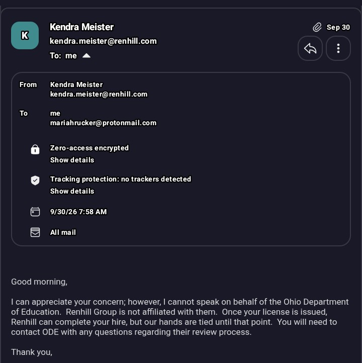](./IMAGES/SCREENSHOT-1.jpg) |
| Screenshot 2 | State of Ohio State Board of Education — Office of Professional Conduct, Licensing Division — Delay Status Email | [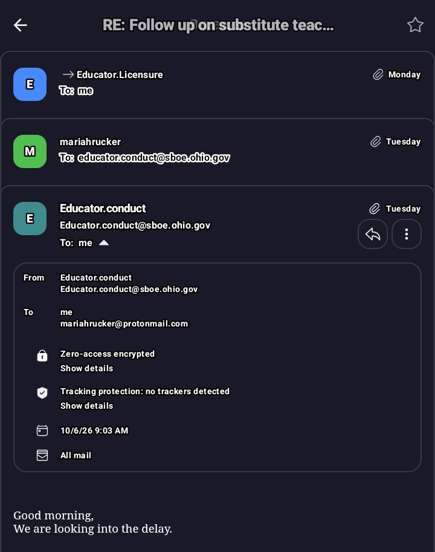](./IMAGES/SCREENSHOT-2.jpg) |
| Screenshot 3 | Founder Response to State of Ohio Licensing Email | [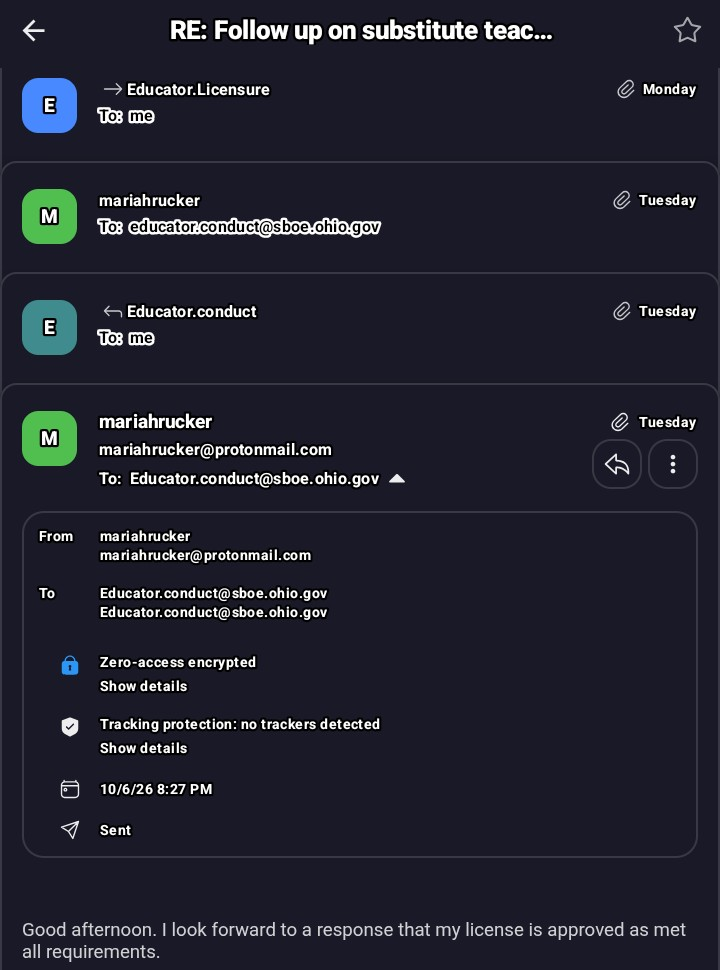](./IMAGES/SCREENSHOT-3.png) |
| Screenshot 4 | State of Ohio State Board of Education — Office of Educator Licensure and Effectiveness — Approval Confirmation Email | [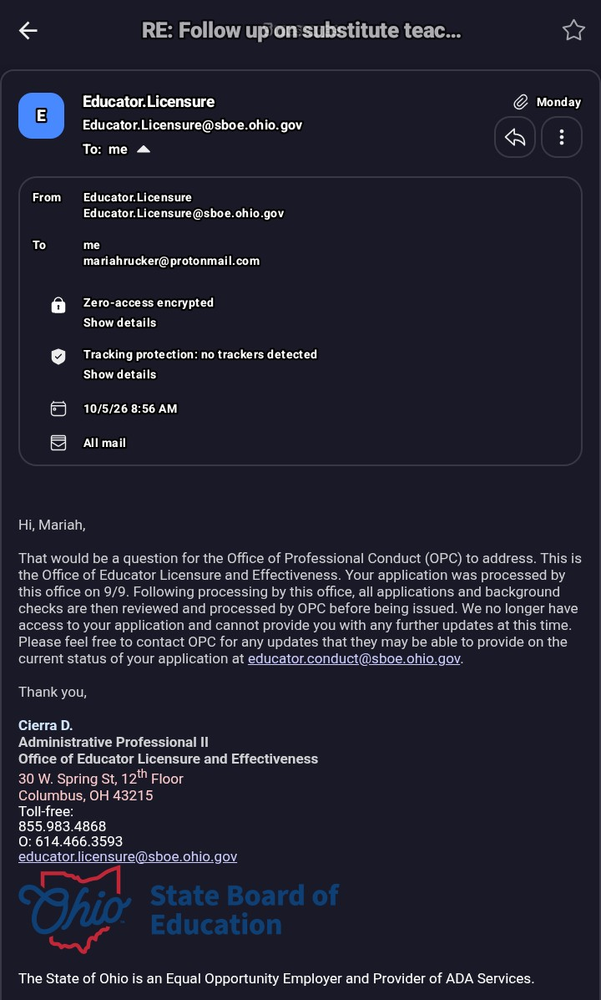](./IMAGES/SCREENSHOT-4.jpg) |

[IMAGE: Employment & Licensing Verification — Four Screenshot Placeholders Arranged in a Two-Column Grid With Numbered Captions]

[SCREENSHOT 1: Insert Renhill Group Hiring Confirmation Email]

[SCREENSHOT 2: Insert State of Ohio Licensing Delay Email]

[SCREENSHOT 3: Insert Founder Response to Licensing Email]

[SCREENSHOT 4: Insert Office of Educator Licensure and Effectiveness Approval Email]

[NOTE: Redact Personal Identification Numbers, Private Contact Information, and Other Sensitive Details Before Publishing Screenshots]

[FLOW DIAGRAM: Renhill Hiring Confirmation → Educator Licensure Office Approval → Professional Conduct Review → Final License Approval → Daytime Substitute Teaching]

[BUTTON: Review Employment & Licensing Verification → ON-PAGE SECTION III — Supporting Documentation]

[DOWNLOAD: Employment & Licensing Verification Packet → Redacted PDF or ZIP — File to Attach; Do Not Publish Unredacted Screenshots]

[INTERNAL LINK: About Founder & Leadership → 2.3 — Leadership]

[EXTERNAL LINK: Founder Professional Profile → https://linkedin.com/in/mariahrucker]

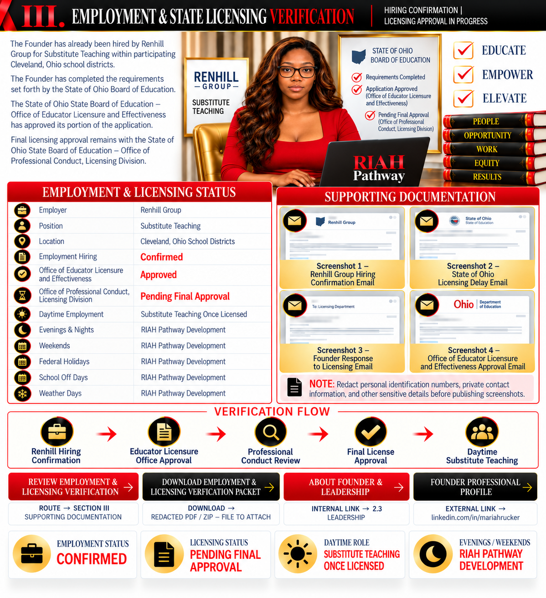

---

# IV. 👑 FOUNDER CONTRIBUTIONS & RESPONSIBILITIES

The Founder contributes leadership, professional skills, management, hiring, technology planning, and full-time ecosystem development.

## Founder Responsibilities

| Category | Commitment | Markdown |
|---|---|---|
| Full-Time Development | 40+ Hours Weekly Building RIAH Pathway | [All Positions Combined](./DOWNLOADS/ALL-POSITIONS-COMBINED.md) |
| Leadership & Management | Organizational Strategy, Operations, Hiring, and Team Management | [All Positions Combined](./DOWNLOADS/ALL-POSITIONS-COMBINED.md) |
| Professional Contributions | Time, Skills, Technology Planning, and Ecosystem Development | [All Positions Combined](./DOWNLOADS/ALL-POSITIONS-COMBINED.md) |
| Housing | Secure a Studio or One-Bedroom Apartment for $800 or Less | — |
| Living Expenses | Maintain a $1,500 Monthly Allocation | — |
| Transportation | Public Bus Transportation | — |
| Daytime Employment | Substitute Teaching Once Licensed | — |
| Evenings & Nights | RIAH Pathway Development After Teaching Assignments | — |
| Weekends & Non-Teaching Days | Full-Time Ecosystem Development | — |
| Beta Cohort | Increase Cohort Management as Enrollment and Revenue Grow | [At-Scale Staffing & Equity Structure](./DOWNLOADS/RIAH-PATHWAY-AT-SCALE-STAFFING-ASSIGNMENT-EQUITY-STRUCTURE.md) |
| Team Equity | Approved Equity Ownership and Vesting Structure | [Equity & Four-Year Vesting](./DOWNLOADS/EQUITY-AND-FOUR-YEAR-VESTING-TABLE.md) · [At-Scale Staffing & Equity Structure](./DOWNLOADS/RIAH-PATHWAY-AT-SCALE-STAFFING-ASSIGNMENT-EQUITY-STRUCTURE.md) |
| Team Compensation | Established Compensation Structure | [Compensation, Equity & Benefits](./DOWNLOADS/COMPENSATION-EQUITY-BENEFITS.md) |
| Employee Benefits | 100% of Planned Benefits Package Upon Financial Sustainability | [Compensation, Equity & Benefits](./DOWNLOADS/COMPENSATION-EQUITY-BENEFITS.md) |

[IMAGE: Founder Contributions & Responsibilities — Eight Icon Cards Representing Leadership, Management, Technology, Hiring, Development, Employment, Equity, and Benefits]

## Founder Development Schedule

[FLOW DIAGRAM: Daytime Substitute Teaching → Evening & Nighttime RIAH Pathway Development → Weekend & School Off-Day Development → Beta Cohort Launch → Increased Cohort Management]

[BUTTON: View Compensation, Equity & Benefits → DOWNLOAD ./COMPENSATION-EQUITY-BENEFITS.md]

[BUTTON: Review Equity Vesting Terms → DOWNLOAD ./EQUITY-AND-FOUR-YEAR-VESTING-TABLE.md]

[BUTTON: Explore Career Opportunities → INTERNAL ROUTE 17.4 — Join Our Team]

[INTERNAL LINK: Executive Leadership Opportunities → 17.4.1 — Executive]

[DOWNLOAD: Internal Team Compensation, Equity & Benefits → ./COMPENSATION-EQUITY-BENEFITS.md]

### Internal Equity Team and Contributor Benefits

Eligible internal Team Members receive **$0 eligible RIAH Pathway tuition and 50% off eligible products** while meeting applicable daily, weekly, and monthly responsibility, performance, and contribution requirements. Team Member tuition / product benefits are separate from student tuition reimbursement.

Eligible Education and Experiential participants who qualify through program completion receive a guaranteed **10% completion tuition reimbursement**. Verified contributor / Ambassador milestones may add **up to 25%**, and additional approved reimbursement milestones may add **up to 15%**, for **up to 50% total** (10% + 25% + 15%). The 50% maximum must be earned; verification, non-stacking rules, and the eligible tuition reimbursement basis apply.

[BUTTON: Review Contributor Benefits & Team Eligibility → INTERNAL REFERENCE ../../RIAH-PATHWAY-CONTRIBUTOR-BENEFITS-STRUCTURE/README.md]
[BUTTON: Explore Student Admissions & Reimbursement → INTERNAL ROUTES 11; 13.17]
[BUTTON: Compare Education & Experiential Tuition → INTERNAL ROUTE 13]
[DOWNLOAD: Contributor Benefits Master → ../../RIAH-PATHWAY-CONTRIBUTOR-BENEFITS-STRUCTURE/README.md]
[DOWNLOAD: Team Member Requirements → ../../RIAH-PATHWAY-CONTRIBUTOR-BENEFITS-STRUCTURE/TEAM-MEMBERS.md]
[DOWNLOAD: Compensation, Equity & Benefits → ./DOWNLOADS/COMPENSATION-EQUITY-BENEFITS.md]
[INTERNAL LINK: Admissions Main Wireframe → ../12.%20ADMISSIONS/ADMISSIONS-WIREFRAME-MAIN.md]
[INTERNAL LINK: Join Our Team → 17.4]

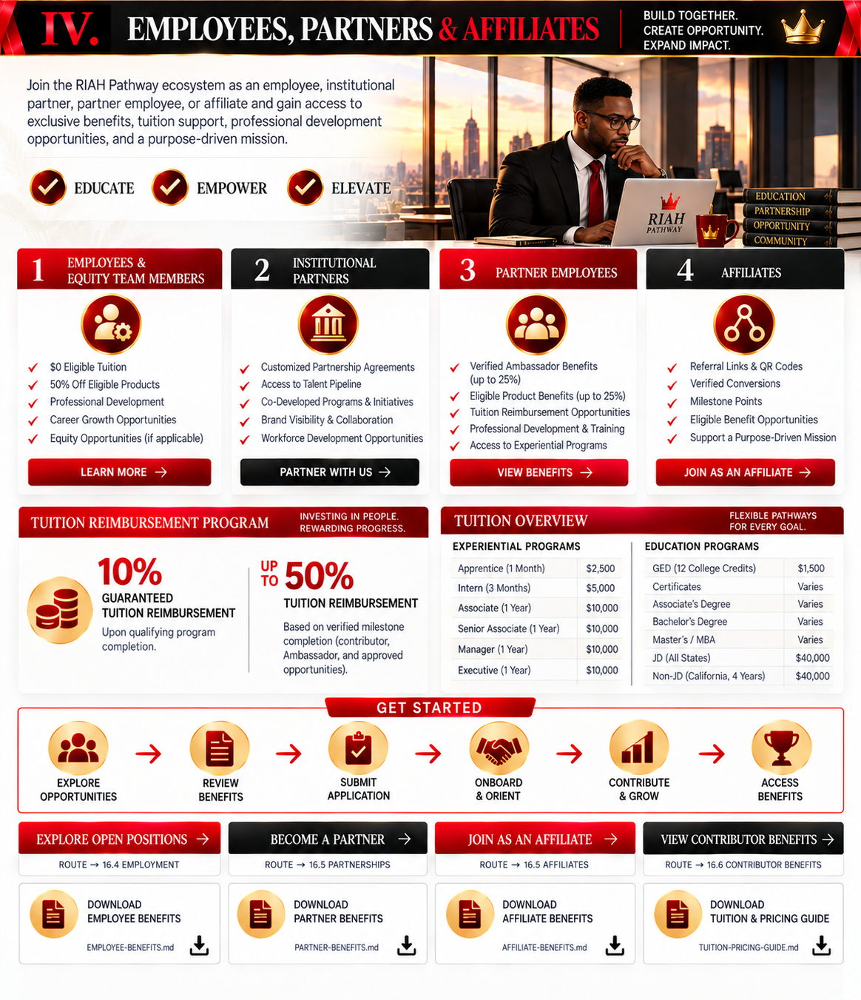

---

# V. ⚖️ FINANCIAL OVERSIGHT & ALLOCATION

## Annual Contribution Pool Allocation

| Category | Allocation | Markdown |
|---|---:|---|
| Pre-Beta Equity Team Members | 48 | [At-Scale Staffing & Equity Structure](./DOWNLOADS/RIAH-PATHWAY-AT-SCALE-STAFFING-ASSIGNMENT-EQUITY-STRUCTURE.md) |
| Annual Equity Contribution Pool | $300,000 | [At-Scale Staffing & Equity Structure](./DOWNLOADS/RIAH-PATHWAY-AT-SCALE-STAFFING-ASSIGNMENT-EQUITY-STRUCTURE.md) |
| Founder Monthly Allocation | $1,500 | — |
| Founder Annual Allocation | $18,000 | — |
| Founder Allocation Percentage | 6% | — |
| Remaining Organizational Funds | $282,000 | [At-Scale Staffing & Equity Structure](./DOWNLOADS/RIAH-PATHWAY-AT-SCALE-STAFFING-ASSIGNMENT-EQUITY-STRUCTURE.md) |
| Financial Oversight | Board, CPA & Attorney | — |
| Monthly Distribution Date | 1st of Each Month | — |
| Allocation Purpose | Housing, Utilities, Phone, Wi-Fi, Food, Hygiene, Toiletries & Transportation | [At-Scale Staffing & Equity Structure](./DOWNLOADS/RIAH-PATHWAY-AT-SCALE-STAFFING-ASSIGNMENT-EQUITY-STRUCTURE.md) |

The $18,000 annual Founder allocation is included within the $300,000 Pre-Beta equity contribution pool.

The remaining $282,000 is allocated toward organizational operations and development.

The Board, CPA, and Attorney oversee monthly allocations, authorization, documentation, and financial compliance.

## Financial Allocation Overview

[IMAGE: Annual Contribution Pool Allocation — Donut Chart Displaying 6% Founder Living Expenses ($18,000) and 94% Organizational Expenses ($282,000)]

[FLOW DIAGRAM: $300,000 Annual Contribution Pool → $18,000 Founder Living Expenses + $282,000 Organizational Expenses]

[FLOW DIAGRAM: Monthly Allocation Approval → Board, CPA & Attorney Oversight → $1,500 Distribution on the 1st of Each Month → Documented Expenses]

[BUTTON: Review Board & Governance → INTERNAL ROUTE 2.4]

[BUTTON: View Accreditation & Authorization → INTERNAL ROUTE 16]

[INTERNAL LINK: Organizational Policies → 18.8 — Policies]

[DOWNLOAD: Founder Equity Contribution Pool & Allocations → ./FOUNDER-EQUITY-CONTRIBUTIONS-ALLOCATIONS.md — Current Markdown Wireframe]

[DOWNLOAD: Equity & Four-Year Vesting Table → ./EQUITY-AND-FOUR-YEAR-VESTING-TABLE.md]

### Financial Oversight and Verified Tuition Benefit Separation

The Founder contribution allocation and organizational contribution pool above are **separate** from student completion / milestone tuition reimbursement and conditional Team Member benefits. Eligible Education and Experiential participants who qualify through program completion receive a guaranteed **10% completion tuition reimbursement**. Verified contributor / Ambassador milestones may add **up to 25%**, and additional approved reimbursement milestones may add **up to 15%**, for **up to 50% total** (10% + 25% + 15%). The 50% maximum must be earned; verification, non-stacking rules, and the eligible tuition reimbursement basis apply.

[BUTTON: Verify Contributor Reimbursement Milestones → INTERNAL REFERENCE ../../RIAH-PATHWAY-CONTRIBUTOR-BENEFITS-STRUCTURE/README.md]
[BUTTON: Explore Tuition Reimbursement → INTERNAL ROUTE 13.17]
[INTERNAL LINK: Admissions and Student Tuition Resources → 12 — Admissions]
[DOWNLOAD: Verified Contributor Milestone Rules → ../../RIAH-PATHWAY-CONTRIBUTOR-BENEFITS-STRUCTURE/README.md]

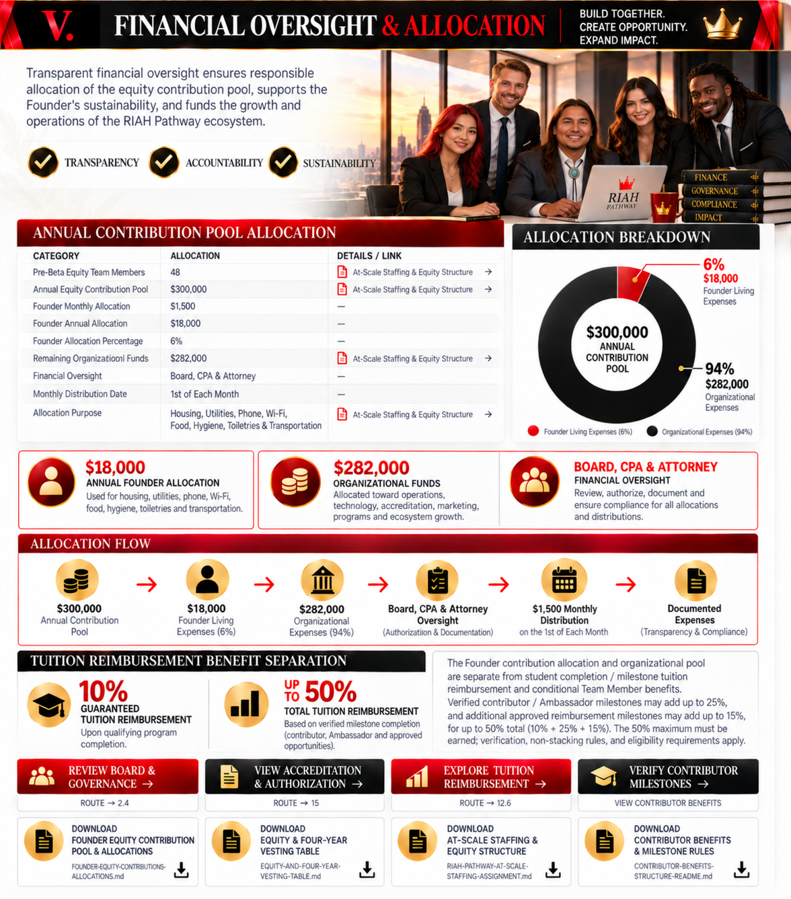

---

# VI. 📈 PRE-BETA FUNDING, REVENUE & TEAM EXPANSION

The initial 48 professionals form the Pre-Beta internal equity team responsible for organizational development, recruitment, technology, academic preparation, operations, and the Beta cohort launch.

Experiential professionals will be hired after the Beta cohort launches. Hiring quantities will be determined by student deposits, enrollment volume, program requirements, and staffing needs.

## Pre-Beta Funding & Revenue Structure

| Category | Purpose | Markdown |
|---|---|---|
| Pre-Beta Internal Team | Initial 48 Internal Equity Team Members | [At-Scale Staffing & Equity Structure](./DOWNLOADS/RIAH-PATHWAY-AT-SCALE-STAFFING-ASSIGNMENT-EQUITY-STRUCTURE.md) · [All Positions Combined](./DOWNLOADS/ALL-POSITIONS-COMBINED.md) |
| Equity Contributions | Fund Pre-Beta Organizational Development and Operations | [At-Scale Staffing & Equity Structure](./DOWNLOADS/RIAH-PATHWAY-AT-SCALE-STAFFING-ASSIGNMENT-EQUITY-STRUCTURE.md) |
| Marketing & Advertising | Promote Programs and Recruit Prospective Students | [At-Scale Staffing & Equity Structure](./DOWNLOADS/RIAH-PATHWAY-AT-SCALE-STAFFING-ASSIGNMENT-EQUITY-STRUCTURE.md) |
| Student Recruitment | Generate Student Applications | [At-Scale Staffing & Equity Structure](./DOWNLOADS/RIAH-PATHWAY-AT-SCALE-STAFFING-ASSIGNMENT-EQUITY-STRUCTURE.md) |
| Student Enrollment | Generate Student Deposits and Program Revenue | — |
| Beta Cohort Launch | Begin Student Programs and Cohort Operations | [At-Scale Staffing & Equity Structure](./DOWNLOADS/RIAH-PATHWAY-AT-SCALE-STAFFING-ASSIGNMENT-EQUITY-STRUCTURE.md) |
| Experiential Professional Hiring | Hire After the Beta Cohort Launch | [At-Scale Staffing & Equity Structure](./DOWNLOADS/RIAH-PATHWAY-AT-SCALE-STAFFING-ASSIGNMENT-EQUITY-STRUCTURE.md) · [All Positions Combined](./DOWNLOADS/ALL-POSITIONS-COMBINED.md) |
| Experiential Staffing | Determine Hiring Quantities Based on Student Deposits, Enrollment, and Program Needs | [At-Scale Staffing & Equity Structure](./DOWNLOADS/RIAH-PATHWAY-AT-SCALE-STAFFING-ASSIGNMENT-EQUITY-STRUCTURE.md) · [All Positions Combined](./DOWNLOADS/ALL-POSITIONS-COMBINED.md) |
| Organizational Operations | Support Technology, Academic Development, Administration, and Program Delivery | [At-Scale Staffing & Equity Structure](./DOWNLOADS/RIAH-PATHWAY-AT-SCALE-STAFFING-ASSIGNMENT-EQUITY-STRUCTURE.md) |
| Team Expansion | Expand Internal Staffing as Organizational Operations and Revenue Grow | [At-Scale Staffing & Equity Structure](./DOWNLOADS/RIAH-PATHWAY-AT-SCALE-STAFFING-ASSIGNMENT-EQUITY-STRUCTURE.md) · [Compensation, Equity & Benefits](./DOWNLOADS/COMPENSATION-EQUITY-BENEFITS.md) |

## Pre-Beta to Beta Development Flow

[FLOW DIAGRAM — HORIZONTAL WITH ARROWS]

48 PRE-BETA INTERNAL EQUITY TEAM MEMBERS

↓

$300,000 ANNUAL EQUITY CONTRIBUTION POOL

↓

ACCREDITATION + STATE AUTHORIZATION + TECHNOLOGY + OPERATIONS

↓

MARKETING + ADVERTISING + STUDENT RECRUITMENT

↓

STUDENT APPLICATIONS + ENROLLMENT + DEPOSITS

↓

BETA COHORT LAUNCH

↓

DETERMINE EXPERIENTIAL PROFESSIONAL STAFFING NEEDS

↓

HIRE EXPERIENTIAL PROFESSIONALS

↓

STUDENT PROGRAM DELIVERY + REVENUE GENERATION

↓

ORGANIZATIONAL GROWTH + TEAM EXPANSION

[IMAGE: Pre-Beta to Beta Workforce Expansion — Timeline Showing the 48-Person Internal Equity Team, Contribution Pool, Marketing, Student Deposits, Beta Cohort Launch, and Subsequent Experiential Professional Hiring]

[BUTTON: Explore Pre-Beta Internal Team Opportunities → INTERNAL ROUTE 17.4 — Join Our Team]

[BUTTON: Review Experiential Professional Opportunities → INTERNAL ROUTE 17.4.5 — Experiential Faculty]

[BUTTON: Apply to Join the Internal Equity Team → INTERNAL ROUTE 17.4.9 → EXTERNAL BREEZY HR APPLICATION (Institutional URL to Configure)]

[BUTTON: View At-Scale Staffing & Equity Structure → DOWNLOAD ./RIAH-PATHWAY-AT-SCALE-STAFFING-ASSIGNMENT-EQUITY-STRUCTURE.md]

[INTERNAL LINK: Experiential Programs → 5 — Experiential]

[INTERNAL LINK: Student Admissions & Enrollment → 12 — Admissions]

[DOWNLOAD: All Positions Combined → ./ALL-POSITIONS-COMBINED.md]

[DOWNLOAD: At-Scale Staffing, Assignment & Equity Structure → ./RIAH-PATHWAY-AT-SCALE-STAFFING-ASSIGNMENT-EQUITY-STRUCTURE.md]
### Published Education and Experiential Tuition — Standard Program Pricing

Published amounts below are the **100% post-accreditation standard prices**, before the applicable pricing stage (Beta 25%; Pre-Accreditation 50%; Post-Accreditation 100%), reductions, financing, or qualifying reimbursement.

#### Education

| Education Pathway | Standard Tuition | Basis |
|---|---:|---|
| GED / HSE | $1,500 | Total program; 12 concurrent General Education college credits |
| High School Diploma | $5,000 | Total program; 30 embedded college General Education credits |
| Minor | $5,000 | Total program |
| Associate’s | $10,000 | Total program |
| Bachelor’s | $20,000 | Total program |
| Master’s | $15,000 | Total program |
| MBA | $15,000 | Total program |
| J.D. | $40,000 | Total program |
| Non-J.D. | $10,000 | Per applicable required pathway year |

#### Experiential

| Experiential Level | Duration | Standard Tuition |
|---|---|---:|
| Apprentice | 1 month | $5,000 |
| Intern | 3 months | $10,000 |
| Associate | 1 year | $20,000 |
| Senior Associate | 1 year | $20,000 |
| Manager | 1 year | $20,000 |
| Executive | 1 year | $20,000 |

Optional Progressive Experience +$10,000; optional Rotational Experience +$5,000, subject to applicable eligibility and capacity. Prices above are per selected program, not monthly charges.

#### Reimbursement and Contributor Milestones

Eligible Education and Experiential participants who qualify through program completion receive a guaranteed **10% completion tuition reimbursement**. Verified contributor / Ambassador milestones may add **up to 25%**, and additional approved reimbursement milestones may add **up to 15%**, for **up to 50% total** (10% + 25% + 15%). The 50% maximum must be earned; verification, non-stacking rules, and the eligible tuition reimbursement basis apply.

[IMAGE: Education and Experiential Tuition Comparison — RIAH Pathway Red, Black, White and Gold Cards With Program Amounts and Pricing-Stage Notice]

[FLOW DIAGRAM: Program Enrollment → Verified Milestones → Qualifying Program Completion (10% Guaranteed) → Approved Contributor / Ambassador Milestones (Up to 25%) + Additional Verified Reimbursement Milestones (Up to 15%) → Up to 50% Total Reimbursement]

[BUTTON: Explore Education Admissions → INTERNAL ROUTE 12]
[BUTTON: Explore Experiential Pathways → INTERNAL ROUTE 5]
[BUTTON: View Tuition & Reimbursement → INTERNAL ROUTES 12; 13.17]
[BUTTON: Explore Student Milestones → INTERNAL ROUTE 17.2.15]
[INTERNAL LINK: Admissions Main → ../12.%20ADMISSIONS/ADMISSIONS-WIREFRAME-MAIN.md]
[DOWNLOAD: Full Education & Experiential Tuition Pricing → ../../RIAH-PATHWAY-TUITION-PRICING-FEES-STRUCTURE/RIAH-PATHWAY-TUITION-PRICING-FEES.md]
[DOWNLOAD: Student Contributor & Graduate Benefits → ../../RIAH-PATHWAY-CONTRIBUTOR-BENEFITS-STRUCTURE/STUDENTS.md]
[DOWNLOAD: Contributor Master Rules → ../../RIAH-PATHWAY-CONTRIBUTOR-BENEFITS-STRUCTURE/README.md]

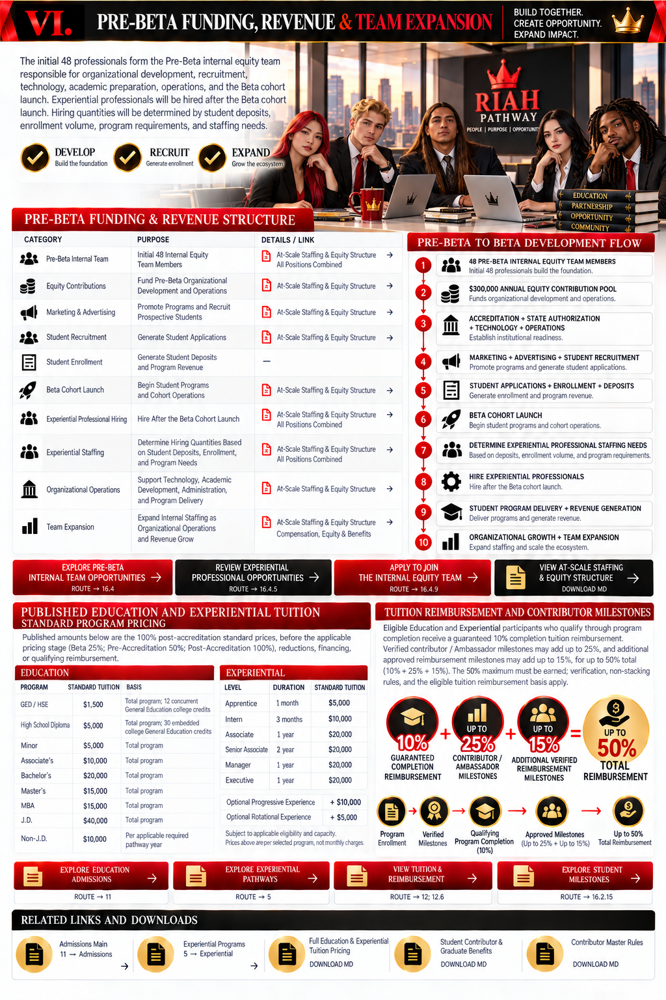

---

# WEBSITE RECRUITMENT & APPLICATION

[IMAGE: RIAH Pathway Internal Equity Team Recruitment Banner — Professional Team Members With Red, Black, White, and Gold Branding]

## Join the RIAH Pathway Internal Equity Team

Review the Pre-Beta contribution structure, Founder allocations, financial oversight, equity ownership, compensation, benefits, and team responsibilities before applying.

[BUTTON: Apply for Internal Equity Team]

[BUTTON: Review Equity & Compensation]

[BUTTON: View Pre-Beta Contribution Pool]

[BUTTON: Explore RIAH Pathway Careers]

[INTERNAL ROUTE: Apply for Internal Equity Team → 17.4.9 — Apply to Join RIAH Pathway → Breezy HR Application (Institutional URL to Configure)]

[DOWNLOAD ROUTE: Review Equity & Compensation → ./COMPENSATION-EQUITY-BENEFITS.md]

[ON-PAGE ROUTE: View Pre-Beta Contribution Pool → SECTION I — Equity Contribution Structure]

[INTERNAL ROUTE: Explore RIAH Pathway Careers → 17.4 — Join Our Team]

[BUTTON: Find Your Fit → INTERNAL ROUTE 17.4.8]

[BUTTON: Contact Human Resources → INTERNAL ROUTE 20.3]

[BUTTON: Express Interest → EXTERNAL SUITEDASH FORM (Institutional URL to Configure)]

[DOWNLOAD: Compensation, Equity & Benefits → ./COMPENSATION-EQUITY-BENEFITS.md]

[DOWNLOAD: Equity & Four-Year Vesting Table → ./EQUITY-AND-FOUR-YEAR-VESTING-TABLE.md]

[DOWNLOAD: At-Scale Staffing & Equity Structure → ./RIAH-PATHWAY-AT-SCALE-STAFFING-ASSIGNMENT-EQUITY-STRUCTURE.md]

[EXTERNAL LINK: RIAH Pathway Main Website → https://riahpathway.com]

[EXTERNAL LINK: Founder LinkedIn → https://linkedin.com/in/mariahrucker]

[EXTERNAL LINK: Founder GitHub → https://github.com/mariahdominiquerucker]

[INTERNAL LINK: Recruitment FAQs → 19 — FAQ]

[QR CODE: RIAH Pathway Main Website — RIAHPathway.com]
### Employees, Institutional Partners, Partner Employees & Affiliates — Benefits and Participation

[IMAGE: RIAH Pathway Employees, Institutional Partners, Partner Employees and Affiliates — Four Gold-Icon Benefit Cards in the Red, Black, White and Gold Website Theme; Distinct Eligibility, Verified Participation and Member Benefits]

This section distinguishes **RIAH Pathway internal employees/team members**, **approved institutional partners**, **verified partner employees**, and **partner affiliates**. Their eligibility, contribution responsibilities, written agreements, and benefits are different; one category does not automatically confer another category's benefits.

#### 👥 Internal Employees & Equity Team Members

Eligible RIAH Pathway Team Members receive **$0 tuition for eligible RIAH Pathway education** and a **50% discount on eligible products**, while remaining in good standing and meeting the applicable **daily, weekly and monthly performance, responsibility and contribution requirements**, including written team/equity terms. These employee-specific benefits do **not** require earning Ambassador points, and they are separate from the tuition-reimbursement program for paying students.

[BUTTON: View Internal Employee & Equity Team Benefits]
[DOWNLOAD ROUTE: ../../RIAH-PATHWAY-CONTRIBUTOR-BENEFITS-STRUCTURE/TEAM-MEMBERS.md — Team Members; Eligibility, Performance, Contribution Tracking and Benefits]

[BUTTON: Explore Employee & Internal Team Opportunities]
[INTERNAL ROUTE: 17.4 — Join Our Team; Application Route 17.4.9 — Breezy HR Institutional URL to Configure]

#### 🤝 Approved Institutional Partners

Institutions, employers and other partner organizations may be eligible for tuition and product benefits **only under an active approved partnership and applicable written terms**. Partnership eligibility, approved beneficiaries, activities, attribution, and available benefits depend on the partnership classification; there is no automatic employee or affiliate benefit merely from association with a partner.

[BUTTON: Explore Institutional Partnerships]
[INTERNAL ROUTE: 17.3 — Partnerships]

[BUTTON: Contact Partnerships & Organizations]
[INTERNAL ROUTE: 20.7 — Partnerships & Organizations]

[DOWNLOAD: Institutional Partner & Partner Employee Benefits and Written-Term Requirements → ../../RIAH-PATHWAY-CONTRIBUTOR-BENEFITS-STRUCTURE/PARTNER-EMPLOYEES.md]

#### 🧑‍💼 Verified Partner Employees & Approved Beneficiaries

Eligible employees, members, participants and approved beneficiaries associated with an active approved RIAH Pathway partner may participate as Partner Employee Ambassadors upon verification and continued eligibility. **Verified Ambassador milestones can earn up to 25%**, and a separate **eligible product benefit can reach up to 25%**, each subject to its own points ledger and applicable written partnership rules. For eligible paying Education or Experiential participants, **10% qualifying completion reimbursement is guaranteed**; verified Ambassador milestones may add up to 25% and additional approved reimbursement milestones may add up to 15%, for **up to 50% total**. The maximum is **not automatic**.

[FLOW DIAGRAM: Approved Partnership → Partner Employee / Beneficiary Eligibility Verification → Approved Partner Activities and Verified Points → Applicable Benefit Ledger → Re-Verification and Benefit Review]

[BUTTON: Review Partner Employee Eligibility, Activities & Milestones]
[DOWNLOAD ROUTE: ../../RIAH-PATHWAY-CONTRIBUTOR-BENEFITS-STRUCTURE/PARTNER-EMPLOYEES.md — Partner & Partner Employee Ambassadors]

[BUTTON: Explore Partner Employee Ambassador Participation]
[INTERNAL ROUTE: 17.5 — Ambassadors; Partner Relationship → 17.3 — Partnerships]

#### 🔗 Partner Affiliates & Verified Referrals

Partner Affiliates use **assigned referral links or QR codes** and approved RIAH Pathway materials to document attributable referrals, eligible program conversions and approved Ambassador activity. Verified Ambassador benefits can reach **up to 25%**, with a **separate product benefit up to 25%**. Point-bearing activities must be verified; converted students' 50% program-completion milestone and later completion/graduation milestone each award **50 points** when eligible. A referral or conversion does **not** automatically grant a 25% benefit. Affiliate eligibility and attribution remain separate from Partner Employee benefits.

[FLOW DIAGRAM: Approved Affiliate → Individual Referral Link / QR Code → Verified Referral / Conversion → Program Progress Milestones → Approved Points Ledger → Applicable Tuition or Product Benefit]

[BUTTON: Explore Partner Affiliate Benefits & Attribution]
[DOWNLOAD ROUTE: ../../RIAH-PATHWAY-CONTRIBUTOR-BENEFITS-STRUCTURE/AFFILIATES.md — Partner Affiliates]

[BUTTON: Explore Ambassador Participation]
[INTERNAL ROUTE: 17.5 — Ambassadors; Partnerships → 17.3]

#### 🔎 Shared Verification, Benefits & Contact Resources

[IMAGE: Partner, Employee & Affiliate Benefits Comparison — Four Distinct Benefit Cards With Eligibility Checkmarks, Gold Icons and Verified Milestone Arrows]

[BUTTON: Compare All Contributor, Employee, Partner & Affiliate Benefits]
[DOWNLOAD ROUTE: ../../RIAH-PATHWAY-CONTRIBUTOR-BENEFITS-STRUCTURE/README.md — Contributor, Ambassador, Graduate and Partner Benefits Master]

[BUTTON: Review Qualifying Student Tuition Reimbursement & Milestones]
[INTERNAL ROUTE: 13.17 — Tuition Reimbursement; 17.2.15 — Student Milestones; 12 — Admissions]

[INTERNAL LINK: Join Our Team → 17.4 — Join Our Team]
[INTERNAL LINK: Partnerships → 17.3 — Partnerships]
[INTERNAL LINK: Partnership Inquiries → 20.7 — Partnerships & Organizations]
[INTERNAL LINK: Ambassadors → 17.5 — Ambassadors]
[INTERNAL LINK: Human Resources → 20.3 — Human Resources]
[INTERNAL LINK: Founder Contributions & Financial Oversight → ON-PAGE SECTIONS IV AND V]

[DOWNLOAD: Internal Employee / Team Member Benefits → ../../RIAH-PATHWAY-CONTRIBUTOR-BENEFITS-STRUCTURE/TEAM-MEMBERS.md]
[DOWNLOAD: Partner & Partner Employee Eligibility and Benefits → ../../RIAH-PATHWAY-CONTRIBUTOR-BENEFITS-STRUCTURE/PARTNER-EMPLOYEES.md]
[DOWNLOAD: Partner Affiliate Benefits, QR Codes and Conversion Milestones → ../../RIAH-PATHWAY-CONTRIBUTOR-BENEFITS-STRUCTURE/AFFILIATES.md]
[DOWNLOAD: Master Contributor Benefits, Reimbursement and Non-Stacking Rules → ../../RIAH-PATHWAY-CONTRIBUTOR-BENEFITS-STRUCTURE/README.md]

[EXTERNAL LINK: Official RIAH Pathway Website → https://riahpathway.com]
[EXTERNAL LINK: RIAH Pathway Contact Email → mailto:contact@riahpathway.com]
[EXTERNAL FORM ROUTE: Partnership or Affiliate Interest → SuiteDash Institutional Form — URL to Configure; Do Not Treat as Live Until Configured]

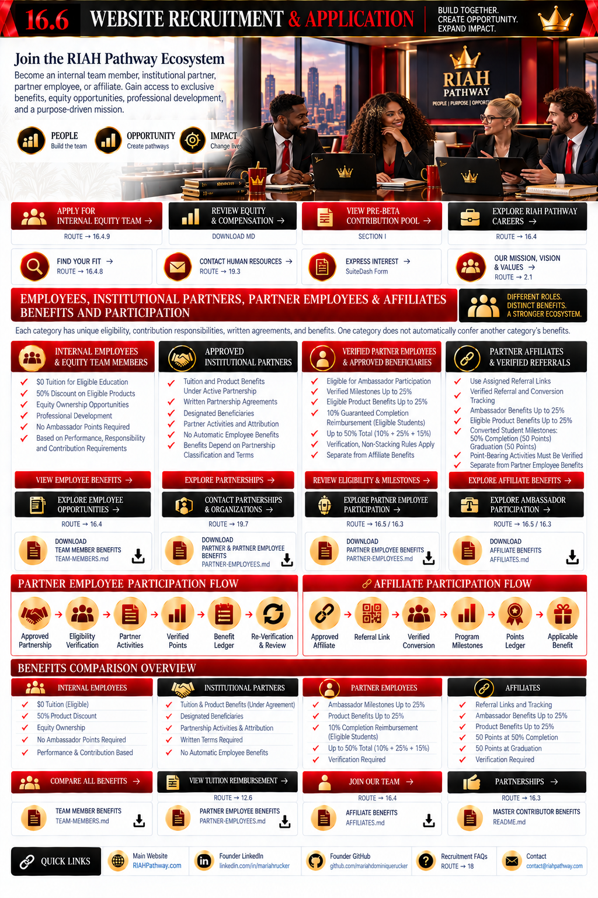

---

## RIAH PATHWAY

**EDUCATE. EMPOWER. ELEVATE.**

**ONE DYNASTY. INFINITE LEGACIES.**

**Phone:** 877-245-RIAH (7424)

**Email:** contact@riahpathway.com

**Website:** RIAHPathway.com

**POWER. | PEOPLE. | OPPORTUNITY. | WORK. | EQUITY. | RESULTS.**

---

# WEBSITE SITEMAP ROUTING, CTA BUTTONS, DOWNLOADS & LINKS — COMBINED REGISTER

| Wireframe Location | Type | CTA, Button, Download or Link | Sitemap Route / Destination | Routing & File Status |
|---|---|---|---|---|
| Header — Founder Video | Video | Founder Introduction, Mission, Vision & Ecosystem Goals | Embedded on this page | Founder-created video to upload; playback in place |
| Header | Button / CTA | Apply for Internal Equity Team | 17.4.9 → Breezy HR | Internal recruitment route; external institutional application URL to configure |
| Header | Button / Download | View Compensation, Equity & Benefits | `./COMPENSATION-EQUITY-BENEFITS.md` | Existing download file |
| Header | Internal Link | Meet the Founder & Leadership | 2.3 — Leadership | About page |
| Header | Internal Link | Explore Join Our Team | 17.4 — Join Our Team | Recruitment page |
| Header | External Link | Founder GitHub Professional Profile | https://github.com/mariahdominiquerucker | Existing public profile reference |
| Header | External Link | Founder LinkedIn Professional Profile | https://linkedin.com/in/mariahrucker | Existing public profile reference |
| I — Equity Contribution Structure | Button / CTA | View Accreditation & Authorization | 16 — Accreditation & Authorization | Internal page |
| I — Equity Contribution Structure | Button / CTA | Explore State Authorization | 16.5 — State Authorization | Internal subpage |
| I — Equity Contribution Structure | Button / Download | Review Equity & Four-Year Vesting | `./EQUITY-AND-FOUR-YEAR-VESTING-TABLE.md` | Existing download file |
| I — Equity Contribution Structure | Internal Link | Explore Internal Equity Team Positions | 17.4 — Join Our Team | Recruitment page |
| I — Equity Contribution Structure | Download | Contribution Pool & Founder Allocation Summary | `./FOUNDER-EQUITY-CONTRIBUTIONS-ALLOCATIONS.md` | Current Markdown document |
| II — Founder Monthly Living Expenses | Button / CTA | Review Financial Oversight & Allocation | On-page Section V | Scroll within this wireframe |
| II — Founder Monthly Living Expenses | Internal Link | Board & Governance | 2.4 — Board & Governance | Internal page |
| II — Founder Monthly Living Expenses | Download | Founder Monthly Living Expense Allocation | File to attach | Downloadable summary not yet supplied |
| III — Employment & Licensing Verification | Button / CTA | Review Employment & Licensing Verification | On-page Section III | Scroll to screenshot grid |
| III — Employment & Licensing Verification | Download | Employment & Licensing Verification Packet | Redacted PDF / ZIP — file to attach | Not live until sensitive details are redacted |
| III — Employment & Licensing Verification | Internal Link | About Founder & Leadership | 2.3 — Leadership | Internal page |
| III — Employment & Licensing Verification | External Link | Founder Professional Profile | https://linkedin.com/in/mariahrucker | Existing public profile reference |
| IV — Founder Contributions & Responsibilities | Button / Download | View Compensation, Equity & Benefits | `./COMPENSATION-EQUITY-BENEFITS.md` | Existing download file |
| IV — Founder Contributions & Responsibilities | Button / Download | Review Equity Vesting Terms | `./EQUITY-AND-FOUR-YEAR-VESTING-TABLE.md` | Existing download file |
| IV — Founder Contributions & Responsibilities | Button / CTA | Explore Career Opportunities | 17.4 — Join Our Team | Internal page |
| IV — Founder Contributions & Responsibilities | Internal Link | Executive Leadership Opportunities | 17.4.1 — Executive | Recruitment subpage |
| IV — Founder Contributions & Responsibilities | Download | Internal Team Compensation, Equity & Benefits | `./COMPENSATION-EQUITY-BENEFITS.md` | Existing download file |
| V — Financial Oversight & Allocation | Button / CTA | Review Board & Governance | 2.4 — Board & Governance | Internal page |
| V — Financial Oversight & Allocation | Button / CTA | View Accreditation & Authorization | 16 — Accreditation & Authorization | Internal page |
| V — Financial Oversight & Allocation | Internal Link | Organizational Policies | 18.8 — Policies | Internal subpage |
| V — Financial Oversight & Allocation | Download | Founder Equity Contribution Pool & Allocations | `./FOUNDER-EQUITY-CONTRIBUTIONS-ALLOCATIONS.md` | Current Markdown document |
| V — Financial Oversight & Allocation | Download | Equity & Four-Year Vesting Table | `./EQUITY-AND-FOUR-YEAR-VESTING-TABLE.md` | Existing download file |
| VI — Pre-Beta Funding, Revenue & Expansion | Button / CTA | Explore Pre-Beta Internal Team Opportunities | 17.4 — Join Our Team | Internal page |
| VI — Pre-Beta Funding, Revenue & Expansion | Button / CTA | Review Experiential Professional Opportunities | 17.4.5 — Experiential Faculty | Recruitment subpage |
| VI — Pre-Beta Funding, Revenue & Expansion | Button / CTA | Apply to Join the Internal Equity Team | 17.4.9 → Breezy HR | External institutional application URL to configure |
| VI — Pre-Beta Funding, Revenue & Expansion | Button / Download | View At-Scale Staffing & Equity Structure | `./RIAH-PATHWAY-AT-SCALE-STAFFING-ASSIGNMENT-EQUITY-STRUCTURE.md` | Existing download file |
| VI — Pre-Beta Funding, Revenue & Expansion | Internal Link | Experiential Programs | 5 — Experiential | Internal page |
| VI — Pre-Beta Funding, Revenue & Expansion | Internal Link | Student Admissions & Enrollment | 12 — Admissions | Internal page |
| VI — Pre-Beta Funding, Revenue & Expansion | Download | All Positions Combined | `./ALL-POSITIONS-COMBINED.md` | Existing download file |
| VI — Pre-Beta Funding, Revenue & Expansion | Download | At-Scale Staffing, Assignment & Equity Structure | `./RIAH-PATHWAY-AT-SCALE-STAFFING-ASSIGNMENT-EQUITY-STRUCTURE.md` | Existing download file |
| Recruitment & Application | Button / CTA | Apply for Internal Equity Team | 17.4.9 → Breezy HR | External institutional application URL to configure |
| Recruitment & Application | Button / Download | Review Equity & Compensation | `./COMPENSATION-EQUITY-BENEFITS.md` | Existing download file |
| Recruitment & Application | Button / CTA | View Pre-Beta Contribution Pool | On-page Section I | Scroll within this wireframe |
| Recruitment & Application | Button / CTA | Explore RIAH Pathway Careers | 17.4 — Join Our Team | Internal page |
| Recruitment & Application | Button / CTA | Find Your Fit | 17.4.8 — Find Your Fit | Internal recruitment subpage |
| Recruitment & Application | Button / CTA | Contact Human Resources | 20.3 — Human Resources | Internal contact route |
| Recruitment & Application | Button / CTA | Express Interest | SuiteDash form | External institutional form URL to configure |
| Recruitment & Application | Download | Compensation, Equity & Benefits | `./COMPENSATION-EQUITY-BENEFITS.md` | Existing download file |
| Recruitment & Application | Download | Equity & Four-Year Vesting Table | `./EQUITY-AND-FOUR-YEAR-VESTING-TABLE.md` | Existing download file |
| Recruitment & Application | Download | At-Scale Staffing & Equity Structure | `./RIAH-PATHWAY-AT-SCALE-STAFFING-ASSIGNMENT-EQUITY-STRUCTURE.md` | Existing download file |
| Recruitment & Application | QR Code / External Link | RIAH Pathway Main Website | https://riahpathway.com | Existing main website destination |
| Recruitment & Application | External Link | Founder LinkedIn | https://linkedin.com/in/mariahrucker | Existing public profile reference |
| Recruitment & Application | External Link | Founder GitHub | https://github.com/mariahdominiquerucker | Existing public profile reference |
| Recruitment & Application | Internal Link | Recruitment FAQs | 19 — FAQ | Internal page |
| IV — Founder Contributions | Contributor Benefits CTA | Review Contributor Benefits & Team Eligibility | ../../RIAH-PATHWAY-CONTRIBUTOR-BENEFITS-STRUCTURE/README.md | Existing contributor rules |
| IV — Founder Contributions | Admissions / Tuition CTA | Explore Student Admissions & Reimbursement / Compare Tuition | 11; 12; 13.17 | Internal routes |
| IV — Founder Contributions | Download | Team Member Requirements | ../../RIAH-PATHWAY-CONTRIBUTOR-BENEFITS-STRUCTURE/TEAM-MEMBERS.md | Existing benefits document |
| V — Financial Oversight | Contributor / Reimbursement CTA | Verify Contributor Reimbursement Milestones | ../../RIAH-PATHWAY-CONTRIBUTOR-BENEFITS-STRUCTURE/README.md; 13.17 | Existing rules and route |
| VI — Pricing | Education / Experiential / Tuition CTAs | Explore Education Admissions / Experiential Pathways / Tuition | 11; 5; 12; 13.6 | Internal routes |
| VI — Pricing | Student Milestones CTA | Explore Student Milestones | 17.2.15 | Student Life |
| VI — Pricing | Download | Full Education & Experiential Tuition Pricing | ../../RIAH-PATHWAY-TUITION-PRICING-FEES-STRUCTURE/RIAH-PATHWAY-TUITION-PRICING-FEES.md | Existing pricing source |
| VI — Pricing | Download | Student Contributor & Graduate Benefits | ../../RIAH-PATHWAY-CONTRIBUTOR-BENEFITS-STRUCTURE/STUDENTS.md | Existing contributor guide |
| Employees, Partners & Affiliates | Button / Download | View Internal Employee & Equity Team Benefits | ../../RIAH-PATHWAY-CONTRIBUTOR-BENEFITS-STRUCTURE/TEAM-MEMBERS.md | Team Member benefits; eligibility, performance and contributions |
| Employees, Partners & Affiliates | Button / Internal Route | Explore Employee & Internal Team Opportunities | 17.4; 17.4.9 | Join Our Team and Breezy HR institutional URL to configure |
| Employees, Partners & Affiliates | Button / Internal Route | Explore Institutional Partnerships | 17.3 | Partnerships |
| Employees, Partners & Affiliates | Button / Internal Route | Contact Partnerships & Organizations | 20.7 | Partnerships & Organizations contact |
| Employees, Partners & Affiliates | Button / Download | Review Partner Employee Eligibility, Activities & Milestones | ../../RIAH-PATHWAY-CONTRIBUTOR-BENEFITS-STRUCTURE/PARTNER-EMPLOYEES.md | Partner Employee benefits and verified points |
| Employees, Partners & Affiliates | Button / Internal Route | Explore Partner Employee Ambassador Participation | 17.5; 17.3 | Ambassadors and Partnerships |
| Employees, Partners & Affiliates | Button / Download | Explore Partner Affiliate Benefits & Attribution | ../../RIAH-PATHWAY-CONTRIBUTOR-BENEFITS-STRUCTURE/AFFILIATES.md | Affiliates, individual QR codes and conversion milestones |
| Employees, Partners & Affiliates | Button / Internal Route | Explore Ambassador Participation | 17.5; 17.3 | Ambassadors and Partnerships |
| Employees, Partners & Affiliates | Button / Download | Compare Contributor, Employee, Partner & Affiliate Benefits | ../../RIAH-PATHWAY-CONTRIBUTOR-BENEFITS-STRUCTURE/README.md | Master benefits and non-stacking rules |
| Employees, Partners & Affiliates | Button / Internal Route | Review Student Tuition Reimbursement & Milestones | 13.17; 17.2.15; 11 | Reimbursement, Student Milestones and Admissions |
| Employees, Partners & Affiliates | Internal Link | Human Resources | 20.3 | HR contact |
| Employees, Partners & Affiliates | Internal Link | Founder Contributions & Financial Oversight | Sections IV and V | On-page anchors |
| Employees, Partners & Affiliates | Download | Internal Employee / Team Member Benefits | ../../RIAH-PATHWAY-CONTRIBUTOR-BENEFITS-STRUCTURE/TEAM-MEMBERS.md | Existing contributor guide |
| Employees, Partners & Affiliates | Download | Partner & Partner Employee Benefits | ../../RIAH-PATHWAY-CONTRIBUTOR-BENEFITS-STRUCTURE/PARTNER-EMPLOYEES.md | Existing contributor guide |
| Employees, Partners & Affiliates | Download | Partner Affiliate Benefits | ../../RIAH-PATHWAY-CONTRIBUTOR-BENEFITS-STRUCTURE/AFFILIATES.md | Existing contributor guide |
| Employees, Partners & Affiliates | Download | Contributor Benefits Master | ../../RIAH-PATHWAY-CONTRIBUTOR-BENEFITS-STRUCTURE/README.md | Existing contributor guide |
| Employees, Partners & Affiliates | External Link | Official RIAH Pathway Website | https://riahpathway.com | Existing public website |
| Employees, Partners & Affiliates | External Link | RIAH Pathway Contact Email | mailto:contact@riahpathway.com | Public contact email |
| Employees, Partners & Affiliates | External Form Route | Partnership or Affiliate Interest | SuiteDash institutional form | URL to configure; not live |
