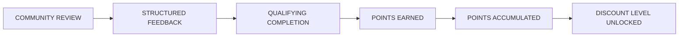
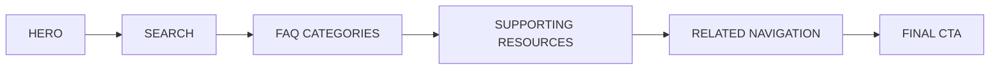
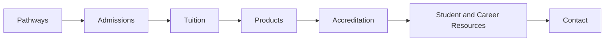

# 👑 RIAH PATHWAY
# 19 — FAQ — CTA BUTTONS LINKS ROUTING

**Source:** Main page wireframe in this folder.
**Website Navigation:** Pages 1–20.
**Control Rule:** This file is the page-level CTA, button, internal-link, external-link, media, form, and download routing directory.

# 👑 RIAH PATHWAY — 19 — FAQ
## WEBSITE WIREFRAME

**Brand:** RIAH Pathway  
**Slogan:** **ONE DYNASTY. INFINITE LEGACIES.**  
**Institutional Colors:** Black • Red • Gold • White • Silver  
**Navigation:** **12 — FAQ**  
**Page Link:** FAQ  
**Page Type:** Frequently Asked Questions and Website Support Directory  
**Primary Purpose:** Provide one searchable, organized FAQ covering RIAH Pathway, pathways, admissions, tuition, donations, products, accreditation, Join Us, resources, and contact while routing visitors to the appropriate approved website page, public resource, application, inquiry form, or download.

---

**Current Website Route:** 19 — FAQ  
**Current Website Navigation:** Pages 1–20  
**Header and Footer:** Managed globally and intentionally omitted from this page wireframe.

# PAGE STRUCTURE

## 19 — FAQ

**FAQ Categories**

- About RIAH
- Pathway
- Degree Pathway
- Experiential Pathway
- Certification Pathway
- High School Pathway
- GED and HSE Pathway
- Law Pathway
- Admissions
- Tuition
- Donations
- Products
- Accreditation and Authorization
- Join Us
- Resources
- Contact

---

## COMMUNITY CAPSTONE + PEER REVIEW POINTS AND DISCOUNTS

Community members may sign up to review applicable student capstones, participate in applicable peer review, and provide structured feedback on student work. Qualifying completed reviews earn points that accumulate according to the number of capstone and peer-review activities completed.

| Community Participation | RIAH Structure |
|---|---|
| Capstone Review | Review applicable student capstones and provide structured feedback |
| Peer Review | Participate in applicable peer-review activities |
| Points | Earn points for qualifying completed capstone and peer reviews |
| Accumulation | Points accumulate based on qualifying review participation |
| Product Discounts | Accumulated points may unlock applicable discounts on qualifying RIAH products |
| Certification Review | Applicable discounts may be used toward qualifying Certification Review products |
| Bar Review | Applicable discounts may be used toward qualifying Bar Review products |
| Educational Pathways | Applicable discounts may be used toward qualifying RIAH educational pathways, including the JD pathway and other applicable education pathways |

RIAH faculty and applicable academic personnel retain academic oversight and final evaluation requirements. Community and peer feedback supplements the formal academic review process.

# WIREFRAME STRUCTURE CONTROL

The public FAQ page follows:

# FAQ PAGE FLOW

The FAQ should use searchable and expandable accordion sections so visitors can find answers without creating an excessively long visual page.

Approved FAQ information remains visible as HTML and web text and must not exist only inside images.

---

# WIREFRAME BUILD KEY

**[IMAGE]** = photography or branded institutional visual

**[ICON]** = professional graphic icon

**[VIDEO]** = website video placement

**[BUTTON]** = one of the five approved CTA families

**[INTERNAL LINK]** = approved RIAH Pathway website destination

**[EXTERNAL LINK]** = approved public facing external destination

**[ACCORDION]** = expandable FAQ content

**[SEARCH]** = searchable FAQ component

**[FILTER]** = FAQ category filter

**[DOWNLOAD]** = standalone downloadable document

**[CTA BAND]** = consolidated action area

---

# SECTION 01 — HERO

[SECTION BACKGROUND — BLACK, WHITE, RED AND GOLD ACCENTS]

## FREQUENTLY ASKED QUESTIONS

# EVERYTHING YOU NEED TO KNOW ABOUT RIAH PATHWAY.

Find answers about RIAH Pathway, academic pathways, experiential education, certification preparation, law pathways, admissions, tuition, products, accreditation, student life, careers, joining the RIAH team, resources, and more.

### HERO ACTIONS

**[BUTTON — LEARN MORE: EXPLORE PATHWAYS → 03 — PATHWAY]**

**[BUTTON — GET STARTED: REQUEST INFORMATION → EXTERNAL — JOTFORM]**

**[BUTTON — APPLY NOW → EXTERNAL — CLASSE365]**

### HERO IMAGE

[IMAGE PLACEHOLDER — FAQ — RIAH PATHWAY STUDENT SUPPORT]

**Type:** Institutional and Student Support

**Visual:** Students, professionals, faculty, and support personnel connected through the RIAH Pathway ecosystem.

**Purpose:** Introduce the FAQ as the centralized public information and support page.

**Alt Text:** RIAH Pathway students and professionals accessing education, experience, certification, and career support.

### HERO VIDEO

[VIDEO PLACEHOLDER — FAQ — START HERE WITH RIAH PATHWAY]

**Purpose:** Provide a concise visual orientation explaining where visitors can find information across the RIAH Pathway website.

**Visual Direction:** RIAH Pathway branding with students and professionals progressing through the institutional ecosystem.

**Content:**

Video should introduce the primary FAQ areas:

**Controls:** Play • Pause • Captions • Full Screen

**Poster Image:**  
[IMAGE PLACEHOLDER — FAQ HERO VIDEO POSTER]

---

# SECTION 02 — SEARCH THE FAQ

[SECTION BACKGROUND — WHITE]

[ICON PLACEHOLDER — MAGNIFYING GLASS — SEARCH]

## HOW CAN WE HELP?

[SEARCH PLACEHOLDER — SEARCH FREQUENTLY ASKED QUESTIONS]

### FAQ FILTERS

[FILTER — ABOUT]

[FILTER — PATHWAY]

[FILTER — DEGREE]

[FILTER — EXPERIENTIAL]

[FILTER — CERTIFICATION]

[FILTER — HIGH SCHOOL]

[FILTER — GED AND HSE]

[FILTER — LAW]

[FILTER — ADMISSIONS]

[FILTER — TUITION]

[FILTER — DONATIONS]

[FILTER — PRODUCTS]

[FILTER — ACCREDITATION]

[FILTER — JOIN US]

[FILTER — RESOURCES]

[FILTER — CONTACT]

Filters remain on **12 — FAQ** and filter or jump to the applicable FAQ accordion category.

---

# SECTION 03 — ABOUT RIAH FAQ

[ICON PLACEHOLDER — INSTITUTION — BUILDING]

[ACCORDION — ABOUT RIAH]

### What is RIAH Pathway?

RIAH Pathway is developing an integrated institutional ecosystem connecting education, experience, certification, career development, professional opportunities, companies, partners, and community.

**[BUTTON — LEARN MORE: ABOUT RIAH PATHWAY → 02 — ABOUT]**

### What are RIAH Pathway's mission and vision?

RIAH Pathway's mission, vision, institutional story, and organizational purpose are maintained within the About section.

**[BUTTON — LEARN MORE: MISSION AND VISION → 02 — ABOUT]**

### Why RIAH Pathway?

RIAH Pathway's institutional values are:

**Accessible • Affordable • Elite • Rigorous**

**[BUTTON — LEARN MORE: WHY RIAH → 02 — ABOUT]**

### What is the RIAH Ecosystem?

The RIAH Ecosystem connects:

**Career + Certification + Education + Experience**

with RIAH leadership, companies, external pillars, professional relationships, students, and institutional operations.

**[BUTTON — LEARN MORE: RIAH ECOSYSTEM → 02 — ABOUT]**

### Who leads RIAH Pathway?

RIAH's organizational structure includes academic, executive, and operational leadership.

**[BUTTON — LEARN MORE: LEADERSHIP → 02 — ABOUT]**

### Does RIAH have governing boards?

RIAH's governance structure includes the Corporation Board, Foundation Board, and Institutional Board.

**[BUTTON — LEARN MORE: GOVERNANCE AND BOARDS → 02 — ABOUT]**

### What are RIAH's External Pillars?

RIAH's external professional pillars include CPA, Development, Law, MSSP, and Training relationships.

**[BUTTON — LEARN MORE: EXTERNAL PILLARS → 02 — ABOUT]**

---

# SECTION 04 — PATHWAY FAQ

[ICON PLACEHOLDER — ROADMAP — PATHWAY]

[ACCORDION — PATHWAY]

### What pathways are being developed through RIAH?

RIAH's pathway structure includes:

**Certification Pathway • Degree Pathway • Experiential Pathway • GED and HSE Pathway • High School Pathway • Law Pathway**

The Law Pathway includes J.D., Non-J.D. Bar License, PI and Security Guard, Armed Security, and Criminal Justice pathways.

**[BUTTON — LEARN MORE: EXPLORE ALL PATHWAYS → 03 — PATHWAY]**

### What are RIAH's three academic pathway types?

**Type 1 — Curriculum**

Curriculum based pathway structure.

**Type 2 — Curriculum + Experience**

Includes experiential participation where selected and available, subject to capacity and routing requirements.

**Type 3 — Curriculum + Supervision**

Supervised pathway structure used where applicable, including certain J.D. and Non-J.D. structures.

**[BUTTON — LEARN MORE: PATHWAY TYPES → 03 — PATHWAY]**

---

# SECTION 05 — DEGREE PATHWAY FAQ

[ICON PLACEHOLDER — GRADUATION CAP — DEGREE]

[ACCORDION — DEGREE PATHWAY]

### What degree pathway options are planned?

RIAH's planned degree pathway structure includes:

**Associate's • Bachelor's • MBA • Minor**

**[BUTTON — LEARN MORE: DEGREE PROGRAMS → 04 — DEGREE PROGRAMS]**

### What schools are part of the Degree Pathway?

RIAH's planned academic structure includes:

**School of Business**

**School of Homeland Security and GRC**

**School of Law**

**School of Technology**

**[BUTTON — LEARN MORE: SCHOOLS → 04.2 — SCHOOLS]**

### What majors and programs are planned?

Programs span Business, Accounting, Entrepreneurship, Finance, Management, Cybersecurity, GRC, Law, Computer Science, Data Analytics, Data Science, Information Systems, Program Management, Project Management, Software Development, Software Engineering, and additional applicable areas.

**[BUTTON — LEARN MORE: DEGREE PROGRAMS → 04 — DEGREE PROGRAMS]**

### How is the curriculum structured?

The curriculum structure varies by degree level and may include:

**[BUTTON — LEARN MORE: CURRICULUM → 11 — CURRICULUM]**

### Can students accelerate their pathway?

Acceleration depends on the applicable pathway, accepted credits, course progression, assessment requirements, institutional policies, and other applicable requirements.

**[BUTTON — LEARN MORE: CURRICULUM → 11 — CURRICULUM]**

### Does RIAH evaluate transfer and alternative credit?

Applicable prior college credit, alternative credit, and certification equivalencies may be evaluated during pre admissions and academic review.

**[BUTTON — LEARN MORE: ADMISSIONS → 12 — ADMISSIONS]**

---

# SECTION 06 — EXPERIENTIAL PATHWAY FAQ

[ICON PLACEHOLDER — BRIEFCASE — PROFESSIONAL EXPERIENCE]

[ACCORDION — EXPERIENTIAL PATHWAY]

### What is the Experiential Pathway?

The Experiential Pathway provides structured professional experience across applicable Business, Homeland Security, Cybersecurity, GRC, Law, and Technology areas.

**[BUTTON — LEARN MORE: EXPERIENTIAL → 05 — EXPERIENTIAL]**

### How long are experiential programs?

Program duration structures include:

**Apprentice — one month • Intern — three months • Associate, Senior Associate, Manager, and Executive — one year each**

### What experience levels are available?

Applicable experience types include:

**Apprentice • Intern • Associate • Senior Associate • Manager • Executive**

### Is experiential participation guaranteed?

Experiential opportunities may be subject to selection, available capacity, automated routing, priority, deadlines, and seat allocation.

### Who supervises experiential participants?

The experiential structure may include:

**Supervisors • Managers • Reviewers**

### Where can experiential placement occur?

Professional placement may occur internally through a RIAH segment or rotation or externally through participating employers and partners.

### Can experiential participants receive compensation or funding?

Depending on the applicable opportunity, structures may include hourly compensation, grants, scholarships, stipends, tuition reimbursement, and institutional reinvestment.

**[BUTTON — LEARN MORE: EXPERIENTIAL → 05 — EXPERIENTIAL]**

---

# SECTION 07 — ENTREPRENEURSHIP FAQ

[ICON PLACEHOLDER — LIGHTBULB / BUSINESS — ENTREPRENEURSHIP]

[ACCORDION — ENTREPRENEURSHIP]

### What is the RIAH Pathway Entrepreneurship Program?

RIAH Pathway Entrepreneurship connects structured curriculum with real startup and small-business implementation through two business pools: Startup Entrepreneurship and Small Business Entrepreneurship.

**[BUTTON — LEARN MORE: ENTREPRENEURSHIP → 06 — ENTREPRENEURSHIP]**

### What entrepreneurship routes are available?

Startup routes include Apprentice Startup, New Startup, One-Year Startup, and Growth Startup. Small-business routes include Apprentice Small Business, New Small Business, Established Small Business, and Small Business Recovery & Growth.

### When are Entrepreneurship cohorts offered?

Entrepreneurship uses separate Spring and Fall admissions routing rather than replacing the monthly academic and Experiential admissions structure.

**[BUTTON — LEARN MORE: ENTREPRENEURSHIP ADMISSIONS → 12 — ADMISSIONS]**

### Where can I review Entrepreneurship tuition and payment options?

**[BUTTON — LEARN MORE: ENTREPRENEURSHIP TUITION → 13 — TUITION]**

### Does RIAH directly provide every professional service connected to Entrepreneurship?

No. Applicable Extended Services connect eligible businesses with independently contracted and vetted professional affiliates. Separate professional services are governed by the applicable independent provider relationship.

**[BUTTON — LEARN MORE: EXTENDED SERVICES → 15.5 — EXTENDED SERVICES — BUSINESS AFFILIATE CONNECTIONS]**

---

# SECTION 08 — CERTIFICATION REVIEW FAQ

[ICON PLACEHOLDER — CERTIFICATE — CREDENTIAL]

[ACCORDION — CERTIFICATION PATHWAY]

### What is the Certification Pathway?

The Certification Pathway provides structured curriculum and review preparation connected to professional certifications and credentials.

### What certification categories are available?

Certification categories are organized across:

**Business • Homeland Security • Law • Technology**

### What certification program levels are available?

RIAH's current structure organizes certification programs into:

**Basic — $500 • Standard — $1,000 • Premium — $1,500**

### What practice resources are available?

Practice resources may include:

**Practice Exams • Question Banks • Simulated Exams • Study Bundles**

**[BUTTON — LEARN MORE: CERTIFICATION REVIEW → 09 — CERTIFICATION REVIEW]**

### Can I purchase educational and practice products separately?

Yes. Products and applicable services can be purchased separately from pathway enrollment where available.

**[BUTTON — LEARN MORE: PRODUCTS & SERVICES → 15 — PRODUCTS & SERVICES]**

**[BUTTON — SHOP NOW → EXTERNAL — SHOPIFY]**

---

# SECTION 09 — HIGH SCHOOL PATHWAY FAQ

[ICON PLACEHOLDER — SCHOOL — SECONDARY EDUCATION]

[ACCORDION — HIGH SCHOOL PATHWAY]

### What High School Pathway options are available?

The High School Pathway includes:

**Standard • Dual Enrollment**

### How does Dual Enrollment work?

The planned Dual Enrollment structure connects applicable high school curriculum progression with eligible college credit and future Associate's or Bachelor's progression.

### What are the completion requirements?

Requirements may include applicable high school requirements, applicable RIAH curriculum completion, a capstone or project, and verbal or panel presentation.

**[BUTTON — LEARN MORE: HIGH SCHOOL → 07 — HIGH SCHOOL]**

---

# SECTION 10 — GED AND HSE PATHWAY FAQ

[ICON PLACEHOLDER — BOOK — GED AND HSE]

[ACCORDION — GED AND HSE PATHWAY]

### What GED and HSE pathway options are available?

The GED and HSE Pathway includes:

**Standard • Dual Enrollment**

### Can GED and HSE students progress toward college credit?

Applicable Dual Enrollment structures may connect eligible credit with Associate's or Bachelor's progression.

### Is an official GED or HSE credential required for completion?

The pathway's completion structure includes official GED or HSE completion together with applicable RIAH curriculum and exit requirements.

**[BUTTON — LEARN MORE: GED/HSE → 08 — GED/HSE]**

---

# SECTION 11 — LAW PATHWAY FAQ

[ICON PLACEHOLDER — SCALES — LAW]

[ACCORDION — LAW PATHWAY]

### What Law Pathways are planned?

RIAH's Law Pathway includes:

**J.D. • Non-J.D. Bar License**

### What J.D. pathway types are planned?

**Type 1 — Experiential and Capacity Based J.D.**

**Type 2 — Curriculum Based J.D.**

**Type 3 — Supervised Curriculum J.D.**

### What is the Non-J.D. Bar License Pathway?

The Non-J.D. structure is designed around alternative legal study routes available under applicable jurisdictional rules.

Eligibility and licensing requirements are determined by the applicable jurisdiction.

### Which states are included in the Non-J.D. structure?

The current pathway architecture includes:

**California • Maine • New York • Vermont • Virginia • Washington**

### Does completing a RIAH pathway guarantee bar eligibility or admission?

No. Applicable state authorities determine legal study eligibility, examination eligibility, character and fitness requirements, bar admission, and licensure.

### Are supervision and reporting included?

Applicable legal pathways incorporate supervision and reporting structures where required.

### Does RIAH include Bar Review?

Applicable J.D. and Non-J.D. structures include Bar Review preparation within their pathway architecture.

### Where are Criminal Justice, Private Investigator, and Physical Security located in the current curriculum structure?

Criminal Justice is housed within the School of Law curriculum. Private Investigator and Physical Security are housed within the School of Homeland Security curriculum.

**[BUTTON — LEARN MORE: SCHOOL OF LAW CURRICULUM → 11.6 — SCHOOL OF LAW]**

**[BUTTON — LEARN MORE: SCHOOL OF HOMELAND SECURITY CURRICULUM → 11.4 — SCHOOL OF HOMELAND SECURITY]**

**[BUTTON — LEARN MORE: LAW PATHWAY → 04.3 — LAW PATHWAY]**

**[BUTTON — LEARN MORE: LAW CURRICULUM → 11.6 — SCHOOL OF LAW]**

---

# SECTION 12 — ADMISSIONS FAQ

[ICON PLACEHOLDER — APPLICATION — ADMISSIONS]

[ACCORDION — ADMISSIONS]

### How do I apply to RIAH Pathway?

The student journey moves from inquiry and pre admissions through application, review, acceptance, enrollment, orientation, active student experience, graduation, and alumni engagement.

### What happens during Pre Admissions?

Pre Admissions may include eligibility review, prerequisites, pathway eligibility, transcripts, transfer and alternative credit evaluation, background checks or character and fitness requirements where applicable, international document review, and experiential preparation.

### What is the application process?

### Where do I submit my application?

**[BUTTON — APPLY NOW → EXTERNAL — CLASSE365]**

### Are admissions requirements different by pathway?

Yes. Admissions requirements may differ for Degree, Experiential, GED and HSE, High School Diploma, and Law pathways.

### What happens after I am admitted?

The post admission process can include an admission offer, agreement, enrollment, deposit, cohort or seat confirmation, onboarding, and orientation.

### Is there an orientation?

Yes. The planned onboarding structure includes a one week orientation covering RIAH Pathway, school, pathway or program, cohort, community, experiential requirements where applicable, and student readiness.

### What happens after graduation?

Graduates transition into RIAH's Alumni and Legacy experience, which may include alumni community, professional networking, mentorship, events, career milestones, recognition, and continued opportunities.

**[BUTTON — LEARN MORE: ADMISSIONS → 12 — ADMISSIONS]**

---

# SECTION 13 — TUITION FAQ

[ICON PLACEHOLDER — DOLLAR — TUITION]

[ACCORDION — TUITION]

### Where can I find tuition?

Tuition is organized by pathway, including Degree, Experiential, GED and HSE where applicable, High School, and Law pathways.

**[BUTTON — LEARN MORE: TUITION → 13 — TUITION]**

### Are there additional institutional fees?

Applicable costs may include program and pathway fees, testing and examination fees, transfer credit fees, and other applicable fees.

### What payment options are available?

Applicable structures may include:

**Annual • Monthly • Per Course • Semester • Upfront**

### Can I compare pathway costs?

Yes.

**[BUTTON — LEARN MORE: TUITION AND PRICING → 13 — TUITION]**

---

# SECTION 14 — DONATIONS FAQ

[ICON PLACEHOLDER — HEART — GIVING]

[ACCORDION — DONATIONS]

### Can I donate to RIAH?

Yes. RIAH's Donations section provides information about institutional giving and available donation opportunities.

### Why donate to RIAH?

Donations can support applicable RIAH initiatives and institutional development priorities.

### What ways can I give?

**Corporate and Organization • In Honor and Memory • Monthly • One Time • Specific Initiative**

### Can I direct my donation toward a specific area?

Where available, donors may select applicable donation areas or specific initiatives.

### Where is the RIAH Foundation information?

Foundation information is housed within Donations rather than as a separate top level page.

### Where can I learn about Foundation funding?

Foundation and applicable funding information is maintained through the Donations section.

**[BUTTON — LEARN MORE: DONATIONS AND FOUNDATION → 14 — DONATIONS]**

---

# SECTION 15 — PRODUCTS FAQ

[ICON PLACEHOLDER — SHOPPING BAG — PRODUCTS]

[ACCORDION — PRODUCTS]

### What products does RIAH offer?

RIAH's product ecosystem may include educational materials, practice products, bundles, professional support services, and other applicable products.

### Where can I see product pricing?

**[BUTTON — LEARN MORE: PRODUCTS AND PRICING → 15 — PRODUCTS & SERVICES]**

### Are products included with every pathway?

Not necessarily. Products and services **cost separately** unless specifically identified as included with the selected pathway, package, or program level.

### Can I purchase products without changing my certification level?

Where offered separately, applicable products may be purchased without automatically changing the student's underlying certification program level.

**[BUTTON — SHOP NOW → EXTERNAL — SHOPIFY]**

---

# SECTION 16 — ACCREDITATION AND AUTHORIZATION FAQ

[ICON PLACEHOLDER — INSTITUTION — ACCREDITATION]

[ACCORDION — ACCREDITATION AND AUTHORIZATION]

### Is RIAH Pathway currently accredited?

RIAH Pathway is currently in its **pre accreditation institutional development stage**. Accreditation dependent academic offerings remain subject to applicable accreditation, authorization, approval, and institutional requirements.

### Where can I track RIAH's accreditation information?

Accreditation related information, institutional status, applicable disclosures, and future updates are maintained within the Accreditation and Authorization page.

### Does pre accreditation mean RIAH currently awards accredited degrees?

No. Pre accreditation institutional development should not be interpreted as current institutional or programmatic accreditation or authorization to award an accredited credential.

**[BUTTON — LEARN MORE: ACCREDITATION AND AUTHORIZATION → 16 — ACCREDITATION & AUTHORIZATION]**

---

# SECTION 17 — JOIN US FAQ

[ICON PLACEHOLDER — USERS — COMMUNITY]

[ACCORDION — JOIN US]

### How can students get involved with RIAH?

Student involvement opportunities are consolidated within Join Us.

### Where can students and alumni find career opportunities?

Career related opportunities for students and alumni are housed within Join Us.

### How can I work with RIAH?

Prospective employees, faculty, supervisors, managers, reviewers, professionals, and other team participants can explore opportunities through Join Us.

### Can employers and professional organizations participate?

Applicable employer, professional, experiential, and partnership opportunities are routed through Join Us.

**[BUTTON — LEARN MORE: JOIN US → 17 — JOIN US]**

### Where can I review current hiring positions and the hiring timeline?

**[DOWNLOAD — RIAH PATHWAY MASTER HIRING TIMELINE AND POSITION PROFILES → 17 / JOIN US / DOWNLOADS — FILE TO ATTACH]**

### How are applicable interviews scheduled?

Applicable interview scheduling may route through the approved public scheduling destination.

**[EXTERNAL LINK — INTERVIEW SCHEDULING → CALENDLY — URL TO CONFIGURE]**

---

# SECTION 18 — RESOURCES FAQ

[ICON PLACEHOLDER — LIBRARY — RESOURCES]

[ACCORDION — RESOURCES]

### Where can I find RIAH resources?

RIAH's Resources section serves as the centralized location for applicable guides, documents, student information, institutional resources, and other published materials.

### Where can I find Admissions resources?

Admissions specific materials may include the Admissions and Pre Admissions Guide, Transfer and Alternative Credit Guide, Experiential Pathway Guide, and other applicable resources.

**[BUTTON — LEARN MORE: RESOURCES → 18 — RESOURCES]**

### SELECTED DOWNLOADS

**[DOWNLOAD — ADMISSIONS AND PRE ADMISSIONS GUIDE → FILE PLACEHOLDER]**

**[DOWNLOAD — TRANSFER AND ALTERNATIVE CREDIT GUIDE → FILE PLACEHOLDER]**

**[DOWNLOAD — EXPERIENTIAL PATHWAY GUIDE → FILE PLACEHOLDER]**

---

# SECTION 19 — TECHNICAL SUPPORT FAQ

[ICON PLACEHOLDER — HEADSET — TECHNICAL SUPPORT]

[ACCORDION — TECHNICAL SUPPORT]

### Where do I go for technical support?

Technical, login, account-access, and applicable student-facing platform questions route through Contact Technical Support.

**[BUTTON — GET STARTED: TECHNICAL SUPPORT → 20.3 — TECHNICAL SUPPORT]**

### Where do current students log in for student-facing support?

**[BUTTON — LOG IN: STUDENT PORTAL → EXTERNAL — SUITEDASH — ENDPOINT TO CONFIGURE]**

### I am having trouble with my application. Where should I start?

Application-related questions should begin with the current Admissions application route.

**[BUTTON — LEARN MORE: APPLICATION → 12.2 — APPLICATION]**

---

# SECTION 20 — CONTACT FAQ

[ICON PLACEHOLDER — MESSAGE — CONTACT]

[ACCORDION — CONTACT]

### I still have questions. Who should I contact?

RIAH provides contact routes for questions involving:

**Admissions • Degree Pathway • Experiential Pathway • Certification • GED and HSE • High School • Law • Transfer • International Applicants • Products • Donations • Accreditation • Careers • Partnerships • General Questions**

**[BUTTON — LEARN MORE: CONTACT RIAH → 20 — CONTACT]**

### Where do I request information?

**[BUTTON — GET STARTED: REQUEST INFORMATION → EXTERNAL — JOTFORM]**

### Where do I contact Admissions?

**[BUTTON — GET STARTED: ADMISSIONS INQUIRY → EXTERNAL — JOTFORM]**

### Where do I ask about a Degree Pathway?

**[BUTTON — GET STARTED: DEGREE PATHWAY INQUIRY → EXTERNAL — JOTFORM]**

### Where do I ask about Experiential Education?

**[BUTTON — GET STARTED: EXPERIENTIAL PATHWAY INQUIRY → EXTERNAL — JOTFORM]**

### Where do I ask about Certification?

**[BUTTON — GET STARTED: CERTIFICATION PATHWAY INQUIRY → EXTERNAL — JOTFORM]**

### Where do I ask about a Law Pathway?

**[BUTTON — GET STARTED: LAW PATHWAY INQUIRY → EXTERNAL — JOTFORM]**

### Where do I ask about High School?

**[BUTTON — GET STARTED: HIGH SCHOOL PATHWAY INQUIRY → EXTERNAL — JOTFORM]**

### Where do I ask about GED and HSE?

**[BUTTON — GET STARTED: GED AND HSE PATHWAY INQUIRY → EXTERNAL — JOTFORM]**

## ONE JOTFORM. ONE LINK. DIFFERENT INQUIRY CATEGORIES INSIDE THE FORM.

---

# SECTION 21 — RELATED WEBSITE NAVIGATION

[SECTION BACKGROUND — SILVER AND WHITE]

## CONTINUE EXPLORING RIAH PATHWAY

[ICON PLACEHOLDER — COMPASS — NAVIGATION]

**[INTERNAL LINK — 02 — ABOUT]**

**[INTERNAL LINK — 03 — PATHWAY]**

**[INTERNAL LINK — 11 — CURRICULUM]**

**[INTERNAL LINK — 12 — ADMISSIONS]**

**[INTERNAL LINK — 13 — TUITION]**

**[INTERNAL LINK — 14 — DONATIONS]**

**[INTERNAL LINK — 15 — PRODUCTS & SERVICES]**

**[INTERNAL LINK — 16 — ACCREDITATION & AUTHORIZATION]**

**[INTERNAL LINK — 17 — JOIN US]**

**[INTERNAL LINK — 18 — RESOURCES]**

**[INTERNAL LINK — 20 — CONTACT]**

---

# SECTION 22 — PUBLIC FACING EXTERNAL RESOURCES

## CONNECT TO THE RIGHT RIAH PLATFORM

Only public facing platforms required by FAQ visitors should appear here.

### APPLICATION

[ICON PLACEHOLDER — APPLICATION — FORM]

**Classe365**

**[EXTERNAL LINK — CLASSE365 APPLICATION → PUBLIC APPLICATION URL PLACEHOLDER]**

### INFORMATION AND INQUIRIES

[ICON PLACEHOLDER — FORM — INQUIRY]

**Jotform**

One Master RIAH Pathway inquiry form with different inquiry categories.

**[EXTERNAL LINK — MASTER RIAH PATHWAY JOTFORM → PUBLIC JOTFORM URL PLACEHOLDER]**

### PRODUCTS

[ICON PLACEHOLDER — SHOPPING BAG — STOREFRONT]

**Shopify**

**[EXTERNAL LINK — RIAH PATHWAY STOREFRONT → PUBLIC SHOPIFY URL PLACEHOLDER]**

### PUBLIC POLICIES AND DISCLOSURES

[ICON PLACEHOLDER — DOCUMENT — POLICY]

Applicable living public policies, disclosures, procedures, guidelines, and institutional documentation should use their approved public SuiteDash destinations rather than unnecessary duplicate PDF downloads.

**[EXTERNAL LINK — RIAH PATHWAY PUBLIC POLICIES → SUITEDASH PUBLIC PAGE PLACEHOLDER]**

**[EXTERNAL LINK — RIAH PATHWAY PUBLIC DISCLOSURES → SUITEDASH PUBLIC PAGE PLACEHOLDER]**

---

# SECTION 23 — FINAL CTA

[CTA BAND — BLACK, RED AND GOLD]

## STILL HAVE QUESTIONS?

Can't find what you're looking for?
